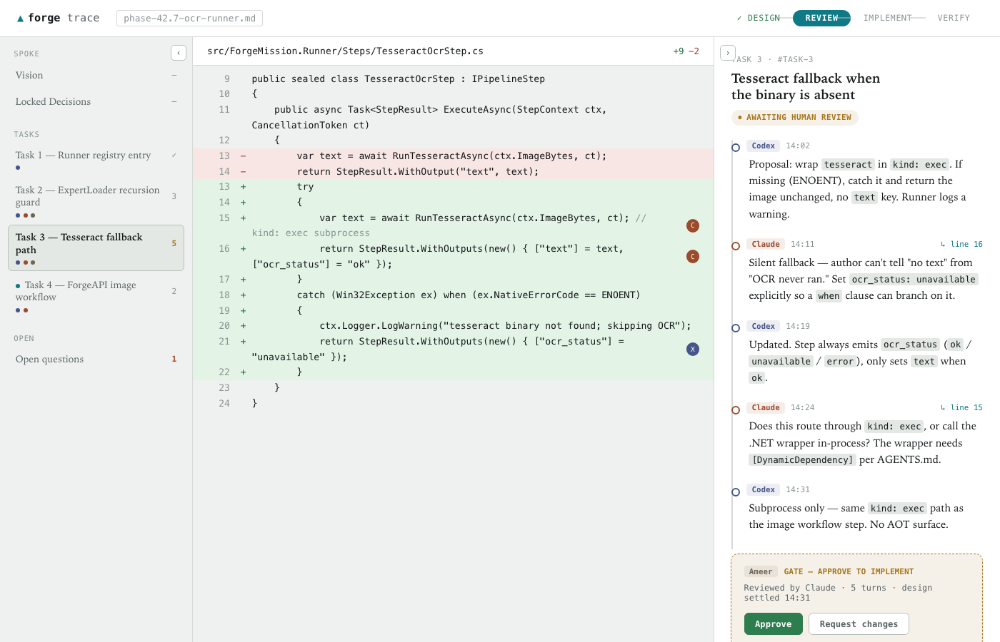
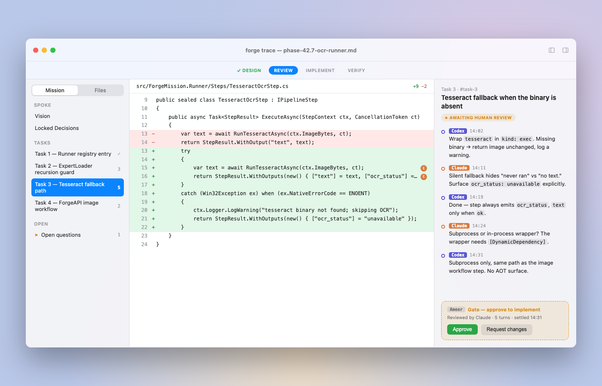
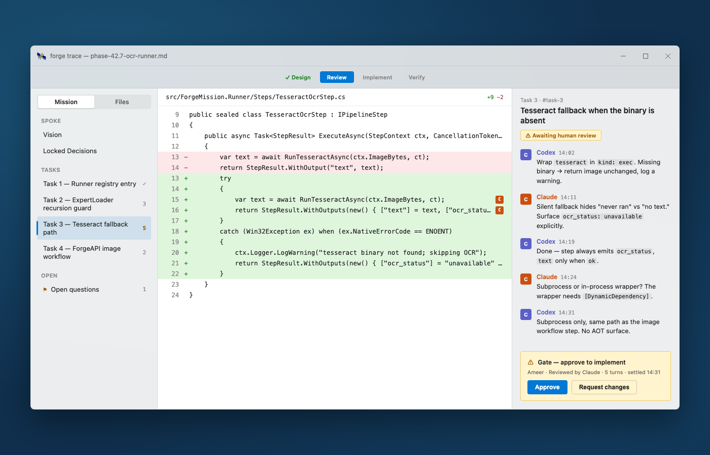
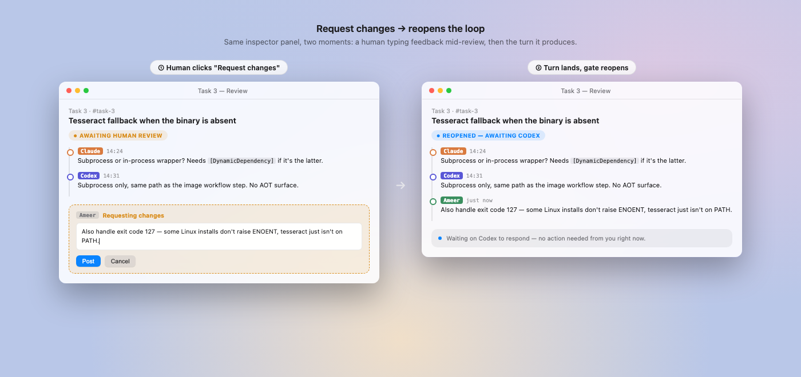
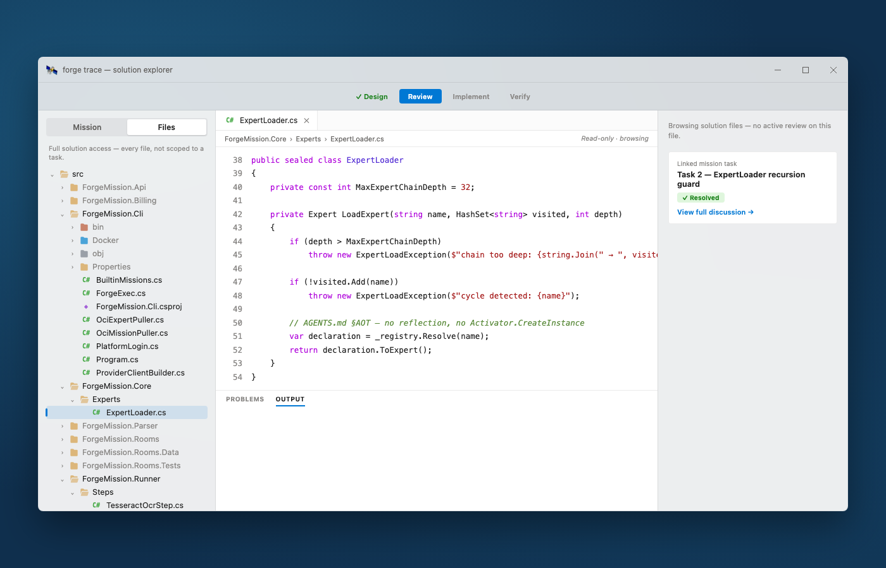
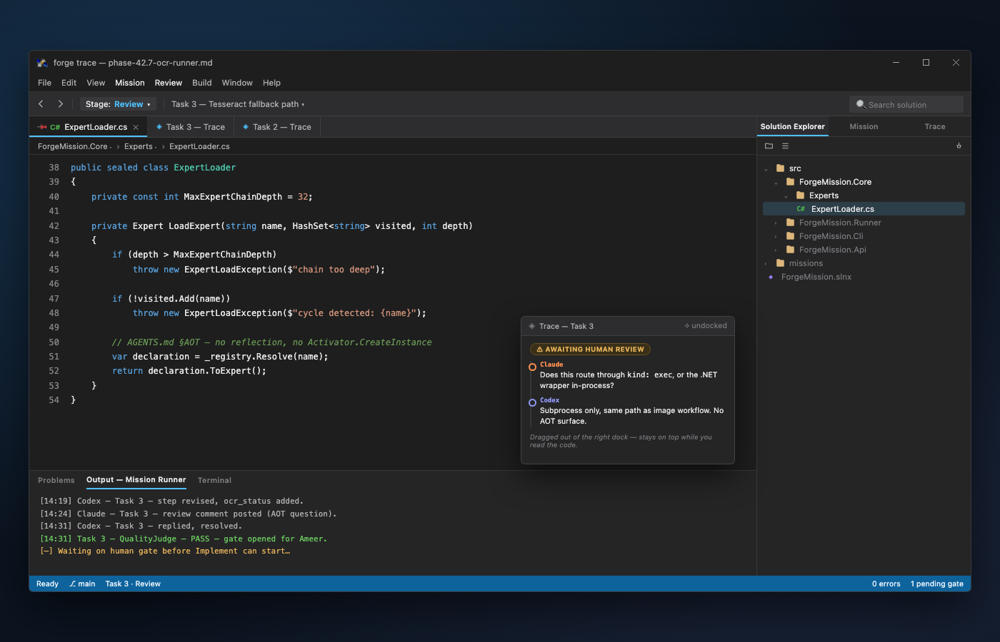

# Brainstorm: an IDE surface for AI-workflow collaboration (`forge trace`)

**Status: conceptual only — not decided, not scoped as a phase.** Captured from a design
conversation on 2026-07-20. If this gets picked up, split it into a proper phase hub/spoke per
`AGENTS.md`; don't build directly from this doc.

## The problem

Design, review, and approval work between a human and multiple AI collaborators (e.g. Codex as
implementer, Claude as reviewer/architect) is currently conducted by copy-pasting text between
separate chat surfaces. Even inside one tool, the surface is a chat textbox — built for
WhatsApp-shaped back-and-forth, not for tracing a multi-turn design discussion, inspecting a diff
next to the argument about it, or gating an irreversible step on a human decision. The mismatch is
structural: a real SDLC review/approval workflow is being compressed into a surface with no
concept of anchoring, state, or suspension.

## The core idea: `forge trace`

Not a chat log — an IDE surface for watching and steering a running MCL mission, anchored to its
actual artifacts:

- **Outline** = the mission's own pipeline steps (not a bespoke schema) — `Architect`,
  `CriticalReviewer`, `Synthesiser`, `QualityJudge`, etc. — derived from the `.mcl` source.
- **Thread** = a rendering of consecutive `StepEnvelope`s as the pipeline actually ran, anchored
  to the file/line a step's output touched.
- **Gate** = a human step where the pipeline genuinely suspends (see
  [human-in-the-loop.md](human-in-the-loop.md)), not a UI illusion.
- **Code pane** = whatever file/diff the current step touched, with inline comment markers tied to
  specific turns.

## Grounding: this already maps onto real MCL, not a hypothetical

[`missions/sdlc-agent/mission.mcl`](../../missions/sdlc-agent/mission.mcl)'s `DesignMode`
(`Architect -> CriticalReviewer -> Synthesiser -> QualityJudge`, `loop(2)`) is close to exactly
the Codex-proposes / Claude-critiques / Codex-revises / gate-check shape the mocks visualize — see
[sdlc-meta-mission.md](../design/sdlc-meta-mission.md) and
[interaction-modes.md](../design/interaction-modes.md) for the classifier-router pattern behind
it.

### The debugger framing

The IDE isn't hosting a chat panel next to code — it's closer to a debugger attached to a running
mission. Every trace concept maps onto a decades-proven debugger primitive:

| Debugger concept | Maps to |
|---|---|
| Call stack / step list | The outline — the pipeline's steps |
| Execution trace | The thread pane — consecutive `StepEnvelope`s |
| Breakpoint | A `kind: human` step — genuinely suspends (`Suspended` outcome) |
| Locals/watch window | The context bag (`feedback`, `mode`, ...) |
| Edit-and-continue | Human types feedback → resume seeded with it |
| Source view tied to the current frame | The code pane — whatever file the current step touched |

That's why VS/Xcode ergonomics transferred so cleanly when collapsible panes were added to the
mocks — not decoration, but the same underlying problem: pause a running process, inspect its
state, let something intervene, resume.

## Relationship to `human-in-the-loop.md`

[human-in-the-loop.md](human-in-the-loop.md) is the mechanical spec this depends on: `kind: human`
reusing existing roles (no new `role:` needed — `role: judge` fail/pass + prose-output already
cover it), a `channel:` field resolved like `provider:` in `ProviderClientBuilder`, and
suspend/resume via a `Suspended` `StepEnvelope` outcome. `forge trace` is naturally a **new
channel**, not a competing product — it gets resume-token/webhook plumbing for free and only owns
rendering.

Confirmed mechanism: a human's "Request changes" writes to `context["feedback"]`, the same slot
`role: judge` failures already use to drive `loop(N)` retries
([`PipelineRunner.cs:71,189-190`](../../src/ForgeMission.Core/Runtime/PipelineRunner.cs)). No new
protocol needed for the human case.

**Open tension, not yet resolved:** `ForgeMission.Rooms` (`MemberKind.Human`/`Agent`, `Room`,
`Message`) already exists, live, with real server-side state — the doc's "easy channel." But its
chat-room rendering was explicitly ruled out as the wrong UX for this (see below). The reusable
part is suspend/resume + the channel abstraction, not the Rooms chat surface itself — `forge
trace` is a sibling rendering, deliberately not the room view.

## Full solution access + trust gradient

A skeptical human, especially early on, will want raw file access — not just the diff scoped to
the active step. Decision (2026-07-20, provisional): **full access model, unscoped** — no
permissions/visibility layer for now (YAGNI; revisit if a real need surfaces).

Two modes, both first-class, cheap to switch between — not one default forever:

- **Scoped/curated** — diff view tied to the active step, inline comment markers, gate card.
- **Raw/full** — plain source (no diff coloring, no comment markers, marked "read-only ·
  browsing"), full file tree, unscoped. Still cross-links back to a relevant task if one exists,
  without forcing it.

Precedent: Xcode/VS's Solution Explorer isn't gated behind an active debug session — it's
always-there chrome, independent of whatever frame you're paused on.

## Dockable workbench, not a fixed 3-pane layout

Borrowed from Visual Studio's docking model (a real VS 2026 screenshot supplied the reference —
see Visual references below): panel groups are **tabbed** (Solution Explorer / Mission / Trace
sharing one dock zone, like VS's own Copilot Chat / Solution Explorer / Git Changes cluster),
**relocatable** (Trace can leave the sidebar and live as a document-area tab instead), and
**floatable** (a panel can be pulled loose to stay on top while reading something else). The stage
indicator (Design → Review → Implement → Verify) lives as a toolbar dropdown, the same slot VS
uses for its Debug/AnyCPU config.

This directly answers an open question from the collapsible-pane iteration: instead of deciding
once where each surface permanently lives, the workbench treats Solution Explorer, Mission
outline, and Trace as interchangeable surfaces a person docks, tabs, or floats depending on the
task at hand.

## Cross-platform exploration

Static HTML/CSS mockups only (not working code, rendered to PNG for this doc) — used to validate
the concept visually before committing to a platform.

### Web-console concept

Outline/BRD · code diff · anchored thread, collapsible panes borrowed from VS/Xcode auto-hide.

### Native macOS concept

Traffic-light chrome, translucent sidebar, system-blue accents.

### Native WinUI/Fluent concept

Mica chrome, Segoe UI Variable, Cascadia Code, InfoBar-style gate.

### Request-changes flow (Claude / Codex / human)

The human-composes-feedback → turn-lands-on-the-trace sequence, shown as a before/after pair —
the moment a human contributes mid-review, not just approve/reject at the end.

### WinUI solution explorer

The raw/full file-browsing mode, matched to this repo's actual `src/` structure — no diff
coloring, no comment markers, "read-only · browsing" instead of a diff stat.

### VS-style dockable workbench

Tabbed / relocatable / floatable panel groups (see above) — the direct answer to "where does each
surface live."

A real SwiftUI source file was also sketched and typechecked clean against the macOS 14 SDK (one
bug found and fixed: a `Color`/`ShapeStyle` ternary mismatch) — not wired into an Xcode project,
not verified to run, just confirmed syntactically sound as a possible starting point.

## Visual references

Two reference screenshots were pasted directly into the design conversation — a VS Code Explorer
panel, and a Visual Studio 2026 docking layout — and directly shaped the WinUI solution-explorer
and dockable-workbench mockups above. They arrived as inline chat images with no accessible file
path in this session, so the originals could not be saved into the repo; the mockups above are
this session's reconstruction of what they showed, not the originals themselves. If the originals
are worth keeping too, save them under `docs/brainstorm/images/` and this doc can link them
directly.

## Open questions / not yet decided

- Whether `kind: human` needs config beyond `channel:` for trace's anchor metadata (file/line, not
  just a channel-rendered prompt) — flagged as an open question in `human-in-the-loop.md`, sharper
  here because trace's anchoring is more structured than a Slack/email prompt.
- Whether `loop(N)` retries should render as repeated history on the trace or collapse — raised,
  not answered.
- Whether the Rooms domain model (`Member`/`Message` types) is reused as trace's persistence layer
  or trace gets its own — leaning toward reuse of suspend/resume + channel abstraction only, not
  settled.
- Platform choice (native macOS, native WinUI, or the web-console version) — not decided; all
  three were explored to compare ergonomics, none committed to.
- Not scoped against any phase or timeline yet.
