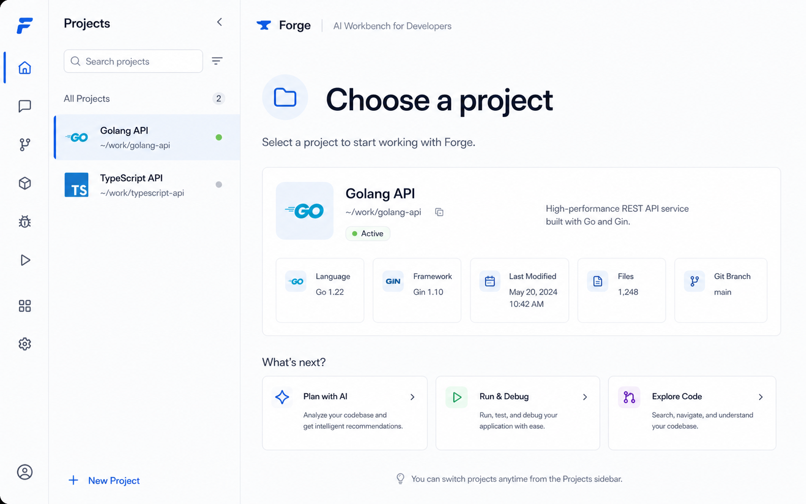
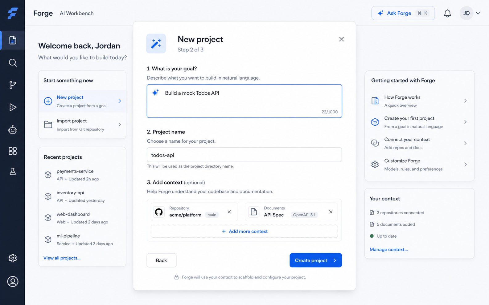
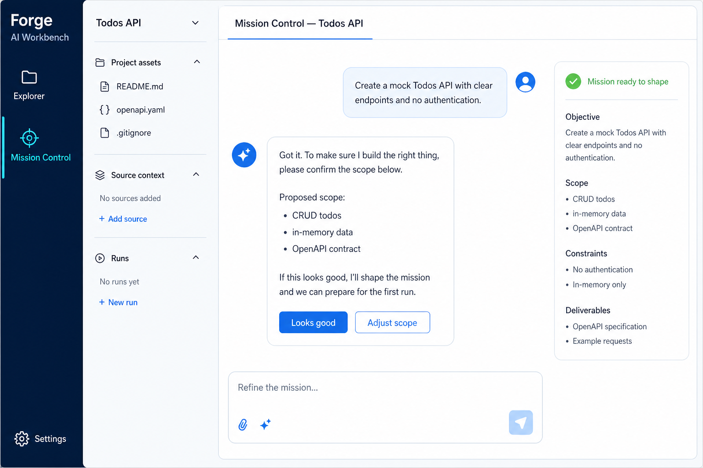
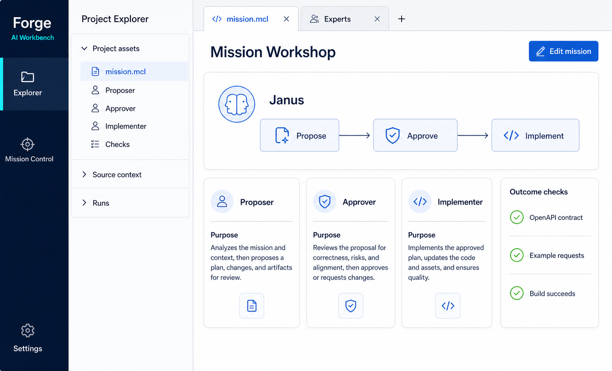
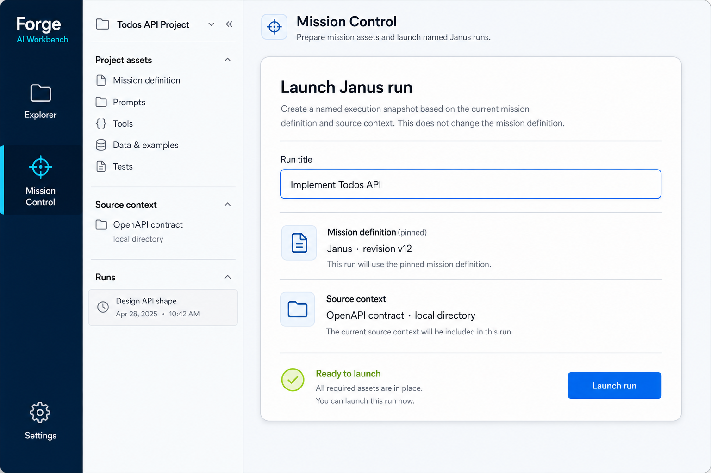
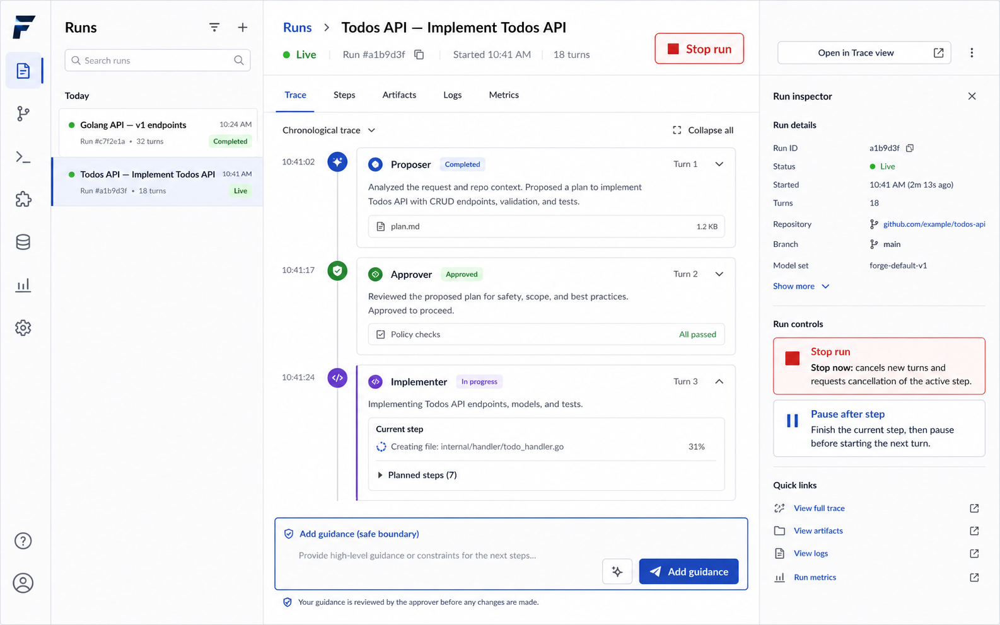
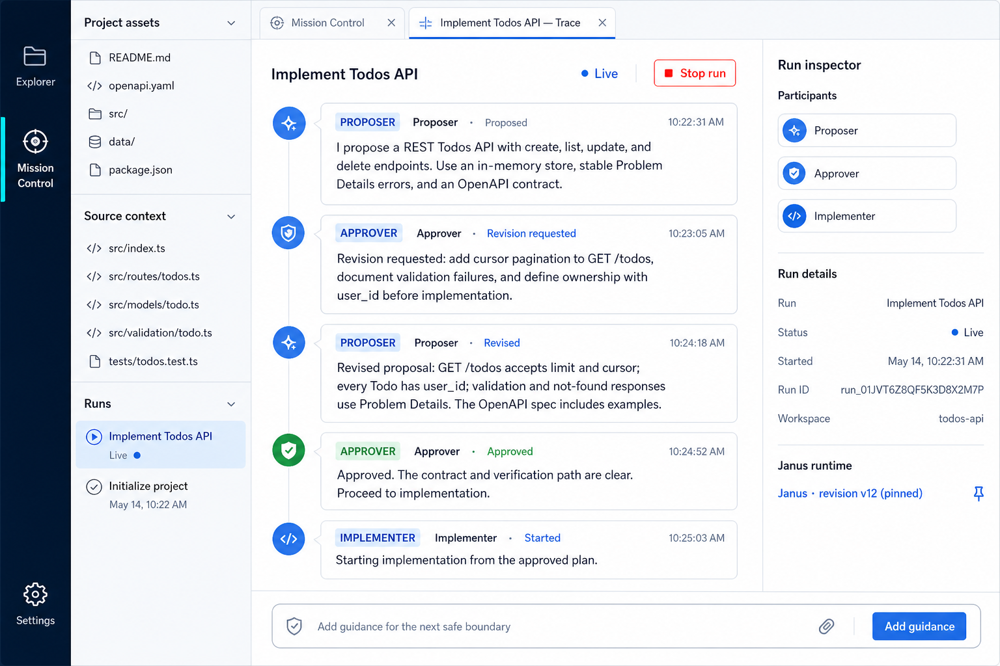
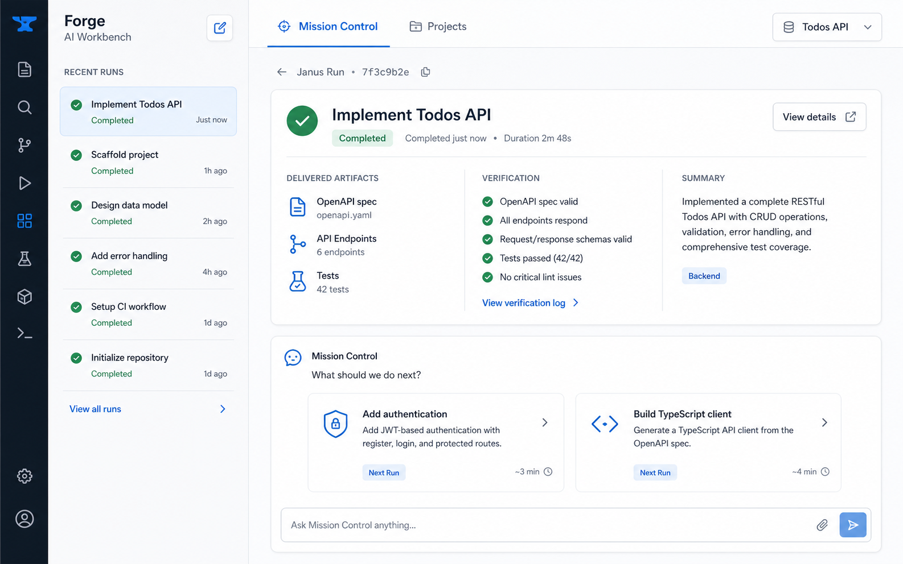

# Brainstorm: project Mission Control and Janus runs

**Status: interaction direction captured 2026-08-30.** This is product-design input to
[Phase 43.20 — Project Workbench MVP](../../phases/phase-43.20-project-workbench-mvp.md), not an
implementation handoff by itself. The phase spoke carries the requirements an implementer must
build against. A complementary [Anders Hejlsberg / Michael Truell design-lens review](design-review.md)
tests the direction without claiming either person's actual view.

## The model

A user works in a **Project**: the durable, goal-oriented workspace analogous to a Visual Studio
project or JetBrains solution. It has one enduring **Mission Control** conversation, its mission
assets, context, and a history of work. Its identity is a Forge-owned project manifest that records
metadata and references to the relevant files and directory structures; it is **not** a Git
repository. The manifest is a local project file, like a `.csproj` or IntelliJ project
configuration—not a hosted shared workspace with membership or project-level roles.

```
Forge workspace
└── Project — e.g. Todos API, Golang API, TypeScript API
    ├── Mission Control — the long-lived human ↔ Forge REPL
    ├── Project assets — mission.mcl, expert prompts, profiles, context, checks
    ├── Source context — attached files, directories, repositories, and artifacts
    └── Runs — named executions launched from the project
        └── Janus trace — a debugger-like view of Proposer → Approver → Implementer
```

This names the layers deliberately. In MCL, a `mission` is an executable definition; **Janus** is
a reusable mission/team definition, not a project or a conversation name. A **run** is a specific
execution of that definition. The user-facing project and run titles describe the work, such as
`Golang API` and `Implement Todos API`.

Related work becomes a later run in the same project. A distinct objective with a separate purpose,
membership, or lifecycle becomes a new project. If the Go API and TypeScript API are parts of one
product with shared context and lifecycle, they can instead be workstreams inside one project.

A Project may reference zero, one, or many Git repositories, alongside arbitrary local directories,
documents, generated artifacts, and configuration. Git is optional attached context; a project can
span a monorepo, several repositories, or no repository at all. A repository change never by
itself creates or splits a Forge Project.

The baseline authority model is therefore local: the person running Forge can edit project assets,
launch, guide, pause, or stop its runs. Any sensitive external action is governed by the local
credentials and explicit capability/approval policy of that action—not by a speculative
Project-owner/contributor permission system. Version control may share the project manifest and
assets in the ordinary way; real-time hosted collaboration is a separate future product decision.

## Locked MVP activity rail

The workbench keeps a small, VS Code-like vertical activity rail. It is deliberately not a menu of
every possible object in Forge. The three entries below are the initial MVP contribution set, not a
closed or hard-coded list: later Forge capabilities can register an additional rail entry, pane, and
document surface without changing the Project, Mission Control, or Run model.

1. **Project Explorer** — a collapsible file/folder navigator for the selected local Project:
   Mission assets, source context, and the Project-owned Runs.
2. **Mission Control** — a control-tower entry point to the Project's continuing Forge conversation.
   Its active and recent run cards link directly to their corresponding trace documents.
3. **Settings** — a gear fixed at the bottom of the rail. For the MVP it opens an intentionally
   empty placeholder surface, reserving a stable home for settings without inventing their scope.

There is no separate **Runs** rail application: a Project owns its runs, Mission Control launches
and links to them, and a selected run opens as a trace document. Notifications are deferred entirely
from the MVP, including a rail icon; later they can become a workspace-level attention inbox for
human intervention that deep-links to the owning Project, run, and trace.

## Locked MVP visual language

The workbench uses a light, calm content canvas paired with a dark navy activity rail. Forge blue
and cyan express navigation, selection, and interactive actions; lime is reserved for positive,
approved, or healthy states. Borders, inactive icons, and supporting text use restrained blue-gray.
The palette should feel technical and distinctive without becoming a neon or rainbow interface.

Every journey mock uses the same rail in the same order: **Project Explorer** (folder), **Mission
Control** (control-tower/crosshair), then **Settings** (gear, fixed to the bottom). The currently
open surface alone receives the cyan selected treatment. No mock introduces a fourth rail entry,
including Notifications or a standalone Runs view.

## The chronological experience

### 1. Choose a project

Forge opens with Project Explorer selected. The user selects an existing project—such as `Golang
API` or `TypeScript API`—or creates a new one. The activity rail is persistent; its side panes are
manually collapsible, like VS Code.



### 2. Create a project from a goal

The user can begin with a natural-language goal, for example: “Build a mock Todos API.” They name
the project and optionally attach one or more repositories, product documents, directories, or an
API specification. This
creates the durable project boundary; it does not silently start an implementation run.



### 3. Refine the work in project Mission Control

Every project has its own Mission Control: a long-lived, REPL-like conversation for refining the
brief, constraints, and intended outcome. It is the default human-facing chat and is deliberately
not polluted by the full agent-to-agent transcript.



### 4. Shape the mission assets

Mission Control helps create and evolve the project’s reusable assets: `mission.mcl`, expert
instructions, profiles, context sources, and outcome checks. This is a first-class workbench
surface, not hidden configuration. The definition stays editable before the user launches work.



### 5. Launch a named Janus run

When the project context is ready, the user launches a run with a meaningful title such as
`Implement Todos API`. Forge records the run’s project context and pins the mission-definition
version used for it. Later edits affect future runs, never rewrite the history or meaning of an
existing one.



### 6. Inspect and steer the Janus trace

The selected Project-owned run opens as an inspectable Forge Trace document. Mission Control remains
the control surface and lists active and recent named runs; selecting one opens its trace without
turning the trace itself into a generic chat room. The selected trace shows the real
Proposer → Approver → Implementer exchange, state, artifacts, and a genuine safe-boundary guidance
control. It also shows three deliberately different intervention paths: **Add guidance** for the
next safe boundary, **Pause after step** to finish the active bounded action before stopping, and
the prominent red **Stop run** break-glass control for drift or an unsafe direction. Selecting a
run never hides, merges, or replaces the other run records in Mission Control.

**MVP trace navigation decision (2026-08-30):** clicking a named Project-owned run opens its one
trace document, where the original expert messages are read in chronological order. The MVP has no
expert filters, search, jump-to-current/start controls, threaded views, or other transcript
navigation system. Those can be added only after use demonstrates the need.



#### The expert conversation is the trace's primary evidence

The compact timeline is useful for scanning, but it must never reduce the Janus exchange to status
labels or force the human into a different chat product. The same trace document has an **expanded
conversation** form: each chronological expert turn renders the actual Proposer, Approver, and
Implementer message inline, together with its role, outcome, timestamp, and links to the proposal,
feedback, or other attached artifact. The human can read the whole argument—proposal, revision
request, revised proposal, approval, then implementation start—without leaving the selected run.

**Exact-message decision (2026-08-30):** “actual” means the original durable message exactly as
stored. Forge must not silently summarise, rewrite, or shorten a turn in the trace. If a content
policy requires a redaction, the trace shows an explicit redaction marker rather than presenting a
replacement as though it were the expert's original text.

**MVP artifact decision (2026-08-30):** a message card may show a simple link to its proposal,
feedback, diff, OpenAPI specification, or other artifact. The MVP does not create inline artifact
previews within the trace; following the link opens the artifact in its own document surface.

For a conversation-centred Janus run, this expanded form is the default reading surface. A compact
timeline is a density control, not a replacement for the message content. Mission Control remains
the human ↔ Forge REPL; the trace is where the experts speak with one another.



### 7. Return the outcome to Mission Control

On completion, the run returns a concise outcome card to the project: artifacts, verification
evidence, and a summary. Mission Control becomes the place to understand the result, refine the
project, and launch the next related run—rather than making the user reconstruct the project state
from a raw transcript.



## Workbench behaviour implied by the flow

1. **Mission Control is project-scoped.** Opening `Golang API` and `TypeScript API` opens
   different durable control conversations and context, rather than two tabs over one global chat.
2. **A Project owns its runs.** Mission Control launches and summarizes them; its active and recent
   run cards open the selected run's trace.
3. **Run traces are inspectable documents.** They are dockable alongside source, diffs, artifacts,
   and mission-definition views. The expert conversation is readable inline in the trace; it is not
   hidden behind a generic chat room or a status-only timeline.
4. **The activity rail is intentionally small.** Project Explorer and Mission Control open
   collapsible side panes; Settings is fixed at the bottom. There is no separate Runs surface or
   Notifications icon in the MVP.
5. **Durability remains server-owned.** The workbench discovers projects, conversations, and runs
   through projections of canonical durable state. It must not maintain a second UI-owned
   transcript store.
6. **A run has an immutable launch snapshot.** Its project context and mission-definition version
   are recorded when it starts, so its trace and outcomes remain reproducible and intelligible.
7. **Stopping is a deliberate next capability, not UI theatre.** The run-trace mock shows the
   intended red `Stop run` control adjacent to `Live`, not inside an overflow menu. Its durable
   runtime implementation is explicitly deferred until immediately after this UI exercise; see
   [the backlog](../../backlog.md). When built, it will block queued/future turns, request
   cancellation of the active provider or tool operation, enter `Stopping…`, and durably record
   the request, observed result, and known partial effects. It will never imply rollback of
   external effects. `Pause after step` and `Add guidance` remain separate, non-emergency controls.

## Run control is separate from the editable mission workflow

The future platform-owned **run-control lifecycle** carries only the safety and scheduling facts
the runner must understand: `Draft`, `Queued`, `Live`, `Pausing`, `Paused`, `Stopping`, `Stopped
by user`, `Failed`, and `Completed`. These are stable machine semantics, with an auditable event
for every transition; their display labels may evolve, but their meaning cannot be casually renamed
or reordered without changing runner behaviour. This durable stop/pause layer is deferred until
after the UI exercise.

Terminal and uncertain runs are append-only history. A run that is `Stopped by user`, `Failed`, or
`Interrupted` is never silently replayed or overwritten; recovery creates a new, separately named
run that points back to the prior one. A future checkpoint feature may offer an explicit resume
only from a recorded, verified safe boundary. It must never resume an uncertain in-flight provider
or tool operation.

The mission-owned **workflow** is a separate, versioned definition. It supplies the named stages,
experts, ordered steps, gates, and transitions visible inside a trace—for example `Propose →
Approve → Implement`. A project may rename a stage, insert a verification step, or reorder the
workflow as it learns. That creates a new mission-definition version for future runs. An existing
run retains the exact workflow snapshot it launched with, so its trace remains understandable even
after the project evolves.

The workbench renders both layers: a stable run-control status such as `Live` or `Paused`, plus the
definition-driven current stage and step. It must not encode Janus’s three roles, a fixed number of
steps, or a particular stage order in the client.

## Current governance scope: composed wrapper

MCL currently composes named missions; it does not have inheritance syntax. The UI exercise can
therefore model shared governance using a visible, reusable wrapper:

```mcl
mission GovernedJanus(task) = {
    PlatformPreflight(task: task)
    -> Janus(task: task)
    -> PlatformFinalise
}
```

`PlatformPreflight` and `PlatformFinalise` provide an explicit home for reusable checks and
reporting—such as security review, policy checks, logging, or budget reporting—and the launched
entry mission is `GovernedJanus`, not raw `Janus`. This answers the composition and extensibility
question: the wrapper and its stages can evolve like any other versioned mission, while a run pins
the exact definition it used.

Composition does **not** itself enforce a hard resource limit or cancel an in-flight provider/tool
call: raw `Janus` could still be invoked directly and a mission step cannot govern the host while it
is executing. The non-bypassable runtime enforcement layer—durable `StopMission`, cancellation
source ownership, budget/capability enforcement, and truthful terminal outcomes—is deliberately
deferred to the next item after this UI exercise.

## Lightweight context provenance

A run records only provenance that Forge can obtain without meaningful extra work: the selected
paths/directories, the Git revision when a referenced repository has one, and an identifier or
content hash for an explicitly attached file or generated artifact when that value is already
available. Forge does **not** crawl or hash an entire workspace merely to launch a run. Credentials,
secret values, and secret-derived material are never recorded in the manifest or trace.

## Product and runtime fit

The existing durable Conversation service provides the right lower-level identity boundary: a
`ConversationId` owns an ordered event transcript and can contain more than one run. The proposed
Project layer is the user-facing owner of that control conversation, mission assets, and related
runs; it is later work beyond the initial Janus proof. The project and run lists must be queries or
projections over canonical durable state—not parallel browser-side histories.
