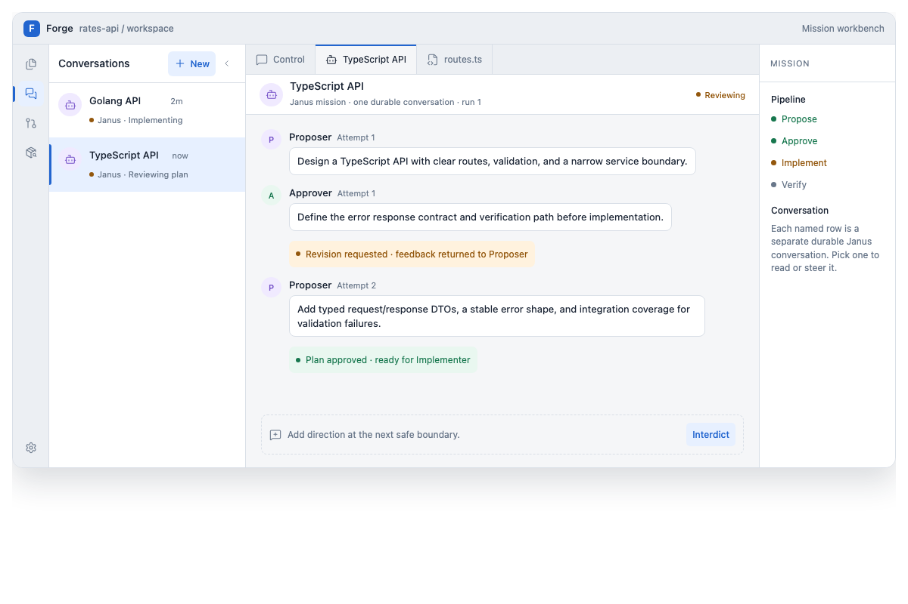

# Brainstorm: mission conversations in the Forge workbench

**Status: interaction direction captured 2026-08-30.** This is a visual/product-design input to
[Phase 43.4 — IDE trace surface](../../phases/phase-43.4-ide-trace-surface.md), not an
implementation handoff by itself. The phase spoke carries the requirement an implementer must
build against.

## The model

**Janus is a reusable mission/team definition, not a single conversation.** Starting Janus for a
distinct objective creates one separately named, durable mission conversation. For example:

- `Golang API` — one Proposer → Approver → Implementer exchange and its own tool activity,
  approvals, artifacts, and outcome.
- `TypeScript API` — a different exchange with the same Janus roles, entirely separate history and
  outcome.

Related follow-up work may continue as a later run in its existing conversation. A new, unrelated
objective starts a new conversation. The user-facing title is the objective (`Golang API`), while
`Janus` appears as the mission/type and status, rather than becoming the row title.

## Required workbench behaviour

1. The vertical activity rail has a **Conversations** (or **Missions**) view alongside Explorer,
   Changes, and Artifacts.
2. Selecting that view shows a named, Rooms-like conversation list beside the active transcript. It
   includes a visible New button and one row per durable conversation.
3. The conversation list is visible by default at ordinary Desktop/workbench width, but is manually
   collapsible exactly like VS Code's primary sidebar. The activity rail remains visible and restores
   the list. On constrained layouts the inspector collapses before the conversation list; only a
   genuinely narrow/mobile layout may hide the list automatically.
4. Selecting a row changes the active transcript/trace. It does not merge histories and does not
   erase the other conversation from the list.
5. The selected conversation is a dockable document/workbench surface. Its trace, mission outline,
   source/diff tabs, artifacts, and eventual human-intervention controls remain tied to that one
   conversation.

The interaction is intentionally **not** a generic chat-room UI: the list borrows the familiar
Rooms navigation pattern, while the selected surface remains Forge Trace — a debugger-like mission
view with pipeline state, artifacts, and a genuine safe-boundary intervention model.

## Product and runtime fit

The durable Conversation service already provides the right identity boundary: one
`ConversationId` owns an ordered event transcript and can contain more than one run. The workbench
needs a conversation-list query/projection to discover these records; it must not recreate a
second client-side transcript store. The initial Janus proof has one selected conversation; the
multi-conversation list is later Forge Trace/workbench work.
