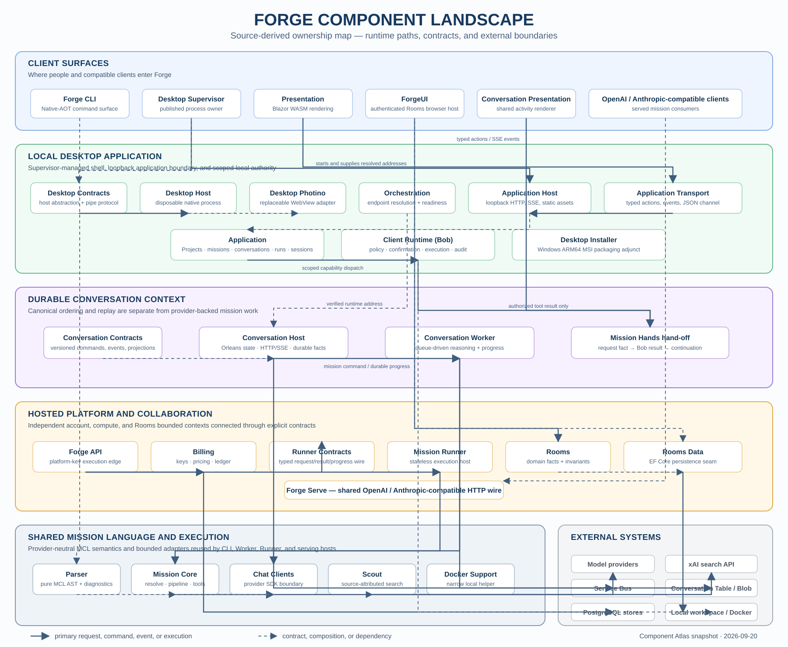

# Forge component landscape

This is a source-derived orientation map, not a deployment diagram or a new
architecture decision. It groups the 28 non-test components in the
[Component Atlas](../../src/README.md), plus the adjacent Desktop Installer
packaging project, by their documented ownership and shows the primary
control/data paths between them. Test projects and diagnostic probes are
deliberately omitted: they validate component boundaries rather than introduce
runtime ownership.

Read it from the outside in:

1. Clients enter through the CLI, Desktop, or the authenticated Rooms browser
   surface.
2. The local Desktop path keeps rendering, typed transport, application use
   cases, process supervision, and local capability authority separate.
3. Durable conversations separate canonical state and HTTP/SSE projection
   (Conversation Host) from queue-driven mission reasoning (Conversation
   Worker).
4. Hosted execution keeps the public API edge, account settlement, stateless
   Runner, and Rooms collaboration context separate.
5. Mission Core, the parser, provider adapters, and optional search are shared
   execution building blocks; they never acquire UI, account, or local-tool
   authority.

Solid arrows show the main request, command, event, or execution path. Dashed
arrows identify a contract, composition, or dependency relationship. External
systems are shown in grey; their presence does not imply that every local path
uses them. In particular, Docker support is an optional local-development
helper, while the Desktop’s default Mission Runtime is the cloud endpoint.

The canonical architecture and ownership rules remain
[Forge Architecture](forge-architecture.md),
[Durable Conversations](durable-conversations.md), and
[Security Architecture](security-architecture.md). Update this map whenever a
component is added, removed, or given a materially different owner.
