# How conversations work

> **Status: draft, 2026-10-01. Section 4 waits for Phase 53.9.** This doc explains a Forge
> conversation from end to end: a turn, storage, live events, clients, hands, and failure. It
> replaces the stale parts of [durable-conversations.md](durable-conversations.md) (`MissionRunGrain`,
> grain-storage checkpoints, `PendingTransition`). It matches Host 0.8.0, runner 0.19.0, ForgeAPI
> 0.7.0, Contracts 0.7.0, Client 0.6.0 and Core 0.1.3.

Repos are named by their short name (`forge-conversations`, `forge-runner`, …). Paths without a
repo prefix are in `forge-conversations/src/ForgeMission.ConversationHost/`. An *inference* is a
claim not checked in code or live; it is marked where it appears.

## Overview

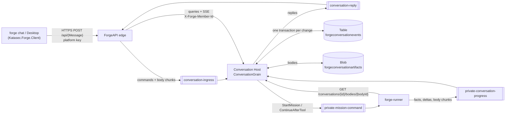

| Part | Owns | Talks to |
|---|---|---|
| Client (`forge chat`, Desktop) | Local project, hands (Bob), rendering | ForgeAPI only (`/api/{MessageName}`) |
| ForgeAPI edge | Nothing durable; auth, credit check, body chunking | Ingress/reply queues; direct Host queries (`forge-platform … Conversations/ConversationEndpoints.cs`) |
| Conversation Host | Every conversation: state, events, bodies, live fan-out | Table, Blob, all four conversation queues |
| forge-runner | Nothing durable except Service Bus session state | Command and progress queues; Host body route |

Commands go over Service Bus; queries (including the event stream) are direct HTTP reads
([command-bus architecture](command-bus-architecture.md)). The Host has internal ingress only;
the edge sets the member header (`README.md` → Identity).

---

## 1. A turn's life

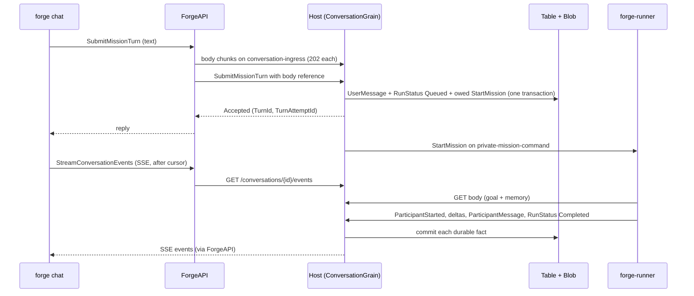

1. **Submit.** The client posts `SubmitMissionTurn` to ForgeAPI. The edge checks credit, sends the
   text as body chunks, waits for a 202 per chunk, then sends the command with a body reference
   (`ConversationEndpoints.cs`; `Messaging/Ingress/ConversationIngressHandler.cs:78`). The edge
   waits up to 30 s for the Host's reply (`ConversationCommandBus.cs:68`).
2. **Accept.** The grain rejects a second turn while one is active (`RunAlreadyActive`,
   `Grains/ConversationGrain.cs:305`). Otherwise it composes memory (prior turns, 32 KiB budget)
   and commits `UserMessage` + `RunStatus: Queued` + an owed `StartMission` in one transition
   (`PlanRunStart`). The turn's attempt id is the run id.
3. **Dispatch.** After the commit, the grain sends `StartMission` (`MessageId` = `CommandId`) and
   records it as sent (outbox, [section 6](#6-failure-and-recovery)).
4. **Run.** The runner reads the goal and memory through the Host body route, runs the mission
   through Core, and publishes facts in order on the conversation's Service Bus session
   (`forge-runner … Conversations/MissionCommandProcessor.cs`).
5. **Record.** Each fact is one grain commit; each committed event goes to live readers. The turn
   ends at `RunStatus` Completed, Failed, Interrupted or Cancelled.

---

## 2. Storage

### One commit = one entity-group transaction

`ConversationGrain` is a `JournaledGrain<ConversationState, ConversationTransition>` on Orleans'
`CustomStorage` provider (`Grains/ConversationGrain.cs:46`, `Program.cs:82`). The grain itself is
the storage adapter: `ReadStateFromStorage` reads the `s-state` row; `ApplyUpdatesToStorage`
writes the state row, the new event rows and their receipt rows in **one** Table transaction
(`Persistence/AzureTableConversationEventStore.cs:59-81`). Either all rows land or none do, so
there is no crash gap between "event written" and "state saved". `PendingTransition` and grain
storage are gone.

| Row | Key | Holds |
|---|---|---|
| State | `s-state` | Journal `Version`, the serialized state in 64 KiB binary chunks (max 960 KiB) |
| Event | `0-{sequence:D19}` | Public event JSON (max 30 KiB, bodies excluded), body references, run id |
| Receipt | `1-{eventId:N}` | Sequence, event JSON, the accepted command (max 32 KiB) — answers "already accepted?" |

Limits are in `Persistence/ConversationJsonLimits.cs`. The 30 KiB event cap keeps JSON inside a
Table string property (32K UTF-16 units).

### Conditional events

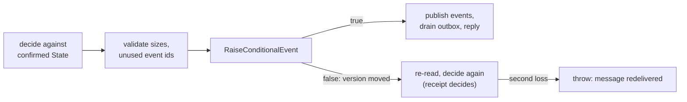

Every mutating call goes through `CommitTransitionAsync` (`Grains/ConversationGrain.cs:1330-1361`).
It never uses unconditional `RaiseEvent`, because Orleans would retry that on top of newer state
without re-validating. A conditional event that loses (412 on the state ETag, or 409 on the
first-write Add) is re-decided once; on the retry the receipt row turns a duplicate into
"already accepted". A method returns only after its commit is confirmed, so queue consumers
complete a message only once it is durable.

### Bodies in Blob (claim-check)

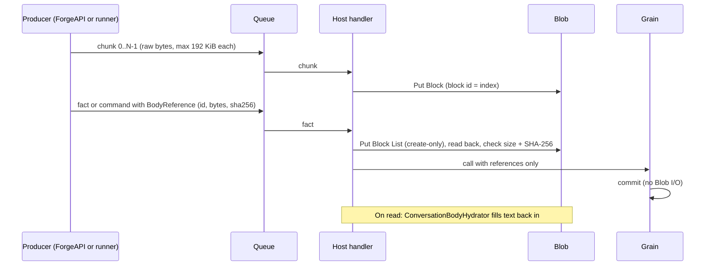

Every string a user, model or tool sizes (messages, error reasons, tool arguments and results,
goals, the runner's continuation, composed memory) is a **body**. It is stored once in Blob at
`{tenant}/{conversationId:N}/bodies/{bodyId:N}` (`Persistence/AzureBlobConversationBodyStore.cs:86`).
The event row keeps a reference. Body ids are deterministic per owning fact and field, so a
retry writes the same blob.

| Step | Where |
|---|---|
| Edge chunks client text; over 4 MiB → 413 before any send | `forge-platform … ConversationEndpoints.cs:119-192` |
| Runner sends chunks before the fact on the progress session | `MissionCommandProcessor.cs` (Outbox) |
| Put Block per chunk, Put Block List create-only, verify size + SHA-256 | `AzureBlobConversationBodyStore.cs:28,131`; `Api/ConversationBodyIntake.cs` |
| Missing chunks: progress → Error + Failed; ingress → 400 `bodyIncomplete` | `Messaging/ConversationProgressHandler.cs:79-93`; Host README |
| Hydrate on every read: events, SSE, snapshot, run history, hands work, memory | `Persistence/ConversationBodyHydrator.cs` |
| Runner reads command bodies | `GET /conversations/{id}/bodies/{bodyId}` (`Contracts/ConversationBodies.cs:79`; `forge-runner … ConversationHostBodyReader.cs`) |

**Why 4 MiB** (`Contracts/ConversationBodies.cs:22`): it is a guardrail, not a storage limit. A body
over ~1M tokens is larger than a model context; model replies are at most ~512 KB; client text is
untrusted input (Phase 54 B2). Service Bus Standard caps a message at 256 KB, hence 192 KiB
chunks.

---

## 3. Live events

### Fan-out: grain → observers → hub → SSE

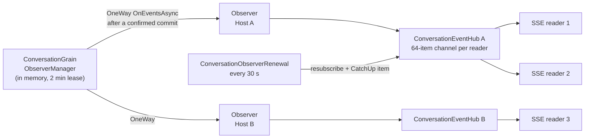

- Each Host keeps one observer per conversation it has readers for. The first reader subscribes
  it on the grain; the last one leaving unsubscribes it (`Api/ConversationEventHub.cs:10-22`).
- The grain notifies observers one-way after a confirmed commit, so a dead or slow Host never
  blocks a commit (`Grains/IConversationEventObserver.cs:16`, `ConversationGrain.cs:888`).
- The observer list lives in memory and is lost if the grain reactivates elsewhere. Every 30 s
  each Host resubscribes and tells its readers to catch up from the Table
  (`Api/ConversationObserverRenewal.cs`). So a lost list costs at most ~30 s of live delay, never
  a lost durable event.
- A reader whose 64-item channel is full is dropped; its stream ends and the client reconnects.

### SSE cursor and gap rule

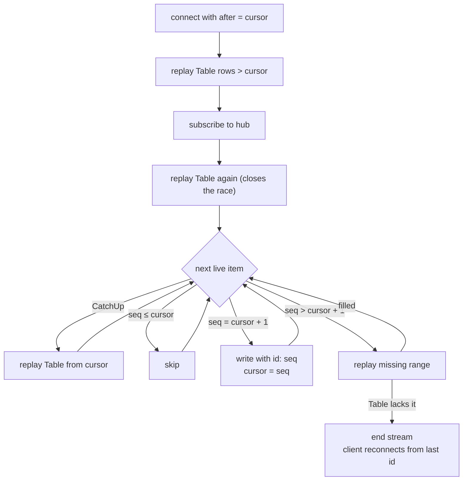

Sequences are contiguous, so the writer only ever writes `cursor + 1`
(`Api/ConversationSseWriter.cs:73-117`). A live event further ahead means a publish was missed (an
ambiguous commit publishes nothing), so the gap is filled from the Table first. Writing it directly
would move the client's `id:` past an event it never saw. Each event is hydrated before writing.

### Deltas

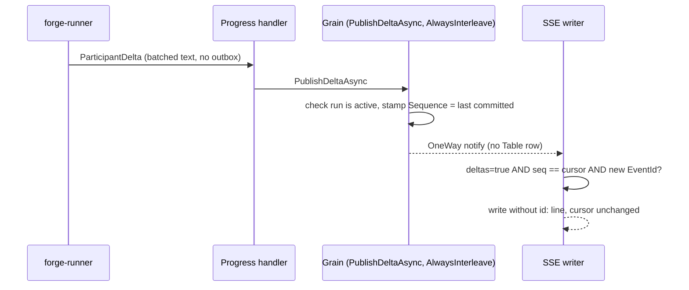

| Rule | Where |
|---|---|
| Runner batches: first chunk at once, then every 200 ms or 16K chars; flushed before the step's final message | `forge-runner … ConversationDeltaBatcher.cs` |
| Never stored: no row, no state, no memory; `RecordProgressAsync` rejects a delta; dead-letter ignores it | `ConversationGrain.cs:782`; `ConversationProgressDeadLetterHandler.cs` |
| `[AlwaysInterleave]`: a delta never waits behind a commit held in storage | `Grains/IConversationGrain.cs:77` |
| Written only with `deltas=true` and `Sequence == cursor`; no `id:`; never moves the cursor | `ConversationSseWriter.cs:91-96` |
| Redelivered delta written once per connection (last 128 ids) | `ConversationSseWriter.cs:150` |
| Opt-in through ForgeAPI `IncludeDeltas` (older clients fail on the unknown kind) | `forge-platform … ConversationEndpoints.cs:277-280` |

A delta stamped at N while a commit to N+1 is in flight is dropped by the cursor rule. That is
harmless: the step's final `ParticipantMessage` is the durable record.

---

## 4. Clients and turns

To complete after Phase 53.9 merges (one live stream per window, own turn vs other windows, one
turn at a time, Ctrl-C/Ctrl-D, reconnect).

**True and verified today for piped mode** (`forge chat` with redirected input;
`forge-mcl … ForgeChat.cs:291-375` on `main`):

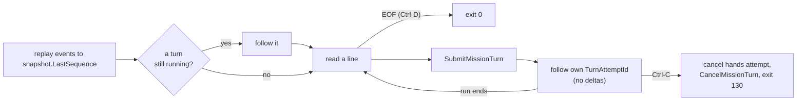

| Fact | Evidence |
|---|---|
| One turn at a time per conversation: a second submit while a run is active is `RunAlreadyActive` | `ConversationGrain.cs:305` |
| Piped mode follows only its own turn (by `TurnAttemptId`), without deltas, then reads the next line | `ForgeChat.cs:310-317` |
| A stream that closes is reopened from the cursor after 250 ms | `ForgeChat.cs:353-375` |
| Reopening replays prior turns with bodies hydrated | Phase 54 acceptance (codeword turns, 404,863-byte message) |
| A turn spanning a Host restart completes | Phase 54 Tasks 1+2 acceptance, turn 4 |

---

## 5. Hands

Hands let a mission read and change files on the user's machine. The Host only coordinates; the
local client (Bob, in forge-client) executes.

### Profiles

| Profile | Tools the runner declares | Used by |
|---|---|---|
| `NoHands` | none | `forge chat` (`Chat` mission), evaluations |
| `ProjectWorkspace` | Read, Write, Edit | `forge chat --hands` (`ChatHands` mission) |
| `ProjectWorkspaceAndTerminal` | Read, Write, Edit, Bash | defined; no default client uses it |

The runner declares tools with Core's `AgentToolDeclarations`, which have real JSON schemas
(`file_path` required) (`forge-runner … GenericDurableMissionExecutor.cs:62-68`). Core gives tools
only to `role: agent` experts (`forge-mcl … PipelineRunner.cs:888`), so `ChatHands` uses the
starter `Assistant` expert. A conversation's launch, and so its profile, is pinned at the first
attach and cannot change (`ConversationGrain.cs:443-465`).

### One-time approval (`forge chat --hands`)

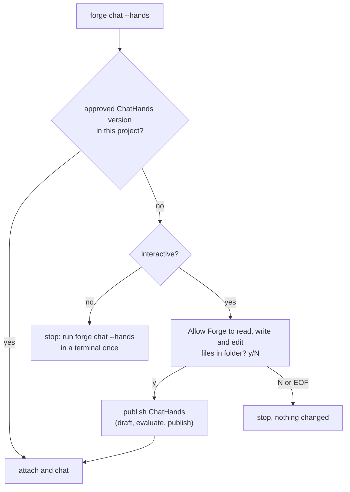

The published version is the approval: it is stored in the project manifest's
`MissionDefinitions`, so later runs do not ask (`forge-mcl … ForgeChat.cs:217-239`, `AskApproval`).
File operations are then allowed without asking again.

### The hands loop

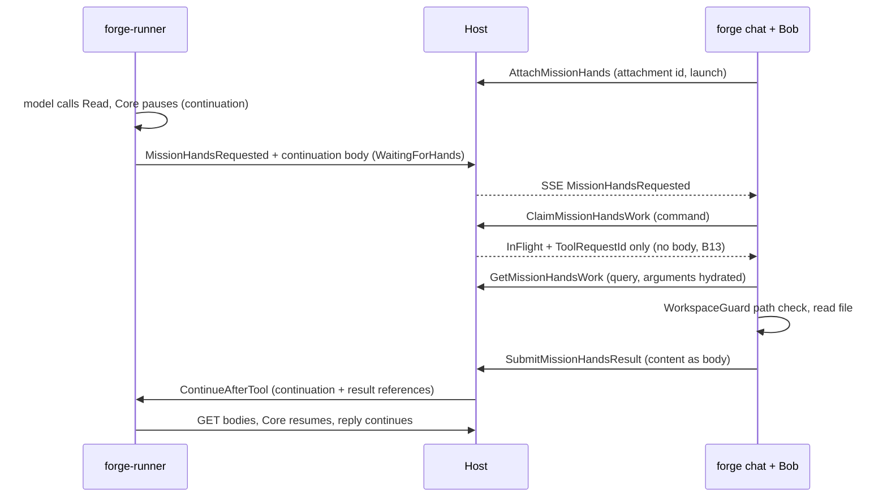

| Step | Rule | Where |
|---|---|---|
| Attach | One current attachment per conversation; a new one waits as pending while the old one has work in flight | `ConversationGrain.cs:432-470` |
| Request | Host accepts a request only if it matches the active start command and the pinned launch | `ConversationGrain.cs:800-818` |
| Claim then read (B13) | Command replies never carry bodies (they ride the 256 KB reply queue). The claim returns status and the request id; Bob reads the work item by query | `ConversationGrain.cs:629-663`; `forge-client … MissionHandsConversationService.cs:214-228` |
| Execute | Driven by the event stream: each `MissionHandsRequested` starts one Execute off the stream loop; one check after attach for a request already waiting | `forge-mcl … ChatHandsAttachment.cs:7-37` |
| Path guard | Relative paths resolve under the project root; anything resolving outside is refused; symlinks are followed on every existing ancestor. A path guard, not an OS sandbox | `forge-mcl … Core/Tools/WorkspaceGuard.cs` (used by forge-client ClientRuntime via `LocalDiskWorkspace`) |
| Result | The result commit owes exactly one deterministic `ContinueAfterTool` | `ConversationGrain.cs:534-592` |
| Resume | Runner refuses a resume if the run is not `WaitingForHands`, or the package hash or engine build changed | `MissionCommandProcessor.cs:145-162` |
| Fingerprint | Core hashes tool schemas in compact JSON at pause and at resume, so schema whitespace cannot break a continuation (fixed in Core 0.1.3) | `forge-mcl … PipelineRunner.cs:741-749` |
| Exit mid-tool | Ctrl-C cancels the hands attempt on the Host, then the local operation | `ChatHandsAttachment.cs:39-73` |

Proven live on the default path by Phase 55 (Read of `secret.txt`, codeword returned). Write,
Edit, cancel mid-tool and the TUI rendering are covered by unit tests only.

**Desktop is deferred.** Desktop only acknowledges hands and never calls Execute, and it still
uses Contracts 0.4.0 (backlog: Desktop client upgrade).

---

## 6. Failure and recovery

### Outbox and reminder

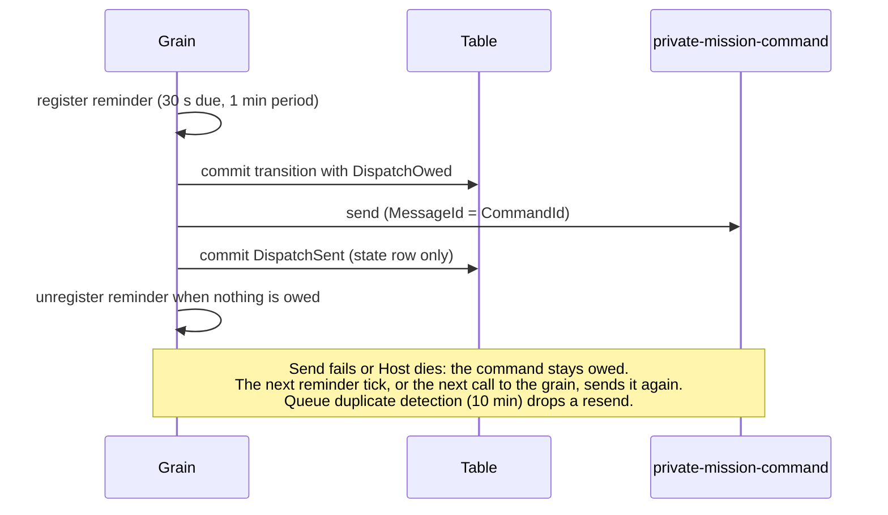

Service Bus cannot join the Table transaction, so the owed command is made durable first
(`ConversationGrain.cs:1343-1348, 1413-1440`). The reminder is registered **before** the commit, so
an owed command always has a retry driver.

### Host restart or rollover mid-turn

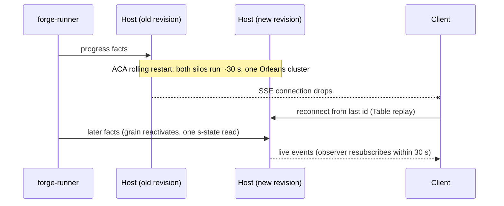

| Situation | What happens | Lost |
|---|---|---|
| Host restart mid-turn | The runner owns the run outcome and is unaffected. The grain reactivates with one `s-state` read and makes no grain calls, so it cannot deadlock. Progress resumes from the queue. | Live deltas during the gap |
| Revision rollover (~30 s, two silos) | Silos form one cluster. A write from a stale activation fails the ETag check and is re-decided. The observer list is rebuilt by the 30 s resubscribe + catch-up. | Live deltas; up to ~30 s live delay (durable events arrive by catch-up) |
| Runner restart mid-turn | Redelivered command after the provider call started → run `Interrupted` (no silent retry of a paid call) | The turn's reply |
| Runner never reports | The run stays active until the user cancels the turn (Host README → Run outcome) | — |
| Progress handler keeps failing | Abandoned; after max delivery the dead-letter handler records `Error` then `Failed`; if that also fails it logs and gives up | The turn |
| Missing body chunk | Progress fact → `Error` + `Failed`; ingress command → 400 `bodyIncomplete` | The turn |
| Table outage | Orleans retries the commit with backoff and never throws. The caller times out (30 s; 2 min for `RecordProgressAsync`), the message is abandoned and redelivered, and the receipt makes the redelivery a no-op | Nothing durable |
| Blob outage | The handler throws before the grain call → broker redelivery. An SSE read that cannot load a body ends the stream; the client reconnects | Nothing durable |
| Slow SSE client | Its 64-item channel fills, the stream ends, the client reconnects from its cursor | Nothing durable |

Progress runs up to 8 conversations at once, one message at a time per conversation, so one stuck
conversation does not stall others (`Messaging/ConversationProgressConsumer.cs:27`).

**What can be lost:** only live drafts (deltas). Every durable fact is either committed or still
on a queue.

---

## Not covered yet / known gaps

| Gap | Note |
|---|---|
| Section 4 for the TUI | After Phase 53.9 (one live stream per window, own turn, Ctrl-D). |
| Typed "not the current attachment" claim reject | The Host refuses a non-current attachment with the same untyped reason as other refusals (`ConversationGrain.cs:642-648`). Backlog. |
| Desktop client upgrade | Desktop is on Contracts 0.4.0 and does not execute hands. Backlog. |
| Host replica count is 1 | The design is correct for N silos (tested with 2); scaling out is a separate decision (`forge-infra dev/525-conversation-app/main.bicep:116-117`). |
| Runner processes one conversation at a time per replica | `MaxConcurrentSessions = 1` (`AzureServiceBusMissionCommandConsumer.cs:91`); 1–3 replicas (`forge-infra dev/500-app/main.bicep:233-234`). Inference: replicas scale on HTTP traffic, not queue length. |
| Orphan body blobs | A body staged but never committed stays; uncommitted blocks expire after 7 days (Phase 54 B4). |
| Resends after the 10-minute duplicate-detection window | Not deduplicated by the queue; inference: the runner's session state (same `CommandId`) turns a late resend into a no-op or `Interrupted`. |
