# How conversations work

> **Status: current, 2026-10-01** (reviewed against the code; all 23 diagrams parse with Mermaid 11). This doc explains a Forge conversation from end to end: a turn,
> storage, live events, clients, hands, and failure. It replaces the stale parts of
> [durable-conversations.md](durable-conversations.md) (`MissionRunGrain`, grain-storage
> checkpoints, `PendingTransition`). It matches Host 0.8.0, runner 0.19.0 (Core 0.1.3), ForgeAPI
> 0.7.0, Contracts 0.7.0, Client 0.6.0 (client Core 0.1.0/0.1.1; the path guard runs in the client
> ClientRuntime on Core 0.1.0), and `forge` from forge-mcl `main` after Phase 53.9.

Repos are named by their short name (`forge-conversations`, `forge-runner`, …). Paths without a
repo prefix are in `forge-conversations/src/ForgeMission.ConversationHost/`; other paths name their
repo. An *inference* is a claim not checked in code or live; it is marked where it appears.

## Overview

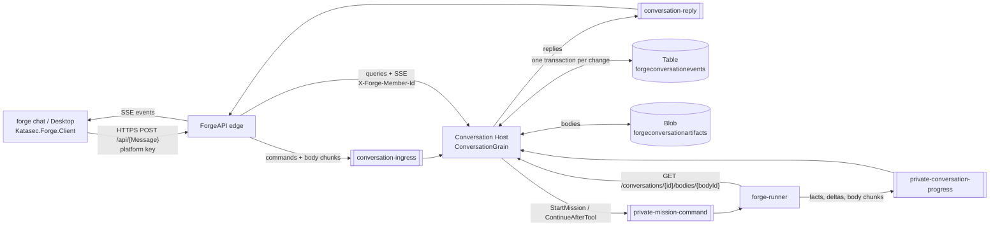

| Part | Owns | Talks to |
|---|---|---|
| Client (`forge chat`, Desktop) | Local project, hands (Bob), rendering | ForgeAPI only (`/api/{MessageName}`) |
| ForgeAPI edge | Nothing durable; auth, credit check, body chunking | Ingress/reply queues; direct Host queries (`forge-platform/src/ForgeMission.Api/Conversations/ConversationEndpoints.cs`) |
| Conversation Host | Every conversation: state, events, bodies, live fan-out | Table, Blob, all four conversation queues |
| forge-runner | Nothing durable except Service Bus session state | Command and progress queues; Host body route |

Commands go over Service Bus; queries (including the event stream) are direct HTTP reads
([command-bus architecture](command-bus-architecture.md)). The Host has internal ingress only;
the edge sets the member header (Host `README.md` → Identity).

---

## 1. A turn's life

Two words used below: an **owed** command is one the grain has committed to send but not yet
sent; to **drain** the outbox is to send every owed command and record each as sent
([section 6](#outbox-and-reminder)).

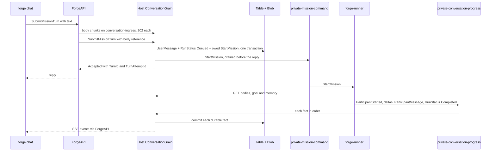

1. **Submit.** The client posts `SubmitMissionTurn` to ForgeAPI. The edge first rejects a missing
   body (400) or one over 4 MiB (413), then checks credit, then sends the text as body chunks,
   waits for a 202 per chunk, and sends the command with a body reference
   (`forge-platform/src/ForgeMission.Api/Conversations/ConversationEndpoints.cs:130-145`;
   `Messaging/Ingress/ConversationIngressHandler.cs:78`). The edge waits up to 30 s for the
   Host's reply (`forge-platform/…/Conversations/ConversationCommandBus.cs:68`).
2. **Accept.** The grain rejects a second turn while one is active (`RunAlreadyActive`,
   `Grains/ConversationGrain.cs:305`). Otherwise it composes memory (prior turns, 32 KiB budget)
   and commits `UserMessage` + `RunStatus: Queued` + an owed `StartMission` in one transition
   (`PlanRunStart`). The turn's attempt id is the run id.
3. **Dispatch.** Still inside the same call, after the commit, the grain drains the outbox: it
   sends `StartMission` (`MessageId` = `CommandId`) and records it as sent. Only then does it
   reply (`ConversationGrain.cs:1348-1352`). So `Accepted` means the command is on the queue, or
   still owed with a reminder to retry it.
4. **Run.** The runner reads the goal and memory through the Host body route, runs the mission
   through Core, and publishes facts in order on the conversation's session of the progress queue
   (`forge-runner/src/ForgeMission.Runner/Conversations/MissionCommandProcessor.cs`).
5. **Record.** Each fact is one grain commit; each committed event goes to live readers. The turn
   ends at a terminal `RunStatus`: Completed, Failed or Interrupted.

**Cancelling a turn** (`CancelMissionTurn`) commits `RunStatus: Interrupted` ("Cancelled by
operator") for the active attempt, which ends the active run (`ConversationGrain.cs:351-379`). No
command goes to the runner. Inference: the runner finishes its current work; its later facts for
that run are rejected because the run is no longer active (`RejectProgress`,
`ConversationGrain.cs:793`) and the progress consumer completes rejected messages.

---

## 2. Storage

### One commit = one entity-group transaction

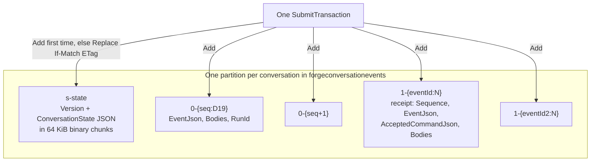

The partition key is `v1|{tenant}|{conversationId:N}`. `ConversationGrain` is a
`JournaledGrain<ConversationState, ConversationTransition>` on Orleans' `CustomStorage` provider
(`Grains/ConversationGrain.cs:46`, `Program.cs:82`). The grain itself is the storage adapter:
`ReadStateFromStorage` reads the `s-state` row; `ApplyUpdatesToStorage` writes the state row, the
new event rows and their receipt rows in **one** Table transaction
(`Persistence/AzureTableConversationEventStore.cs:59-81`). Either all rows land or none do, so
there is no crash gap between "event written" and "state saved". `PendingTransition` and grain
storage are gone.

| Row | Key | Holds |
|---|---|---|
| State | `s-state` | Journal `Version`, the serialized state in 64 KiB binary chunks (max 960 KiB) |
| Event | `0-{sequence:D19}` | Public event JSON (max 30 KiB, bodies excluded), body references, run id |
| Receipt | `1-{eventId:N}` | Sequence, event JSON, the accepted command (max 32 KiB) — answers "already accepted?" |

Limits are in `Persistence/ConversationJsonLimits.cs`. The 30 KiB event cap keeps JSON inside a
Table string property (32K UTF-16 units).

### Conditional events

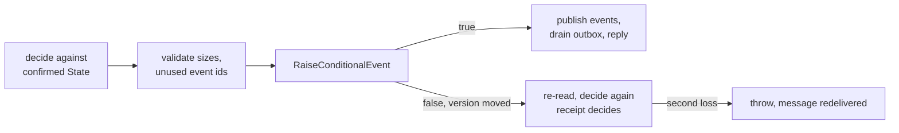

Every mutating call goes through `CommitTransitionAsync` (`Grains/ConversationGrain.cs:1330-1361`).
It never uses unconditional `RaiseEvent`, because Orleans would retry that on top of newer state
without re-validating. A conditional event that loses (412 on the state ETag, or 409 on the
first-write Add) is re-decided once; on the retry the receipt row turns a duplicate into
"already accepted". A method returns only after its commit is confirmed, so queue consumers
complete a message only once it is durable.

### Bodies in Blob (claim-check)

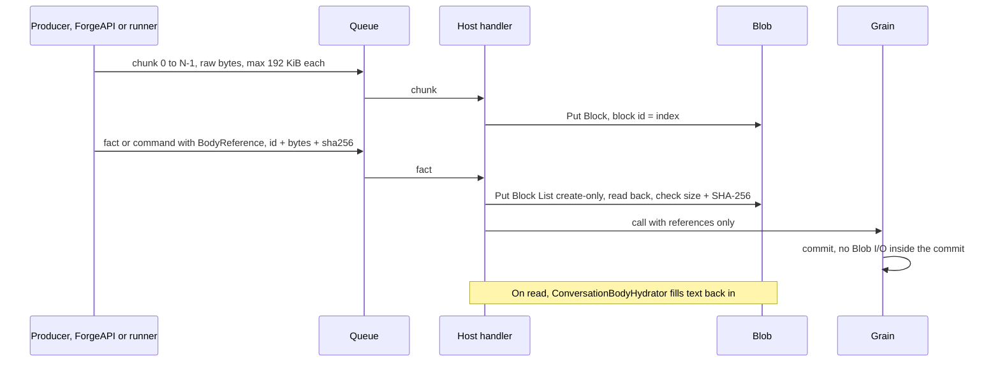

Every string a user, model or tool sizes (messages, error reasons, tool arguments and results,
goals, the runner's continuation, composed memory) is a **body**. It is stored once in Blob at
`{tenant}/{conversationId:N}/bodies/{bodyId:N}` (`Persistence/AzureBlobConversationBodyStore.cs:86`).
The event row keeps a reference. Body ids are deterministic per owning fact and field, so a
retry writes the same blob. The grain's **commit** does no Blob I/O; the grain does touch Blob in
two places outside the commit (below).

| Step | Where |
|---|---|
| Edge chunks client text; over 4 MiB → 413 before any send | `forge-platform/…/Conversations/ConversationEndpoints.cs:119-192` |
| Runner sends chunks before the fact on the progress session | `forge-runner/…/Conversations/MissionCommandProcessor.cs` (Outbox) |
| Put Block per chunk, Put Block List create-only, verify size + SHA-256 | `Persistence/AzureBlobConversationBodyStore.cs:28,131`; `Api/ConversationBodyIntake.cs` |
| Missing chunks: progress → Error + Failed; ingress → 400 `bodyIncomplete` | `Messaging/ConversationProgressHandler.cs:79-93`; Host README |
| Memory (`MissionInput`): composing it reads prior bodies; the grain writes it to Blob at dispatch, from committed state, just before the send | `ConversationGrain.cs:1421-1425` |
| Hydrate on every read: events, SSE, snapshot, run history, hands work | `Persistence/ConversationBodyHydrator.cs` |
| Runner reads command bodies | `GET /conversations/{id}/bodies/{bodyId}` (`forge-conversations/src/ForgeMission.Conversations.Contracts/ConversationBodies.cs:79`; `forge-runner/…/Conversations/ConversationHostBodyReader.cs`) |

**Why 4 MiB** (`forge-conversations/src/ForgeMission.Conversations.Contracts/ConversationBodies.cs:22`):
it is a guardrail, not a storage limit. A body over ~1M tokens is larger than a model context;
model replies are at most ~512 KB; client text is untrusted input (Phase 54 B2). Service Bus
Standard caps a message at 256 KB, hence 192 KiB chunks.

---

## 3. Live events

### Fan-out: grain → observers → hub → SSE

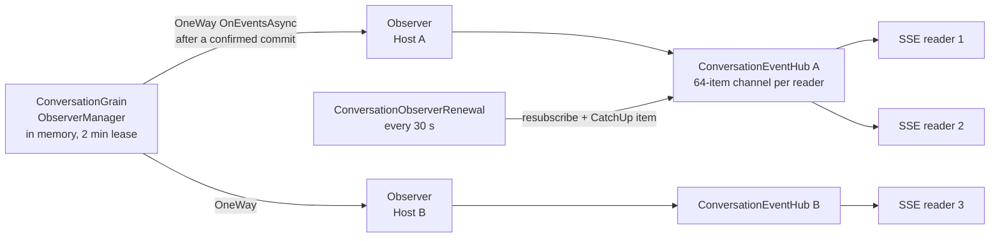

- Each Host keeps one observer per conversation it has readers for. The first reader subscribes
  it on the grain; the last one leaving unsubscribes it (`Api/ConversationEventHub.cs:10-22`).
- The grain notifies observers one-way after a confirmed commit, so a dead or slow Host never
  blocks a commit (`Grains/IConversationEventObserver.cs:16`, `ConversationGrain.cs:888`).
- The observer list lives in memory and is lost if the grain reactivates elsewhere. Every 30 s
  each Host resubscribes and tells its readers to catch up from the Table
  (`Api/ConversationObserverRenewal.cs`). So a lost list costs at most ~30 s of live delay, never
  a lost durable event.
- A reader whose 64-item channel is full is dropped; its stream ends and the client reconnects.

### SSE cursor and gap rule

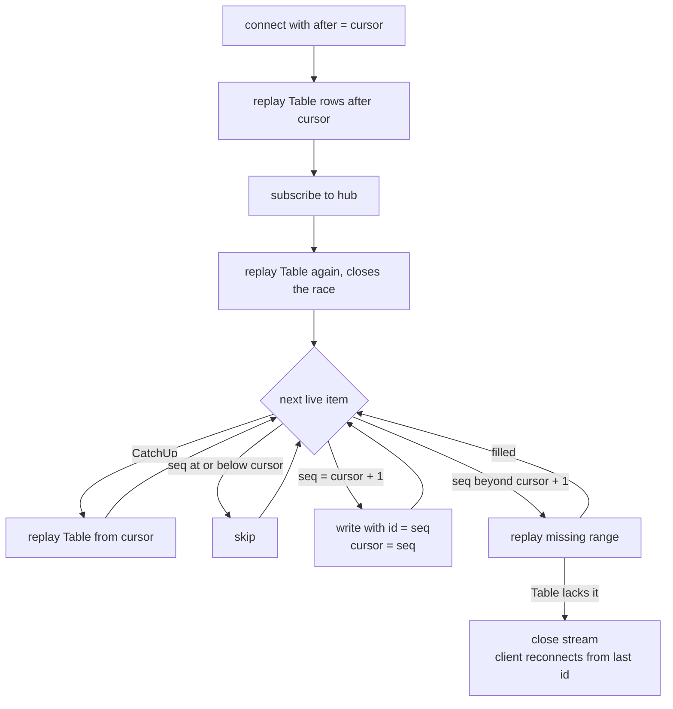

Sequences are contiguous, so the writer only ever writes `cursor + 1`
(`Api/ConversationSseWriter.cs:73-117`). A live event further ahead means a publish was missed (an
ambiguous commit publishes nothing), so the gap is filled from the Table first. Writing it directly
would move the client's `id:` past an event it never saw. Each event is hydrated before writing.

### Deltas

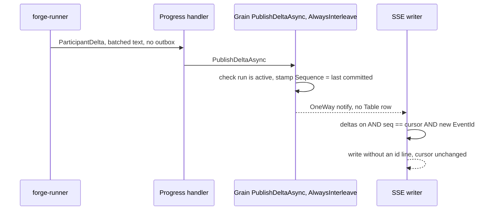

| Rule | Where |
|---|---|
| Runner batches: first chunk at once, then every 200 ms or 16K chars; flushed before the step's final message | `forge-runner/…/Conversations/ConversationDeltaBatcher.cs` |
| Never stored: no row, no state, no memory; `RecordProgressAsync` rejects a delta; dead-letter ignores it | `ConversationGrain.cs:782`; `Messaging/ConversationProgressDeadLetterHandler.cs` |
| `[AlwaysInterleave]`: a delta never waits behind a commit held in storage | `Grains/IConversationGrain.cs:77` |
| Written only with `deltas=true` and `Sequence == cursor`; no `id:`; never moves the cursor | `Api/ConversationSseWriter.cs:91-96` |
| Redelivered delta written once per connection (last 128 ids) | `Api/ConversationSseWriter.cs:150` |
| Opt-in through ForgeAPI `IncludeDeltas` (older clients fail on the unknown kind) | `forge-platform/…/Conversations/ConversationEndpoints.cs:277-280` |

A delta stamped at N while a commit to N+1 is in flight is dropped by the cursor rule. That is
harmless: the step's final `ParticipantMessage` is the durable record.

---

## 4. Clients and turns

This section covers `forge chat` on forge-mcl `main` after Phase 53.9
([katasec/forge-mcl#29](https://github.com/katasec/forge-mcl/pull/29)). Paths in this section are
in `forge-mcl/src/ForgeMission.Cli/` unless they name another repo.

**Live acceptance: PASS, 2026-10-01**
([record](../phases/phase-53.9-tui-live-sessions_completed.md)). Two TUIs on one conversation
streamed in step: `LINE-03`, `LINE-20` and `LINE-40` appeared at +6.8, +9.1 and +11.7 s in both.
Ctrl-D in one window mid-reply exited 0 with no exception, and the other window kept streaming.
Not covered live: two `--hands` windows and the reconnect notice (unit tests only).

| Mode | When | Stream |
|---|---|---|
| TUI | A terminal on both input and output | One live stream with deltas, open to exit |
| Piped (line) | Input or output redirected | Follows only its own turn, no deltas, exits on EOF |

### One live stream per window

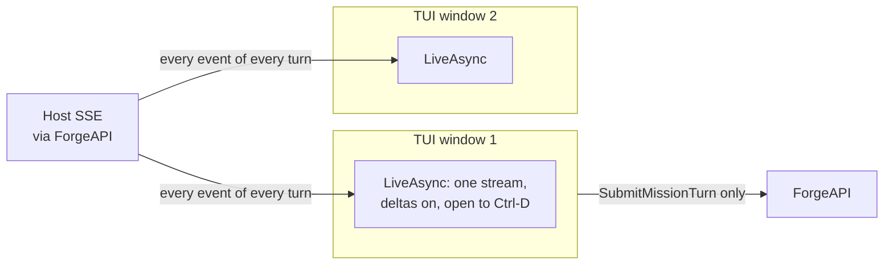

On open, the TUI reads the snapshot, replays history up to `LastSequence`, then starts one stream
after that cursor with `includeDeltas: true`. The stream runs until Ctrl-D and never ends on a turn
(`ends: _ => false`) (`Tui/ChatTui.cs:105-126`). So every window shows every turn live, whichever
window sent it. The Host fan-out ([section 3](#3-live-events)) already supports many readers.

### Submit only posts; the stream shows the turn

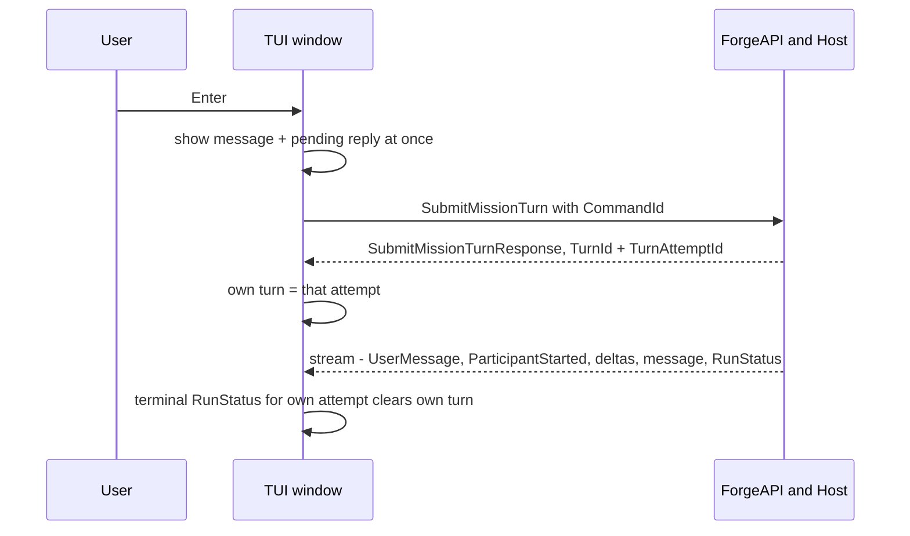

Enter shows the message and a pending reply straight away and queues the submit for the next UI
step (`Tui/ChatTui.cs:186-194`). The submit stores the response as this window's **own turn**
(`Tui/ChatTui.cs:135`). The turn's events arrive only through the live stream; when the stream
shows the own attempt's end, the own turn is cleared (`Tui/ChatTui.cs:231-235`). A submit Forge
refuses puts the text back in the composer with an error.

### One turn at a time

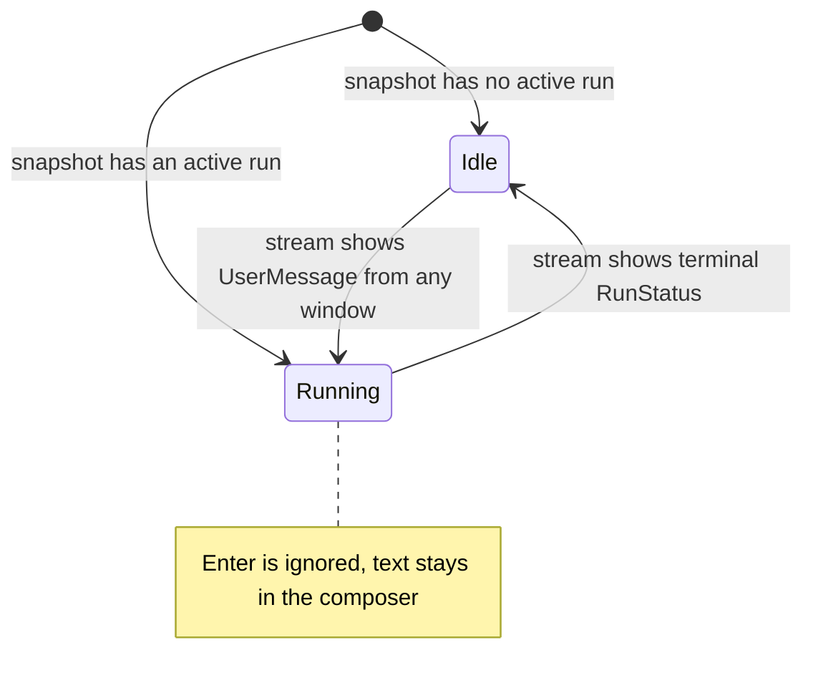

Enter does nothing while the conversation is opening, while a call is in flight (`_busy`, or a
message already queued), or while any window's turn runs (`Tui/ChatTui.cs:188`). "A turn runs" is
`TurnRunning`: a `UserMessage` starts one, a terminal `RunStatus` ends one, and the start value
comes from the snapshot (`Tui/ChatTui.cs:109, 265-270`). The Host enforces the same rule
(`RunAlreadyActive`, `ConversationGrain.cs:305`); the client rule keeps a second window from
trying.

### Another window's message

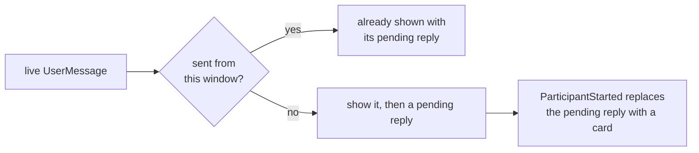

`Transcript.ApplyLive` checks whether the `UserMessage` id matches a message this window sent
(the command id is the event id). If not, it appends a pending reply, which the participant's
started card replaces (`Tui/Transcript.cs:60-66`).

### Ctrl-C stops only this window's turn

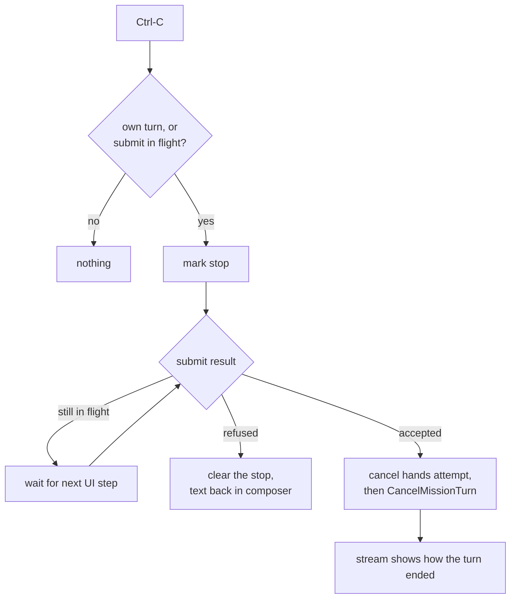

Ctrl-C does nothing for a turn another window sent, or a turn already running when this window
opened (`Tui/ChatTui.cs:198-201`). Pressed before the submit returns, the stop waits for the
response, then runs on the next UI step (`Tui/ChatTui.cs:93-97`). It cancels a running file
operation first, then the turn (`Tui/ChatTui.cs:150-161`). If the submit is refused, the pending
stop is cleared, so it cannot apply to a later turn. That is the intended behaviour; the code fix
for it is landing separately in forge-mcl.

### Hands run only for this window's turn

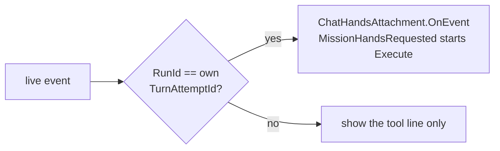

Only events of the own turn reach the hands attachment (`BelongsToOwnTurn`,
`Tui/ChatTui.cs:228-229, 260-261`); the Host stamps each turn's events with its attempt id as
`RunId`. Another window's tool request is shown, not executed.

**Two `--hands` windows: only the most recently attached one can execute.** Each window attaches
on open, and a new attachment replaces the current one unless a tool call is in flight
([section 5](#attachment-handoff)). The Host refuses a claim from any other attachment
(`ConversationGrain.cs:646-648`), with the same untyped reason as a missing or cancelled request.
So the own-turn rule only stops windows from claiming each other's work; it does not let the older
window run its own tools. The older window's own tool requests fail with that untyped reason. A
typed reject is in the backlog.

**One exception on open:** `Begin` checks once for a request already waiting for the new
attachment and executes it (`ChatHandsAttachment.cs:25-30`). By construction this window did not
send that request: it belongs to another window or a previous session. Piped mode goes further:
its hands handler is not filtered, so while it follows a turn that was already running when it
opened (another window's), it executes that turn's tool requests (`ForgeChat.cs:295-302`).

### Reconnect

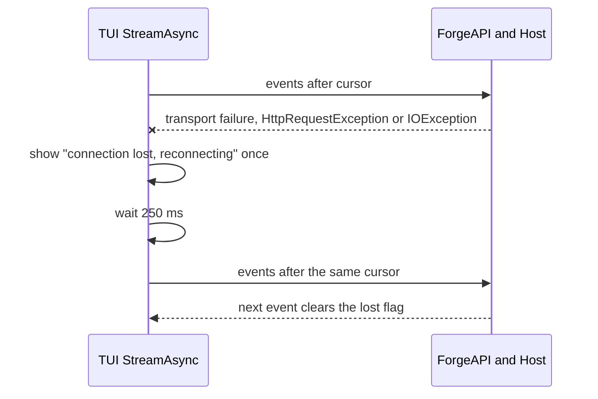

The TUI and piped mode share one loop, `ForgeChat.StreamAsync` (`ForgeChat.cs:363-394`). A stream
that closes is reopened from the cursor after 250 ms. In the TUI, a transport failure also
reconnects and adds one notice line; no second notice is added until an event arrives
(`Tui/ChatTui.cs:240-245`). A delta is shown only after its step started on the same connection,
so a reconnect mid-reply shows no partial text until the final message.

### Ctrl-D exits cleanly

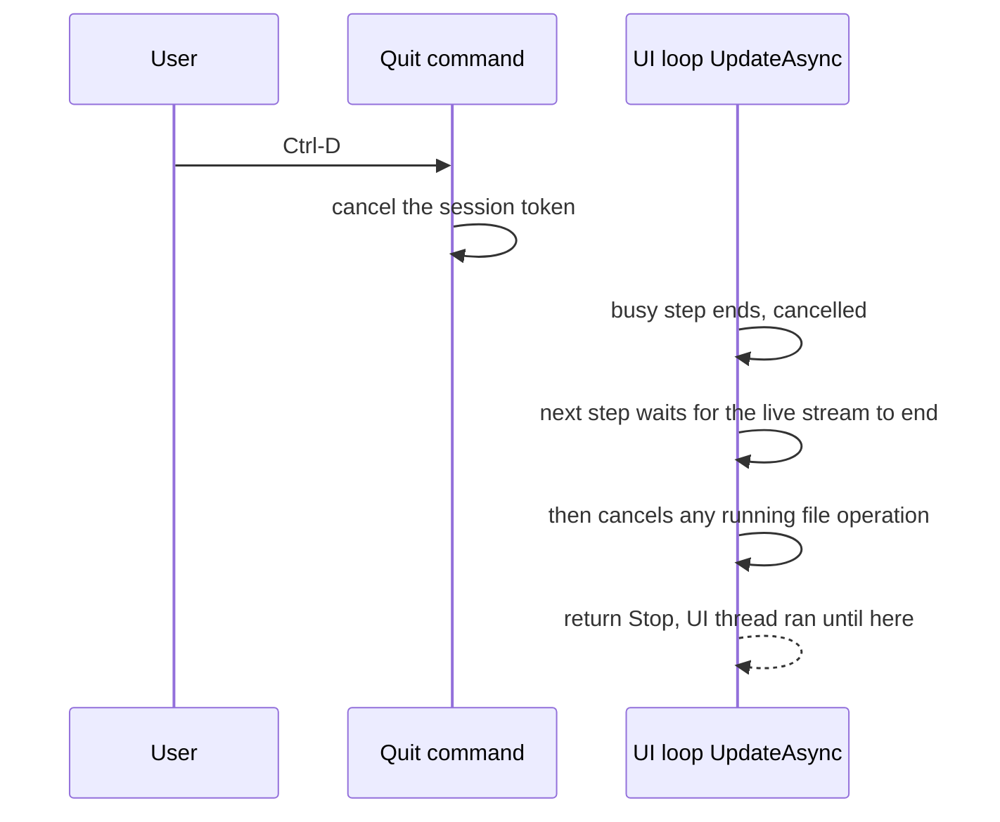

The TUI replaces the app's own quit command (`Tui/ChatTui.cs:203-214`). Before 53.9, Ctrl-D
stopped the terminal app at once; a `finally` then cancelled the session and a pending await
resumed onto the stopped dispatcher, which crashed with `InvalidOperationException: Dispatcher is
not attached to a running TerminalApp`. Now Ctrl-D only cancels the session. The UI loop calls its
next step only after the busy step has ended; that step waits for the live stream, then cancels
hands, and only then stops (`Tui/ChatTui.cs:76-80, 174-179`). A turn still running keeps running
on Forge.

### Piped mode (unchanged)

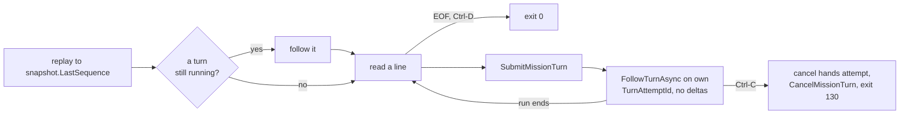

Piped mode follows only its own turn through `FollowTurnAsync`, which is `StreamAsync` ending at
that attempt's end. A transport failure there is thrown, not retried (`ForgeChat.cs:291-352`).
Phase 54 and 55 acceptance runs used piped mode (codeword recall, the 404,863-byte message, a turn
across a Host restart, the hands Read).

---

## 5. Hands

Hands let a mission read and change files on the user's machine. The Host only coordinates; the
local client (Bob, in forge-client) executes.

### Profiles

| Profile | Tools the runner declares | Used by |
|---|---|---|
| `NoHands` | none | `forge chat` (`Chat` mission), evaluations |
| `ProjectWorkspace` | Read, Write, Edit | `forge chat --hands` (`ChatHands` mission) |
| `ProjectWorkspaceAndTerminal` | Read, Write, Edit, Bash | defined; no default client uses it |

The runner declares tools with Core's `AgentToolDeclarations`, which have real JSON schemas
(`file_path` required) (`forge-runner/…/Conversations/GenericDurableMissionExecutor.cs:62-68`). Core
gives tools only to `role: agent` experts (`forge-mcl/src/ForgeMission.Core/Runtime/PipelineRunner.cs:888`),
so `ChatHands` uses the starter `Assistant` expert. A conversation's launch, and so its profile, is
pinned at the first attach and cannot change (`ConversationGrain.cs:443-465`).

### One-time approval (`forge chat --hands`)

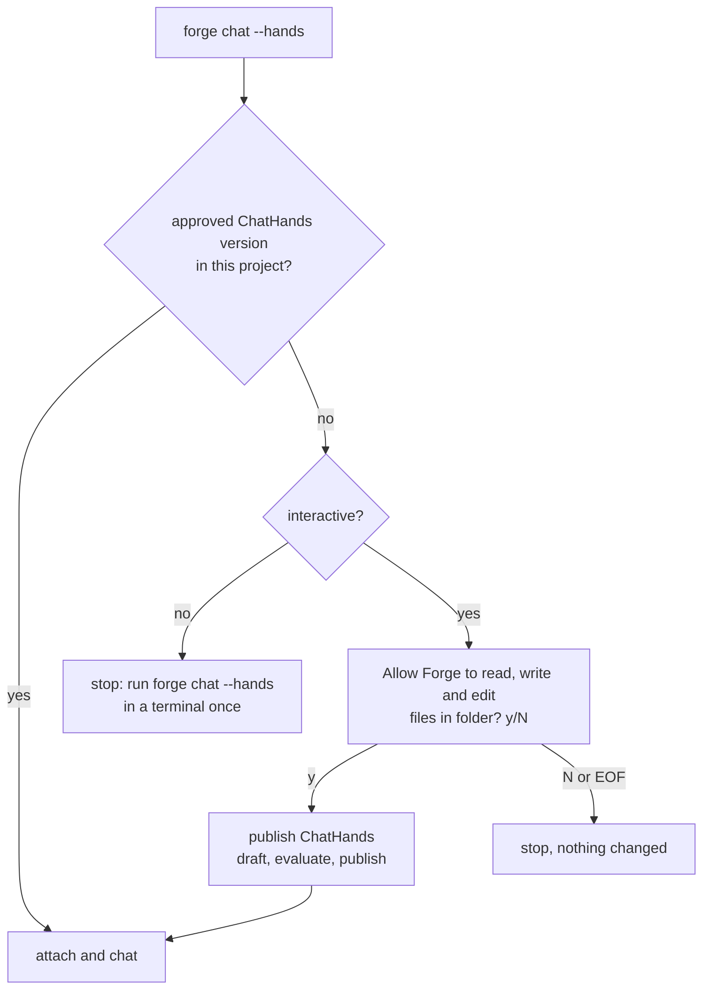

The published version is the approval: it is stored in the project manifest's
`MissionDefinitions`, so later runs do not ask (`forge-mcl/src/ForgeMission.Cli/ForgeChat.cs:217-239`,
`AskApproval`). File operations are then allowed without asking again.

### Attachment handoff

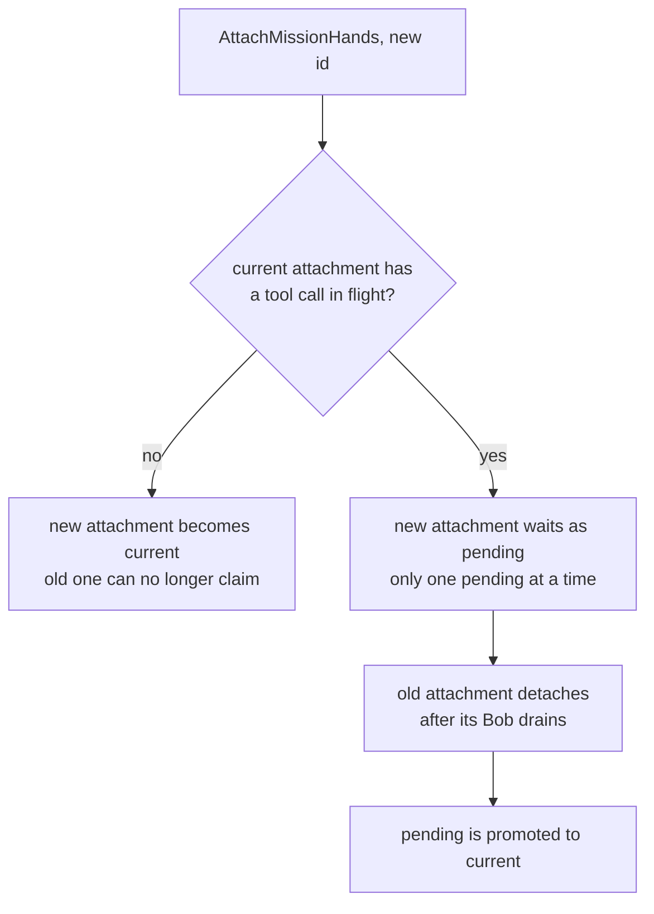

There is one current attachment per conversation. A new attach replaces it at once when no tool
call is in flight; otherwise it waits as pending until the old one detaches
(`ConversationGrain.cs:455-469, 472-494`; `Grains/ConversationState.cs:170-177`). A claim from any
attachment that is not current is refused (`ConversationGrain.cs:646-648`).

### The hands loop

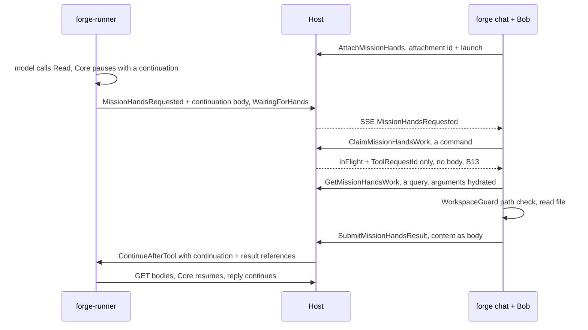

| Step | Rule | Where |
|---|---|---|
| Attach | One current attachment; see [handoff](#attachment-handoff) | `ConversationGrain.cs:432-494` |
| Request | Host accepts a request only if it matches the active start command and the pinned launch | `ConversationGrain.cs:800-818` |
| Claim then read (B13) | Command replies never carry bodies (they ride the 256 KB reply queue). The claim returns status and the request id; Bob reads the work item by query | `ConversationGrain.cs:629-663`; `forge-client/src/ForgeMission.Application/Missions/MissionHandsConversationService.cs:214-228` |
| Execute | Driven by the event stream: each `MissionHandsRequested` starts one Execute off the stream loop (in the TUI, only for the window's own turn, [section 4](#hands-run-only-for-this-windows-turn)); one check after attach for a request already waiting | `forge-mcl/src/ForgeMission.Cli/ChatHandsAttachment.cs:7-37` |
| Path guard | Relative paths resolve under the project root; anything resolving outside is refused; symlinks are followed on every existing ancestor. A path guard, not an OS sandbox | `forge-mcl/src/ForgeMission.Core/Tools/WorkspaceGuard.cs` (used by forge-client ClientRuntime via `LocalDiskWorkspace`) |
| Result | The result commit owes exactly one deterministic `ContinueAfterTool` | `ConversationGrain.cs:534-592` |
| Resume | Runner refuses a resume if the run is not `WaitingForHands`, or the package hash or engine build changed | `forge-runner/…/Conversations/MissionCommandProcessor.cs:145-162` |
| Fingerprint | Core hashes tool schemas in compact JSON at pause and at resume, so schema whitespace cannot break a continuation (fixed in Core 0.1.3) | `forge-mcl/src/ForgeMission.Core/Runtime/PipelineRunner.cs:741-749` |
| Exit mid-tool | Ctrl-C cancels the hands attempt on the Host, then the local operation | `forge-mcl/src/ForgeMission.Cli/ChatHandsAttachment.cs:39-73` |

Proven live on the default path by Phase 55 (Read of `secret.txt`, codeword returned). Write,
Edit, cancel mid-tool, the TUI rendering and two `--hands` windows are covered by unit tests only.

**Desktop is deferred.** Desktop only acknowledges hands and never calls Execute, and it still
uses Contracts 0.4.0 (backlog: Desktop client upgrade).

---

## 6. Failure and recovery

### Outbox and reminder

```mermaid
sequenceDiagram
  participant G as Grain
  participant S as Table
  participant Q as private-mission-command
  G->>G: register reminder, 30 s due, 1 min period
  G->>S: commit transition with DispatchOwed
  G->>Q: send, MessageId = CommandId
  G->>S: commit DispatchSent, state row only
  G->>G: unregister reminder when nothing is owed
  Note over G,Q: If the send fails or the Host dies, the command stays owed.<br/>The next reminder tick, or the next call to the grain, sends it again.<br/>Queue duplicate detection, 10 min, drops a resend.
```

Service Bus cannot join the Table transaction, so the owed command is made durable first
(`ConversationGrain.cs:1343-1348, 1413-1440`). The reminder is registered **before** the commit, so
an owed command always has a retry driver. Activation does not drain the outbox (the grain has no
`OnActivateAsync`).

### Dead-letter

```mermaid
flowchart TB
  M["progress message"] --> H["handler throws"]
  H --> AB["abandon, delivery count +1"]
  AB -->|"below max delivery"| M
  AB -->|"max delivery reached"| DLQ["dead-letter sub-queue"]
  DLQ --> DH["ConversationProgressDeadLetterHandler"]
  DH -->|"delta or chunk"| IGN["record nothing"]
  DH -->|"fact"| REC["record Error, then RunStatus Failed"]
  REC -->|"that also throws"| GIVE["log and give up, complete"]
```

A dead-letter sub-queue has no further delivery limit, so the handler never throws: if recording
the failure itself fails, it logs and completes (`Messaging/ConversationProgressDeadLetterHandler.cs`).
A dead-lettered chunk records nothing; its fact then finds the body incomplete and fails the run.

### Host restart or rollover mid-turn

```mermaid
sequenceDiagram
  participant R as forge-runner
  participant H1 as Host old revision
  participant H2 as Host new revision
  participant C as Client
  R->>H1: progress facts
  Note over H1,H2: ACA rolling restart, both silos run about 30 s in one Orleans cluster
  H1--xC: SSE connection drops
  C->>H2: reconnect from last id, Table replay
  R->>H2: later facts, grain reactivates with one s-state read
  H2-->>C: live events, observer resubscribes within 30 s
```

| Situation | What happens | Lost |
|---|---|---|
| Host restart mid-turn | The runner owns the run outcome and is unaffected. The grain reactivates with one `s-state` read and makes no grain calls, so it cannot deadlock. Progress resumes from the queue. | Live deltas during the gap |
| Revision rollover (~30 s, two silos) | Silos form one cluster. A write from a stale activation fails the ETag check and is re-decided. The observer list is rebuilt by the 30 s resubscribe + catch-up. | Live deltas; up to ~30 s live delay (durable events arrive by catch-up) |
| Runner restart mid-turn | Redelivered command after the provider call started → run `Interrupted` (no silent retry of a paid call) | The turn ends Interrupted |
| Runner never reports | The run stays active until the user cancels the turn (Host README → Run outcome) | — |
| Progress handler keeps failing | [Dead-letter](#dead-letter): `Error` then `Failed`; if that also fails, log and give up | The turn ends Failed |
| Missing body chunk | Progress fact → `Error` + `Failed`; ingress command → 400 `bodyIncomplete` | The turn ends Failed |
| Table outage | Orleans retries the commit with backoff and never throws. The caller times out (30 s; 2 min for `RecordProgressAsync`), the message is abandoned and redelivered, and the receipt makes the redelivery a no-op | Nothing committed |
| Blob outage | The handler throws before the grain call → broker redelivery. An SSE read that cannot load a body ends the stream; the client reconnects | Nothing committed |
| Slow SSE client | Its 64-item channel fills, the stream ends, the client reconnects from its cursor | Nothing committed |

Progress runs up to 8 conversations at once, one message at a time per conversation, so one stuck
conversation does not stall others (`Messaging/ConversationProgressConsumer.cs:27`).

**In short:** no committed fact is lost. A turn can end Failed or Interrupted; live deltas can be
dropped.

---

## Not covered yet / known gaps

| Gap | Note |
|---|---|
| Typed "not the current attachment" claim reject | The Host refuses a non-current attachment with the same untyped reason as other refusals (`ConversationGrain.cs:646-648`), so only the most recently attached `--hands` window can execute. Backlog. |
| Ctrl-C pressed during a submit that then fails | Intended: the failed submit clears the pending stop. Code fix landing in forge-mcl. |
| Turn cancel and the runner | The runner is not told; inference: it finishes its work and its later facts are rejected ([section 1](#1-a-turns-life)). |
| Desktop client upgrade | Desktop is on Contracts 0.4.0 and does not execute hands. Backlog. |
| Host replica count is 1 | The design is correct for N silos (tested with 2); scaling out is a separate decision (`forge-infra/dev/525-conversation-app/main.bicep:116-117`). |
| Runner processes one conversation at a time per replica | `MaxConcurrentSessions = 1` (`forge-runner/…/Conversations/AzureServiceBusMissionCommandConsumer.cs:91`); 1–3 replicas (`forge-infra/dev/500-app/main.bicep:233-234`). Inference: replicas scale on HTTP traffic, not queue length. |
| Orphan body blobs | A body blob committed but never referenced by a grain commit stays (Phase 54 B4). Staged blocks never committed expire after 7 days (Phase 54 B7). |
| Resends after the 10-minute duplicate-detection window | Not deduplicated by the queue; inference: the runner's session state (same `CommandId`) turns a late resend into a no-op or `Interrupted`. |
| Not covered live | Two `--hands` windows; the TUI reconnect notice; hands Write/Edit and cancel mid-tool. |
