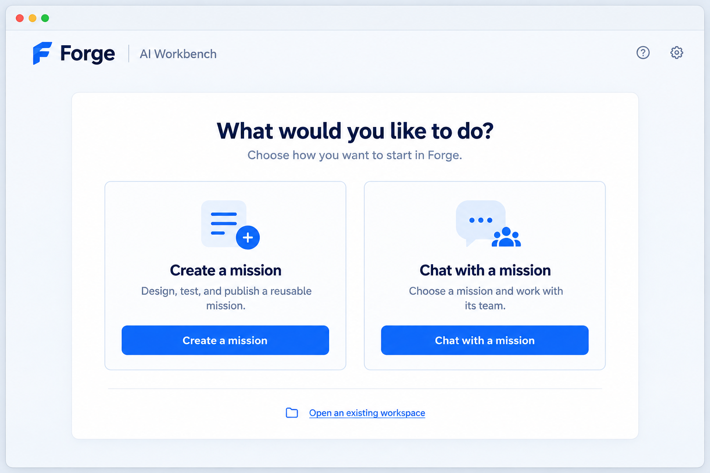
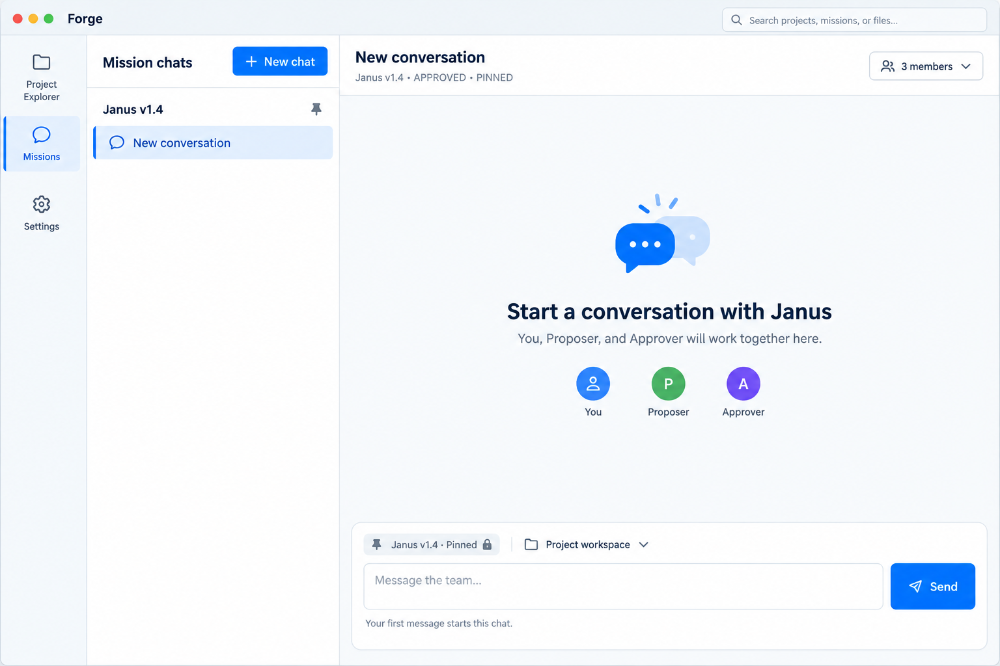
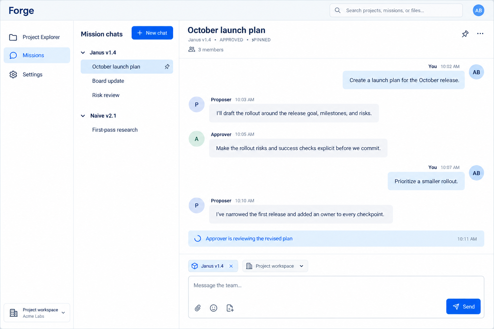

# Mission chat experience v1

> **Status:** approved static product-direction reference, 2026-09-10. It records the
> experience agreed in the UI workshop; it is not runtime, transport, or persistence evidence.
> **Default-path acceptance:** N/A — this document and its images make no product change.

## Purpose

Forge starts with an outcome, not a storage concept. A person either creates a reusable Mission or
opens a shared chat with one. The chat is a durable, human-steerable group conversation between the
person, Proposer, and Approver.

This reference replaces the earlier static conversation mock direction for the owned mission-chat
surfaces. It does not authorise backend wiring; that happens only after a bounded implementation
task locks the relevant durable and transport shapes.

## Visual contract

- Use the existing light Forge-blue visual language: pale cool-grey background, white surfaces,
  deep navy text, thin blue-grey borders, and Forge blue for interactive emphasis.
- Do not combine the former ember/orange treatment with this surface. Green remains only a
  semantic status (for example, `Approved`).
- The global rail contains exactly **Project Explorer**, **Missions**, and **Settings**, in that
  order. It never gains a Chats or Runs destination.
- The chat list is local navigation within **Missions**, not a fourth global rail destination.

## Screen progression

### 1. Start

The opening choice asks what the person wants to do. `Create a mission` starts authoring;
`Chat with a mission` opens a fresh mission chat. Opening an existing workspace is quiet secondary
navigation.

### 2. Fresh mission chat

`Chat with a mission` opens a new, empty conversation with **Janus v1.4** selected and pinned.
It makes the participants explicit before the first message: You, Proposer, and Approver. The
composer is enabled; sending its first message starts this chat.

### 3. Active mission chat

The first message produces one shared, chronological group conversation. The human is a peer:
their follow-up is another message in the same stream, visible to Proposer and Approver. A live
status names work in progress; the composer remains available. `Stop discussion` is a conversation
control, not a per-message or per-agent control.

## Product vocabulary and invariants

| Term | Meaning |
|---|---|
| Mission | The reusable AI team/configuration and its approved version. It is not a chat. |
| Chat | One durable context and group-message history for a Mission. A Mission may have many chats. |
| Pinned version | A chat retains the approved Mission version it started with. Publishing a later version affects new chats only. |
| Participants | The human, Proposer, and Approver are peers in one visible group stream. |
| New chat | Starts fresh context under a selected approved Mission version. It never changes an existing chat's version. |

The local Mission chats list groups chats beneath their Mission, for example several Janus chats
(`October launch plan`, `Board update`, `Risk review`) and a separate Naive chat. Selecting a chat
restores its exact history and pinned version.

## Interaction rules

- The normal composer says **Message the team**. A person steers live work by adding a normal group
  message; it is not an artificial, scoped “steer turn” instruction.
- Proposer and Approver may exchange multiple visible messages as the discussion develops. The UI
  must not present that exchange as a one-shot hidden subtask or a private parallel thread.
- `Stop discussion` ends the active discussion while preserving the chat and its visible history.
- In an existing chat the Mission label is read-only pinned provenance. Mission selection happens
  when starting a new chat, never by silently changing an existing conversation.
- The full trace remains evidence for an exact execution later; it is not the primary group-chat
  surface.

## Implementation boundary

The next build slice is static Presentation-only work using realistic stand-in content. It owns
layout, navigation, local selected-chat state, and interaction prototypes only. It must not add a
new endpoint, durable command, store, runtime, or capability authority. A later, separately
approved integration task must reconcile this group-chat experience with the existing durable
conversation and turn contracts before it wires a real message path.

## Related references

- [Phase 45 — Forge Desktop mission conversations](../phases/phase-45-mission-conversations.md)
- [Desktop Interaction Principles](desktop-interaction-principles.md)
- [UI Design System](ui-design-system.md)
- [Default-Path Acceptance](default-path-acceptance.md)
