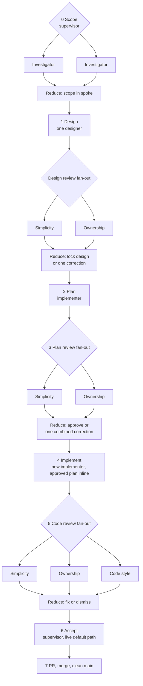

# Supervisor workflow

> **Status: governing implementation workflow.** It is provider-neutral: the LLM agent the
> operator is working in (Claude, Codex, or another) is the supervisor and uses its own subagents.
> Checks fan out: investigators gather facts in parallel, and reviewers check every guardrail
> family at once, each carrying a [persona](../../personas/README.md) inline. The supervisor merges
> their results into one decision per stage. Design and code each have one author.

## Shape



## Roles

| Role | Persona | Authority | May not do |
|---|---|---|---|
| Supervisor | This document | Scope, merge each fan-out into one decision, approve the plan, accept completion. | Implement the task, delegate its final decision, or treat a subagent's claim as acceptance evidence. |
| Designer | [designer.md](../../personas/designer.md) | Propose one design in its reply. | Edit files, or decide a question the scope leaves open. |
| Implementer | [implementer.md](../../personas/implementer.md) | Plan, then make only the approved change and return evidence. | Edit before approval, broaden scope, self-approve, or mark work complete. |
| Reviewer | [simplicity](../../personas/simplicity-reviewer.md), [ownership](../../personas/ownership-reviewer.md), [code style](../../personas/code-style-reviewer.md) | Return a verdict on one concern. | Edit files, or approve a plan. |
| Investigator | None | Gather bounded evidence for the scope, one repo or question each. | Edit files, or decide a design question. |

Every code, infrastructure, or executable-configuration task has exactly one implementer at a time.
Designers, reviewers, and investigators are read-only, so they can run in parallel. Shared worktree
access makes this a correctness requirement, not a convention.

## Persona rule

Each subagent's assignment starts with the **full text** of its persona file, pasted inline.
Pointing at the file, or at the governing documents, is not enough: rules that live only in a
linked file are routinely skipped. Two outputs together show the guardrails were applied:

- **Coverage** comes from the reviewers: each returns one verdict per check, so every guardrail in
  its persona is answered. A missing check is a missing answer.
- **Effect** comes from the authors: designers and implementers list only the principles that
  changed a decision, and which decision. A principle that changed nothing is not listed.

## Stage tags

Each stage is its own subagent launch, and its description starts with a stage tag and the task
ID, so [task-timing](../../tools/task-timing/README.md) can measure each stage's duration, token
use, and revision rounds from the agents' own session logs. A revision is a new launch with the
next round tag, carrying the previous output and the correction inline; never continue a finished
subagent for a new stage or round, or its time is counted in the wrong stage.

| Stage | Tag |
|---|---|
| Investigation | `[investigate:<repo or question>]` |
| Design | `[design]`, `[design:r2]` for a revision |
| Design review | `[review-design:simplicity]`, `[review-design:ownership]` |
| Plan | `[plan]`, `[plan:r2]` for a revision |
| Plan review | `[review-plan:simplicity]`, `[review-plan:ownership]` |
| Implement | `[implement]` |
| Code review | `[review-code:simplicity]`, `[review-code:ownership]`, `[review-code:style]` |

Example description: `[review-plan:ownership] 64.2 task 3`.

In Codex, the tag goes in `spawn_agent`'s `task_name`, written with letters, digits and
underscores only: `-` becomes `_`, `:` becomes `__`, and `__` separates the task, so the example becomes
`review_plan__ownership__64_2_task_3`.

## Required loop

0. **Scope.** The supervisor completes the spoke's scope: requirement, `Done when`, default path,
   and the Security Architecture, Engineering Philosophy and UI gates that apply. For user-visible
   work it names the exact reference image(s), viewport(s), owned slice, required states, named
   theme selector, and semantic token map with light/dark values; every other visible element is
   explicitly deferred, blocked, or omitted. Type-1 decisions (tier boundaries, data ownership,
   public entry points, cross-context contracts) go to the operator. An open architecture,
   ownership, contract, failure, visual-reference, or theme-boundary question blocks the next
   stage. Facts the scope needs from more than one repo or question are gathered by parallel
   read-only investigators, one each, rather than one search at a time.
1. **Design — one designer, then a review fan-out.** One designer, persona inline, receives the
   design assignment. The assignment names each affected repo by absolute path, from the
   [README repository list](../../README.md#where-the-code-lives). The
   [simplicity](../../personas/simplicity-reviewer.md) and
   [ownership](../../personas/ownership-reviewer.md) reviewers then check the design in parallel.
   The supervisor merges their findings into one correction or locks the design, and records the
   locked design and any rejected alternatives in the active spoke.

   **Skip** this stage when the spoke already locks the design, and for documentation-only or
   Phase 50 move tasks. Record the skip and its reason.
2. **Plan.** One implementer, persona inline, receives the plan assignment: **plan only; do not
   edit**.
3. **Plan review — fan out, then reduce.** The simplicity and ownership reviewers run in parallel
   on the plan. The supervisor also checks public/wire/persistence compatibility, Security
   Architecture, Native AOT, default path, and UI gates. It merges all findings into **one**
   combined correction or an explicit approval. Silence, a summary, or a request to continue is not
   approval. If the same point fails a second time, stop revising the plan: the design is wrong, so
   return to stage 1 for that point.
4. **Implement.** A new implementer subagent receives the implementation assignment: the
   implementer persona, the approved plan, and `PLAN APPROVED`. Only then may it edit. It works on
   the approved branch and reports actual commands, observations, failures, and deviations. A material deviation
   returns to the supervisor before the change expands. A visual mismatch is a material deviation.
5. **Code review — fan out, then reduce.** The simplicity, ownership, and code style reviewers run
   in parallel on the real diff. The supervisor triages each finding as fix or dismiss, with a
   reason, and sends one combined correction.
6. **Accept.** The supervisor independently inspects the diff and evidence against every `Done when`
   item, required negative proof, and default-path observation. For a web-rendered surface it
   inspects the running surface with browser tooling and compares it with the reference itself. An
   implementer never accepts its own work.
7. **Deliver.** Commit, PR, merge, and end on a clean `main` per the continuity protocol. Timing
   ends at the merge of the task's last product PR (code, infrastructure or configuration). Then
   run [task-timing](../../tools/task-timing/README.md) with those product PRs and put its table
   in the task's completion record, in the spoke documentation PR that closes the task. That
   documentation PR is not part of the timed span.

## Design assignment

```text
[paste the full text of personas/designer.md here]

DESIGN ASSIGNMENT — READ-ONLY

Role: designer. Do not create or modify any file. Return the design in your reply.

Read first:
- [active spoke]
- [README of every component the task touches]

Requirement:
[the requirement, word for word]

Scope, non-goals, and locked decisions:
[boundaries, and decisions the design may not change]

Done when:
[verbatim condition]

Return the output defined in the persona.
```

## Plan assignment

```text
[paste the full text of personas/implementer.md here]

TASK ASSIGNMENT — PLAN ONLY

Role: implementer. Do not create or modify any file until I explicitly approve your plan in a
later message.

Read first:
- AGENTS.md
- docs/design/default-path-acceptance.md
- [active spoke, containing the locked design]
- [relevant component READMEs]

Task:
[bounded outcome and component-fit statement]

Scope and non-goals:
[approved boundaries, dependencies, and exclusions]

UI reference contract, if user-visible:
- Exact reference image/design path(s), viewport(s), and required state(s):
- Owned elements and explicit deferred/blocked/omitted elements:
- Named theme selector; semantic token map with light/dark values; contrast pairs; and explicit
  confirmation that components use tokens rather than local visual literals:
- Browser-first comparison and packaged-parity evidence to return:

Done when:
[verbatim task condition or pointer]

Return the plan output defined in the persona. For UI work, also return an element-by-element
mapping to the named reference image(s), with no invented controls, states, or layout, and the
named theme selector and token mapping with light/dark values and contrast pairs.

Do not edit files or run a mutating command. Wait for explicit supervisor approval.
```

## Review assignment

```text
[paste the full text of the reviewer persona here]

REVIEW ASSIGNMENT — READ-ONLY

Role: [simplicity / ownership / code style] reviewer. Do not create or modify any file.

Requirement:
[the requirement, word for word]

Under review:
[the design candidates, the plan text, or the branch and repos to diff]

Return the output defined in the persona, with evidence from the actual code or diff.
```

## Implementation assignment

The supervisor sends this to a new implementer subagent only after it has accepted the plan. Any
correction requires a revised plan and another explicit approval.

```text
[paste the full text of personas/implementer.md here]

[paste the approved plan here]

PLAN APPROVED

Implement only the approved plan and scope. Do not broaden the task or resolve a new design
question by inference. If a material deviation is required, stop and report it before editing
beyond the approved boundary.

For user-visible work, implement and validate the named reference image(s) and their allocated
states. They are the acceptance target, not inspiration. Do not replace them with a plausible
alternative, add unowned controls, or omit owned elements without a revised supervisor-approved
design.

Use the approved named theme and semantic design tokens. Do not copy sampled colours, spacing,
radii, typography, or state values into component-local rules or markup; the surface must remain
themeable in both light and dark modes.

When finished, return the completion summary below with actual evidence. Do not mark the task
complete.
```

## Completion summary

```text
IMPLEMENTATION SUMMARY

Task:
[one line]

What changed:
[one line per file or component]

Verification:
[actual commands and observed results]

Precondition and negative-path matrix:
[each named positive/negative result, or N/A with reason]

Default-path acceptance:
[artifact, absent overrides, normal dependency, safe state, action, observed outcome; or N/A for
documentation-only work. Label every controlled override/test double as non-acceptance evidence.]

UI acceptance, if applicable:
[exact reference image(s); before/after comparison for every owned viewport and state; browser-first
responsive/text-fit checks; named theme selector, light/dark token evidence, contrast pairs, and
no-local-literal review; packaged parity; reviewer PASS/FAIL; and every material mismatch]

Principles that changed a decision:
[rule from the implementer persona → the choice it changed]

Done when — evidence against each condition:
[met/not met]

Deviations from approved plan:
[none, or exact deviation and its status]

Open questions / follow-ups:
[none, or why the task cannot be accepted]
```

## Supervisor acceptance checklist

Before accepting, the supervisor records a named observation for each applicable item:

- every code-review verdict is ✅, or each ⚠️ is fixed or dismissed with a recorded reason;
- the implementer changed only the approved scope and all component-fit statements remain true;
- public, wire, persistence, ownership, credential, and failure boundaries match the active design;
- focused, full, and Native AOT checks pass when the task changes code;
- the published default path passes for every user-visible, runtime, integration, or deployment
  change; controlled evidence is labelled and not substituted;
- Desktop/ForgeUI work matches the named reference image(s) at every owned viewport and state; a
  live/screenshot comparison records the supervisor's PASS/FAIL. Unowned elements are absent or
  explicitly deferred, not improvised. Presentation-surface parity, responsive evidence, and
  packaged parity also pass. The surface uses the approved named theme selector and semantic tokens
  only, has light/dark values and required contrast pairs, and contains no component-local visual
  literals; and
- the diff, documentation, branch, commit, pull request, merge, and clean-main state meet the
  repository continuity protocol; and
- the task's completion record in the spoke contains its task-timing table, from the first
  tagged subagent to the last product PR merge.

## Former workflow

[The former Claude/Codex workflow](claude-codex-workflow.md) is a pointer kept for old links. It
grants no exception; every task follows this document.
