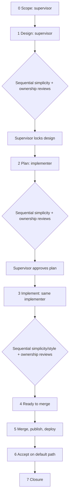

# Supervisor workflow

> **Status: governing implementation workflow.** Provider-neutral: the agent the operator works in
> (Claude, Codex, or another) is the supervisor and uses its own subagents. The supervisor owns
> design; a fixed team of three subagents runs sequentially and is reused across stages and revisions. Each assignment carries its
> [persona](../../personas/README.md) inline. Independent reviews and explicit approvals remain required.

## Task quality

**Quality over quantity.** You are assessed on each task's quality, not phase completion, code
volume, commit count or checked-off items. The phase provides context; the assigned task is the
work to finish. Break that work into smaller working steps where possible without inventing
features to create steps. Complete and demonstrate one assigned task, then stop after its closure;
do not automatically continue through the phase.

## Shape



## Roles

| Role | Persona | Does | Never |
|---|---|---|---|
| Supervisor | This document + [designer](../../personas/designer.md) | Investigates, writes design/planning docs, combines findings, approves, accepts. | Edits product code, delegates its decision, or treats a subagent's claim as evidence. |
| Implementer | [implementer](../../personas/implementer.md) | Investigates, plans; after approval, makes only the approved change. | Edits before approval, broadens scope, approves or accepts its own work. |
| Simplicity/style reviewer | [simplicity](../../personas/simplicity-reviewer.md) + [code style](../../personas/code-style-reviewer.md) | Independently checks simplicity at every review stage and code style at code review. | Authors the design/plan/code, edits, or approves. |
| Ownership reviewer | [ownership](../../personas/ownership-reviewer.md) | Independently checks ownership at every review stage. | Authors the design/plan/code, edits, or approves. |

## Team capacity

Use **three subagent threads per bounded task**, in addition to the supervisor. Run **one subagent
at a time**. Reuse each role's thread for investigation, its next stage, and every revision; resume
or send a follow-up to that agent rather than spawning a replacement. Investigation is performed
by the supervisor or the implementer; reviewers may gather facts for their independent checks.
There is no separate investigator or designer launch. Do not give reviewers authorship to save a
thread. Existing tasks may reuse eligible role agents already assigned to that task.

This bounds both simultaneous work and new thread creation. Phase 70 hit `agent thread limit
reached`, including a sequential fresh-review attempt; the exposed tools did not establish a way
to release capacity. The exact limit is not assumed. Reuse avoids requiring another launch for
every stage and correction; it does not prove a saturated session has recovered. If a required
role cannot run, keep the approval gate open and checkpoint for a fresh session rather than
substituting the supervisor for an independent reviewer.

## Persona rule

Every subagent assignment includes the **full text** of each applicable persona file after its
stage tag. A link is not enough: rules that live only in a linked file get skipped. Reviewers' per-check verdicts show every guardrail was
covered; the supervisor as designer and the implementer list only the principles that changed a
decision, and which.

## Stage tags

Tag each **assignment**, including follow-ups, with `[<stage>:<role>:r<N>] <task>`; round 1
may omit `r1`. Name the three threads for their stable task and role, not a new stage or round.
A correction includes the latest complete artifact/diff, previous findings, and required changes.
Every reviewer rechecks the current artifact against its full checklist; an earlier PASS is not
carried forward as a current verdict. Do not ask a reviewer to check only the correction.

Stages: `investigate`, `design`, `review-design`, `plan`, `review-plan`, `implement`, `review-code`.
Roles: `supervisor`, `implementer`, `simplicity`, `ownership`, `style`. At code review, the
simplicity/style agent returns **two separate verdict tables**, one per persona. Timing uses
explicit assignment start/end boundaries, including supervisor design, per
[task-timing](../../tools/task-timing/README.md); thread lifetime is not stage duration.

## Required loop

0. **Scope.** The supervisor records the user's requirement word for word, scope and non-goals,
   `Done when`, default path, and applicable Security Architecture, Engineering Philosophy and UI
   gates. User-visible work names
   its reference images, viewports, owned slice, states, theme selector and light/dark token map;
   other visible elements are deferred or omitted. Type-1 decisions go to the operator. The
   supervisor or existing implementer checks what already works across the affected repos and
   explains why any supporting change is needed for the request. Plans and reviewer suggestions
   do not authorize extra work; ask the operator before expanding scope.
1. **Design.** The supervisor applies the full designer persona and writes the design in the spoke,
   naming each affected repo by absolute path from the
   [README repository list](../../README.md#where-the-code-lives). The simplicity reviewer checks
   it, then the ownership reviewer. The supervisor combines findings, revises, and obtains new
   verdicts from those same reviewers before explicitly locking the design. Required types,
   contracts and behavior must be defined; an open architecture, ownership, failure or visual
   question blocks approval. Skip when the spoke already locks the design; record why.
2. **Plan.** One implementer receives the plan assignment and does not edit. The simplicity and
   ownership reviewers check the plan sequentially; the supervisor also checks compatibility,
   security, Native AOT, default path and UI gates. Check that the exact dependency packages contain
   the needed APIs, rather than assuming a published version includes newly merged source. The
   supervisor then sends one combined correction (answered by a
   revised plan, `plan:r2`) or explicit approval. A point failing twice returns to Design.
3. **Implement.** The same implementer receives the approved plan and explicit `PLAN APPROVED`;
   a deviation, including a visual mismatch, returns to the supervisor. The simplicity/style
   reviewer checks both full checklists against the diff, then the ownership reviewer checks it.
   The supervisor dismisses findings with a reason or returns them as one correction within the
   approved plan (`implement:r2`); a fix outside the plan goes back to Plan.
4. **Ready to merge.** The supervisor completes the readiness checklist below.
5. **Merge, publish, deploy.** Before invoking a workflow, check its purpose and the exact artifact
   it will use. Merge the product PRs (code, infrastructure, configuration) and
   publish or deploy through the normal route, so the default path uses the real artifacts.
6. **Accept.** The supervisor runs the default-path acceptance below. A failure is fixed through
   this loop, not routed around.
7. **Closure.** See [Closure](#closure).

Documentation-only tasks are edited and validated by the supervisor; product design, plan and
code-review stages, product tests/AOT, and default-path acceptance are N/A, explicitly recorded.
They do not launch an unused product team for timing. Phase 50 moves follow their own protocol.

## Assignments

Each subagent assignment is its stage tag, the applicable persona's full text, then the task.
Code review for the simplicity/style agent includes both full personas and requires both tables.
The supervisor uses this design checklist itself:

```text
DESIGN — SUPERVISOR. Write design documentation only; do not edit product code.
Read: [active spoke], [README of every touched component]
Requirement: [word for word]
Scope, non-goals, locked decisions: [...]
Done when: [verbatim]
Record the output defined in the designer persona.
```

```text
PLAN ONLY — do not create or modify any file until I approve the plan.
Read: AGENTS.md, docs/design/default-path-acceptance.md, [active spoke], [component READMEs]
Task: [bounded outcome and component fit]
Scope and non-goals: [...]
UI, if user-visible: [reference images, viewports, states, owned and omitted elements, theme
selector, light/dark token map, contrast pairs]. Map every owned element; invent nothing.
Done when: [verbatim]
Return the plan output defined in the persona.
```

```text
REVIEW — READ-ONLY. Role: [simplicity | ownership | simplicity and code style] reviewer.
Requirement: [word for word]
Under review: [design text | plan text | branch and repos to diff]
Check whether each change is needed for the requirement as well as correct.
Return the output defined in each assigned persona, with evidence from the current artifact/code/diff.
```

```text
[approved plan]
PLAN APPROVED. Implement only this plan. Do not broaden scope or settle a new design question by
inference; stop and report a material deviation. UI work matches the named references and uses the
named theme and semantic tokens only, no component-local visual values. Return the completion
summary with actual evidence. Do not mark the task complete.
```

**Completion summary** (implementer): task; what changed, per file; verification commands and
results; positive and negative paths; principles that changed a decision; deviations; open
questions; `Done when` evidence per condition.

## Checklists

**Ready to merge** — a named observation for each applicable item:

Use non-AOT builds and tests during the local development cycle. Run Native AOT publish after
implementation and managed checks have stabilized, as the final artifact gate; do not repeat it
for every development iteration. A later source correction requires current-source final evidence.
This changes verification timing, not the zero-warning or installed-default acceptance requirements.

If previously passing code fails, compare the checkout, commands, dependencies and environment
with the successful run before blaming the code. Record observed differences; do not label an
unexplained failure a defect in the old code or ask the operator to waive it before investigating.

- every code-review ⚠️ is fixed or dismissed with a reason;
- only the approved scope changed, and component fit still holds;
- public, wire, persistence, ownership, credential and failure boundaries match the design;
- focused, full and Native AOT checks pass, with zero warnings;
- UI work matches its references in a live browser check of the branch, at every owned viewport
  and state, using theme tokens only, light and dark;
- branch and commits meet the continuity protocol.

**Accept** — after merge and publish or deploy:

- the supervisor demonstrates the requested behavior on the published default path for every
  user-visible, runtime, integration or deployment change
  ([Default-Path Acceptance](default-path-acceptance.md)) and records the action and result;
  merged code and passing helper tests alone do not establish completion, and controlled evidence
  is labelled and never substituted;
- packaged UI parity holds where applicable.

## Closure

1. Record the explicit stage-boundary table defined in
   [task-timing](../../tools/task-timing/README.md), with every product PR. The end-to-end span starts
   with scope and ends at the last product merge; report later acceptance separately.
2. Put the table in the task's completion record, in the spoke docs PR that closes the task, and
   merge it. That closure PR is not part of the product timing span.
3. End every touched repo on a clean, current `main` with no task worktrees.

A **documentation-only task** has no product PR: its timing ends at completed documentation
validation. Include that boundary table and the N/A product gates in its one PR.

The former [Claude/Codex workflow](claude-codex-workflow.md) is retired and grants no exception.
