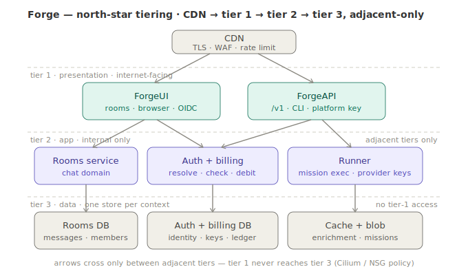

# Phase 42 — Forge Cloud: **access to the tech**

> **Status: IN BUILD — 42.1 ✅ + 42.3 ✅ + 42.2 ✅ DONE 2026-07-16 (all live-verified vs the real `claude`
> CLI; the LOCAL leg of the phase is complete). 42.4 (one image) DONE 2026-07-17 — Docker ≡ ACA is
> real (`--container` runs the published runner image; dev ACA serves the same `/v1` doors).
> Next: finish 42.6a hosted deploy + real OCR verification, then 42.6 task 5b (`forge claude @websearch` hosted).**
> (Design review complete 2026-07-16; designed 2026-07-15.) **This phase is about
> one thing: how a consumer actually gets MCL into
> their hands and their workflow.** Everything in it — the wire doors, `forge claude`, the container, the
> platform key, MCP — is an **access decision**. Hosting, metering and billing are *means*, never the point:
> hosting exists because it is the lowest-setup way to reach the tech; metering exists only so free access
> is affordable. **When a decision trades access against monetization, elegance, or scope — access wins.**
>
> Concretely: an MCL mission (structured reasoning — classify → live-search → answer, guardrails, judge
> loops) is exposed over the wire protocols coding agents **already speak**, so Claude Code / Codex reach it
> with a one-line base-URL change and get answers a naked SOTA model **structurally cannot** give — **no new
> tool to learn, no SDK, no migration.** First local + open source (where the quality guarantee is real,
> proven against the real `claude` CLI), then the *same container* hosted with a platform key + free credits
> so a newcomer reaches the "aha" in **2–3 commands with no provider account at all.**
>
> **Parent:** consumes [Phase 39 — Metered Runtime & Marketplace](phase-39-metered-runtime-marketplace.md)
> (runner container, `UsageTrackingChatClient`, `CostMeter`, per-user ledger, OCI catalog — **all live**) ·
> [Phase 41 — Live Retrieval (Scout)](phase-41-live-retrieval-scout.md) (the anti-hallucination
> classify→search→answer mission that is the sharpest demo) · [Phase 33 — `forge mcp`](phase-33-forge-mcp.md)
> (the stdio MCP server, the seed of the desktop door).
>
> **Done when (phase):** a signed-up user runs `forge login && forge claude @websearch`, points the real
> `claude` CLI at their hosted forge endpoint with a **platform key (no Anthropic/OpenAI account)**, asks a
> question past the model's training cutoff, and gets a **grounded, source-cited answer a bare model
> refuses** — metered and debited against their free credits. The same mission container runs identically
> on local Docker and on Azure Container Apps.

---

## 0. Why this phase exists — reach *is* the product

**"Spectacular reasoning no one can reach = reasoning that doesn't exist."** That was
[Phase 38](phase-38-forge-rooms.md)'s founding line, and Phase 42 is the same sentence applied one layer
out: 38 delivered access *via chat rooms*; **42 delivers access *via the tools people already use*.** Same
principle, wider radius.

It is also the missing half of MCL's accessibility thesis. The Terraform parallel only works if **both**
halves land:

| | Terraform | MCL |
|---|---|---|
| **Authoring** accessible | HCL — declare infra instead of scripting it | the `.mcl` language — declare reasoning instead of wiring it |
| **Consumption** accessible | registry + providers — *consumers ≫ authors* | **Phase 42** — the doors + OCI catalog + zero-setup hosted access |

An accessibility thesis that only solves *authoring* is half a thesis: the average engineer still can't wire
classical ML + LLMs + symbolic gates together, and if reaching the result requires adopting a framework,
learning an SDK, or holding provider keys, **the reach problem just moved.** Phase 42 removes every
remaining barrier between a person and the tech:

| Barrier | Removed by |
|---|---|
| "I'd have to adopt your framework" | **three doors** — it speaks the protocol your agent already speaks (§3) |
| "I'd have to wire it up" | **`forge claude`** — one command (42.2) |
| "I'd have to run infrastructure" | **the container, local ≡ cloud** (42.4) — or don't run it at all (42.6) |
| "I'd need provider accounts and keys" | **platform key + free credits** (42.5) — metering is just the affordability guardrail |
| "My tool is OAuth-walled (desktop)" | **MCP** (42.8) — opt-in, honestly scoped (§4) |

Every spoke below is one of those barriers falling. That is the whole phase.

## 1. The dream, UX-first — "time to first *awesome*"

The whole design is judged by one number: **TTF-awesome** — how fast a stranger goes from nothing to
"oh, this is *better* than the model alone." Hosted is the *lowest*-friction entry, not the highest: the
container is already warm on ACA, the credits are ours to grant, the missions are on tap via OCI, so the
user stands up **nothing**.

```
$ forge login
  ↳ browser opens → sign in (Google / GitHub)
  ✓ signed in as you@…   ·   5,000,000 µ$ credit granted   ·   no provider key needed

$ forge missions                       # the OCI catalog — already on tap, nothing to pull
  @websearch   live-internet, source-cited answers        ← past the model's cutoff
  @guard       safety-gated responses
  @debate      multi-expert reasoning
  …

$ forge claude @websearch              # your Claude Code — now wired to a smarter brain
  ↳ ANTHROPIC_BASE_URL → forge.katasec.com/@websearch   (platform key)
  ↳ launching claude…
  ─────────────────────────────────────────────────────────
   > what shipped in the Claude API this week?
     Files API went GA, … [1] docs.anthropic.com  [2] …     ← naked Claude: "I can't, my cutoff is…"
  ─────────────────────────────────────────────────────────
```

The third command **is** the awesome moment — same tool they already use, a question a naked model punts
on, answered with citations. Each command deletes one classic blocker:

| Command | Friction it deletes |
|---|---|
| `forge login` | no provider account, no keys, no billing — **our platform key, capped free credits** |
| `forge missions` | no prompt engineering, no authoring — the smart endpoint already exists |
| `forge claude @websearch` | no new tool to learn — it's their Claude Code, just smarter |

It collapses further when we want the tightest funnel: `forge login && forge claude @websearch` (2), or
`forge try @websearch` (1 — logs in if needed, then launches).

**The funnel** the whole phase builds toward:

```
forge try @websearch      →  hooked in ~1 command   (hosted, our key, warm container)
       ↓
forge claude --container  →  own it: run locally, offline, same image
       ↓
forge author / publish    →  make your own smart endpoint → marketplace (Phase 39.5)
```

Hosted is **top of funnel** (awesome, instant, ours); local container is **ownership**; authoring is the
**flywheel** — and it is the *same container image* the whole way down.

## 2. The value — how a mission makes the model *better*, not just different

A naked SOTA model is general and confidently wrong at the edges. A **mission** bakes in the structure a
user would otherwise re-invent in every prompt. The value is real **only to the degree the mission is
structural** — the parts a pasted system prompt genuinely *cannot* replicate:

- **Anti-hallucination by construction.** The mission **classifies every request up front** — does this
  need live data, or will the model answer confidently-wrong from stale training? — and routes
  deterministically (Phase 41's `classify → search → answer`). The model never gets to silently
  hallucinate, because the *structure* runs around it, not *if it chooses to ask for help.* This is the
  single most important value and it is **structurally impossible for an opt-in tool to guarantee** (see §4).
- **Multiple model calls + deterministic control flow** — debate, optimist/skeptic/judge, retry-on-fail.
- **Rule / code gates** (`kind: rule`, `kind: exec`) — verify dates, whitelist sources, check a claim
  *before* it reaches the user.
- **Live retrieval** (`kind: search`, Phase 41) — the sharpest binary demo: a bare model *cannot* answer
  past its cutoff; the mission can, with attribution.

> **The thesis:** OpenRouter gives you *every* model behind one URL (an aggregator). Forge gives you a
> *better* model behind one URL (a **transformer**). The composition layer — MCL — is the moat, and it is
> the thing an aggregator can't copy without becoming us.

**Corollary (a guardrail on the pitch):** value scales with non-prompt structure. A one-expert LLM mission
hosted is barely better than a system prompt — so we lead with the missions where the delta is *binary*
(live retrieval), and we never oversell a thin mission as "smarter."

### 2a. A standardized quality *floor* across models — including local

The deeper, more defensible promise than "smarter than a naked SOTA model": because the mission sits
**in-path** and its structural steps (grounding, rule/exec gates, verification, judge loops, reasoning
scaffold) are **model-independent**, the mission delivers a **consistent quality *contract* whichever model
generates the tokens.** It **raises the floor and collapses the variance** across models.

- **Standardize the floor + the behavioral contract, not the ceiling.** The contract — *grounded · cited ·
  gated · verified · structured* — holds on any model. What it **cannot** equalize is raw capability: a
  mission adds *structure*, not *IQ*, so peak quality still tracks the base model. Promise the **floor and
  the guarantees**, never "identical quality."
- **The lift is *largest* where the model is weakest.** A frontier model already decomposes and hedges
  implicitly; a small/local model doesn't (it hallucinates more, skips steps), so the same mission catches
  more and lifts it further. **Marginal value ∝ 1 / base-model-strength** — which is exactly why this
  matters most for **cheap / local / private** models: you get a *guaranteed base-performance floor on a
  model you control.*
- **What that unlocks:** privacy/sovereignty (run the mission container + a local model — e.g. `ollama`,
  already a supported provider — fully on-prem or offline, data never leaves), cost (~free local inference
  made trustworthy), and **model-portability** — swap or downshift the engine (cost, availability, outage,
  next SOTA drop) *without changing the contract the user is promised.* The mission is the durable
  interface; models commoditize underneath it. **Everyone can call a frontier model — guaranteeing a floor
  on the model you *own* is unique to the in-path design.**
- **The honest boundary — minimum-viable-model.** The model must be competent enough to *execute the
  mission's steps* (valid classify JSON, coherent synthesis, tool-use if agentic). Below that, the structure
  breaks and there's nothing to lift. **Offline** also changes the grounding *source*: "live web retrieval"
  needs internet, so fully-offline grounding is retrieval over your *own corpus* (RAG), not the open web —
  still model-independent grounding, different source.
- **This is a *measurable* promise, not marketing — and Phase 37 is the instrument.** The
  [Eval Harness](phase-37-eval-harness.md) proves the floor with a number: run the **same mission** over a
  dataset across **different subject models** (its cross-model eval mode) and show the **floor rises** and
  the **variance collapses** vs the raw models. **Phase 42 makes the claim; Phase 37 prints the number.**

Only the **base-URL door carries this** (in-path, mandatory) — the MCP/opt-in door cannot, for the same
reason it can't carry the anti-hallucination guarantee (§4).

## 3. The architecture — three doors, one room

One mission runtime; several **wire adapters** in front of it. Each adapter is a *door* into the same
room. We already own most of the doors.

```
                          ┌──────────────────────────────────────────────┐
  Claude Code  ──/v1/messages──▶│                                          │
  (CLI / IDE)                   │   THE ROOM  =  MCL mission runtime       │
                                │   (PipelineRunner + experts;             │
  Codex        ──/v1/responses──▶│    tool-capable terminal expert;        │──▶ live internet (Scout)
  (CLI / IDE)                   │    enrich once per turn; verify)         │──▶ metering → ledger (39)
                                │                                          │
  Desktop /    ──── MCP ───────▶│   ONE container image                    │
  any MCP host                  │   local Docker  ≡  Azure ACA             │
                          └──────────────────────────────────────────────┘
```

- **Door A — `/v1/messages`** (Anthropic wire) → **Claude Code** CLI/IDE. Server exists
  (`Katasec.AnthropicServer` in the sibling `oai-server-dotnet` repo,
  live-verified against the real `claude` CLI). Needs: wired into `forge serve`, full-history + tool
  round-trip (42.1, 42.3).
- **Door B — `/v1/responses`** (OpenAI Responses wire) → **Codex** CLI/IDE. Server exists
  ([`Katasec.OaiServer` `HandleResponsesAsync`](../../../oai-server-dotnet/src/Katasec.OaiServer/OaiServer.cs)).
  Codex is **Responses-API-only** as of ~Feb 2026 — Chat Completions removed — so `/v1/responses` is the
  only endpoint that matters for it. Needs: function-call round-trip (42.7).
- **Door C — MCP** → **desktop + any MCP host**. Local stdio server exists (Phase 33 `forge mcp`). Needs:
  remote transport + auth (42.8). **Opt-in, best-effort — see §4.**

**The container is the deploy unit, local and remote.** `forge agent start` already runs a mission as a
container (`ghcr.io/katasec/forge serve` on the `forge-net` docker network); cloud is the *same image* on
ACA. The local in-process server (`forge serve`) is only for fast test-before-containerize. **`①
local ≡ ④ cloud` because it is literally the same binary in the same container** — parity is a property,
not a discipline.

## 3a. Deployment topology — the north star (locked 2026-07-18)

§3 is the *logical* architecture (doors → one room). This is the *physical* one: how those doors are
deployed so a public, mission-executing endpoint can't become a data-exfiltration path. Surfaced while
designing [42.6](phase-42.6-hosted-endpoint-ttfa.md); it governs every hosted spoke from here.



**The target: classic three tiers, adjacent-only.** `CDN → tier 1 (presentation) → tier 2 (app) → tier 3
(data)`, where each tier may talk **only to its neighbour** (enforced by network policy — Cilium / NSG /
ACA ingress), and **tier 1 never reaches tier 3.**

1. **`ForgeUI` and `ForgeAPI` are split** — two tier-1 surfaces, not one. They have genuinely different
   profiles: `ForgeUI` is stateful (SignalR circuits, room state — a WhatsApp-group surface), OIDC-cookie
   auth, human/browser, latency-tolerant; **`ForgeAPI`** is stateless request/response, **platform-key**
   auth, machine clients (Claude Code / Codex), bursty and latency-sensitive. Welding `/v1` onto the Blazor
   app would fuse two things that want to scale, deploy, and fail independently. `ForgeAPI` is the
   client-facing `/v1` edge; **42.6 auth + routing land here** — not on `ForgeUI`, not on the runner.
2. **The runner stays internal — no public IP, no DB creds.** It executes missions (and shells out via
   `kind: exec`), so it is the highest-value compromise target; it must never hold a route to the ledger.
   It is reached only from tier 1 over the internal `/run` contract, and its only secrets are the provider
   keys it genuinely needs to make provider calls.
3. **One datastore per bounded context** (`rooms_db`, `authbilling_db`, …). Auth/billing shares nothing
   with chat messages except a `userId`; `userId` is the cross-context contract (no cross-DB foreign keys).
   Splitting per context now — while data is tiny — is cheap; untangling one conflated DB later is not.
4. **`ForgeAPI` is an AOT target.** It is the best AOT candidate in the stack (stateless + scale-to-zero →
   the cold-start/footprint win is real product value). Keep it AOT-clean by construction — `CreateSlimBuilder`
   + JSON source-gen (house rules) and **raw Npgsql, not EF Core**, for `authbilling` (EF Core is the one
   real AOT blocker, and the tiny two-table auth/billing schema makes Npgsql trivial). `rooms_db` keeps its
   EF context on the non-AOT `ForgeUI`, where it belongs.

**The demo cut is a two-way door.** For the F&F demo we collapse the tier-2 auth/billing service *inline*:
`ForgeAPI` embeds a `ForgeMission.Billing` lib in-process against a **scoped** `authbilling_db` (keys +
ledger only — bounded blast radius; the runner still holds *nothing*). Every north-star seam is pre-cut —
`ForgeAPI` is already its own service, billing is already behind an interface, `authbilling_db` is already a
separate database — so the extraction to the strict north star is *move the box, swap the in-proc call for
an HTTP client*: **no data migration, no client-visible change.** Full detail + the reversible-door diagram
live in the [42.6 spoke](phase-42.6-hosted-endpoint-ttfa.md).

## 4. The quality contract per door — why base-URL first, MCP last

The doors don't just differ in *reach* — they differ in **what quality we can honestly promise**, because
they differ in *who decides whether enrichment happens*:

| | Base-URL door (`/v1/*`) | MCP door |
|---|---|---|
| Mission is… | **the brain** (in-path, every turn) | **a tool** the host brain calls |
| Enrichment is… | **mandatory** | opt-in (the host model decides) |
| Who owns the agent loop | **forge** | the host |
| Anti-hallucination guarantee | ✅ real | ❌ best-effort only |
| Reaches desktop | ❌ (OAuth-walled) | ✅ |

**The load-bearing insight:** the core value (override the model's *false confidence* — it doesn't know
its data is stale) works by *distrusting the model's judgment*. MCP hands that judgment back to the model,
so the search tool goes **uncalled exactly in the silent confident-wrong cases** — the hallucinations the
mission exists to catch. MCP has *no primitive* to intercept every turn before the model responds (tools
are model-invoked, prompts are user-invoked "/" commands, resources are host-attached). So:

- **Base-URL / CLI / IDE = a real guarantee.** This *is* the MCL thesis. **Build first.**
- **MCP / desktop = best-effort nudge** (aggressive tool description), honestly labeled, for
  **explicit-intent** missions (where the user or model *knows* the tool is needed). **Build last.**

Never sell mandatory quality on an opt-in door. (Full surface support matrix in §7.)

## 5. Locked decisions (synthesized 2026-07-15)

1. **The mission is *always* the responder and enriches** — the LLM lives *inside* the mission as a
   **tool-capable terminal expert**, not as an external engine we proxy to, not as a lens. There is **no
   responder-vs-agentic fork**: tool-calling is a capability we build *into* the responder path so the
   mission stays the brain **and** Claude Code/Codex stay real agents.
2. **Three doors, one room** (§3). Wire adapters over one mission runtime; adding a door never changes the
   runtime.
3. **Container is the unit; `local ≡ cloud`** is the same image (Docker vs ACA). Converge `forge serve`
   and `ForgeMission.Runner` onto **one image that exposes `/v1/messages` + `/v1/responses`** (42.4).
4. **Quality contract per door** (§4): base-URL enforces (CLI/IDE, build first); MCP is opt-in best-effort
   (desktop, build last). Match a mission's contract to a door's guarantee.
5. **Re-entrancy is the one hard seam, and it carries `①→④`.** One user turn = N+1 calls (each tool
   round-trip is a fresh request). The gate is **not binary** — the runtime understands **three segments**
   ([42.3](phase-42.3-tool-capable-enriching-responder.md)): **pre-agent** (enrich) runs only on a user-text
   turn; **agent** (terminal expert) runs on every call; **post-agent** (verify/judge/repair) runs **iff the
   agent terminates without a tool call** — and may **re-enter** the agent segment on a repair loop. *(A
   naive binary gate silently kills `Verify` in every agentic flow — caught in external design review
   2026-07-15.)* The pre-agent output is carried across continuations by a **content-addressed cache**
   (key = hash of the conversation prefix), behind an **injectable store** — in-process locally, shared
   (Rooms PG / cache) in cloud. Get it right in ①; ④ swaps the store.
6. **Platform key + capped free credits = the friction-killer.** The hosted runner calls providers with
   *our* keys server-side, metered against the user's balance — so the user needs **no provider account**.
   Reuse Phase 39 ledger/billing/credit-grant verbatim; the cap (~$5) is the abuse bound.
7. **Build order:** base-URL first (guarantee + demo) → hosted → Codex door → MCP door. *(Within the
   base-URL leg, resequenced 2026-07-16: 42.1 → **42.3** → 42.2 — the launcher ships only when tools
   round-trip.)*
8. **One middleware pipeline + a request classifier + aux dispatch ahead of the mission (added 2026-07-16,
   from the live wire capture — [42.3 §0](phase-42.3-tool-capable-enriching-responder.md)).** Every request
   flows through composed middleware (logging/timestamp locally; cloud registers auth + metering into the
   **same** pipeline — `local ≡ cloud` structurally). A classifier on **structural metadata** then splits
   **MISSION requests** (user turn / tool continuation → the segment model) from **AUX requests**
   (everything the client needs that is not the task: `HEAD /` probes, structured-output calls like Claude
   Code's title-gen — which would otherwise misroute into a billed full-mission run). Aux requests dispatch
   **by type to registered handlers** (mux-style; probe → static, title-gen → provider passthrough, unknown
   structured-output → passthrough default). Composition, not inheritance — the same OWIN `AppFunc`
   strategy locked in Phase 41.
9. **Three-tier, adjacent-only topology; `ForgeUI` ≠ `ForgeAPI`; runner internal; DB per context; `ForgeAPI`
   AOT (added 2026-07-18 — §3a).** The hosted deploy shape is `CDN → tier 1 → tier 2 → tier 3`, tier 1 never
   touching tier 3. `ForgeAPI` (stateless, platform-key, machine clients) is a **separate** tier-1 surface
   from `ForgeUI` (stateful, OIDC, browser) and is where 42.6 auth + routing live. The runner stays internal
   (no public IP, no DB creds), reached over `/run`. Auth/billing is its **own bounded context** — a
   `ForgeMission.Billing` lib over a separate `authbilling_db` — never conflated with `rooms_db`. `ForgeAPI`
   is built AOT-clean (Npgsql, not EF Core). **Demo cut** collapses the tier-2 auth/billing service inline in
   `ForgeAPI`, but as a two-way door (every seam pre-cut; extraction needs no data migration).

## 6. Spokes (dependency-ordered)

| Spoke | Scope | Status |
|---|---|---|
| **[42.1 — Anthropic `serve` + full-conversation responder](phase-42.1-anthropic-serve-responder.md)** | Wire `Katasec.AnthropicServer` into `forge serve` (behind `agent.yaml`); make `MissionChatClient` pass the **full conversation** (not just the last user message). Chat-with-mission works end-to-end against the real `claude` CLI (no tools yet). Local, OSS. | **Done** (2026-07-16 — live two-turn recall test `ClaudeCode_TwoTurn_ThroughForgeServe_AnthropicWire`; suite 230 pass; AOT clean) |
| **[42.3 — Tool-capable enriching responder (the hard seam)](phase-42.3-tool-capable-enriching-responder.md)** | Tool round-trip in `AnthropicServer` (accept `tools` — **essentials allowlist** Read/Edit/Write/Bash, emit `tool_use`, resume on `tool_result`) + **enrich-once / re-entrancy gate** + injectable session store. Makes Claude Code **stay agentic** while the mission is the brain. **The load-bearing engineering.** *(Resequenced before 42.2 on 2026-07-16: the launcher must not ship while tool prompts fail as silent false-successes.)* | **Done** (2026-07-16 — live multi-tool test `ClaudeCode_MultiToolTask_ThroughForgeServe_AgenticMission`: planted content + enrich-once + VERIFIED stamp; CI mock host gates commits) |
| **[42.2 — `forge claude` local launcher](phase-42.2-forge-claude-launcher.md)** | One command: ephemeral serve (in-proc fast path **+** `--container` for cloud parity) → export `ANTHROPIC_BASE_URL` → `exec claude` → teardown. `forge claude [mission/@handle]`. The local dev UX. **Ships after 42.3** — the user-facing promise waits for working tools. | **Done** (2026-07-16 — live incl. AOT binary; `--container` verification waits on 42.4's image) |
| **[42.4 — Container convergence: one `/v1` image, Docker ≡ ACA](phase-42.4-container-convergence.md)** | Converge `forge serve` and `ForgeMission.Runner` onto **one image** exposing `/v1/messages` + `/v1/responses`, scheduled on local Docker and Azure ACA identically. Phase-39 metering wrapped in cloud only. | **Done** (2026-07-17 — `ForgeServe` core; runner `/v1` doors + model routing; public multi-arch ghcr image drives `--container`; dev ACA on 0.8.0; built-ins 0.2.0 `role: agent`) |
| **[42.5 — Platform identity & keys](phase-42.5-platform-identity-keys.md)** | `forge login` / `forge auth` → **platform key + free credits** (browser OAuth), stored in `~/.forge`, usable as the bearer token against the hosted `/v1` endpoint. Reuse Phase 39 credit-grant/ledger. (Disambiguate from today's OCI-registry `forge login`.) | Design |
| **[42.6 — Hosted endpoint + TTF-awesome](phase-42.6-hosted-endpoint-ttfa.md)** | Key→mission routing on `forge.katasec.com` (multi-tenant), metering wrapped, missions on tap via OCI, `forge missions`. **Definition of done = the §1 demo** (`forge login && forge claude @websearch` → cited past-cutoff answer, debited). | Design |
| **[42.6a — Hosted artifacts + OCR demo](phase-42.6a-hosted-artifacts-ocr.md)** | First-class hosted artifact upload/download for message-based API A, proven by `forge exec ocr --input ./scan.jpg` and `forge exec ocr --mode=pdf --input ./scan.jpg --out ./scan.ocr.pdf`; sequenced before hosted `forge claude`. | Local artifact pipeline implemented + tested; hosted deploy/PaddleOCR pending |
| **[42.7 — Codex door (`/v1/responses`)](phase-42.7-codex-responses-door.md)** | Function-call round-trip on the Responses wire (`function_call` / `function_call_output`), reusing the 42.3 re-entrancy seam; `forge codex` launcher (env-var wire, platform-key bearer, no ChatGPT login). | Design |
| **[42.8 — MCP desktop door (opt-in, later)](phase-42.8-mcp-desktop-door.md)** | Remote MCP (HTTP transport + platform-key auth) over the hosted catalog, each mission a **named tool**; reaches Claude Desktop / ChatGPT / Cursor. **Honestly scoped to explicit-intent missions — not the anti-hallucination guarantee.** | Design |

## 7. What's already built (the leverage), and the surface matrix

**Already live / built (why this is cheap to reach):**
- Phase 39: `ForgeMission.Runner` (container on ACA), `UsageTrackingChatClient`, `CostMeter`, per-user
  `ledger_entries`, `BillingService` (credit-grant "Granted 5,000,000 µ$" on login, balance-check,
  debit-after-run), OCI mission catalog (39.4, `ghcr.io/katasec`, pinned digest, anonymous). **Live.**
- `Katasec.AnthropicServer` — `/v1/messages`, streaming + non-streaming, **live-verified against the real
  `claude` CLI** ([`ClaudeCodeTests`](../../src/ForgeMission.Tests/Integration/ClaudeCodeTests.cs)).
- `Katasec.OaiServer` — `/v1/chat/completions`, **`/v1/responses`**, `/v1/models`; `Session` / `ISessionStore`
  / `LocalFileSessionStore` (the seed of the re-entrancy store).
- `forge agent start` — mission-as-container on `forge-net` (the local ≡ cloud pattern, shipped).
- `forge mcp` — mission-as-stdio-MCP-tool for Claude Desktop (Phase 33, the seed of Door C).

**Surface support matrix (verified vs vendor docs, 2026-07-15):**

| Surface | Redirectable? | Mechanism | forge door |
|---|---|---|---|
| Claude Code **CLI** | ✅ | `ANTHROPIC_BASE_URL` + token | `/v1/messages` |
| Claude Code **VS Code** | ✅ | `claudeCode.environmentVariables` | `/v1/messages` |
| Claude Code **JetBrains** | ✅ | shell env → integrated terminal | `/v1/messages` |
| Claude Code **desktop** | ❌ self-serve | OAuth only; org-gateway MDM | (MCP) |
| Codex **CLI** | ✅ | `~/.codex/config.toml` `[model_providers.*]` or `OPENAI_BASE_URL` | `/v1/responses` |
| Codex **VS Code** | ⚠️ | shares `config.toml`; new-session model bug | `/v1/responses` |
| Codex **desktop** | ❌ | ChatGPT sign-in only | (MCP) |
| **Desktop / any MCP host** | ✅ (opt-in) | add remote MCP server | MCP |
| web / Slack (either) | ❌ | vendor-hosted, own API | — |

**Takeaway:** both agents share the same layout — **CLI/IDE redirectable, desktop OAuth-walled** — so the
consumer/TTF-awesome funnel lives on the CLI, and MCP is the (opt-in) way onto desktop later.

## 8. Out of scope (this phase)

- **Authoring / publishing missions** (make-your-own smart endpoint) → Phase 39.5 (the flywheel). Phase 42
  distributes the *built-in* catalog only.
- **Monetization tiers / Stripe** → Phase 39.6. Phase 42 uses the existing prepaid-credit ledger.
- **Enterprise desktop via org-gateway MDM** — a real later motion (forge as an org "house gateway"), not
  the consumer funnel; noted in 42.8, not built here.
- **Additional Scout backends** (Tavily/Exa/OpenAI/`x_search`) → Phase 41.3–41.5.
