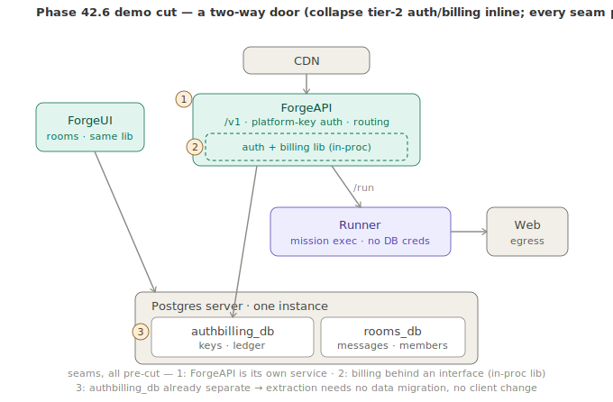

# Phase 42.6 — Hosted endpoint + time-to-first-awesome

> **Status: Design (2026-07-15; re-architected 2026-07-18).** The payoff spoke. Expose the hosted `/v1`
> endpoint on `forge.katasec.com` as a **multi-tenant** surface: a request carrying a platform key is
> authenticated, **routed to a mission by path**, run on the internal runner, **metered**, and debited.
> Definition of done **is the demo** — a stranger reaches a cited, past-cutoff answer through their own
> Claude Code in 2–3 commands.
>
> **Re-architected 2026-07-18 (see [Architecture](#architecture-re-architected-2026-07-18) below).** The
> earlier design put the public `/v1` on the runner reading Postgres directly. Rejected: a public,
> mission-executing process (`kind: exec` shells out) must not hold DB creds. New shape follows the
> [Phase 42 north-star tiering](phase-42-forge-cloud.md#3a-deployment-topology--the-north-star-locked-2026-07-18):
> a **dedicated `ForgeAPI`** (tier 1) terminates auth + routing; the **runner stays internal** (`/run`, no
> DB); **auth/billing is its own bounded context** (`ForgeMission.Billing` over a separate `authbilling_db`).
>
> **Parent:** [Phase 42 — Forge Cloud](phase-42-forge-cloud.md) · **Depends on:**
> [42.3](phase-42.3-tool-capable-enriching-responder.md) (agentic seam), [42.4](phase-42.4-container-convergence.md)
> (one image), [42.5](phase-42.5-platform-identity-keys.md) (platform keys) · **Consumes:** Phase 39
> metering/billing (live), Phase 39.4 OCI catalog (live) · **AOT rules:** [CLAUDE.md](../../CLAUDE.md).
>
> **Done when (== the phase's headline demo). BOTH verbs must work (decided 2026-07-18, Ameer)** — this is
> not an either/or, so **5a and 5b are both in scope**:
> ```
> # one-shot (API A · task 5a) — the top-of-funnel awesome moment
> forge login && forge exec @websearch "what shipped in the Claude API this week?"
>   → grounded, source-cited answer  ·  debited N µ$ against free credits
>
> # agentic (API B · task 5b) — Claude Code with the mission as its brain
> forge login && forge claude @websearch
>   > "what shipped in the Claude API this week?"
>   → grounded, source-cited answer  ·  debited N µ$ against free credits
> ```
> against the hosted endpoint (`api.forge.katasec.com` — see the subdomain decision in the
> [infra checklist](#infra-checklist-katasecforge-infra)), with **no Anthropic/OpenAI account** on the
> user's side.

## Context an implementer needs (verified 2026-07-15)

- **Metering + billing are live (Phase 39):** `UsageTrackingChatClient` meters each provider call inside a
  mission; `BillingService` does balance-check (pre) + debit (post) against per-user `ledger_entries`. The
  live login→"Granted 5,000,000 µ$" and `@guard`→"Debited 224 µ$" prove the exact path. **We wrap the hosted
  `/v1` request in this; we do not rebuild it.**
- **OCI catalog is live (39.4):** built-in missions pulled from `ghcr.io/katasec` by pinned digest,
  public/anonymous. `@websearch`, `@guard`, `@debate`, etc. resolve here — hosted routing maps a mission
  handle → the catalog artifact the runner loads.
- **The 42.3 enrichment cache needs a *shared* implementation in cloud.** ACA may run >1 replica or scale to
  zero, so a tool loop's later calls can land on a different replica than the one that ran the pre-agent
  segment. The content-addressed key (hash of the conversation prefix) is replica-independent by design —
  but the **store** behind it must be shared (Rooms Postgres / a cache), swapped in via the `ISessionStore`
  seam. Miss ⇒ re-run pre-agent.
- **Provider keys are ours, server-side.** The hosted runner already has provider keys (`MCL_API_KEY`,
  `XAI_API_KEY`, …) in its ACA config; the user's platform key never carries a provider key. The mapping is:
  platform key → user + balance; provider keys → the runner's own env.

## Architecture (re-architected 2026-07-18)

Follows the [north-star tiering](phase-42-forge-cloud.md#3a-deployment-topology--the-north-star-locked-2026-07-18)
(`CDN → tier 1 → tier 2 → tier 3`, adjacent-only). Two load-bearing calls, both driven by *"assume the
public endpoint is hostile"*:

- **`ForgeAPI` is a dedicated tier-1 service, separate from `ForgeUI`.** Stateless, platform-key auth,
  machine clients (Claude Code / Codex), bursty — a different animal from the stateful OIDC/browser rooms
  app. **42.6 auth + routing land on `ForgeAPI`**, not on `ForgeUI`, not on the runner.
- **The runner never faces the internet and never holds DB creds.** It executes missions (and shells out
  via `kind: exec`) → highest-value compromise target. `ForgeAPI` is its only ingress.

**`ForgeAPI` is, in pattern terms, an API gateway** (edge auth, routing, rate-limit, usage metering +
billing, reverse-proxy — an *API-monetization* gateway specifically). Keep it that: cross-cutting edge
concerns only, **no mission/business logic** (the runner stays the brain). North-star is the textbook shape
— a **stateless** gateway calling a tier-2 auth/billing service (token introspection + metering); the demo
cut's in-proc `authbilling_db` is the reversible compromise. Because it's a standard pattern, swapping in
APIM / Envoy / Kong at scale is a recognized migration, not a rewrite.

**Relay = pass-through `/v1`, not `/run` (decided 2026-07-18).** An agentic turn (`forge claude`) is **N+1
requests**: the runner emits `tool_use`, but the tool runs on the *client's* machine, so control returns to
Claude Code and comes back as a fresh `tool_result` request that resumes the turn (the 42.3 re-entrancy
seam). The internal `/run` contract is a single RPC — it can't hand control back to the client mid-turn, so
it carries `forge exec` (one-shot) but **not** `forge claude`'s tool loop. So `ForgeAPI` **reverse-proxies
the `/v1` wire** (streaming SSE included) to the runner's existing door for **both** verbs — one relay;
provider keys + the tool loop stay on the runner; `ForgeAPI` skims `usage` off the wire response to debit.
`/run` stays the rooms-internal path (`RoomAgentInvoker`), untouched.

**Auth/billing is its own bounded context.** A new AOT-clean `ForgeMission.Billing` lib (`CostMeter` +
ledger-facing `BillingService`, moved out of `ForgeUI/Services`) over a **separate `authbilling_db`** — a
second database on the *same* Postgres server as `rooms_db`, sharing nothing but `userId`. `ForgeAPI`
reaches it with **raw Npgsql, not EF Core** (EF is the one real AOT blocker; the two-table schema —
`platform_keys` + `ledger_entries` — makes Npgsql trivial and keeps `ForgeAPI` an AOT target). `rooms_db`
keeps its EF context on the non-AOT `ForgeUI`.

**The demo cut is a two-way door.** For F&F we collapse the tier-2 auth/billing service *inline*: `ForgeAPI`
calls `ForgeMission.Billing` in-process against the scoped `authbilling_db` (keys + ledger only; the runner
still holds nothing). Every north-star seam is pre-cut, so extraction later is *move the box + swap the
in-proc call for an HTTP client* — **no data migration, no client-visible change.**



> **AOT sequencing:** build `ForgeAPI` AOT-*clean* from day one (slim builder + JSON source-gen + Npgsql —
> cheap when greenfield), but flip `PublishAot=true` as a **fast-follow after the endpoint works
> end-to-end** — the macOS OpenSSL/brotli linker dance + linux-x64 cross-compile shouldn't block the demo's
> critical path. Staying AOT-clean keeps the flip a switch, not a rewrite.

## Design

**Request path (one hosted turn):**
```
Claude Code ──/v1/messages + Bearer <platform key>──▶ ForgeAPI (tier 1, forge.katasec.com)
   ├─ AUTH   : resolve platform key → (userId, balance)         [42.5 · ForgeMission.Billing]
   ├─ ROUTE  : path /@handle → mission                          [OCI catalog]
   ├─ BALANCE: reject 402 if insufficient                       [ForgeMission.Billing]
   ├─ RELAY  : reverse-proxy /v1 wire → internal runner's door · mission · UsageTrackingChatClient  [runner, tier 2 + 39]
   │            └─ Scout live retrieval → 🌐   ·   enrich-once / N+1 tool loop  [41 + 42.3]
   ├─ DEBIT  : full-mission usage (runner) on wire tail → authbilling_db ledger_entries -= cost   [ForgeMission.Billing]
   └─ RETURN : grounded, cited answer  (+ balance header)
```

**Routing — the key identifies the *principal*, the path identifies the *mission*.** (Framing corrected in
external design review: it is **not** "key→mission" — that conflated two independent resolutions.)

```
platform key        → principal (user + account + balance)
mission handle/path → mission artifact (OCI)
principal + mission → authorization + billing policy
```

**Path-based, decided:** `forge.katasec.com/m/websearch/v1/messages`. Explicit, cache-friendly, easy to
demo, and it keeps the `model` field free — overloading `model` to select a mission collides with the model
id the client legitimately sends. The CLI keeps exposing the friendly `@websearch`. **Live-confirmed
(wire capture, 2026-07-16):** the real `claude` CLI sends `model: "claude-sonnet-4-6"` on every request —
model-based routing would have asked us for a mission named after the client's model.

> ⚠️ **Superseded for the forge-native API by [API design — message-based](#api-design--message-based-decided-2026-07-18)
> (2026-07-18).** The paragraph above remains correct **only** for the spec-bound Anthropic wire (API B),
> whose `/v1/messages` suffix the client mandates. For Forge's own API (API A) the mission handle is a
> **field in the message, never a route segment** — a mission in a URL is permanent public API surface that
> can never be retired. See the locked invariants below.

`forge claude @websearch` (42.2, hosted mode) sets `ANTHROPIC_BASE_URL=https://forge.katasec.com/@websearch`
and the platform key as the token.

**Multi-tenancy.** One converged image, **routing by key+handle**, not a container per user (cold-starts +
cost). Per-user isolation is at the ledger/auth layer; the mission run is stateless per request (plus the
shared re-entrancy store). Heavy/custom-exec missions that need hard isolation are a later concern (ties to
Phase 39.5/39.7).

**`forge missions`** — list the on-tap OCI catalog (name + one-line value), so the user can discover
`@websearch` etc. A `/missions` probe already exists on the runner.

## UX decisions (2026-07-17)

The client-facing shape of the demo, worked through against prior art (NuGet, PowerShellGet, winget,
Helm-over-OCI).

1. **Verbs — `forge exec` (one-shot) vs `forge claude` (agentic), one endpoint.**
   `forge exec @handle "<prompt>"` = fire-and-forget: run the mission once, stream the answer, exit —
   the top-of-funnel awesome moment. `forge claude @handle` = the full agentic Claude Code session
   pointed at the same hosted mission. Two verbs because the intents differ (one-shot Q&A vs
   Claude-doing-work); same hosted `/v1` underneath. `<prompt>` is the mission's primary/free-text input
   (structured `inputs:` surface later via `--input key=value`). (`exec` overlaps `kind: exec` in name
   only — as a CLI verb "execute this mission" it's unambiguous.)

2. **Output — stream + a trust footer, cost pulled on demand.** Stream the answer token-by-token, then a
   single footer line: **grounded/verified badge · source count** (`--sources` expands to URLs).
   **No cost/balance printed per call** — that's pull-not-push (real services don't shove spend at you
   every request); balance is on demand via `forge whoami`. The footer carries the *trust* signal (MCL's
   thesis), not the receipt.

3. **Discovery — `forge missions` reads a curated index, NOT the raw OCI registry.** Sharp constraint
   from Helm-over-OCI: **OCI registries can't be listed/searched** (`GET /v2/_catalog` is optional and
   ghcr.io/most public registries gate or disable it — this is why `helm search` doesn't work on OCI
   registries). OCI stays the **distribution** layer (pull by digest, already done); **discovery is a
   separate index.** For 42.6 (built-in catalog): a small **curated catalog index** the default source
   serves (`@handle · version · one-line · verified`), which `forge missions` reads. Later (user missions,
   39.5) that index grows into a search service (the forge equivalent of nuget.org search / Artifact Hub).
   **Handles namespace like Helm's `repo/chart`:** `@katasec/websearch` fully-qualified, `@websearch`
   resolves from the default/priority source. **Sources are a registered, extensible concept** (à la
   nuget.config sources / `Register-PSResourceRepository` / `winget source add` / `helm repo add`) with
   per-source **trust + priority** — build the single default public source now, leave the seam (it's the
   marketplace on-ramp). Verified tick reuses the **38.5 identity seal / publisher**.

4. **First-run delight — steer the first `exec` to a past-cutoff question.** The undeniable grounded-vs-
   naked delta comes from a **past-training-cutoff** query (a naked model *can't* know; `@websearch`
   answers with live citations — a reasoning trap is weaker, a good naked model gets it too). So on a
   successful `forge login`, **print one suggested command** — a current-events "what shipped in X this
   week?" style prompt — so the awesome moment is the literal next thing the user can paste.

## API design — message-based (DECIDED 2026-07-18)

> **This section is authoritative for Forge's own API and supersedes the URL-shaped routing sketch in
> [Design](#design).** It was reached by design review with Ameer against ServiceStack's
> [message-based API design](https://docs.servicestack.net/design-message-based-apis) and
> [versioning](https://docs.servicestack.net/versioning) guidance.

### The discovery: these are two different APIs, not one

The spoke previously said `forge exec` and `forge claude` ride the "same hosted `/v1` underneath." Wire
capture disproves the premise. In one real Claude Code run the CLI issued **three different kinds** of
request to the same endpoint ([Fixtures/anthropic-wire](../../src/ForgeMission.Tests/Fixtures/anthropic-wire/)):
`main-loop-tools.json` (the real agentic turn), `aux-title-gen.json` ("generate a 3–7 word session title"),
and `aux-state-check.json` ("classify which of four agent states"). If `@websearch` simply hangs off
`/m/websearch/v1/messages`, **Claude Code's title-generation call runs the full websearch mission** —
classify → search → synthesize → judge, ~40–60 s and a real debit — to name a session. That is what 42.3's
classifier + enrich-once gate exists to prevent.

So:

| | **API A — mission invocation** | **API B — chat wire** |
|---|---|---|
| Who owns the shape | **we do** | Anthropic/OpenAI spec (we don't) |
| Unit of work | 1 call = 1 run | many calls/turn; only *some* should run a mission |
| Billing | debit per call | debit per **mission run**, not per HTTP call |
| Handle means | *which mission to run* | *which mission backs this "model"* |
| Client | `forge exec`, SDKs, MQ later | Claude Code / Codex |

**Explicit consequence — the mission handle is NOT in a URL for both APIs, and that split is forced, not
chosen:**
- **API A** (`forge exec @websearch`) — Forge owns both the client (`forge` CLI) and the server. The
  client can send `Mission` as a data field on an `ExecuteMission` message (M2). No URL ever carries the
  handle. This is the "message-based, not REST" design — see the invariants table above.
- **API B** (`forge claude @websearch`) — the caller is the **real, unmodified `claude` CLI**, an
  external client bound to the Anthropic wire spec. It cannot be taught to send a `Mission` field; it
  doesn't know MCL exists, and only understands `ANTHROPIC_BASE_URL` + the standard request shape. So
  the handle is baked into the base URL instead: `forge claude @websearch` sets
  `ANTHROPIC_BASE_URL=https://forge.katasec.com/@websearch` (see the routing decision below,
  `/m/{handle}/v1/*`). This is **not** a design preference — it's the only channel a spec-bound external
  client leaves available.

**Framing: one message, two transports.** API B is not a second API — it is a **spec-bound adapter** that
maps a wire we don't control onto the same underlying operation, with 42.3's classifier deciding whether a
given call invokes a mission at all. API A below is the contract.

### Why message-based (and not URL-shaped)

A mission handle in the URL welds two axes that change at completely different rates: the **API contract**
(how you invoke *any* mission — should be near-immutable) and the **mission catalog** (which missions exist
— the fastest-changing thing here, and after 39.5 it is *users* publishing into it, not us). URL-shaped
identity makes **every mission ever published permanent public API surface**: a route to document, secure,
rate-limit, and never GC because someone's script still calls it. We would not even control the
proliferation.

Message-shaped, `ExecuteMission` is **one operation forever** and the catalog is data flowing through it.

> **An alias can be retired; a contract cannot.** Pretty routes may exist as *non-authoritative sugar*, but
> the moment a client is told the URL **is** the contract, that mission is load-bearing forever.

**We adopt the ServiceStack *philosophy*, not the dependency.** ServiceStack is not an AOT target and would
be a large dep; `ForgeMission.Api` stays a slim minimal-API host with hand-written DTOs + STJ source-gen
(per [CLAUDE.md](../../CLAUDE.md)). `ResponseStatus` below is our own POCO, not `ServiceStack.Interfaces`.

### Locked invariants

| # | Invariant | Why |
|---|---|---|
| **M1** | **The message is the contract; routes are non-authoritative aliases.** | A DTO is populatable from route, query, form, or body in any format — the URL is one input channel, not the contract. |
| **M2** | **Mission identity is data (a field), never a route segment.** | Retiring a mission must never orphan a URL. |
| **M3** | **No versioned URLs.** Every request DTO carries `int Version`. Evolve **additively**: never change an existing property's type (add a new one and infer from the old), never make new properties mandatory. A genuinely breaking change becomes a **new named message**, not `/v2/`. | Parallel per-version types force parallel implementations — a massive DRY violation. One implementation serves all versions by reading whichever fields the client populated. |
| **M4** | **Always a coarse-grained Response DTO carrying `ResponseStatus`.** Errors travel **in the message**, not only as HTTP status. | Adding fields later never breaks older clients; and status codes don't exist over a bus. |
| **M5** | **No transport-derived state in service implementations** — `Execute(ExecuteMission msg, Principal principal)`. | There is no `HttpContext` over a service bus. The task-4 auth filter stays an **HTTP adapter**; it resolves the principal and *passes it in*. |
| **M6** | **`RunId` — every run is addressable independently of the connection that started it.** | The seam that makes async / `ReplyTo` / polling execution possible. Without it a run exists only as an HTTP response body. |
| **M7** | **`ClientToken` — idempotency key, auto-generated by the CLI/SDK before send (EC2 `ClientToken` pattern, not AWS's server-generated tracking `RequestId` — those are different things); the debit path is idempotent against it.** | Buses are **at-least-once**; redelivery is normal and a run **debits a real ledger**. Auto-generated so the caller never has to think about it, but present on the wire so a retry can reuse the same value. Cheap now, breaking to retrofit. |
| **M8** | **Usage + balance are fields in the response message.** HTTP headers are an optional projection. | Headers don't survive a transport change. |
| **M9** | **The server owns `missionRef` and `policy`; never client-supplied.** | `policy: "trusted"` unlocks `kind: exec` + loose egress — a client-set policy is straight privilege escalation. |
| **M10** | **Streaming is a sequence of messages.** NDJSON/SSE is a framing detail. | `RunStreamEvent(progress\|heartbeat\|result\|error)` is already exactly this. |

**Long-term intent (Ameer, 2026-07-18):** these invariants exist so the hosted API can later move onto a
**service bus** as a *different transport over an intact contract*, rather than a rewrite. M5/M6/M7 are the
three that are cheap today and breaking to retrofit.

### The messages

Naming follows the Amazon/ServiceStack convention — verb-named operation + `XResponse`, so a caller can
infer the response type without consulting docs. `Get*` = one by key; `Search*` = filtered many.

```csharp
// ---------- Execute (the core operation) ----------
public sealed class ExecuteMission                      // → ExecuteMissionResponse
{
    public int    Version   { get; set; }               // M3. PROTOCOL version. 0 == pre-versioning client
    public string ClientToken { get; set; }              // M7. idempotency key, auto-generated by CLI/SDK
    public string Mission   { get; set; }               // "websearch" | "forge/websearch" — handle, case-
                                                          // insensitive, Docker-style default namespace (see
                                                          // "Mission resolution" below)
    public string? MissionVersion { get; set; }         // DECIDED 2026-07-19 — MISSION version, distinct from
                                                          // Version above (that's the protocol version — do not
                                                          // conflate). null/absent == latest/currently-pinned.
    public string Input     { get; set; }               // primary free-text input (→ runner's Goal)
    public Dictionary<string,string>? Inputs { get; set; }  // structured mission inputs
    public bool   Stream    { get; set; }               // M10. a message property, not an Accept header
}

public sealed class ExecuteMissionResponse
{
    public string RunId          { get; set; }          // M6
    public string Mission        { get; set; }          // RESOLVED handle (echo what actually ran)
    public string MissionVersion { get; set; }          // resolved version/OCI digest
    public string Answer         { get; set; }
    public bool   Verified       { get; set; }
    public List<MissionSource>    Sources { get; set; }
    public List<MissionTraceStep> Trace   { get; set; }
    public MissionUsage Usage           { get; set; }
    public long         BalanceMicroUsd { get; set; }   // M8
    public ResponseStatus ResponseStatus { get; set; }  // M4
}

public sealed class MissionUsage
{
    public long   InputTokens    { get; set; }
    public long   OutputTokens   { get; set; }
    public double ComputeSeconds { get; set; }
    public string Model          { get; set; }
    public long   CostMicroUsd   { get; set; }
}

public sealed class MissionTraceStep                    // mirrors the engine envelope
{
    public string Expert { get; set; } public string Status { get; set; }
    public string? Text  { get; set; } public string? Reason { get; set; }
    public int    Attempt { get; set; }
}

// DECIDED 2026-07-19 — mirrors Scout.SourceRef (src/ForgeMission.Scout/IWebSearch.cs) field-for-field, the
// actual upstream type this is plumbed from ("Known gap: sources are not in the runner contract yet" below
// is the gap note this used to point at). Provider is non-nullable — SourceRef's own design tenet is
// "source attribution over source-selection", every source always carries one. ImpartialityRating is
// SourceRef's existing Phase-41.6 stub (always null until that lands); carried through now so the shape
// doesn't need a second breaking change later.
public sealed class MissionSource
{
    public string  Url    { get; set; }
    public string? Title  { get; set; }
    public string  Provider { get; set; }
    public double? ImpartialityRating { get; set; }
}

// ---------- Streaming form (M10) ----------
public sealed class MissionRunEvent
{
    public string Type  { get; set; }                   // progress | heartbeat | result | error
    public string RunId { get; set; }
    public MissionProgress?         Progress { get; set; }
    public ExecuteMissionResponse?  Result   { get; set; }   // terminal
    public ResponseStatus?          ResponseStatus { get; set; }
}

// ---------- Catalog ----------
public sealed class SearchMissions                      // → SearchMissionsResponse   (`forge missions`)
{
    public int Version { get; set; }
    public string? Query { get; set; } public string? Publisher { get; set; }
}
public sealed class SearchMissionsResponse
{
    public List<MissionSummary> Results { get; set; }
    public ResponseStatus ResponseStatus { get; set; }
}
public sealed class MissionSummary
{
    public string Mission { get; set; } public string Description { get; set; }
    public string Publisher { get; set; } public string Version { get; set; }
    public bool   Verified  { get; set; }               // 38.5 identity seal
}

public sealed class GetMission                          // → GetMissionResponse
{ public int Version; public string Mission; public string? MissionVersion; }   // MissionVersion: null == latest (same semantics as ExecuteMission)
public sealed class GetMissionResponse                  // DECIDED 2026-07-19 — same shape as MissionSummary
{
    public string Mission { get; set; } public string Description { get; set; }
    public string Publisher { get; set; } public string Version { get; set; }
    public bool   Verified  { get; set; }
    public ResponseStatus ResponseStatus { get; set; }   // e.g. MissionNotFound
}

// ---------- Account / run ----------
public sealed class GetAccount { public int Version; }  // → GetAccountResponse  (`forge whoami`)
public sealed class GetRun     { public int Version; public string RunId; }     // → GetRunResponse (M6)

// DECIDED 2026-07-19:
public sealed class GetAccountResponse
{
    public string  MemberId        { get; set; }
    public string?  Email          { get; set; }
    public long    BalanceMicroUsd { get; set; }
    public ResponseStatus ResponseStatus { get; set; }
}
public sealed class GetRunResponse
{
    public string RunId   { get; set; }
    public string Status  { get; set; }                  // closed set — see "Run status values" below
    public ExecuteMissionResponse? Result { get; set; }   // populated when Status == completed
    public ResponseStatus ResponseStatus { get; set; }    // e.g. RunNotFound
}

// ---------- Shared ----------
// DECIDED 2026-07-19 — matches ServiceStack.ResponseStatus/ResponseError verbatim (github.com/ServiceStack/
// ServiceStack, src/ServiceStack.Interfaces/{ResponseStatus,ResponseError}.cs), not a bespoke shape. No
// TraceId field (correlation id lives in Meta, same as ServiceStack does it) and no Warnings (was an
// orphan — ResponseWarning was never defined and its only use, MissionDeprecated, is cut from scope).
public sealed class ResponseStatus
{
    public string?  ErrorCode  { get; set; }             // null/empty == success
    public string?  Message    { get; set; }
    public string?  StackTrace { get; set; }              // only when server DebugMode is on; never in prod
    public List<ResponseError>? Errors { get; set; }      // field-level validation errors, e.g. InvalidInput
    public Dictionary<string,string>? Meta { get; set; }  // additional context, e.g. Meta["traceId"]
}
public sealed class ResponseError
{
    public string ErrorCode { get; set; }
    public string FieldName { get; set; }
    public string Message   { get; set; }
    public Dictionary<string,string>? Meta { get; set; }
}
```

### Mission resolution — handle/publisher/version + catalog/run storage (DECIDED 2026-07-19, pre-build design lock)

Second design pass, done immediately before writing any 5a code — distinct from the "Task 5a — design
gap review" above (which reviewed the *wire DTOs*; this pass designed the *server-side resolution*
those DTOs need). Full Q&A narrative: [completed doc → Task 5a pre-build design
lock](phase-42.6-hosted-endpoint-ttfa_completed.md#task-5a--pre-build-design-lock-second-pass-found--resolved-2026-07-19).
**No further design questions should be open here — build directly from this section.**

**Handle parsing — Docker-style, one code path for implicit and explicit publisher:**
```csharp
// Pure, dependency-free — unit-testable with zero mocks/I-O.
public readonly record struct MissionHandle(string? Publisher, string Name)
{
    // "websearch" -> (null, "websearch") ; "forge/websearch" -> ("forge", "websearch")
    // Always lowercased (case-insensitive handles, decided 2026-07-19).
    public static MissionHandle Parse(string raw)
    {
        var s = raw.Trim().ToLowerInvariant();
        var slash = s.IndexOf('/');
        return slash < 0 ? new(null, s) : new(s[..slash], s[(slash + 1)..]);
    }
}
```

**Catalog resolution — `IMissionCatalog`, repository-pattern seam (in-memory today, DB-swappable
later — same seam shape as `ILedgerStore`/`IPlatformKeyStore`):**
```csharp
public interface IMissionCatalog
{
    const string DefaultPublisher = "forge";   // NOT "katasec" — that's the OCI registry (ghcr.io/katasec),
                                                // a distribution detail. "forge" is the brand/publisher
                                                // identity, kept deliberately separate (decided 2026-07-19).

    Task<CatalogEntry?> ResolveAsync(MissionHandle handle, string? version, CancellationToken ct);
    Task<IReadOnlyList<CatalogEntry>> SearchAsync(string? query, string? publisher, CancellationToken ct);
}

public sealed record CatalogEntry(
    string Handle, string Description, string Publisher, string Version, bool Verified, string MissionRef);
```
Resolution is **one path**, not an implicit/explicit fork: `var publisher = handle.Publisher ??
IMissionCatalog.DefaultPublisher;`, then a single lookup keyed on `(publisher, handle.Name)`.
`"websearch"` and `"forge/websearch"` resolve identically — proven by a test asserting they return the
same `CatalogEntry` (the same guarantee `docker pull nginx` == `docker pull library/nginx` gives). An
unrecognized publisher **fails closed** (`MissionNotFound`) — it does not fall through to a name-only
match; `randomguy/websearch` must never resolve to the same entry as `forge/websearch`. This makes
multi-publisher support (real third-party publishers) a two-way door: `MissionHandle`/`IMissionCatalog`
never change later, only `StaticMissionCatalog`'s hardcoded entry list gets replaced by a real
registry. `StaticMissionCatalog` (today's only impl) filters its fixed entries against the runner's
live `GET /missions`, same precedent [`AgentRegistry`](../../src/ForgeUI/Services/AgentRegistry.cs)
already sets.

**Run storage — `IRunStore`, same repository-seam shape, backing `GetRun` (M6):**
```csharp
public interface IRunStore
{
    Task SaveAsync(string runId, ExecuteMissionResponse result, CancellationToken ct);
    Task<ExecuteMissionResponse?> TryGetAsync(string runId, CancellationToken ct);
}
```
Today's impl: in-memory, short-TTL, per-process — not durable across restarts or multiple ACA
replicas. Explicitly **not** the long-term shape: the target is **blob storage** (Ameer, 2026-07-19),
so the interface is opaque key-value (`runId` → serializable record) rather than SQL-shaped, so a
disk- or blob-backed implementation is a straight swap, not a redesign.

**`ClientToken` idempotency (M7) — schema gap closed.** `ledger_entries` gains a nullable
`ClientToken` column + unique index, added via the existing idempotent
`AuthBillingSchema.EnsureCreatedAsync` bootstrap (no EF migration — same mechanism task 2 already
established). `BillingService.SettleRunAsync` checks for an existing entry with the same `ClientToken`
before appending a new debit; a matching hit returns the prior result instead of debiting again.

**`GetAccountResponse.Email` — decided `null` for now.** No data source exists without breaking the
`authbilling_db`/`rooms_db` isolation boundary (task 2's own rule: `userId` is the only cross-context
link, no cross-DB FK). `forge whoami` shows `MemberId` for now; a future internal service call
(`ForgeUI` exposing an internal member-lookup endpoint) is the documented path to a real email later —
explicitly not a cross-DB query, which would violate the bounded-context rule.

**`@websearch` — published for real, as a build step of 5a, not deferred.**
[`missions/websearch/mission.mcl`](../../missions/websearch/mission.mcl) (pre-existing, near-identical
to the already-published "Grok" mission) is added to
[`BuiltinMissions.All`](../../src/ForgeMission.Cli/BuiltinMissions.cs) and pushed to `ghcr.io/katasec`
by digest, exactly like the other 5 built-ins.

### Mission lifecycle — cut from scope (decided 2026-07-19)

No second consumer exists yet to protect from a breaking mission change, so `deprecated`/`retired`
catalog states, `MissionSummary.Lifecycle`/`SupersededBy`/`SunsetAt`, and the `MissionDeprecated`/
`MissionRetired` warnings/errors are **not built**. Revisit when a second consumer exists. Missions are
simply `active` today; an unknown handle is `MissionNotFound`.

**Error codes (transport-independent, authoritative):** `MissionNotFound` ·
`InsufficientCredit` · `Unauthenticated` · `InvalidInput` · `PolicyViolation` · `RunFailed`.
The HTTP adapter *projects* these to 404 / 402 / 401 / 400 / 403 / 500 as a convenience — the
**message is authoritative**.

**Run status values (`GetRunResponse.Status`) — closed set, DECIDED 2026-07-19:** `running` ·
`completed` · `failed`. Kept `string`-typed rather than a C# enum for the same reason `ErrorCode` is a
string — an enum breaks deserialization on an older client when a new value is added later; a string lets
the set grow additively (M3) without a breaking change. New values are added to this list, not invented
ad hoc at the call site.

### Transport mapping (today: HTTP)

```
POST /api/ExecuteMission     ← the contract (message name is the endpoint)
POST /api/SearchMissions
POST /api/GetAccount
POST /m/{mission}/run        ← OPTIONAL alias, non-authoritative sugar (M1). May 410 freely.
```

API B keeps its spec-mandated shape (`{base}/v1/messages`, where the client appends `/v1/...`), and is
implemented as an adapter over the same service — **not** a parallel implementation.

### Known gap: sources are not in the runner contract yet

[`RunResponse`](../../src/ForgeMission.Runner.Contracts/) carries `AgentText, Verified, StepCount,
RetryCount, Trace, Usage` — **no structured citations**. Today "source-cited" means whatever URLs the model
wrote inline in prose. `MissionSource[]` above is the target shape; plumbing it from Scout's `SourceRef`
through the runner contract is required for a real trust footer (`--sources`) and is **additive** (M4), so
it can land after the demo without breaking clients.

### What this supersedes

Historical — what the message-based redesign voided from the earlier URL-shaped design. See
[completed doc → "What the message-based redesign supersedes"](phase-42.6-hosted-endpoint-ttfa_completed.md#what-the-message-based-redesign-2026-07-18-supersedes).

## Tasks — status

Full build narrative, evidence, and resolved investigations for done work live in
[phase-42.6-hosted-endpoint-ttfa_completed.md](phase-42.6-hosted-endpoint-ttfa_completed.md) — this
table is the lookup; don't load the companion file unless you need the *how*, not just the *what*.

| # | Task | Status | Detail |
|---|---|---|---|
| 1 | `ForgeMission.Billing` lib (foundation) | ✅ DONE (2026-07-18) | [completed doc](phase-42.6-hosted-endpoint-ttfa_completed.md#task-1--forgemissionbilling-lib-foundation) |
| 2 | `authbilling_db` split (foundation) | ✅ DONE + LIVE (2026-07-19) — code, DB, KV secret, tables all confirmed live | [completed doc](phase-42.6-hosted-endpoint-ttfa_completed.md#task-2--authbilling_db-split-foundation) |
| 3 | `ForgeMission.Api` service (foundation, gateway tier) | ✅ FOUNDATION DONE (2026-07-18) | [completed doc](phase-42.6-hosted-endpoint-ttfa_completed.md#task-3--forgemissionapi-service-foundation--the-api-gateway-tier) |
| 4 | Auth middleware on `ForgeAPI` | ✅ DONE (2026-07-19, commit `da977ff`) | [completed doc](phase-42.6-hosted-endpoint-ttfa_completed.md#task-4--auth-middleware-on-forgeapi) |
| 5a | API A, mission invocation | ✅ **DEPLOYED + LIVE-VERIFIED (2026-07-19)** — `ExecuteMission`/`SearchMissions`/`GetMission`/`GetAccount`/`GetRun` on `ForgeAPI`, live at `api.forge.katasec.com` (`ca-forge-api-dev`, custom domain + managed cert bound). `websearch` published to ghcr.io/katasec (⚠ defaulted to a **private** GHCR package, unlike its 5 public siblings — needs a manual visibility flip, see below) and wired into the live runner (`forge-runner:0.9.0`). 338 tests pass. | below |
| 5b | API B, chat-wire adapter | Sequenced after 5a — not started | below |
| 6 | Billing wrap + spend-abuse trigger ladder | Rung 1 (balance-check + debit) live via 5a; rungs 2–4 still deferred by design | below |
| 7 | Shared enrichment cache | Design decided; 5b-only, not started | below |
| 8 | CLI hosted mode (`forge exec`/`forge claude`/`forge missions`) | **`forge exec` half DONE + live-verified (2026-07-19)** — `forge claude @handle` hosted mode and `forge missions` not started | below |
| 9 | Deploy + verify the headline demo | **One-shot half DONE (2026-07-19)** — `forge exec @websearch "what shipped in the Claude API this week?"` verified live: grounded, dated, source-cited answer, correct ledger debit. Agentic half (`forge claude @websearch`) blocked on 5b. | below |
| 10 | `forge codex @websearch` | Blocked on 42.7 | below |

5a is next per `docs/plan.md`. Tasks 1–3 are the foundation the re-architecture added; 4–5 are auth +
routing; 6+ are billing, cache, CLI, and deploy.

5. **Routing — SPLIT (2026-07-18, see [API design](#api-design--message-based-decided-2026-07-18)).**
   The single "map handle → mission" task was written assuming one API; it is two.
   - **5a — API A, mission invocation.** ✅ **Built + locally verified live (2026-07-19)** — on branch
     `phase-42.6-task-5a-mission-invocation`, not yet merged/deployed. All 5 message endpoints
     implemented on `ForgeAPI`; `websearch` published to `ghcr.io/katasec` and wired into
     `BuiltinMissions.All`; 12 new tests + full suite pass (338/0); a real local smoke test
     round-tripped `ExecuteMission` against `@websearch` with a correct ledger debit. Two small
     doc gaps (no `Principal` type, `ErrorCode.RunNotFound` missing from the closed set) resolved
     inline, not re-opened as design questions. Streaming (`Stream: true`) is implemented but not yet
     live-tested — flagged before task 8. Full build narrative + evidence: [completed doc → Task 5a
     build + local verification](phase-42.6-hosted-endpoint-ttfa_completed.md#task-5a--build--local-verification-2026-07-19).
   - **5b — API B, chat-wire adapter.** `/m/{handle}/v1/*` → the runner's `/v1` door. Needs (i) a
     mission-selection mechanism for the spec-bound wire (the `model` field carries the client's real model
     id, not a handle) and (ii) an **aux-call policy** — the wire capture shows Claude Code firing
     title-gen and agent-state-check calls at the same endpoint, which must NOT each run a full mission.
     Depends on 42.3's classifier. **Sequenced after 5a.**
6. **Wrap the run in billing + the spend-abuse trigger ladder (DECIDED 2026-07-16).** Reuse
   `ForgeMission.Billing` + `UsageTrackingChatClient` as-is. **Metering source (2026-07-18):** debit from the
   runner's `UsageTrackingChatClient`, which sees the **whole** mission (classify + search + synth + judge) —
   surfaced to `ForgeAPI` on the wire tail (an HTTP trailer or a final `forge-usage` SSE event). **Do not**
   debit from the client-facing Anthropic `usage` block — it counts only the terminal segment and under-bills.
   The known hole: `balance-check → run → debit` is
   not a strict ceiling — cost is unknown until after, the check-to-debit window is ~60s (a live run took
   71s), and concurrent requests all pass `balance > 0` before any debit lands. **Accepted at F&F scale**
   (trusted population, stop-at-zero freeze bounds accidents to cents). The ladder — each rung built only
   when its trigger fires:
   1. **Freeze at zero** — already live ([RoomAgentInvoker](../../src/ForgeUI/Services/RoomAgentInvoker.cs)).
   2. **Edge rate limit — DEFERRED (decided 2026-07-18, Ameer). No longer a launch gate; not implemented
      for this spoke.** Consistent with the ladder's own rule (build a rung when its trigger fires) — at
      F&F scale, with a trusted population and stop-at-zero freeze, the trigger has not fired.
      ⚠️ **Two corrections to the original premise:** (a) there is **no Cloudflare (or Front Door) in the
      stack** — `forge.katasec.com` is bound *directly* to `ca-forge-ui-dev` via an ACA managed cert, so
      this was never "pure config, no code"; it would require introducing an edge tier first. (b) ACA has
      no built-in per-IP limiting, so the realistic options if/when the trigger fires are: an app-level
      per-IP limiter in `ForgeAPI`, Azure Front Door + WAF, or adding Cloudflare. Set generously when
      built (e.g. 60/min/IP) — 42.3 tool loops legitimately burst N+1 calls per turn.
   3. **In-app caps (pre-recorded, build on evidence of expensive-single-run abuse — rate limits see
      request counts, not dollars):** (a) per-run cost cap — `UsageTrackingChatClient` already accumulates
      cost mid-run; abort past a configured ceiling (~50,000µ$ ≈ 200× an observed `@guard` run); (b)
      per-member concurrency cap (e.g. 2 in flight). ~20 lines total.
   4. **Transactional credit reservation (pre-recorded, trigger = paying users / 39.6):** append
      `Reservation(−cap)` iff `sum(entries) ≥ cap` (atomic via `pg_advisory_xact_lock(memberId)`); on
      completion append `Release(+cap)` + `Debit(−actual)`. Balance stays `sum(entries)`; needs a
      stale-reservation sweeper; also closes the best-effort-debit leak (a swallowed `SettleRunAsync`
      failure currently makes a run free).
   Return balance in a response header; 402 when short.
7. **Shared enrichment cache:** implement the 42.3 content-addressed store (`ISessionStore` seam) over a
   shared cache — ACA may run >1 replica or scale to zero, so a continuation can land on a different replica
   than the turn that enriched. Cache miss ⇒ re-run pre-agent (never answer ungrounded). Lives with the app
   tier, not `authbilling_db` (a run-continuation cache, not billing data).
8. **CLI hosted mode:** **`forge exec @handle "<prompt>"`** (one-shot, stream + trust footer — the
   top-of-funnel awesome moment) and **`forge claude @handle`** (agentic) both resolve `@handle` → the hosted
   `ForgeAPI` URL + platform key. **`forge missions`** → reads the curated catalog index (not the raw OCI
   registry — see [UX decision 3](#ux-decisions-2026-07-17)).
   - **Message-based (2026-07-18):** the CLI sends `ExecuteMission` / `SearchMissions` / `GetAccount`
     messages — `@handle` is the `Mission` **field**, not a URL segment (M1/M2). The CLI auto-generates
     `ClientToken` (M7) before send and reuses it on retry, and surfaces `ResponseStatus` warnings/errors
     to the user, so a retried invocation never double-debits. `forge whoami` = `GetAccount`.
9. **Deploy + verify the headline demo** (details in the checklist below). `forge login && forge exec
   @websearch "<past-cutoff question>"` → cited answer, ledger debited; and `forge claude @websearch` agentic.
   Verify the **anti-hallucination guarantee**: a stale-fact question triggers the classify→search path (not
   a confident-wrong answer).
10. **`forge codex @websearch`** against the same endpoint once 42.7 lands (`/v1/responses` door).

### Infra checklist (`katasec/forge-infra`)

The re-architecture adds infra, sequenced with the tasks above. All in the layered Bicep (`dev/*`); redeploy
the relevant layer (see [deploy.md](../design/deploy.md)).

- [x] **`authbilling_db`, KV secret, table bootstrap** — ✅ deployed and verified live (2026-07-19). Full
      evidence in the [completed doc, Task 2](phase-42.6-hosted-endpoint-ttfa_completed.md#task-2--authbilling_db-split-foundation).
- [ ] **`ca-forge-api-dev` container app** — new tier-1 ACA app for `ForgeAPI`: **external** ingress
      (the runner stays internal), network access to `psql-forge-dev` and to the internal runner.
      **Hostname DECIDED 2026-07-18 (Ameer): a dedicated subdomain `api.forge.katasec.com`**, not a
      path-split of `forge.katasec.com` — that host is bound *directly* to `ca-forge-ui-dev`, and splitting
      it would require introducing a front proxy (Front Door/Cloudflare) purely for routing. A subdomain
      keeps the tier separation clean and costs one CNAME.
      **DNS (registrar):** `CNAME api → ca-forge-api-dev.niceground-df7fb252.uaenorth.azurecontainerapps.io`
      — every app in `cae-forge-dev` shares that suffix (verify against `ca-forge-ui-dev`'s live FQDN).
      The CNAME can be created before the app exists. **Then, after the app is created:** read
      `az containerapp show -n ca-forge-api-dev -g rg-forge-dev --query properties.customDomainVerificationId`
      → add `TXT asuid.api = <that id>` → bind the hostname (TLS-disabled) → create the managed cert →
      rebind `SniEnabled`. (Same out-of-band cert dance as `500-app`; see its README.) *(Task 3 / 9.)*
- [~] **Edge per-IP rate limit** — **DEFERRED 2026-07-18 (not a launch gate, not implemented).** No CDN/WAF
      tier exists today (`forge.katasec.com` → `ca-forge-ui-dev` directly), so this is not config-only.
      See task 6, rung 2, below. *(Task 6.)*
- [ ] **Tier network policy** (north-star direction) — restrict runner ingress to `ForgeAPI`/`ForgeUI` only;
      keep the runner off public ingress. *(Hardening; not a demo blocker.)*

## Migration-job DB-wipe — DEFUSED (2026-07-18); optional post-dream investigation

**Closed — not a deploy gate, not something to re-investigate unless the symptom recurs.** Full
incident narrative, root-cause investigation, and the standing lesson:
[completed doc → "Migration-job DB-wipe"](phase-42.6-hosted-endpoint-ttfa_completed.md#migration-job-db-wipe--defused-2026-07-18-structurally-fixed-2026-07-19).

One-line summary: a dev-DB wipe during the `authbilling_db` infra work (2026-07-18) traced to a
migration job coupled into the `500-app` deploy manifest. Immediate fix disabled the two live drop
paths; structural fix (2026-07-19) moved the job into its own layer, `dev/450-migrate`, so an app
deploy can no longer touch it at all.

## Out of scope

- Authoring/publishing user missions (only built-in catalog here) — Phase 39.5.
- Paid top-ups / subscription tiers — Phase 39.6.
- MCP door — 42.8.
- Per-key rate limiting beyond credit cap; heavy-mission container isolation — later hardening.
