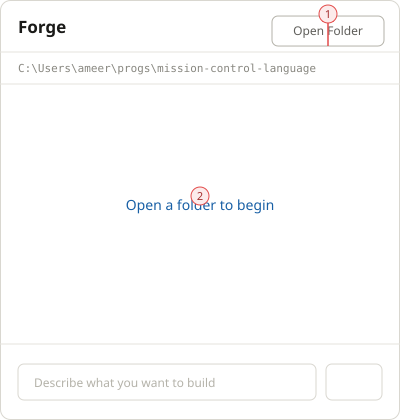
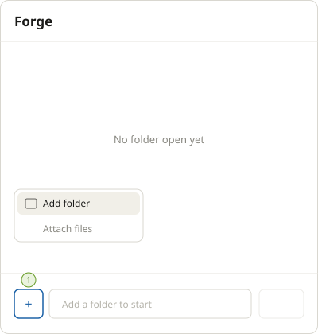
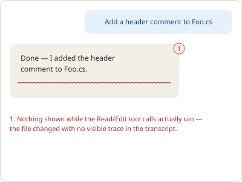
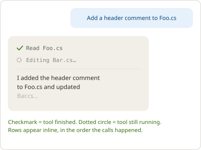

# Phase 43.2 — Avalonia vanilla shell

**Status: In build — Tasks 1–2 done 2026-07-26** (scaffold, AOT, agentic streaming, and streamed
tool-call loop verified); Tasks 3–5 remaining. Task 3 and a folder-open affordance fix (found during
review of Task 2) are now **designed** — see the two design notes below — implementation not yet
started.
Part of [Phase 43 — Forge Desktop](phase-43-forge-desktop.md). Depends on
[43.1](phase-43.1-tool-execution-engine.md) and
[43.7](phase-43.7-workspace-provider.md) (the workspace-root shape this spoke builds against).

## Design

The "meet people where they are" surface: a coding-agent chat UI that feels like Claude Code /
Codex, built once in Avalonia, running natively on macOS and Windows from one codebase. This spoke
deliberately does **not** attempt the debugger-style workbench yet — that's
[43.4](phase-43.4-ide-trace-surface.md), an iteration on top of this shell once it's proven.

Reference UX (what "vanilla" means here): a single chat pane, a compose box, streaming assistant
output, tool-call indicators (e.g. "Reading `Foo.cs`...", "Editing `Bar.cs`..." — the same
minimal-chrome signal every existing coding-agent TUI already gives), and a picker in the same
visual slot as a model dropdown — see [screenshot in the design conversation, 2026-07-25] — except
listing missions instead of models (wired for real in [43.3](phase-43.3-mission-attach-point.md);
this spoke can ship with a single hardcoded mission to prove the shell itself).

## Locked decisions carried from the hub

- New Avalonia project, `ForgeMission.Desktop` (or similar), referencing `ForgeMission.Core`
  directly (in-process — no `forge serve` hop for v1; revisit only if a browser/hosted surface
  needs to share the same backend later).
- Workspace root = whatever directory the user opens the app against, constructed as a
  [43.7](phase-43.7-workspace-provider.md) local-disk provider (not a bare string) and passed into
  [43.1](phase-43.1-tool-execution-engine.md)'s `AgenticSession`. Multi-root ("Add folder") is a
  43.7 open question, not decided here — this spoke can ship single-root as long as it's built
  against 43.7's interface, not a hardcoded path.
- **Native AOT — locked 2026-07-25.** Confirmed against
  [Avalonia's own Native AOT deployment guide](https://docs.avaloniaui.net/docs/deployment/native-aot):
  does not reduce UI/UX design options (full styling/theming/animation/Skia rendering all work),
  only constrains *how* the app is wired — same AOT-first discipline [AGENTS.md](../../AGENTS.md#aot-first--standing-rules-for-all-new-code)
  already mandates elsewhere in this repo, not a new burden:
  - Compiled bindings (`x:CompileBindings="True"`), not reflection bindings.
  - **CommunityToolkit.Mvvm, not ReactiveUI** — ReactiveUI's expression-tree/reflection-heavy
    bindings have documented AOT friction; Avalonia's own official template ships a
    CommunityToolkit.Mvvm variant for this reason.
  - No runtime-loaded/dynamic XAML, static resources, assets as embedded resources. Worth
    remembering for [43.4](phase-43.4-ide-trace-surface.md)'s dockable-panel workbench later if it
    ever wants user-customizable layouts loaded from disk — not a v1 concern.
  - Compile-time DI (register view models at startup), not reflection-based service location.
  - Third-party Avalonia controls need AOT vetting case-by-case; first-party `Avalonia.Controls` is
    fine. Matches this repo's existing "right-size deps" bias (Phase 40.1 design-system doc).
  - Design-time XAML preview/hot-reload is limited under AOT — a dev-workflow cost only, mitigated
    by developing in JIT/Debug (fast inner loop, hot reload works) and only AOT-publishing the
    release binary, same split .NET already does generally.

## Tasks

1. ✅ **Done 2026-07-26.** Scaffolded `ForgeMission.Desktop` from the official CommunityToolkit.Mvvm
   Avalonia template (`Avalonia`/`Avalonia.Desktop`/`Avalonia.Themes.Fluent`/`Avalonia.Fonts.Inter`
   `12.1.0`, `CommunityToolkit.Mvvm` `8.4.2`, `Microsoft.Extensions.DependencyInjection` `10.0.9` —
   no ReactiveUI), added to `ForgeMission.slnx`, referencing `ForgeMission.Core` directly. Compiled
   bindings everywhere (`x:CompileBindings="True"` on `App.axaml`, `MainWindow.axaml`, and the
   message `DataTemplate`'s own `x:DataType`), compile-time DI (`ServiceCollection` in
   `App.axaml.cs`, `MainWindowViewModel` constructor-injected — the view itself never resolves a
   service). `IsAotCompatible=true` added to `Core`/`Parser`/`Scout` (none had it before this task);
   the `Cli`'s existing `YamlDotNet` AOT-suppression comment/setting duplicated onto
   `ForgeMission.Desktop.csproj` verbatim, since `Desktop → Core → YamlDotNet` hits the identical
   warning. Chat view is a static placeholder (message list + compose box + local `Send`) — no
   agentic wiring, streaming, tool indicators, or packaging; correctly out of scope for this task.

   **Implemented by Codex, independently re-verified by Claude on this same machine/working tree**
   (same discipline as [43.7](phase-43.7-workspace-provider.md)):
   - `dotnet build src/ForgeMission.slnx` — reproduced clean (0 errors; 1 unrelated pre-existing
     warning in `ForgeMission.Rooms.Tests/PostgresFixture.cs`, a file this task never touched).
   - `dotnet test src/ForgeMission.Tests/ForgeMission.Tests.csproj` — reproduced independently:
     8 failed / 315 passed / 11 skipped, all 8 failures `ExecExpertRunnerTests` (the known
     pre-existing Windows subprocess `code 9009` baseline from 43.1/43.7) — zero regressions from
     this task.
   - Native AOT `win-arm64` publish: **could not be reproduced directly in this session** — both a
     Bash and a PowerShell attempt failed with `vswhere.exe` not found (its directory,
     `Program Files (x86)\Microsoft Visual Studio\Installer`, isn't on `PATH` in either tool
     session), even though the file exists on disk. This is a re-verification-environment gap, not
     a defect in the implementation: the publish output directory already contained a genuine
     20.3 MB `ForgeMission.Desktop.exe`, timestamped minutes before the commit, which **was**
     independently launched (`tasklist` confirmed a real running `ForgeMission.Desktop.exe` process,
     ~80 MB working set, consistent with a live Avalonia GUI process) and cleanly terminated.
     Physical evidence corroborates the reported publish + launch even though the build step itself
     couldn't be re-run here.
   - `ForgeMission.Rooms.Tests` failures (Docker/Testcontainers unreachable + two Windows file-lock
     cleanup failures) are environment-only and out of scope — that project touches none of the
     files this task changed.
2. ✅ **Done 2026-07-26.** Compose now opens a user-selected local workspace through Avalonia's
   `TopLevel.StorageProvider.OpenFolderPickerAsync`, then runs the bundled `missions/vanilla` mission
   through a fresh `AgenticSession` per Send. A new Core `IChatClientFactory` is the sole provider-client
   seam; Desktop registers the OpenAI-only `LocalKeyChatClientFactory`, which reads
   `~/.forge/credentials.json`'s `providers.openai.apiKey` via the AOT-safe `CredentialStore` source-gen
   path and never reads `ProviderProfile.ApiKey` or a provider-key environment variable. The compose box
   remains disabled until a folder is open; each Send is deliberately one-shot (prior visible messages are
   not mission context).

   Streaming uses `ContentWriter`, not `StepWriter`: the existing `MissionChatClient` precedent proves
   it carries only raw response chunks. While wiring it, a latent Core bug was fixed surgically in
   `DirectExpertRunner.StreamAsync`: tool-mode streaming now passes `ChatOptions.Tools`, rebuilds native
   conversation turns, skips the JSON-envelope instruction, buffers SDK updates while yielding text live,
   and uses the public `ChatResponseExtensions.ToChatResponse` aggregator before writing the existing
   `context["tool_calls"]` key. No `PipelineRunner` change was needed because it already extracts that
   key generically. `VanillaMissionSessionFactoryTests.StreamingToolCall_ReadsPlantedFile_StreamsFinalAnswer`
   verifies a streamed tool call, real local Read execution, and streamed continuation: 1 passed / 0 failed.
   The previously stale vanilla `mcl.lock` hash was regenerated with `forge init` so the normal expert-lock
   check can resolve the bundled mission. Build and Native AOT `win-arm64` publish both passed; the full
   suite remains blocked only by the known 8 Windows `ExecExpertRunnerTests` failures and this machine's
   unavailable Docker/Testcontainers Rooms-test environment. **No real live provider call was exercised**
   — the automated test uses a scripted `IChatClient` (same discipline as 43.1's `AgenticSessionTests`);
   an actual OpenAI round-trip requires a real key in `~/.forge/credentials.json`, not present on this
   machine.

   **Implemented by Codex, independently re-verified by Claude on this same machine/working tree**
   (same discipline as Task 1 and [43.7](phase-43.7-workspace-provider.md)):
   - Reviewed `DirectExpertRunner.StreamAsync` directly — confirms the accumulate-then-
     `ChatResponseExtensions.ToChatResponse(updates)`-once approach was used exactly as corrected during
     review (the initially-proposed `ProcessUpdate` method was verified via .NET reflection against the
     actual installed `Microsoft.Extensions.AI.Abstractions` 10.7.0 DLL to be `internal`, not callable
     across the assembly boundary — this build uses the public alternative instead).
   - `dotnet build src/ForgeMission.slnx` — reproduced clean (0 errors; same 1 unrelated pre-existing
     `PostgresFixture.cs` warning as Task 1).
   - `dotnet test ... --filter "VanillaMissionSessionFactoryTests|AgenticSessionTests"` — reproduced
     independently: 4 passed / 0 failed (the new streamed tool-call test plus 43.1's original 3).
   - `dotnet test src/ForgeMission.Tests/ForgeMission.Tests.csproj` — reproduced independently: 8 failed /
     316 passed / 11 skipped, 335 total — exactly the established baseline (334 total in Task 1's
     independent run) plus one net-new passing test, zero regressions.
   - Native AOT `win-arm64` publish: same re-verification-environment gap as Task 1 (`vswhere.exe`'s
     directory still not on `PATH` in this session) — not reproduced directly, but the publish output
     directory contained a genuine 40 MB `ForgeMission.Desktop.exe` timestamped minutes before the
     commit, independently launched (confirmed running, ~91 MB working set) and cleanly terminated.
3. Tool-call indicators — minimal inline rendering when a tool executes mid-turn (no need for a
   full diff view yet — that's 43.4's code pane).
4. Package for macOS (dev-signed is fine locally; defer notarization) and Windows (win-arm64,
   matching the existing release RID).
5. Dogfood checkpoint: run a real multi-tool coding task end-to-end in the shell on Mac.

### Design note: folder-open affordance fix

**Identified during review, 2026-07-26 — designed, not yet implemented.** Task 2 shipped the
open-folder flow working, but it violates two of the
[Desktop Interaction Principles](../design/desktop-interaction-principles.md) this doc prompted:
a top-right "Open Folder" button that never recedes once a folder is open, and a placeholder
("Open a folder to begin") styled like a clickable link that does nothing when clicked — the real
trigger is the separate button. Compared directly against Claude Desktop's `+`-menu pattern for the
same action.

| Before | After |
|---|---|
|  |  |

**Component spec (after):**
- Composer gains a leading `+` icon button (36×36, outline style) opening a flyout menu anchored to
  itself, with two items: **Add folder** (calls the existing Task-2 `OpenFolderPickerAsync` path,
  unchanged) and **Attach files** (no feature behind it yet — omit the item entirely rather than
  ship a dead menu entry; add it back when file-attach exists).
- Compose textbox placeholder reads "Add a folder to start" while no workspace is open, reverting
  to "Describe what you want to build" once one is. Send button stays visible but disabled (as
  today) rather than removed, so the layout doesn't jump when a folder opens.
- The top-right "Open Folder" button and the dead placeholder text are removed outright, no
  replacement fixture. After a folder opens, the `+` menu remains in the composer for adding more
  later — nothing new appears in the header.

**Gate check:**
- *Rams — as little design as possible:* one entry point (the `+` menu) instead of two. Pass.
- *Rams — long-lasting:* the `+` menu is the same slot [43.3](phase-43.3-mission-attach-point.md)
  and later attach-style features can extend, rather than a bespoke button needing its own future
  redesign.
- *Norman — signifier check:* "No folder open yet" is plain muted text, not link-styled — nothing
  implies it's clickable. Pass.
- *Norman — mapping check:* `+` menu in the composer matches the pattern from Claude Desktop /
  Slack / iMessage users already know. Pass.

**Status:** designed 2026-07-26. Implementation not started — open whether it lands as its own
quick pass or bundled with Task 3's composer changes below.

### Task 3 design: tool-call indicators

**Designed 2026-07-26, before implementation**, per the
[design-first process](../design/desktop-interaction-principles.md#design-first-process-for-ui-facing-tasks).
Today (post Task 2) a tool call executes silently — the assistant bubble shows only the final
answer, with no trace that a `Read`/`Edit`/`Bash` call happened in between. For a coding-agent
surface that's a trust gap, not just a cosmetic one: the whole point of this app is that it edits
real files, and the user currently has no way to see that happening turn-by-turn.

| Before | After |
|---|---|
|  |  |

**Component spec:**
- One indicator row per tool call, rendered inline inside the assistant message, in the exact order
  the calls happened — not batched at the end. No card, no border, no background of its own; it's a
  quiet text row that inherits the assistant bubble's surface (matches the minimal-chrome gate).
- Two states only, no third "queued" state needed for v1:
  - **Running** — a small pending glyph (dashed/spinner-style circle) + present-participle verb +
    target, muted color: `Editing Bar.cs…`.
  - **Done** — a small check glyph + past-tense verb + target, same muted color: `Read Foo.cs`.
- Copy pattern by tool, sentence case, no trailing punctuation except the running state's ellipsis:
  `Read`/`Reading`, `Edit`/`Editing`, `Write`/`Writing`, `Run`/`Running` (for `Bash`, target = the
  command, truncated if long).
- No click target, no expandable output in this task — that's explicitly deferred to
  [43.4](phase-43.4-ide-trace-surface.md)'s code pane. These rows are informational only.
- Font size one step below the message body text (secondary/caption scale) so they read as
  metadata, not content.

**Gate check:**
- *Rams — thorough:* both running and done states are designed up front, not just the happy-path
  "done" state.
- *Rams — as little design as possible:* no card/border/diff view — a single muted text row per
  call, deferring anything richer to 43.4.
- *Norman — feedback check:* the user sees, in real time, that a specific file is being read or
  edited — directly closes the "no visibility" gap in the before state.
- *Norman — signifier check:* rows are static text with no hover/click affordance, since they aren't
  interactive yet — no false promise of a click target.

**Status:** designed, not yet implemented — this is the actual Task 3 build target.

## Done when

The Avalonia app opens a folder, accepts a prompt, streams a response, executes at least one real
tool call (file read/edit) visibly, and produces a working result — on macOS first, with a Windows
build (Surface ARM64 / Parallels) confirmed working within the same iteration (43.6 checkpoint).

## Open questions

- In-process `ForgeMission.Core` vs. `forge serve` loopback — locked toward in-process above, but
  worth a final check once streaming/cancellation semantics are prototyped (in-process gives free
  cancellation via `CancellationToken`; a server hop would need its own cancel-request wire-up).
