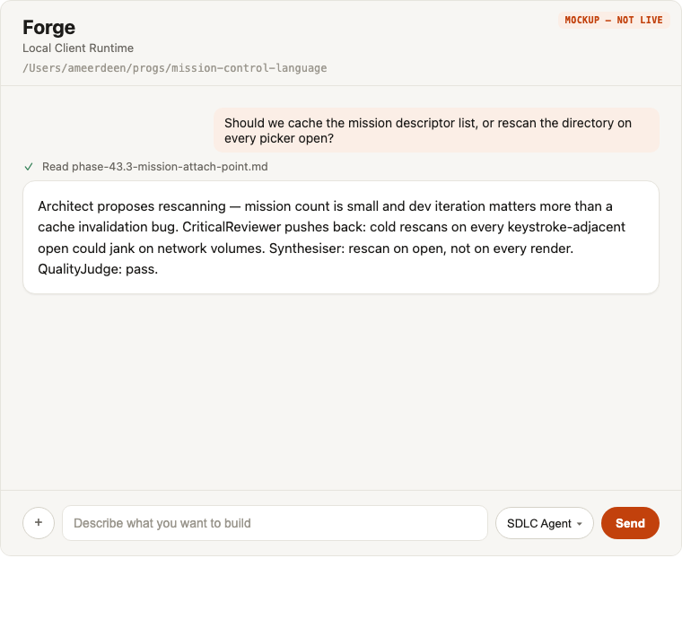
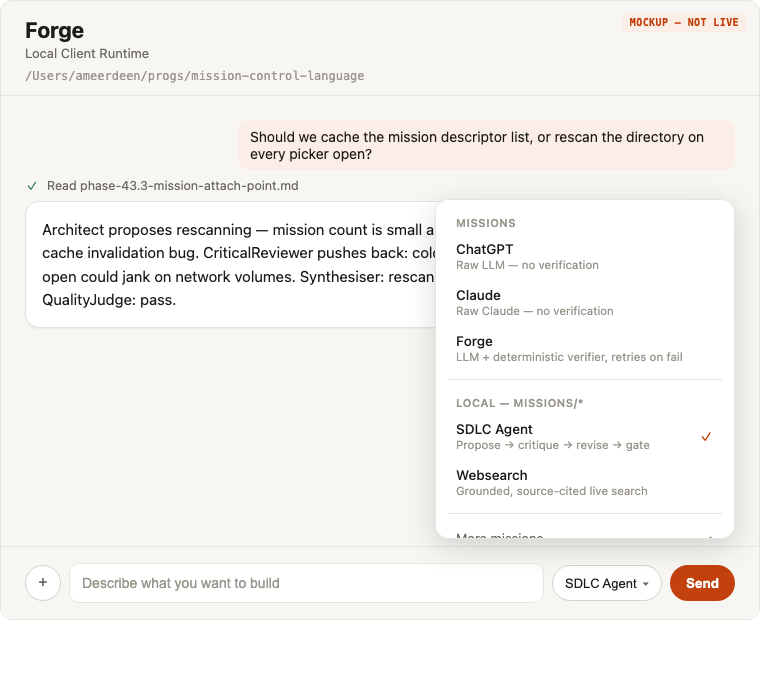

# Phase 43.3 — Mission-as-attach-point

**Status: In progress, deferred behind the Janus Desktop PoC.** Part of
[Phase 43 — Forge Desktop](phase-43-forge-desktop.md). Depends on
[43.11 — Blazor WASM UI + Photino shell](phase-43.11-wasm-photino-shell.md), done 2026-08-08. (The
43.2 Electron/Avalonia shells this doc originally depended on were both superseded/shelved before
43.11 shipped — see [phase-43.2-electron-forge-desktop-shell.md](phase-43.2-electron-forge-desktop-shell.md).)

## Design

Replace the vanilla shell's hardcoded single mission (43.2's scaffold/Mission-Runtime-wiring tasks)
with a real picker in the same
UI slot a model dropdown occupies — attaching a **mission** instead of a model. This is the direct
generalization of [Phase 38.5](phase-38.5-registry-save-as-agent.md)'s raw-model passthrough
pattern (`@claude`/`@openai` as thin `vanilla`-shape missions,
[missions/claude/](../../missions/claude/)) from "one model wrapped as a mission" to "any real
multi-role mission is attachable the same way."

Future flagship mission: [missions/sdlc-agent/](../../missions/sdlc-agent/) —
`Classifier -> (DesignMode | TaskMode)`, where `DesignMode` is
`Architect -> CriticalReviewer -> Synthesiser -> QualityJudge` with `loop(2)`. Picking "SDLC" in
the desktop app should feel exactly like picking a smarter model, but produce the
propose/critique/revise/gate-check shape no single model turn can.

## Tasks

1. ✅ **Done** — Mission discovery. `MissionDiscovery.Discover(missionsRoot)`
   ([src/ForgeMission.Core/Resolution/MissionDiscovery.cs](../../src/ForgeMission.Core/Resolution/MissionDiscovery.cs))
   scans immediate subdirectories of a missions root for `mission.mcl`, mirroring the
   `<missionsRoot>/<name>/mission.mcl` convention `forge run`/`forge claude` already resolve by
   name — but lists every mission found instead of one pinned handle. Returns a
   `MissionDescriptor(Name, MissionFilePath, HasManifest)` per mission, sorted by name; pure
   filesystem read, no OCI/registry calls (Phase 39.4's registry discovery is a later upgrade).
   Root path resolution is left to the caller — same pattern as `RunnerMissionSource`/`forge claude`,
   each of which computes its own root today. Not yet wired to any transport endpoint or UI; that's
   task 2/3's job. 5 unit tests in
   [src/ForgeMission.Tests/Resolution/MissionDiscoveryTests.cs](../../src/ForgeMission.Tests/Resolution/MissionDiscoveryTests.cs).
2. ✅ **Done (v0, scope deliberately cut down 2026-08-08)** — Picker UI. A full mockup was built and
   approved first (below), but implementing it whole turned out to be three separate problems
   tangled into one: (a) show missions in the picker UI, (b) give them nice descriptive
   metadata, (c) catalog/curate which missions are attachable at all. Per-row descriptions and the
   "Missions"/"Local" grouping are (b) and (c) — deferred, not solved, see below. What actually
   shipped is just (a): `AttachableMission(Name, WireMission)` and a hardcoded, flat, two-entry list
   ([src/ForgeMission.ClientRuntime.Presentation/AttachableMissions.cs](../../src/ForgeMission.ClientRuntime.Presentation/AttachableMissions.cs)) —
   `ChatGPT`→`vanilla`, `Websearch`→`websearch` — rendered as a trigger pill + dropdown in
   [Home.razor](../../src/ForgeMission.ClientRuntime.Presentation/Pages/Home.razor), name-only, no
   grouping. Both entries are names already live on the hosted `StaticMissionCatalog`
   (`ForgeMission.Api/MissionCatalog.cs`), chosen specifically so attach/switch could be proven
   against the real cloud catalog with zero new publish or redeploy. `MissionDiscovery` (task 1)
   is **not** wired to this list — it stays an unused-but-tested primitive until the catalog problem
   (c) is picked back up.

   Verified live in-browser (`dotnet run --project src/ForgeMission.ClientRuntime`, screenshotted
   via `preview_start`): trigger shows `ChatGPT`, opens the dropdown with a checkmark on the current
   selection, clicking `Websearch` closes the menu and updates the trigger label. **Not verified**:
   an actual cloud round trip returning a materially different answer per mission — this sandbox has
   no reachable Forge API endpoint/credentials, so that check is left for a real run.

   The mockup below remains the aspirational target for once (b)/(c) are solved, not what got built:

   
   

   What it still gets right for later: trigger pill in the composer bar next to Send (own control,
   not replacing `+`), checkmark instead of a keyboard-shortcut number.
3. ✅ **Done** — Attach/switch. `SessionSetupRequest` carries an optional `Mission` field
   ([ClientRuntimeContracts.cs](../../src/ForgeMission.ClientRuntime.Transport/ClientRuntimeContracts.cs)),
   stored on `ClientRuntimeSession` and threaded into `CloudMissionRuntimeSession`'s wire request
   (replacing the old hardcoded `"vanilla"`) and `MissionRuntimeSession`'s existing `model` parameter
   for local-Docker mode — a null `Mission` falls through to each session type's own default rather
   than duplicating the literal. Selecting a mission mid-conversation tears down the event loop,
   clears the turn history, and opens a fresh session against the same workspace root (no
   cross-mission context carry-over, as designed). **Caveat**: local-Docker-mode mission switching
   is plumbed but inert in practice — a `LocalDockerMissionRuntimeLauncher` runner is booted with one
   pinned `MissionRef`, so it only ever answers as whatever mission it started with regardless of
   what's selected; this only does something real in cloud mode (Desktop's default per 43.14) today.
4. **Decide and implement intermediate-role-switch visibility** (the open question raised in the
   hub): does the user see "Architect proposes... CriticalReviewer pushes back..." inline as the
   mission runs, or only the final synthesized output? Recommend starting **visible** — it's the
   entire value proposition of attaching a mission instead of a model, and hiding it makes the
   mission indistinguishable from a single smarter model in the UI, undermining the pitch this
   whole phase is built on.
5. Dogfood checkpoint: run a real design question through the SDLC mission in the shell, confirm
   the propose/critique/revise/gate loop is visible and legible. **Blocked** until `sdlc-agent` is
   actually attachable (see open questions) — today's picker only offers `ChatGPT`/`Websearch`,
   neither of which exercises a multi-role loop, so this task can't start yet.

## Done when

Original bar: the picker lists real missions (at minimum `sdlc-agent` + the existing
`@claude`/`@openai` passthrough missions), attaching one runs it end-to-end through
[43.1](phase-43.1-tool-execution-engine.md)'s agentic loop, and role-switches are visible in the UI
per task 4's decision. **Not met yet** — `sdlc-agent` isn't attachable (open question above), and
task 4 hasn't been decided or built. What's met so far: attach/switch works end-to-end against two
already-cloud-live, single-turn missions (tasks 2/3) — proves the mechanism, not the full bar.

## Open questions

- **Three separate problems, deliberately un-conflated 2026-08-08** (see task 2): (a) show missions
  in the picker UI — done; (b) give missions nice descriptive metadata — not started; (c) how
  missions get cataloged/curated as attachable at all (hardcoded list today; `MissionDiscovery` from
  task 1 is the not-yet-wired alternative) — not started, a different problem from (b). Don't
  re-merge these when picking this back up.
- Publishing `sdlc-agent` (the future flagship) so it's actually attachable: needs an OCI publish
  to `ghcr.io/katasec` and a `StaticMissionCatalog` entry + hosted redeploy — none of that has
  happened yet. This is explicit follow-up, and is **not** the current Janus Desktop PoC path.
- Cross-mission context carry-over on switch — deferred, revisit if dogfooding surfaces real
  friction.
