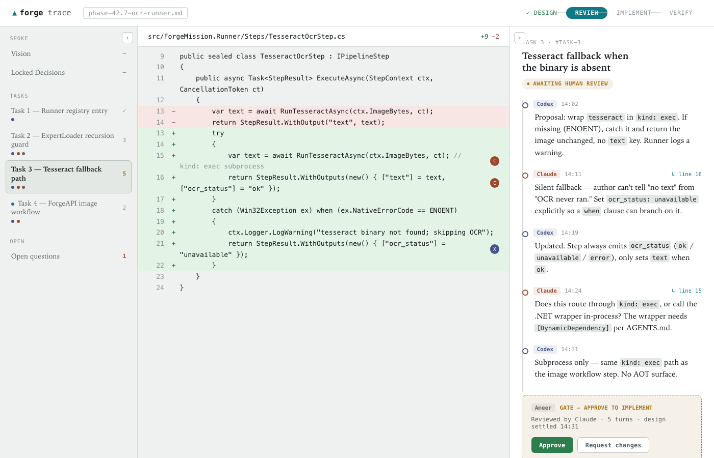
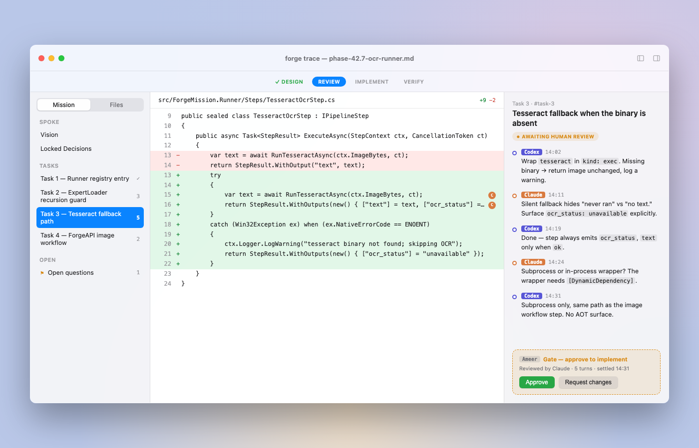
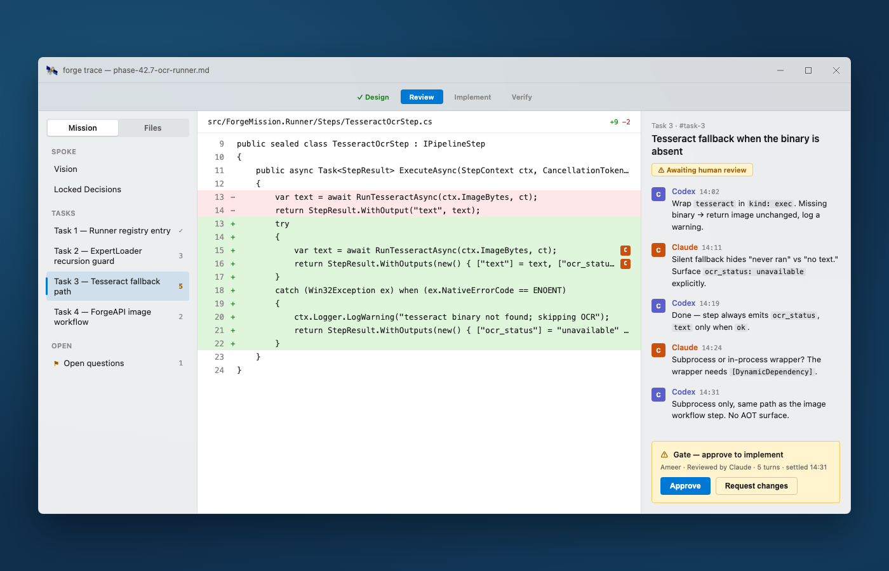
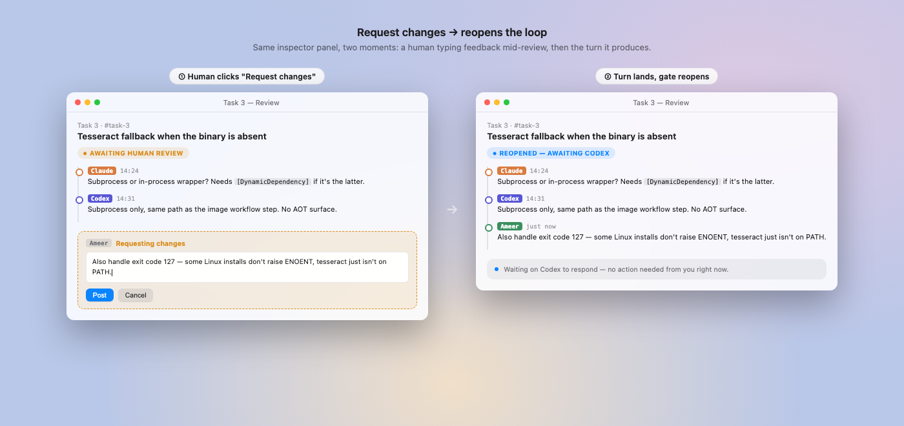
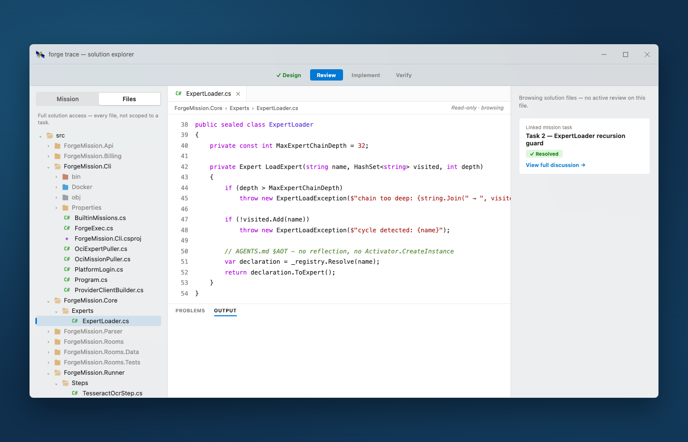
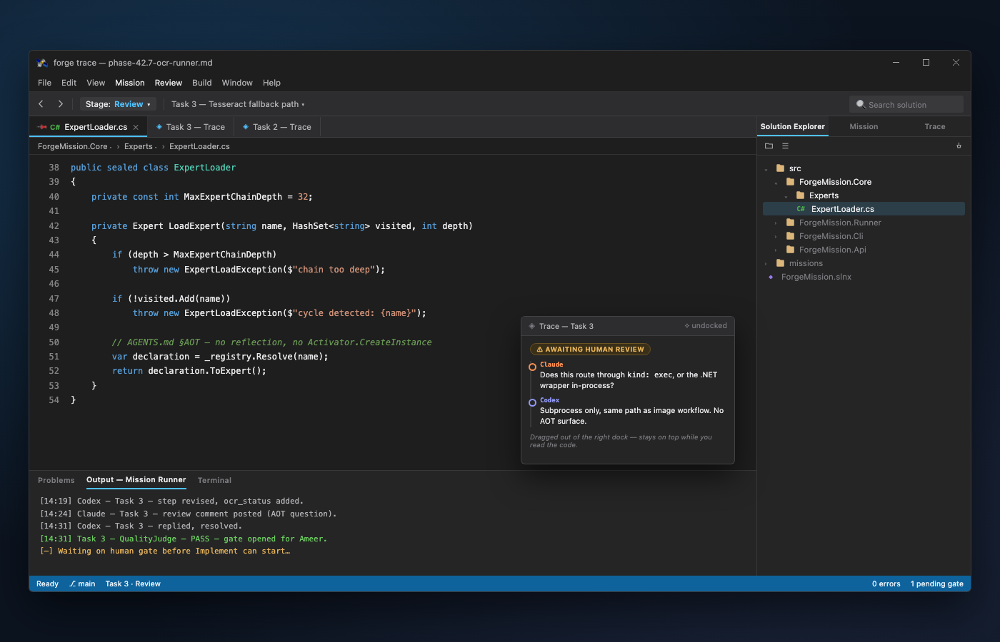

# Phase 43.4 — IDE trace surface (`forge trace`)

**Status: Design — iteration not started.** Part of [Phase 43 — Forge Desktop](phase-43-forge-desktop.md).
Depends on [43.3](phase-43.3-mission-attach-point.md). Promoted from
[docs/brainstorm/forge-trace-ide-surface.md](../brainstorm/forge-trace-ide-surface.md) (design
conversation, 2026-07-20); that doc is now a stub pointing here.

**This spoke is explicitly iterative, not a fixed task list.** The exit criterion is "arrived at a
workbench layout that feels right," reached by building real Avalonia mockups and iterating — not
by checking off a predetermined feature set. Treat the sections below as the design baseline to
iterate *from*, not a spec to build *to* on the first pass.

## The problem this solves

Design/review/approval between a human and multiple AI collaborators (e.g. one mission role as
implementer, another as reviewer/architect) is currently conducted by copy-pasting text between
chat surfaces. Even inside one tool, a chat textbox has no concept of anchoring, state, or
suspension — it can't trace a multi-turn design discussion, inspect a diff next to the argument
about it, or gate an irreversible step on a human decision.

## The core idea: a debugger, not a chat log

`forge trace` is an IDE surface for watching/steering a running mission, anchored to its actual
artifacts, not a bespoke chat schema:

- **Outline** = the mission's own pipeline steps (`Architect`, `CriticalReviewer`, `Synthesiser`,
  `QualityJudge`, ...), derived from the `.mcl` source itself.
- **Thread** = a rendering of consecutive `StepEnvelope`s
  ([StepEnvelope.cs](../../src/ForgeMission.Core/Runtime/StepEnvelope.cs)) as the pipeline actually
  ran, anchored to the file/line a step's output touched.
- **Gate** = a human step where the pipeline genuinely suspends (see
  [43.5](phase-43.5-human-in-the-loop.md)), not a UI illusion.
- **Code pane** = whatever file/diff the current step touched, with inline comment markers tied to
  specific turns.

### The debugger framing

| Debugger concept | Maps to |
|---|---|
| Call stack / step list | The outline — the pipeline's steps |
| Execution trace | The thread pane — consecutive `StepEnvelope`s |
| Breakpoint | A `kind: human` step — genuinely suspends (`Suspended` outcome, [43.5](phase-43.5-human-in-the-loop.md)) |
| Locals/watch window | The context bag (`feedback`, `mode`, ...) |
| Edit-and-continue | Human types feedback → resume seeded with it |
| Source view tied to the current frame | The code pane — whatever file the current step touched |

Grounding: [missions/sdlc-agent/mission.mcl](../../missions/sdlc-agent/mission.mcl)'s `DesignMode`
(`Architect -> CriticalReviewer -> Synthesiser -> QualityJudge`, `loop(2)`) is close to exactly the
propose/critique/revise/gate-check shape this surface visualizes — see
[sdlc-meta-mission.md](../design/sdlc-meta-mission.md) and
[interaction-modes.md](../design/interaction-modes.md) for the classifier-router pattern behind it.

## Full solution access + trust gradient

A skeptical human, especially early on, will want raw file access — not just the diff scoped to
the active step. **Decision (2026-07-20, provisional, carried forward): full access model,
unscoped** — no permissions/visibility layer for now (YAGNI; revisit if a real need surfaces).

Two modes, both first-class, cheap to switch between:
- **Scoped/curated** — diff view tied to the active step, inline comment markers, gate card.
- **Raw/full** — plain source (no diff coloring, no comment markers, "read-only · browsing"), full
  file tree, unscoped. Still cross-links back to a relevant task if one exists, without forcing it.

## Dockable workbench, not a fixed 3-pane layout

Borrowed from Visual Studio's docking model: panel groups are **tabbed** (Solution Explorer /
Mission / Trace sharing one dock zone), **relocatable** (Trace can leave the sidebar and live as a
document-area tab), and **floatable** (a panel can be pulled loose to stay on top). The stage
indicator (Design → Review → Implement → Verify) lives as a toolbar dropdown, the same slot VS uses
for its Debug/AnyCPU config. This directly answers "where does each surface permanently live" —
Solution Explorer, Mission outline, and Trace are interchangeable surfaces a person docks, tabs, or
floats depending on the task at hand, not fixed panes.

## Relationship to `human-in-the-loop` (43.5)

[43.5](phase-43.5-human-in-the-loop.md) is the mechanical spec this depends on: `kind: human`
reusing existing roles (no new `role:` needed — `role: judge` fail/pass + prose-output already
cover it), a `channel:` field resolved like `provider:` is in
[`ProviderClientBuilder.BuildChatClient`](../../src/ForgeMission.Cli/ProviderClientBuilder.cs), and
suspend/resume via a `Suspended` `StepEnvelope` outcome. `forge trace` is naturally a **new
channel**, not a competing product — it gets resume-token/webhook plumbing for free and only owns
rendering.

Confirmed mechanism: a human's "Request changes" writes to `context["feedback"]`, the same slot
`role: judge` failures already use to drive `loop(N)` retries
([PipelineRunner.cs:71,189-190](../../src/ForgeMission.Core/Runtime/PipelineRunner.cs)). No new
protocol needed for the human case.

**Open tension, not yet resolved:** `ForgeMission.Rooms` (`MemberKind.Human`/`Agent`,
[MemberKind.cs](../../src/ForgeMission.Rooms/MemberKind.cs), `Room`, `Message`) already exists,
live, with real server-side state — the "easy channel." But its chat-room rendering was explicitly
ruled out as the wrong UX for this. The reusable part is suspend/resume + the channel abstraction,
not the Rooms chat surface itself — `forge trace` is a sibling rendering, deliberately not the room
view.

## Cross-platform exploration already done (validated the concept, not the final tech)

Static HTML/CSS mockups (not working code) were built and rendered to PNG to validate the concept
visually before committing to a platform — superseded at the time by the since-shelved Avalonia
decision (see [Phase 43 hub](phase-43-forge-desktop.md)), and now, after the 2026-07-27 pivot back
to a web-rendered client (Electron/Blazor Server — see
[forge-desktop-client-runtime.md](../design/forge-desktop-client-runtime.md)), closer in spirit to
the actual build tech again. Kept here as visual reference for the iteration loop, not as working
code:

- **Web-console concept** — outline/BRD · code diff · anchored thread, collapsible panes borrowed
  from VS/Xcode auto-hide. 
- **Native macOS concept** — traffic-light chrome, translucent sidebar, system-blue accents.
  
- **Native WinUI/Fluent concept** — Mica chrome, Segoe UI Variable, Cascadia Code, InfoBar-style
  gate. 
- **Request-changes flow** — human-composes-feedback → turn-lands-on-the-trace sequence.
  
- **WinUI solution explorer** — the raw/full file-browsing mode, matched to this repo's actual
  `src/` structure. 
- **VS-style dockable workbench** — tabbed/relocatable/floatable panel groups.
  

A real SwiftUI source file was also sketched and typechecked clean against the macOS 14 SDK — not
wired into a project, not verified to run, and now moot given the Avalonia decision; kept only as
a historical note, not a starting point.

## Iteration approach for this spoke

1. Build a rough mockup of the dockable workbench (outline + thread + code pane, no gate logic yet)
   inside the [43.2 — Electron Forge Desktop shell](phase-43.2-electron-forge-desktop-shell.md)
   (formerly the now-shelved [Avalonia vanilla shell](phase-43.2-avalonia-vanilla-shell.md) — see
   that doc for why).
2. Run a real SDLC mission session through it, evaluate against the debugger-concept table above —
   does each row actually map cleanly in the built UI, or does the analogy break somewhere real
   usage reveals?
3. Iterate layout/interaction based on what breaks. Repeat until the workbench survives a real
   multi-round design-review session without the human reaching for raw source out of frustration
   (a rough, honest signal — not a number, but a real bar).
4. Only then layer in the Gate (needs [43.5](phase-43.5-human-in-the-loop.md)) and full/scoped
   toggle.

## Open questions / not yet decided

- Whether `kind: human` needs config beyond `channel:` for trace's anchor metadata (file/line, not
  just a channel-rendered prompt) — sharper here than in 43.5 because trace's anchoring is more
  structured than a Slack/email prompt.
- Whether `loop(N)` retries render as repeated history on the trace or collapse.
- Whether the Rooms domain model (`Member`/`Message` types) is reused as trace's persistence layer
  or trace gets its own — leaning toward reuse of suspend/resume + channel abstraction only.
- No fixed timeline — this spoke ends when iteration converges, not on a calendar date.
