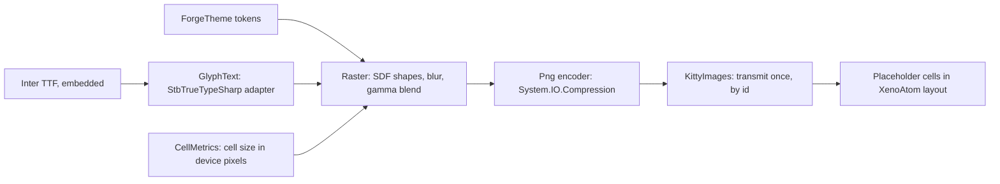

# Phase 56 — `forge chat` TUI graphics (finish line)

> **Status: Tasks 1, 2 and 2b done (2026-10-02); Tasks 1–3 done (2026-10-02); Task 4 design locked; plan next.** Origin: Ameer, 2026-10-01 — "so beautiful people can't
> tell if it's a GUI or a TUI." Builds on [Phase 53](phase-53-forge-client.md)'s TUI (53.5–53.9) and
> [TUI graphics](../design/tui-graphics.md) (kitty placeholders, verified 2026-09-30).

**Goal:** `forge chat` in Ghostty matches the
[finish-line mockup](../design/forge_tui_finish_line_mockup.html) in both themes: anti-aliased card
edges and shadows, proportional-type headings and names, avatars, and motion. Body text stays real
terminal text. The mockup's **X-ray** view is the contract for which cells are images.

## How it renders

A card is plain text cells filled with `CardSurface`, framed by a one-cell ring of image **tiles**
(four corners, top, bottom, left, right). Tiles are drawn once per theme and cell size and reused by
image id, so a card that grows while a reply streams sends no new image.

## Evidence (2026-09-30 – 2026-10-01)

| Fact | Source |
|---|---|
| Kitty images via Unicode placeholders survive XenoAtom redraw and scroll in Ghostty; transmit after entering the alternate screen, straight to stdout | [tui-graphics.md](../design/tui-graphics.md) |
| StbTrueTypeSharp 1.26.13 and SkiaSharp 4.153.1 render Helvetica Neue at 2× practically identically in both themes; Stb applies the font's kern table, Skia does not without `SkiaSharp.HarfBuzz` (a second native library) | Text spike, supervisor scratchpad `textspike` (not in any repo) |
| `Tui/` owns the TUI; `ForgeTheme` is the only file with colour literals; the literal scan (`TuiColourLiteralTests`) is not recursive and misses raw RGBA bytes | forge-mcl `src/ForgeMission.Cli/README.md:39`, `tests/ForgeMission.Mcl.Tests/Cli/TuiColourLiteralTests.cs:37-55` |
| `make install` publishes the Native AOT `forge` to `~/.local/bin` | forge-mcl `Makefile:131-132` |

## Decisions

| # | Decision | Why |
|---|---|---|
| G1 | **Shapes: a small pure-C# renderer** (signed-distance rounded rectangles, hairlines, box-blur shadows, gamma-correct blending) and a PNG encoder on `System.IO.Compression`. | Only shapes are needed; AOT-clean, no native dependency. |
| G2 | **Proportional text: StbTrueTypeSharp**, behind one adapter (`GlyphText`); the only file that references the package. | Same quality as Skia in the text spike, pure managed, AOT-clean (Task 1). **Correction (Task 1):** Stb reads only the legacy `kern` table, and Inter keeps its kerning in GPOS, so headings are unkerned. Kerning is G9. |
| G3 | **No SkiaSharp.** | Native library per platform, several MB, needs a second native library for kerning; no visible gain (G2 evidence). Keeps the 53.2 decision. |
| G4 | **Font: Inter (OFL), SemiBold and Bold static TTFs, embedded** in the binary. | Mockup's face; two weights cover brand (Bold) and names, crumb, headings (SemiBold). Licence allows embedding. |
| G5 | **Images only where the X-ray marks them**; every other cell is terminal text. | Selection and copy keep working; images never carry body text. |
| G6 | **Tiles, not per-card images** (see *How it renders*). | Streaming grows cards several times a second (53.8); tiles make growth free. |
| G7 | **Every visual value is a theme token**: colours, shadow colour/alpha, radii, avatar fills. The literal scan becomes recursive over `Tui/` and also flags raw RGBA. | Themes as data (53.6); closes the scan gaps found above. |
| G8 | **Start-up check, no fallback.** On a terminal (not piped), before the TUI starts, `forge chat` checks two things: XenoAtom reports kitty graphics with truecolor, and the cell-size query answers (exact check: [Task 2](phase-56-tui-graphics_completed.md#task-2--start-up-check-and-card-edges-done-2026-10-02)). If either fails it exits with code 1 and the message: `forge chat needs a terminal that can show images, such as Ghostty or Kitty (not inside tmux). Open forge chat again from one of those.` Piped line mode is unchanged. (Ameer, 2026-10-01) | Early stage: one rendering path, no plain-look copy to maintain. Accepted cost: `forge chat` inside tmux stops working until a later phase adds a plain look. The spike observed both signals (Terminal.app: no reply after 256 ms; tmux: no graphics protocol). |
| G9 | **Kerning: our own GPOS pair-kerning reader inside `GlyphText`** (PairPos formats 1 and 2, Extension lookups, Coverage and ClassDef tables), verified against HarfBuzz's output for Inter. **Image text is simple Latin only**: a heading or name with any other script is drawn as bold terminal text, which Ghostty shapes itself. (Ameer, 2026-10-01) | Every serious renderer uses HarfBuzz, but HarfBuzzSharp brings a native library per platform, and forking it means owning a C++ build per platform. SixLabors.Fonts needs a paid licence above $1M revenue; Typography.OpenFont is unmaintained. We need only pair kerning for one known font: about 200 testable lines and no dependency. Move to stock HarfBuzzSharp, unforked, only if image text must cover every script. |
| G10 | **Default theme is dark**: a missing `~/.forge/config.json` or a missing `theme` key means **dark**. This supersedes the 53.6 default (light). `light` stays selectable, and an unknown name is still an error. (Ameer, 2026-10-01) | The market prefers dark; Ameer uses light via config. |
| G11 | **The window look comes from forge launching its own Ghostty window**: a separate Ghostty instance started with per-instance settings (hidden title bar, padding, cell height). The user's Ghostty config and other windows are untouched. The exact command and settings are designed in Task 6. (Ameer, 2026-10-02) | Ghostty's title-bar and padding settings are app-wide; putting them in the user's config would change every Ghostty window. |

**Gates.** Security: N/A — local rendering only; no entry point, store, identity or secret.
Engineering philosophy: named owners per box in the diagram, one adapter per external dependency
(Stb, compression), no on/off setting and no renderer interface. Failure boundary: font loading is
an embedded resource proven by a test; an unsupported terminal stops at start-up with a named message (G8).
UI: the finish-line mockup is the binding reference by analogy with
[Desktop Interaction Principles](../design/desktop-interaction-principles.md#visual-reference-acceptance-gate--non-negotiable)
(which scopes itself to Desktop/ForgeUI); supervisor Ghostty captures, then Ameer's live review.

## Tasks

| Task | Repo | Done when |
|---|---|---|
| 1 — **Spike** (supervisor scratchpad, not a repo) | — | **Done**, see [completed](phase-56-tui-graphics_completed.md#task-1--spike-done-2026-10-01). |
| 2 — **Start-up check and card edges**: G8, `Tui/Graphics/`, participant cards framed by the fit ring | forge-mcl | **Done** (#33), see [completed](phase-56-tui-graphics_completed.md#task-2--start-up-check-and-card-edges-done-2026-10-02). |
| 2b — **Default theme dark** (G10) | forge-mcl | **Done** ([#36](https://github.com/katasec/forge-mcl/pull/36)): the two default tests went red→green, suite 540 passed, AOT 0 IL; live, with no config `forge chat` opened dark (supervisor capture 2026-10-02). |
| 3 — **Other shapes** | forge-mcl | **Done** ([#37](https://github.com/katasec/forge-mcl/pull/37)), see [completed](phase-56-tui-graphics_completed.md#task-3--other-shapes-done-2026-10-02). |
| 4 — **Proportional text** (StbTrueTypeSharp, Inter, G9 kerning): brand, breadcrumb, card names, headings, avatars, key-hint chips, send button | forge-mcl | See [Task 4](#task-4--proportional-text). |
| 5 — Motion: fade-in of streamed text, spinner frames, hover and pointer shape | forge-mcl | Design locked after Task 4. |
| 6 — Window: hidden title bar, padding, cell height, via forge's own Ghostty window (G11) | forge-mcl | Design locked after Task 5. |
| 7 — Acceptance | — | `forge` from `make install` on merged `main`, in Ghostty, dark by default and light via config: supervisor captures match the mockup; Ameer accepts live. |

### Task 4 — proportional text

Text drawn as kitty images in Inter, blended on the surface below it (naive sRGB on light, linear-light on dark). Everything else stays terminal text.

| Element | When known | Font, size (mockup px) | Cells |
|---|---|---|---|
| Brand: logo square + "forge" | Start-up | Bold 17 | 1 row |
| Breadcrumb "project / **Chat**" | Start-up | SemiBold 14 (prefix in `TextMuted`) | 1 row |
| Card name ("Answerer") | First time a participant appears | SemiBold 14.5 | 1 row |
| Markdown heading (h1–h3) | When its line is complete | SemiBold 19 (h1 22, h3 16) | 2 rows per line, wrapped at words; one over-long word ends in `…` |
| Avatar: circle + initials, before the card name and after "You" | Per participant / user | SemiBold 12, `Accent` fill (user: `TextMuted`) | 1 row (shrunk from the mockup's 1.3) |
| Key-hint chips (`enter`, `⇧ enter`, `pgup/pgdn`, `ctrl c`, `ctrl d`) | Start-up | SemiBold 11 on a rounded `CardSurface` chip with a `Border` hairline | 1 row |
| Send button `↵` in the composer | Start-up | Bold, `Accent` rounded square | 1 row |

| Area | Decision |
|---|---|
| Glyphs | `GlyphText` (the only StbTrueTypeSharp reference, G2) plus our GPOS pair-kerning reader (G9: PairPos formats 1 and 2, Extension lookups, Coverage 1/2, ClassDef 1/2 — the subset writes ClassDef 1). Verified against a committed golden table of all pairs in the allowed set made once with `hb-shape --features=-calt` (HarfBuzz 12.1.0), so tests don't need HarfBuzz. |
| Allowed text (G9) | Printable ASCII, Latin-1 letters, and `↵ ⇧ … · → – — ‘ ’ “ ”`. Anything else, or a heading containing inline code, emphasis or a link, stays bold terminal text. |
| Fonts | Inter 4.1 SemiBold and Bold, **subset** with `hb-subset` to the allowed set, keeping only `kern`, no hinting, no GSUB (about 22 KB each instead of 420 KB). The subset TTFs and the OFL `LICENSE.txt` are committed to forge-mcl and embedded; the subset command is recorded in the README. No Medium weight: SemiBold stands in for the mockup's 500. |
| Streaming headings | Until a newline follows the heading or the reply ends, it shows as bold terminal text on **2 rows** (the image's height), so nothing jumps when the image replaces it. Route: a Markdig pipeline step turns a qualifying heading into a `forge-heading:N` fenced block that `ForgeCodeBlockRenderer` draws (XenoAtom's Markdown package has no heading hook). |
| Sending at runtime | Text images are made and sent when first needed, through `RawStdout` on the UI thread (XenoAtom runs UI-thread code strictly between frames, each frame being one synchronized write). `KittyImages.Transmit` asserts it is on the UI thread (`Dispatcher.VerifyAccess`). Start-up tiles are unchanged (38). |
| Ids and cache | Text ids have bit 23 set (tile ids use 22 bits); 23 bits from a hash of (theme, cell size, style, text, width). A per-session cache maps that key to its id: each image is sent once, and a re-parse only redraws cells. On a hash clash with different content, probe the next id. No deletes within a session. |
| Accepted | Copying a reply loses image headings. A window resize makes new images for wrapped headings. An image heading takes 2 rows plus XenoAtom's 1 blank row after it (the mockup shows none). |
| Plan rulings (supervisor, 2026-10-02) | Image headings: h1–h3 at the top level only. User avatar initial: the first letter of the local account name (`Environment.UserName`), uppercased; an empty circle if it isn't allowed (no display name is stored, and `/me` would need a network call). Expert initial: the first letter of the expert name. Pending heading text sits on row 1 of its 2 rows. AOT evidence includes a `-p:TrimmerSingleWarn=false` warning diff against `main` (forge's NoWarn hides per-assembly warnings). The fallback card name is bold `TextStrong`. |
| Tokens | Font sizes, the avatar fill, and the chip and send-button shapes in `ForgeTheme`; no literals elsewhere. |

**Done when:**
1. Supervisor Ghostty captures, both themes, at 1× (Retina at Task 7): brand, breadcrumb, card names with avatars, a streamed reply with an h2, key chips and the send button match the mockup. A heading in another script stays terminal text.
2. The kerning reader matches the HarfBuzz golden table for every pair, for both weights.
3. A streamed heading switches from text to image with no row jump. Each distinct image is sent once per session (typescript count = 38 + distinct text images).
4. AOT 0 IL warnings; binary growth recorded (subset fonts); build 0 warnings; tests pass.
5. Default path: `make install` from merged `main`, Ghostty, dark default and light via config.

## Next

Task 4: assign it to an implementer (plan only), then approve.
