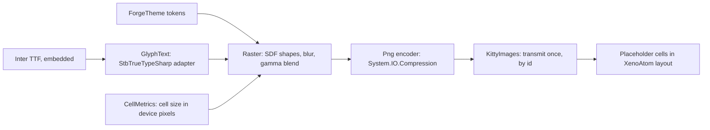

# Phase 56 — `forge chat` TUI graphics (finish line)

> **Status: Task 1 spike verified (2026-10-01); kerning and G8 decisions open.** Origin: Ameer, 2026-10-01 — "so beautiful people can't
> tell if it's a GUI or a TUI." Builds on [Phase 53](phase-53-forge-client.md)'s TUI (53.5–53.9) and
> [TUI graphics](../design/tui-graphics.md) (kitty placeholders, verified 2026-09-30).

**Goal:** `forge chat` in Ghostty matches the
[finish-line mockup](../design/forge_tui_finish_line_mockup.html) in both themes: anti-aliased card
edges and shadows, proportional-type headings and names, avatars, and motion. Body text stays real
terminal text. The mockup's **X-ray** view is the contract for which cells are images.

## How it renders

A card is plain text cells filled with `CardSurface`, framed by a one-cell ring of image **tiles**
(four corners, top, bottom, left, right). Tiles are drawn once per theme and cell size and reused by
image id, so a card that grows while a reply streams sends no new image.

## Evidence (2026-09-30 – 2026-10-01)

| Fact | Source |
|---|---|
| Kitty images via Unicode placeholders survive XenoAtom redraw and scroll in Ghostty; transmit after entering the alternate screen, straight to stdout | [tui-graphics.md](../design/tui-graphics.md) |
| StbTrueTypeSharp 1.26.13 and SkiaSharp 4.153.1 render Helvetica Neue at 2× practically identically in both themes; Stb applies the font's kern table, Skia does not without `SkiaSharp.HarfBuzz` (a second native library) | Text spike, supervisor scratchpad `textspike` (not in any repo) |
| `Tui/` owns the TUI; `ForgeTheme` is the only file with colour literals; the literal scan (`TuiColourLiteralTests`) is not recursive and misses raw RGBA bytes | forge-mcl `src/ForgeMission.Cli/README.md:39`, `tests/ForgeMission.Mcl.Tests/Cli/TuiColourLiteralTests.cs:37-55` |
| `make install` publishes the Native AOT `forge` to `~/.local/bin` | forge-mcl `Makefile:131-132` |

## Decisions

| # | Decision | Why |
|---|---|---|
| G1 | **Shapes: a small pure-C# renderer** (signed-distance rounded rectangles, hairlines, box-blur shadows, gamma-correct blending) and a PNG encoder on `System.IO.Compression`. | Only shapes are needed; AOT-clean, no native dependency. |
| G2 | **Proportional text: StbTrueTypeSharp**, behind one adapter (`GlyphText`); the only file that references the package. | Same quality as Skia in the text spike, pure managed, AOT-clean (Task 1). **Correction (Task 1):** Stb reads only the legacy `kern` table, and Inter keeps its kerning in GPOS, so headings are unkerned. The kerning approach is open (Ameer). |
| G3 | **No SkiaSharp.** | Native library per platform, several MB, needs a second native library for kerning; no visible gain (G2 evidence). Keeps the 53.2 decision. |
| G4 | **Font: Inter (OFL), SemiBold and Bold static TTFs, embedded** in the binary. | Mockup's face; two weights cover brand (Bold) and names, crumb, headings (SemiBold). Licence allows embedding. |
| G5 | **Images only where the X-ray marks them**; every other cell is terminal text. | Selection and copy keep working; images never carry body text. |
| G6 | **Tiles, not per-card images** (see *How it renders*). | Streaming grows cards several times a second (53.8); tiles make growth free. |
| G7 | **Every visual value is a theme token**: colours, shadow colour/alpha, radii, avatar fills. The literal scan becomes recursive over `Tui/` and also flags raw RGBA. | Themes as data (53.6); closes the scan gaps found above. |
| G8 | **Terminal: Ghostty and Kitty only, no fallback** (53.2). Failure behaviour when the cell pixel size is unavailable is decided from Task 1's observation, before Task 2. | No silent degraded mode; the decision needs the measured behaviour. |

**Gates.** Security: N/A — local rendering only; no entry point, store, identity or secret.
Engineering philosophy: named owners per box in the diagram, one adapter per external dependency
(Stb, compression), no on/off setting and no renderer interface. Failure boundary: font loading is
an embedded resource proven by a test; the terminal-capability failure is G8, locked before Task 2.
UI: the finish-line mockup is the binding reference by analogy with
[Desktop Interaction Principles](../design/desktop-interaction-principles.md#visual-reference-acceptance-gate--non-negotiable)
(which scopes itself to Desktop/ForgeUI); supervisor Ghostty captures, then Ameer's live review.

## Tasks

| Task | Repo | Done when |
|---|---|---|
| 1 — **Spike** (supervisor scratchpad, not a repo) | — | Every row PASS; evidence in [tui-graphics.md](../design/tui-graphics.md#phase-56-spike--drawn-edges-and-proportional-text-verified-2026-10-01). Done once G8 is decided. |
| 2 — Renderer, tiles and font in `Tui/`: cards, code blocks, pills, tool lines, composer ring | forge-mcl | Design locked from Task 1 results first. Inputs from Task 1: fit ring (4 columns at the sides, 2 rows top and bottom) rather than strict; new image ids on any theme or cell-size change; reconcile the dark `CardSurface`/`CardBorder` tokens with the mockup (`#151f2e`/`#22304a`); choose between raw stdout and XenoAtom's `GraphicsPresenter` for transmits. |
| 3 — Proportional text: brand, breadcrumb, names, headings, avatars | forge-mcl | Design locked after Task 2. Input from Task 1: choose the blend per theme (naive sRGB on light, linear-light on dark). |
| 4 — Motion: fade-in of streamed text, spinner frames, hover and pointer shape, synchronized output | forge-mcl | Design locked after Task 3. |
| 5 — Window: hidden title bar, padding, cell height (Ghostty config) | — | Open: how the config reaches the user (Ameer). |
| 6 — Acceptance | — | `forge` from `make install` on merged `main`, in Ghostty, light default and dark via config: supervisor captures match the mockup; Ameer accepts live. |

### Task 1 — spike

Prove the finish-line look in Ghostty before writing product code.

| Check | Observation that proves it |
|---|---|
| Cell size in device pixels is available inside a XenoAtom app (terminal reply or XenoAtom API) | Logged width × height on a Retina display; behaviour when no reply arrives |
| One card framed by edge tiles (corners, hairline, shadow) around a XenoAtom card with `CardSurface` interior | Ghostty capture, both themes; no visible seams at tile joins |
| The card grows (simulated streaming) with no new transmits | Transmit count stays at the initial tile count |
| One heading in Inter SemiBold via StbTrueTypeSharp, gamma-correct blend, drawn 1:1 | 4× crop of the capture: no resampling blur; compared with the mockup |
| Native AOT publish with StbTrueTypeSharp and the embedded fonts | 0 IL warnings; binary size delta recorded |

**Done when:** every row has its observation recorded in [tui-graphics.md](../design/tui-graphics.md),
the supervisor compares the captures with the mockup (PASS/FAIL per row), and G8 is decided.

## Next

Ameer decides kerning and G8, which closes Task 1. Then lock the Task 2 design.
