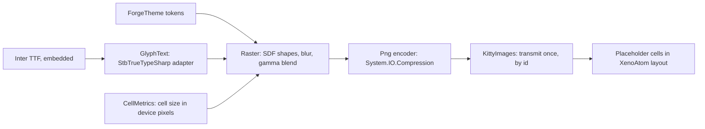
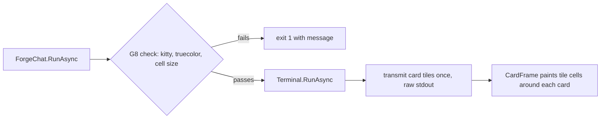

# Phase 56 — `forge chat` TUI graphics (finish line)

> **Status: Task 1 done (2026-10-01); Task 2 design locked, plan next.** Origin: Ameer, 2026-10-01 — "so beautiful people can't
> tell if it's a GUI or a TUI." Builds on [Phase 53](phase-53-forge-client.md)'s TUI (53.5–53.9) and
> [TUI graphics](../design/tui-graphics.md) (kitty placeholders, verified 2026-09-30).

**Goal:** `forge chat` in Ghostty matches the
[finish-line mockup](../design/forge_tui_finish_line_mockup.html) in both themes: anti-aliased card
edges and shadows, proportional-type headings and names, avatars, and motion. Body text stays real
terminal text. The mockup's **X-ray** view is the contract for which cells are images.

## How it renders

A card is plain text cells filled with `CardSurface`, framed by a one-cell ring of image **tiles**
(four corners, top, bottom, left, right). Tiles are drawn once per theme and cell size and reused by
image id, so a card that grows while a reply streams sends no new image.

## Evidence (2026-09-30 – 2026-10-01)

| Fact | Source |
|---|---|
| Kitty images via Unicode placeholders survive XenoAtom redraw and scroll in Ghostty; transmit after entering the alternate screen, straight to stdout | [tui-graphics.md](../design/tui-graphics.md) |
| StbTrueTypeSharp 1.26.13 and SkiaSharp 4.153.1 render Helvetica Neue at 2× practically identically in both themes; Stb applies the font's kern table, Skia does not without `SkiaSharp.HarfBuzz` (a second native library) | Text spike, supervisor scratchpad `textspike` (not in any repo) |
| `Tui/` owns the TUI; `ForgeTheme` is the only file with colour literals; the literal scan (`TuiColourLiteralTests`) is not recursive and misses raw RGBA bytes | forge-mcl `src/ForgeMission.Cli/README.md:39`, `tests/ForgeMission.Mcl.Tests/Cli/TuiColourLiteralTests.cs:37-55` |
| `make install` publishes the Native AOT `forge` to `~/.local/bin` | forge-mcl `Makefile:131-132` |

## Decisions

| # | Decision | Why |
|---|---|---|
| G1 | **Shapes: a small pure-C# renderer** (signed-distance rounded rectangles, hairlines, box-blur shadows, gamma-correct blending) and a PNG encoder on `System.IO.Compression`. | Only shapes are needed; AOT-clean, no native dependency. |
| G2 | **Proportional text: StbTrueTypeSharp**, behind one adapter (`GlyphText`); the only file that references the package. | Same quality as Skia in the text spike, pure managed, AOT-clean (Task 1). **Correction (Task 1):** Stb reads only the legacy `kern` table, and Inter keeps its kerning in GPOS, so headings are unkerned. Kerning is G9. |
| G3 | **No SkiaSharp.** | Native library per platform, several MB, needs a second native library for kerning; no visible gain (G2 evidence). Keeps the 53.2 decision. |
| G4 | **Font: Inter (OFL), SemiBold and Bold static TTFs, embedded** in the binary. | Mockup's face; two weights cover brand (Bold) and names, crumb, headings (SemiBold). Licence allows embedding. |
| G5 | **Images only where the X-ray marks them**; every other cell is terminal text. | Selection and copy keep working; images never carry body text. |
| G6 | **Tiles, not per-card images** (see *How it renders*). | Streaming grows cards several times a second (53.8); tiles make growth free. |
| G7 | **Every visual value is a theme token**: colours, shadow colour/alpha, radii, avatar fills. The literal scan becomes recursive over `Tui/` and also flags raw RGBA. | Themes as data (53.6); closes the scan gaps found above. |
| G8 | **Start-up check, no fallback.** On a terminal (not piped), before the TUI starts, `forge chat` checks two things: XenoAtom reports kitty graphics with truecolor, and the cell-size query answers (exact check: [Task 2](#task-2--start-up-check-and-card-edges)). If either fails it exits with code 1 and the message: `forge chat needs a terminal that can show images, such as Ghostty or Kitty (not inside tmux). Open forge chat again from one of those.` Piped line mode is unchanged. (Ameer, 2026-10-01) | Early stage: one rendering path, no plain-look copy to maintain. Accepted cost: `forge chat` inside tmux stops working until a later phase adds a plain look. The spike observed both signals (Terminal.app: no reply after 256 ms; tmux: no graphics protocol). |
| G9 | **Kerning: our own GPOS pair-kerning reader inside `GlyphText`** (PairPos formats 1 and 2, Extension lookups, Coverage and ClassDef tables), verified against HarfBuzz's output for Inter. **Image text is simple Latin only**: a heading or name with any other script is drawn as bold terminal text, which Ghostty shapes itself. (Ameer, 2026-10-01) | Every serious renderer uses HarfBuzz, but HarfBuzzSharp brings a native library per platform, and forking it means owning a C++ build per platform. SixLabors.Fonts needs a paid licence above $1M revenue; Typography.OpenFont is unmaintained. We need only pair kerning for one known font: about 200 testable lines and no dependency. Move to stock HarfBuzzSharp, unforked, only if image text must cover every script. |
| G10 | **Default theme is dark**: a missing `~/.forge/config.json` or a missing `theme` key means **dark**. This supersedes the 53.6 default (light). `light` stays selectable, and an unknown name is still an error. (Ameer, 2026-10-01) | The market prefers dark; Ameer uses light via config. |

**Gates.** Security: N/A — local rendering only; no entry point, store, identity or secret.
Engineering philosophy: named owners per box in the diagram, one adapter per external dependency
(Stb, compression), no on/off setting and no renderer interface. Failure boundary: font loading is
an embedded resource proven by a test; an unsupported terminal stops at start-up with a named message (G8).
UI: the finish-line mockup is the binding reference by analogy with
[Desktop Interaction Principles](../design/desktop-interaction-principles.md#visual-reference-acceptance-gate--non-negotiable)
(which scopes itself to Desktop/ForgeUI); supervisor Ghostty captures, then Ameer's live review.

## Tasks

| Task | Repo | Done when |
|---|---|---|
| 1 — **Spike** (supervisor scratchpad, not a repo) | — | **Done**, see [completed](phase-56-tui-graphics_completed.md#task-1--spike-done-2026-10-01). |
| 2 — **Start-up check and card edges**: G8, `Tui/Graphics/`, participant cards framed by the fit ring | forge-mcl | See [Task 2](#task-2--start-up-check-and-card-edges). |
| 2b — **Default theme dark** (G10): `ForgeConfig` default and its tests (missing file and missing key mean dark) | forge-mcl | Tests updated; `forge chat` with no config opens dark; build 0 warnings, AOT 0 IL warnings. After Task 2 merges. |
| 3 — Other shapes: code blocks, user pill, APPROVED pill, tool lines, composer ring | forge-mcl | Design locked after Task 2. Input: one-row items need their own cap-tile design (the fit ring is 2 rows tall at top and bottom). |
| 4 — Proportional text (StbTrueTypeSharp, Inter, G9 kerning): brand, breadcrumb, names, headings, avatars | forge-mcl | Design locked after Task 3. Input: choose the blend per theme (naive sRGB on light, linear-light on dark). |
| 5 — Motion: fade-in of streamed text, spinner frames, hover and pointer shape | forge-mcl | Design locked after Task 4. |
| 6 — Window: hidden title bar, padding, cell height (Ghostty config) | — | Open: how the config reaches the user (Ameer). |
| 7 — Acceptance | — | `forge` from `make install` on merged `main`, in Ghostty, dark by default and light via config: supervisor captures match the mockup; Ameer accepts live. |

### Task 2 — start-up check and card edges

Participant cards get the mockup's rounded edges and shadow. Every other element keeps today's look until Task 3.

| Area | Decision |
|---|---|
| G8 check | Two stages, one message. **Before sign-in** (`ForgeChat.RunAsync`, after the theme is read; `UsesTui` computed there), from the environment only: `Terminal.Graphics.Capabilities.SupportedProtocols` contains Kitty, `IsMultiplexer` is false, and `Terminal.Capabilities.ColorLevel` is TrueColor. This catches Terminal.app, tmux (including tmux inside kitty) and missing truecolor before any network call. **On the first TUI tick**: `QueryPixelMetricsAsync()` returns a value. If not, the app stops and `forge chat` prints the same G8 message and exits 1. Pure decision functions for both stages, unit-tested. |
| Ctrl-C and input | **No probe before `Run`.** The cell-size query runs on the TUI's first tick, while XenoAtom already owns input with Ctrl-C as input (the spike's method). There is no `StartInput`/`StopInputAsync` before `Run`, so the `--hands` y/N prompt and Ctrl-C behave exactly as on `main`. (Task 2 review: probing before `Run` made `Console.ReadLine` echo twice.) |
| Cell size | Read once at start-up, like the theme. Window resizes need no new images. A font-size change while running is not handled: Ghostty rescales the images until `forge chat` restarts (accepted). |
| Transmit | Raw stdout, once, on the first UI tick, after `Run` has entered the alternate screen (the verified method). XenoAtom's `GraphicsPresenter` is not used. **Image ids are derived from theme and cell size**, so a later run in the same window with another theme or display never reuses an id at a different size (the spike's stale-placement rule). No kitty delete command. |
| Ring | The fit ring from the spike only (no strict mode). Geometry is solved from the cell size (4 columns, 2 rows, 2 rows at both 19×42 and 10×21). The seam, edge and interior checks run in tests over the whole realistic cell-size range (every height 12–60 px at widths of 0.40–0.60 × the height, which covers how terminal cells are shaped; both themes). There is no runtime check and no start-up failure for the ring. |
| Layout | Card position and spacing follow the mockup: transcript gutter 4 columns (the border lands in column 4), text at column 7, and one blank row above each card. That gives about 50 mockup px border to border against the mockup's 40, the nearest whole row. Today the cards touch and have no gutter (`ChatScreen.cs:21`). The layout numbers (mockup unit 20, gutter, padding, gap) are named shared constants in `ForgeTheme.cs`, each citing its mockup CSS rule, so every visual value still lives in that file. |
| Owners | `Tui/Graphics/` (new): `Raster`, `Png`, `RingGeometry`, `CardTiles`, `KittyImages` (the only code that writes images to stdout), `PlaceholderDiacritics`, `TerminalFacts` (environment facts, the cell query, both G8 decisions). They are ported from the spike under [code style](../design/code-style.md). The spike's seam, edge and interior checks become unit tests. `ChatScreen` uses a card-frame visual and never builds pixels. The Cli README gains the `Tui/Graphics/` ownership line. |
| Tokens | New `ForgeTheme` tokens: card radius, hairline, and two shadow layers (colour with alpha, y offset, blur), all in mockup px where 1 mockup px = cell height ÷ 20. Dark `CardSurface` becomes `#151f2e` and `CardBorder` becomes `#22304a` (the mockup). Other dark mismatches wait for the task that owns those elements. |
| Colour scan | `TuiColourLiteralTests` scans `Tui/` recursively and also flags RGBA byte literals. One named exception: `KittyImages`, whose `Color.Rgb` carries an image id, not a visual colour. |
| Packages | None new. StbTrueTypeSharp and Inter arrive in Task 4. |
| Accepted for now | Mouse-selecting across a card edge copies placeholder characters. |

**Done when:**
1. In Terminal.app, and in tmux inside Ghostty, `forge chat` exits with code 1 and the G8 message before any network call. A kitty-advertising terminal that doesn't answer the probe exits 1 with the same message once the TUI starts. Piped line mode is unchanged. Unit tests cover the decision function.
2. Supervisor Ghostty captures of replies in both themes, on Retina and 1×: card edges match the mockup's card (PASS per capture). A streamed reply grows its card with no new transmit (the count from a `script` typescript stays at the start-up tile count).
3. A card scrolled partly off the top still draws its edges correctly (capture).
4. Live: Ctrl-C stops a running turn and Ctrl-D quits, as before.
5. Every visual value is in `ForgeTheme`, and the recursive colour scan passes with its one exception.
6. Build 0 warnings, all tests pass, Native AOT publish 0 IL warnings.
7. Default path: `forge` from `make install` on merged forge-mcl `main` in Ghostty, a two-turn chat in each theme (the default as of Task 2, and the other via config).

## Next

Task 2: assign it to an implementing subagent (plan only), then approve.
