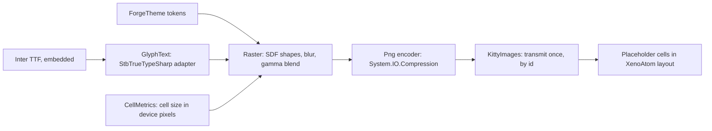

# Phase 56 — `forge chat` TUI graphics (finish line)

> **Status: Tasks 1, 2 and 2b done (2026-10-02); Task 3 design locked; plan next.** Origin: Ameer, 2026-10-01 — "so beautiful people can't
> tell if it's a GUI or a TUI." Builds on [Phase 53](phase-53-forge-client.md)'s TUI (53.5–53.9) and
> [TUI graphics](../design/tui-graphics.md) (kitty placeholders, verified 2026-09-30).

**Goal:** `forge chat` in Ghostty matches the
[finish-line mockup](../design/forge_tui_finish_line_mockup.html) in both themes: anti-aliased card
edges and shadows, proportional-type headings and names, avatars, and motion. Body text stays real
terminal text. The mockup's **X-ray** view is the contract for which cells are images.

## How it renders

A card is plain text cells filled with `CardSurface`, framed by a one-cell ring of image **tiles**
(four corners, top, bottom, left, right). Tiles are drawn once per theme and cell size and reused by
image id, so a card that grows while a reply streams sends no new image.

## Evidence (2026-09-30 – 2026-10-01)

| Fact | Source |
|---|---|
| Kitty images via Unicode placeholders survive XenoAtom redraw and scroll in Ghostty; transmit after entering the alternate screen, straight to stdout | [tui-graphics.md](../design/tui-graphics.md) |
| StbTrueTypeSharp 1.26.13 and SkiaSharp 4.153.1 render Helvetica Neue at 2× practically identically in both themes; Stb applies the font's kern table, Skia does not without `SkiaSharp.HarfBuzz` (a second native library) | Text spike, supervisor scratchpad `textspike` (not in any repo) |
| `Tui/` owns the TUI; `ForgeTheme` is the only file with colour literals; the literal scan (`TuiColourLiteralTests`) is not recursive and misses raw RGBA bytes | forge-mcl `src/ForgeMission.Cli/README.md:39`, `tests/ForgeMission.Mcl.Tests/Cli/TuiColourLiteralTests.cs:37-55` |
| `make install` publishes the Native AOT `forge` to `~/.local/bin` | forge-mcl `Makefile:131-132` |

## Decisions

| # | Decision | Why |
|---|---|---|
| G1 | **Shapes: a small pure-C# renderer** (signed-distance rounded rectangles, hairlines, box-blur shadows, gamma-correct blending) and a PNG encoder on `System.IO.Compression`. | Only shapes are needed; AOT-clean, no native dependency. |
| G2 | **Proportional text: StbTrueTypeSharp**, behind one adapter (`GlyphText`); the only file that references the package. | Same quality as Skia in the text spike, pure managed, AOT-clean (Task 1). **Correction (Task 1):** Stb reads only the legacy `kern` table, and Inter keeps its kerning in GPOS, so headings are unkerned. Kerning is G9. |
| G3 | **No SkiaSharp.** | Native library per platform, several MB, needs a second native library for kerning; no visible gain (G2 evidence). Keeps the 53.2 decision. |
| G4 | **Font: Inter (OFL), SemiBold and Bold static TTFs, embedded** in the binary. | Mockup's face; two weights cover brand (Bold) and names, crumb, headings (SemiBold). Licence allows embedding. |
| G5 | **Images only where the X-ray marks them**; every other cell is terminal text. | Selection and copy keep working; images never carry body text. |
| G6 | **Tiles, not per-card images** (see *How it renders*). | Streaming grows cards several times a second (53.8); tiles make growth free. |
| G7 | **Every visual value is a theme token**: colours, shadow colour/alpha, radii, avatar fills. The literal scan becomes recursive over `Tui/` and also flags raw RGBA. | Themes as data (53.6); closes the scan gaps found above. |
| G8 | **Start-up check, no fallback.** On a terminal (not piped), before the TUI starts, `forge chat` checks two things: XenoAtom reports kitty graphics with truecolor, and the cell-size query answers (exact check: [Task 2](phase-56-tui-graphics_completed.md#task-2--start-up-check-and-card-edges-done-2026-10-02)). If either fails it exits with code 1 and the message: `forge chat needs a terminal that can show images, such as Ghostty or Kitty (not inside tmux). Open forge chat again from one of those.` Piped line mode is unchanged. (Ameer, 2026-10-01) | Early stage: one rendering path, no plain-look copy to maintain. Accepted cost: `forge chat` inside tmux stops working until a later phase adds a plain look. The spike observed both signals (Terminal.app: no reply after 256 ms; tmux: no graphics protocol). |
| G9 | **Kerning: our own GPOS pair-kerning reader inside `GlyphText`** (PairPos formats 1 and 2, Extension lookups, Coverage and ClassDef tables), verified against HarfBuzz's output for Inter. **Image text is simple Latin only**: a heading or name with any other script is drawn as bold terminal text, which Ghostty shapes itself. (Ameer, 2026-10-01) | Every serious renderer uses HarfBuzz, but HarfBuzzSharp brings a native library per platform, and forking it means owning a C++ build per platform. SixLabors.Fonts needs a paid licence above $1M revenue; Typography.OpenFont is unmaintained. We need only pair kerning for one known font: about 200 testable lines and no dependency. Move to stock HarfBuzzSharp, unforked, only if image text must cover every script. |
| G10 | **Default theme is dark**: a missing `~/.forge/config.json` or a missing `theme` key means **dark**. This supersedes the 53.6 default (light). `light` stays selectable, and an unknown name is still an error. (Ameer, 2026-10-01) | The market prefers dark; Ameer uses light via config. |
| G11 | **The window look comes from forge launching its own Ghostty window**: a separate Ghostty instance started with per-instance settings (hidden title bar, padding, cell height). The user's Ghostty config and other windows are untouched. The exact command and settings are designed in Task 6. (Ameer, 2026-10-02) | Ghostty's title-bar and padding settings are app-wide; putting them in the user's config would change every Ghostty window. |

**Gates.** Security: N/A — local rendering only; no entry point, store, identity or secret.
Engineering philosophy: named owners per box in the diagram, one adapter per external dependency
(Stb, compression), no on/off setting and no renderer interface. Failure boundary: font loading is
an embedded resource proven by a test; an unsupported terminal stops at start-up with a named message (G8).
UI: the finish-line mockup is the binding reference by analogy with
[Desktop Interaction Principles](../design/desktop-interaction-principles.md#visual-reference-acceptance-gate--non-negotiable)
(which scopes itself to Desktop/ForgeUI); supervisor Ghostty captures, then Ameer's live review.

## Tasks

| Task | Repo | Done when |
|---|---|---|
| 1 — **Spike** (supervisor scratchpad, not a repo) | — | **Done**, see [completed](phase-56-tui-graphics_completed.md#task-1--spike-done-2026-10-01). |
| 2 — **Start-up check and card edges**: G8, `Tui/Graphics/`, participant cards framed by the fit ring | forge-mcl | **Done** (#33), see [completed](phase-56-tui-graphics_completed.md#task-2--start-up-check-and-card-edges-done-2026-10-02). |
| 2b — **Default theme dark** (G10) | forge-mcl | **Done** ([#36](https://github.com/katasec/forge-mcl/pull/36)): the two default tests went red→green, suite 540 passed, AOT 0 IL; live, with no config `forge chat` opened dark (supervisor capture 2026-10-02). |
| 3 — **Other shapes**: code blocks, user pill and block, APPROVED pill, tool lines, composer, composer spacing | forge-mcl | See [Task 3](#task-3--other-shapes). |
| 4 — Proportional text (StbTrueTypeSharp, Inter, G9 kerning): brand, breadcrumb, names, headings, avatars | forge-mcl | Design locked after Task 3. Input: choose the blend per theme (naive sRGB on light, linear-light on dark). |
| 5 — Motion: fade-in of streamed text, spinner frames, hover and pointer shape | forge-mcl | Design locked after Task 4. |
| 6 — Window: hidden title bar, padding, cell height, via forge's own Ghostty window (G11) | forge-mcl | Design locked after Task 5. |
| 7 — Acceptance | — | `forge` from `make install` on merged `main`, in Ghostty, dark by default and light via config: supervisor captures match the mockup; Ameer accepts live. |

### Task 3 — other shapes

Every shape is a tile set: image tiles at the edges, plain text cells inside. Rules from Task 2 still hold (G6–G8, ids derived per set, transmit once on the first tick).

| Element | Decision | Size (cells) |
|---|---|---|
| Code block | Ring: radius 10, hairline `CodeBlockBorder`, fill `CodeBlockFill`, no shadow, drawn on `CardSurface`. Rendered by `ForgeCodeBlockRenderer` returning a frame visual. | 2 cols each side, 1 row top and bottom (today's footprint) |
| One-line user pill | Filled pill, `UserPillFill`; left and right **cap tiles** (half-round, full cell height) replace the Nerd Font caps. | text + 4 cols, 1 row |
| Multi-line user message | Ring, radius 14, `UserPillFill`, no border, no shadow; stays right-aligned (the frame does not stretch). | 2 cols, 1 row top and bottom |
| APPROVED pill | Cap pill on `SurfaceHeader`, `SuccessFill`; the green dot is drawn in the left cap. | 1 row |
| Tool (hands) lines | **One-row chip** (Ameer): cap pill, fill a new `ToolFill` token, no outline (a hairline can't cross text cells). Stays between cards (placement inside cards is a separate later task). | 1 row |
| Composer | Ring: radius 14, hairline `Accent`, a 4 mockup-px `Accent` glow at 14 %, **no shadow** (Ameer), fill `CardSurface`; wraps the `PromptEditor` (its background becomes `CardSurface`). | 2 cols, 1 row top and bottom; 3 rows for one line |
| Spacing (Ameer's note) | Remove the `Rule` above the composer; key bar: one blank row above it, no `SurfaceAlt` fill. Result: progress row / composer ring / blank row / keys. | — |
| Key-hint chips, send button | **Task 4** (they need image text). | — |

| Area | Decision |
|---|---|
| Graphics layer | Shapes without shadows (`CardTiles` must not assume a shadow); a glow layer (hard spread, no blur); padding per tile set; a cap renderer (left/right cap, 1 row); a **tile-set registry** in `ChatScreen` (`UseCards` becomes per set). |
| Image ids | Repack: theme 1 bit, cell width 7, cell height 8, set 3, slot 3 (22 of 24 bits). A test proves no two inputs share an id across all sets. |
| Tokens | New: `ToolFill` (light `#eceff6`, dark `#1a2333`; supervisor's starting values, confirmed on the captures), radii per set, glow. Reconciled with the mockup: dark `CodeBlockFill` `#0f1622`, dark `SurfaceAlt` `#141d2b`, light `SurfaceAlt` `#f1f4fb`. All in `ForgeTheme`. |
| Plan rulings (supervisor, 2026-10-02) | One `TileFrame` for all sets (a cap set is a ring with 0 top/bottom rows); rings stay solved, padding tops up to the sizes above. The mockup is binding: dark `CodeBlockText` → `#e8eef7` and dark `SurfaceHeader` → `#111a28`; tool chip text is `TextMuted`, not italic; the tool chip, progress row and key bar align to the 4-column gutter. 38 transmits per session (4 rings × 8 + 3 cap sets × 2). Review rounds (2026-10-02): the composer measures its height at the width it is drawn at (`ComposerEditor`; XenoAtom measures at ≤ 48 columns); wrapped user bubble ≤ 75 % wide, right-aligned, never left of the gutter; type-ahead before the TUI starts is discarded; caret colour from a `Caret` token (OSC 12, restored on exit; Ameer: light caret was invisible). Accepted (Ameer): Ghostty colour-manages cell backgrounds but not images, so a saturated fill such as the dark user bubble shows a faint band; no change. |
| Tests | Edge/seam/interior checks for every ring set over the Task 2 cell-size range; cap tiles: the cap joins its text cells with no step (edge level ≤ 1); id disjointness across sets; snapshot tests for a one-line pill, a tool chip and the composer frame. |

**Done when:**
1. Supervisor Ghostty captures, both themes, Retina and 1×: code block, one-line and multi-line user message, APPROVED pill, tool chip and composer match the decisions above and the mockup's shapes; spacing as specified.
2. Images are sent once per session (count from a typescript), however much the transcript grows.
3. The composer grows from 1 to 6 lines inside its ring; the caret and editing work as before.
4. Every visual value lives in `ForgeTheme`; the colour scan passes.
5. Build 0 warnings, tests pass, AOT 0 IL warnings.
6. Default path: `make install` on merged `main`, Ghostty, a chat with a code block and a hands tool line (`forge chat --hands`), dark default and light via config.

## Next

Task 3: assign it to an implementer (plan only), then approve.
