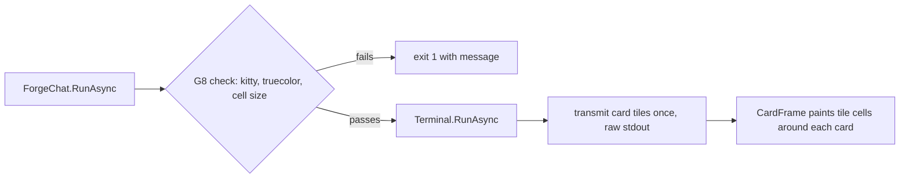

# Phase 56 — completed tasks

> Active spoke: [phase-56-tui-graphics.md](phase-56-tui-graphics.md). Evidence for each row is in
> [tui-graphics.md](../design/tui-graphics.md#phase-56-spike--drawn-edges-and-proportional-text-verified-2026-10-01).

## Task 1 — spike (done 2026-10-01)

Prove the finish-line look in Ghostty before writing product code.

| Check | Observation that proves it |
|---|---|
| Cell size in device pixels is available inside a XenoAtom app (terminal reply or XenoAtom API) | Logged width × height on a Retina display; behaviour when no reply arrives |
| One card framed by edge tiles (corners, hairline, shadow) around a XenoAtom card with `CardSurface` interior | Ghostty capture, both themes; no visible seams at tile joins |
| The card grows (simulated streaming) with no new transmits | Transmit count stays at the initial tile count |
| One heading in Inter SemiBold via StbTrueTypeSharp, gamma-correct blend, drawn 1:1 | 4× crop of the capture: no resampling blur; compared with the mockup |
| Native AOT publish with StbTrueTypeSharp and the embedded fonts | 0 IL warnings; binary size delta recorded |

**Done when:** every row has its observation recorded in [tui-graphics.md](../design/tui-graphics.md),
the supervisor compares the captures with the mockup (PASS/FAIL per row), and G8 is decided.

## Task 2 — start-up check and card edges (done 2026-10-02)

Participant cards get the mockup's rounded edges and shadow. Every other element keeps today's look until Task 3.

| Area | Decision |
|---|---|
| G8 check | Two stages, one message. **Before sign-in** (`ForgeChat.RunAsync`, after the theme is read; `UsesTui` computed there), from the environment only: `Terminal.Graphics.Capabilities.SupportedProtocols` contains Kitty, `IsMultiplexer` is false, and `Terminal.Capabilities.ColorLevel` is TrueColor. This catches Terminal.app, tmux (including tmux inside kitty) and missing truecolor before any network call. **On the first TUI tick**: `QueryPixelMetricsAsync()` returns a value. If not, the app stops and `forge chat` prints the same G8 message and exits 1. Pure decision functions for both stages, unit-tested. |
| Ctrl-C and input | **No probe before `Run`.** The cell-size query runs on the TUI's first tick, while XenoAtom already owns input with Ctrl-C as input (the spike's method). There is no `StartInput`/`StopInputAsync` before `Run`, so the `--hands` y/N prompt and Ctrl-C behave exactly as on `main`. (Task 2 review: probing before `Run` made `Console.ReadLine` echo twice.) |
| Cell size | Read once at start-up, like the theme. Window resizes need no new images. A font-size change while running is not handled: Ghostty rescales the images until `forge chat` restarts (accepted). |
| Transmit | Raw stdout, once, on the first UI tick, after `Run` has entered the alternate screen (the verified method). XenoAtom's `GraphicsPresenter` is not used. **Image ids are derived from theme and cell size**, so a later run in the same window with another theme or display never reuses an id at a different size (the spike's stale-placement rule). No kitty delete command. |
| Ring | The fit ring from the spike only (no strict mode). Geometry is solved from the cell size (4 columns, 2 rows, 2 rows at both 19×42 and 10×21). The seam, edge and interior checks run in tests over the whole realistic cell-size range (every height 12–60 px at widths of 0.40–0.60 × the height, which covers how terminal cells are shaped; both themes). There is no runtime check and no start-up failure for the ring. |
| Layout | Card position and spacing follow the mockup: transcript gutter 4 columns (the border lands in column 4), text at column 7, and one blank row above each card. That gives about 50 mockup px border to border against the mockup's 40, the nearest whole row. Today the cards touch and have no gutter (`ChatScreen.cs:21`). The layout numbers (mockup unit 20, gutter, padding, gap) are named shared constants in `ForgeTheme.cs`, each citing its mockup CSS rule, so every visual value still lives in that file. |
| Owners | `Tui/Graphics/` (new): `Raster`, `Png`, `RingGeometry`, `CardTiles`, `KittyImages` (the only code that writes images to stdout), `PlaceholderDiacritics`, `TerminalFacts` (environment facts, the cell query, both G8 decisions). They are ported from the spike under [code style](../design/code-style.md). The spike's seam, edge and interior checks become unit tests. `ChatScreen` uses a card-frame visual and never builds pixels. The Cli README gains the `Tui/Graphics/` ownership line. |
| Tokens | New `ForgeTheme` tokens: card radius, hairline, and two shadow layers (colour with alpha, y offset, blur), all in mockup px where 1 mockup px = cell height ÷ 20. Dark `CardSurface` becomes `#151f2e` and `CardBorder` becomes `#22304a` (the mockup). Other dark mismatches wait for the task that owns those elements. |
| Colour scan | `TuiColourLiteralTests` scans `Tui/` recursively and also flags RGBA byte literals. One named exception: `KittyImages`, whose `Color.Rgb` carries an image id, not a visual colour. |
| Packages | None new. StbTrueTypeSharp and Inter arrive in Task 4. |
| Accepted for now | Mouse-selecting across a card edge copies placeholder characters. |

**Done when:**
1. In Terminal.app, and in tmux inside Ghostty, `forge chat` exits with code 1 and the G8 message before any network call. A kitty-advertising terminal that doesn't answer the probe exits 1 with the same message once the TUI starts. Piped line mode is unchanged. Unit tests cover the decision function.
2. Supervisor Ghostty captures of replies in both themes, on Retina and 1×: card edges match the mockup's card (PASS per capture). A streamed reply grows its card with no new transmit (the count from a `script` typescript stays at the start-up tile count).
3. A card scrolled partly off the top still draws its edges correctly (capture).
4. Live: Ctrl-C stops a running turn and Ctrl-D quits, as before.
5. Every visual value is in `ForgeTheme`, and the recursive colour scan passes with its one exception.
6. Build 0 warnings, all tests pass, Native AOT publish 0 IL warnings.
7. Default path: `forge` from `make install` on merged forge-mcl `main` in Ghostty, a two-turn chat in each theme (the default as of Task 2, and the other via config).

**Acceptance (2026-10-02, supervisor):** forge-mcl [#33](https://github.com/katasec/forge-mcl/pull/33) merged at `5bae237`.

| Done when | Evidence |
|---|---|
| 1 | Live: Terminal.app and tmux inside Ghostty exit 1 with the G8 message (rc read from bash). pty runs: no kitty, no truecolor, kitty inside tmux all exit 1 before sign-in; a kitty terminal with no probe reply exits 1 after the TUI starts. |
| 2 | Ghostty captures of the light and dark themes on Retina (19×42) and 1× (10×21): card edges, shadow, fill, full width and even padding match the mockup's card. 8 transmits per session in every run, including streamed replies (counted from typescripts). |
| 3 | A card cut off at the top, and another cut off at the bottom, keep their edges (PgUp capture). |
| 4 | Live: Ctrl-C mid-turn shows "(run interrupted)" and stays in the TUI; Ctrl-D exits 0. The `--hands` y/N prompt has the same terminal settings as on `main` and echoes once (pty). |
| 5 | Recursive colour/RGBA scan and stdout-writer rule pass; code review confirmed every visual value is in `ForgeTheme`. |
| 6 | Build 0 warnings; AOT 0 IL warnings; supervisor full-suite runs green apart from the pre-existing `ExecExpertRunnerTests` flake, which also fails 1 in 5 on `main` ([backlog](../backlog.md)). |
| 7 | `make install` on merged `main`, Ghostty: two-turn chats, light on Retina and dark on 1×, every reply shown. |

Found during acceptance, not caused by Task 2: the live stream dies after about 100 s idle, and also on `main` ([backlog](../backlog.md)). Review fixes along the way: the probe moved to the first TUI tick (it had made the `--hands` prompt echo twice); a multiplexer check was added; ring checks became test-only; the narrow-card and padding mismatches were fixed; a test race on XenoAtom's shared dispatcher was isolated.
