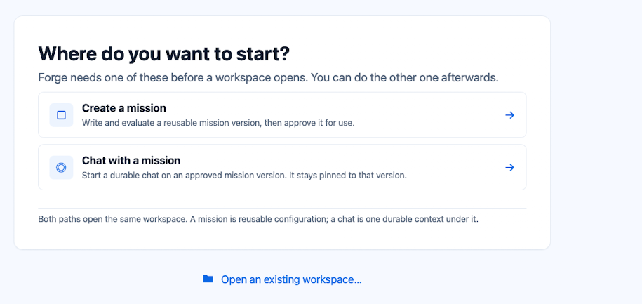

# Phase 60 — Start page in `forge chat`

> **Status: selected 2026-10-03; building.**

## Requirement (Ameer, 2026-10-03)

One new page at the start of the `forge chat` TUI, like the Desktop's start page:

```
 Where do you want to start?

   Create a mission       (shown; does nothing for now: the hook for later)
 ▸ Chat with a mission    → exactly where forge chat opens today, unchanged
```

- **Chat with a mission** opens the chat `forge chat` opens today (the default Chat mission), unchanged.
- **Create a mission** is shown but does nothing when chosen.
- Keys: click a row, or ↑/↓ and Enter. **Chat with a mission** is selected when the page opens, so Enter
  alone goes to the chat.

Binding visual reference: the Desktop start page,

Read [Desktop Interaction Principles](../design/desktop-interaction-principles.md) and the
[UI Design System](../design/ui-design-system.md) before building.

## Facts

- Owner: forge-mcl `src/ForgeMission.Cli` (the `forge chat` TUI).
- Line mode (redirected input or output) has no pages, so it is unchanged.

## Done when

The installed `forge` (`make install` from forge-mcl `main`) opens on the start page in Ghostty; Enter and
a click on **Chat with a mission** each open today's chat; **Create a mission** does nothing. Checked live
with [tools/tui-capture](../../tools/tui-capture/README.md).
