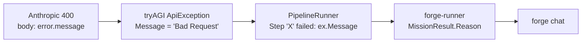
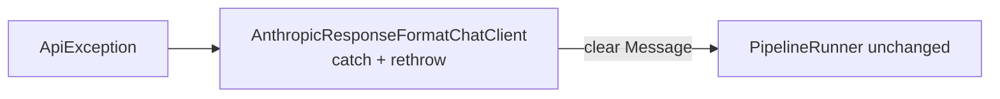

# Phase 69 — Show the model provider's real error

> **Status: complete (2026-10-05).** Evidence: [phase-69-provider-error-message_completed.md](phase-69-provider-error-message_completed.md).

## Problem

With Anthropic credits exhausted, every turn showed `Step 'Answerer' failed: Bad Request`. The
provider's message ("Your credit balance is too low…") is in `ApiException.ResponseBody`, not in
`ex.Message`. forge-mcl `PipelineRunner.cs:516` and forge-runner `MissionCommandProcessor.cs:99`
both pass `ex.Message` on unchanged.

## Locked design (operator, 2026-10-05)

| Decision | Value |
|---|---|
| Owner | forge-mcl `ForgeMission.ChatClients` only. Its README rule: provider SDK types never reach Core. Core and forge-runner code do not change. |
| Where | `AnthropicResponseFormatChatClient` catches `Anthropic.ApiException` on `GetResponseAsync` and on both streaming paths (native `AnthropicTextStream` and the SDK adapter), and rethrows with the original as the inner exception. |
| Message | `The model provider (Anthropic) returned an error. Check your provider account. Details: <error.message>`. The ` Details: …` part only when the JSON body has `error.message`. The user sees it after the existing `Step '<Expert>' failed: ` prefix. |
| Scope | Anthropic only. OpenAI-compatible providers (OpenAI, Azure, xAI, Ollama) are unchanged. |
| Delivery | `Katasec.Forge.Mcl.ChatClients` 0.1.4 → forge-runner package bump + image → forge-infra `main.bicepparam` image tag, `make 500-app-what-if`, `make 500-app`. |

Gates: Security Architecture — no tier, data, identity or contract change; the provider message
already goes to the same user whose turn failed. Engineering Philosophy — one owner, no knobs, no
new abstraction outside ChatClients. UI — no visual change. Native AOT — body parsed with
`System.Text.Json` `JsonDocument` (no reflection serialization).

## Default path

`forge chat` from an installed CLI against ForgeAPI with the deployed runner's default Anthropic
binding ([default-path acceptance](../design/default-path-acceptance.md)). Trigger: one message
longer than the model's context window, so Anthropic returns a real 400 `prompt is too long…` body.

## Done when

1. ChatClients unit tests prove the message with and without `error.message`, on non-streaming and
   streaming calls.
2. `Katasec.Forge.Mcl.ChatClients` 0.1.4 is published; forge-runner on it is deployed to dev.
3. Live `forge chat` with the over-long message shows `The model provider (Anthropic) returned an
   error. … Details: prompt is too long…` instead of `Bad Request`.

## Tasks

| Task | Status |
|---|---|
| 1 — ChatClients fix + tests (forge-mcl) | done, see [_completed](phase-69-provider-error-message_completed.md#task-1--chatclients-fix) |
| 2 — forge-runner bump + image, forge-infra deploy | done, see [_completed](phase-69-provider-error-message_completed.md#task-2--release-and-deploy) |
| 3 — live default-path acceptance | done, see [_completed](phase-69-provider-error-message_completed.md#task-3--default-path-acceptance) |
