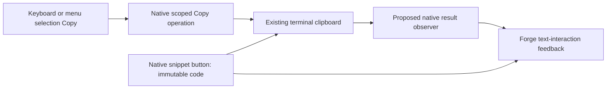
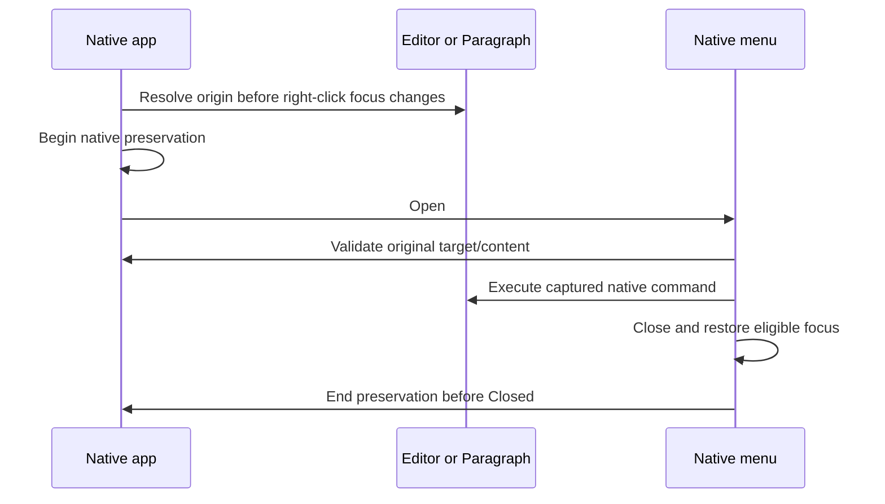
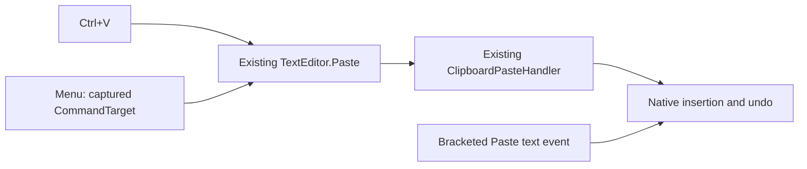

# Phase 70.1 — Text-interaction foundation

**Status: revised candidate recorded with review corrections; native menu commit/visual/ownership gates remain open; no design/plan approval.**
**Not build-ready.** Parent: [Phase 70](phase-70-tui-text-interaction.md).

## Requirement

Make composer, file-editor, and rendered-text Copy/Paste behave consistently, using native
XenoAtom selection, commands, context menus, buttons, and clipboard transport wherever they
meet the contract. Add a copy icon to real code snippets while preserving syntax highlighting
and the established UI. Shared behaviour belongs at the TUI's text-interaction boundary;
individual controls retain editing/rendering ownership.

## Constraints for design

| Area | Required behaviour / existing public capability |
|---|---|
| Keyboard editing | Retain PromptEditor/CodeEditor selection, word/line navigation, Select All, paste events and undo. Prove Shift+arrows/Home/End and word selection without a preceding mouse click. |
| Copy vs Stop | A selection's Copy attempt consumes the gesture even if clipboard writing fails; it never cancels a turn. With no applicable selection, preserve the current chat Stop contract. `/edit` continues to isolate chat shortcuts. |
| Mouse editing | Drag, double-click and Shift-click use the native text editor. Right-click offers Copy/Paste and appropriate native editing actions; menu cancellation restores focus and selection. Define paste replacement range before opening a popup can change focus. |
| Shared ownership | One reviewed policy for choosing the current text owner, taking its payload and reporting clipboard results; composer, editor, snippet and later transcript actions use it. Do not create a second editor, OS clipboard backend, global input framework, or speculative control hierarchy. |
| Clipboard | Use `App.Terminal.Clipboard.TrySetText` / `TryGetText`, not screen scraping or shell commands. `CanSetText`/`CanGetText` are hints, not proof. Report success only after a successful operation; a failed paste leaves draft and selection unchanged. Successful empty text is distinct from a failed read. No automatic clipboard polling. |
| Code payload | Copy the Markdown render context's complete `.Code` (its LF-normalized text), without fences, line numbers, UI labels, syntax markup, image placeholders or visual wraps. Preserve indentation, blank lines and trailing newlines; current display `TrimEnd('\n')` must not trim the copy payload. |
| Code control | Use a native focusable `Button` and shared clipboard policy. Label/tooltip identifies Copy code; reserve layout space rather than cover code. Support mouse and keyboard activation, focus/hover, copied and failed states. Image-heading pseudo-fences are excluded. |
| Streaming | Define whether an activation copies current displayed content or an invocation snapshot, including menu-open updates and code-fence replacement. A stale visual must never copy a different snippet accidentally. |
| Existing rendering | Keep TextMate `Paragraph.Runs`, wrapping, TileFrame and Kitty images. FadeIn, StreamCaret and LinkPointer overlays stay non-hit-testable. Copy operates on text; decorative image cells are not content. |

These are outcome constraints, not a proposed API. Native commands currently ignore clipboard
failure, and popup focus can clear selection. Merely restoring `TextEditor.Copy` or adding
`CommandPresentation.ContextMenu` does not satisfy the complete contract. Native Cut can delete
after a failed copy: do not newly expose Cut without defining safe failure behaviour. A broader
clipboard/editor rewrite is outside the requested slice.

## Public integration gaps — confirmed at the pinned baseline

| Boundary | Fact the design must address |
|---|---|
| App Copy interception | UI 3.10.0's sealed `TerminalApp` privately intercepts active-selection Copy before commands and `KeyDown`, discarding the clipboard bool. `TerminalAppOptions` has no interception/result callback. Replacing editor commands cannot govern every Copy result. [Pinned dispatch](https://github.com/XenoAtom/XenoAtom.Terminal.UI/blob/6f4e0cde3890d8ce2510ac0451b861863e4aeeaa/src/XenoAtom.Terminal.UI/TerminalApp.cs#L2500). |
| Editor range restoration | `SelectionStart`/`SelectionLength` are protected getters; public caret and payload access do not provide selection restoration. `CodeEditor` is sealed, so a composer subclass cannot solve the same menu-range contract for `/edit`. [Editor base](https://github.com/XenoAtom/XenoAtom.Terminal.UI/blob/6f4e0cde3890d8ce2510ac0451b861863e4aeeaa/src/XenoAtom.Terminal.UI/Controls/TextEditorBase.cs#L339), [CodeEditor](https://github.com/XenoAtom/XenoAtom.Terminal.UI/blob/6f4e0cde3890d8ce2510ac0451b861863e4aeeaa/src/XenoAtom.Terminal.UI/Controls/CodeEditor.cs#L433). |
| Clipboard transport | Terminal 2.2.0's sealed `TerminalClipboard` delegates `TrySetText`/`TryGetText` directly to its backend. Direct Forge calls receive a bool; subclassing cannot observe native library writes. [Pinned clipboard](https://github.com/XenoAtom/XenoAtom.Terminal/blob/5517cb3d8cdf0532ecc89260067064f98cde6137/src/XenoAtom.Terminal/TerminalClipboard.cs#L69). |

The current published releases still match these pins — [release check](phase-70.1-text-interaction-foundation_completed.md#current-published-capabilities).
These are source findings, not an approved extension contract or proof that every possible
adapter is infeasible. Do not substitute a snippet-only or keyboard-only implementation for
the foundation. A new public/library boundary still requires the reviewed contract and
operator decision named in the parent hub.

## Verification route

The operator-selected [manual verification exception](phase-70-tui-text-interaction.md#manual-verification-exception)
supersedes live reproduction as a design prerequisite. Source/controlled findings support
design; physical terminal/clipboard/Retina observations are deferred to the operator's final
installed check. The Ghostty denial remains in force; no alternate agent access is allowed.

| Manual observation after implementation | Record on laptop Retina, both themes, normal and narrower windows |
|---|---|
| Provenance | Installed artifact/version/digest; actual Ghostty version, font, cell metrics and window dimensions; normal saved login/endpoint and dedicated scratch Project. Prior metrics remain historical or synthetic. |
| Composer keyboard | Before any click, then after a click: Shift+arrows/Home/End and word selection; Ctrl/Cmd gesture used, focus, highlight, exact pasted payload and whether Copy stops an active turn. |
| Mouse and menus | App drag/double/Shift-click versus terminal-native selection; multiline Copy, Paste replacement, right-click Copy/Paste, cancellation and restored focus/selection. |
| Editor and transcript | Disposable `/edit` file's keyboard/mouse Copy/Paste and save/close; real reply's paragraph/rich-range selection and heading/code interaction, with exact pasted text. |
| Snippets and appearance | Keyboard/mouse code Copy, exact payload including indentation/blank lines/trailing newline; truthful feedback, wrapped/unwrapped/unknown-language snippets and streaming replacement. Compare menu/button/selection states against the locked reference; preserve start page, Kitty frames/headings and syntax colours. |

Controlled event/clipboard-failure tests, theme/state checks and Native AOT remain agent work.
They do not prove physical key delivery, OS clipboard or Retina rendering. Those cases remain
pending until the operator records them; the phase cannot close on automated evidence alone.

## Design questions to close before an implementation plan

| Question | Required design output |
|---|---|
| Keyboard and mouse Copy routing | Concrete owner precedence and actual public hooks, including TerminalApp's pre-command active-selection interception; no-selection Stop and failed-copy handling. Name intended gestures; Ghostty's physical Ctrl/Cmd/terminal-native delivery is checked by the operator after implementation. |
| Context-menu lifetime | Exact payload/range capture, focus restoration, cancelled-menu behaviour and document-version handling, using public APIs. `SelectionStart`/`SelectionLength` are protected, not public integration points. |
| Honest results | Concrete way all owned Copy/Paste paths observe the bool result. Decide a narrow Forge adaptation or reviewed upstream extension; define types, signatures, ownership and Native AOT implications. No invented library APIs or new private access. |
| Visual interaction | Binding revised reference for snippet icon/menu and feedback; exact placement, focus order, disappearance/reset rules, light/dark tokens and contrast pairs. |

## Revised foundation candidate — not approved

Retain native editors, selection, commands, menus, buttons, TextMate and clipboard transport.
Recommend a narrow upstream UI change: native Copy result reporting and fixed context-menu
selection preservation. Forge owns one local command/feedback policy and snippet composition.
This replaces the public handler/snapshot proposal; it is not an existing API or approved route.
First-round evidence is [archived](phase-70.1-text-interaction-foundation_completed.md#foundation-design-reviews).



### Proposed native Copy API

All signatures below are proposed for `XenoAtom.Terminal.UI`, absent at 3.10.0:

```csharp
namespace XenoAtom.Terminal.UI;

public enum SelectionCopyResult
{
    NoSelection = 0,
    Copied = 1,
    ExtractionFailed = 2,
    WriteFailed = 3,
    InvalidTarget = 4,
}

// TerminalApp
public SelectionCopyResult CopySelection(Visual source);

// TerminalAppOptions and TerminalRunOptions; run option forwarded unchanged
public Action<Visual, SelectionCopyResult>? SelectionCopyCompleted { get; init; }
```

| Boundary | Candidate contract |
|---|---|
| Call | UI-thread only (`VerifyAccess`); null source throws `ArgumentNullException`. Detached, hidden, disabled, nonselectable or out-of-scope source yields `InvalidTarget`. |
| Extraction | Valid owner's `HasSelection == false` yields `NoSelection`; `HasSelection == true` with failed/empty extraction yields `ExtractionFailed`. Extracted text is written once with native `TrySetText`; its bool determines `Copied` or `WriteFailed`. No selection is cleared. |
| Observer | Synchronous, once after each operation; receives source/result only. Cannot alter dispatch or replace transport. Callback exceptions use the UI-loop failure path and never reroute into Stop. |
| Keyboard dispatch | Selected focused `TextEditorBase` first, then active rendered selection, both restricted to the active modal scope. Choosing a `HasSelection` owner consumes every result, including extraction/write failure; never retry another owner or fall through to Stop. No selected owner continues normal command dispatch. |
| Editor Copy | Native command and raw-key fallback use the same operation. Composer replaces its removed `TextEditor.Copy`: label `Copy`, existing Ctrl+C, `CanExecute=HasSelection`, `ConsumesGestureWhenUnavailable=false`, execution via `CopySelection`. No-selection Stop and existing `/edit` chat-shortcut isolation stay intact. |
| Origin menu Copy | Executes against the captured origin via `CopySelection`, never a composer or later coordinate lookup. Permit an out-of-modal origin only during synchronous execution of that validated origin command in the currently active context-menu family (`InvokingOriginCommand`); all attachment, identity/content, visibility, enabled/selectable and ownership checks still apply. Keyboard/global actions and arbitrary sources get no exemption. |

### Proposed native menu preservation



No public snapshot, selection-token interface, new editor or input framework is proposed.
Native preservation begins before the mouse dispatcher changes right-click focus, or before
programmatic `ContextMenuService.Show` opens a popup. Starting it in the factory is too late.

| Native private state | Shape / purpose |
|---|---|
| Identity | `TerminalApp App`, `Visual Source`, `ISelectionOwner Owner`, `Visual? RestoreFocusTarget`. Editor origin restores its own eligible focus; Paragraph origin restores the previously eligible focused visual. |
| Content | `ITextDocument? EditorDocument` plus `int EditorDocumentVersion`; for Paragraph, a private monotonic `int ParagraphTextRevision` changed on Text updates. |
| Lifetime | `bool Invalidated` is permanent after detach, content/version change or hidden/disabled/nonselectable transition; `bool InvokingOriginCommand` is true only around the validated origin command. Closing/replacing the menu or stopping the app releases references on the UI thread. |
| Native range | Retain existing editor caret/anchor/end and Paragraph anchor/active fields, including direction and collapsed/absent representation. Retain active-owner bookkeeping. No clearing and reconstructing a range. |

| Event | Candidate outcome |
|---|---|
| Menu focus/submenus | Suppress only selection clearing caused by this menu's focus transitions; keyboard Copy cannot see underlay selection. Unrelated menus do not preserve another control's selection. |
| Reflow | Wrapping/layout changes preserve the range. Document replacement/version changes and Paragraph text changes invalidate it. Detach/re-attach cannot revive it. |
| Close / Copy / failed or empty Paste | Original range/caret remains at popup close. Restore eligible focus while preservation is active; end before `Popup.Closed`. Detached sources are never refocused. Escape cancellation leaves that state intact. Native Tab or outside input may be redispatched after close and then legitimately edit, move focus or change selection; test those final states separately. |
| Nonempty Paste | Native insertion/undo replaces the original range; retain the new caret/range, never restore old endpoints over the edit. **Own-edit invalidation needs the correction below.** |
| Invalid origin | Invalidate, disable and dismiss the native menu before origin execution, including native availability checks. Queued stale actions perform no clipboard operation/insertion. No unsupported clipboard-failure notification is promised when no operation was attempted; actual Copy/Paste transport failures still use their result paths. |

### Existing Paste reuse and menu presentation



Editor menus contain **Copy**, **Paste**, in that order. Paragraph menus contain **Copy** only.
Copy is disabled without selection; Paste requires a valid editable origin. Do not surface
Cut/Undo/Select All or incidental ancestor commands. Existing keyboard Cut is regression-only.
Use the existing native `TextEditor.Paste` command in `MenuItem` with `CommandTarget=editor`;
native menu dispatch executes `cmd.Execute(effectiveTarget)` before popup close.

| Paste input | Shared handler / native action |
|---|---|
| `context.Text is null` | Report `Paste failed`; return null; native insertion does nothing. |
| `context.Text.Length == 0` | Successful no-op; clear old clipboard failure and preserve range/caret. |
| Nonempty | Return null to keep native replacement/undo; clear old clipboard feedback. |
| Bracketed Paste | Insert its delivered event text natively; no hook/clipboard reread. |

The pinned Capture maps a failed read to null and preserves successful empty text; native backend
contract guarantees non-null on success. Use `Text`, not `HasText`; no new Paste result field,
second read, public `InsertText`, direct document mutation or simulated keys.

### Forge snippet and feedback slice

One internal TUI `TextInteraction` boundary presents commands/menus, attaches the existing Paste
handler and maps clipboard outcomes to feedback. Editors own document/range/undo; renderer owns
the snippet's immutable payload and control lifetime; XenoAtom retains portable transport.

| Concern | Candidate contract |
|---|---|
| Rendering | Heading pseudo-fences are routed first and receive no snippet button. Real fenced/indented code keeps existing Paragraph/Runs, TextMate, wrapping and TileFrame. Inside the frame: native VStack of one reserved header row, then the unchanged code body. |
| Payload | Capture complete immutable `context.Code` before display `TrimEnd`; preserve indentation, blank lines and trailing LF. Do not copy fences, labels, markup, wraps or placeholders. |
| Button | Native Button, right-aligned, one row, borderless, 15 reserved cells including one-cell side padding. Below 15 available cells it becomes the same icon-only button of `min(3, availableWidth)` cells with full tooltip. No icon library/global shortcut. Geometry belongs in named ForgeTheme constants. |
| Activation | Native left-click, Enter, Space; Tab/Shift+Tab follows visual-tree order: snippet buttons in transcript order, then composer. `/edit` keeps CodeEditor focus. |
| Lifetime | Each rendered snippet gets a new button/payload/state. A bounded Button subclass may permanently retire in supported `OnDetachedFromApp`; retired/detached/disabled callbacks do not write. Never resolve a newer snippet by index. Replacement resets to idle; streaming elsewhere does not. |
| Snippet write | Direct native `button.App.Terminal.Clipboard.TrySetText(payload)` once; map bool through the same Forge feedback policy as native selection results. A whole snippet is not an `ISelectionOwner`; no second backend exists. |
| Labels/tooltips | Idle `⧉ Copy code` / `Copy code`; success `✓ Copied` / `Copied`; failure `! Copy failed` / `Copy failed`. Only true transport result earns success. |
| Other feedback | Selection success `Copied`; failures `Copy failed` / `Paste failed`; successful empty Paste has no success string. Existing composer progress and editor message rows prefix clipboard status plus ` · ` without replacing underlying spinner/progress/save/unsaved state. End ellipsis clips trailing progress first. |
| Reset | Subsequent clipboard action, editing its source, loss of both focus/hover, or retirement/replacement. No timer or idle animation. |

### Candidate visual states — references not yet locked

Current appearance references remain the gates below. New state SVGs must be saved and reviewed
before build; the following is the returned draft specification, not a live/rendered PASS.
Use flat boxes/text with synthetic 10×20-unit cells, 100×32 (1000×640) and 60×24 (600×480),
both themes. Operator measures actual laptop Retina metrics after code; synthetic dimensions
never become observed defaults.

| State SVG under `docs/images/phase-70.1/` | Draft specification (`{theme}` light/dark, `{width}` 100/60) |
|---|---|
| `snippet-before-{theme}-{width}.svg` | Fixture `var greeting = "hello";\nConsole.WriteLine("a sample with a long literal");\n`; frame at cell `(10,8,W-20,height)`; current radius/hairline/fill; synthetic four-column sides/two-row top/one-row bottom; body starts `(14,10)`, width `W-28`, native wrapping; height body+3. |
| `snippet-after-{theme}-{width}.svg` | Same body/insets; header at y=10, body y=11; height increases one row; button `(W-29,10,15,1)`, `⧉ Copy code`. Real implementation retains actual TileFrame insets. |
| `snippet-copied-{theme}-{width}.svg` | Same geometry, `✓ Copied`, Success, focused underline. |
| `snippet-failed-{theme}-{width}.svg` | Same geometry, `! Copy failed`, Error, focused underline. |
| `editor-menu-before-{theme}-{width}.svg` | `alpha beta`, backwards `beta` selection and caret at left endpoint; no menu. |
| `editor-menu-after-{theme}-{width}.svg` | Same selection/caret; native menu at `(18,12)` clamped to viewport, one-cell border/padding, `Copy  Ctrl+C` then `Paste  Ctrl+V`; Copy initially selected. |
| `rendered-menu-after-{theme}-{width}.svg` | Paragraph selection; same menu placement, only `Copy  Ctrl+C`. |
| `paste-failed-{theme}-{width}.svg` | Closed popup, editor range/caret unchanged, existing message row y=`H-2` begins `Paste failed`. |
| `snippet-icon-{theme}.svg` | Additional isolated snippet fixture with 12 available content cells: same button, three-cell icon-only idle/success/failure states, full tooltip; proves the below-15-cell rule that the main two viewports never reach. |

| Owned state | Existing ForgeTheme foreground / background; ForgeStyles owns styling |
|---|---|
| Button idle / hover / focus | `CodeBlockText / CodeBlockFill`; hover bold, focus underline. |
| Pressed / copied / failed / disabled | `CodeBlockText / Selection` bold; `Success / CodeBlockFill`; `Error / CodeBlockFill`; `TextMuted / CodeBlockFill`. Focus underline also applies to feedback. |
| Menu / tooltip / selected / hover / disabled | `Text / SurfaceAlt`; selected `TextStrong / Selection` bold; hover `TextStrong / SurfaceAlt` bold; disabled `TextMuted / SurfaceAlt`. |
| Composer/editor feedback | `Error` or `Success` on the existing row's surface. |
| Selection | Existing native Selection background with existing body/editor/TextMate foregrounds; enumerate actual syntax-colour contrast in controlled evidence. Palette defects return to design; no local overrides. |

`ForgeConfig` theme selector and missing-theme dark default remain unchanged. Preserve Kitty
frames/headings, FadeIn/StreamCaret/LinkPointer non-hit-testing, start page and existing syntax.

### Recommended upstream route — operator decision pending

| Fact | Concrete proposal |
|---|---|
| Owner/source | `XenoAtom/XenoAtom.Terminal.UI`: Copy helper/result observer, scoped consumption/precedence and fixed native menu preservation. Current source pin `6f4e0cde3890d8ce2510ac0451b861863e4aeeaa`. |
| Packages | Current UI/Markdown/CodeEditor.TextMateSharp family 3.10.0; consume an actual compatible public release containing the accepted contract. No guessed version or implied publication. |
| Transport | XenoAtom.Terminal 2.2.0, pin `5517cb3d8cdf0532ecc89260067064f98cde6137`; no change. |
| Consumer | forge-mcl CLI/test package pins updated together; no sibling project references, vendoring, fallback dispatch or dual-version path. |
| Authority / delivery | Operator must choose the Type-1 route; upstream agreement and an actual public package are required before Forge implementation handoff. Forge publication permission grants no upstream writes/messages or maintained fork. |
| Reversal | Reject/revise this candidate without product changes; if selected, consume the reviewed public package once. No temporary bridge is introduced; unrelated existing XenoCells exception is neither expanded nor removed. |

Security: local presentation only, hosted tiers/stores/service identities/credentials N/A; reads
only on explicit Paste; no payload logging or automatic submission. Native library owns mechanics
and transport, Forge owns local policy/feedback. Manual-verification Type-2 exception remains.

### Open corrections and verification

| Gate | Required next result |
|---|---|
| Supervisor corrections | R2 simplicity findings are addressed in the draft above: narrow synchronous origin exemption, `HasSelection` classification, stale-menu dismissal, close versus redispatched input, constrained icon-only fixture. These corrections still require independent review; no PASS is implied. |
| Menu commit | Distinguish successful native Paste's own version change from external invalidation, including reentrant content changes; preserve post-edit caret/focus without legitimizing unrelated changes. Complete this native contract in design before handoff. |
| Visual binding | Save/review before/after/transient references and token/contrast pairs; no control-state or real viewport PASS yet. |
| Review / Type 1 | R2 simplicity review requires correction; its findings and the failed fresh ownership launch are [archived](phase-70.1-text-interaction-foundation_completed.md#revised-candidate-review). A fresh design/review round must resolve native lifetime and visual contracts; ownership launch was rejected with `agent thread limit reached`. No supervisor check substitutes for it or the operator's native-owner decision. |
| Package proof | After route selection/delivery, compile actual public API/native menu route and run public-only native behaviour/AOT probes with zero warnings before Forge plan approval. |
| Product verification | Approved implementation must prove actual Copy/Stop, both selection directions/empty ranges, failure/empty/nonempty and bracketed Paste/Undo, modal scope, stale origin/detach, exact snippet payload/retirement, themes/graphics and full suite/AOT. Operator then performs installed defaults/Retina acceptance as specified above. |

No implementation plan is approved. Continuous rich selection remains in the dependent spoke;
neither this native proposal nor snippet controls close that requirement.

## Files and tests to inspect

All product paths below are relative to `/Users/ameerdeen/progs/forge-mcl`.

| Responsibility | Entry paths |
|---|---|
| Composer and routing | `src/ForgeMission.Cli/Tui/ChatScreen.cs`, `ComposerEditor.cs`, `ChatTui.cs` |
| Editor | `src/ForgeMission.Cli/Tui/FileEditor.cs`, `EditFile.cs` |
| Snippets and source text | `src/ForgeMission.Cli/Tui/ForgeCodeBlockRenderer.cs`, `ForgeMarkdown.cs`, `Transcript.cs` |
| Theme/style ownership | `src/ForgeMission.Cli/Tui/ForgeTheme.cs`, `ForgeStyles.cs`, `Graphics/CodeColours.cs` |
| Existing verification | `tests/ForgeMission.Mcl.Tests/Cli/ChatScreenTileTests.cs`, `ChatScreenMotionTests.cs`, `FileEditorTests.cs`, `ChatTranscriptTests.cs`, `StartPageTests.cs` |

The nearest component README is `src/ForgeMission.Cli/README.md`; there is no Tui README.
Reconfirm dependency versions and owning repository instructions before design.

## Gates and acceptance specification

| Gate | Application |
|---|---|
| Security Architecture | Local presentation/input only; hosted tiers, stores and service identities are N/A. Clipboard reads occur only on explicit Paste; copied text is not telemetry or model input. Any package/public-contract ownership change must be resolved before handoff. |
| Engineering Philosophy | CLI TUI owns policy and feedback; native controls own editing; XenoAtom owns portable clipboard transport. Define failure containment and narrow lifetime ownership. Reject per-control patches, unneeded knobs, a replacement editor and private API expansion. |
| UI principles | Read and name [Desktop Interaction Principles](../design/desktop-interaction-principles.md) and [UI Design System](../design/ui-design-system.md) in assignments. Apply their interaction/token principles; this terminal UI does not consume ForgeUI CSS. |
| TUI reference | [Graphics design](../design/tui-graphics.md), [finish-line mockup](../design/forge_tui_finish_line_mockup.html), [plain turn](../images/phase-64-plain-turn.png), [hands turn](../images/phase-64-hands-read.png), and [operator's chat example](../images/phase-70/chat-user-reference.png). The operator example binds appearance, not proof of live Retina verification. A revised reference must lock new owned controls before build. |
| Theme map | Existing `ForgeConfig` `theme: dark|light` selects `ForgeTheme`; missing theme is dark. `ForgeStyles.Screen` maps text/surface, popup, selection, focus, controls, disabled, success and error tokens. Designer must map every new state to these named tokens or add semantic values to both theme instances; no local colour literals. |
| Viewports and states | Laptop Retina only: record real font, cell metrics, window dimensions, normal and narrowed widths. Both themes; idle/streaming composer, multiline selection, context menu open/cancel, editor selection, wrapped/unwrapped/unknown-language snippets, copy success/failure and paste failure. Start page remains visually intact. |

### Default-path facts — future product acceptance

| Fact | Required observation |
|---|---|
| Artifact | Installed Native AOT `forge` from merged code via `make install`, or the normal CLI release archive; record version, commit and digest. A JIT/in-memory harness is controlled evidence only. |
| Configuration | Normal saved sign-in and `forge.project.json`; `FORGE_API_ENDPOINT` absent, no URL/client/mission stubs. Dark default and supported light config, with any temporary theme change restored afterward. |
| Dependency route | Normal hosted ForgeAPI/Conversation Host route and existing published client dependencies; Ghostty with truecolor/Kitty support, no multiplexer. Record actual terminal version and display provenance. |
| Safe state | A dedicated scratch folder initialized through normal `forge project create`; plain Chat (no hands grant). Use synthetic non-sensitive messages and an explicitly created disposable file for `/edit`. |
| User actions | Open `forge chat`, obtain/replay a real normal-path reply with known code, select/copy/paste using keyboard and mouse, copy snippet, edit scratch file, and verify no copy attempt cancels a turn. |
| Observable result | Operator pastes into a scratch destination and compares exact expected text, themed selection and button/menu states against the reference on Retina. Supervisor records the attributed manual result. Default-path operation passes; denied/failed clipboard behaviour is additionally verified with controlled fault injection. |

## Ordered tasks

| Task | State | Done when |
|---|---|---|
| 1. Source/library/CodeAlta discovery | Done — [evidence](phase-70.1-text-interaction-foundation_completed.md#discovery-results). | Pinned source and controlled observations distinguish native capability, Forge wiring defects, and library gaps. |
| 2. Installed Retina reproduction | Agent path blocked; prerequisite superseded by the parent exception. Manual observations move to Task 6. | No live PASS claimed; recorded controlled baseline is available to the designer. Physical delivery, focus/highlight and clipboard round-trip remain manual acceptance cases. |
| 3. Product design and review | Revised candidate/supervisor corrections recorded; native commit lifetime, visual binding and fresh ownership review remain open. No design approval. | Fresh designer; simplicity and ownership reviews; supervisor records one locked design with every question above resolved and complete API/visual contracts. |
| 4. Implementation plan and review | Pending after design approval. | Fresh plan author; simplicity and ownership reviews; supervisor explicitly approves bounded changes, meaningful interaction tests and AOT checks. |
| 5. Implementation and review | Pending after plan approval. | Fresh implementer; positive/negative interaction evidence including failed clipboard writes; independent simplicity/ownership/style review; no product task marked complete by implementer. |
| 6. Merge, install, accept, close | Pending after checks pass; operator performs live acceptance. | Normal artifacts merged/published as required; operator records passing default-path/Retina observations above, supervisor assesses coverage; evidence/timing archived; changed repos clean on main. |

## Done when

Composer and `/edit` provide the agreed selection and contextual Copy/Paste behaviour without
requiring a prior click; selection-aware Copy never cancels a turn; snippet controls copy exact
code with truthful feedback; themes and graphics match the binding reference on laptop Retina;
focused interaction tests, required suite and Native AOT checks pass with zero warnings;
operator-run installed default-path acceptance passes and the supervisor records its evidence.
Continuous rich selection closes in
[70.2](phase-70.2-rich-transcript-selection.md), not through a snippet-button substitute.
