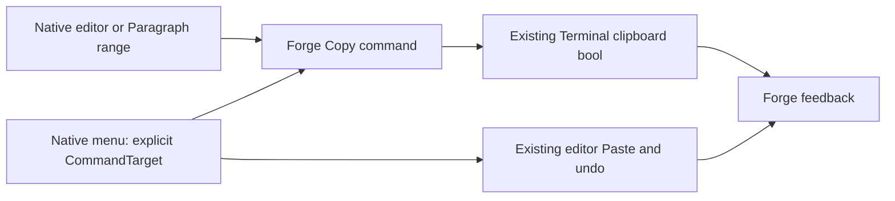
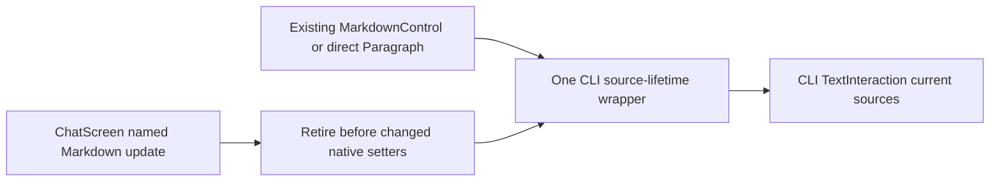
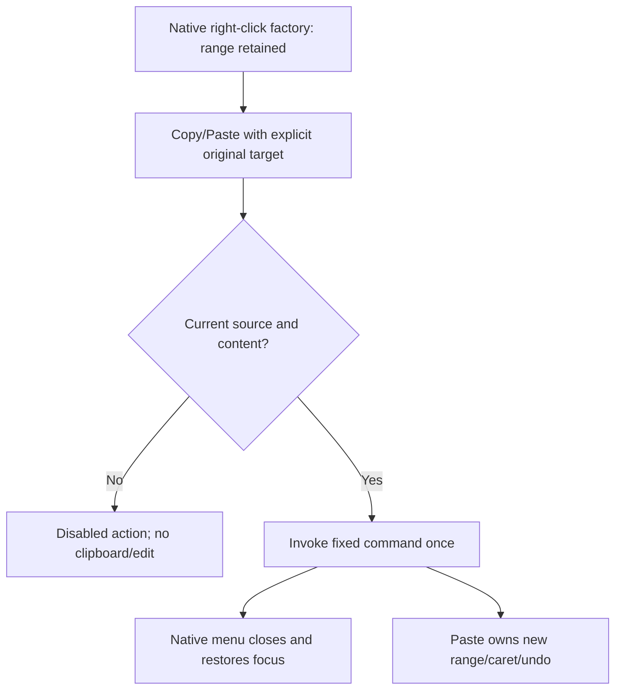
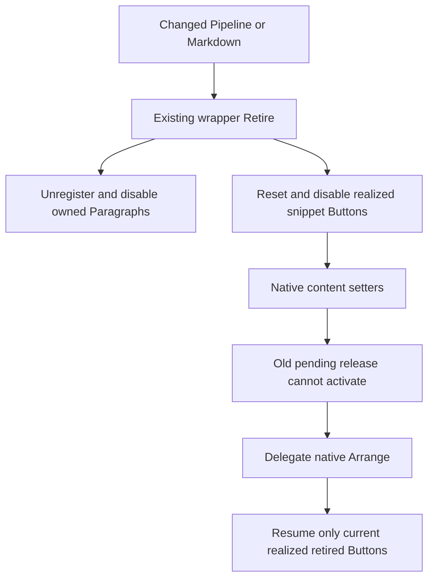
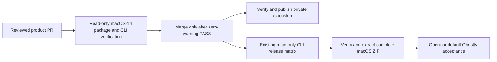
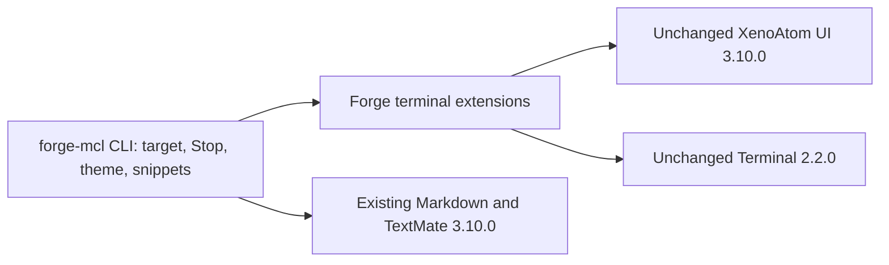

# Phase 70.1 — Text-interaction foundation

**Status: Both full code reviews R2 REVISE; canonical CI failed 16 tests before native publish. Corrected R4 full handoff frozen; fresh full code reviews and canonical CI running. Delivery and manual acceptance remain open.**
**R11/R2 approvals are historical; [R3 plan](phase-70.1-text-interaction-foundation-plan.md) is PLAN APPROVED at 2026-10-06 01:15:19 UTC.** Parent: [Phase 70](phase-70-tui-text-interaction.md).

## Requirement

Make composer, file-editor, and rendered-text Copy/Paste behave consistently, using native
XenoAtom selection, commands, context menus, buttons, and clipboard transport wherever they
meet the contract. Add a copy icon to real code snippets while preserving syntax highlighting
and the established UI. Shared behaviour belongs at the TUI's text-interaction boundary;
individual controls retain editing/rendering ownership.

## Constraints for design

| Area | Required behaviour / existing public capability |
|---|---|
| Keyboard editing | Retain PromptEditor/CodeEditor selection, word/line navigation, Select All, paste events and undo. Prove Shift+arrows/Home/End and word selection without a preceding mouse click. |
| Copy vs Stop | A selection's Copy attempt consumes the gesture even if clipboard writing fails; it never cancels a turn. With no applicable selection, preserve the current chat Stop contract. `/edit` continues to isolate chat shortcuts. |
| Mouse editing | Drag, double-click and Shift-click use the native text editor. Right-click offers Copy/Paste and appropriate native editing actions; menu cancellation restores focus and selection. Define paste replacement range before opening a popup can change focus. |
| Shared ownership | One reviewed policy for choosing the current text owner, taking its payload and reporting clipboard results; composer, editor, snippet and later transcript actions use it. Do not create a second editor, OS clipboard backend, global input framework, or speculative control hierarchy. |
| Clipboard | Use `App.Terminal.Clipboard.TrySetText` / `TryGetText`, not screen scraping or shell commands. `CanSetText`/`CanGetText` are hints, not proof. Report success only after a successful operation; a failed paste leaves draft and selection unchanged. Successful empty text is distinct from a failed read. No automatic clipboard polling. |
| Code payload | Copy the Markdown render context's complete `.Code` (its LF-normalized text), without fences, line numbers, UI labels, syntax markup, image placeholders or visual wraps. Preserve indentation, blank lines and trailing newlines; current display `TrimEnd('\n')` must not trim the copy payload. |
| Code control | Use a native focusable `Button` and shared clipboard policy. Label/tooltip identifies Copy code; reserve layout space rather than cover code. Support mouse and keyboard activation, focus/hover, copied and failed states. Image-heading pseudo-fences are excluded. |
| Streaming | Define whether an activation copies current displayed content or an invocation snapshot, including menu-open updates and code-fence replacement. A stale visual must never copy a different snippet accidentally. |
| Existing rendering | Keep TextMate `Paragraph.Runs`, wrapping, TileFrame and Kitty images. FadeIn, StreamCaret and LinkPointer overlays stay non-hit-testable. Copy operates on text; decorative image cells are not content. |

These are outcome constraints, not a proposed API. Native commands currently ignore clipboard
failure, and popup focus can clear selection. Merely restoring `TextEditor.Copy` or adding
`CommandPresentation.ContextMenu` does not satisfy the complete contract. Native Cut can delete
after a failed copy: do not newly expose Cut without defining safe failure behaviour. A broader
clipboard/editor rewrite is outside the requested slice.

## Public integration gaps — confirmed at the pinned baseline

| Boundary | Fact the design must address |
|---|---|
| App Copy interception | UI 3.10.0's sealed `TerminalApp` privately intercepts active-selection Copy before commands and `KeyDown`, discarding the clipboard bool. `TerminalAppOptions` has no interception/result callback. Replacing editor commands cannot govern every Copy result. [Pinned dispatch](https://github.com/XenoAtom/XenoAtom.Terminal.UI/blob/6f4e0cde3890d8ce2510ac0451b861863e4aeeaa/src/XenoAtom.Terminal.UI/TerminalApp.cs#L2500). |
| Editor range restoration | `SelectionStart`/`SelectionLength` are protected getters; public caret and payload access do not provide selection restoration. `CodeEditor` is sealed, so a composer subclass cannot solve the same menu-range contract for `/edit`. [Editor base](https://github.com/XenoAtom/XenoAtom.Terminal.UI/blob/6f4e0cde3890d8ce2510ac0451b861863e4aeeaa/src/XenoAtom.Terminal.UI/Controls/TextEditorBase.cs#L339), [CodeEditor](https://github.com/XenoAtom/XenoAtom.Terminal.UI/blob/6f4e0cde3890d8ce2510ac0451b861863e4aeeaa/src/XenoAtom.Terminal.UI/Controls/CodeEditor.cs#L433). |
| Clipboard transport | Terminal 2.2.0's sealed `TerminalClipboard` delegates `TrySetText`/`TryGetText` directly to its backend. Direct Forge calls receive a bool; subclassing cannot observe native library writes. [Pinned clipboard](https://github.com/XenoAtom/XenoAtom.Terminal/blob/5517cb3d8cdf0532ecc89260067064f98cde6137/src/XenoAtom.Terminal/TerminalClipboard.cs#L69). |

The current published releases still match these pins — [release check](phase-70.1-text-interaction-foundation_completed.md#current-published-capabilities).
These source findings explain the public-extension contract below; they do not prove that every
possible adapter is infeasible. Do not substitute a snippet-only or keyboard-only implementation
for the foundation. The reviewed contract and operator-selected public-extension evaluation
named in the parent hub govern this boundary.

## Verification route

The operator-selected [manual verification exception](phase-70-tui-text-interaction.md#manual-verification-exception)
supersedes live reproduction as a design prerequisite. Source/controlled findings support
design; physical terminal/clipboard/Retina observations are deferred to the operator's final
installed check. The Ghostty denial remains in force; no alternate agent access is allowed.

| Manual observation after implementation | Record on laptop Retina, both themes, normal and narrower windows |
|---|---|
| Provenance | Installed artifact/version/digest; actual Ghostty version, font, cell metrics and window dimensions; normal saved login/endpoint and dedicated scratch Project. Prior metrics remain historical or synthetic. |
| Composer keyboard | Before any click, then after a click: Shift+arrows/Home/End and word selection; Ctrl/Cmd gesture used, focus, highlight, exact pasted payload and whether Copy stops an active turn. |
| Mouse and menus | App drag/double/Shift-click versus terminal-native selection; multiline Copy, Paste replacement, right-click Copy/Paste, cancellation and restored focus/selection. |
| Editor and transcript | Disposable `/edit` file's keyboard/mouse Copy/Paste and save/close; real reply's paragraph/rich-range selection and heading/code interaction, with exact pasted text. |
| Snippets and appearance | Keyboard/mouse code Copy, exact payload including indentation/blank lines/trailing newline; truthful feedback, wrapped/unwrapped/unknown-language snippets and streaming replacement. Compare menu/button/selection states against the locked reference; preserve start page, Kitty frames/headings and syntax colours. |

Controlled event/clipboard-failure tests, theme/state checks and Native AOT remain agent work.
They do not prove physical key delivery, OS clipboard or Retina rendering. Those cases remain
pending until the operator records them; the phase cannot close on automated evidence alone.

## Design decision checklist — resolved by the locked contract below

| Question | Required design output |
|---|---|
| Keyboard and mouse Copy routing | Concrete owner precedence and actual public hooks, including TerminalApp's pre-command active-selection interception; no-selection Stop and failed-copy handling. Name intended gestures; Ghostty's physical Ctrl/Cmd/terminal-native delivery is checked by the operator after implementation. |
| Context-menu lifetime | Exact payload/range capture, focus restoration, cancelled-menu behaviour and document-version handling, using public APIs. `SelectionStart`/`SelectionLength` are protected, not public integration points. |
| Honest results | Concrete way all owned Copy/Paste paths observe the bool result. Review the operator-selected public Forge extension/package; define types, signatures, ownership and Native AOT implications. No invented library APIs or new private access. |
| Visual interaction | Binding revised reference for snippet icon/menu and feedback; exact placement, focus order, disappearance/reset rules, light/dark tokens and contrast pairs. |

## Public-extension contract

**Revision R11 previously locked:** both complete reviews PASS; supervisor locked the foundation
design at 2026-10-06 00:02:26 UTC. R10 public feasibility proved explicit source retirement,
source-level Bubble handlers and measurement-before-show. R11 covers the full direct/native
source-type and chrome lifetime audit below. This is design approval, not plan or product-write approval.
Actual package/consumer/AOT verification follows an approved implementation;
bounded public feasibility probes precede the plan.
See [current review/probe evidence](phase-70.1-text-interaction-foundation_completed.md#r10-bounded-public-foundation-feasibility).

**R12 locked design:** retain the complete R11 contract; add synchronous snippet retirement at the existing Markdown host/wrapper boundary and prove warning-free AOT through the canonical macOS build environment before merge. Delivery uses the already-supported release ZIP route. No public API, package, library version, visual reference, token or product-default change is proposed.

**R11 source placement:** direct user/pending-user/notice/error Paragraphs need the same
fixed Copy and source lifetime as Markdown Paragraphs. Owned chrome TextBlocks are explicitly
nonselectable; TextBlock's native pointer mechanics differ from Paragraph. The prior complete R2
plan authorized the current draft; product writes resume only under the complete approved R3 plan.

Keep the current UI/Markdown/TextMate 3.10.0 family and Terminal 2.2.0 unchanged. Forge opts its
owned text controls out of native app-wide selection ownership, retains their native editing
and selection, and supplies selection-aware Copy commands with truthful results. Native
context menus invoke commands against their explicit original target and then close normally.
Forge's reusable extension assembly owns fixed clipboard commands and native menus. The CLI owns
target coordination, chat Stop, theme/feedback presentation and snippet composition.
The rejected R6 native API/mechanics proposal is [archived](phase-70.1-text-interaction-foundation_completed.md#superseded-r6-native-library-proposal);
its review PASS does not carry forward to this route.



### Existing public hooks and evidence

All hooks below exist at the pinned baseline; none is a proposed library API.

| Public surface | Use / source evidence |
|---|---|
| `TextEditorBase.IsSelectable { get; set; }`, `HasSelection`, `TryCopySelection(out string)` | Set false before attachment. It controls app-wide ownership, not core input/range handling. [Base](https://github.com/XenoAtom/XenoAtom.Terminal.UI/blob/6f4e0cde3890d8ce2510ac0451b861863e4aeeaa/src/XenoAtom.Terminal.UI/Controls/TextEditorBase.cs#L300), [ownership routing](https://github.com/XenoAtom/XenoAtom.Terminal.UI/blob/6f4e0cde3890d8ce2510ac0451b861863e4aeeaa/src/XenoAtom.Terminal.UI/TerminalApp.cs#L501). Public-only probe covers native keyboard/mouse selection with false. |
| `Paragraph.IsSelectable`, `HasSelection`, `TryCopySelection`; `ISelectionOwner.ClearSelection()` | Same app-ownership opt-out; native Paragraph mouse range remains usable. [Pointer handling](https://github.com/XenoAtom/XenoAtom.Terminal.UI/blob/6f4e0cde3890d8ce2510ac0451b861863e4aeeaa/src/XenoAtom.Terminal.UI/Controls/Paragraph.cs#L454), [interface](https://github.com/XenoAtom/XenoAtom.Terminal.UI/blob/6f4e0cde3890d8ce2510ac0451b861863e4aeeaa/src/XenoAtom.Terminal.UI/Input/ISelectionOwner.cs). Clear the previous owned range explicitly; do not register a native app selection owner. |
| `Visual.RemoveCommand(string)`, `AddCommand(Command)`, `Commands` | Replace owned editor `TextEditor.Copy`; retain the original `TextEditor.Paste`. `CanExecute=HasSelection`, `ConsumesGestureWhenUnavailable=false` allows parent Copy-or-Stop when the editor has no range. |
| `Visual.ContextMenuFactory: Func<Visual,IEnumerable<MenuItem>>?`; `MenuItem.CommandTarget` | Exact Copy/Paste menu for editors, Copy-only for Paragraph. Command-backed items target the original source. Native invocation-before-close is retained. [Factory dispatch](https://github.com/XenoAtom/XenoAtom.Terminal.UI/blob/6f4e0cde3890d8ce2510ac0451b861863e4aeeaa/src/XenoAtom.Terminal.UI/TerminalApp.cs#L3409), [invoke ordering](https://github.com/XenoAtom/XenoAtom.Terminal.UI/blob/6f4e0cde3890d8ce2510ac0451b861863e4aeeaa/src/XenoAtom.Terminal.UI/Controls/ContextMenuService.cs#L358). No popup lookup, focus restoration or range reconstruction in Forge. |
| `TextEditorBase.ClipboardPasteHandler`, nullable `TextEditorClipboardPasteContext.Text` | Feedback-only handler returns null; native Capture/insertion/undo retained. Null means failed read, empty means successful no-op. Bracketed input remains native event-text insertion, with no handler/read. |
| `Visual.PointerPressedRouted`, `RoutingPhase.Preview`, `OriginalSource` | Coordinate only owned sources on left Down: remember the native text target and clear the previous target via the public interface. Do not intercept or reimplement editor navigation/drag. |
| `EnumerateVisualsDepthFirst()`, `Measure`, `Arrange`; protected child/lifecycle overrides | One bounded CLI source-lifetime wrapper delegates native layout and reconciles realized Paragraphs afterward. It surrounds the existing native MarkdownControl or direct transcript Paragraph, with synchronous retirement before content mutation/detach. No private builder/cache access. [Enumeration](https://github.com/XenoAtom/XenoAtom.Terminal.UI/blob/6f4e0cde3890d8ce2510ac0451b861863e4aeeaa/src/XenoAtom.Terminal.UI/Visual.cs#L1378). [R10 feasibility](../evidence/phase-70/foundation-feasibility-r10.json) proves Markdown realization, scroll/recycle and streaming retirement. Direct Paragraph placement requires controlled product geometry/lifetime checks. |
| `Button.ClickRouted`, public `IsPressed`, `IsVisible`, `IsTabStop`, protected `OnDetachedFromApp` | Normal native activation only; cancel the public pressed flag on detach/hide. [Release checks](https://github.com/XenoAtom/XenoAtom.Terminal.UI/blob/6f4e0cde3890d8ce2510ac0451b861863e4aeeaa/src/XenoAtom.Terminal.UI/Controls/Button.cs#L267). No internal hover/capture reset or new native admission API. |
| `App`, `Parent`, `FocusedElement`, `HasFocus`; reactive `SetStyle<ButtonStyle>(Func<ButtonStyle>)` | Check the current Forge view and public attachment/ancestor eligibility. Native routing owns modal/focus scope; only native Click/command delivery invokes the action. Existing reactive slots, palette and native bold remain. |

Controlled feasibility: [public-extension probe](../evidence/phase-70/public-extension-probe.json).
This is an in-memory library probe, not Forge integration or live acceptance.

### Fixed target and Copy policy

`TextInteraction` remains internal to CLI TUI. Its state is the current Forge screen/editor slot,
the last owned mouse-text target, and clipboard feedback. It consumes the extension assembly's
result; no backend, global key interceptor or configurable routing policy is introduced.

| Event | Contract |
|---|---|
| Source setup | Composer and `/edit` set IsSelectable=false before attachment. Their native Copy command is replaced once. All owned transcript Paragraphs receive the same flag and fixed Copy-only menu, including direct user/pending-user/notice/error text. Unrelated framework controls are untouched. One bounded source-lifetime wrapper delegates native layout/rendering to its existing child and styles. |
| Own mouse selection | On preview left Down resolve the nearest owned editor/Paragraph in OriginalSource's public parent chain. Clear ranges on other registered owned sources, and remember this source. This includes a focused editor range created by keyboard without a previous mouse target. Native controls handle drag/double/Shift-click unchanged. Clicking other owned chrome clears the remembered range. Popup clicks are outside the screen subtree, so they do not clear its target. |
| Copy precedence | A selected focused owned editor first; otherwise the remembered current rendered-text source with selection. Editor commands and the parent chat Copy-or-Stop command share the same extraction/write routine. All owned text sources have native app ownership disabled, so its early unchecked Copy cannot pre-empt this route. |
| Copy result | Selected source: TryCopySelection once; failed/empty extraction shows Copy failed, with zero write and zero Stop. Nonempty extraction: native TrySetText once; true shows Copied, false Copy failed. Range remains; no retry/fallback. Exceptions retain the existing UI-loop failure boundary and never call Stop. |
| No selection | Parent command performs the existing Stop action only in chat, retaining Wake/turn ownership. `/edit` retains current isolation and never cancels the chat turn. Native editor commands/navigation unrelated to Copy stay unchanged. |
| Editor activation | Source-level KeyDown/TextInput/Paste handlers use the actual Bubble phase and claim their owned editor without handling/preventing native editing. “Source-level” means subscription on that editor, not RoutingPhase.Direct. Commands execute before KeyDown, so after editor/host construction decorate existing native editor commands except Copy: preserve all public metadata/availability/route fields, Claim(editor), then original Execute(target) exactly once. Native menu Paste resolves this decorated command. No copied editing logic/global input subscription. |
| Copy claim | A selected editor command reports its fixed target and clears other owned ranges as part of the host's action feedback; parent Copy claims the chosen source before extraction. This makes Ctrl+A followed immediately by Ctrl+C correct even in one input batch. Copy never delegates to another source after failure. |
| Source change | Source Claim clears other registered ranges using ISelectionOwner.ClearSelection. Tab to an empty composer alone leaves a Paragraph range available until new editor input or another text claim, matching the chosen Copy precedence. A native menu focus excursion never claims another text source. Screen/editor-slot changes clear and retire the old target synchronously in existing swap methods. Retired sources are not searched by transcript index. |

This intentionally replaces native app selection coordination only for Forge-owned text surfaces.
It does not replace their selection renderer, range fields, editing, navigation or undo.

The bounded CLI source-lifetime wrapper owns a set of its currently registered Paragraphs. It
surrounds the existing native MarkdownControl or a direct user/pending-user/notice/error
Paragraph. A direct Paragraph is configured before attachment. The wrapper adds zero padding,
paint, input handling or geometry; native Measure/Arrange and the existing TileFrame.OneLineOr
decision remain unchanged. No generic update callback, mode or reusable control framework is
introduced.



Before any changed Pipeline or Markdown assignment, ChatScreen's one named Markdown update
boundary calls the wrapper's retirement method, which unregisters those sources,
clears their native ranges and remembered target, and sets their public IsEnabled=false.
The same call synchronously retires currently realized snippet Buttons as specified below;
physical detachment after layout is too late to contain an already queued release.
Detach does the same. After delegated native Arrange, enumerate attached Paragraphs: retire
absent sources; configure/register live ones with IsSelectable=false and IsEnabled=true.
All streaming/pipeline writes go through that host update boundary; unchanged content does not
retire ranges. Direct Paragraph content is created once by existing ChatScreen.Text/SetText;
replacement creates a new native child and its old wrapper retires on actual detach. There is no
second Paragraph lifetime implementation. Controlled product checks must cover single-row and
wrapped user pills, notice/error text, detach/re-attach, unchanged-content selection retention and
old captured menu refusal. The R10 Markdown probe supports the shared lifecycle mechanism but
does not count as an observation of those product paths.
The CLI registry contains live sources only and releases old trees. This is presentation lifetime
ownership, not a package eligibility callback or a replacement Markdown renderer.

Native TextBlock also implements ISelectionOwner and defaults IsSelectable=true, but its pointer
handlers require that flag, unlike Paragraph. Foundation does not add a TextBlock selection
mechanism. Set IsSelectable=false on explicitly owned status/header/user labels/timestamps/tool
chips/keybar/fallback participant titles, FileEditor path/message and snippet Button label content
before attachment. StartPage's explicitly constructed prompt and option-label/description
TextBlocks are also chrome: disable only their text selection, preserving OptionList input,
activation, layout and appearance. The same bounded transcript wrapper disables TextBlock selection on its
realized owned subtree, including native Markdown alert titles; those structural heading semantics
remain in the dependent rich-selection scope. Text/style/layout remain native and unchanged.
Do not apply this to unrelated native menu/framework controls or a global visual tree. Copyable
content in this foundation is native editor text and owned Paragraphs; chrome must never register
an unchecked app selection owner. Tests must prove chrome drag cannot intercept content Copy or
the applicable no-selection Stop gesture. Complete meaningful rich content remains required by
70.2, including logical headings; this exclusion does not close the phase.

| Complete source/type audit | Foundation policy / lifetime |
|---|---|
| PromptEditor composer and CodeEditor file body | Configure before attachment; native fields/input remain; CLI slot owns synchronous registration/retirement. |
| Markdown body/list/quote/HTML/table-cell Paragraphs | Same wrapper after native realization; retire before changed host setters and on detach; each current Paragraph gets fixed Copy/menu. |
| Forge code-block Paragraph | Same Markdown wrapper; native Runs/wrap retained; exact whole-code convenience belongs to its separate Button. |
| Direct user/pending-user/notice/error Paragraphs | Same wrapper, configure before attachment; immutable native text; replacement/detach retires. |
| Explicit ChatScreen/FileEditor/StartPage chrome TextBlocks | IsSelectable=false at construction; no custom range mechanics or registration. |
| Realized Markdown alert-title and snippet-label TextBlocks | Nonselectable within the bounded owned subtree; structural heading semantics defer to rich selection. |
| HeadingImage and other Kitty/image/overlay visuals | Not ISelectionOwner; preserve non-hit-testable overlays and existing image rendering; logical heading ranges belong to 70.2. |
| Native LogControl, Markup and DataGridControl | No owned instance on these current paths. Custom Forge code renderer always returns Paragraph/HeadingImage, bypassing native LogControl fallback; Markdown tables use Paragraph cells. No unrelated framework mutation. |

This sweep is from the actual TUI factories and pinned Markdown builder, not a generic selection
interface assumption. Product tests exercise representative native user, notice, list/quote/table
and alert sources, chrome drag, StartPage activation/regression, Markdown replacement, editor
swaps and snippet reuse. A newly discovered owned source type returns to design rather than
silently acquiring an unchecked Copy path.

Native Tick processes posted actions and input before layout. A retired Paragraph can still be
physically attached in that interval; disabling it prevents new native selection and makes the
package's fixed effective-eligibility guard refuse an old menu action. After native re-realization,
registration restores eligible live text. The probe observed old pre-layout children, not new
unconfigured interactive Paragraphs; it does not claim arbitrary dynamic-tree safety.

### Fixed native menus and Paste



The factory captures only a bounded source guard: original app/source/parent attachment and effective ancestor eligibility,
editor document reference plus public Version (editor), or complete Text string (Paragraph).
`Command.CanExecute` and execution use the same pure current-source/content checks; Copy also
requires HasSelection. No directional snapshot is captured because the native fields are never
cleared or restored. A changed source disables the action; dismiss/reopen is the recovery, with
no invented clipboard failure. No arbitrary application availability, Closed or transforming
Paste callbacks are installed by this feature.

| Operation | Fixed route / outcome |
|---|---|
| Menu Copy | Forge command, explicit CommandTarget=original source; same Copy routine and feedback. Native menu invokes then closes. Keyboard Enter and actual left-click must preserve the original range. |
| Menu Paste | A fixed Forge menu command validates its captured editor guard and calls the retained native TextEditor.Paste command's public Execute(editor). Native range replacement/undo happens before ordinary menu close. Closing restores focus, not old range fields, so the new caret is retained. |
| Keyboard Paste | Unchanged native TextEditor.Paste, with the same feedback-only ClipboardPasteHandler. Handler reads Text and updates feedback only; returns null, queues no edit and changes no document/range/focus/tree. |
| Failed read | Text=null: Paste failed; native no-op, range/caret/draft unchanged. No reread or bool/result API. |
| Empty text | Clear clipboard feedback, return null: successful native no-op, original range/caret retained. |
| Nonempty text | Clear feedback, return null: native insertion replaces the range and creates its existing Paste undo entry. One Undo restores the original document. |
| Escape / outside / Tab | Existing native close/focus/redispatch behaviour. Escape preserves the range. Outside/Tab close retains it at the close milestone; subsequent normal input may change it. No Forge restoration over those effects. |

R6's native callback reentrancy guards, permanent detach latches and close-before-invoke were
solution-specific hardening, not new user requirements. The fixed Forge callbacks are pure or
feedback-only; this slice does not promise arbitrary hostile callback containment. No native
failure is silently promoted to success, and no required mouse/edit/menu path is removed.

### Snippets and feedback

Keep the original immutable `context.Code` before display TrimEnd, LF/indentation/blank/trailing
newlines, pseudo-heading exclusion, Paragraph/Runs/TextMate/wrapping/TileFrame and one reserved
header row. Use the existing native Button and the same truthful write-result/feedback routine.

| Boundary | Contract |
|---|---|
| Activation | Normal native Click (mouse, Enter, Space), current original app, attached/enabled/visible ancestor path, current source and focused Button. Native input routing supplies modal admission; Forge does not reconstruct scope. One synchronous TrySetText of the immutable payload. |
| Recycling | Bounded Button subclass OnDetachedFromApp resets public IsPressed=false and local feedback/pending feedback before base. Hide at width0 does the same. Do not touch internal IsPressedInside/IsHovered or private app capture. Native release checks IsPressed; old release cannot activate after reset. Fresh reattachment stays supported. |
| Feedback | Apply bool result only to the still-current attached source and noninvalidated synchronous attempt; clear pending state in finally. Detach during transport cannot resurrect feedback; accepted transport writes cannot be undone. |
| Small widths | Header retains one row. Its native-delegating MeasureCore sets width-dependent visibility before measuring the Button; ArrangeCore applies actual-content-width hiding/reset. Showing only in Arrange leaves native measured bounds at zero and is rejected. Width0 hides/untabs the same Button; positive width restores it. Width1–2: glyph/zero padding; width3: one padding cell each side. Width<15: icon-only/full tooltip; otherwise 15-cell label. Native focus repair handles hiding. |
| Feedback text | Idle ⧉ Copy code; success ✓ Copied; failure ! Copy failed; native tooltip Copy code/Copied/Copy failed. Editor/composer clipboard feedback prefixes underlying progress/save status with ` · `; reset on next action/source edit/loss of both focus and hover/detach/replacement/hide. No timer. |

### Synchronous snippet replacement — R12 locked contract

Retire snippet activation at the existing source-lifetime boundary before either changed native
Markdown setter. Paragraph retirement alone leaves its sibling Button enabled until native
layout. A compiled-product controlled probe reproduced one old-payload write in that interval;
the supervisor independently reran it; [controlled regression evidence](../evidence/phase-70/foundation-replacement-regression-r12.json). This is a lifecycle placement correction within the CLI,
not a new public clipboard contract or native-library change.



| Boundary / complete internal shape | Fixed behaviour |
|---|---|
| `ParagraphSelection.Retire(): void` | Retain Paragraph retirement. Enumerate currently attached `CodeCopyButton` descendants in its own native child subtree (only while attached to the same non-null app) and call their `Retire()` synchronously. No button registry, callback, mode or global tree sweep. Detach uses this same retirement; native child detachment already invokes each Button's existing reset. |
| `CodeCopyButton.Retire(): void` | Capture the current native `IsEnabled` once per retirement in `bool? _enabledBeforeRetirement`, initially null. Reuse the existing reset: invalidate generation/pending feedback, clear shared feedback for this source and set public `IsPressed=false`; then set `IsEnabled=false`. Repeated retirement preserves the first captured value and remains safe. No private capture/hover state. |
| `CodeCopyButton.Resume(): void` | If the captured flag is null, do nothing. Otherwise clear the retirement marker and restore exactly its captured enabled value. A deliberately disabled Button remains disabled. Do not restore old focus, press, payload or feedback. This is a bounded lifecycle marker, not an option or public API. |
| Wrapper after native `Arrange` | Enumerate currently attached `CodeCopyButton` descendants (`button.App == wrapper.App`) and call `Resume()`. Native realization decides which immutable render is current. This covers recycled and retained current visuals without assuming a detach/attach callback must occur. Obsolete children absent after layout never resume. Width visibility/Tab eligibility remains owned by the existing header. |
| Activation and synchronous write continuation | Retain the current original app/parent and generation checks and effective enabled/visible ancestor eligibility before transport and before feedback. Retirement changes generation and disables activation immediately; even a later resume cannot revive an old press or write-feedback continuation. Fresh native activation of a current resumed Button remains supported. |
| Unchanged source | The existing host compares Pipeline and Markdown first. No retirement or reset when both are unchanged; existing selection/feedback remains subject to its ordinary lifetime rules. |

Required controlled regression: actual `ChatScreen.Show` posts a changed source through its
named host setter before a queued mouse release drains. Observe zero clipboard writes, old
`IsPressed=false`, disabled old Button and no revived feedback before layout; then verify the
current replacement's fresh mouse/Enter/Space activation and exact new payload. Cover
Pipeline-only change, repeated retirement, unchanged content, normal outer recycling, retained
current visual reuse, disabled-state preservation and retirement during a synchronous write.
The operator's installed Ghostty/Retina checks remain separate.

| Design decision | Owner / reuse / admission |
|---|---|
| Replacement timing | Existing CLI host and native-child wrapper; [CLI README](/Users/ameerdeen/progs/forge-mcl/src/ForgeMission.Cli/README.md). Reuse its single pre-setter retirement and public enumeration. |
| Press and feedback invalidation | Existing CLI `CodeCopyButton` lifecycle and reset. Reuse public native `IsPressed`/`IsEnabled` and its bounded generation; native selection, input, focus and editing remain native. |
| Reuse admission | Existing wrapper's post-native Arrange knows the realized subtree. Restore only retirement-owned enabled state; no independent native attachment assumption or second lifecycle owner. |
| Public/API/security/defaults/UI | Unchanged extension package/API, pinned dependencies, owner boundaries, tokens/galleries and default route. Hosted tier/store/identity changes N/A. No copied payload logging or OS clipboard access. |

Designer rules changing this decision: **3 No NIH** reuses the current reset/host/wrapper;
**4 One owner** keeps presentation lifetime in the CLI; **7 Minimum needed** adds no registry
or native API; **10 Built-in safety** disables old activation before setters;
**11 Verified means done** requires the actual setter/input ordering regression.
Rejected: waiting for detach (reproduced stale write); a permanent dead-button latch (breaks
recycling); attachment-only resume (does not establish retained-current-visual reuse);
blanket enable on every layout (overwrites deliberately disabled state).
Open gates: corrected product regression, all existing verification, full code reviews and delivery/acceptance. No
operator Type-1 decision is added: repository/package/public API/identity boundaries do not change.

### Warning-free AOT and normal delivery — R12 locked contract

The current workstation's canonical local publish exited zero but emitted six linker warnings:
the existing ld_classic flag is unsupported by this linker, and five installed Homebrew dylibs
target newer macOS versions than the executable's existing minimum. This is a failed
zero-warning observation, not a warning waiver. Do not change the linker target, minimum OS,
installed libraries, environment or warning suppressions to obtain a local PASS.

Use the existing release workflow's macOS-14 build environment and prerequisites for the
pre-merge native observation. Add one verification job to the already-planned Terminal
Extensions workflow; it serves pull requests and precedes publication. The existing
main-only CLI release workflow remains unchanged. Actual CI output must establish zero
warnings before merge; the selected environment is not assumed to pass.



| Boundary / exact route | Required behaviour and observation |
|---|---|
| Owning file | The already-planned `forge-mcl/.github/workflows/publish-terminal-extensions-package.yml`, owned by forge-mcl packaging. Add `pull_request` to existing triggers and a `verify` job on `macos-14`; no additional host, workflow, setting or runtime component. |
| Verification authority | Job-level `contents: read`, `packages: read`; existing NuGet authentication via its scoped GitHub token. No provider keys, deployment credentials or package write permission. Native control tests use their memory-only backend. |
| Verification steps | Checkout the actual selected commit, install .NET 10 and the existing Homebrew OpenSSL/Brotli prerequisites, run the package test/pack/verifier route, publish the actual CLI `osx-arm64` with `-warnaserror` and exact SourceRevisionId, using the unchanged project/linker target. Run native help/version and record SHA256. Preserve the full native publish log and source identity as workflow artifacts. |
| Linker warning enforcement | Native linker warnings can leave exit code zero. Capture the complete publish output and fail the verification job on either nonzero exit or any actual compiler/linker warning (including `ld: warning:`). Do not filter warnings from the evidence. Ordinary `0 Warning(s)` summaries are not warnings. Supervisor/reviewers inspect the actual log as well. |
| Publication guard | Existing `publish` depends on `verify` and runs only for existing tag/manual publication events, never a pull request. Retain merged-ref, immutable 0.1.0, private visibility/repository association and committed provenance checks. Pull-request verification cannot publish. |
| Pre-merge acceptance | Actual verification job passes on the reviewed tree; required tests and both full code reviews pass. Compare the tested tree with the merge candidate. A failing CI/AOT observation remains open; no local warning waiver follows from selecting this route. |
| Post-merge CLI delivery | Dispatch the unchanged `release.yml` on merged main with an unused patch version (latest observed release v0.9.3; candidate v0.9.4 must be rechecked before dispatch). All four existing host/RID native jobs, help/version checks and eight published ZIP/checksum assets must pass. Inspect warning output rather than assuming green means zero. |
| Installed default artifact | Authenticated download of the complete published macOS ARM64 ZIP and checksum; verify remote/local digest, extract every native sidecar, run native help/version at the exact merged SHA, then extract the complete payload into the existing /Users/ameerdeen/.local/bin install directory, replacing only matching release entries. Record the installed forge and sidecar digests and verify normal PATH resolution. This supported route replaces local `make install` for this task. No branch binary or warning-bearing local build is accepted. |

Owner: forge-mcl packaging and its unchanged release workflow, as defined in
[CLI releases](https://github.com/katasec/forge-mcl/blob/2022b512dd2bd108626124f22bc1cfe7652648d7/README.md#cli-releases).
Reuse its existing macOS host, dependencies, native publishing and complete archive; the
package-specific workflow supplies only the missing pre-merge observation. This changes CI
verification, not CLI startup, endpoint, sign-in, Project, terminal or clipboard transport.
The release ZIP is already an accepted [default artifact](../design/default-path-acceptance.md#forge-chat-and-forge-chat---hands).
Security: CI uses scoped read permission for verification, existing deliberate publication
permissions afterward; hosted tier/store/identity questions remain N/A. Engineering Philosophy:
one verification/publication pipeline, no dry-run knob, compatibility path, suppression or OS
workaround. Designer rules **3 No NIH**, **10 Built-in safety** and **11 Verified means done**
choose the existing host and an enforced actual warning observation.

Rejected: ignoring a successful-exit linker warning; removing ld_classic or raising the minimum
OS inside this text-interaction task; modifying Homebrew/OS configuration; publishing a branch
binary; merging before native evidence. Open gate: actual canonical CI output, after revised
plan approval and reviewed product code; no canonical zero-warning PASS is currently claimed.

### Candidate visual reference specification

Saved binding state galleries (synthetic references, freshly inspected in both complete R10 reviews):

- [Light](../images/phase-70.1/foundation-light.svg)
- [Dark](../images/phase-70.1/foundation-dark.svg)

Each gallery contains separately labelled, clipped frames with local cell coordinates. Use synthetic **10×20-unit cells**, normal **100×32** and narrow **60×24** viewports. Gallery dimensions are presentation scaffolding, not product defaults or Retina observations.

Exact csharp fixture (LF text, including the final LF):
`var greeting = "hello";\nConsole.WriteLine("a sample with a long literal");\n`.

| Frame | Exact owned slice |
|---|---|
| Snippet before/after, both widths | Use the fixture and geometry: frame `(10,8,W-20,height)`; synthetic insets left/right 4, top 2, bottom 1; content width `W-28`. Before code starts `(14,10)`; after header at y=10 and unchanged code at y=11. After adds exactly one row. Button `(W-29,10,15,1)`, with one-cell side padding. Wrap code by terminal cells, retaining syntax-run boundaries. |
| Button states | Native Button renders every label bold: idle `⧉ Copy code`, copied `✓ Copied`, failed `! Copy failed`, and disabled idle label in TextMuted. Hover retains the semantic style and supports the full native tooltip; it does not introduce another weight. Focus adds underline; pressed uses Selection, retaining underline when focused. Include focused+hovered and focused+pressed combinations. Disabled styling takes precedence. |
| Icon-only fixture | Separate 12-cell content-width frame; the same three-cell button shows `⧉`, `✓` or `!` with one-cell side padding. Include focused, pressed, failure and disabled states, and exact full tooltips `Copy code`, `Copied`, `Copy failed`. Add exact available-width 0/1/2/3 frames: at 0 set the same Button's `IsVisible=false` and `IsTabStop=false`, reset/invalidate its local feedback, and retain the one-row header. Derive available width from the enclosing header's content width, never the hidden Button's own bounds. At positive widths restore visibility/Tab eligibility; widths 1–2 use zero horizontal padding, width 3 uses one cell on each side. Native focus repair handles the hidden source; do not restore old focus or add a focus mechanism. Geometry values belong in `ForgeTheme`; `ForgeStyles` supplies native padding/style mappings. |
| Editor menu before/after | `alpha beta`, backwards beta selection, caret at its left endpoint. Menu anchor `(18,12)`, clamped to the viewport. Retain native Group border and native MenuListStyle padding, each one cell; label/shortcut gap 2. With native `Ctrl+C`/`Ctrl+V` strings, editor menu is **17×6 cells**, Copy-only Paragraph menu **16×5**. Copy initially selected. |
| Menu states | Selected Copy, hovered Paste, disabled Copy with no selection, and Paragraph Copy-only. Disabled items cannot activate. |
| Paste failure | Closed menu, unchanged beta range/caret, existing feedback row at y=`H-2` beginning `Paste failed`. Include composer progress and editor unsaved/save text following ` · ` so preservation of underlying status is visible. |

Use these existing token pairs: CodeBlockText/CodeBlockFill, TextMuted/CodeBlockFill, Success/CodeBlockFill, Error/CodeBlockFill; pressed CodeBlockText/Selection; menu/tooltip Text/SurfaceAlt; selected TextStrong/Selection; hover TextStrong/SurfaceAlt; disabled TextMuted/SurfaceAlt. Menu border uses existing Border/SurfaceAlt. Retain the existing selection background and native body/editor/TextMate foregrounds.

`ForgeStyles` owns every state mapping through the existing public reactive `SetStyle<ButtonStyle>(Func<ButtonStyle>)` route. Native `ButtonStyle.Resolve` returns Disabled first, then Pressed immediately; only nonpressed states apply Focused after Hovered. The reactive Pressed slot therefore uses CodeBlockText/Selection and bold, adding underline when `HasFocus` is true. Normal/Hovered/Focused retain the idle/copied/failed semantic foreground on CodeBlockFill; Focused adds underline. Disabled remains TextMuted/CodeBlockFill without focus/press styling. Native Button stamps bold into all content cells, which the default TextBlock inherits; all gallery labels retain that existing bold weight, including idle and disabled. Hover uses the full native tooltip, not a weight transition. No decoration override, new renderer or native style-resolver change is needed.

The galleries bind only the added header/button, contextual menus, selection continuity and clipboard-feedback prefix. Existing Kitty frames, headings, syntax renderer, motion, composer/start page and theme selector remain reused. Gallery palettes must come from both current `ForgeTheme` instances; do not sample screenshots or add component-local colors.

Before approval, save and inspect the galleries. [Controlled colour evidence](../evidence/phase-70/foundation-colours.json) enumerates current tokens and exact fixture syntax foreground/Selection pairs; it is neither native state rendering nor Retina acceptance. The csharp fixture's minimum selected-syntax ratios are 4.89 (light) and 4.26 (dark); other language runs still require controlled product evidence. If a pair is unreadable, return to design for a named theme-token change; do not patch individual runs. Controlled layout checks cover all four width/height corners of `[60,100]×[24,32]` and continuous resizing. Operator-installed Ghostty/laptop Retina comparison remains the approved final observation.


### Owners, reuse, failure boundaries and comparison

| Behaviour | Owner / reuse |
|---|---|
| Native editor/Paragraph range, input, menu and undo | Existing XenoAtom public controls; unchanged packages. |
| Fixed Copy/Paste menu, selection-aware editor Copy and transport result | Proposed Forge terminal extensions, below; no native command/editing reimplementation. |
| Owned target choice, Copy vs Stop, theme and visible feedback | Forge CLI TUI presentation ([CLI owns](https://github.com/katasec/forge-mcl/blob/2022b512dd2bd108626124f22bc1cfe7652648d7/src/ForgeMission.Cli/README.md#owns)); no general native input subsystem. |
| Immutable snippet/header/native reset | Existing ForgeCodeBlockRenderer plus bounded native Button subclass. |
| Styles/geometry | Existing ForgeStyles/ForgeTheme and reactive native style slots; no new palette/renderer. |
| Transport | Existing XenoAtom.Terminal clipboard; no OS backend/decorator. |
| Continuous rich selection | Separate Forge presentation slice with its own geometry/semantic proof, [route comparison](phase-70.2-rich-transcript-selection.md#public-extension-feasibility-and-fork-comparison). Single Paragraph is not completion. |

| Expected failure | Containment / result / recovery / proof |
|---|---|
| Copy extraction/write fails | Selected Copy command returns failure feedback without Stop; range remains, explicit retry. Prove zero cancellation and at most one write. |
| Paste read fails or empty | Existing nullable Capture and native no-op; failed versus empty feedback distinct; explicit retry. Prove no edit/undo and retained range. |
| Source/content changes with menu open | Fixed public guard disables stale target; user dismisses/reopens. Prove zero stale clipboard/edit and no false transport notification. |
| Snippet retires/hides | Public pressed reset plus bounded source/feedback lifetime; no old activation, fresh input can retry. Prove detach/hide→reattach/show→old release zero writes. |
| Owned callback throws | Existing UI-loop failure; no retry/Stop fallthrough. Relaunch after diagnosis. |

Public extensions are smaller for this foundation: existing range/edit/menu mechanics remain and
the upstream package family is unchanged. A fork may simplify continuous rich geometry access, where the
native hit mapping is private; it also requires compatible UI/Markdown/TextMate releases, AOT and
upgrade maintenance. Do not infer that small native patches make the whole fork cheaper. No fork
is authorized or created; the rich spoke records the bounded evaluation and unresolved proof.

### Separate extension package — operator-requested boundary

The operator asked: “Can we mark these as extensions in its own naespace so it's neatly separately
packaged ?” This requires an independently packable assembly, not just a folder/namespace.



| Boundary | Locked contract |
|---|---|
| Repository/project | `/Users/ameerdeen/progs/forge-mcl/src/ForgeMission.Terminal.Extensions`, in the existing solution. No new repository, upstream fork, executable or host. |
| Assembly, package, namespace | Assembly `ForgeMission.Terminal.Extensions`; package and namespace `Katasec.Forge.Terminal.Extensions`. Target net10.0, IsAotCompatible and IsPackable. Project/API draft is written and held for revised gates; release verification remains pending. |
| Why / Owns | Reusable selection-aware clipboard commands and fixed native text menus over published XenoAtom controls. The CLI executable owns chat presentation, Core explicitly excludes command-line UX, and no atlas component owns reusable terminal extensions. The requested packaging splits this bounded reusable responsibility from the executable. |
| Does not own | Stop, conversations, Forge view identity, themes/status strings, Markdown pipelines/renderers, Kitty images, snippet headers, OS clipboard transport or native editing/range geometry. It references no CLI/client/domain/Markdown/TextMate project. |
| API | The complete proposed surface below. Fixed conventions only; no options bag, interface hierarchy, service registration or configurable command registry. Result callbacks report transport facts only and run synchronously on the UI thread. |
| Current consumer | The CLI references the same-repo project, consistent with its existing Core/Serve/etc references; external future consumers can use the independently built package. No sibling repository source reference or parallel legacy path. |
| Publication/version | Candidate first version 0.1.0, exact upstream UI 3.10.0 and Terminal 2.2.0 dependencies, same private Katasec GitHub Packages route as existing forge-mcl libraries. Follow the merged-ref/provenance/immutable-version and visibility checks in `publish-core-package.yml`; publish only after reviewed implementation and actual checks. No guessed upstream release, ACL changes or publication during design. |
| Admission within approved implementation | After plan approval, establish the new README's Why/Owns/Does not own/Change admission/API and dependency diagram before writing component code; update forge-mcl repo/CLI README and solution inventory. Add one external-package inventory row to `/Users/ameerdeen/progs/forge-desktop/src/README.md`, linking the owning README; Desktop does not become a consumer. README, inventories and atlas row now exist in the held R2 draft; their final code/ownership reviews remain open. |

```csharp
namespace Katasec.Forge.Terminal.Extensions;

public enum ClipboardResult
{
    NoSelection, Copied, CopyFailed, PasteReadSucceeded, PasteReadFailed
}

public static class ClipboardText
{
    public static ClipboardResult CopySelection(
        XenoAtom.Terminal.UI.Input.ISelectionOwner source,
        XenoAtom.Terminal.TerminalInstance terminal);
    public static ClipboardResult CopyText(
        string text, XenoAtom.Terminal.TerminalInstance terminal);
}

public static class EditorClipboardExtensions
{
    public static void ConfigureClipboard(this XenoAtom.Terminal.UI.Controls.TextEditorBase editor,
        Action<ClipboardResult> report);
}

public static class ParagraphClipboardExtensions
{
    public static void ConfigureClipboard(this XenoAtom.Terminal.UI.Controls.Paragraph paragraph,
        Action<ClipboardResult> report);
}
```

`CopySelection` returns NoSelection only when HasSelection is false; failed/empty extraction is
CopyFailed with zero writes. Otherwise it calls the same `CopyText` write once. `CopyText` writes
its exact string, including a valid empty whole-code payload, and returns Copied/CopyFailed from
the bool. Null arguments are programmer errors. Neither method clears ranges, invokes Stop,
logs payloads or catches the existing UI-loop failure.

Both fixed ConfigureClipboard extensions set IsSelectable=false and install the source's native
menu factory; editor configuration additionally replaces only Copy and installs the feedback-only
Paste handler. Configuration is once per source; Paragraph factory reassignment is harmless and
does not accumulate event handlers. Menu guard checks original app/parent attachment, effective
visible/enabled ancestor path and the captured document/version or Text; no CLI view callback.
Each fixed command validates again on execution. The editor menu retains native Paste Execute.
PasteReadSucceeded clears host feedback for empty/nonempty reads, PasteReadFailed reports null;
the extension returns null to the native handler and never edits. Bracketed Paste stays native.

Callbacks do not edit, close menus or change attachment. The CLI's Copy callback claims the
explicit original source and maps facts to the named semantic tokens/status text; it never clears
that source's own range. Snippet activation and root Copy use the
same ClipboardText routine; no second bool/result implementation is kept in the CLI. The Markdown
realization wrapper remains a CLI renderer adaptation; it configures native Paragraphs through
the extension, without making Markdown a dependency of this small clipboard package.

The command decorator preserves Id, LabelMarkup, Name, DescriptionMarkup, SearchText, Gesture,
Sequence, Importance, Presentation, CanExecute, IsVisible, ConsumesGestureWhenUnavailable and
RouteGesture. It changes only Execute to claim then delegate. The existing source-level routed
handlers cover raw navigation, typing and bracketed Paste; no bindable assumption is made about
HasSelection/CaretIndex, and no asynchronous update callback is used to repair ownership.

This package boundary is locked design; the prior monolithic probe does not prove its
packed dependencies, API consumer compilation, callbacks or AOT. Actual package and product
observations follow approved implementation and are required before merge/publication. Exploratory
public-API feasibility probes precede plan approval; they grant no authority to implement product
code or write upstream.

Designer principles changing this revision: **3 No NIH** retains native command-backed menus and
invoke-before-close; **4 One owner** keeps only Forge target/feedback policy local; **7 Minimum
needed** drops arbitrary native callback hardening; **9 Prove library choices** uses a public-only
probe; **11 Verified means done** distinguishes controlled feasibility from integration/acceptance.
Rejected: native API/fork as the default foundation route, nonfocus custom menu, popup ancestry
lookup/deferred opening, clipboard backend wrapper, manual range restoration and internal state
access. Each adds work the public route avoids.

### Review and proof gates

| Gate | Current state / required result |
|---|---|
| Historical R10 reviews | Both complete R10 PASS: all 11 simplicity checks, 23 independently derived ownership placements and all six checks; fresh complete gallery inspection. [Evidence](phase-70.1-text-interaction-foundation_completed.md#r10-bounded-public-foundation-feasibility). |
| Complete current design reviews | R12 passed both complete reviews and supervisor locked it at 2026-10-06 01:01:15 UTC; [full verdicts](phase-70.1-text-interaction-foundation_completed.md#r12-complete-design-reviews). R11 is historical. |
| Library feasibility | R10 public-only native-control JIT probe: 64/64 observations, zero build warnings; supervisor independently reran it. [Evidence](../evidence/phase-70/foundation-feasibility-r10.json). Actual package, Forge integration/fault and canonical AOT checks remain required. |
| Plan approval | Complete R3 [plan](phase-70.1-text-interaction-foundation-plan.md) and both full plan reviews passed; supervisor PLAN APPROVED at 2026-10-06 01:15:19 UTC. R2 is historical. |
| Approved implementation sequence | R3 explicitly approved before resumed writes; component README/atlas admission included. After implementation, prove actual packing, isolated API-consumer compilation, resolved dependencies/provenance, callback/fault and CLI integration, and canonical warning-free Native AOT before merge/publication. Operator installed acceptance follows normal delivery. |
| Product implementation | Corrected R4 candidate frozen in [draft product PR62](https://github.com/katasec/forge-mcl/pull/62) and [draft atlas PR9](https://github.com/katasec/forge-desktop/pull/9); [full handoff and independently validated evidence](phase-70.1-text-interaction-foundation_completed.md#corrected-r4-candidate--full-handoff). |
| Current code review | Both full R2 reviews REVISE; combined within-plan R4 correction returned. Full simplicity/style R3 running; ownership follows sequentially. [Full verdicts/boundaries](phase-70.1-text-interaction-foundation_completed.md#full-code-reviews--r3). |
| Full suite | Corrected R4 controlled local877 passed,6 existing skips/883; focused181/181 and package26/26 PASS. Original CI failed16; fresh current-tree CI running. [Fresh complete evidence](phase-70.1-text-interaction-foundation_completed.md#corrected-r4-candidate--full-handoff); earlier failures remain archived. |
| Packed consumer | Fresh R4 consumer and root-matched package/cache/output identities PASS; [controlled evidence](../evidence/phase-70/foundation-packed-consumer-code-r4.json). Committed publication provenance/authenticated restore remain required. |
| Native AOT | R4 local publish/help/version exit0; six actual linker warnings keep local zero-warning gate FAIL. Current canonical [run37407903290](https://github.com/katasec/forge-mcl/actions/runs/37407903290) product/package step PASS; native publish running. [Prior CI failure](phase-70.1-text-interaction-foundation_completed.md#canonical-ci-r2--actual-failure) remains archived. |
| Rich selection | Geometry/semantics/selected-heading proof and route decision still open in the dependent spoke. Do not substitute single-Paragraph or snippet-only scope. |
| Acceptance | Operator-only installed default Ghostty/laptop Retina after code, both themes/windows; still pending. |

## Files and tests to inspect

All product paths below are relative to `/Users/ameerdeen/progs/forge-mcl`.

| Responsibility | Entry paths |
|---|---|
| Composer and routing | `src/ForgeMission.Cli/Tui/ChatScreen.cs`, `ComposerEditor.cs`, `ChatTui.cs` |
| Editor | `src/ForgeMission.Cli/Tui/FileEditor.cs`, `EditFile.cs` |
| Snippets and source text | `src/ForgeMission.Cli/Tui/ForgeCodeBlockRenderer.cs`, `ForgeMarkdown.cs`, `Transcript.cs` |
| Theme/style ownership | `src/ForgeMission.Cli/Tui/ForgeTheme.cs`, `ForgeStyles.cs`, `Graphics/CodeColours.cs` |
| Existing verification | `tests/ForgeMission.Mcl.Tests/Cli/ChatScreenTileTests.cs`, `ChatScreenMotionTests.cs`, `FileEditorTests.cs`, `ChatTranscriptTests.cs`, `StartPageTests.cs` |
| Extension component | `src/ForgeMission.Terminal.Extensions/README.md` and project/package; owning repo/CLI inventories and Desktop atlas admission must precede product merge. |

The nearest component README is `src/ForgeMission.Cli/README.md`; there is no Tui README.
Reconfirm dependency versions and owning repository instructions before design.

## Gates and acceptance specification

| Gate | Application |
|---|---|
| Security Architecture | Local presentation/input only; hosted tiers, stores and service identities are N/A. Clipboard reads occur only on explicit Paste; copied text is not telemetry or model input. Any package/public-contract ownership change must be resolved before handoff. |
| Engineering Philosophy | CLI TUI owns policy and feedback; native controls own editing; XenoAtom owns portable clipboard transport. Define failure containment and narrow lifetime ownership. Reject per-control patches, unneeded knobs, a replacement editor and private API expansion. |
| UI principles | Read and name [Desktop Interaction Principles](../design/desktop-interaction-principles.md) and [UI Design System](../design/ui-design-system.md) in assignments. Apply their interaction/token principles; this terminal UI does not consume ForgeUI CSS. |
| TUI reference | [Graphics design](../design/tui-graphics.md), [finish-line mockup](../design/forge_tui_finish_line_mockup.html), [plain turn](../images/phase-64-plain-turn.png), [hands turn](../images/phase-64-hands-read.png), and [operator's chat example](../images/phase-70/chat-user-reference.png). The operator example binds appearance, not proof of live Retina verification. A revised reference must lock new owned controls before build. |
| Theme map | Existing `ForgeConfig` `theme: dark|light` selects `ForgeTheme`; missing theme is dark. `ForgeStyles.Screen` maps text/surface, popup, selection, focus, controls, disabled, success and error tokens. Designer must map every new state to these named tokens or add semantic values to both theme instances; no local colour literals. |
| Viewports and states | Laptop Retina only: record real font, cell metrics, window dimensions, normal and narrowed widths. Both themes; idle/streaming composer, multiline selection, context menu open/cancel, editor selection, wrapped/unwrapped/unknown-language snippets, copy success/failure and paste failure. Start page remains visually intact. |

### Default-path facts — future product acceptance

| Fact | Required observation |
|---|---|
| Artifact | Installed Native AOT `forge` from merged code via `make install`, or the normal CLI release archive; record version, commit and digest. A JIT/in-memory harness is controlled evidence only. |
| Configuration | Normal saved sign-in and `forge.project.json`; `FORGE_API_ENDPOINT` absent, no URL/client/mission stubs. Dark default and supported light config, with any temporary theme change restored afterward. |
| Dependency route | Normal hosted ForgeAPI/Conversation Host route and existing published client dependencies; Ghostty with truecolor/Kitty support, no multiplexer. Record actual terminal version and display provenance. |
| Safe state | A dedicated scratch folder initialized through normal `forge project create`; plain Chat (no hands grant). Use synthetic non-sensitive messages and an explicitly created disposable file for `/edit`. |
| User actions | Open `forge chat`, obtain/replay a real normal-path reply with known code, select/copy/paste using keyboard and mouse, copy snippet, edit scratch file, and verify no copy attempt cancels a turn. |
| Observable result | Operator pastes into a scratch destination and compares exact expected text, themed selection and button/menu states against the reference on Retina. Supervisor records the attributed manual result. Default-path operation passes; denied/failed clipboard behaviour is additionally verified with controlled fault injection. |

## Ordered tasks

| Task | State | Done when |
|---|---|---|
| 1. Source/library/CodeAlta discovery | Done — [evidence](phase-70.1-text-interaction-foundation_completed.md#discovery-results). | Pinned source and controlled observations distinguish native capability, Forge wiring defects, and library gaps. |
| 2. Installed Retina reproduction | Agent path blocked; prerequisite superseded by the parent exception. Manual observations move to Task 6. | No live PASS claimed; recorded controlled baseline is available to the supervisor applying the designer persona. Physical delivery, focus/highlight and clipboard round-trip remain manual acceptance cases. |
| 3. Product design and review | R12 locked after [both complete review verdicts](phase-70.1-text-interaction-foundation_completed.md#r12-complete-design-reviews); R11 is historical. | Public-extension/package reviews and bounded native feasibility passed. Current lifecycle placement passed both complete design reviews. Actual packed-consumer and canonical AOT checks precede merge. |
| 4. Implementation plan and review | Complete [R3 plan](phase-70.1-text-interaction-foundation-plan.md) approved; [R2 history](phase-70.1-text-interaction-foundation_completed.md#superseded-complete-r2-implementation-plan) preserved. | Assigned implementer plans one bounded extension-plus-CLI change, including component admission; assigned reviewers review sequentially; supervisor explicitly approves product writes and required package/consumer, integration/failure and AOT observations before merge/publication. |
| 5. Implementation and review | Frozen candidate requires combined review/CI correction; R4 full handoff frozen; fresh full code reviews/canonical CI running. | Same implementer after explicit revised plan approval; full controlled matrix/evidence retained, sequential independent current-artifact reviews, no implementer completion claim. |
| 6. Merge, install, accept, close | Pending after checks pass; operator performs live acceptance. | Normal artifacts merged/published as required; operator records passing default-path/Retina observations above, supervisor assesses coverage; evidence/timing archived; changed repos clean on main. |

## Done when

Composer and `/edit` provide the agreed selection and contextual Copy/Paste behaviour without
requiring a prior click; selection-aware Copy never cancels a turn; snippet controls copy exact
code with truthful feedback; themes and graphics match the binding reference on laptop Retina;
focused interaction tests, required suite and Native AOT checks pass with zero warnings;
operator-run installed default-path acceptance passes and the supervisor records its evidence.
Continuous rich selection closes in
[70.2](phase-70.2-rich-transcript-selection.md), not through a snippet-button substitute.
