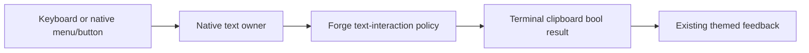

# Phase 70.1 — Text-interaction foundation

**Status: candidate foundation design recorded; reviews pending; no design/plan approval; manual live acceptance after implementation.**
**Not build-ready.** Parent: [Phase 70](phase-70-tui-text-interaction.md).

## Requirement

Make composer, file-editor, and rendered-text Copy/Paste behave consistently, using native
XenoAtom selection, commands, context menus, buttons, and clipboard transport wherever they
meet the contract. Add a copy icon to real code snippets while preserving syntax highlighting
and the established UI. Shared behaviour belongs at the TUI's text-interaction boundary;
individual controls retain editing/rendering ownership.

## Constraints for design

| Area | Required behaviour / existing public capability |
|---|---|
| Keyboard editing | Retain PromptEditor/CodeEditor selection, word/line navigation, Select All, paste events and undo. Prove Shift+arrows/Home/End and word selection without a preceding mouse click. |
| Copy vs Stop | A selection's Copy attempt consumes the gesture even if clipboard writing fails; it never cancels a turn. With no applicable selection, preserve the current chat Stop contract. `/edit` continues to isolate chat shortcuts. |
| Mouse editing | Drag, double-click and Shift-click use the native text editor. Right-click offers Copy/Paste and appropriate native editing actions; menu cancellation restores focus and selection. Define paste replacement range before opening a popup can change focus. |
| Shared ownership | One reviewed policy for choosing the current text owner, taking its payload and reporting clipboard results; composer, editor, snippet and later transcript actions use it. Do not create a second editor, OS clipboard backend, global input framework, or speculative control hierarchy. |
| Clipboard | Use `App.Terminal.Clipboard.TrySetText` / `TryGetText`, not screen scraping or shell commands. `CanSetText`/`CanGetText` are hints, not proof. Report success only after a successful operation; a failed paste leaves draft and selection unchanged. Successful empty text is distinct from a failed read. No automatic clipboard polling. |
| Code payload | Copy the Markdown render context's complete `.Code` (its LF-normalized text), without fences, line numbers, UI labels, syntax markup, image placeholders or visual wraps. Preserve indentation, blank lines and trailing newlines; current display `TrimEnd('\n')` must not trim the copy payload. |
| Code control | Use a native focusable `Button` and shared clipboard policy. Label/tooltip identifies Copy code; reserve layout space rather than cover code. Support mouse and keyboard activation, focus/hover, copied and failed states. Image-heading pseudo-fences are excluded. |
| Streaming | Define whether an activation copies current displayed content or an invocation snapshot, including menu-open updates and code-fence replacement. A stale visual must never copy a different snippet accidentally. |
| Existing rendering | Keep TextMate `Paragraph.Runs`, wrapping, TileFrame and Kitty images. FadeIn, StreamCaret and LinkPointer overlays stay non-hit-testable. Copy operates on text; decorative image cells are not content. |

These are outcome constraints, not a proposed API. Native commands currently ignore clipboard
failure, and popup focus can clear selection. Merely restoring `TextEditor.Copy` or adding
`CommandPresentation.ContextMenu` does not satisfy the complete contract. Native Cut can delete
after a failed copy: do not newly expose Cut without defining safe failure behaviour. A broader
clipboard/editor rewrite is outside the requested slice.

## Public integration gaps — confirmed at the pinned baseline

| Boundary | Fact the design must address |
|---|---|
| App Copy interception | UI 3.10.0's sealed `TerminalApp` privately intercepts active-selection Copy before commands and `KeyDown`, discarding the clipboard bool. `TerminalAppOptions` has no interception/result callback. Replacing editor commands cannot govern every Copy result. [Pinned dispatch](https://github.com/XenoAtom/XenoAtom.Terminal.UI/blob/6f4e0cde3890d8ce2510ac0451b861863e4aeeaa/src/XenoAtom.Terminal.UI/TerminalApp.cs#L2500). |
| Editor range restoration | `SelectionStart`/`SelectionLength` are protected getters; public caret and payload access do not provide selection restoration. `CodeEditor` is sealed, so a composer subclass cannot solve the same menu-range contract for `/edit`. [Editor base](https://github.com/XenoAtom/XenoAtom.Terminal.UI/blob/6f4e0cde3890d8ce2510ac0451b861863e4aeeaa/src/XenoAtom.Terminal.UI/Controls/TextEditorBase.cs#L339), [CodeEditor](https://github.com/XenoAtom/XenoAtom.Terminal.UI/blob/6f4e0cde3890d8ce2510ac0451b861863e4aeeaa/src/XenoAtom.Terminal.UI/Controls/CodeEditor.cs#L433). |
| Clipboard transport | Terminal 2.2.0's sealed `TerminalClipboard` delegates `TrySetText`/`TryGetText` directly to its backend. Direct Forge calls receive a bool; subclassing cannot observe native library writes. [Pinned clipboard](https://github.com/XenoAtom/XenoAtom.Terminal/blob/5517cb3d8cdf0532ecc89260067064f98cde6137/src/XenoAtom.Terminal/TerminalClipboard.cs#L69). |

The current published releases still match these pins — [release check](phase-70.1-text-interaction-foundation_completed.md#current-published-capabilities).
These are source findings, not an approved extension contract or proof that every possible
adapter is infeasible. Do not substitute a snippet-only or keyboard-only implementation for
the foundation. A new public/library boundary still requires the reviewed contract and
operator decision named in the parent hub.

## Verification route

The operator-selected [manual verification exception](phase-70-tui-text-interaction.md#manual-verification-exception)
supersedes live reproduction as a design prerequisite. Source/controlled findings support
design; physical terminal/clipboard/Retina observations are deferred to the operator's final
installed check. The Ghostty denial remains in force; no alternate agent access is allowed.

| Manual observation after implementation | Record on laptop Retina, both themes, normal and narrower windows |
|---|---|
| Provenance | Installed artifact/version/digest; actual Ghostty version, font, cell metrics and window dimensions; normal saved login/endpoint and dedicated scratch Project. Prior metrics remain historical or synthetic. |
| Composer keyboard | Before any click, then after a click: Shift+arrows/Home/End and word selection; Ctrl/Cmd gesture used, focus, highlight, exact pasted payload and whether Copy stops an active turn. |
| Mouse and menus | App drag/double/Shift-click versus terminal-native selection; multiline Copy, Paste replacement, right-click Copy/Paste, cancellation and restored focus/selection. |
| Editor and transcript | Disposable `/edit` file's keyboard/mouse Copy/Paste and save/close; real reply's paragraph/rich-range selection and heading/code interaction, with exact pasted text. |
| Snippets and appearance | Keyboard/mouse code Copy, exact payload including indentation/blank lines/trailing newline; truthful feedback, wrapped/unwrapped/unknown-language snippets and streaming replacement. Compare menu/button/selection states against the locked reference; preserve start page, Kitty frames/headings and syntax colours. |

Controlled event/clipboard-failure tests, theme/state checks and Native AOT remain agent work.
They do not prove physical key delivery, OS clipboard or Retina rendering. Those cases remain
pending until the operator records them; the phase cannot close on automated evidence alone.

## Design questions to close before an implementation plan

| Question | Required design output |
|---|---|
| Keyboard and mouse Copy routing | Concrete owner precedence and actual public hooks, including TerminalApp's pre-command active-selection interception; no-selection Stop and failed-copy handling. Name intended gestures; Ghostty's physical Ctrl/Cmd/terminal-native delivery is checked by the operator after implementation. |
| Context-menu lifetime | Exact payload/range capture, focus restoration, cancelled-menu behaviour and document-version handling, using public APIs. `SelectionStart`/`SelectionLength` are protected, not public integration points. |
| Honest results | Concrete way all owned Copy/Paste paths observe the bool result. Decide a narrow Forge adaptation or reviewed upstream extension; define types, signatures, ownership and Native AOT implications. No invented library APIs or new private access. |
| Visual interaction | Binding revised reference for snippet icon/menu and feedback; exact placement, focus order, disappearance/reset rules, light/dark tokens and contrast pairs. |

## Candidate foundation design — not approved

The first designer proposes retaining native editors, selection, menus, buttons, TextMate
rendering and clipboard transport, with one Forge policy for target selection and truthful
clipboard feedback. This is a candidate, not an approved library contract or implementation plan.

| Concern | Candidate decision / unresolved readiness condition |
|---|---|
| Copy routing | Selected focused editor, then active rendered selection; consume the gesture even when extraction/write fails. No selection retains Stop. A proposed native app selection-copy callback would precede command dispatch and replace its currently unchecked write. No such public callback is established at UI 3.10.0. |
| Menu lifetime | Capture target, payload, native directional range and document identity/version before opening a menu. Cancellation, Copy and failed Paste restore the same target/range; changed or detached targets reject restoration. Successful nonempty Paste uses native insertion/undo. The required public range capture/restore API is proposed, not available at the pinned baseline. |
| Paste | Explicit read; failure preserves text/range, successful empty text is a no-op. Existing `ClipboardPasteHandler` can transform or suppress native insertion; its context lacks the original clipboard bool and does not restore ranges. Design revision must evaluate this reuse, name actual APIs and cover keyboard Paste as well as menu Paste. |
| Native API proposal | `SelectionCopyHandler(TerminalApp app, Visual source, ISelectionOwner selection)` on app/run options; `TextEditorBase.CaptureSelection()` and `TryRestoreSelection(TextEditorSelectionSnapshot)` with an immutable native-owned snapshot. These names describe a proposal only; constructor/data validity, delivery and lifecycle contracts are not locked. |
| Snippets | Native focusable Copy code button in a reserved header row within the existing frame; code remains below with existing styling. Copy immutable full `context.Code`, including trailing newlines. Retired visuals cannot activate another snippet's action. Exclude image-heading pseudo-fences. |
| Feedback and visuals | Existing `ForgeTheme`/`ForgeStyles` tokens; Copy code, Copied and Copy failed states. Composer/editor use existing hint/message areas. Binding before/after references, placement, reset rules, focus/menu states and both themes must be recorded and reviewed before approval. |
| Verification | Native controlled event tests for no-click selection, real Copy/Stop routing, failed reads/writes, range/menu lifetime, exact snippet payload and stale actions; full suite and Native AOT. Operator performs the installed Retina/default-path checks under the parent exception. No new live observation is claimed. |
| Ownership and security | CLI owns local interaction policy and feedback; native library owns editing/selection mechanics and clipboard transport. Hosted tiers/stores/identities N/A; explicit Paste only, no payload logging or automatic model submission. Library/package ownership remains unresolved. |

Rejected: merely restoring Copy commands (pre-command interception still discards failure),
backend decoration alone (does not restore native ranges), private reflection, input simulation,
a replacement editor, an assumed fork, and a snippet-only substitute. These rejections do not
prove that every supported Forge adaptation is infeasible.

Current official releases were checked; no newer published capability closes the gaps above.
Fresh simplicity and ownership reviews must resolve or retain all open
contracts above. If a new public/package boundary is still required, the operator must choose its
owner through the parent hub's Type-1 gate; existing Forge publication authority does not grant
upstream writes or authorize a fork. No implementation handoff occurs while this remains open.

## Files and tests to inspect

All product paths below are relative to `/Users/ameerdeen/progs/forge-mcl`.

| Responsibility | Entry paths |
|---|---|
| Composer and routing | `src/ForgeMission.Cli/Tui/ChatScreen.cs`, `ComposerEditor.cs`, `ChatTui.cs` |
| Editor | `src/ForgeMission.Cli/Tui/FileEditor.cs`, `EditFile.cs` |
| Snippets and source text | `src/ForgeMission.Cli/Tui/ForgeCodeBlockRenderer.cs`, `ForgeMarkdown.cs`, `Transcript.cs` |
| Theme/style ownership | `src/ForgeMission.Cli/Tui/ForgeTheme.cs`, `ForgeStyles.cs`, `Graphics/CodeColours.cs` |
| Existing verification | `tests/ForgeMission.Mcl.Tests/Cli/ChatScreenTileTests.cs`, `ChatScreenMotionTests.cs`, `FileEditorTests.cs`, `ChatTranscriptTests.cs`, `StartPageTests.cs` |

The nearest component README is `src/ForgeMission.Cli/README.md`; there is no Tui README.
Reconfirm dependency versions and owning repository instructions before design.

## Gates and acceptance specification

| Gate | Application |
|---|---|
| Security Architecture | Local presentation/input only; hosted tiers, stores and service identities are N/A. Clipboard reads occur only on explicit Paste; copied text is not telemetry or model input. Any package/public-contract ownership change must be resolved before handoff. |
| Engineering Philosophy | CLI TUI owns policy and feedback; native controls own editing; XenoAtom owns portable clipboard transport. Define failure containment and narrow lifetime ownership. Reject per-control patches, unneeded knobs, a replacement editor and private API expansion. |
| UI principles | Read and name [Desktop Interaction Principles](../design/desktop-interaction-principles.md) and [UI Design System](../design/ui-design-system.md) in assignments. Apply their interaction/token principles; this terminal UI does not consume ForgeUI CSS. |
| TUI reference | [Graphics design](../design/tui-graphics.md), [finish-line mockup](../design/forge_tui_finish_line_mockup.html), [plain turn](../images/phase-64-plain-turn.png), [hands turn](../images/phase-64-hands-read.png), and [operator's chat example](../images/phase-70/chat-user-reference.png). The operator example binds appearance, not proof of live Retina verification. A revised reference must lock new owned controls before build. |
| Theme map | Existing `ForgeConfig` `theme: dark|light` selects `ForgeTheme`; missing theme is dark. `ForgeStyles.Screen` maps text/surface, popup, selection, focus, controls, disabled, success and error tokens. Designer must map every new state to these named tokens or add semantic values to both theme instances; no local colour literals. |
| Viewports and states | Laptop Retina only: record real font, cell metrics, window dimensions, normal and narrowed widths. Both themes; idle/streaming composer, multiline selection, context menu open/cancel, editor selection, wrapped/unwrapped/unknown-language snippets, copy success/failure and paste failure. Start page remains visually intact. |

### Default-path facts — future product acceptance

| Fact | Required observation |
|---|---|
| Artifact | Installed Native AOT `forge` from merged code via `make install`, or the normal CLI release archive; record version, commit and digest. A JIT/in-memory harness is controlled evidence only. |
| Configuration | Normal saved sign-in and `forge.project.json`; `FORGE_API_ENDPOINT` absent, no URL/client/mission stubs. Dark default and supported light config, with any temporary theme change restored afterward. |
| Dependency route | Normal hosted ForgeAPI/Conversation Host route and existing published client dependencies; Ghostty with truecolor/Kitty support, no multiplexer. Record actual terminal version and display provenance. |
| Safe state | A dedicated scratch folder initialized through normal `forge project create`; plain Chat (no hands grant). Use synthetic non-sensitive messages and an explicitly created disposable file for `/edit`. |
| User actions | Open `forge chat`, obtain/replay a real normal-path reply with known code, select/copy/paste using keyboard and mouse, copy snippet, edit scratch file, and verify no copy attempt cancels a turn. |
| Observable result | Operator pastes into a scratch destination and compares exact expected text, themed selection and button/menu states against the reference on Retina. Supervisor records the attributed manual result. Default-path operation passes; denied/failed clipboard behaviour is additionally verified with controlled fault injection. |

## Ordered tasks

| Task | State | Done when |
|---|---|---|
| 1. Source/library/CodeAlta discovery | Done — [evidence](phase-70.1-text-interaction-foundation_completed.md#discovery-results). | Pinned source and controlled observations distinguish native capability, Forge wiring defects, and library gaps. |
| 2. Installed Retina reproduction | Agent path blocked; prerequisite superseded by the parent exception. Manual observations move to Task 6. | No live PASS claimed; recorded controlled baseline is available to the designer. Physical delivery, focus/highlight and clipboard round-trip remain manual acceptance cases. |
| 3. Product design and review | Candidate recorded; release check done, fresh simplicity/ownership reviews pending. Design/API/visual gaps remain open. | Fresh designer; simplicity and ownership reviews; supervisor records one locked design with every question above resolved and complete API/visual contracts. |
| 4. Implementation plan and review | Pending after design approval. | Fresh plan author; simplicity and ownership reviews; supervisor explicitly approves bounded changes, meaningful interaction tests and AOT checks. |
| 5. Implementation and review | Pending after plan approval. | Fresh implementer; positive/negative interaction evidence including failed clipboard writes; independent simplicity/ownership/style review; no product task marked complete by implementer. |
| 6. Merge, install, accept, close | Pending after checks pass; operator performs live acceptance. | Normal artifacts merged/published as required; operator records passing default-path/Retina observations above, supervisor assesses coverage; evidence/timing archived; changed repos clean on main. |

## Done when

Composer and `/edit` provide the agreed selection and contextual Copy/Paste behaviour without
requiring a prior click; selection-aware Copy never cancels a turn; snippet controls copy exact
code with truthful feedback; themes and graphics match the binding reference on laptop Retina;
focused interaction tests, required suite and Native AOT checks pass with zero warnings;
operator-run installed default-path acceptance passes and the supervisor records its evidence.
Continuous rich selection closes in
[70.2](phase-70.2-rich-transcript-selection.md), not through a snippet-button substitute.
