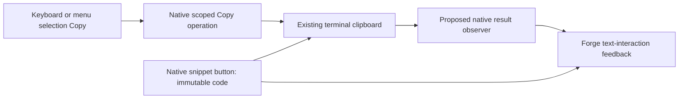
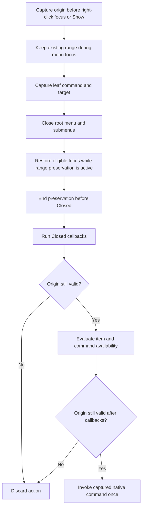
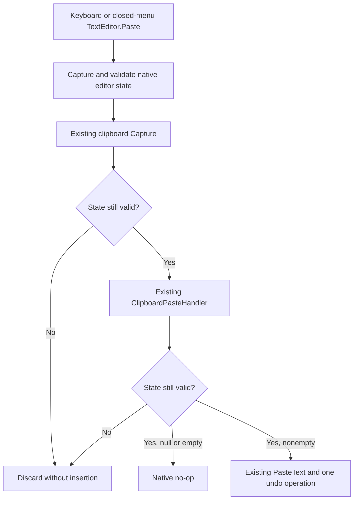

# Phase 70.1 — Text-interaction foundation

**Status: complete R6 simplicity and ownership reviews PASS; Type-1 delivery decision pending; no design/plan approval.**
**Not build-ready.** Parent: [Phase 70](phase-70-tui-text-interaction.md).

## Requirement

Make composer, file-editor, and rendered-text Copy/Paste behave consistently, using native
XenoAtom selection, commands, context menus, buttons, and clipboard transport wherever they
meet the contract. Add a copy icon to real code snippets while preserving syntax highlighting
and the established UI. Shared behaviour belongs at the TUI's text-interaction boundary;
individual controls retain editing/rendering ownership.

## Constraints for design

| Area | Required behaviour / existing public capability |
|---|---|
| Keyboard editing | Retain PromptEditor/CodeEditor selection, word/line navigation, Select All, paste events and undo. Prove Shift+arrows/Home/End and word selection without a preceding mouse click. |
| Copy vs Stop | A selection's Copy attempt consumes the gesture even if clipboard writing fails; it never cancels a turn. With no applicable selection, preserve the current chat Stop contract. `/edit` continues to isolate chat shortcuts. |
| Mouse editing | Drag, double-click and Shift-click use the native text editor. Right-click offers Copy/Paste and appropriate native editing actions; menu cancellation restores focus and selection. Define paste replacement range before opening a popup can change focus. |
| Shared ownership | One reviewed policy for choosing the current text owner, taking its payload and reporting clipboard results; composer, editor, snippet and later transcript actions use it. Do not create a second editor, OS clipboard backend, global input framework, or speculative control hierarchy. |
| Clipboard | Use `App.Terminal.Clipboard.TrySetText` / `TryGetText`, not screen scraping or shell commands. `CanSetText`/`CanGetText` are hints, not proof. Report success only after a successful operation; a failed paste leaves draft and selection unchanged. Successful empty text is distinct from a failed read. No automatic clipboard polling. |
| Code payload | Copy the Markdown render context's complete `.Code` (its LF-normalized text), without fences, line numbers, UI labels, syntax markup, image placeholders or visual wraps. Preserve indentation, blank lines and trailing newlines; current display `TrimEnd('\n')` must not trim the copy payload. |
| Code control | Use a native focusable `Button` and shared clipboard policy. Label/tooltip identifies Copy code; reserve layout space rather than cover code. Support mouse and keyboard activation, focus/hover, copied and failed states. Image-heading pseudo-fences are excluded. |
| Streaming | Define whether an activation copies current displayed content or an invocation snapshot, including menu-open updates and code-fence replacement. A stale visual must never copy a different snippet accidentally. |
| Existing rendering | Keep TextMate `Paragraph.Runs`, wrapping, TileFrame and Kitty images. FadeIn, StreamCaret and LinkPointer overlays stay non-hit-testable. Copy operates on text; decorative image cells are not content. |

These are outcome constraints, not a proposed API. Native commands currently ignore clipboard
failure, and popup focus can clear selection. Merely restoring `TextEditor.Copy` or adding
`CommandPresentation.ContextMenu` does not satisfy the complete contract. Native Cut can delete
after a failed copy: do not newly expose Cut without defining safe failure behaviour. A broader
clipboard/editor rewrite is outside the requested slice.

## Public integration gaps — confirmed at the pinned baseline

| Boundary | Fact the design must address |
|---|---|
| App Copy interception | UI 3.10.0's sealed `TerminalApp` privately intercepts active-selection Copy before commands and `KeyDown`, discarding the clipboard bool. `TerminalAppOptions` has no interception/result callback. Replacing editor commands cannot govern every Copy result. [Pinned dispatch](https://github.com/XenoAtom/XenoAtom.Terminal.UI/blob/6f4e0cde3890d8ce2510ac0451b861863e4aeeaa/src/XenoAtom.Terminal.UI/TerminalApp.cs#L2500). |
| Editor range restoration | `SelectionStart`/`SelectionLength` are protected getters; public caret and payload access do not provide selection restoration. `CodeEditor` is sealed, so a composer subclass cannot solve the same menu-range contract for `/edit`. [Editor base](https://github.com/XenoAtom/XenoAtom.Terminal.UI/blob/6f4e0cde3890d8ce2510ac0451b861863e4aeeaa/src/XenoAtom.Terminal.UI/Controls/TextEditorBase.cs#L339), [CodeEditor](https://github.com/XenoAtom/XenoAtom.Terminal.UI/blob/6f4e0cde3890d8ce2510ac0451b861863e4aeeaa/src/XenoAtom.Terminal.UI/Controls/CodeEditor.cs#L433). |
| Clipboard transport | Terminal 2.2.0's sealed `TerminalClipboard` delegates `TrySetText`/`TryGetText` directly to its backend. Direct Forge calls receive a bool; subclassing cannot observe native library writes. [Pinned clipboard](https://github.com/XenoAtom/XenoAtom.Terminal/blob/5517cb3d8cdf0532ecc89260067064f98cde6137/src/XenoAtom.Terminal/TerminalClipboard.cs#L69). |

The current published releases still match these pins — [release check](phase-70.1-text-interaction-foundation_completed.md#current-published-capabilities).
These are source findings, not an approved extension contract or proof that every possible
adapter is infeasible. Do not substitute a snippet-only or keyboard-only implementation for
the foundation. A new public/library boundary still requires the reviewed contract and
operator decision named in the parent hub.

## Verification route

The operator-selected [manual verification exception](phase-70-tui-text-interaction.md#manual-verification-exception)
supersedes live reproduction as a design prerequisite. Source/controlled findings support
design; physical terminal/clipboard/Retina observations are deferred to the operator's final
installed check. The Ghostty denial remains in force; no alternate agent access is allowed.

| Manual observation after implementation | Record on laptop Retina, both themes, normal and narrower windows |
|---|---|
| Provenance | Installed artifact/version/digest; actual Ghostty version, font, cell metrics and window dimensions; normal saved login/endpoint and dedicated scratch Project. Prior metrics remain historical or synthetic. |
| Composer keyboard | Before any click, then after a click: Shift+arrows/Home/End and word selection; Ctrl/Cmd gesture used, focus, highlight, exact pasted payload and whether Copy stops an active turn. |
| Mouse and menus | App drag/double/Shift-click versus terminal-native selection; multiline Copy, Paste replacement, right-click Copy/Paste, cancellation and restored focus/selection. |
| Editor and transcript | Disposable `/edit` file's keyboard/mouse Copy/Paste and save/close; real reply's paragraph/rich-range selection and heading/code interaction, with exact pasted text. |
| Snippets and appearance | Keyboard/mouse code Copy, exact payload including indentation/blank lines/trailing newline; truthful feedback, wrapped/unwrapped/unknown-language snippets and streaming replacement. Compare menu/button/selection states against the locked reference; preserve start page, Kitty frames/headings and syntax colours. |

Controlled event/clipboard-failure tests, theme/state checks and Native AOT remain agent work.
They do not prove physical key delivery, OS clipboard or Retina rendering. Those cases remain
pending until the operator records them; the phase cannot close on automated evidence alone.

## Design questions to close before an implementation plan

| Question | Required design output |
|---|---|
| Keyboard and mouse Copy routing | Concrete owner precedence and actual public hooks, including TerminalApp's pre-command active-selection interception; no-selection Stop and failed-copy handling. Name intended gestures; Ghostty's physical Ctrl/Cmd/terminal-native delivery is checked by the operator after implementation. |
| Context-menu lifetime | Exact payload/range capture, focus restoration, cancelled-menu behaviour and document-version handling, using public APIs. `SelectionStart`/`SelectionLength` are protected, not public integration points. |
| Honest results | Concrete way all owned Copy/Paste paths observe the bool result. Decide a narrow Forge adaptation or reviewed upstream extension; define types, signatures, ownership and Native AOT implications. No invented library APIs or new private access. |
| Visual interaction | Binding revised reference for snippet icon/menu and feedback; exact placement, focus order, disappearance/reset rules, light/dark tokens and contrast pairs. |

## Revised foundation candidate — not approved

Retain native editors, selection, commands, menus, buttons, TextMate and clipboard transport.
Recommend a bounded upstream UI change: native Copy result reporting, fixed close-before-invoke
text-menu preservation, a native Paste callback guard, public input admission and native Button
detach/visibility cleanup. Forge owns one local command/feedback policy and snippet composition.
This replaces the public handler/snapshot proposal; it is not an existing API or approved route.
First-round evidence is [archived](phase-70.1-text-interaction-foundation_completed.md#foundation-design-reviews).



### Proposed native Copy API

All signatures below are proposed for `XenoAtom.Terminal.UI`, absent at 3.10.0:

```csharp
namespace XenoAtom.Terminal.UI;

public enum SelectionCopyResult
{
    NoSelection = 0,
    Copied = 1,
    ExtractionFailed = 2,
    WriteFailed = 3,
    InvalidTarget = 4,
}

// TerminalApp
public SelectionCopyResult CopySelection(Visual source);

// TerminalAppOptions and TerminalRunOptions; run option forwarded unchanged
public Action<Visual, SelectionCopyResult>? SelectionCopyCompleted { get; init; }
```

| Boundary | Candidate contract |
|---|---|
| Call | UI-thread only (`VerifyAccess`); null source throws `ArgumentNullException`. Detached, hidden, disabled, nonselectable or out-of-scope source yields `InvalidTarget`. |
| Extraction | Valid owner's `HasSelection == false` yields `NoSelection`; `HasSelection == true` with failed/empty extraction yields `ExtractionFailed`. Extracted text is written once with native `TrySetText`; its bool determines `Copied` or `WriteFailed`. No selection is cleared. |
| Observer | Synchronous, once after each operation; receives source/result only. Cannot alter dispatch or replace transport. Callback exceptions use the UI-loop failure path and never reroute into Stop. |
| Keyboard dispatch | Selected focused `TextEditorBase` first, then active rendered selection, both restricted to the active modal scope. Choosing a `HasSelection` owner consumes every result, including extraction/write failure; never retry another owner or fall through to Stop. No selected owner continues normal command dispatch. |
| Editor Copy | Native command and raw-key fallback use the same operation. Composer replaces its removed `TextEditor.Copy`: label `Copy`, existing Ctrl+C, `CanExecute=HasSelection`, `ConsumesGestureWhenUnavailable=false`, execution via `CopySelection`. No-selection Stop and existing `/edit` chat-shortcut isolation stay intact. |
| Origin menu Copy | After close and callback validation, executes against the captured origin via `CopySelection`, never a composer or later coordinate lookup. Normal modal scope applies; no origin exemption exists. |

### Proposed native menu preservation

This is a proposed XenoAtom.Terminal.UI change, absent from the pinned package. It applies to native text-origin menus for `TextEditorBase` and `Paragraph`, including their native submenu family. Forge supplies exact editor Copy/Paste and Paragraph Copy menus. Other menus retain their current behavior.



| Private native state | Contract |
|---|---|
| Identity | Original `TerminalApp`, source `Visual`, exact `ISelectionOwner`, underlying input/modal scope, and eligible restore-focus target. Editor menus restore that editor; Paragraph menus restore the previously focused eligible visual. |
| Content | Editor document reference and `ITextDocument.Version`; Paragraph’s proposed text revision, incremented on every Text update. |
| Range | Exact editor caret, selection anchor/end and existing core `Version`; Paragraph anchor/active and existing `InteractionVersion`. Preserve direction, collapsed/absent representation and native active-owner element/interface references. |
| Lifetime | A private permanent `Invalidated` latch for this menu invocation. Source detach, content change, unrelated scope/focus transition, menu replacement, app shutdown, or an ineligible source invalidates it. Reattachment cannot revive this captured invocation. |
| Preservation | Suppress only selection clearing caused by this menu family’s opening, focus transitions and eligible focus restoration. Keep the existing fields; do not clear and reconstruct a selection. |
| Release | Closing ends preservation before `Closed`. Cancellation releases captured references. Activation retains only its bounded command/origin values until validation and invocation finish, then releases them. |

**Opening and availability**

Capture the text origin before native right-click focus changes and before a programmatic `ContextMenuService.Show` opens the popup. The native text-menu path owns this timing; beginning preservation inside Forge’s factory is too late.

Menu construction/rendering may call application availability callbacks. After each such callback, check the origin again before further use. A changed origin invalidates and dismisses the menu. While it is open, raw keyboard/global Copy retains normal modal scope and cannot copy the underlying text.

**Activation**

1. Capture the selected leaf’s exact `Command`, effective `CommandTarget`, item visibility/enabled state and origin validation values. These fixed text menus contain commands, not arbitrary menu Actions.
2. Check origin validity before executing availability callbacks. An invalid origin dismisses the menu without a clipboard operation.
3. Close the root menu and its submenus using native close machinery. Restore eligible focus while preservation remains active; end preservation before raising `Closed`.
4. Run `Closed` callbacks. Do not repair their effects or restore old fields afterward.
5. Require the same app, attached source/owner, original document/text revision, exact directional range/caret and interaction versions, active-owner bookkeeping, original input/modal scope, eligible source, and intended restored focus. Effective visibility/enabled means the source and its ancestor path, not just the source’s own flags.
6. Evaluate the captured item’s visibility/enabled predicates, `Command.IsVisibleFor`, and `Command.CanExecuteFor` against the original effective target. Revalidate after each callback. Stop immediately on false or stale state; do not repeatedly invoke predicates until they pass.
7. Invoke the captured command once, with no further application availability callback between the final validation and invocation.

A `Closed` or availability callback that edits, moves/restores a range, replaces a document, detaches/reattaches the source, opens a conflicting modal/menu or changes the target invalidates the action. A layout-only reflow remains valid.

Copy runs after the menu closes, under normal native modal-scope rules; no modal-origin exemption exists. If `Closed` opened another modal, the old action is rejected.

| Close reason/action | Result |
|---|---|
| Escape | Close restores the eligible focus and retains the original directional range/caret when no callback invalidates it. |
| Tab / outside pointer input | The close milestone retains that state; native redispatch may subsequently move focus, edit or alter the selection. Test the two milestones separately. |
| Copy | Executes after close against the validated range through the proposed Copy API. |
| Failed/empty Paste | Native Paste makes no insertion. Without callback mutations, the original range/caret remains. |
| Nonempty Paste | Native Paste replaces the range and owns the resulting caret, selection and undo entry. No menu preservation remains to restore old endpoints. |
| Stale activation | Dismiss/discard. No clipboard access, insertion or invented clipboard-failure notification. |

### Existing Paste reuse and callback ordering

Retain editor menu order **Copy**, **Paste**; Paragraph has **Copy** only. Copy requires selection, Paste requires an eligible editable origin. Use the existing `TextEditor.Paste` command with `CommandTarget=editor`. Do not add Cut, Undo, Select All, incidental ancestor commands, a second clipboard read or direct Forge document mutation.

The pinned implementation’s `TextEditorCore.PasteFromClipboard` captures clipboard data, calls `ClipboardPasteHandler`, then calls `PasteText`; it currently lacks this continuation guard. The guard is a proposed native change.



| Private native Paste state | Contract |
|---|---|
| Captured identity | Original app, editor host, input/modal scope and focused visual. |
| Captured edit state | Document reference/version, core `Version`, exact caret/selection anchor/end and native active-owner bookkeeping. |
| Detachment | A private synchronous pending-Paste invalidation latch. `TextEditorBase` detachment invalidates its core’s pending attempt, even if the same editor reattaches before a callback returns. |
| Reentrancy | One pending clipboard Paste per editor. A recursive call while pending invalidates the outer attempt and returns without another capture/insertion. The outer call clears its pending state in `finally`. This is private Paste state, not a public token or general interaction framework. |

Capture the state **before** clipboard transport or handler invocation. Validate the source’s attachment, original app/scope/focus, effective visibility/enabled and edit state at entry, immediately after clipboard capture, and immediately after the handler. After the final validation, enter the existing `PasteText`/`InsertText` path without another application callback. The guard ends at entry to the native insertion; the native document and undo operation continue to own mutation notifications and their existing failure semantics.

If clipboard capture changed the origin, skip the handler and insertion. If the handler changed it, skip insertion. Do not restore previous state over either callback’s effects.

Forge’s installed handler is **feedback-only**: inspect `context.Text`, update clipboard feedback and return `null`. It does not mutate documents, ranges, focus or the visual tree, and queues no edit. The native continuation guard still contains a violating or reentrant callback.

| Valid capture | Forge handler | Native outcome |
|---|---|---|
| `Text is null` | `Paste failed`; return `null`. | No insertion or undo entry. |
| `Text.Length == 0` | Clear previous clipboard feedback; return `null`. | Successful no-op; preserve caret/range. |
| Nonempty `Text` | Clear previous clipboard feedback; return `null`. | Existing replacement/undo exactly once. |
| Stale origin after callback | No subsequent stale-source notification. | Discard; no insertion/undo and no fabricated transport failure. |
| Bracketed Paste event | No clipboard handler/read. | Existing event-text insertion and undo. |

Retain native `TextEditorClipboardPasteContext.Capture`: failed text reads become null, successful empty text remains empty, and the backend guarantees non-null text on success. `HasText` does not distinguish these outcomes. Native format/raw-data capture remains native behavior; Forge adds no capture or read.

### Forge snippet and feedback slice

One internal TUI `TextInteraction` boundary presents commands/menus, attaches the existing Paste
handler and maps clipboard outcomes to feedback. Editors own document/range/undo; renderer owns
the snippet's immutable payload and control lifetime; XenoAtom retains portable transport.

| Concern | Candidate contract |
|---|---|
| Rendering | Heading pseudo-fences are routed first and receive no snippet button. Real fenced/indented code keeps existing Paragraph/Runs, TextMate, wrapping and TileFrame. Inside the frame: native VStack of one reserved header row, then the unchanged code body. |
| Payload | Capture complete immutable `context.Code` before display `TrimEnd`; preserve indentation, blank lines and trailing LF. Do not copy fences, labels, markup, wraps or placeholders. |
| Button | Native Button, right-aligned, one row, borderless, 15 reserved cells including one-cell side padding. Below 15 available cells it becomes the same icon-only button of `min(3, availableWidth)` cells with full tooltip. No icon library/global shortcut. Geometry belongs in named ForgeTheme constants. |
| Activation | Native left-click, Enter, Space; Tab/Shift+Tab follows visual-tree order: snippet buttons in transcript order, then composer. `/edit` keeps CodeEditor focus. |
| Snippet write | Direct native `button.App.Terminal.Clipboard.TrySetText(payload)` once; map bool through the same Forge feedback policy as native selection results. A whole snippet is not an `ISelectionOwner`; no second backend exists. |
| Labels/tooltips | Idle `⧉ Copy code` / `Copy code`; success `✓ Copied` / `Copied`; failure `! Copy failed` / `Copy failed`. Only true transport result earns success. |
| Other feedback | Selection success `Copied`; failures `Copy failed` / `Paste failed`; successful empty Paste has no success string. Existing composer progress and editor message rows prefix clipboard status plus ` · ` without replacing underlying spinner/progress/save/unsaved state. End ellipsis clips trailing progress first. |
| Reset | Subsequent clipboard action, editing its source, loss of both focus/hover, or detachment/replacement. No timer or idle animation. |


### Forge snippet lifetime

Retain the existing snippet rendering, exact immutable `context.Code` payload, native Button/header layout, labels and feedback owner. Detachment supports normal native viewport recycling:

```mermaid
stateDiagram-v2
    [*] --> AttachedIdle
    AttachedIdle --> Pressed: native left press
    Pressed --> AttachedIdle: valid release activates Copy
    AttachedIdle --> Detached: viewport recycling
    Pressed --> Detached: detach cancels press
    Detached --> AttachedIdle: same immutable visual reattaches
    Detached --> Detached: release from old press does nothing
    AttachedIdle --> Hidden: header width zero
    Pressed --> Hidden: native hiding cancels input
    Hidden --> AttachedIdle: positive width; fresh native focus/input
    Hidden --> Hidden: old release does nothing
```



| Event | Contract |
|---|---|
| Creation | Renderer captures the complete immutable `context.Code` before display trimming. New rendering gets a new payload/button and idle feedback. No transcript-index lookup or mutable payload reference. |
| Detach | Proposed native Button/app cleanup clears `IsPressed`, internal `IsPressedInside`, hover and the matching app hover-path/pointer-capture references. Forge's bounded Button subclass overrides supported `OnDetachedFromApp` only to invalidate its pending write-feedback continuation and reset feedback, then calls base for native cleanup. Do not permanently disable or retire the button. |
| Reattach | The same immutable-payload visual is eligible for fresh mouse/Enter/Space activation. It starts idle. No old pointer release may activate it. |
| Activation | Native `Click` is synchronous. Capture this button's app and begin its bounded pending-feedback attempt; require proposed `app.CanReceiveInput(button)` and a noninvalidated attempt before one native `TrySetText(payload)` call. No queued clipboard action, private access or Forge modal-tree traversal. |
| Feedback | Only true transport result earns `✓ Copied`. False earns `! Copy failed`. After transport, apply feedback only if the original app still owns the button, `CanReceiveInput(button)` is true and the attempt was not invalidated by detach; otherwise leave reset feedback. Clear pending state in `finally`. A write already accepted by the transport cannot be undone. |
| Replacement | Existing renderer replacement creates a new visual/payload. The old detached visual cannot write. No new permanent-disposal protocol is introduced. |

Pinned evidence: `DocumentFlow.RecycleActiveBlock` removes/stores the visual; `AcquireRecycledOrCreate` reuses it. `VisualDocumentFlowBlock.CreateVisual` returns its stored visual and `TryUpdate` uses reference equality. Forge’s `ChatScreen.CardItem` uses precisely this visual-backed flow. Button release raises `Click` only when `IsPressed`; cancelling that flag prevents the old press from surviving recycling. Its Enter/Space and release handlers raise Click synchronously.

**Proposed native admission and detach contract**, absent from UI 3.10.0:

```csharp
// XenoAtom.Terminal.UI.TerminalApp
public bool CanReceiveInput(Visual source);
```

| Boundary | Fixed contract |
|---|---|
| Admission | UI-thread only (`VerifyAccess`); null throws `ArgumentNullException`. True requires the source attached to this app's root, effective visibility/enabled through its ancestor path, and membership in the app's current native input/modal scope. Detached, other-app, hidden, disabled or out-of-scope sources return false. No focus, selection or clipboard capability is implied. |
| Scope ownership | Native code uses its existing input-root/scope logic. After any native tree preparation needed to resolve that root, check the current attachment, ancestor eligibility and scope before returning. This is a current-state check, not a reservation; Forge adds no callback between its final admission check and write. The query performs no clipboard operation or focus restoration and introduces no modal exemption. |
| Pointer cleanup | Native Button detachment or transition to `IsVisible=false` uses the same private cleanup: clear pointer capture when it targets the button or its content subtree, and clear the native hovered leaf/path when that path contains the button. Clear matching app references and both pressed flags before hover-change callbacks; reset native hover without leaving a cached path that suppresses the next hover update. Detachment uses the saved app; hiding uses the owning app. Hiding then showing cannot revive an old press. Unrelated pointer/hover targets remain untouched. This fixed native visibility behaviour is also proposed, absent from 3.10.0. |
| Reuse | Native cleanup leaves the detached Button idle; reattachment permits fresh native input. It never synthesizes Click or replays an old press. Forge neither writes internal hover state nor introduces a separate pointer tracker. |

The pinned [scope helpers](https://github.com/XenoAtom/XenoAtom.Terminal.UI/blob/6f4e0cde3890d8ce2510ac0451b861863e4aeeaa/src/XenoAtom.Terminal.UI/TerminalApp.cs#L3553)
are private, [hover state](https://github.com/XenoAtom/XenoAtom.Terminal.UI/blob/6f4e0cde3890d8ce2510ac0451b861863e4aeeaa/src/XenoAtom.Terminal.UI/Visual.cs#L244)
is internally set, and existing detachment does not clear it. These proposed native changes
resolve those gaps; they are not capabilities claimed for the current package.

### Candidate visual reference specification

Saved candidate state galleries (synthetic references, both independent R6 reviews PASS):

- [Light](../images/phase-70.1/foundation-light.svg)
- [Dark](../images/phase-70.1/foundation-dark.svg)

Each gallery contains separately labelled, clipped frames with local cell coordinates. Use synthetic **10×20-unit cells**, normal **100×32** and narrow **60×24** viewports. Gallery dimensions are presentation scaffolding, not product defaults or Retina observations.

Exact csharp fixture (LF text, including the final LF):
`var greeting = "hello";\nConsole.WriteLine("a sample with a long literal");\n`.

| Frame | Exact owned slice |
|---|---|
| Snippet before/after, both widths | Use the fixture and geometry: frame `(10,8,W-20,height)`; synthetic insets left/right 4, top 2, bottom 1; content width `W-28`. Before code starts `(14,10)`; after header at y=10 and unchanged code at y=11. After adds exactly one row. Button `(W-29,10,15,1)`, with one-cell side padding. Wrap code by terminal cells, retaining syntax-run boundaries. |
| Button states | Native Button renders every label bold: idle `⧉ Copy code`, copied `✓ Copied`, failed `! Copy failed`, and disabled idle label in TextMuted. Hover retains the semantic style and supports the full native tooltip; it does not introduce another weight. Focus adds underline; pressed uses Selection, retaining underline when focused. Include focused+hovered and focused+pressed combinations. Disabled styling takes precedence. |
| Icon-only fixture | Separate 12-cell content-width frame; the same three-cell button shows `⧉`, `✓` or `!` with one-cell side padding. Include focused, pressed, failure and disabled states, and exact full tooltips `Copy code`, `Copied`, `Copy failed`. Add exact available-width 0/1/2/3 frames: at 0 set the same Button's `IsVisible=false` and `IsTabStop=false`, reset/invalidate its local feedback, and retain the one-row header. Derive available width from the enclosing header's content width, never the hidden Button's own bounds. At positive widths restore visibility/Tab eligibility; widths 1–2 use zero horizontal padding, width 3 uses one cell on each side. Native focus repair handles the hidden source; do not restore old focus or add a focus mechanism. Geometry values belong in `ForgeTheme`; `ForgeStyles` supplies native padding/style mappings. |
| Editor menu before/after | `alpha beta`, backwards beta selection, caret at its left endpoint. Menu anchor `(18,12)`, clamped to the viewport. Retain native Group border and native MenuListStyle padding, each one cell; label/shortcut gap 2. With native `Ctrl+C`/`Ctrl+V` strings, editor menu is **17×6 cells**, Copy-only Paragraph menu **16×5**. Copy initially selected. |
| Menu states | Selected Copy, hovered Paste, disabled Copy with no selection, and Paragraph Copy-only. Disabled items cannot activate. |
| Paste failure | Closed menu, unchanged beta range/caret, existing feedback row at y=`H-2` beginning `Paste failed`. Include composer progress and editor unsaved/save text following ` · ` so preservation of underlying status is visible. |

Use these existing token pairs: CodeBlockText/CodeBlockFill, TextMuted/CodeBlockFill, Success/CodeBlockFill, Error/CodeBlockFill; pressed CodeBlockText/Selection; menu/tooltip Text/SurfaceAlt; selected TextStrong/Selection; hover TextStrong/SurfaceAlt; disabled TextMuted/SurfaceAlt. Menu border uses existing Border/SurfaceAlt. Retain the existing selection background and native body/editor/TextMate foregrounds.

`ForgeStyles` owns every state mapping through the existing public reactive `SetStyle<ButtonStyle>(Func<ButtonStyle>)` route. Native `ButtonStyle.Resolve` returns Disabled first, then Pressed immediately; only nonpressed states apply Focused after Hovered. The reactive Pressed slot therefore uses CodeBlockText/Selection and bold, adding underline when `HasFocus` is true. Normal/Hovered/Focused retain the idle/copied/failed semantic foreground on CodeBlockFill; Focused adds underline. Disabled remains TextMuted/CodeBlockFill without focus/press styling. Native Button stamps bold into all content cells, which the default TextBlock inherits; all gallery labels retain that existing bold weight, including idle and disabled. Hover uses the full native tooltip, not a weight transition. No decoration override, new renderer or native style-resolver change is needed.

The galleries bind only the added header/button, contextual menus, selection continuity and clipboard-feedback prefix. Existing Kitty frames, headings, syntax renderer, motion, composer/start page and theme selector remain reused. Gallery palettes must come from both current `ForgeTheme` instances; do not sample screenshots or add component-local colors.

Before approval, save and inspect the galleries. [Controlled colour evidence](../evidence/phase-70/foundation-colours.json) enumerates current tokens and exact fixture syntax foreground/Selection pairs; it is neither native state rendering nor Retina acceptance. The csharp fixture's minimum selected-syntax ratios are 4.89 (light) and 4.26 (dark); other language runs still require controlled product evidence. If a pair is unreadable, return to design for a named theme-token change; do not patch individual runs. Controlled layout checks cover all four width/height corners of `[60,100]×[24,32]` and continuous resizing. Operator-installed Ghostty/laptop Retina comparison remains the approved final observation.

### Required focused probes

| Probe | Required observation |
|---|---|
| Menu callback boundaries | `Closed`, visibility and CanExecute callbacks independently change document, directional range, attachment, focus or modal scope. Old action makes zero clipboard calls/insertion; callback effects remain untouched. |
| Menu normal path | Both selection directions and collapsed/absent ranges survive opening/cancel; Copy runs after Closed; nonempty Paste owns its resulting caret and one undo operation. |
| Redispatch | Escape final state differs from Tab/outside-input close milestone only through the native redispatched input. |
| Paste continuation | Transport and handler independently edit/move the range, replace document, detach/reattach, or open a modal. No stale insertion; recursive Paste performs no second capture and cancels outer insertion. |
| Paste outcomes | Null, empty, nonempty and bracketed input retain their specified feedback, read count and undo behavior. |
| Snippet recycling | Scroll out/in reuses the same snippet and fresh activation copies exact payload. Press → detach → reattach → release causes zero writes. New press after reattach writes once. |
| Snippet feedback | False transport cannot show Copied; detach during a synchronous write cannot resurrect old feedback. |
| Snippet admission/lifecycle | Attached eligible Button admits fresh activation; underlay behind a modal, detached/other-app/hidden/disabled source rejects without writes. Hover/press → detach → reattach starts idle with no stale capture; the next fresh pointer move establishes hover. |
| Native style/layout | Actual public Button rendering at available widths 0/1/2/3 shows the specified no-hit/glyph/padding result. All labels retain native bold; focused+pressed retains Selection and underline; focused+hovered/copied/failed retains semantic colours. Hover exposes the full native tooltip. Both themes. |
| Zero-width transitions | Focused Button → header width0 → Enter/Space makes zero snippet writes; header still occupies one row. Press → width0 → positive width → old release also makes zero writes. After widening, fresh native focus/press activates once with the exact original payload. Visibility follows header width, so it can recover from zero bounds. |
| Package/AOT | Actual public package exposes Copy and `CanReceiveInput`, accepted menu/Paste behavior and native Button detach/visibility cleanup; public-only probes and Native AOT pass with zero warnings. |

Security: local presentation/input only; hosted tiers, stores, identities and credentials are N/A. Explicit user actions alone read/write clipboard; payloads are neither logged nor submitted. The approved manual verification exception remains bounded as recorded in the parent phase.

### Owners, reuse and failure boundaries

| Behaviour | One owner / authority |
|---|---|
| Input admission, native selection Copy, menu focus/command lifetime, Paste/undo and pointer cleanup | XenoAtom.Terminal.UI; [pinned README](https://github.com/XenoAtom/XenoAtom.Terminal.UI/blob/6f4e0cde3890d8ce2510ac0451b861863e4aeeaa/readme.md#features) assigns controls, input, commands and layout. |
| Clipboard transport | Existing XenoAtom.Terminal backend; no Forge OS clipboard implementation. |
| Forge command set and local feedback | forge-mcl CLI TUI `TextInteraction`; [CLI owns chat presentation](https://github.com/katasec/forge-mcl/blob/2022b512dd2bd108626124f22bc1cfe7652648d7/src/ForgeMission.Cli/README.md#owns). |
| Immutable whole-code payload and visual reuse | Existing ForgeCodeBlockRenderer and native flow; same [component inventory](https://github.com/katasec/forge-mcl/blob/2022b512dd2bd108626124f22bc1cfe7652648d7/src/ForgeMission.Cli/README.md#terminal-ui--tui). |
| State styles and constrained geometry | Existing ForgeStyles/ForgeTheme, respectively; same inventory. No second palette or renderer. |

| Need | Existing thing checked / decision |
|---|---|
| Native extraction/result | `ISelectionOwner`, editor commands and clipboard bool reused; the sealed app's early dispatch requires the proposed Copy helper/observer. |
| Origin continuity | Existing native range/document/interaction versions and Popup.Close reused privately; no public snapshots or generic lifetime framework. |
| Paste outcomes/edit | Existing Capture, nullable Text, handler, PasteText and undo reused; private native continuation guard contains callback changes. |
| Snippet eligibility/reset | Private native scope and app pointer tracking are the actual owners; proposed public admission and fixed native cleanup replace inaccessible Forge checks. |
| State/layout | Public reactive ButtonStyle slots and native measure/arrange reused; zero padding below three cells, no custom rendering. |
| Duplicate search | Complete R3 ownership review searched the eight README-listed Forge repos and found no equivalent text-interaction owner. [Review record](phase-70.1-text-interaction-foundation_completed.md#reused-role-reviews-and-r4-correction). |

| Expected failure | Owner / containment | Visible result / recovery | Required observation |
|---|---|---|---|
| Selection extraction or clipboard write fails | Native Copy consumes selected gesture; Forge feedback observes result. | Copy failed; range/turn retained; user retries explicit Copy. | Failure result, zero Stop calls, unchanged range. |
| Clipboard read fails or yields empty | Native Capture distinguishes null/empty; editor owns no-op. | Paste failed for null, no failure for empty; user retries explicit Paste. | No edit/undo entry; original range/caret retained. |
| Callback changes origin or nested Paste recurs | Native menu/Paste invalidation, no stale operation/restoration. | Dismiss/discard; callback effects stand; user reopens/retries from current state. | Zero stale clipboard/insertion calls; recursion adds no second capture. |
| Detached or modal-blocked snippet activates | Native admission/cleanup; Forge pending-feedback invalidation. | No stale write or resurrected feedback; fresh eligible activation can retry. | Old release has zero writes; fresh reattached press writes once. |
| Native transport returns false for snippet | Existing transport bool and Forge feedback. | Copy failed; payload/source retained; explicit retry only. | False never shows Copied. |
| Application result observer/handler throws | Existing UI-loop callback failure path; no retry/fallthrough. | UI-loop failure outcome; operator relaunches after diagnosis. | Exception reaches that existing failure path, with no Stop fallback or second write. |

Designer principles that changed R4–R6: **3 — No NIH** uses reactive native style slots, native bold labels and native visibility/focus repair;
**4 — One owner** moves input admission and pointer cleanup to native UI;
**10 — Built-in safety** cancels detached input and stale feedback structurally;
**11 — Verified means done** adds exact width/focus observations without claiming native PASS.
Rejected: Forge modal traversal/internal hover assignment (wrong owner/private access),
custom Button rendering (existing slots suffice), permanent retirement (breaks recycling),
and one-cell padding at widths 1–2 (hides the glyph). Both complete R6 reviews passed;
Type-1 route/public package remain the open questions below.

### Recommended upstream route — operator decision pending

| Fact | Concrete proposal |
|---|---|
| Owner/source | `XenoAtom/XenoAtom.Terminal.UI`: Copy helper/result observer, scoped consumption/precedence, fixed close-before-invoke text-menu preservation, native Paste continuation guard, `CanReceiveInput` admission and Button/app detach/visibility cleanup. Current source pin `6f4e0cde3890d8ce2510ac0451b861863e4aeeaa`. |
| Packages | Current UI/Markdown/CodeEditor.TextMateSharp family 3.10.0; consume an actual compatible public release containing the accepted contract. No guessed version or implied publication. |
| Transport | XenoAtom.Terminal 2.2.0, pin `5517cb3d8cdf0532ecc89260067064f98cde6137`; no change. |
| Consumer | forge-mcl CLI/test package pins updated together; no sibling project references, vendoring, fallback dispatch or dual-version path. |
| Authority / delivery | Operator must choose the Type-1 route; upstream agreement and an actual public package are required before Forge implementation handoff. Forge publication permission grants no upstream writes/messages or maintained fork. |
| Reversal | Reject/revise this candidate without product changes; if selected, consume the reviewed public package once. No temporary bridge is introduced; unrelated existing XenoCells exception is neither expanded nor removed. |

Security: local presentation only, hosted tiers/stores/service identities/credentials N/A; reads
only on explicit Paste; no payload logging or automatic submission. Native library owns mechanics
and transport, Forge owns local policy/feedback. Manual-verification Type-2 exception remains.

### Open gates and verification

| Gate | Required next result |
|---|---|
| Independent review | Closed for R6 — complete simplicity (all 11 checks) and ownership (all 6 checks) PASS, sequentially through the assigned roles; no inherited verdict. [Evidence](phase-70.1-text-interaction-foundation_completed.md#r6-complete-review-and-supervisor-assessment). |
| Visual binding | Both current synthetic galleries rendered/inspected by supervisor and each reviewer; accepted as the R6 proposal reference. Native runtime states and all language/viewport cases remain product-verification requirements. |
| Type-1 delivery | Operator chooses the concrete native owner/package route after reviewed contract; no upstream authority or release is assumed. |
| Package proof | Actual public API/native menu/Paste route and public-only behaviour/AOT probes with zero warnings before Forge plan approval. |
| Product acceptance | After approved implementation/reviews/checks and normal merge/install, operator performs installed defaults/Ghostty/Retina checks above. No live PASS yet. |

No implementation plan is approved. Continuous rich selection remains in the dependent spoke;
neither this native proposal nor snippet controls close that requirement.

## Files and tests to inspect

All product paths below are relative to `/Users/ameerdeen/progs/forge-mcl`.

| Responsibility | Entry paths |
|---|---|
| Composer and routing | `src/ForgeMission.Cli/Tui/ChatScreen.cs`, `ComposerEditor.cs`, `ChatTui.cs` |
| Editor | `src/ForgeMission.Cli/Tui/FileEditor.cs`, `EditFile.cs` |
| Snippets and source text | `src/ForgeMission.Cli/Tui/ForgeCodeBlockRenderer.cs`, `ForgeMarkdown.cs`, `Transcript.cs` |
| Theme/style ownership | `src/ForgeMission.Cli/Tui/ForgeTheme.cs`, `ForgeStyles.cs`, `Graphics/CodeColours.cs` |
| Existing verification | `tests/ForgeMission.Mcl.Tests/Cli/ChatScreenTileTests.cs`, `ChatScreenMotionTests.cs`, `FileEditorTests.cs`, `ChatTranscriptTests.cs`, `StartPageTests.cs` |

The nearest component README is `src/ForgeMission.Cli/README.md`; there is no Tui README.
Reconfirm dependency versions and owning repository instructions before design.

## Gates and acceptance specification

| Gate | Application |
|---|---|
| Security Architecture | Local presentation/input only; hosted tiers, stores and service identities are N/A. Clipboard reads occur only on explicit Paste; copied text is not telemetry or model input. Any package/public-contract ownership change must be resolved before handoff. |
| Engineering Philosophy | CLI TUI owns policy and feedback; native controls own editing; XenoAtom owns portable clipboard transport. Define failure containment and narrow lifetime ownership. Reject per-control patches, unneeded knobs, a replacement editor and private API expansion. |
| UI principles | Read and name [Desktop Interaction Principles](../design/desktop-interaction-principles.md) and [UI Design System](../design/ui-design-system.md) in assignments. Apply their interaction/token principles; this terminal UI does not consume ForgeUI CSS. |
| TUI reference | [Graphics design](../design/tui-graphics.md), [finish-line mockup](../design/forge_tui_finish_line_mockup.html), [plain turn](../images/phase-64-plain-turn.png), [hands turn](../images/phase-64-hands-read.png), and [operator's chat example](../images/phase-70/chat-user-reference.png). The operator example binds appearance, not proof of live Retina verification. A revised reference must lock new owned controls before build. |
| Theme map | Existing `ForgeConfig` `theme: dark|light` selects `ForgeTheme`; missing theme is dark. `ForgeStyles.Screen` maps text/surface, popup, selection, focus, controls, disabled, success and error tokens. Designer must map every new state to these named tokens or add semantic values to both theme instances; no local colour literals. |
| Viewports and states | Laptop Retina only: record real font, cell metrics, window dimensions, normal and narrowed widths. Both themes; idle/streaming composer, multiline selection, context menu open/cancel, editor selection, wrapped/unwrapped/unknown-language snippets, copy success/failure and paste failure. Start page remains visually intact. |

### Default-path facts — future product acceptance

| Fact | Required observation |
|---|---|
| Artifact | Installed Native AOT `forge` from merged code via `make install`, or the normal CLI release archive; record version, commit and digest. A JIT/in-memory harness is controlled evidence only. |
| Configuration | Normal saved sign-in and `forge.project.json`; `FORGE_API_ENDPOINT` absent, no URL/client/mission stubs. Dark default and supported light config, with any temporary theme change restored afterward. |
| Dependency route | Normal hosted ForgeAPI/Conversation Host route and existing published client dependencies; Ghostty with truecolor/Kitty support, no multiplexer. Record actual terminal version and display provenance. |
| Safe state | A dedicated scratch folder initialized through normal `forge project create`; plain Chat (no hands grant). Use synthetic non-sensitive messages and an explicitly created disposable file for `/edit`. |
| User actions | Open `forge chat`, obtain/replay a real normal-path reply with known code, select/copy/paste using keyboard and mouse, copy snippet, edit scratch file, and verify no copy attempt cancels a turn. |
| Observable result | Operator pastes into a scratch destination and compares exact expected text, themed selection and button/menu states against the reference on Retina. Supervisor records the attributed manual result. Default-path operation passes; denied/failed clipboard behaviour is additionally verified with controlled fault injection. |

## Ordered tasks

| Task | State | Done when |
|---|---|---|
| 1. Source/library/CodeAlta discovery | Done — [evidence](phase-70.1-text-interaction-foundation_completed.md#discovery-results). | Pinned source and controlled observations distinguish native capability, Forge wiring defects, and library gaps. |
| 2. Installed Retina reproduction | Agent path blocked; prerequisite superseded by the parent exception. Manual observations move to Task 6. | No live PASS claimed; recorded controlled baseline is available to the supervisor applying the designer persona. Physical delivery, focus/highlight and clipboard round-trip remain manual acceptance cases. |
| 3. Product design and review | Both complete R6 reviews PASS; Type-1 delivery route remains open. No design approval. | Supervisor applies designer persona; operator selects native delivery route before supervisor locks the design. Actual package and public-only/AOT proof precede Forge plan approval. |
| 4. Implementation plan and review | Pending after design approval. | Assigned implementer plans; assigned simplicity and ownership agents review sequentially; supervisor explicitly approves bounded changes, meaningful interaction tests and AOT checks. |
| 5. Implementation and review | Pending after plan approval. | Same implementer after explicit plan approval; positive/negative interaction evidence including failed clipboard writes; independent sequential simplicity/style and ownership reviews with every checklist; no product task marked complete by implementer. |
| 6. Merge, install, accept, close | Pending after checks pass; operator performs live acceptance. | Normal artifacts merged/published as required; operator records passing default-path/Retina observations above, supervisor assesses coverage; evidence/timing archived; changed repos clean on main. |

## Done when

Composer and `/edit` provide the agreed selection and contextual Copy/Paste behaviour without
requiring a prior click; selection-aware Copy never cancels a turn; snippet controls copy exact
code with truthful feedback; themes and graphics match the binding reference on laptop Retina;
focused interaction tests, required suite and Native AOT checks pass with zero warnings;
operator-run installed default-path acceptance passes and the supervisor records its evidence.
Continuous rich selection closes in
[70.2](phase-70.2-rich-transcript-selection.md), not through a snippet-button substitute.
