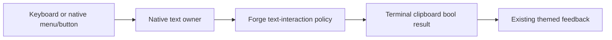
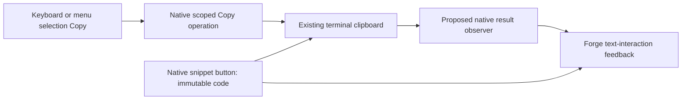
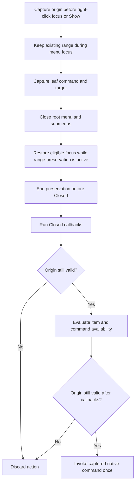
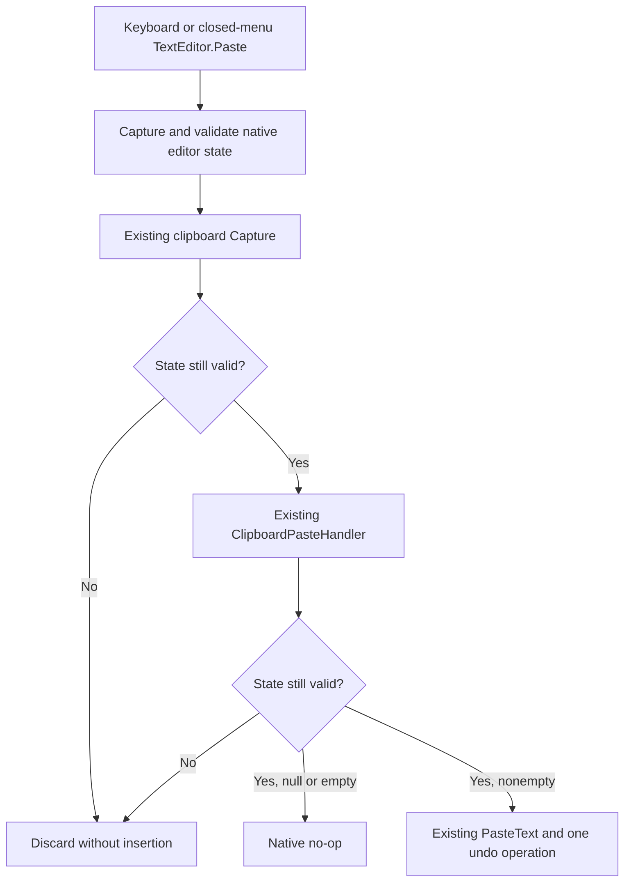

# Phase 70.1 — Completed discovery evidence

**2026-10-05. Source and controlled investigation only.** This record does not mark
[70.1](phase-70.1-text-interaction-foundation.md) or [Phase 70](phase-70-tui-text-interaction.md)
complete. Product design, implementation, installed default-path and Retina visual acceptance
remain pending. No product code, package publication, ACL, account or hosted chat was changed.

## Provenance

| Item | Observed baseline |
|---|---|
| Forge source | `katasec/forge-mcl` main `2022b512dd2bd108626124f22bc1cfe7652648d7`; owning [CLI README](https://github.com/katasec/forge-mcl/blob/2022b512dd2bd108626124f22bc1cfe7652648d7/src/ForgeMission.Cli/README.md). |
| UI packages | `XenoAtom.Terminal.UI`, `.Extensions.Markdown`, `.Extensions.CodeEditor.TextMateSharp` 3.10.0; UI NuGet repository commit `6f4e0cde3890d8ce2510ac0451b861863e4aeeaa`. |
| Terminal package | `XenoAtom.Terminal` 2.2.0; NuGet repository commit `5517cb3d8cdf0532ecc89260067064f98cde6137`. |
| CodeAlta reference | `/Users/ameerdeen/progs/CodeAlta`, commit `823f847297aafb0662ee317c3434c96a755e32fa`, UI 3.9.0. Read-only reference, not a newer-version capability claim. |
| Installed CLI metadata | `/Users/ameerdeen/.local/bin/forge`, version `1.0.0+4d232d66bf3aef83e5d249b178b17fe95b0f67b5`; SHA256 `575E18D960136EA788D45F7C8D737B11384D57C83ACFF95ECC7E770B6A5AE1C1`. `git diff 4d232d66bf3aef83e5d249b178b17fe95b0f67b5 HEAD -- src/ForgeMission.Cli/Tui` was empty. This is source parity, not execution acceptance. |
| Controlled CLI assembly | Existing `src/ForgeMission.Cli/bin/Debug/net10.0/forge.dll`; SHA256 `1B38A2F5ED3DEB77B96AD6C946F0CD4A56B93809D8AE9C8A32F134C4906EB62D`, 681984 bytes, built 2026-10-04 22:33:51 UTC. Loaded into a disposable JIT probe. |
| User reference | [Chat example](../images/phase-70/chat-user-reference.png), copied unchanged from the operator attachment (1014×601). An appearance reference, not a fresh running-TUI capture. |

## Discovery results

| Surface / capability | Evidence | Consequence |
|---|---|---|
| Start, chat, edit | CLI README and `Tui/StartPage.cs`, `ChatScreen.cs`, `FileEditor.cs`. Start offers Chat with a mission; Create is a placeholder. `/edit` uses CodeEditor, TextDocument and TextMate with Ctrl+S/Esc. | Preserve native editing; start/create work is outside this phase. |
| Native keyboard selection | UI `Controls/TextEditorBase.cs` and `TextEditorCore.cs`; PromptEditor/CodeEditor share selection/navigation. Controlled Shift+Left selects `beta`. | The library already provides the main editor mechanics. Physical terminal delivery/highlight still needs live reproduction. |
| Forge Copy removal | [ChatScreen](https://github.com/katasec/forge-mcl/blob/2022b512dd2bd108626124f22bc1cfe7652648d7/src/ForgeMission.Cli/Tui/ChatScreen.cs#L433) removes `TextEditor.Copy` at line 445; [ChatTui](https://github.com/katasec/forge-mcl/blob/2022b512dd2bd108626124f22bc1cfe7652648d7/src/ForgeMission.Cli/Tui/ChatTui.cs#L85) has Ctrl+C Stop. | Keyboard-only Copy can reach Stop despite an editor selection. Confirmed in the controlled Forge screen. |
| Mouse-dependent routing | UI `TerminalApp.cs` calls `TryCopyActiveSelection` before command routing; active owner is assigned on left mouse-down, not programmatic/keyboard focus. | Explains why clicking first changes the controlled result. A restored command alone cannot govern all clipboard failures. |
| Context menus | Public `Visual.ContextMenuFactory`, `ContextMenuService.Show`, `CommandPresentation.ContextMenu`; editor clipboard commands have empty labels and `Presentation.None`. | Native mechanism exists, but needs deliberate presentation and selection/paste lifetime handling. Opening a popup cleared selection in the probe. |
| Public editor integration | `HasSelection`, `TryCopySelection(out string)`, `TextDocument`, `ClipboardPasteHandler`, `Visual.Commands` and `AddCommand`; command `CanExecute`, `RouteGesture`, `ConsumesGestureWhenUnavailable`. | Use public hooks. `SelectionStart`/`SelectionLength` are protected; do not plan against them as public APIs. |
| Paragraph selection | Pinned [Paragraph](https://github.com/XenoAtom/XenoAtom.Terminal.UI/blob/6f4e0cde3890d8ce2510ac0451b861863e4aeeaa/src/XenoAtom.Terminal.UI/Controls/Paragraph.cs) is sealed, implements `ISelectionOwner`, is selectable by default and copies underlying text. | Single-paragraph drag/Copy is already supported and passed controlled checks in both themes. |
| Rich selection gap | Pinned `Controls/DocumentFlow.cs`, `Controls/FlowDocument.cs`, Markdown `Controls/MarkdownControl.cs`; no document selection owner/coordinator. Two-paragraph Forge probe selected only the first. | Real library/adapter design work is needed for continuous ranges, not a blanket disable/enable toggle. |
| Overlays | Forge FadeIn, StreamCaret and LinkPointer.Probe have `IsHitTestVisible=false`. | No source evidence that these overlays block native selection. Retain the invariant. |
| Code snippets | [ForgeCodeBlockRenderer](https://github.com/katasec/forge-mcl/blob/2022b512dd2bd108626124f22bc1cfe7652648d7/src/ForgeMission.Cli/Tui/ForgeCodeBlockRenderer.cs) creates styled Paragraph runs and TileFrame. Markdown context provides `.Code`; display trims trailing LF. | A native Button can wrap/decorate the existing renderer. Copy the original context payload, not the trimmed/wrapped display. Route pseudo-fence headings before snippet decoration. |
| Clipboard outcomes | Terminal `TerminalClipboard.TrySetText`/`TryGetText` return bool; capability checks are best effort. UI editor and app pre-routed Copy discard write results; native Cut deletes after its copy call. | Do not claim success from command handling or capabilities. Failed Copy must not fall through to Stop. Newly exposed Cut needs safe failure semantics. |

Primary library source roots: [UI pinned tree](https://github.com/XenoAtom/XenoAtom.Terminal.UI/tree/6f4e0cde3890d8ce2510ac0451b861863e4aeeaa/src)
and [Terminal pinned tree](https://github.com/XenoAtom/XenoAtom.Terminal/tree/5517cb3d8cdf0532ecc89260067064f98cde6137/src).
Version/commit mappings were checked against local NuGet manifests, not inferred from current main.

## CodeAlta patterns to reuse

| Reference | Finding |
|---|---|
| [ChatPromptEditor](https://github.com/CodeAlta/CodeAlta/blob/823f847297aafb0662ee317c3434c96a755e32fa/src/CodeAlta/Views/ChatPromptEditor.cs#L54), PromptComposerView | Custom Enter/completion behaviour delegates other input to the native editor. |
| [PromptImageAttachmentStripView](https://github.com/CodeAlta/CodeAlta/blob/823f847297aafb0662ee317c3434c96a755e32fa/src/CodeAlta/Views/PromptImageAttachmentStripView.cs#L92) | Image interception leaves ordinary text Paste to the editor. |
| [ChatTimelineVisualFactory](https://github.com/CodeAlta/CodeAlta/blob/823f847297aafb0662ee317c3434c96a755e32fa/src/CodeAlta/Presentation/Timeline/ChatTimelineVisualFactory.cs#L359) | A real Button with a copy icon occupies Group.TopRightText and reads current Markdown on activation. It ignores the clipboard bool result. |
| [CodeAltaAppTests](https://github.com/CodeAlta/CodeAlta/blob/823f847297aafb0662ee317c3434c96a755e32fa/src/CodeAlta.Tests/CodeAltaAppTests.cs#L188) | Real TerminalApp/in-memory mouse-click test checks latest streaming Markdown copied. |

Reuse native composition and event-driven tests. CodeAlta's message copy is not snippet copy or
continuous document selection, and its success handling does not meet this phase's failure rule.

## Kitty and theme preservation

| Existing design | Interaction implication |
|---|---|
| Body/code are terminal text; frames, pills, spinner and supported proportional headings use Kitty Unicode placeholders. Tiles and text images are cached. | Keep the hybrid UI; select/copy logical text rather than a dump of rendered cells. |
| HeadingImage uses embedded Inter and falls back to terminal text for unsupported text. | Logical heading selection must cover both rendering paths consistently. |
| ForgeTheme owns dark/light tokens; ForgeStyles applies them to native controls and Markdown. TextMate supplies language-specific code runs. | Selection/menu/button feedback extends the current semantic theme system; no separate palette or replacement code renderer. |

See [TUI graphics design](../design/tui-graphics.md) for the rendering foundation. No graphics
rewrite is justified by these text-interaction problems.

## Controlled probes

Scratch project: `/tmp/forge-text-interaction-20261005/Probe.csproj`; UI/Markdown/TextMate 3.10.0
packages, existing Forge Debug assembly, `InMemoryTerminalBackend`, 100×32 cells. Both Forge theme
instances were exercised. Cell metrics 19×42 were **synthetic**, and image transmission was a
no-op. Reflection accessed internal Forge controls and TerminalApp test lifecycle in this JIT
investigation only; it is not proposed production integration and proves no Native AOT safety.

The probe used actual Forge ChatScreen/ComposerEditor and Paragraphs, but a synthetic root Stop
counter, not ChatTui's hosted cancellation. It used an in-memory clipboard, not the OS clipboard.
No real project, account, turn, file edit or terminal GUI was involved.

| Action | Named observation |
|---|---|
| Focus native PromptEditor; text `alpha beta`; End, Shift+Left four times, Ctrl+C | `beta` selected/copied; Stop counter 0, with or without preceding click. |
| Same action in Forge composer, no preceding click | Dark and light: `beta` selected; clipboard remains `sentinel`; Stop counter 1; editor Copy command absent. |
| Click Forge composer, then repeat selection and Copy | Dark and light: `beta` copied; Stop counter 0. |
| Native editor selection, open native menu | Selection changed from present to absent. A custom invocation snapshot of `beta` still copied on Enter. This demonstrates a public snapshot technique for Copy, not a complete approved Paste/range/focus design. |
| Drag within first Forge reply paragraph, then Ctrl+C | Dark and light: `first` selected/copied. |
| Drag from first paragraph into second, then Ctrl+C | Dark and light: only `first paragraph alpha beta` selected/copied; second paragraph unselected. |

[Raw observations](../evidence/phase-70/controlled-probes.json) preserve all 11 cases and baseline
metadata. `dotnet run --project /tmp/forge-text-interaction-20261005/Probe.csproj` exited 0 with
no warnings. Independent assertions checked every recorded case: **PASS: all 11 controlled
observations match their recorded expectations**. These are baseline defect/capability
observations, not passing tests for a fix.

### Remaining verification limits

`cua.getApp("Ghostty")` was rejected with: “Computer Use is not allowed to use the app
'com.mitchellh.ghostty' for safety reasons.” No alternate UI automation was used to bypass that
denial. Installed launch, physical Shift/Cmd/Control delivery, terminal-native selection,
clipboard contents and Retina appearance remain unverified for this discovery. Source and
in-memory evidence cannot establish why every reported mouse/keyboard action fails in the
operator's running window. The original live-before-design handoff was later superseded by
the [manual verification exception](phase-70-tui-text-interaction.md#manual-verification-exception);
none of these missing observations became PASS.

## Resumption check

**2026-10-05 — two fresh read-only investigators; no product approval.** The supervisor
re-read the hub/spokes and governing workflow, confirmed installed metadata and the source
baseline independently, and checked the pinned public APIs against primary source. No
Ghostty launch, live capture, input injection, OS clipboard operation or hosted mutation was
performed. The existing denial was respected without retry or alternate access.

| Check | Named observation |
|---|---|
| Source/artifact parity | forge-mcl remained clean `main` at `2022b512dd2bd108626124f22bc1cfe7652648d7`; installed `forge --version`, SHA256 and empty TUI diff against `4d232d66bf3aef83e5d249b178b17fe95b0f67b5` matched the provenance table above. Metadata only. |
| Dependency parity | UI/Markdown/TextMate 3.10.0 and Terminal 2.2.0 retain the recorded package source pins. Client 0.9.2 and Client.Contracts 0.2.1 are unchanged. |
| Public integration | Confirmed sealed app/editor/clipboard classes, private pre-command Copy interception that discards the write bool, no app-options interception callback, and protected read-only range getters. The [active gap table](phase-70.1-text-interaction-foundation.md#public-integration-gaps--confirmed-at-the-pinned-baseline) preserves these facts for the future design. |
| Workflow outcome | Scope gate remains open. No product designer, plan author or implementer launched; no design/plan approved. Operator live observations were requested to inform scope; no response was received during this checkpoint. Supervisor live/default acceptance remains required. |
| Delivery | Documentation-only; default-path acceptance, product tests and Native AOT checks N/A. No package or ACL change. |
| Documentation checks | Four changed Markdown files, all 39 local links/anchors and the global hub's top-level-only shape passed; `git diff --check` passed. Checkpoint skill copies match; active project memory had no `project_` files. |

`task-timing` ran separately for the two tagged investigation questions, with no product PR:

| Question | Stage | Agents | Start | End | Wall | Tokens |
|---|---|---|---|---|---|---|
| `70 live scope` | `investigate` | 1 | 10-05 20:05:05 | 10-05 20:06:57 | 1m 51s | 88,258 |
| `70 clipboard contract` | `investigate` | 1 | 10-05 20:05:17 | 10-05 20:08:30 | 3m 12s | 91,649 |

These runs overlap; do not add their wall times. Timing uses the log timestamps and the
tool's last-context-size metric, not account usage. Neither timing row implies live verification.

## Manual verification decision

**2026-10-05 — operator selected post-code manual checking.** A direct Computer Use call
for `com.mitchellh.ghostty` returned the same safety denial, despite System Settings showing
Codex Computer Use enabled under Device Control and Data Access. No access workaround or
permission change followed. The operator then stated “once code complete - i can check manually”.

Two fresh read-only investigators assessed the workflow change and existing test coverage.
The supervisor checked the existing event harnesses and package metadata independently:

| Evidence | Coverage / limit |
|---|---|
| forge-mcl `FileEditorTests.cs` `RunKeys` and `StartPageTests.cs` `Run`/`Click` | Real `TerminalApp` uses `VirtualTerminalBackend`, programmatic focus and pushed key/text/mouse events. Supports controlled routing/menu/editor tests; no physical key or OS clipboard proof. |
| Terminal 2.2.0 package XML `ITerminalBackend.TrySetClipboardText` / `TryGetClipboardText` | Public injection boundary for deterministic clipboard results. Virtual backend methods are non-virtual; no assumed subclass override or new OS backend. Production adaptation still needs product design. |
| Existing tile/transcript/motion/colour/quit tests | Cover theme/layout structure, code colours, streamed replacement, scrolling and lifecycle regression at controlled layers. New selection/menu/snippet behaviour still needs tests. |
| Manual route | Operator owns real installed Ghostty/Retina/clipboard/physical gestures; agent owns design/reviews/tests/AOT and evidence assessment. Default artifact, project, saved login and hosted route remain unchanged. No live acceptance has occurred. |

The [hub exception](phase-70-tui-text-interaction.md#manual-verification-exception) is the
current rule. Earlier requirements for supervisor-personal live reproduction/PASS are
superseded for Phase 70 only; this changes verification ownership and ordering, not product
behaviour or the evidence needed to close the phase.

Documentation verification passed: five Markdown files, all 50 local links/anchors, global
hub shape, all active spokes' manual-acceptance ownership, and `git diff --check`.
Product tests/AOT/default-path acceptance are N/A for this policy documentation change;
no product code changed. No project-status memory was created.

`task-timing` ran for both completed investigation questions, without a product PR:

| Question | Stage | Agents | Start | End | Wall | Tokens |
|---|---|---|---|---|---|---|
| `70 verification alternatives` | `investigate` | 1 | 10-05 21:04:59 | 10-05 21:06:25 | 1m 25s | 71,153 |
| `70 verification coverage` | `investigate` | 1 | 10-05 21:05:23 | 10-05 21:07:57 | 2m 33s | 93,759 |

Runs overlap; timestamps and last-context-size tokens are the timing tool's metrics. The
separately tagged foundation product designer is outside this policy checkpoint's timing.

## Current published capabilities

**2026-10-05 — read-only official release/source check.** A fresh investigator checked current
NuGet and GitHub releases; the supervisor independently read both official NuGet indices.
The latest listed releases, including prereleases, are still
[UI 3.10.0](https://api.nuget.org/v3-flatcontainer/xenoatom.terminal.ui/index.json) and
[Terminal 2.2.0](https://api.nuget.org/v3-flatcontainer/xenoatom.terminal/index.json).
Release tags resolve to the previously recorded source commits. Upgrading to a newer published
version cannot currently supply the proposed contracts.

| Source observation | Design consequence |
|---|---|
| App selection Copy still runs before commands and discards the write bool; app/run options have no result/interception callback. | Candidate Copy integration remains unresolved. Extraction failure can return to later dispatch; explicitly contain that path before approving. |
| Editor range getters remain protected; CodeEditor remains sealed. | Native public directional capture/restore remains unresolved. |
| Existing [ClipboardPasteHandler/context](https://github.com/XenoAtom/XenoAtom.Terminal.UI/blob/6f4e0cde3890d8ce2510ac0451b861863e4aeeaa/src/XenoAtom.Terminal.UI/Controls/TextEditorClipboardPasteContext.cs) can transform default pasted text, or suppress insertion with empty text; native insertion retains Paste undo ownership. | Designer must evaluate this existing hook, including keyboard/bracketed Paste, rather than assume no native Paste capability. Context maps failed reads to null but provides no original result bool or insertion-completion result. It does not close the range-restoration gap. |

No design/library-ownership decision or live observation follows from this source check.

## Foundation candidate handoff

**2026-10-05 — candidate only, not design approval.** A fresh designer returned the native
control/shared-policy proposal retained in the [superseded candidate](#superseded-first-foundation-candidate).
The supervisor retained the public-contract, keyboard Paste and visual gaps explicitly. No
library API, package ownership route, implementation plan or code was approved or changed.

A fresh simplicity-reviewer launch was rejected with `agent thread limit reached`.
No reviewer ran and no review PASS is claimed. Resume with fresh simplicity and ownership
reviewers; their findings must be combined before design approval. The current-release
investigation is separate from those reviews and does not substitute for them.

| Task | Stage | Agents | Start | End | Wall | Tokens |
|---|---|---|---|---|---|---|
| `70 1 foundation` | `design` | 1 | 10-05 21:09:44 | 10-05 21:17:12 | 7m 28s | 163,605 |
| `70 current release` | `investigate` | 1 | 10-05 21:22:15 | 10-05 21:25:32 | 3m 16s | 83,739 |

Timing is the tool's last-context-size metric, not account usage. No product PR exists and
no product completion is implied. Default-path acceptance, product tests and Native AOT are
N/A for this candidate-document checkpoint. Manual live acceptance remains pending.

Checkpoint verification passed: four Markdown files, 44 local links/anchors, the whole global
hub's top-level-only shape and `git diff --check`. No project-status memory exists. Product
repository remains unchanged; these checks approve only the documentation's accuracy/shape.

## Foundation design reviews

**2026-10-05 — fresh read-only simplicity and ownership reviews; both require revision.**
The supervisor read the owning READMEs, governing gates, Forge implementation and pinned
native sources independently. Forge product diff against `origin/main` is empty. No product
plan, implementation, publication or live acceptance was approved or performed.

### Simplicity verdict

| Check | Verdict / observation |
|---|---|
| New apps or libraries | PASS — retains native controls, rendering and transport. |
| Reuse | REVISE — existing Paste hook suffices for failed versus empty read; do not add a second read/result API. |
| Multiple code paths | REVISE — fully specify early active-selection, focused-editor, menu and snippet Copy consumption/results. |
| Legacy paths | PASS — no second editor, fallback or compatibility mode proposed. |
| Knobs | PASS — no new user setting needed. |
| Speculative abstractions | REVISE — callback/snapshot proposals lack complete shapes, validity and ordering. |
| Library choice | REVISE — Copy/range gaps are real; the extension delivery owner remains unapproved. |
| Copy-paste | PASS at design level — existing editors/code renderer retained; no implementation diff exists. |
| Redundant definitions | REVISE — reuse nullable Paste context and existing theme tokens. |
| Size versus requirement | PASS — local interaction/snippets only; rich coordinator remains in its dependent spoke. |
| Test volume | REVISE — prove production Copy/Stop routing, menu ordering, keyboard and bracketed Paste separately. |
| Visuals | REVISE — bind before/after states, icon, focus order, feedback reset and contrast pairs. |

### Ownership verdict

Owners were derived before reading the candidate from the Desktop component atlas,
forge-mcl README and CLI component README. Scoped duplicate searches used only the
README-defined Forge repositories; no existing shared text policy was found.

| Behaviour | Derived owner | Verdict |
|---|---|---|
| Target choice / Copy versus Stop | Forge CLI policy; native app dispatch supplies selection routing | Placement fits; callback/consumption incomplete. |
| Selection, navigation, replacement and undo | XenoAtom native editors | Placement fits; menu-range integration incomplete. |
| Menu focus/selection preservation | XenoAtom mechanics; Forge invocation policy | Editor-only snapshots omit rendered Paragraph selection. |
| Clipboard transport / product feedback | XenoAtom transport; Forge CLI feedback | Placement fits; native Copy results still uncontrolled. |
| Exact snippet payload / highlighting / frame | Forge CLI renderer | Placement fits; binding controls and lifetime incomplete. |
| Button/menu/feedback themes | ForgeTheme / ForgeStyles; native styled controls | Placement fits; state/token/contrast contract incomplete. |
| New public native API/package delivery | XenoAtom owner unless operator explicitly selects another route | Type-1 decision open; Forge publication authority grants neither upstream writes nor a fork. |

No examined component's purpose acquired a second unrelated job. FileEditor's document
copy for Save is not a duplicate clipboard backend. CodeAlta remains a reference.

### Combined supervisor correction

| Issue | Required correction |
|---|---|
| Paste result | Reuse `ClipboardPasteHandler` with `context.Text is null` for failure and `Text.Length == 0` for successful empty text. The ownership review's nullable-output objection is dismissed: [TerminalClipboard](https://github.com/XenoAtom/XenoAtom.Terminal/blob/5517cb3d8cdf0532ecc89260067064f98cde6137/src/XenoAtom.Terminal/TerminalClipboard.cs#L69) delegates directly to the [backend's non-null-on-success contract](https://github.com/XenoAtom/XenoAtom.Terminal/blob/5517cb3d8cdf0532ecc89260067064f98cde6137/src/XenoAtom.Terminal/Backends/ITerminalBackend.cs#L98), and [Capture](https://github.com/XenoAtom/XenoAtom.Terminal.UI/blob/6f4e0cde3890d8ce2510ac0451b861863e4aeeaa/src/XenoAtom.Terminal.UI/Controls/TextEditorClipboardPasteContext.cs#L133) maps failed reads to null. Do not use `HasText`, add a bool field or reread. Bracketed Paste stays event-text insertion with native undo. |
| Copy | Define focused-selected-editor precedence, active rendered selection, extraction/write failure consumption, no-selection Stop and `/edit` isolation. A notification alone suffices only if native routing contains failure and reports it. |
| Menus | Capture/preserve editor and rendered selection before right-click focus changes. Menu action runs before close; Popup restores focus before `Closed`. Define action scheduling, cancellation, empty/failed Paste, stale/detached rejection and modal underlay exclusion. Prefer fixed native preservation if it avoids an unnecessary public snapshot framework. |
| Visuals / streaming | Bind icon, reserved geometry, focus order, exact labels, menu actions, feedback/reset and both themes' token pairs. Retired streaming visuals must reject stale actions. |
| Delivery | Produce a concrete recommended native extension or bounded adaptation with repository/API/package owner, pins, consumer route and reversal, then obtain the operator's Type-1 decision. No assumed upstream write, fork, private-access expansion or replacement editor/backend. |

A fresh read-only designer revision received this combined correction. Its proposal and a
fresh review round must close these findings before design approval. Manual post-code
operator acceptance remains approved; no Ghostty workaround was attempted.

Default-path acceptance, product tests and Native AOT: **N/A for this documentation change**.
Future product evidence remains mandatory under the parent manual-verification exception.

## Revised candidate review

**2026-10-05 — fresh R2 designer and simplicity reviewer; ownership launch rejected.**
The designer replaced public snapshots/replacement-handler proposals with fixed native menu
preservation and a native Copy operation/result observer. Existing Paste command/context/undo,
Button, TextMate, frames and clipboard transport are retained. The recommended owner is upstream
XenoAtom UI; its Type-1 route and actual package remain unapproved/unavailable for this proposal.
The [active candidate](#superseded-r6-native-library-proposal)
contains complete proposed signatures, state tables, draft visual specifications and open gates.

The supervisor independently verified `ITextDocument.Version` is `int`, the real UI family package
identities in CLI/tests, public native menu target execution, nonsealed Button and protected virtual
Visual detach lifecycle. These observations prove current source capabilities, not the proposed API.

| R2 simplicity check | Verdict |
|---|---|
| New apps or libraries | PASS — native UI owner retains mechanisms; no new backend/editor/process. |
| Reuse | PASS — native Paste/context/insertion/undo; no result field or second read. |
| Multiple paths | REVISE — origin command's out-of-modal exemption must be explicit. |
| Legacy paths | PASS — no bridge, vendoring, fallback or dual-version consumer. |
| Knobs | PASS — fixed behavior and existing gestures. |
| Speculative abstractions | PASS — public snapshots removed; native operation/observer/private lifetime each serve a real boundary. |
| Library choice | PASS as a proposal — upstream route explicit; actual package/compatibility/AOT proof pending. |
| Copy-paste | PASS at design level — product diff empty; current editors/renderer/Button retained. |
| Redundant definitions | PASS with clarification — `NoSelection` means `HasSelection == false`; empty extraction with true means consumed `ExtractionFailed`. |
| Scope | PASS — rich selection remains the dependent spoke; no replacement transport/editor. |
| Test volume | PASS at design level — focused routing/menu/undo/payload/failure observations; no implementation tests authored. |
| Failure feedback | REVISE — stale Paste cannot promise failure notification when native CanExecute rejects before its handler. |
| Visuals / lifecycle | REVISE — separate popup-close restoration from redispatched Tab; add a below-15-cell fixture. Saved reference/contrast acceptance remains open. |

### Supervisor correction and next design gate

| Finding | Recorded draft correction / remaining gate |
|---|---|
| Origin modal scope | Only synchronous invocation of the validated origin command in the active context-menu family may copy its preserved underlay source. All other validity checks remain; no keyboard/global exemption. |
| Stale menu failure | Invalidate, disable and dismiss stale menus before operation, including availability checks; no invented failure observer or Paste read. Actual clipboard failure feedback remains. |
| Close versus input | Escape leaves restored range/focus intact. Native Tab/outside input may continue after close and alter that state; record both milestones separately. |
| Empty extraction / icon width | Clarify `HasSelection` classification; add isolated 12-cell content fixture so icon-only behavior is actually specified. |
| Own edit versus stale edit | Still open: define acceptance of a successful Paste's own document/version change separately from external/reentrant changes, retaining post-edit caret/focus. This needs design, not implementation inference. |
| Review availability | Fresh R2 ownership launch returned `agent thread limit reached`; no ownership reviewer ran. Do not label R2 fully reviewed or substitute supervisor checks. A fresh design/review round is next; no plan or Type-1 approval was requested. |
| Visual/package/defaults | SVG specifications are drafts, no new saved binding-reference or live PASS. Proposed API is absent at current pins; actual package/probes precede the consumer plan. Manual installed acceptance stays approved and pending. |

Source observations: [menu availability/execution](https://github.com/XenoAtom/XenoAtom.Terminal.UI/blob/6f4e0cde3890d8ce2510ac0451b861863e4aeeaa/src/XenoAtom.Terminal.UI/Controls/ContextMenuService.cs#L330),
[Tab redispatch](https://github.com/XenoAtom/XenoAtom.Terminal.UI/blob/6f4e0cde3890d8ce2510ac0451b861863e4aeeaa/src/XenoAtom.Terminal.UI/TerminalApp.cs#L2876),
[native Tab editing](https://github.com/XenoAtom/XenoAtom.Terminal.UI/blob/6f4e0cde3890d8ce2510ac0451b861863e4aeeaa/src/XenoAtom.Terminal.UI/Controls/TextEditorCore.cs#L909),
[Button](https://github.com/XenoAtom/XenoAtom.Terminal.UI/blob/6f4e0cde3890d8ce2510ac0451b861863e4aeeaa/src/XenoAtom.Terminal.UI/Controls/Button.cs#L15) and
[detach hook](https://github.com/XenoAtom/XenoAtom.Terminal.UI/blob/6f4e0cde3890d8ce2510ac0451b861863e4aeeaa/src/XenoAtom.Terminal.UI/Visual.cs#L779).
Current API source proof does not supply new native dispatch/preservation behavior or AOT PASS.

Default-path acceptance, product tests and Native AOT are **N/A for this documentation delivery**.
No product code, package, ACL, account, hosted data, OS clipboard or Ghostty automation changed.

Documentation checks passed: five Markdown files, all 57 local links/anchors, the whole global
hub's top-level-only shape and `git diff --check`. Checkpoint skill copies match; no `project_`
memory files exist in this project's memory directory. Product source remains unchanged.

`python3 tools/task-timing/timing.py '70 1 foundation'` ran without a product PR before the
documentation PR. It includes the earlier first designer and this continuation:

| Stage | Agents | Start | End | Wall | Tokens |
|---|---|---|---|---|---|
| `design` | 1 | 10-05 21:09:44 | 10-05 21:17:12 | 7m 28s | 163,605 |
| `review-design` | 2 | 10-05 21:33:36 | 10-05 21:39:16 | 5m 39s | 256,017 |
| `design:r2` | 1 | 10-05 21:40:57 | 10-05 21:51:17 | 10m 19s | 163,985 |
| `review-design:r2` | 1 | 10-05 21:54:59 | 10-05 21:58:36 | 3m 37s | 133,781 |

End to end: **48m 52s**, two revision rounds. Times follow the session logs; tokens are the
tool's last-context-size metric, not account usage. The rejected ownership launch has no run
and is not counted. No timing row implies design approval, code delivery or live acceptance.

## Ownership review retry and R3 correction

**2026-10-05 — fresh R2 ownership retry completed: REVISE.** The earlier launch failure
remains a historical tool result; it did not prevent the later successful fresh launch.
The exposed collaboration/deferred tools have no agent-close operation. Completion was
observed, but no numerical lifetime/concurrency quota or automatic capacity release was inferred.
A fresh `design__r3__70_1_foundation` launch then succeeded; no completed agent was reused.

| Ownership check | Verdict / source-backed correction |
|---|---|
| Copy dispatch and policy | Placement fits: XenoAtom UI owns native scoped precedence/results; Forge CLI owns Copy versus Stop and local feedback. Proposed API remains absent at the baseline. |
| Editing and menu lifecycle | Placement fits; REVISE ordering. Proposed close-before-invoke removes own-Paste mutation and origin modal exceptions. Preserve during focus restoration, end preservation, run `Closed`, then validate origin and exact caret/directional range after availability callbacks. Do not resurrect callback changes. |
| Paste callback boundary | REVISE. Native handler runs before insertion. Forge handler must be feedback-only; design a narrow native pre-insertion validity guard against reentrant source/document/range changes, retaining native insertion/undo. No generic mutation allowlist or second read. |
| Snippet lifecycle | REVISE. `DocumentFlow` removes/recycles offscreen visuals and visual-backed `FlowDocument` returns the same instance. Permanent retirement on detach would disable valid snippet buttons after scrolling. Detach blocks activation/resets feedback; same immutable-payload visual may reattach for fresh activation. Bound press/release lifetime without a speculative callback framework. |
| Transport and visuals | Placement fits: XenoAtom Terminal transport, Forge renderer payload/header, ForgeTheme/ForgeStyles tokens. Saved state references and controlled contrast observations remain pending. |
| Security / delivery | Local presentation only; explicit Paste, no logging/submission/new hosted authority. Upstream public route still requires operator decision and actual compatible package; Forge publication permission does not authorize upstream writes, messaging or forks. |

The supervisor independently reread pinned native `DocumentFlow.RecycleActiveBlock` and
`AcquireRecycledOrCreate`, `VisualDocumentFlowBlock` identity-based reuse, `Button` synchronous
key/press/release events, `ContextMenuService.InvokeOrOpen`, `Popup.Close` and
`TextEditorCore.PasteFromClipboard`; Forge `ChatScreen.CardItem` uses the visual-backed block.
These observations confirm the lifecycle findings, not the proposed fixes or runtime acceptance.

Primary sources: [DocumentFlow recycling](https://github.com/XenoAtom/XenoAtom.Terminal.UI/blob/6f4e0cde3890d8ce2510ac0451b861863e4aeeaa/src/XenoAtom.Terminal.UI/Controls/DocumentFlow.cs),
[FlowDocument visual reuse](https://github.com/XenoAtom/XenoAtom.Terminal.UI/blob/6f4e0cde3890d8ce2510ac0451b861863e4aeeaa/src/XenoAtom.Terminal.UI/Controls/FlowDocument.cs),
[Button input](https://github.com/XenoAtom/XenoAtom.Terminal.UI/blob/6f4e0cde3890d8ce2510ac0451b861863e4aeeaa/src/XenoAtom.Terminal.UI/Controls/Button.cs),
[native Paste](https://github.com/XenoAtom/XenoAtom.Terminal.UI/blob/6f4e0cde3890d8ce2510ac0451b861863e4aeeaa/src/XenoAtom.Terminal.UI/Controls/TextEditorCore.cs),
[Forge reply composition](https://github.com/katasec/forge-mcl/blob/2022b512dd2bd108626124f22bc1cfe7652648d7/src/ForgeMission.Cli/Tui/ChatScreen.cs#L358).

Design and plan remain unapproved; product code and pins are unchanged. Manual installed
Ghostty/laptop Retina acceptance stays approved and pending after implementation.

## R3 candidate and reference record

**2026-10-05 — fresh R3 designer completed; both fresh reviewer launches rejected.**
The [active candidate](#superseded-r6-native-library-proposal)
replaces R2 execute-before-close preservation, own-Paste ambiguity and permanent snippet-detach
retirement. The private state, callback ordering, outcomes and focused probes remain proposed
native contracts, absent at the pinned package. No supervisor design/plan approval is recorded.

| Change in the candidate | Design result |
|---|---|
| Text-origin menu | Close root/submenus, restore eligible focus under preservation, end preservation before `Closed`, run callbacks, validate original exact directional range/interaction/content/attachment/scope/focus, evaluate availability and revalidate after each callback, invoke captured command once. No modal-origin exemption or own-edit allowlist. |
| Paste continuation | Capture existing native editor state before transport/handler, reject changed origin before insertion, invalidate pending attempt on detach or recursive Paste. Keep existing context/null-versus-empty distinction, one capture and native insertion/undo; Forge handler is feedback-only. |
| Snippet recycling | Immutable payload per rendered visual; detach resets public `IsPressed`, hover/feedback and pending feedback continuation. The same visual can reattach for fresh activation; an old release cannot activate. No permanent disposal framework or index lookup. |
| Visual states | Two saved synthetic galleries replace dozens of draft per-state filenames. Before/after normal/narrow code, all button states/combinations, 12-cell icon-only, exact menu geometry/state set, preserved range and prefixed Paste failure. |

### Saved synthetic references and baseline colours

[Light gallery](../images/phase-70.1/foundation-light.svg) and
[dark gallery](../images/phase-70.1/foundation-dark.svg) use synthetic 10×20-unit cells,
100×32 and 60×24 local viewports, plus the isolated 12-cell snippet header. The supervisor
rendered both with the bundled SVG renderer, personally inspected the images, and corrected
clipped menu borders and spacing before saving the final references. They show proposed owned
states, not a running native implementation or Retina/default-path acceptance.

[Colour evidence](../evidence/phase-70/foundation-colours.json) records actual current
ForgeTheme tokens and `CodeColours.Runs` foregrounds for the exact csharp fixture, extracted
from the unchanged baseline assembly by a disposable JIT probe. The probe exited 0 with no
warnings after correcting an initially misnamed public Style getter to `TryGetForeground`.
Reflection was baseline discovery only, never proposed production integration or AOT proof.
The assembly digest matches the discovery baseline. Relative luminance ratios enumerate
every new state pair and the fixture's syntax colours against CodeBlockFill/Selection.

| Exact fixture theme | Minimum syntax contrast on CodeBlockFill | Minimum on Selection |
|---|---|---|
| Light | 5.76 | 4.89 |
| Dark | 6.15 | 4.26 (`#569CD6`) |

These are numerical observations without an invented pass threshold. Other language runs,
native selected-run styling, real terminal glyph/cell geometry, continuous resizing and
installed Retina appearance remain future product evidence. No OS clipboard, Ghostty,
hosted chat/account, source/package or ACL operation occurred.

### Fresh reviewer launch limitation

| Attempt / observed state | Result |
|---|---|
| `review_design__simplicity__r3__70_1_foundation` | `agent thread limit reached`; no reviewer ran. |
| `review_design__ownership__r3__70_1_foundation` | `agent thread limit reached`; no reviewer ran. |
| Actual state inventory before ownership attempt | Root running; four descendants completed: designer R2, ownership R2, simplicity R1, designer R3. Completion is not assumed to release capacity. |
| Cleanup capability | No agent-close operation exposed by collaboration tools or deferred-tool metadata. Interruption/sidebar archive was not used as a substitute. No numerical quota or lifetime-limit explanation was inferred. |

The then-required next step was **fresh R3 simplicity and ownership launches against the saved candidate and
references** when supported capacity is available. Do not continue completed agents for this
new round, manufacture review PASS, substitute supervisor inspection, or start a product plan.
The operator's Type-1 route choice and actual public package/probes remain subsequent gates;
manual post-code installed Ghostty/laptop Retina verification stays approved.

That launch-only instruction is superseded by the operator-approved reusable-role workflow
in [PR #343](https://github.com/katasec/mission-control-language/pull/343), commit `02eba760`;
see the [successful continuation](#reused-role-reviews-and-r4-correction) below. No fresh-launch
capacity recovery is inferred.

### Documentation continuation timing

`python3 tools/task-timing/timing.py '70 1 foundation'` ran without a product PR before
opening this documentation PR. The retry joins its original revision group; the row's wall
span includes the long gap between reviewers, not continuous computation.

| Stage | Agents | Start | End | Wall | Tokens |
|---|---|---|---|---|---|
| `design` | 1 | 10-05 21:09:44 | 10-05 21:17:12 | 7m 28s | 163,605 |
| `review-design` | 2 | 10-05 21:33:36 | 10-05 21:39:16 | 5m 39s | 256,017 |
| `design:r2` | 1 | 10-05 21:40:57 | 10-05 21:51:17 | 10m 19s | 163,985 |
| `review-design:r2` | 2 | 10-05 21:54:59 | 10-05 23:10:11 | 1h 15m | 288,122 |
| `design:r3` | 1 | 10-05 23:13:08 | 10-05 23:20:09 | 7m 00s | 119,981 |

End to end: **2h 10m**, three revision rounds; **991,710** is the summed last-context-size
metric, not account token usage. Rejected R3 launches produced no runs and are not counted.
Default-path acceptance, product tests and Native AOT are **N/A for this documentation change**.

Documentation verification passed: five Markdown files, all **64 local links/anchors**, the
whole global hub's top-level-only shape, both SVG XML parses, exact fixture run coverage and
`git diff --check`. Final light/dark state details were rerendered and inspected after spacing
correction. The checkpoint skill copies match; no `project_` memory files exist. Forge product
diff against `origin/main` is empty and its main is 0/0 versus origin/main.

## Reused role reviews and R4 correction

**2026-10-06 local date — both complete R3 reviews ran sequentially through existing role agents.**
The simplicity role `review_design__simplicity__70_1_foundation` resumed successfully, then the
ownership role `review_design__ownership__r2__70_1_foundation`. Each assignment carried its full
persona, all current design/reference artifacts, previous findings and current gates; neither
inherited an earlier PASS. Both returned **REVISE**, independently confirming four corrections.

| R3 simplicity check | Current verdict |
|---|---|
| New apps/libraries | PASS — native/library owners retained; extension proposed, not existing. |
| Reuse | REVISE — Forge cannot reset internal IsHovered. |
| Multiple paths | REVISE — snippet modal admission lacks a public hook. |
| Legacy paths | PASS — one public package route, no fallback/vendor/fork. |
| Knobs | PASS — fixed commands, layout, feedback and routing. |
| Speculative abstractions | PASS — private bounded guards correspond to failures. |
| Library choice | PASS — actual public package/probes/AOT remain prerequisites. |
| Copy-paste | PASS at design layer — one policy, native edit/render reuse. |
| Redundant definitions | REVISE — incorrect pressed/focused precedence. |
| Size versus requirement | PASS — local text interaction only; rich selection dependent. |
| Test volume | REVISE — name exact width0/1/2/3 and focus+press observations. |

| R3 ownership checklist | Current verdict |
|---|---|
| Required behaviours | PASS — selection, menu callbacks, Paste, transport, snippets, styles and delivery listed. |
| Blind owner derivation | PASS — atlas/component/native READMEs read first. |
| Existing/new component | PASS — no new Forge component/package. |
| Placement | REVISE — native admission/detach mechanics inaccessible or misplaced. |
| Duplicate search | PASS — source trees in all eight README-listed Forge repos searched; no equivalent implementation. |
| One job per owner | PASS — no unrelated responsibility requires splitting. |

| Combined finding / source observation | R4 supervisor correction |
|---|---|
| Native app scope methods are private at TerminalApp:3553/3555/3620. | Proposed public `CanReceiveInput(Visual)` with complete UI-thread/eligibility/scope contract; no Forge modal reconstruction. |
| IsHovered setter is internal at Visual:244; detach:786 omits hover cleanup; TerminalApp owns hovered path and capture. | Proposed fixed native Button/app detach cleanup. Forge resets/invalidate feedback only; legitimate reattachment remains. |
| ButtonStyle:100–103 returns Pressed immediately; Focused follows only Hovered. | Existing reactive Pressed slot adds focused underline itself; other semantic styles retain foreground/background/bold. |
| Button.ArrangeCore:149–157 subtracts both padding cells. | ForgeTheme geometry and ForgeStyles native padding specify zero sides at widths1–2; galleries include exact width0/1/2/3. |

Supervisor independently read the pinned native source and current owning Forge READMEs/atlas.
Both reviewers rendered/inspected the current SVGs in memory and read the controlled colour
record; these remain synthetic evidence. Neither found another blocker in close-before-invoke
or the private Paste guard. No product diff exists; no design/plan approval, upstream authority,
public release, AOT or installed/Retina PASS is implied. R4 whole-artifact reviews remain required.

### Explicit continuation boundaries

UTC assignment boundaries follow [task-timing](../../tools/task-timing/README.md), rather than
reused thread lifetime. Tokens **N/A**, not independently measured.

| Stage / role / round | Start UTC | End UTC | Wall | Evidence |
|---|---|---|---|---|
| `[review-design:simplicity:r3] 70.1 foundation` | 2026-10-05 20:57:11 | 2026-10-05 21:01:51 | 4m 40s | Complete R3 simplicity verdict above. |
| `[review-design:ownership:r3] 70.1 foundation` | 2026-10-05 21:01:51 | 2026-10-05 21:09:13 | 7m 22s | Complete R3 ownership verdict above. |
| `[design:supervisor:r4] 70.1 foundation` | 2026-10-05 21:09:13 | 2026-10-05 21:12:51 | 3m 38s | Complete R4 contract, owner/reuse/failure tables and current rendered/inspected synthetic galleries. |
| `[review-design:simplicity:r4] 70.1 foundation` | 2026-10-05 21:12:56 | 2026-10-05 21:19:01 | 6m 05s | Whole R4 verdict below. |
| `[review-design:ownership:r4] 70.1 foundation` | 2026-10-05 21:19:01 | 2026-10-05 21:20:46 | 1m 45s | Interrupted; no verdict. |
| `[design:supervisor:r5] 70.1 foundation` | 2026-10-05 21:20:46 | 2026-10-05 21:21:51 | 1m 05s | Native bold-label contract; regenerated/rendered/inspected both current galleries. |
| `[review-design:simplicity:r5] 70.1 foundation` | 2026-10-05 21:21:55 | 2026-10-05 21:25:27 | 3m 32s | Whole R5 verdict below. |
| `[design:supervisor:r6] 70.1 foundation` | 2026-10-05 21:25:27 | 2026-10-05 21:28:48 | 3m 21s | Zero-width visibility/focus/input contract and inspected current reference captions. |
| `[review-design:simplicity:r6] 70.1 foundation` | 2026-10-05 21:29:14 | 2026-10-05 21:31:39 | 2m 25s | Complete R6 simplicity verdict below. |
| `[review-design:ownership:r6] 70.1 foundation` | 2026-10-05 21:34:14 | 2026-10-05 21:38:43 | 4m 29s | Complete R6 ownership verdict below. |

### R4 rendering correction and R5 candidate

R4 simplicity checked all eleven rows: ten **PASS**, **Redundant definitions — REVISE**.
It independently rendered both current 1720×3020 galleries and traced native Button content
decoration through default TextBlock/CellBuffer. Pinned Button:219 stamps Bold into every
content cell; R4's regular-weight idle/focus/copied/failed/disabled references cannot follow
that native rendering contract. Existing admission, cleanup, close-before-invoke, Paste,
payload/recycling, package boundaries and failure probes passed this full design review.

The supervisor interrupted the already-started R4 ownership pass to correct the known rejected
reference contract first. That pass supplied **no verdict**; interruption does not release or
prove fresh-agent capacity. R5 requires both whole-artifact reviews sequentially.

R5 retains native bold labels in every state, native tooltip on hover, focused underline and
pressed Selection fill. No renderer, decoration override, native styling change or palette
value was added. Both complete SVGs were regenerated; current light/dark state crops were
rendered and inspected. Exact width0/1/2/3, pressed+focus and existing syntax/layout remain.
SVG XML, dimensions, baseline palette, exact LF fixture/run coverage and all 67 local links
passed controlled documentation validation. No native, AOT or installed visual PASS is claimed.

### R5 zero-width correction and R6 candidate

R5 simplicity checked all eleven rows: **Reuse/Test volume — REVISE**, the other nine **PASS**.
Native focus repair and key routing check visible/enabled/scope, not zero bounds or Tab eligibility.
An already-focused Button could still raise Click on Enter/Space at width0. The supervisor had
independently flagged this edge for the complete review; source confirmed it. R5 ownership was
not assigned to the rejected artifact; no verdict was inherited.

R6 sets the same Button hidden/non-Tab at header width0, resets local feedback/continuation,
keeps the reserved header row and derives width from the header so visibility can recover.
Positive width restores visibility/Tab eligibility; native focus repair remains the owner.
The same proposed private native input cleanup now also applies on hiding, preventing a
press → hide → show → old release from activating. No new public API, focus mechanism, native
renderer, pointer tracker or palette was added. Exact keyboard/mouse shrink/widen negative
observations are required. Both current galleries mark width0 hidden, were regenerated and
rendered/inspected; controlled doc/XML/palette/fixture checks passed. Both complete R6 reviews
subsequently passed, as recorded below.

### R6 complete review and supervisor assessment

**2026-10-06 local date — R6 simplicity and ownership PASS, sequentially through the same roles.**
Each assignment carried the full canonical persona, complete current candidate, both current
1720×3020 SVGs, colour evidence, earlier findings and governing gates. Neither reused an earlier
PASS. The ownership role explicitly reviewed R4–R6 changes after its interrupted R4 assignment.

| R6 simplicity check | Verdict / observation |
|---|---|
| New apps/libraries | PASS — existing native owners; proposed extension, no new Forge process/package. |
| Reuse | PASS — native visibility/focus repair, editors, menus, controls, rendering and clipboard retained. |
| Multiple paths | PASS — one Copy operation; menu invocation after close; native Paste and snippet transport boundaries explicit. |
| Legacy paths | PASS — one public-package route; no vendor/fork/private bridge/fallback. |
| Knobs | PASS — fixed command set, states, layout and reset rules. |
| Speculative abstractions | PASS — private menu/Paste guards and bounded feedback state contain named failures. |
| Library choice | PASS as a proposal — actual public release and public-only/AOT proof remain required. |
| Copy-paste | PASS at design layer — existing control/edit/render paths reused, no product diff. |
| Redundant definitions | PASS — existing nullable Paste context, palette, reactive slots and native bold labels. |
| Size versus requirement | PASS — local foundation slice; continuous rich selection remains dependent. |
| Test volume | PASS — exact routing, callback, payload, resize, detach and fresh-input observations named. |

| R6 ownership checklist | Verdict / observation |
|---|---|
| List behaviours | PASS — all native mechanics and Forge presentation behaviours enumerated. |
| Derive owners blind | PASS — atlas, owning repo/component READMEs and pinned native responsibilities read first. |
| Existing/new owner | PASS — existing owners cover every behaviour; no new Forge component/package. |
| Compare placement | PASS — native selection/input/menu/edit mechanics; Forge local presentation. |
| Duplicate search | PASS — existing source trees in the eight README-listed Forge repos searched; no equivalent implementation. |
| One job per owner | PASS — no unrelated responsibility requires splitting. |

| Behaviour | Derived owner / proposed placement | R6 verdict |
|---|---|---|
| Selection extraction and Copy result | Native UI Copy operation/observer | PASS |
| Selected Copy consumption; no-selection Stop | Native dispatch; Forge command policy | PASS |
| Directional range through menu focus | Native private preservation | PASS |
| Close before invocation; reject callback changes | Native menu/command lifecycle | PASS |
| Paste capture; stale/recursive containment | Native private editor-core guard | PASS |
| Replacement, caret and undo | Existing native insertion | PASS |
| Clipboard transport | Existing XenoAtom.Terminal backend | PASS |
| Common local feedback | Forge CLI TUI TextInteraction | PASS |
| Complete immutable snippet payload | Existing ForgeCodeBlockRenderer | PASS |
| Syntax, wrapping, headings and frames | Existing renderer/TextMate/graphics owners | PASS |
| Current input admission | Proposed native TerminalApp.CanReceiveInput | PASS |
| Detach/hide pointer, hover and press cleanup | Shared private native Button/app cleanup | PASS |
| Reset/invalidate local feedback | Forge snippet presentation | PASS |
| Reusable visual/payload | Native DocumentFlow and existing renderer | PASS |
| State mappings and geometry | Existing ForgeStyles and ForgeTheme | PASS |
| Zero-width hiding and positive-width recovery | Forge header composition; native focus/input | PASS |
| Public capability delivery | Native library owner; synchronized Forge consumer pins | PASS placement; delivery prerequisites pending |

Both reviewers rendered and inspected both current SVGs. Bold labels, focus+press, widths 0/1/2/3,
code-body layout, menus and feedback prefixes match R6; XML/palette checks found no local colours.
Actual pinned source confirms the private scope/internal hover gap, native bold/Pressed ordering,
existing Paste insertion and DocumentFlow recycling. Proposed admission/cleanup/Copy/menu/Paste
changes remain absent from the current published package.

The supervisor independently checked the source-derived corrections, complete contract/diff,
current references and evidence. **No technical design correction remains from these reviews.**
The galleries bind the proposed owned slice only. Local presentation/input security and philosophy
boundaries hold; hosted tiers/stores/service identities are N/A, clipboard actions are explicit,
and payloads are neither logged nor submitted.

**No final design/plan approval or implementation handoff:** the operator must choose the Type-1
native-owner/public-package route. Upstream submission authority/agreement, an actual compatible
public release, and public-only behaviour/AOT proof remain prerequisites. Forge package permission
does not grant upstream authority. Installed Ghostty/Retina manual acceptance is approved but
unperformed; no runtime, AOT, OS clipboard or default-path PASS follows from these design reviews.
The earlier fresh-launch limitation is superseded by successful role reuse, not proven removed.

### Reused-review documentation checkpoint

The operator was asked to approve the reviewed upstream route and submission authority; no
answer or Type-1 approval is recorded at this checkpoint. The hub's single next step is that
decision. The message requested by the operator was sent to the **Continue Phase 70** chat;
its workflow change is already merged in [PR #343](https://github.com/katasec/mission-control-language/pull/343).

| Check | Named observation |
|---|---|
| Markdown/hub | Five Phase 70/hub files, all 67 local links/anchors and the whole global hub's top-level-only shape pass. |
| Synthetic references | Both SVGs parse at 1720×3020; exact LF fixture/run coverage, baseline palette and width/focus captions pass; supervisor and both reviewers inspected renders. |
| Diff | `git diff --check` passes; only seven mission-control documentation/reference files changed. |
| Product baseline | forge-mcl remains clean main at `2022b512dd2bd108626124f22bc1cfe7652648d7`, 0 ahead/behind origin/main after fetch. No product/package/ACL change. |
| Memory/skill | Live and repository checkpoint skill SHA256 match; no `project_`-prefixed memory exists. |
| Product tests/AOT/default path | N/A for this documentation delivery. Required after approved product work; none is waived or claimed here. |

Explicit review/design assignment boundaries are in the table above. Tokens remain N/A.
Documentation endpoint is the final validation observation recorded in this delivery's PR;
there is no product PR or product completion endpoint.

## Superseded first foundation candidate

**Superseded by the revised foundation candidate, not an approved design.** The original
public handler/snapshot proposal was rejected by the first reviews. Its details are retained
only as review history.

The first designer proposes retaining native editors, selection, menus, buttons, TextMate
rendering and clipboard transport, with one Forge policy for target selection and truthful
clipboard feedback. This is a candidate, not an approved library contract or implementation plan.



| Concern | Candidate decision / unresolved readiness condition |
|---|---|
| Copy routing | Selected focused editor, then active rendered selection; consume the gesture even when extraction/write fails. No selection retains Stop. A proposed native app selection-copy callback would precede command dispatch and replace its currently unchecked write. No such public callback is established at UI 3.10.0. |
| Menu lifetime | Capture target, payload, native directional range and document identity/version before opening a menu. Cancellation, Copy and failed Paste restore the same target/range; changed or detached targets reject restoration. Successful nonempty Paste uses native insertion/undo. The required public range capture/restore API is proposed, not available at the pinned baseline. |
| Paste | Reuse `ClipboardPasteHandler`: pinned capture maps a failed read to `Text=null` and retains successful empty `Text=""`; the backend contract guarantees non-null text on success. Use `Text`, not `HasText`, and do not reread the clipboard or add a result field. Ctrl+V retains native insertion/undo; bracketed Paste inserts its delivered event text without a clipboard read. Menu range/lifetime and its actual native insertion route still require revision. |
| Native API proposal | `SelectionCopyHandler(TerminalApp app, Visual source, ISelectionOwner selection)` on app/run options; `TextEditorBase.CaptureSelection()` and `TryRestoreSelection(TextEditorSelectionSnapshot)` with an immutable native-owned snapshot. These names describe a proposal only; constructor/data validity, delivery and lifecycle contracts are not locked. |
| Snippets | Native focusable Copy code button in a reserved header row within the existing frame; code remains below with existing styling. Copy immutable full `context.Code`, including trailing newlines. Retired visuals cannot activate another snippet's action. Exclude image-heading pseudo-fences. |
| Feedback and visuals | Existing `ForgeTheme`/`ForgeStyles` tokens; Copy code, Copied and Copy failed states. Composer/editor use existing hint/message areas. Binding before/after references, placement, reset rules, focus/menu states and both themes must be recorded and reviewed before approval. |
| Verification | Native controlled event tests for no-click selection, real Copy/Stop routing, failed reads/writes, range/menu lifetime, exact snippet payload and stale actions; full suite and Native AOT. Operator performs the installed Retina/default-path checks under the parent exception. No new live observation is claimed. |
| Ownership and security | CLI owns local interaction policy and feedback; native library owns editing/selection mechanics and clipboard transport. Hosted tiers/stores/identities N/A; explicit Paste only, no payload logging or automatic model submission. Library/package ownership remains unresolved. |

Rejected: merely restoring Copy commands (pre-command interception still discards failure),
backend decoration alone (does not restore native ranges), private reflection, input simulation,
a replacement editor, an assumed fork, and a snippet-only substitute. These rejections do not
prove that every supported Forge adaptation is infeasible.

Current official releases were checked; no newer published capability closes the gaps above.
Fresh simplicity and ownership reviews both require revision; see
[review evidence](phase-70.1-text-interaction-foundation_completed.md#foundation-design-reviews).
The supervisor combined their findings for a fresh designer revision. If a new public/package boundary is still required, the operator must choose its
owner through the parent hub's Type-1 gate; existing Forge publication authority does not grant
upstream writes or authorize a fork. No implementation handoff occurs while this remains open.

## Documentation delivery and timing

Default-path acceptance: **N/A — documentation-only delivery**. Supervisor prepared the scope,
requirements, gates and evidence; product designer/plan/implementation and their persona reviews
have not run. That is the workflow's documentation-only exception, not product approval.

Documentation verification: five Markdown files, 42 local links/anchors, the whole global hub's
top-level-only shape, unchanged reference-image hash, and all 11 JSON observations passed the
supervisor's validation. `git diff --check` passed. Product tests/AOT are N/A for this document
change; baseline controlled results are recorded above. No `project_` memory files existed in
this project's memory directory at checkpoint; non-project memory was left intact.

`python3 tools/task-timing/timing.py '70 text interaction'` reported:

| Stage | Agents | Start | End | Wall | Tokens |
|---|---|---|---|---|---|
| `investigate` | 1 | 10-05 19:26:15 | 10-05 19:32:18 | 6m 03s | 111,292 |

**End to end:** 10-05 19:26:15 → 10-05 19:32:18 = 6m 03s; 111,292 subagent tokens;
0 revision rounds. No product PR: endpoint is the last tagged investigation. Earlier untagged
investigations and supervisor probes/documentation are excluded by the timing tool. Tokens are
the tool's last-context-size metric, not an account usage measurement.

## Superseded R6 native-library proposal

The operator rejected upstream changes/a maintained fork as the default route on 2026-10-06.
The [public-extension candidate](phase-70.1-text-interaction-foundation.md#public-extension-candidate--not-approved) replaces this proposal. R6 review PASS is historical and grants no R7 approval; no native API or product code was implemented.

## Revised foundation candidate — not approved

Retain native editors, selection, commands, menus, buttons, TextMate and clipboard transport.
Recommend a bounded upstream UI change: native Copy result reporting, fixed close-before-invoke
text-menu preservation, a native Paste callback guard, public input admission and native Button
detach/visibility cleanup. Forge owns one local command/feedback policy and snippet composition.
This replaces the public handler/snapshot proposal; it is not an existing API or approved route.
First-round evidence is [archived](phase-70.1-text-interaction-foundation_completed.md#foundation-design-reviews).



### Proposed native Copy API

All signatures below are proposed for `XenoAtom.Terminal.UI`, absent at 3.10.0:

```csharp
namespace XenoAtom.Terminal.UI;

public enum SelectionCopyResult
{
    NoSelection = 0,
    Copied = 1,
    ExtractionFailed = 2,
    WriteFailed = 3,
    InvalidTarget = 4,
}

// TerminalApp
public SelectionCopyResult CopySelection(Visual source);

// TerminalAppOptions and TerminalRunOptions; run option forwarded unchanged
public Action<Visual, SelectionCopyResult>? SelectionCopyCompleted { get; init; }
```

| Boundary | Candidate contract |
|---|---|
| Call | UI-thread only (`VerifyAccess`); null source throws `ArgumentNullException`. Detached, hidden, disabled, nonselectable or out-of-scope source yields `InvalidTarget`. |
| Extraction | Valid owner's `HasSelection == false` yields `NoSelection`; `HasSelection == true` with failed/empty extraction yields `ExtractionFailed`. Extracted text is written once with native `TrySetText`; its bool determines `Copied` or `WriteFailed`. No selection is cleared. |
| Observer | Synchronous, once after each operation; receives source/result only. Cannot alter dispatch or replace transport. Callback exceptions use the UI-loop failure path and never reroute into Stop. |
| Keyboard dispatch | Selected focused `TextEditorBase` first, then active rendered selection, both restricted to the active modal scope. Choosing a `HasSelection` owner consumes every result, including extraction/write failure; never retry another owner or fall through to Stop. No selected owner continues normal command dispatch. |
| Editor Copy | Native command and raw-key fallback use the same operation. Composer replaces its removed `TextEditor.Copy`: label `Copy`, existing Ctrl+C, `CanExecute=HasSelection`, `ConsumesGestureWhenUnavailable=false`, execution via `CopySelection`. No-selection Stop and existing `/edit` chat-shortcut isolation stay intact. |
| Origin menu Copy | After close and callback validation, executes against the captured origin via `CopySelection`, never a composer or later coordinate lookup. Normal modal scope applies; no origin exemption exists. |

### Proposed native menu preservation

This is a proposed XenoAtom.Terminal.UI change, absent from the pinned package. It applies to native text-origin menus for `TextEditorBase` and `Paragraph`, including their native submenu family. Forge supplies exact editor Copy/Paste and Paragraph Copy menus. Other menus retain their current behavior.



| Private native state | Contract |
|---|---|
| Identity | Original `TerminalApp`, source `Visual`, exact `ISelectionOwner`, underlying input/modal scope, and eligible restore-focus target. Editor menus restore that editor; Paragraph menus restore the previously focused eligible visual. |
| Content | Editor document reference and `ITextDocument.Version`; Paragraph’s proposed text revision, incremented on every Text update. |
| Range | Exact editor caret, selection anchor/end and existing core `Version`; Paragraph anchor/active and existing `InteractionVersion`. Preserve direction, collapsed/absent representation and native active-owner element/interface references. |
| Lifetime | A private permanent `Invalidated` latch for this menu invocation. Source detach, content change, unrelated scope/focus transition, menu replacement, app shutdown, or an ineligible source invalidates it. Reattachment cannot revive this captured invocation. |
| Preservation | Suppress only selection clearing caused by this menu family’s opening, focus transitions and eligible focus restoration. Keep the existing fields; do not clear and reconstruct a selection. |
| Release | Closing ends preservation before `Closed`. Cancellation releases captured references. Activation retains only its bounded command/origin values until validation and invocation finish, then releases them. |

**Opening and availability**

Capture the text origin before native right-click focus changes and before a programmatic `ContextMenuService.Show` opens the popup. The native text-menu path owns this timing; beginning preservation inside Forge’s factory is too late.

Menu construction/rendering may call application availability callbacks. After each such callback, check the origin again before further use. A changed origin invalidates and dismisses the menu. While it is open, raw keyboard/global Copy retains normal modal scope and cannot copy the underlying text.

**Activation**

1. Capture the selected leaf’s exact `Command`, effective `CommandTarget`, item visibility/enabled state and origin validation values. These fixed text menus contain commands, not arbitrary menu Actions.
2. Check origin validity before executing availability callbacks. An invalid origin dismisses the menu without a clipboard operation.
3. Close the root menu and its submenus using native close machinery. Restore eligible focus while preservation remains active; end preservation before raising `Closed`.
4. Run `Closed` callbacks. Do not repair their effects or restore old fields afterward.
5. Require the same app, attached source/owner, original document/text revision, exact directional range/caret and interaction versions, active-owner bookkeeping, original input/modal scope, eligible source, and intended restored focus. Effective visibility/enabled means the source and its ancestor path, not just the source’s own flags.
6. Evaluate the captured item’s visibility/enabled predicates, `Command.IsVisibleFor`, and `Command.CanExecuteFor` against the original effective target. Revalidate after each callback. Stop immediately on false or stale state; do not repeatedly invoke predicates until they pass.
7. Invoke the captured command once, with no further application availability callback between the final validation and invocation.

A `Closed` or availability callback that edits, moves/restores a range, replaces a document, detaches/reattaches the source, opens a conflicting modal/menu or changes the target invalidates the action. A layout-only reflow remains valid.

Copy runs after the menu closes, under normal native modal-scope rules; no modal-origin exemption exists. If `Closed` opened another modal, the old action is rejected.

| Close reason/action | Result |
|---|---|
| Escape | Close restores the eligible focus and retains the original directional range/caret when no callback invalidates it. |
| Tab / outside pointer input | The close milestone retains that state; native redispatch may subsequently move focus, edit or alter the selection. Test the two milestones separately. |
| Copy | Executes after close against the validated range through the proposed Copy API. |
| Failed/empty Paste | Native Paste makes no insertion. Without callback mutations, the original range/caret remains. |
| Nonempty Paste | Native Paste replaces the range and owns the resulting caret, selection and undo entry. No menu preservation remains to restore old endpoints. |
| Stale activation | Dismiss/discard. No clipboard access, insertion or invented clipboard-failure notification. |

### Existing Paste reuse and callback ordering

Retain editor menu order **Copy**, **Paste**; Paragraph has **Copy** only. Copy requires selection, Paste requires an eligible editable origin. Use the existing `TextEditor.Paste` command with `CommandTarget=editor`. Do not add Cut, Undo, Select All, incidental ancestor commands, a second clipboard read or direct Forge document mutation.

The pinned implementation’s `TextEditorCore.PasteFromClipboard` captures clipboard data, calls `ClipboardPasteHandler`, then calls `PasteText`; it currently lacks this continuation guard. The guard is a proposed native change.



| Private native Paste state | Contract |
|---|---|
| Captured identity | Original app, editor host, input/modal scope and focused visual. |
| Captured edit state | Document reference/version, core `Version`, exact caret/selection anchor/end and native active-owner bookkeeping. |
| Detachment | A private synchronous pending-Paste invalidation latch. `TextEditorBase` detachment invalidates its core’s pending attempt, even if the same editor reattaches before a callback returns. |
| Reentrancy | One pending clipboard Paste per editor. A recursive call while pending invalidates the outer attempt and returns without another capture/insertion. The outer call clears its pending state in `finally`. This is private Paste state, not a public token or general interaction framework. |

Capture the state **before** clipboard transport or handler invocation. Validate the source’s attachment, original app/scope/focus, effective visibility/enabled and edit state at entry, immediately after clipboard capture, and immediately after the handler. After the final validation, enter the existing `PasteText`/`InsertText` path without another application callback. The guard ends at entry to the native insertion; the native document and undo operation continue to own mutation notifications and their existing failure semantics.

If clipboard capture changed the origin, skip the handler and insertion. If the handler changed it, skip insertion. Do not restore previous state over either callback’s effects.

Forge’s installed handler is **feedback-only**: inspect `context.Text`, update clipboard feedback and return `null`. It does not mutate documents, ranges, focus or the visual tree, and queues no edit. The native continuation guard still contains a violating or reentrant callback.

| Valid capture | Forge handler | Native outcome |
|---|---|---|
| `Text is null` | `Paste failed`; return `null`. | No insertion or undo entry. |
| `Text.Length == 0` | Clear previous clipboard feedback; return `null`. | Successful no-op; preserve caret/range. |
| Nonempty `Text` | Clear previous clipboard feedback; return `null`. | Existing replacement/undo exactly once. |
| Stale origin after callback | No subsequent stale-source notification. | Discard; no insertion/undo and no fabricated transport failure. |
| Bracketed Paste event | No clipboard handler/read. | Existing event-text insertion and undo. |

Retain native `TextEditorClipboardPasteContext.Capture`: failed text reads become null, successful empty text remains empty, and the backend guarantees non-null text on success. `HasText` does not distinguish these outcomes. Native format/raw-data capture remains native behavior; Forge adds no capture or read.

### Forge snippet and feedback slice

One internal TUI `TextInteraction` boundary presents commands/menus, attaches the existing Paste
handler and maps clipboard outcomes to feedback. Editors own document/range/undo; renderer owns
the snippet's immutable payload and control lifetime; XenoAtom retains portable transport.

| Concern | Candidate contract |
|---|---|
| Rendering | Heading pseudo-fences are routed first and receive no snippet button. Real fenced/indented code keeps existing Paragraph/Runs, TextMate, wrapping and TileFrame. Inside the frame: native VStack of one reserved header row, then the unchanged code body. |
| Payload | Capture complete immutable `context.Code` before display `TrimEnd`; preserve indentation, blank lines and trailing LF. Do not copy fences, labels, markup, wraps or placeholders. |
| Button | Native Button, right-aligned, one row, borderless, 15 reserved cells including one-cell side padding. Below 15 available cells it becomes the same icon-only button of `min(3, availableWidth)` cells with full tooltip. No icon library/global shortcut. Geometry belongs in named ForgeTheme constants. |
| Activation | Native left-click, Enter, Space; Tab/Shift+Tab follows visual-tree order: snippet buttons in transcript order, then composer. `/edit` keeps CodeEditor focus. |
| Snippet write | Direct native `button.App.Terminal.Clipboard.TrySetText(payload)` once; map bool through the same Forge feedback policy as native selection results. A whole snippet is not an `ISelectionOwner`; no second backend exists. |
| Labels/tooltips | Idle `⧉ Copy code` / `Copy code`; success `✓ Copied` / `Copied`; failure `! Copy failed` / `Copy failed`. Only true transport result earns success. |
| Other feedback | Selection success `Copied`; failures `Copy failed` / `Paste failed`; successful empty Paste has no success string. Existing composer progress and editor message rows prefix clipboard status plus ` · ` without replacing underlying spinner/progress/save/unsaved state. End ellipsis clips trailing progress first. |
| Reset | Subsequent clipboard action, editing its source, loss of both focus/hover, or detachment/replacement. No timer or idle animation. |


### Forge snippet lifetime

Retain the existing snippet rendering, exact immutable `context.Code` payload, native Button/header layout, labels and feedback owner. Detachment supports normal native viewport recycling:

```mermaid
stateDiagram-v2
    [*] --> AttachedIdle
    AttachedIdle --> Pressed: native left press
    Pressed --> AttachedIdle: valid release activates Copy
    AttachedIdle --> Detached: viewport recycling
    Pressed --> Detached: detach cancels press
    Detached --> AttachedIdle: same immutable visual reattaches
    Detached --> Detached: release from old press does nothing
    AttachedIdle --> Hidden: header width zero
    Pressed --> Hidden: native hiding cancels input
    Hidden --> AttachedIdle: positive width; fresh native focus/input
    Hidden --> Hidden: old release does nothing
```



| Event | Contract |
|---|---|
| Creation | Renderer captures the complete immutable `context.Code` before display trimming. New rendering gets a new payload/button and idle feedback. No transcript-index lookup or mutable payload reference. |
| Detach | Proposed native Button/app cleanup clears `IsPressed`, internal `IsPressedInside`, hover and the matching app hover-path/pointer-capture references. Forge's bounded Button subclass overrides supported `OnDetachedFromApp` only to invalidate its pending write-feedback continuation and reset feedback, then calls base for native cleanup. Do not permanently disable or retire the button. |
| Reattach | The same immutable-payload visual is eligible for fresh mouse/Enter/Space activation. It starts idle. No old pointer release may activate it. |
| Activation | Native `Click` is synchronous. Capture this button's app and begin its bounded pending-feedback attempt; require proposed `app.CanReceiveInput(button)` and a noninvalidated attempt before one native `TrySetText(payload)` call. No queued clipboard action, private access or Forge modal-tree traversal. |
| Feedback | Only true transport result earns `✓ Copied`. False earns `! Copy failed`. After transport, apply feedback only if the original app still owns the button, `CanReceiveInput(button)` is true and the attempt was not invalidated by detach; otherwise leave reset feedback. Clear pending state in `finally`. A write already accepted by the transport cannot be undone. |
| Replacement | Existing renderer replacement creates a new visual/payload. The old detached visual cannot write. No new permanent-disposal protocol is introduced. |

Pinned evidence: `DocumentFlow.RecycleActiveBlock` removes/stores the visual; `AcquireRecycledOrCreate` reuses it. `VisualDocumentFlowBlock.CreateVisual` returns its stored visual and `TryUpdate` uses reference equality. Forge’s `ChatScreen.CardItem` uses precisely this visual-backed flow. Button release raises `Click` only when `IsPressed`; cancelling that flag prevents the old press from surviving recycling. Its Enter/Space and release handlers raise Click synchronously.

**Proposed native admission and detach contract**, absent from UI 3.10.0:

```csharp
// XenoAtom.Terminal.UI.TerminalApp
public bool CanReceiveInput(Visual source);
```

| Boundary | Fixed contract |
|---|---|
| Admission | UI-thread only (`VerifyAccess`); null throws `ArgumentNullException`. True requires the source attached to this app's root, effective visibility/enabled through its ancestor path, and membership in the app's current native input/modal scope. Detached, other-app, hidden, disabled or out-of-scope sources return false. No focus, selection or clipboard capability is implied. |
| Scope ownership | Native code uses its existing input-root/scope logic. After any native tree preparation needed to resolve that root, check the current attachment, ancestor eligibility and scope before returning. This is a current-state check, not a reservation; Forge adds no callback between its final admission check and write. The query performs no clipboard operation or focus restoration and introduces no modal exemption. |
| Pointer cleanup | Native Button detachment or transition to `IsVisible=false` uses the same private cleanup: clear pointer capture when it targets the button or its content subtree, and clear the native hovered leaf/path when that path contains the button. Clear matching app references and both pressed flags before hover-change callbacks; reset native hover without leaving a cached path that suppresses the next hover update. Detachment uses the saved app; hiding uses the owning app. Hiding then showing cannot revive an old press. Unrelated pointer/hover targets remain untouched. This fixed native visibility behaviour is also proposed, absent from 3.10.0. |
| Reuse | Native cleanup leaves the detached Button idle; reattachment permits fresh native input. It never synthesizes Click or replays an old press. Forge neither writes internal hover state nor introduces a separate pointer tracker. |

The pinned [scope helpers](https://github.com/XenoAtom/XenoAtom.Terminal.UI/blob/6f4e0cde3890d8ce2510ac0451b861863e4aeeaa/src/XenoAtom.Terminal.UI/TerminalApp.cs#L3553)
are private, [hover state](https://github.com/XenoAtom/XenoAtom.Terminal.UI/blob/6f4e0cde3890d8ce2510ac0451b861863e4aeeaa/src/XenoAtom.Terminal.UI/Visual.cs#L244)
is internally set, and existing detachment does not clear it. These proposed native changes
resolve those gaps; they are not capabilities claimed for the current package.

### Candidate visual reference specification

Saved candidate state galleries (synthetic references, both independent R6 reviews PASS):

- [Light](../images/phase-70.1/foundation-light.svg)
- [Dark](../images/phase-70.1/foundation-dark.svg)

Each gallery contains separately labelled, clipped frames with local cell coordinates. Use synthetic **10×20-unit cells**, normal **100×32** and narrow **60×24** viewports. Gallery dimensions are presentation scaffolding, not product defaults or Retina observations.

Exact csharp fixture (LF text, including the final LF):
`var greeting = "hello";\nConsole.WriteLine("a sample with a long literal");\n`.

| Frame | Exact owned slice |
|---|---|
| Snippet before/after, both widths | Use the fixture and geometry: frame `(10,8,W-20,height)`; synthetic insets left/right 4, top 2, bottom 1; content width `W-28`. Before code starts `(14,10)`; after header at y=10 and unchanged code at y=11. After adds exactly one row. Button `(W-29,10,15,1)`, with one-cell side padding. Wrap code by terminal cells, retaining syntax-run boundaries. |
| Button states | Native Button renders every label bold: idle `⧉ Copy code`, copied `✓ Copied`, failed `! Copy failed`, and disabled idle label in TextMuted. Hover retains the semantic style and supports the full native tooltip; it does not introduce another weight. Focus adds underline; pressed uses Selection, retaining underline when focused. Include focused+hovered and focused+pressed combinations. Disabled styling takes precedence. |
| Icon-only fixture | Separate 12-cell content-width frame; the same three-cell button shows `⧉`, `✓` or `!` with one-cell side padding. Include focused, pressed, failure and disabled states, and exact full tooltips `Copy code`, `Copied`, `Copy failed`. Add exact available-width 0/1/2/3 frames: at 0 set the same Button's `IsVisible=false` and `IsTabStop=false`, reset/invalidate its local feedback, and retain the one-row header. Derive available width from the enclosing header's content width, never the hidden Button's own bounds. At positive widths restore visibility/Tab eligibility; widths 1–2 use zero horizontal padding, width 3 uses one cell on each side. Native focus repair handles the hidden source; do not restore old focus or add a focus mechanism. Geometry values belong in `ForgeTheme`; `ForgeStyles` supplies native padding/style mappings. |
| Editor menu before/after | `alpha beta`, backwards beta selection, caret at its left endpoint. Menu anchor `(18,12)`, clamped to the viewport. Retain native Group border and native MenuListStyle padding, each one cell; label/shortcut gap 2. With native `Ctrl+C`/`Ctrl+V` strings, editor menu is **17×6 cells**, Copy-only Paragraph menu **16×5**. Copy initially selected. |
| Menu states | Selected Copy, hovered Paste, disabled Copy with no selection, and Paragraph Copy-only. Disabled items cannot activate. |
| Paste failure | Closed menu, unchanged beta range/caret, existing feedback row at y=`H-2` beginning `Paste failed`. Include composer progress and editor unsaved/save text following ` · ` so preservation of underlying status is visible. |

Use these existing token pairs: CodeBlockText/CodeBlockFill, TextMuted/CodeBlockFill, Success/CodeBlockFill, Error/CodeBlockFill; pressed CodeBlockText/Selection; menu/tooltip Text/SurfaceAlt; selected TextStrong/Selection; hover TextStrong/SurfaceAlt; disabled TextMuted/SurfaceAlt. Menu border uses existing Border/SurfaceAlt. Retain the existing selection background and native body/editor/TextMate foregrounds.

`ForgeStyles` owns every state mapping through the existing public reactive `SetStyle<ButtonStyle>(Func<ButtonStyle>)` route. Native `ButtonStyle.Resolve` returns Disabled first, then Pressed immediately; only nonpressed states apply Focused after Hovered. The reactive Pressed slot therefore uses CodeBlockText/Selection and bold, adding underline when `HasFocus` is true. Normal/Hovered/Focused retain the idle/copied/failed semantic foreground on CodeBlockFill; Focused adds underline. Disabled remains TextMuted/CodeBlockFill without focus/press styling. Native Button stamps bold into all content cells, which the default TextBlock inherits; all gallery labels retain that existing bold weight, including idle and disabled. Hover uses the full native tooltip, not a weight transition. No decoration override, new renderer or native style-resolver change is needed.

The galleries bind only the added header/button, contextual menus, selection continuity and clipboard-feedback prefix. Existing Kitty frames, headings, syntax renderer, motion, composer/start page and theme selector remain reused. Gallery palettes must come from both current `ForgeTheme` instances; do not sample screenshots or add component-local colors.

Before approval, save and inspect the galleries. [Controlled colour evidence](../evidence/phase-70/foundation-colours.json) enumerates current tokens and exact fixture syntax foreground/Selection pairs; it is neither native state rendering nor Retina acceptance. The csharp fixture's minimum selected-syntax ratios are 4.89 (light) and 4.26 (dark); other language runs still require controlled product evidence. If a pair is unreadable, return to design for a named theme-token change; do not patch individual runs. Controlled layout checks cover all four width/height corners of `[60,100]×[24,32]` and continuous resizing. Operator-installed Ghostty/laptop Retina comparison remains the approved final observation.

### Required focused probes

| Probe | Required observation |
|---|---|
| Menu callback boundaries | `Closed`, visibility and CanExecute callbacks independently change document, directional range, attachment, focus or modal scope. Old action makes zero clipboard calls/insertion; callback effects remain untouched. |
| Menu normal path | Both selection directions and collapsed/absent ranges survive opening/cancel; Copy runs after Closed; nonempty Paste owns its resulting caret and one undo operation. |
| Redispatch | Escape final state differs from Tab/outside-input close milestone only through the native redispatched input. |
| Paste continuation | Transport and handler independently edit/move the range, replace document, detach/reattach, or open a modal. No stale insertion; recursive Paste performs no second capture and cancels outer insertion. |
| Paste outcomes | Null, empty, nonempty and bracketed input retain their specified feedback, read count and undo behavior. |
| Snippet recycling | Scroll out/in reuses the same snippet and fresh activation copies exact payload. Press → detach → reattach → release causes zero writes. New press after reattach writes once. |
| Snippet feedback | False transport cannot show Copied; detach during a synchronous write cannot resurrect old feedback. |
| Snippet admission/lifecycle | Attached eligible Button admits fresh activation; underlay behind a modal, detached/other-app/hidden/disabled source rejects without writes. Hover/press → detach → reattach starts idle with no stale capture; the next fresh pointer move establishes hover. |
| Native style/layout | Actual public Button rendering at available widths 0/1/2/3 shows the specified no-hit/glyph/padding result. All labels retain native bold; focused+pressed retains Selection and underline; focused+hovered/copied/failed retains semantic colours. Hover exposes the full native tooltip. Both themes. |
| Zero-width transitions | Focused Button → header width0 → Enter/Space makes zero snippet writes; header still occupies one row. Press → width0 → positive width → old release also makes zero writes. After widening, fresh native focus/press activates once with the exact original payload. Visibility follows header width, so it can recover from zero bounds. |
| Package/AOT | Actual public package exposes Copy and `CanReceiveInput`, accepted menu/Paste behavior and native Button detach/visibility cleanup; public-only probes and Native AOT pass with zero warnings. |

Security: local presentation/input only; hosted tiers, stores, identities and credentials are N/A. Explicit user actions alone read/write clipboard; payloads are neither logged nor submitted. The approved manual verification exception remains bounded as recorded in the parent phase.

### Owners, reuse and failure boundaries

| Behaviour | One owner / authority |
|---|---|
| Input admission, native selection Copy, menu focus/command lifetime, Paste/undo and pointer cleanup | XenoAtom.Terminal.UI; [pinned README](https://github.com/XenoAtom/XenoAtom.Terminal.UI/blob/6f4e0cde3890d8ce2510ac0451b861863e4aeeaa/readme.md#features) assigns controls, input, commands and layout. |
| Clipboard transport | Existing XenoAtom.Terminal backend; no Forge OS clipboard implementation. |
| Forge command set and local feedback | forge-mcl CLI TUI `TextInteraction`; [CLI owns chat presentation](https://github.com/katasec/forge-mcl/blob/2022b512dd2bd108626124f22bc1cfe7652648d7/src/ForgeMission.Cli/README.md#owns). |
| Immutable whole-code payload and visual reuse | Existing ForgeCodeBlockRenderer and native flow; same [component inventory](https://github.com/katasec/forge-mcl/blob/2022b512dd2bd108626124f22bc1cfe7652648d7/src/ForgeMission.Cli/README.md#terminal-ui--tui). |
| State styles and constrained geometry | Existing ForgeStyles/ForgeTheme, respectively; same inventory. No second palette or renderer. |

| Need | Existing thing checked / decision |
|---|---|
| Native extraction/result | `ISelectionOwner`, editor commands and clipboard bool reused; the sealed app's early dispatch requires the proposed Copy helper/observer. |
| Origin continuity | Existing native range/document/interaction versions and Popup.Close reused privately; no public snapshots or generic lifetime framework. |
| Paste outcomes/edit | Existing Capture, nullable Text, handler, PasteText and undo reused; private native continuation guard contains callback changes. |
| Snippet eligibility/reset | Private native scope and app pointer tracking are the actual owners; proposed public admission and fixed native cleanup replace inaccessible Forge checks. |
| State/layout | Public reactive ButtonStyle slots and native measure/arrange reused; zero padding below three cells, no custom rendering. |
| Duplicate search | Complete R3 ownership review searched the eight README-listed Forge repos and found no equivalent text-interaction owner. [Review record](phase-70.1-text-interaction-foundation_completed.md#reused-role-reviews-and-r4-correction). |

| Expected failure | Owner / containment | Visible result / recovery | Required observation |
|---|---|---|---|
| Selection extraction or clipboard write fails | Native Copy consumes selected gesture; Forge feedback observes result. | Copy failed; range/turn retained; user retries explicit Copy. | Failure result, zero Stop calls, unchanged range. |
| Clipboard read fails or yields empty | Native Capture distinguishes null/empty; editor owns no-op. | Paste failed for null, no failure for empty; user retries explicit Paste. | No edit/undo entry; original range/caret retained. |
| Callback changes origin or nested Paste recurs | Native menu/Paste invalidation, no stale operation/restoration. | Dismiss/discard; callback effects stand; user reopens/retries from current state. | Zero stale clipboard/insertion calls; recursion adds no second capture. |
| Detached or modal-blocked snippet activates | Native admission/cleanup; Forge pending-feedback invalidation. | No stale write or resurrected feedback; fresh eligible activation can retry. | Old release has zero writes; fresh reattached press writes once. |
| Native transport returns false for snippet | Existing transport bool and Forge feedback. | Copy failed; payload/source retained; explicit retry only. | False never shows Copied. |
| Application result observer/handler throws | Existing UI-loop callback failure path; no retry/fallthrough. | UI-loop failure outcome; operator relaunches after diagnosis. | Exception reaches that existing failure path, with no Stop fallback or second write. |

Designer principles that changed R4–R6: **3 — No NIH** uses reactive native style slots, native bold labels and native visibility/focus repair;
**4 — One owner** moves input admission and pointer cleanup to native UI;
**10 — Built-in safety** cancels detached input and stale feedback structurally;
**11 — Verified means done** adds exact width/focus observations without claiming native PASS.
Rejected: Forge modal traversal/internal hover assignment (wrong owner/private access),
custom Button rendering (existing slots suffice), permanent retirement (breaks recycling),
and one-cell padding at widths 1–2 (hides the glyph). Both complete R6 reviews passed;
Type-1 route/public package remain the open questions below.

### Recommended upstream route — operator decision pending

| Fact | Concrete proposal |
|---|---|
| Owner/source | `XenoAtom/XenoAtom.Terminal.UI`: Copy helper/result observer, scoped consumption/precedence, fixed close-before-invoke text-menu preservation, native Paste continuation guard, `CanReceiveInput` admission and Button/app detach/visibility cleanup. Current source pin `6f4e0cde3890d8ce2510ac0451b861863e4aeeaa`. |
| Packages | Current UI/Markdown/CodeEditor.TextMateSharp family 3.10.0; consume an actual compatible public release containing the accepted contract. No guessed version or implied publication. |
| Transport | XenoAtom.Terminal 2.2.0, pin `5517cb3d8cdf0532ecc89260067064f98cde6137`; no change. |
| Consumer | forge-mcl CLI/test package pins updated together; no sibling project references, vendoring, fallback dispatch or dual-version path. |
| Authority / delivery | Operator must choose the Type-1 route; upstream agreement and an actual public package are required before Forge implementation handoff. Forge publication permission grants no upstream writes/messages or maintained fork. |
| Reversal | Reject/revise this candidate without product changes; if selected, consume the reviewed public package once. No temporary bridge is introduced; unrelated existing XenoCells exception is neither expanded nor removed. |

Security: local presentation only, hosted tiers/stores/service identities/credentials N/A; reads
only on explicit Paste; no payload logging or automatic submission. Native library owns mechanics
and transport, Forge owns local policy/feedback. Manual-verification Type-2 exception remains.

### Open gates and verification

| Gate | Required next result |
|---|---|
| Independent review | Closed for R6 — complete simplicity (all 11 checks) and ownership (all 6 checks) PASS, sequentially through the assigned roles; no inherited verdict. [Evidence](phase-70.1-text-interaction-foundation_completed.md#r6-complete-review-and-supervisor-assessment). |
| Visual binding | Both current synthetic galleries rendered/inspected by supervisor and each reviewer; accepted as the R6 proposal reference. Native runtime states and all language/viewport cases remain product-verification requirements. |
| Type-1 delivery | Operator chooses the concrete native owner/package route after reviewed contract; no upstream authority or release is assumed. |
| Package proof | Actual public API/native menu/Paste route and public-only behaviour/AOT probes with zero warnings before Forge plan approval. |
| Product acceptance | After approved implementation/reviews/checks and normal merge/install, operator performs installed defaults/Ghostty/Retina checks above. No live PASS yet. |

No implementation plan is approved. Continuous rich selection remains in the dependent spoke;
neither this native proposal nor snippet controls close that requirement.

## Public-extension evaluation and complete R7–R9 reviews

The operator rejected native upstream/fork delivery as the default, requested minimal Forge-owned
extensions using unchanged published packages, then requested their separate namespace/assembly
and packaging. Fork comparison is conditional on concrete complexity or an essential gap; the
foundation's complete simplicity reviewers found no reason to compare a fork. The dependent
rich-selection map remains open and is not proved by single-Paragraph/menu cases.

### Controlled public-library observation

[Public-extension probe](../evidence/phase-70/public-extension-probe.json) records the actual
packages, source pins, synthetic configuration, source/project/binary SHA-256, individual results
and limitations. No Forge assembly, reflection/private API, vendored/native source build, live
terminal/OS clipboard or hosted state was used.

| Observation | Named result |
|---|---|
| Published-library JIT | Scratch `dotnet run`, exit 0, all 22 cases PASS. |
| Published-library Native AOT | `dotnet publish -c Release -r osx-arm64 -p:PublishAot=true`, then native Probe: publish/run exit 0, all 22 cases PASS. Five linker warnings remain; no zero-warning or product AOT PASS. |
| Mechanism | IsSelectable=false keeps native ranges/input but disables app-wide early Copy ownership; native command-backed menus use explicit original CommandTarget and invoke before ordinary close. No manual range/focus restoration, custom popup or native patch. |
| Cases | PromptEditor and CodeEditor each: keyboard-only Copy, mouse Copy, no-selection Stop, menu Enter Copy, menu left-click Copy, actual right-click factory→left-click Copy, nonempty/empty menu Paste, Escape/outside cancellation. Paragraph: mouse range→parent Copy and left-click menu Copy. |
| Limited scope | No fault injection, multi-owner command/raw-input claim, Markdown realization/recycle/stream registration, snippet lifecycle/style integration, package boundary or continuous rich selection. Outside cancellation uses one tested coordinate; subsequent ordinary redispatch may change range/focus elsewhere. |

Reproduction inputs: 80×24 InMemoryTerminalBackend, `alpha beta`; End then four Shift+Left inputs
select backwards `beta`, or native mouse Down at index6/Drag four cells/Up selects it forward.
Replace editor Copy with HasSelection availability and false unavailable consumption so parent
Stop can run. Configure source-owned command-backed Copy/Paste menus and explicit targets; wait
for the public loop/layout before mouse activation. Paste `X` yields `alpha X`; native Undo restores
`alpha beta`. Empty Paste and Escape retain `beta`; no-selection Copy records one Stop and zero
writes. Paragraph selects the same span; focused composer Copy must permit parent fallthrough.
Typed source-generated JSON avoids reflection/IL warnings in this scratch harness.

Native scratch link used controlled Homebrew OpenSSL/Brotli library search paths. macOS-12.0
target linked two OpenSSL dylibs built for 27.0 and three Brotli dylibs built for 26.0, producing
the five verbatim warnings in the JSON. This is a limited mechanism result. No warning suppression,
Forge supported-OS change or default-artifact acceptance was introduced; canonical product AOT
remains a required implementation check.

### Complete current review results

R7 simplicity returned full 11-check PASS. R7 ownership independently derived and accepted all
15 behavior placements and all six checks, but returned **REVISE**: actual package/consumer/AOT
proof before the first approved implementation plan was circular. R8 corrects every affected
gate/task: public native-control feasibility probes first; then one reviewed/approved same-repo
extension-plus-CLI plan with component admission; actual package/consumer/dependency/provenance,
fault/integration and canonical warning-free AOT observations after implementation and before
merge/publication. Operator installed acceptance follows delivery. No proof is waived and scratch
probes grant no product-write approval.

R8 simplicity passed, but ownership returned REVISE for the remaining contradictory parent dependency row. R9 swept the entire active hub/spoke Next, dependency, authorization, gate and task text against the same rule, including component-admission ordering.

R9 verdicts below are complete current-artifact reviews by the same assigned roles, sequentially;
no old PASS carries forward.

| Simplicity check | R9 verdict / evidence |
|---|---|
| New apps/libraries | PASS — one explicitly requested independent extension assembly/package; no executable/host/fork/new upstream family. |
| Reuse | PASS — public range opt-out, native commands/menus/Paste/undo and explicit targets. |
| Multiple code paths | PASS — shared CopySelection/CopyText result; native keyboard/menu/event Paste. |
| Legacy paths | PASS — R6 superseded; no fallback/backend/private bridge. |
| Knobs | PASS — fixed commands, guards and feedback; no options, registry, DI or timer. |
| Speculative abstractions | PASS — package clipboard/menu concern, CLI target/Stop/visual concern; bounded realization/lifecycle adaptations. |
| Library choice | PASS — public mechanism evidence; correct exploratory-before-plan and actual-artifact-after-implementation sequence. |
| Copy-paste | PASS — one command metadata-preserving decorator delegates once; native editing/geometry/transport retained. |
| Redundant definitions | PASS — existing nullable capture, theme tokens, reactive slots and native bold. |
| Size versus requirement | PASS — product diff empty; bounded foundation design, rich selection still open. |
| Test volume | PASS — meaningful routing/registration/lifetime/failure/payload observations, no hostile callback framework or implementation-mirroring tests. |

The table below consolidates the 19 independently reviewed behavior placements.

| Behavior | Derived owner / proposed placement | R9 verdict |
|---|---|---|
| Native ranges and rendering | XenoAtom UI controls | PASS |
| Editing, replacement, undo and bracketed Paste | Native editor core | PASS |
| Clipboard transport | Existing XenoAtom Terminal | PASS |
| Selection extraction, single write and result | Bounded Forge terminal extension | PASS |
| Selection-aware Copy and fixed native menus | Same terminal extension | PASS |
| Menu routing/invoke/close/focus | Native ContextMenuService | PASS |
| Forge target choice and Copy versus Stop | CLI TextInteraction | PASS |
| Claim before native editor command execution | CLI delegate decoration | PASS |
| Observe nullable Paste capture | Extension feedback-only handler | PASS |
| Theme/status feedback | Existing CLI TUI theme/status owners | PASS |
| Realized Markdown Paragraph configuration | CLI rendering wrapper | PASS |
| Immutable snippet payload and header/button | Existing CLI code renderer | PASS |
| Stale snippet input/feedback containment | CLI public lifecycle guards and native Click | PASS |
| Independent package build/publication | forge-mcl | PASS |
| New component admission | Owner README, repo/CLI inventories and system atlas | PASS as planned requirement; not performed |

Ownership's six checks: required behavior list, independent owner derivation, existing/new
classification, placement comparison, duplicate search within exactly README-listed Forge repos,
and each owner's one-job boundary — all PASS. No behavior needs moving. Core excludes CLI UX;
no existing reusable terminal-extension owner was found. The explicit assembly/package request
justifies the bounded new component; no domain/CLI/Markdown/TextMate dependency enters it.

The supervisor and both reviewers freshly rendered/inspected both complete current
1720×3020 galleries and state crops. Before/after normal/narrow code remains intact with one
reserved header row; native bold/focus/pressed/semantic feedback, width0 hiding and widths1–3,
native menu geometry/selection and feedback prefixes match the written reference. These are
synthetic acceptance artifacts, not native runtime or Retina observations.

### Supervisor assessment and resumption

Both complete R9 design reviews PASS with no required correction. The public-extension/package
candidate is fit for the bounded foundation design; no foundation fork comparison is needed.
This closes the fresh review round, not product design/plan approval or implementation.
Before that approval, prove the candidate's public Markdown registration, multi-source claim and
snippet reset in bounded exploratory native-control probes. If a proof exposes a missing hook or
material complexity, return to design with the same roles. Actual package/consumer/CLI/fault/AOT
checks occur after a reviewed/approved implementation and before merge/publication. Continuous
rich selection remains in its own open spoke; operator Ghostty/laptop Retina remains pending.

Security: documentation/local presentation only; hosted tiers/stores/identities/credentials and
default-path acceptance are N/A for this docs delivery. The candidate retains explicit user
clipboard actions, no payload logging/submission, named extension/native/CLI ownership and
failure boundaries. Engineering Philosophy, Desktop Interaction Principles, UI Design System
and TUI graphics remain governing. Product tests/publish/ACL changes/code/live acceptance N/A;
the controlled scratch AOT limitation is recorded above rather than accepted as a waiver.

### Stage boundaries

| Stage / role / round | Start UTC | End UTC | Wall | Evidence |
|---|---|---|---|---|
| `[investigate:supervisor] public foundation` | 2026-10-05 22:11:19 | 2026-10-05 22:26:15 | 14m 56s | Pinned public sources and controlled probe |
| `[design:supervisor:r7] foundation` | 2026-10-05 22:26:15 | 2026-10-05 22:40:14 | 13m 59s | Public-extension/package candidate and docs validation |
| `[review-design:simplicity:r7] foundation` | 2026-10-05 22:40:54 | 2026-10-05 22:47:04 | 6m 10s | PASS; complete current checklist and references |
| `[review-design:ownership:r7] foundation` | 2026-10-05 22:47:46 | 2026-10-05 22:54:47 | 7m 01s | REVISE proof order; complete current checklist and references |
| `[design:supervisor:r8] proof-order correction` | 2026-10-05 22:55:27 | 2026-10-05 22:55:28 | 0m 01s | Foundation correction and validation |
| `[review-design:simplicity:r8] foundation` | 2026-10-05 22:56:00 | 2026-10-05 22:57:40 | 1m 40s | PASS; complete current checklist and references |
| `[review-design:ownership:r8] foundation` | 2026-10-05 22:58:18 | 2026-10-05 23:01:24 | 3m 06s | REVISE proof order; complete current checklist and references |
| `[design:supervisor:r9] active-doc proof-order sweep` | 2026-10-05 23:01:48 | 2026-10-05 23:02:25 | 0m 37s | Whole active hub/spoke Next/dependency/authorization/gate/task sweep |
| `[review-design:simplicity:r9] foundation` | 2026-10-05 23:02:56 | 2026-10-05 23:04:35 | 1m 39s | PASS; complete current checklist and references |
| `[review-design:ownership:r9] foundation` | 2026-10-05 23:05:15 | 2026-10-05 23:08:17 | 3m 02s | PASS; complete current checklist and references |
| Documentation reconciliation/validation | 2026-10-05 23:09:13 | 2026-10-05 23:09:14 | 0m 01s | Local links/anchors, current references/evidence, diff check |


Review assignment/result timestamps come from this chat's recorded tool and agent-message
events; other boundaries are the supervisor's explicit UTC clock observations. Tokens N/A:
reused-role per-stage usage was not independently measured. Documentation-only span ends at
completed document validation; no product PR/merge or acceptance span is implied.
