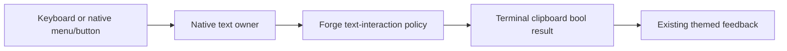

# Phase 70.1 — Completed discovery evidence

**2026-10-05. Source and controlled investigation only.** This record does not mark
[70.1](phase-70.1-text-interaction-foundation.md) or [Phase 70](phase-70-tui-text-interaction.md)
complete. Product design, implementation, installed default-path and Retina visual acceptance
remain pending. No product code, package publication, ACL, account or hosted chat was changed.

## Provenance

| Item | Observed baseline |
|---|---|
| Forge source | `katasec/forge-mcl` main `2022b512dd2bd108626124f22bc1cfe7652648d7`; owning [CLI README](https://github.com/katasec/forge-mcl/blob/2022b512dd2bd108626124f22bc1cfe7652648d7/src/ForgeMission.Cli/README.md). |
| UI packages | `XenoAtom.Terminal.UI`, `.Extensions.Markdown`, `.Extensions.CodeEditor.TextMateSharp` 3.10.0; UI NuGet repository commit `6f4e0cde3890d8ce2510ac0451b861863e4aeeaa`. |
| Terminal package | `XenoAtom.Terminal` 2.2.0; NuGet repository commit `5517cb3d8cdf0532ecc89260067064f98cde6137`. |
| CodeAlta reference | `/Users/ameerdeen/progs/CodeAlta`, commit `823f847297aafb0662ee317c3434c96a755e32fa`, UI 3.9.0. Read-only reference, not a newer-version capability claim. |
| Installed CLI metadata | `/Users/ameerdeen/.local/bin/forge`, version `1.0.0+4d232d66bf3aef83e5d249b178b17fe95b0f67b5`; SHA256 `575E18D960136EA788D45F7C8D737B11384D57C83ACFF95ECC7E770B6A5AE1C1`. `git diff 4d232d66bf3aef83e5d249b178b17fe95b0f67b5 HEAD -- src/ForgeMission.Cli/Tui` was empty. This is source parity, not execution acceptance. |
| Controlled CLI assembly | Existing `src/ForgeMission.Cli/bin/Debug/net10.0/forge.dll`; SHA256 `1B38A2F5ED3DEB77B96AD6C946F0CD4A56B93809D8AE9C8A32F134C4906EB62D`, 681984 bytes, built 2026-10-04 22:33:51 UTC. Loaded into a disposable JIT probe. |
| User reference | [Chat example](../images/phase-70/chat-user-reference.png), copied unchanged from the operator attachment (1014×601). An appearance reference, not a fresh running-TUI capture. |

## Discovery results

| Surface / capability | Evidence | Consequence |
|---|---|---|
| Start, chat, edit | CLI README and `Tui/StartPage.cs`, `ChatScreen.cs`, `FileEditor.cs`. Start offers Chat with a mission; Create is a placeholder. `/edit` uses CodeEditor, TextDocument and TextMate with Ctrl+S/Esc. | Preserve native editing; start/create work is outside this phase. |
| Native keyboard selection | UI `Controls/TextEditorBase.cs` and `TextEditorCore.cs`; PromptEditor/CodeEditor share selection/navigation. Controlled Shift+Left selects `beta`. | The library already provides the main editor mechanics. Physical terminal delivery/highlight still needs live reproduction. |
| Forge Copy removal | [ChatScreen](https://github.com/katasec/forge-mcl/blob/2022b512dd2bd108626124f22bc1cfe7652648d7/src/ForgeMission.Cli/Tui/ChatScreen.cs#L433) removes `TextEditor.Copy` at line 445; [ChatTui](https://github.com/katasec/forge-mcl/blob/2022b512dd2bd108626124f22bc1cfe7652648d7/src/ForgeMission.Cli/Tui/ChatTui.cs#L85) has Ctrl+C Stop. | Keyboard-only Copy can reach Stop despite an editor selection. Confirmed in the controlled Forge screen. |
| Mouse-dependent routing | UI `TerminalApp.cs` calls `TryCopyActiveSelection` before command routing; active owner is assigned on left mouse-down, not programmatic/keyboard focus. | Explains why clicking first changes the controlled result. A restored command alone cannot govern all clipboard failures. |
| Context menus | Public `Visual.ContextMenuFactory`, `ContextMenuService.Show`, `CommandPresentation.ContextMenu`; editor clipboard commands have empty labels and `Presentation.None`. | Native mechanism exists, but needs deliberate presentation and selection/paste lifetime handling. Opening a popup cleared selection in the probe. |
| Public editor integration | `HasSelection`, `TryCopySelection(out string)`, `TextDocument`, `ClipboardPasteHandler`, `Visual.Commands` and `AddCommand`; command `CanExecute`, `RouteGesture`, `ConsumesGestureWhenUnavailable`. | Use public hooks. `SelectionStart`/`SelectionLength` are protected; do not plan against them as public APIs. |
| Paragraph selection | Pinned [Paragraph](https://github.com/XenoAtom/XenoAtom.Terminal.UI/blob/6f4e0cde3890d8ce2510ac0451b861863e4aeeaa/src/XenoAtom.Terminal.UI/Controls/Paragraph.cs) is sealed, implements `ISelectionOwner`, is selectable by default and copies underlying text. | Single-paragraph drag/Copy is already supported and passed controlled checks in both themes. |
| Rich selection gap | Pinned `Controls/DocumentFlow.cs`, `Controls/FlowDocument.cs`, Markdown `Controls/MarkdownControl.cs`; no document selection owner/coordinator. Two-paragraph Forge probe selected only the first. | Real library/adapter design work is needed for continuous ranges, not a blanket disable/enable toggle. |
| Overlays | Forge FadeIn, StreamCaret and LinkPointer.Probe have `IsHitTestVisible=false`. | No source evidence that these overlays block native selection. Retain the invariant. |
| Code snippets | [ForgeCodeBlockRenderer](https://github.com/katasec/forge-mcl/blob/2022b512dd2bd108626124f22bc1cfe7652648d7/src/ForgeMission.Cli/Tui/ForgeCodeBlockRenderer.cs) creates styled Paragraph runs and TileFrame. Markdown context provides `.Code`; display trims trailing LF. | A native Button can wrap/decorate the existing renderer. Copy the original context payload, not the trimmed/wrapped display. Route pseudo-fence headings before snippet decoration. |
| Clipboard outcomes | Terminal `TerminalClipboard.TrySetText`/`TryGetText` return bool; capability checks are best effort. UI editor and app pre-routed Copy discard write results; native Cut deletes after its copy call. | Do not claim success from command handling or capabilities. Failed Copy must not fall through to Stop. Newly exposed Cut needs safe failure semantics. |

Primary library source roots: [UI pinned tree](https://github.com/XenoAtom/XenoAtom.Terminal.UI/tree/6f4e0cde3890d8ce2510ac0451b861863e4aeeaa/src)
and [Terminal pinned tree](https://github.com/XenoAtom/XenoAtom.Terminal/tree/5517cb3d8cdf0532ecc89260067064f98cde6137/src).
Version/commit mappings were checked against local NuGet manifests, not inferred from current main.

## CodeAlta patterns to reuse

| Reference | Finding |
|---|---|
| [ChatPromptEditor](https://github.com/CodeAlta/CodeAlta/blob/823f847297aafb0662ee317c3434c96a755e32fa/src/CodeAlta/Views/ChatPromptEditor.cs#L54), PromptComposerView | Custom Enter/completion behaviour delegates other input to the native editor. |
| [PromptImageAttachmentStripView](https://github.com/CodeAlta/CodeAlta/blob/823f847297aafb0662ee317c3434c96a755e32fa/src/CodeAlta/Views/PromptImageAttachmentStripView.cs#L92) | Image interception leaves ordinary text Paste to the editor. |
| [ChatTimelineVisualFactory](https://github.com/CodeAlta/CodeAlta/blob/823f847297aafb0662ee317c3434c96a755e32fa/src/CodeAlta/Presentation/Timeline/ChatTimelineVisualFactory.cs#L359) | A real Button with a copy icon occupies Group.TopRightText and reads current Markdown on activation. It ignores the clipboard bool result. |
| [CodeAltaAppTests](https://github.com/CodeAlta/CodeAlta/blob/823f847297aafb0662ee317c3434c96a755e32fa/src/CodeAlta.Tests/CodeAltaAppTests.cs#L188) | Real TerminalApp/in-memory mouse-click test checks latest streaming Markdown copied. |

Reuse native composition and event-driven tests. CodeAlta's message copy is not snippet copy or
continuous document selection, and its success handling does not meet this phase's failure rule.

## Kitty and theme preservation

| Existing design | Interaction implication |
|---|---|
| Body/code are terminal text; frames, pills, spinner and supported proportional headings use Kitty Unicode placeholders. Tiles and text images are cached. | Keep the hybrid UI; select/copy logical text rather than a dump of rendered cells. |
| HeadingImage uses embedded Inter and falls back to terminal text for unsupported text. | Logical heading selection must cover both rendering paths consistently. |
| ForgeTheme owns dark/light tokens; ForgeStyles applies them to native controls and Markdown. TextMate supplies language-specific code runs. | Selection/menu/button feedback extends the current semantic theme system; no separate palette or replacement code renderer. |

See [TUI graphics design](../design/tui-graphics.md) for the rendering foundation. No graphics
rewrite is justified by these text-interaction problems.

## Controlled probes

Scratch project: `/tmp/forge-text-interaction-20261005/Probe.csproj`; UI/Markdown/TextMate 3.10.0
packages, existing Forge Debug assembly, `InMemoryTerminalBackend`, 100×32 cells. Both Forge theme
instances were exercised. Cell metrics 19×42 were **synthetic**, and image transmission was a
no-op. Reflection accessed internal Forge controls and TerminalApp test lifecycle in this JIT
investigation only; it is not proposed production integration and proves no Native AOT safety.

The probe used actual Forge ChatScreen/ComposerEditor and Paragraphs, but a synthetic root Stop
counter, not ChatTui's hosted cancellation. It used an in-memory clipboard, not the OS clipboard.
No real project, account, turn, file edit or terminal GUI was involved.

| Action | Named observation |
|---|---|
| Focus native PromptEditor; text `alpha beta`; End, Shift+Left four times, Ctrl+C | `beta` selected/copied; Stop counter 0, with or without preceding click. |
| Same action in Forge composer, no preceding click | Dark and light: `beta` selected; clipboard remains `sentinel`; Stop counter 1; editor Copy command absent. |
| Click Forge composer, then repeat selection and Copy | Dark and light: `beta` copied; Stop counter 0. |
| Native editor selection, open native menu | Selection changed from present to absent. A custom invocation snapshot of `beta` still copied on Enter. This demonstrates a public snapshot technique for Copy, not a complete approved Paste/range/focus design. |
| Drag within first Forge reply paragraph, then Ctrl+C | Dark and light: `first` selected/copied. |
| Drag from first paragraph into second, then Ctrl+C | Dark and light: only `first paragraph alpha beta` selected/copied; second paragraph unselected. |

[Raw observations](../evidence/phase-70/controlled-probes.json) preserve all 11 cases and baseline
metadata. `dotnet run --project /tmp/forge-text-interaction-20261005/Probe.csproj` exited 0 with
no warnings. Independent assertions checked every recorded case: **PASS: all 11 controlled
observations match their recorded expectations**. These are baseline defect/capability
observations, not passing tests for a fix.

### Remaining verification limits

`cua.getApp("Ghostty")` was rejected with: “Computer Use is not allowed to use the app
'com.mitchellh.ghostty' for safety reasons.” No alternate UI automation was used to bypass that
denial. Installed launch, physical Shift/Cmd/Control delivery, terminal-native selection,
clipboard contents and Retina appearance remain unverified for this discovery. Source and
in-memory evidence cannot establish why every reported mouse/keyboard action fails in the
operator's running window. The original live-before-design handoff was later superseded by
the [manual verification exception](phase-70-tui-text-interaction.md#manual-verification-exception);
none of these missing observations became PASS.

## Resumption check

**2026-10-05 — two fresh read-only investigators; no product approval.** The supervisor
re-read the hub/spokes and governing workflow, confirmed installed metadata and the source
baseline independently, and checked the pinned public APIs against primary source. No
Ghostty launch, live capture, input injection, OS clipboard operation or hosted mutation was
performed. The existing denial was respected without retry or alternate access.

| Check | Named observation |
|---|---|
| Source/artifact parity | forge-mcl remained clean `main` at `2022b512dd2bd108626124f22bc1cfe7652648d7`; installed `forge --version`, SHA256 and empty TUI diff against `4d232d66bf3aef83e5d249b178b17fe95b0f67b5` matched the provenance table above. Metadata only. |
| Dependency parity | UI/Markdown/TextMate 3.10.0 and Terminal 2.2.0 retain the recorded package source pins. Client 0.9.2 and Client.Contracts 0.2.1 are unchanged. |
| Public integration | Confirmed sealed app/editor/clipboard classes, private pre-command Copy interception that discards the write bool, no app-options interception callback, and protected read-only range getters. The [active gap table](phase-70.1-text-interaction-foundation.md#public-integration-gaps--confirmed-at-the-pinned-baseline) preserves these facts for the future design. |
| Workflow outcome | Scope gate remains open. No product designer, plan author or implementer launched; no design/plan approved. Operator live observations were requested to inform scope; no response was received during this checkpoint. Supervisor live/default acceptance remains required. |
| Delivery | Documentation-only; default-path acceptance, product tests and Native AOT checks N/A. No package or ACL change. |
| Documentation checks | Four changed Markdown files, all 39 local links/anchors and the global hub's top-level-only shape passed; `git diff --check` passed. Checkpoint skill copies match; active project memory had no `project_` files. |

`task-timing` ran separately for the two tagged investigation questions, with no product PR:

| Question | Stage | Agents | Start | End | Wall | Tokens |
|---|---|---|---|---|---|---|
| `70 live scope` | `investigate` | 1 | 10-05 20:05:05 | 10-05 20:06:57 | 1m 51s | 88,258 |
| `70 clipboard contract` | `investigate` | 1 | 10-05 20:05:17 | 10-05 20:08:30 | 3m 12s | 91,649 |

These runs overlap; do not add their wall times. Timing uses the log timestamps and the
tool's last-context-size metric, not account usage. Neither timing row implies live verification.

## Manual verification decision

**2026-10-05 — operator selected post-code manual checking.** A direct Computer Use call
for `com.mitchellh.ghostty` returned the same safety denial, despite System Settings showing
Codex Computer Use enabled under Device Control and Data Access. No access workaround or
permission change followed. The operator then stated “once code complete - i can check manually”.

Two fresh read-only investigators assessed the workflow change and existing test coverage.
The supervisor checked the existing event harnesses and package metadata independently:

| Evidence | Coverage / limit |
|---|---|
| forge-mcl `FileEditorTests.cs` `RunKeys` and `StartPageTests.cs` `Run`/`Click` | Real `TerminalApp` uses `VirtualTerminalBackend`, programmatic focus and pushed key/text/mouse events. Supports controlled routing/menu/editor tests; no physical key or OS clipboard proof. |
| Terminal 2.2.0 package XML `ITerminalBackend.TrySetClipboardText` / `TryGetClipboardText` | Public injection boundary for deterministic clipboard results. Virtual backend methods are non-virtual; no assumed subclass override or new OS backend. Production adaptation still needs product design. |
| Existing tile/transcript/motion/colour/quit tests | Cover theme/layout structure, code colours, streamed replacement, scrolling and lifecycle regression at controlled layers. New selection/menu/snippet behaviour still needs tests. |
| Manual route | Operator owns real installed Ghostty/Retina/clipboard/physical gestures; agent owns design/reviews/tests/AOT and evidence assessment. Default artifact, project, saved login and hosted route remain unchanged. No live acceptance has occurred. |

The [hub exception](phase-70-tui-text-interaction.md#manual-verification-exception) is the
current rule. Earlier requirements for supervisor-personal live reproduction/PASS are
superseded for Phase 70 only; this changes verification ownership and ordering, not product
behaviour or the evidence needed to close the phase.

Documentation verification passed: five Markdown files, all 50 local links/anchors, global
hub shape, all active spokes' manual-acceptance ownership, and `git diff --check`.
Product tests/AOT/default-path acceptance are N/A for this policy documentation change;
no product code changed. No project-status memory was created.

`task-timing` ran for both completed investigation questions, without a product PR:

| Question | Stage | Agents | Start | End | Wall | Tokens |
|---|---|---|---|---|---|---|
| `70 verification alternatives` | `investigate` | 1 | 10-05 21:04:59 | 10-05 21:06:25 | 1m 25s | 71,153 |
| `70 verification coverage` | `investigate` | 1 | 10-05 21:05:23 | 10-05 21:07:57 | 2m 33s | 93,759 |

Runs overlap; timestamps and last-context-size tokens are the timing tool's metrics. The
separately tagged foundation product designer is outside this policy checkpoint's timing.

## Current published capabilities

**2026-10-05 — read-only official release/source check.** A fresh investigator checked current
NuGet and GitHub releases; the supervisor independently read both official NuGet indices.
The latest listed releases, including prereleases, are still
[UI 3.10.0](https://api.nuget.org/v3-flatcontainer/xenoatom.terminal.ui/index.json) and
[Terminal 2.2.0](https://api.nuget.org/v3-flatcontainer/xenoatom.terminal/index.json).
Release tags resolve to the previously recorded source commits. Upgrading to a newer published
version cannot currently supply the proposed contracts.

| Source observation | Design consequence |
|---|---|
| App selection Copy still runs before commands and discards the write bool; app/run options have no result/interception callback. | Candidate Copy integration remains unresolved. Extraction failure can return to later dispatch; explicitly contain that path before approving. |
| Editor range getters remain protected; CodeEditor remains sealed. | Native public directional capture/restore remains unresolved. |
| Existing [ClipboardPasteHandler/context](https://github.com/XenoAtom/XenoAtom.Terminal.UI/blob/6f4e0cde3890d8ce2510ac0451b861863e4aeeaa/src/XenoAtom.Terminal.UI/Controls/TextEditorClipboardPasteContext.cs) can transform default pasted text, or suppress insertion with empty text; native insertion retains Paste undo ownership. | Designer must evaluate this existing hook, including keyboard/bracketed Paste, rather than assume no native Paste capability. Context maps failed reads to null but provides no original result bool or insertion-completion result. It does not close the range-restoration gap. |

No design/library-ownership decision or live observation follows from this source check.

## Foundation candidate handoff

**2026-10-05 — candidate only, not design approval.** A fresh designer returned the native
control/shared-policy proposal retained in the [superseded candidate](#superseded-first-foundation-candidate).
The supervisor retained the public-contract, keyboard Paste and visual gaps explicitly. No
library API, package ownership route, implementation plan or code was approved or changed.

A fresh simplicity-reviewer launch was rejected with `agent thread limit reached`.
No reviewer ran and no review PASS is claimed. Resume with fresh simplicity and ownership
reviewers; their findings must be combined before design approval. The current-release
investigation is separate from those reviews and does not substitute for them.

| Task | Stage | Agents | Start | End | Wall | Tokens |
|---|---|---|---|---|---|---|
| `70 1 foundation` | `design` | 1 | 10-05 21:09:44 | 10-05 21:17:12 | 7m 28s | 163,605 |
| `70 current release` | `investigate` | 1 | 10-05 21:22:15 | 10-05 21:25:32 | 3m 16s | 83,739 |

Timing is the tool's last-context-size metric, not account usage. No product PR exists and
no product completion is implied. Default-path acceptance, product tests and Native AOT are
N/A for this candidate-document checkpoint. Manual live acceptance remains pending.

Checkpoint verification passed: four Markdown files, 44 local links/anchors, the whole global
hub's top-level-only shape and `git diff --check`. No project-status memory exists. Product
repository remains unchanged; these checks approve only the documentation's accuracy/shape.

## Foundation design reviews

**2026-10-05 — fresh read-only simplicity and ownership reviews; both require revision.**
The supervisor read the owning READMEs, governing gates, Forge implementation and pinned
native sources independently. Forge product diff against `origin/main` is empty. No product
plan, implementation, publication or live acceptance was approved or performed.

### Simplicity verdict

| Check | Verdict / observation |
|---|---|
| New apps or libraries | PASS — retains native controls, rendering and transport. |
| Reuse | REVISE — existing Paste hook suffices for failed versus empty read; do not add a second read/result API. |
| Multiple code paths | REVISE — fully specify early active-selection, focused-editor, menu and snippet Copy consumption/results. |
| Legacy paths | PASS — no second editor, fallback or compatibility mode proposed. |
| Knobs | PASS — no new user setting needed. |
| Speculative abstractions | REVISE — callback/snapshot proposals lack complete shapes, validity and ordering. |
| Library choice | REVISE — Copy/range gaps are real; the extension delivery owner remains unapproved. |
| Copy-paste | PASS at design level — existing editors/code renderer retained; no implementation diff exists. |
| Redundant definitions | REVISE — reuse nullable Paste context and existing theme tokens. |
| Size versus requirement | PASS — local interaction/snippets only; rich coordinator remains in its dependent spoke. |
| Test volume | REVISE — prove production Copy/Stop routing, menu ordering, keyboard and bracketed Paste separately. |
| Visuals | REVISE — bind before/after states, icon, focus order, feedback reset and contrast pairs. |

### Ownership verdict

Owners were derived before reading the candidate from the Desktop component atlas,
forge-mcl README and CLI component README. Scoped duplicate searches used only the
README-defined Forge repositories; no existing shared text policy was found.

| Behaviour | Derived owner | Verdict |
|---|---|---|
| Target choice / Copy versus Stop | Forge CLI policy; native app dispatch supplies selection routing | Placement fits; callback/consumption incomplete. |
| Selection, navigation, replacement and undo | XenoAtom native editors | Placement fits; menu-range integration incomplete. |
| Menu focus/selection preservation | XenoAtom mechanics; Forge invocation policy | Editor-only snapshots omit rendered Paragraph selection. |
| Clipboard transport / product feedback | XenoAtom transport; Forge CLI feedback | Placement fits; native Copy results still uncontrolled. |
| Exact snippet payload / highlighting / frame | Forge CLI renderer | Placement fits; binding controls and lifetime incomplete. |
| Button/menu/feedback themes | ForgeTheme / ForgeStyles; native styled controls | Placement fits; state/token/contrast contract incomplete. |
| New public native API/package delivery | XenoAtom owner unless operator explicitly selects another route | Type-1 decision open; Forge publication authority grants neither upstream writes nor a fork. |

No examined component's purpose acquired a second unrelated job. FileEditor's document
copy for Save is not a duplicate clipboard backend. CodeAlta remains a reference.

### Combined supervisor correction

| Issue | Required correction |
|---|---|
| Paste result | Reuse `ClipboardPasteHandler` with `context.Text is null` for failure and `Text.Length == 0` for successful empty text. The ownership review's nullable-output objection is dismissed: [TerminalClipboard](https://github.com/XenoAtom/XenoAtom.Terminal/blob/5517cb3d8cdf0532ecc89260067064f98cde6137/src/XenoAtom.Terminal/TerminalClipboard.cs#L69) delegates directly to the [backend's non-null-on-success contract](https://github.com/XenoAtom/XenoAtom.Terminal/blob/5517cb3d8cdf0532ecc89260067064f98cde6137/src/XenoAtom.Terminal/Backends/ITerminalBackend.cs#L98), and [Capture](https://github.com/XenoAtom/XenoAtom.Terminal.UI/blob/6f4e0cde3890d8ce2510ac0451b861863e4aeeaa/src/XenoAtom.Terminal.UI/Controls/TextEditorClipboardPasteContext.cs#L133) maps failed reads to null. Do not use `HasText`, add a bool field or reread. Bracketed Paste stays event-text insertion with native undo. |
| Copy | Define focused-selected-editor precedence, active rendered selection, extraction/write failure consumption, no-selection Stop and `/edit` isolation. A notification alone suffices only if native routing contains failure and reports it. |
| Menus | Capture/preserve editor and rendered selection before right-click focus changes. Menu action runs before close; Popup restores focus before `Closed`. Define action scheduling, cancellation, empty/failed Paste, stale/detached rejection and modal underlay exclusion. Prefer fixed native preservation if it avoids an unnecessary public snapshot framework. |
| Visuals / streaming | Bind icon, reserved geometry, focus order, exact labels, menu actions, feedback/reset and both themes' token pairs. Retired streaming visuals must reject stale actions. |
| Delivery | Produce a concrete recommended native extension or bounded adaptation with repository/API/package owner, pins, consumer route and reversal, then obtain the operator's Type-1 decision. No assumed upstream write, fork, private-access expansion or replacement editor/backend. |

A fresh read-only designer revision received this combined correction. Its proposal and a
fresh review round must close these findings before design approval. Manual post-code
operator acceptance remains approved; no Ghostty workaround was attempted.

Default-path acceptance, product tests and Native AOT: **N/A for this documentation change**.
Future product evidence remains mandatory under the parent manual-verification exception.

## Revised candidate review

**2026-10-05 — fresh R2 designer and simplicity reviewer; ownership launch rejected.**
The designer replaced public snapshots/replacement-handler proposals with fixed native menu
preservation and a native Copy operation/result observer. Existing Paste command/context/undo,
Button, TextMate, frames and clipboard transport are retained. The recommended owner is upstream
XenoAtom UI; its Type-1 route and actual package remain unapproved/unavailable for this proposal.
The [active candidate](phase-70.1-text-interaction-foundation.md#revised-foundation-candidate--not-approved)
contains complete proposed signatures, state tables, draft visual specifications and open gates.

The supervisor independently verified `ITextDocument.Version` is `int`, the real UI family package
identities in CLI/tests, public native menu target execution, nonsealed Button and protected virtual
Visual detach lifecycle. These observations prove current source capabilities, not the proposed API.

| R2 simplicity check | Verdict |
|---|---|
| New apps or libraries | PASS — native UI owner retains mechanisms; no new backend/editor/process. |
| Reuse | PASS — native Paste/context/insertion/undo; no result field or second read. |
| Multiple paths | REVISE — origin command's out-of-modal exemption must be explicit. |
| Legacy paths | PASS — no bridge, vendoring, fallback or dual-version consumer. |
| Knobs | PASS — fixed behavior and existing gestures. |
| Speculative abstractions | PASS — public snapshots removed; native operation/observer/private lifetime each serve a real boundary. |
| Library choice | PASS as a proposal — upstream route explicit; actual package/compatibility/AOT proof pending. |
| Copy-paste | PASS at design level — product diff empty; current editors/renderer/Button retained. |
| Redundant definitions | PASS with clarification — `NoSelection` means `HasSelection == false`; empty extraction with true means consumed `ExtractionFailed`. |
| Scope | PASS — rich selection remains the dependent spoke; no replacement transport/editor. |
| Test volume | PASS at design level — focused routing/menu/undo/payload/failure observations; no implementation tests authored. |
| Failure feedback | REVISE — stale Paste cannot promise failure notification when native CanExecute rejects before its handler. |
| Visuals / lifecycle | REVISE — separate popup-close restoration from redispatched Tab; add a below-15-cell fixture. Saved reference/contrast acceptance remains open. |

### Supervisor correction and next design gate

| Finding | Recorded draft correction / remaining gate |
|---|---|
| Origin modal scope | Only synchronous invocation of the validated origin command in the active context-menu family may copy its preserved underlay source. All other validity checks remain; no keyboard/global exemption. |
| Stale menu failure | Invalidate, disable and dismiss stale menus before operation, including availability checks; no invented failure observer or Paste read. Actual clipboard failure feedback remains. |
| Close versus input | Escape leaves restored range/focus intact. Native Tab/outside input may continue after close and alter that state; record both milestones separately. |
| Empty extraction / icon width | Clarify `HasSelection` classification; add isolated 12-cell content fixture so icon-only behavior is actually specified. |
| Own edit versus stale edit | Still open: define acceptance of a successful Paste's own document/version change separately from external/reentrant changes, retaining post-edit caret/focus. This needs design, not implementation inference. |
| Review availability | Fresh R2 ownership launch returned `agent thread limit reached`; no ownership reviewer ran. Do not label R2 fully reviewed or substitute supervisor checks. A fresh design/review round is next; no plan or Type-1 approval was requested. |
| Visual/package/defaults | SVG specifications are drafts, no new saved binding-reference or live PASS. Proposed API is absent at current pins; actual package/probes precede the consumer plan. Manual installed acceptance stays approved and pending. |

Source observations: [menu availability/execution](https://github.com/XenoAtom/XenoAtom.Terminal.UI/blob/6f4e0cde3890d8ce2510ac0451b861863e4aeeaa/src/XenoAtom.Terminal.UI/Controls/ContextMenuService.cs#L330),
[Tab redispatch](https://github.com/XenoAtom/XenoAtom.Terminal.UI/blob/6f4e0cde3890d8ce2510ac0451b861863e4aeeaa/src/XenoAtom.Terminal.UI/TerminalApp.cs#L2876),
[native Tab editing](https://github.com/XenoAtom/XenoAtom.Terminal.UI/blob/6f4e0cde3890d8ce2510ac0451b861863e4aeeaa/src/XenoAtom.Terminal.UI/Controls/TextEditorCore.cs#L909),
[Button](https://github.com/XenoAtom/XenoAtom.Terminal.UI/blob/6f4e0cde3890d8ce2510ac0451b861863e4aeeaa/src/XenoAtom.Terminal.UI/Controls/Button.cs#L15) and
[detach hook](https://github.com/XenoAtom/XenoAtom.Terminal.UI/blob/6f4e0cde3890d8ce2510ac0451b861863e4aeeaa/src/XenoAtom.Terminal.UI/Visual.cs#L779).
Current API source proof does not supply new native dispatch/preservation behavior or AOT PASS.

Default-path acceptance, product tests and Native AOT are **N/A for this documentation delivery**.
No product code, package, ACL, account, hosted data, OS clipboard or Ghostty automation changed.

Documentation checks passed: five Markdown files, all 57 local links/anchors, the whole global
hub's top-level-only shape and `git diff --check`. Checkpoint skill copies match; no `project_`
memory files exist in this project's memory directory. Product source remains unchanged.

`python3 tools/task-timing/timing.py '70 1 foundation'` ran without a product PR before the
documentation PR. It includes the earlier first designer and this continuation:

| Stage | Agents | Start | End | Wall | Tokens |
|---|---|---|---|---|---|
| `design` | 1 | 10-05 21:09:44 | 10-05 21:17:12 | 7m 28s | 163,605 |
| `review-design` | 2 | 10-05 21:33:36 | 10-05 21:39:16 | 5m 39s | 256,017 |
| `design:r2` | 1 | 10-05 21:40:57 | 10-05 21:51:17 | 10m 19s | 163,985 |
| `review-design:r2` | 1 | 10-05 21:54:59 | 10-05 21:58:36 | 3m 37s | 133,781 |

End to end: **48m 52s**, two revision rounds. Times follow the session logs; tokens are the
tool's last-context-size metric, not account usage. The rejected ownership launch has no run
and is not counted. No timing row implies design approval, code delivery or live acceptance.

## Ownership review retry and R3 correction

**2026-10-05 — fresh R2 ownership retry completed: REVISE.** The earlier launch failure
remains a historical tool result; it did not prevent the later successful fresh launch.
The exposed collaboration/deferred tools have no agent-close operation. Completion was
observed, but no numerical lifetime/concurrency quota or automatic capacity release was inferred.
A fresh `design__r3__70_1_foundation` launch then succeeded; no completed agent was reused.

| Ownership check | Verdict / source-backed correction |
|---|---|
| Copy dispatch and policy | Placement fits: XenoAtom UI owns native scoped precedence/results; Forge CLI owns Copy versus Stop and local feedback. Proposed API remains absent at the baseline. |
| Editing and menu lifecycle | Placement fits; REVISE ordering. Proposed close-before-invoke removes own-Paste mutation and origin modal exceptions. Preserve during focus restoration, end preservation, run `Closed`, then validate origin and exact caret/directional range after availability callbacks. Do not resurrect callback changes. |
| Paste callback boundary | REVISE. Native handler runs before insertion. Forge handler must be feedback-only; design a narrow native pre-insertion validity guard against reentrant source/document/range changes, retaining native insertion/undo. No generic mutation allowlist or second read. |
| Snippet lifecycle | REVISE. `DocumentFlow` removes/recycles offscreen visuals and visual-backed `FlowDocument` returns the same instance. Permanent retirement on detach would disable valid snippet buttons after scrolling. Detach blocks activation/resets feedback; same immutable-payload visual may reattach for fresh activation. Bound press/release lifetime without a speculative callback framework. |
| Transport and visuals | Placement fits: XenoAtom Terminal transport, Forge renderer payload/header, ForgeTheme/ForgeStyles tokens. Saved state references and controlled contrast observations remain pending. |
| Security / delivery | Local presentation only; explicit Paste, no logging/submission/new hosted authority. Upstream public route still requires operator decision and actual compatible package; Forge publication permission does not authorize upstream writes, messaging or forks. |

The supervisor independently reread pinned native `DocumentFlow.RecycleActiveBlock` and
`AcquireRecycledOrCreate`, `VisualDocumentFlowBlock` identity-based reuse, `Button` synchronous
key/press/release events, `ContextMenuService.InvokeOrOpen`, `Popup.Close` and
`TextEditorCore.PasteFromClipboard`; Forge `ChatScreen.CardItem` uses the visual-backed block.
These observations confirm the lifecycle findings, not the proposed fixes or runtime acceptance.

Primary sources: [DocumentFlow recycling](https://github.com/XenoAtom/XenoAtom.Terminal.UI/blob/6f4e0cde3890d8ce2510ac0451b861863e4aeeaa/src/XenoAtom.Terminal.UI/Controls/DocumentFlow.cs),
[FlowDocument visual reuse](https://github.com/XenoAtom/XenoAtom.Terminal.UI/blob/6f4e0cde3890d8ce2510ac0451b861863e4aeeaa/src/XenoAtom.Terminal.UI/Controls/FlowDocument.cs),
[Button input](https://github.com/XenoAtom/XenoAtom.Terminal.UI/blob/6f4e0cde3890d8ce2510ac0451b861863e4aeeaa/src/XenoAtom.Terminal.UI/Controls/Button.cs),
[native Paste](https://github.com/XenoAtom/XenoAtom.Terminal.UI/blob/6f4e0cde3890d8ce2510ac0451b861863e4aeeaa/src/XenoAtom.Terminal.UI/Controls/TextEditorCore.cs),
[Forge reply composition](https://github.com/katasec/forge-mcl/blob/2022b512dd2bd108626124f22bc1cfe7652648d7/src/ForgeMission.Cli/Tui/ChatScreen.cs#L358).

Design and plan remain unapproved; product code and pins are unchanged. Manual installed
Ghostty/laptop Retina acceptance stays approved and pending after implementation.

## R3 candidate and reference record

**2026-10-05 — fresh R3 designer completed; both fresh reviewer launches rejected.**
The [active candidate](phase-70.1-text-interaction-foundation.md#revised-foundation-candidate--not-approved)
replaces R2 execute-before-close preservation, own-Paste ambiguity and permanent snippet-detach
retirement. The private state, callback ordering, outcomes and focused probes remain proposed
native contracts, absent at the pinned package. No supervisor design/plan approval is recorded.

| Change in the candidate | Design result |
|---|---|
| Text-origin menu | Close root/submenus, restore eligible focus under preservation, end preservation before `Closed`, run callbacks, validate original exact directional range/interaction/content/attachment/scope/focus, evaluate availability and revalidate after each callback, invoke captured command once. No modal-origin exemption or own-edit allowlist. |
| Paste continuation | Capture existing native editor state before transport/handler, reject changed origin before insertion, invalidate pending attempt on detach or recursive Paste. Keep existing context/null-versus-empty distinction, one capture and native insertion/undo; Forge handler is feedback-only. |
| Snippet recycling | Immutable payload per rendered visual; detach resets public `IsPressed`, hover/feedback and pending feedback continuation. The same visual can reattach for fresh activation; an old release cannot activate. No permanent disposal framework or index lookup. |
| Visual states | Two saved synthetic galleries replace dozens of draft per-state filenames. Before/after normal/narrow code, all button states/combinations, 12-cell icon-only, exact menu geometry/state set, preserved range and prefixed Paste failure. |

### Saved synthetic references and baseline colours

[Light gallery](../images/phase-70.1/foundation-light.svg) and
[dark gallery](../images/phase-70.1/foundation-dark.svg) use synthetic 10×20-unit cells,
100×32 and 60×24 local viewports, plus the isolated 12-cell snippet header. The supervisor
rendered both with the bundled SVG renderer, personally inspected the images, and corrected
clipped menu borders and spacing before saving the final references. They show proposed owned
states, not a running native implementation or Retina/default-path acceptance.

[Colour evidence](../evidence/phase-70/foundation-colours.json) records actual current
ForgeTheme tokens and `CodeColours.Runs` foregrounds for the exact csharp fixture, extracted
from the unchanged baseline assembly by a disposable JIT probe. The probe exited 0 with no
warnings after correcting an initially misnamed public Style getter to `TryGetForeground`.
Reflection was baseline discovery only, never proposed production integration or AOT proof.
The assembly digest matches the discovery baseline. Relative luminance ratios enumerate
every new state pair and the fixture's syntax colours against CodeBlockFill/Selection.

| Exact fixture theme | Minimum syntax contrast on CodeBlockFill | Minimum on Selection |
|---|---|---|
| Light | 5.76 | 4.89 |
| Dark | 6.15 | 4.26 (`#569CD6`) |

These are numerical observations without an invented pass threshold. Other language runs,
native selected-run styling, real terminal glyph/cell geometry, continuous resizing and
installed Retina appearance remain future product evidence. No OS clipboard, Ghostty,
hosted chat/account, source/package or ACL operation occurred.

### Fresh reviewer launch limitation

| Attempt / observed state | Result |
|---|---|
| `review_design__simplicity__r3__70_1_foundation` | `agent thread limit reached`; no reviewer ran. |
| `review_design__ownership__r3__70_1_foundation` | `agent thread limit reached`; no reviewer ran. |
| Actual state inventory before ownership attempt | Root running; four descendants completed: designer R2, ownership R2, simplicity R1, designer R3. Completion is not assumed to release capacity. |
| Cleanup capability | No agent-close operation exposed by collaboration tools or deferred-tool metadata. Interruption/sidebar archive was not used as a substitute. No numerical quota or lifetime-limit explanation was inferred. |

The next step is **fresh R3 simplicity and ownership launches against the saved candidate and
references** when supported capacity is available. Do not continue completed agents for this
new round, manufacture review PASS, substitute supervisor inspection, or start a product plan.
The operator's Type-1 route choice and actual public package/probes remain subsequent gates;
manual post-code installed Ghostty/laptop Retina verification stays approved.

### Documentation continuation timing

`python3 tools/task-timing/timing.py '70 1 foundation'` ran without a product PR before
opening this documentation PR. The retry joins its original revision group; the row's wall
span includes the long gap between reviewers, not continuous computation.

| Stage | Agents | Start | End | Wall | Tokens |
|---|---|---|---|---|---|
| `design` | 1 | 10-05 21:09:44 | 10-05 21:17:12 | 7m 28s | 163,605 |
| `review-design` | 2 | 10-05 21:33:36 | 10-05 21:39:16 | 5m 39s | 256,017 |
| `design:r2` | 1 | 10-05 21:40:57 | 10-05 21:51:17 | 10m 19s | 163,985 |
| `review-design:r2` | 2 | 10-05 21:54:59 | 10-05 23:10:11 | 1h 15m | 288,122 |
| `design:r3` | 1 | 10-05 23:13:08 | 10-05 23:20:09 | 7m 00s | 119,981 |

End to end: **2h 10m**, three revision rounds; **991,710** is the summed last-context-size
metric, not account token usage. Rejected R3 launches produced no runs and are not counted.
Default-path acceptance, product tests and Native AOT are **N/A for this documentation change**.

Documentation verification passed: five Markdown files, all **64 local links/anchors**, the
whole global hub's top-level-only shape, both SVG XML parses, exact fixture run coverage and
`git diff --check`. Final light/dark state details were rerendered and inspected after spacing
correction. The checkpoint skill copies match; no `project_` memory files exist. Forge product
diff against `origin/main` is empty and its main is 0/0 versus origin/main.

## Superseded first foundation candidate

**Superseded by the revised foundation candidate, not an approved design.** The original
public handler/snapshot proposal was rejected by the first reviews. Its details are retained
only as review history.

The first designer proposes retaining native editors, selection, menus, buttons, TextMate
rendering and clipboard transport, with one Forge policy for target selection and truthful
clipboard feedback. This is a candidate, not an approved library contract or implementation plan.

| Concern | Candidate decision / unresolved readiness condition |
|---|---|
| Copy routing | Selected focused editor, then active rendered selection; consume the gesture even when extraction/write fails. No selection retains Stop. A proposed native app selection-copy callback would precede command dispatch and replace its currently unchecked write. No such public callback is established at UI 3.10.0. |
| Menu lifetime | Capture target, payload, native directional range and document identity/version before opening a menu. Cancellation, Copy and failed Paste restore the same target/range; changed or detached targets reject restoration. Successful nonempty Paste uses native insertion/undo. The required public range capture/restore API is proposed, not available at the pinned baseline. |
| Paste | Reuse `ClipboardPasteHandler`: pinned capture maps a failed read to `Text=null` and retains successful empty `Text=""`; the backend contract guarantees non-null text on success. Use `Text`, not `HasText`, and do not reread the clipboard or add a result field. Ctrl+V retains native insertion/undo; bracketed Paste inserts its delivered event text without a clipboard read. Menu range/lifetime and its actual native insertion route still require revision. |
| Native API proposal | `SelectionCopyHandler(TerminalApp app, Visual source, ISelectionOwner selection)` on app/run options; `TextEditorBase.CaptureSelection()` and `TryRestoreSelection(TextEditorSelectionSnapshot)` with an immutable native-owned snapshot. These names describe a proposal only; constructor/data validity, delivery and lifecycle contracts are not locked. |
| Snippets | Native focusable Copy code button in a reserved header row within the existing frame; code remains below with existing styling. Copy immutable full `context.Code`, including trailing newlines. Retired visuals cannot activate another snippet's action. Exclude image-heading pseudo-fences. |
| Feedback and visuals | Existing `ForgeTheme`/`ForgeStyles` tokens; Copy code, Copied and Copy failed states. Composer/editor use existing hint/message areas. Binding before/after references, placement, reset rules, focus/menu states and both themes must be recorded and reviewed before approval. |
| Verification | Native controlled event tests for no-click selection, real Copy/Stop routing, failed reads/writes, range/menu lifetime, exact snippet payload and stale actions; full suite and Native AOT. Operator performs the installed Retina/default-path checks under the parent exception. No new live observation is claimed. |
| Ownership and security | CLI owns local interaction policy and feedback; native library owns editing/selection mechanics and clipboard transport. Hosted tiers/stores/identities N/A; explicit Paste only, no payload logging or automatic model submission. Library/package ownership remains unresolved. |

Rejected: merely restoring Copy commands (pre-command interception still discards failure),
backend decoration alone (does not restore native ranges), private reflection, input simulation,
a replacement editor, an assumed fork, and a snippet-only substitute. These rejections do not
prove that every supported Forge adaptation is infeasible.

Current official releases were checked; no newer published capability closes the gaps above.
Fresh simplicity and ownership reviews both require revision; see
[review evidence](phase-70.1-text-interaction-foundation_completed.md#foundation-design-reviews).
The supervisor combined their findings for a fresh designer revision. If a new public/package boundary is still required, the operator must choose its
owner through the parent hub's Type-1 gate; existing Forge publication authority does not grant
upstream writes or authorize a fork. No implementation handoff occurs while this remains open.

## Documentation delivery and timing

Default-path acceptance: **N/A — documentation-only delivery**. Supervisor prepared the scope,
requirements, gates and evidence; product designer/plan/implementation and their persona reviews
have not run. That is the workflow's documentation-only exception, not product approval.

Documentation verification: five Markdown files, 42 local links/anchors, the whole global hub's
top-level-only shape, unchanged reference-image hash, and all 11 JSON observations passed the
supervisor's validation. `git diff --check` passed. Product tests/AOT are N/A for this document
change; baseline controlled results are recorded above. No `project_` memory files existed in
this project's memory directory at checkpoint; non-project memory was left intact.

`python3 tools/task-timing/timing.py '70 text interaction'` reported:

| Stage | Agents | Start | End | Wall | Tokens |
|---|---|---|---|---|---|
| `investigate` | 1 | 10-05 19:26:15 | 10-05 19:32:18 | 6m 03s | 111,292 |

**End to end:** 10-05 19:26:15 → 10-05 19:32:18 = 6m 03s; 111,292 subagent tokens;
0 revision rounds. No product PR: endpoint is the last tagged investigation. Earlier untagged
investigations and supervisor probes/documentation are excluded by the timing tool. Tokens are
the tool's last-context-size metric, not an account usage measurement.
