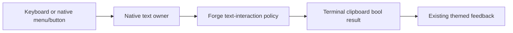
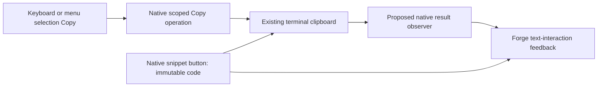
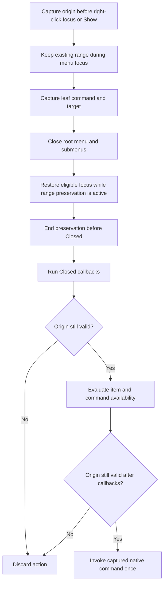
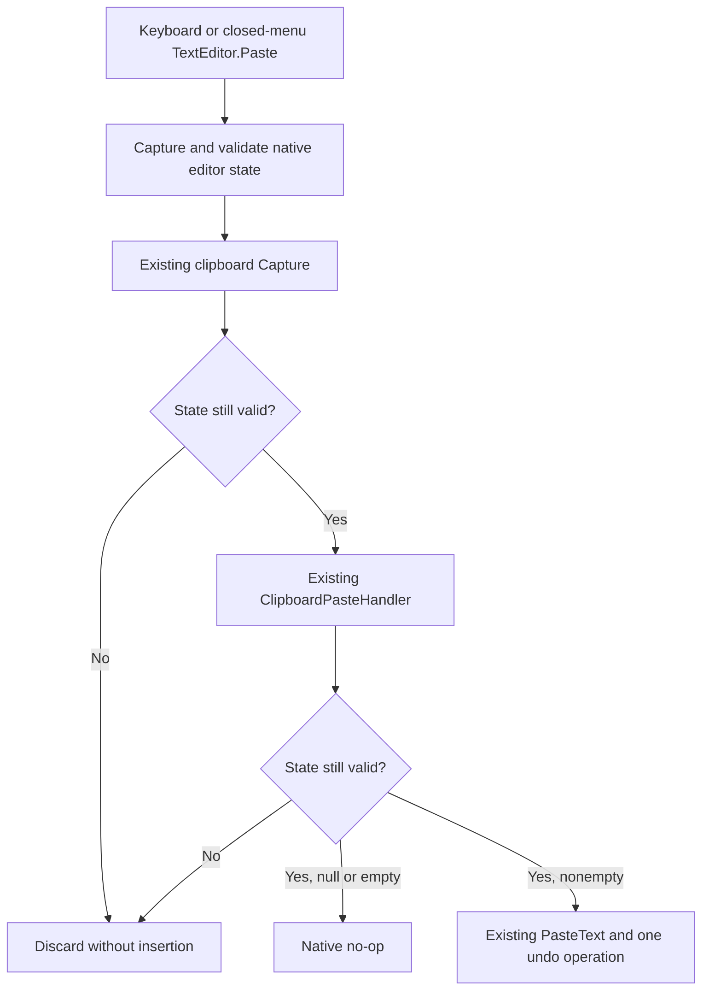

# Phase 70.1 — Completed discovery evidence

**2026-10-05. Source and controlled investigation only.** This record does not mark
[70.1](phase-70.1-text-interaction-foundation.md) or [Phase 70](phase-70-tui-text-interaction.md)
complete. Product design, implementation, installed default-path and Retina visual acceptance
remain pending. No product code, package publication, ACL, account or hosted chat was changed.

## Provenance

| Item | Observed baseline |
|---|---|
| Forge source | `katasec/forge-mcl` main `2022b512dd2bd108626124f22bc1cfe7652648d7`; owning [CLI README](https://github.com/katasec/forge-mcl/blob/2022b512dd2bd108626124f22bc1cfe7652648d7/src/ForgeMission.Cli/README.md). |
| UI packages | `XenoAtom.Terminal.UI`, `.Extensions.Markdown`, `.Extensions.CodeEditor.TextMateSharp` 3.10.0; UI NuGet repository commit `6f4e0cde3890d8ce2510ac0451b861863e4aeeaa`. |
| Terminal package | `XenoAtom.Terminal` 2.2.0; NuGet repository commit `5517cb3d8cdf0532ecc89260067064f98cde6137`. |
| CodeAlta reference | `/Users/ameerdeen/progs/CodeAlta`, commit `823f847297aafb0662ee317c3434c96a755e32fa`, UI 3.9.0. Read-only reference, not a newer-version capability claim. |
| Installed CLI metadata | `/Users/ameerdeen/.local/bin/forge`, version `1.0.0+4d232d66bf3aef83e5d249b178b17fe95b0f67b5`; SHA256 `575E18D960136EA788D45F7C8D737B11384D57C83ACFF95ECC7E770B6A5AE1C1`. `git diff 4d232d66bf3aef83e5d249b178b17fe95b0f67b5 HEAD -- src/ForgeMission.Cli/Tui` was empty. This is source parity, not execution acceptance. |
| Controlled CLI assembly | Existing `src/ForgeMission.Cli/bin/Debug/net10.0/forge.dll`; SHA256 `1B38A2F5ED3DEB77B96AD6C946F0CD4A56B93809D8AE9C8A32F134C4906EB62D`, 681984 bytes, built 2026-10-04 22:33:51 UTC. Loaded into a disposable JIT probe. |
| User reference | [Chat example](../images/phase-70/chat-user-reference.png), copied unchanged from the operator attachment (1014×601). An appearance reference, not a fresh running-TUI capture. |

## Discovery results

| Surface / capability | Evidence | Consequence |
|---|---|---|
| Start, chat, edit | CLI README and `Tui/StartPage.cs`, `ChatScreen.cs`, `FileEditor.cs`. Start offers Chat with a mission; Create is a placeholder. `/edit` uses CodeEditor, TextDocument and TextMate with Ctrl+S/Esc. | Preserve native editing; start/create work is outside this phase. |
| Native keyboard selection | UI `Controls/TextEditorBase.cs` and `TextEditorCore.cs`; PromptEditor/CodeEditor share selection/navigation. Controlled Shift+Left selects `beta`. | The library already provides the main editor mechanics. Physical terminal delivery/highlight still needs live reproduction. |
| Forge Copy removal | [ChatScreen](https://github.com/katasec/forge-mcl/blob/2022b512dd2bd108626124f22bc1cfe7652648d7/src/ForgeMission.Cli/Tui/ChatScreen.cs#L433) removes `TextEditor.Copy` at line 445; [ChatTui](https://github.com/katasec/forge-mcl/blob/2022b512dd2bd108626124f22bc1cfe7652648d7/src/ForgeMission.Cli/Tui/ChatTui.cs#L85) has Ctrl+C Stop. | Keyboard-only Copy can reach Stop despite an editor selection. Confirmed in the controlled Forge screen. |
| Mouse-dependent routing | UI `TerminalApp.cs` calls `TryCopyActiveSelection` before command routing; active owner is assigned on left mouse-down, not programmatic/keyboard focus. | Explains why clicking first changes the controlled result. A restored command alone cannot govern all clipboard failures. |
| Context menus | Public `Visual.ContextMenuFactory`, `ContextMenuService.Show`, `CommandPresentation.ContextMenu`; editor clipboard commands have empty labels and `Presentation.None`. | Native mechanism exists, but needs deliberate presentation and selection/paste lifetime handling. Opening a popup cleared selection in the probe. |
| Public editor integration | `HasSelection`, `TryCopySelection(out string)`, `TextDocument`, `ClipboardPasteHandler`, `Visual.Commands` and `AddCommand`; command `CanExecute`, `RouteGesture`, `ConsumesGestureWhenUnavailable`. | Use public hooks. `SelectionStart`/`SelectionLength` are protected; do not plan against them as public APIs. |
| Paragraph selection | Pinned [Paragraph](https://github.com/XenoAtom/XenoAtom.Terminal.UI/blob/6f4e0cde3890d8ce2510ac0451b861863e4aeeaa/src/XenoAtom.Terminal.UI/Controls/Paragraph.cs) is sealed, implements `ISelectionOwner`, is selectable by default and copies underlying text. | Single-paragraph drag/Copy is already supported and passed controlled checks in both themes. |
| Rich selection gap | Pinned `Controls/DocumentFlow.cs`, `Controls/FlowDocument.cs`, Markdown `Controls/MarkdownControl.cs`; no document selection owner/coordinator. Two-paragraph Forge probe selected only the first. | Real library/adapter design work is needed for continuous ranges, not a blanket disable/enable toggle. |
| Overlays | Forge FadeIn, StreamCaret and LinkPointer.Probe have `IsHitTestVisible=false`. | No source evidence that these overlays block native selection. Retain the invariant. |
| Code snippets | [ForgeCodeBlockRenderer](https://github.com/katasec/forge-mcl/blob/2022b512dd2bd108626124f22bc1cfe7652648d7/src/ForgeMission.Cli/Tui/ForgeCodeBlockRenderer.cs) creates styled Paragraph runs and TileFrame. Markdown context provides `.Code`; display trims trailing LF. | A native Button can wrap/decorate the existing renderer. Copy the original context payload, not the trimmed/wrapped display. Route pseudo-fence headings before snippet decoration. |
| Clipboard outcomes | Terminal `TerminalClipboard.TrySetText`/`TryGetText` return bool; capability checks are best effort. UI editor and app pre-routed Copy discard write results; native Cut deletes after its copy call. | Do not claim success from command handling or capabilities. Failed Copy must not fall through to Stop. Newly exposed Cut needs safe failure semantics. |

Primary library source roots: [UI pinned tree](https://github.com/XenoAtom/XenoAtom.Terminal.UI/tree/6f4e0cde3890d8ce2510ac0451b861863e4aeeaa/src)
and [Terminal pinned tree](https://github.com/XenoAtom/XenoAtom.Terminal/tree/5517cb3d8cdf0532ecc89260067064f98cde6137/src).
Version/commit mappings were checked against local NuGet manifests, not inferred from current main.

## CodeAlta patterns to reuse

| Reference | Finding |
|---|---|
| [ChatPromptEditor](https://github.com/CodeAlta/CodeAlta/blob/823f847297aafb0662ee317c3434c96a755e32fa/src/CodeAlta/Views/ChatPromptEditor.cs#L54), PromptComposerView | Custom Enter/completion behaviour delegates other input to the native editor. |
| [PromptImageAttachmentStripView](https://github.com/CodeAlta/CodeAlta/blob/823f847297aafb0662ee317c3434c96a755e32fa/src/CodeAlta/Views/PromptImageAttachmentStripView.cs#L92) | Image interception leaves ordinary text Paste to the editor. |
| [ChatTimelineVisualFactory](https://github.com/CodeAlta/CodeAlta/blob/823f847297aafb0662ee317c3434c96a755e32fa/src/CodeAlta/Presentation/Timeline/ChatTimelineVisualFactory.cs#L359) | A real Button with a copy icon occupies Group.TopRightText and reads current Markdown on activation. It ignores the clipboard bool result. |
| [CodeAltaAppTests](https://github.com/CodeAlta/CodeAlta/blob/823f847297aafb0662ee317c3434c96a755e32fa/src/CodeAlta.Tests/CodeAltaAppTests.cs#L188) | Real TerminalApp/in-memory mouse-click test checks latest streaming Markdown copied. |

Reuse native composition and event-driven tests. CodeAlta's message copy is not snippet copy or
continuous document selection, and its success handling does not meet this phase's failure rule.

## Kitty and theme preservation

| Existing design | Interaction implication |
|---|---|
| Body/code are terminal text; frames, pills, spinner and supported proportional headings use Kitty Unicode placeholders. Tiles and text images are cached. | Keep the hybrid UI; select/copy logical text rather than a dump of rendered cells. |
| HeadingImage uses embedded Inter and falls back to terminal text for unsupported text. | Logical heading selection must cover both rendering paths consistently. |
| ForgeTheme owns dark/light tokens; ForgeStyles applies them to native controls and Markdown. TextMate supplies language-specific code runs. | Selection/menu/button feedback extends the current semantic theme system; no separate palette or replacement code renderer. |

See [TUI graphics design](../design/tui-graphics.md) for the rendering foundation. No graphics
rewrite is justified by these text-interaction problems.

## Controlled probes

Scratch project: `/tmp/forge-text-interaction-20261005/Probe.csproj`; UI/Markdown/TextMate 3.10.0
packages, existing Forge Debug assembly, `InMemoryTerminalBackend`, 100×32 cells. Both Forge theme
instances were exercised. Cell metrics 19×42 were **synthetic**, and image transmission was a
no-op. Reflection accessed internal Forge controls and TerminalApp test lifecycle in this JIT
investigation only; it is not proposed production integration and proves no Native AOT safety.

The probe used actual Forge ChatScreen/ComposerEditor and Paragraphs, but a synthetic root Stop
counter, not ChatTui's hosted cancellation. It used an in-memory clipboard, not the OS clipboard.
No real project, account, turn, file edit or terminal GUI was involved.

| Action | Named observation |
|---|---|
| Focus native PromptEditor; text `alpha beta`; End, Shift+Left four times, Ctrl+C | `beta` selected/copied; Stop counter 0, with or without preceding click. |
| Same action in Forge composer, no preceding click | Dark and light: `beta` selected; clipboard remains `sentinel`; Stop counter 1; editor Copy command absent. |
| Click Forge composer, then repeat selection and Copy | Dark and light: `beta` copied; Stop counter 0. |
| Native editor selection, open native menu | Selection changed from present to absent. A custom invocation snapshot of `beta` still copied on Enter. This demonstrates a public snapshot technique for Copy, not a complete approved Paste/range/focus design. |
| Drag within first Forge reply paragraph, then Ctrl+C | Dark and light: `first` selected/copied. |
| Drag from first paragraph into second, then Ctrl+C | Dark and light: only `first paragraph alpha beta` selected/copied; second paragraph unselected. |

[Raw observations](../evidence/phase-70/controlled-probes.json) preserve all 11 cases and baseline
metadata. `dotnet run --project /tmp/forge-text-interaction-20261005/Probe.csproj` exited 0 with
no warnings. Independent assertions checked every recorded case: **PASS: all 11 controlled
observations match their recorded expectations**. These are baseline defect/capability
observations, not passing tests for a fix.

### Remaining verification limits

`cua.getApp("Ghostty")` was rejected with: “Computer Use is not allowed to use the app
'com.mitchellh.ghostty' for safety reasons.” No alternate UI automation was used to bypass that
denial. Installed launch, physical Shift/Cmd/Control delivery, terminal-native selection,
clipboard contents and Retina appearance remain unverified for this discovery. Source and
in-memory evidence cannot establish why every reported mouse/keyboard action fails in the
operator's running window. The original live-before-design handoff was later superseded by
the [manual verification exception](phase-70-tui-text-interaction.md#manual-verification-exception);
none of these missing observations became PASS.

## Resumption check

**2026-10-05 — two fresh read-only investigators; no product approval.** The supervisor
re-read the hub/spokes and governing workflow, confirmed installed metadata and the source
baseline independently, and checked the pinned public APIs against primary source. No
Ghostty launch, live capture, input injection, OS clipboard operation or hosted mutation was
performed. The existing denial was respected without retry or alternate access.

| Check | Named observation |
|---|---|
| Source/artifact parity | forge-mcl remained clean `main` at `2022b512dd2bd108626124f22bc1cfe7652648d7`; installed `forge --version`, SHA256 and empty TUI diff against `4d232d66bf3aef83e5d249b178b17fe95b0f67b5` matched the provenance table above. Metadata only. |
| Dependency parity | UI/Markdown/TextMate 3.10.0 and Terminal 2.2.0 retain the recorded package source pins. Client 0.9.2 and Client.Contracts 0.2.1 are unchanged. |
| Public integration | Confirmed sealed app/editor/clipboard classes, private pre-command Copy interception that discards the write bool, no app-options interception callback, and protected read-only range getters. The [active gap table](phase-70.1-text-interaction-foundation.md#public-integration-gaps--confirmed-at-the-pinned-baseline) preserves these facts for the future design. |
| Workflow outcome | Scope gate remains open. No product designer, plan author or implementer launched; no design/plan approved. Operator live observations were requested to inform scope; no response was received during this checkpoint. Supervisor live/default acceptance remains required. |
| Delivery | Documentation-only; default-path acceptance, product tests and Native AOT checks N/A. No package or ACL change. |
| Documentation checks | Four changed Markdown files, all 39 local links/anchors and the global hub's top-level-only shape passed; `git diff --check` passed. Checkpoint skill copies match; active project memory had no `project_` files. |

`task-timing` ran separately for the two tagged investigation questions, with no product PR:

| Question | Stage | Agents | Start | End | Wall | Tokens |
|---|---|---|---|---|---|---|
| `70 live scope` | `investigate` | 1 | 10-05 20:05:05 | 10-05 20:06:57 | 1m 51s | 88,258 |
| `70 clipboard contract` | `investigate` | 1 | 10-05 20:05:17 | 10-05 20:08:30 | 3m 12s | 91,649 |

These runs overlap; do not add their wall times. Timing uses the log timestamps and the
tool's last-context-size metric, not account usage. Neither timing row implies live verification.

## Manual verification decision

**2026-10-05 — operator selected post-code manual checking.** A direct Computer Use call
for `com.mitchellh.ghostty` returned the same safety denial, despite System Settings showing
Codex Computer Use enabled under Device Control and Data Access. No access workaround or
permission change followed. The operator then stated “once code complete - i can check manually”.

Two fresh read-only investigators assessed the workflow change and existing test coverage.
The supervisor checked the existing event harnesses and package metadata independently:

| Evidence | Coverage / limit |
|---|---|
| forge-mcl `FileEditorTests.cs` `RunKeys` and `StartPageTests.cs` `Run`/`Click` | Real `TerminalApp` uses `VirtualTerminalBackend`, programmatic focus and pushed key/text/mouse events. Supports controlled routing/menu/editor tests; no physical key or OS clipboard proof. |
| Terminal 2.2.0 package XML `ITerminalBackend.TrySetClipboardText` / `TryGetClipboardText` | Public injection boundary for deterministic clipboard results. Virtual backend methods are non-virtual; no assumed subclass override or new OS backend. Production adaptation still needs product design. |
| Existing tile/transcript/motion/colour/quit tests | Cover theme/layout structure, code colours, streamed replacement, scrolling and lifecycle regression at controlled layers. New selection/menu/snippet behaviour still needs tests. |
| Manual route | Operator owns real installed Ghostty/Retina/clipboard/physical gestures; agent owns design/reviews/tests/AOT and evidence assessment. Default artifact, project, saved login and hosted route remain unchanged. No live acceptance has occurred. |

The [hub exception](phase-70-tui-text-interaction.md#manual-verification-exception) is the
current rule. Earlier requirements for supervisor-personal live reproduction/PASS are
superseded for Phase 70 only; this changes verification ownership and ordering, not product
behaviour or the evidence needed to close the phase.

Documentation verification passed: five Markdown files, all 50 local links/anchors, global
hub shape, all active spokes' manual-acceptance ownership, and `git diff --check`.
Product tests/AOT/default-path acceptance are N/A for this policy documentation change;
no product code changed. No project-status memory was created.

`task-timing` ran for both completed investigation questions, without a product PR:

| Question | Stage | Agents | Start | End | Wall | Tokens |
|---|---|---|---|---|---|---|
| `70 verification alternatives` | `investigate` | 1 | 10-05 21:04:59 | 10-05 21:06:25 | 1m 25s | 71,153 |
| `70 verification coverage` | `investigate` | 1 | 10-05 21:05:23 | 10-05 21:07:57 | 2m 33s | 93,759 |

Runs overlap; timestamps and last-context-size tokens are the timing tool's metrics. The
separately tagged foundation product designer is outside this policy checkpoint's timing.

## Current published capabilities

**2026-10-05 — read-only official release/source check.** A fresh investigator checked current
NuGet and GitHub releases; the supervisor independently read both official NuGet indices.
The latest listed releases, including prereleases, are still
[UI 3.10.0](https://api.nuget.org/v3-flatcontainer/xenoatom.terminal.ui/index.json) and
[Terminal 2.2.0](https://api.nuget.org/v3-flatcontainer/xenoatom.terminal/index.json).
Release tags resolve to the previously recorded source commits. Upgrading to a newer published
version cannot currently supply the proposed contracts.

| Source observation | Design consequence |
|---|---|
| App selection Copy still runs before commands and discards the write bool; app/run options have no result/interception callback. | Candidate Copy integration remains unresolved. Extraction failure can return to later dispatch; explicitly contain that path before approving. |
| Editor range getters remain protected; CodeEditor remains sealed. | Native public directional capture/restore remains unresolved. |
| Existing [ClipboardPasteHandler/context](https://github.com/XenoAtom/XenoAtom.Terminal.UI/blob/6f4e0cde3890d8ce2510ac0451b861863e4aeeaa/src/XenoAtom.Terminal.UI/Controls/TextEditorClipboardPasteContext.cs) can transform default pasted text, or suppress insertion with empty text; native insertion retains Paste undo ownership. | Designer must evaluate this existing hook, including keyboard/bracketed Paste, rather than assume no native Paste capability. Context maps failed reads to null but provides no original result bool or insertion-completion result. It does not close the range-restoration gap. |

No design/library-ownership decision or live observation follows from this source check.

## Foundation candidate handoff

**2026-10-05 — candidate only, not design approval.** A fresh designer returned the native
control/shared-policy proposal retained in the [superseded candidate](#superseded-first-foundation-candidate).
The supervisor retained the public-contract, keyboard Paste and visual gaps explicitly. No
library API, package ownership route, implementation plan or code was approved or changed.

A fresh simplicity-reviewer launch was rejected with `agent thread limit reached`.
No reviewer ran and no review PASS is claimed. Resume with fresh simplicity and ownership
reviewers; their findings must be combined before design approval. The current-release
investigation is separate from those reviews and does not substitute for them.

| Task | Stage | Agents | Start | End | Wall | Tokens |
|---|---|---|---|---|---|---|
| `70 1 foundation` | `design` | 1 | 10-05 21:09:44 | 10-05 21:17:12 | 7m 28s | 163,605 |
| `70 current release` | `investigate` | 1 | 10-05 21:22:15 | 10-05 21:25:32 | 3m 16s | 83,739 |

Timing is the tool's last-context-size metric, not account usage. No product PR exists and
no product completion is implied. Default-path acceptance, product tests and Native AOT are
N/A for this candidate-document checkpoint. Manual live acceptance remains pending.

Checkpoint verification passed: four Markdown files, 44 local links/anchors, the whole global
hub's top-level-only shape and `git diff --check`. No project-status memory exists. Product
repository remains unchanged; these checks approve only the documentation's accuracy/shape.

## Foundation design reviews

**2026-10-05 — fresh read-only simplicity and ownership reviews; both require revision.**
The supervisor read the owning READMEs, governing gates, Forge implementation and pinned
native sources independently. Forge product diff against `origin/main` is empty. No product
plan, implementation, publication or live acceptance was approved or performed.

### Simplicity verdict

| Check | Verdict / observation |
|---|---|
| New apps or libraries | PASS — retains native controls, rendering and transport. |
| Reuse | REVISE — existing Paste hook suffices for failed versus empty read; do not add a second read/result API. |
| Multiple code paths | REVISE — fully specify early active-selection, focused-editor, menu and snippet Copy consumption/results. |
| Legacy paths | PASS — no second editor, fallback or compatibility mode proposed. |
| Knobs | PASS — no new user setting needed. |
| Speculative abstractions | REVISE — callback/snapshot proposals lack complete shapes, validity and ordering. |
| Library choice | REVISE — Copy/range gaps are real; the extension delivery owner remains unapproved. |
| Copy-paste | PASS at design level — existing editors/code renderer retained; no implementation diff exists. |
| Redundant definitions | REVISE — reuse nullable Paste context and existing theme tokens. |
| Size versus requirement | PASS — local interaction/snippets only; rich coordinator remains in its dependent spoke. |
| Test volume | REVISE — prove production Copy/Stop routing, menu ordering, keyboard and bracketed Paste separately. |
| Visuals | REVISE — bind before/after states, icon, focus order, feedback reset and contrast pairs. |

### Ownership verdict

Owners were derived before reading the candidate from the Desktop component atlas,
forge-mcl README and CLI component README. Scoped duplicate searches used only the
README-defined Forge repositories; no existing shared text policy was found.

| Behaviour | Derived owner | Verdict |
|---|---|---|
| Target choice / Copy versus Stop | Forge CLI policy; native app dispatch supplies selection routing | Placement fits; callback/consumption incomplete. |
| Selection, navigation, replacement and undo | XenoAtom native editors | Placement fits; menu-range integration incomplete. |
| Menu focus/selection preservation | XenoAtom mechanics; Forge invocation policy | Editor-only snapshots omit rendered Paragraph selection. |
| Clipboard transport / product feedback | XenoAtom transport; Forge CLI feedback | Placement fits; native Copy results still uncontrolled. |
| Exact snippet payload / highlighting / frame | Forge CLI renderer | Placement fits; binding controls and lifetime incomplete. |
| Button/menu/feedback themes | ForgeTheme / ForgeStyles; native styled controls | Placement fits; state/token/contrast contract incomplete. |
| New public native API/package delivery | XenoAtom owner unless operator explicitly selects another route | Type-1 decision open; Forge publication authority grants neither upstream writes nor a fork. |

No examined component's purpose acquired a second unrelated job. FileEditor's document
copy for Save is not a duplicate clipboard backend. CodeAlta remains a reference.

### Combined supervisor correction

| Issue | Required correction |
|---|---|
| Paste result | Reuse `ClipboardPasteHandler` with `context.Text is null` for failure and `Text.Length == 0` for successful empty text. The ownership review's nullable-output objection is dismissed: [TerminalClipboard](https://github.com/XenoAtom/XenoAtom.Terminal/blob/5517cb3d8cdf0532ecc89260067064f98cde6137/src/XenoAtom.Terminal/TerminalClipboard.cs#L69) delegates directly to the [backend's non-null-on-success contract](https://github.com/XenoAtom/XenoAtom.Terminal/blob/5517cb3d8cdf0532ecc89260067064f98cde6137/src/XenoAtom.Terminal/Backends/ITerminalBackend.cs#L98), and [Capture](https://github.com/XenoAtom/XenoAtom.Terminal.UI/blob/6f4e0cde3890d8ce2510ac0451b861863e4aeeaa/src/XenoAtom.Terminal.UI/Controls/TextEditorClipboardPasteContext.cs#L133) maps failed reads to null. Do not use `HasText`, add a bool field or reread. Bracketed Paste stays event-text insertion with native undo. |
| Copy | Define focused-selected-editor precedence, active rendered selection, extraction/write failure consumption, no-selection Stop and `/edit` isolation. A notification alone suffices only if native routing contains failure and reports it. |
| Menus | Capture/preserve editor and rendered selection before right-click focus changes. Menu action runs before close; Popup restores focus before `Closed`. Define action scheduling, cancellation, empty/failed Paste, stale/detached rejection and modal underlay exclusion. Prefer fixed native preservation if it avoids an unnecessary public snapshot framework. |
| Visuals / streaming | Bind icon, reserved geometry, focus order, exact labels, menu actions, feedback/reset and both themes' token pairs. Retired streaming visuals must reject stale actions. |
| Delivery | Produce a concrete recommended native extension or bounded adaptation with repository/API/package owner, pins, consumer route and reversal, then obtain the operator's Type-1 decision. No assumed upstream write, fork, private-access expansion or replacement editor/backend. |

A fresh read-only designer revision received this combined correction. Its proposal and a
fresh review round must close these findings before design approval. Manual post-code
operator acceptance remains approved; no Ghostty workaround was attempted.

Default-path acceptance, product tests and Native AOT: **N/A for this documentation change**.
Future product evidence remains mandatory under the parent manual-verification exception.

## Revised candidate review

**2026-10-05 — fresh R2 designer and simplicity reviewer; ownership launch rejected.**
The designer replaced public snapshots/replacement-handler proposals with fixed native menu
preservation and a native Copy operation/result observer. Existing Paste command/context/undo,
Button, TextMate, frames and clipboard transport are retained. The recommended owner is upstream
XenoAtom UI; its Type-1 route and actual package remain unapproved/unavailable for this proposal.
The [active candidate](#superseded-r6-native-library-proposal)
contains complete proposed signatures, state tables, draft visual specifications and open gates.

The supervisor independently verified `ITextDocument.Version` is `int`, the real UI family package
identities in CLI/tests, public native menu target execution, nonsealed Button and protected virtual
Visual detach lifecycle. These observations prove current source capabilities, not the proposed API.

| R2 simplicity check | Verdict |
|---|---|
| New apps or libraries | PASS — native UI owner retains mechanisms; no new backend/editor/process. |
| Reuse | PASS — native Paste/context/insertion/undo; no result field or second read. |
| Multiple paths | REVISE — origin command's out-of-modal exemption must be explicit. |
| Legacy paths | PASS — no bridge, vendoring, fallback or dual-version consumer. |
| Knobs | PASS — fixed behavior and existing gestures. |
| Speculative abstractions | PASS — public snapshots removed; native operation/observer/private lifetime each serve a real boundary. |
| Library choice | PASS as a proposal — upstream route explicit; actual package/compatibility/AOT proof pending. |
| Copy-paste | PASS at design level — product diff empty; current editors/renderer/Button retained. |
| Redundant definitions | PASS with clarification — `NoSelection` means `HasSelection == false`; empty extraction with true means consumed `ExtractionFailed`. |
| Scope | PASS — rich selection remains the dependent spoke; no replacement transport/editor. |
| Test volume | PASS at design level — focused routing/menu/undo/payload/failure observations; no implementation tests authored. |
| Failure feedback | REVISE — stale Paste cannot promise failure notification when native CanExecute rejects before its handler. |
| Visuals / lifecycle | REVISE — separate popup-close restoration from redispatched Tab; add a below-15-cell fixture. Saved reference/contrast acceptance remains open. |

### Supervisor correction and next design gate

| Finding | Recorded draft correction / remaining gate |
|---|---|
| Origin modal scope | Only synchronous invocation of the validated origin command in the active context-menu family may copy its preserved underlay source. All other validity checks remain; no keyboard/global exemption. |
| Stale menu failure | Invalidate, disable and dismiss stale menus before operation, including availability checks; no invented failure observer or Paste read. Actual clipboard failure feedback remains. |
| Close versus input | Escape leaves restored range/focus intact. Native Tab/outside input may continue after close and alter that state; record both milestones separately. |
| Empty extraction / icon width | Clarify `HasSelection` classification; add isolated 12-cell content fixture so icon-only behavior is actually specified. |
| Own edit versus stale edit | Still open: define acceptance of a successful Paste's own document/version change separately from external/reentrant changes, retaining post-edit caret/focus. This needs design, not implementation inference. |
| Review availability | Fresh R2 ownership launch returned `agent thread limit reached`; no ownership reviewer ran. Do not label R2 fully reviewed or substitute supervisor checks. A fresh design/review round is next; no plan or Type-1 approval was requested. |
| Visual/package/defaults | SVG specifications are drafts, no new saved binding-reference or live PASS. Proposed API is absent at current pins; actual package/probes precede the consumer plan. Manual installed acceptance stays approved and pending. |

Source observations: [menu availability/execution](https://github.com/XenoAtom/XenoAtom.Terminal.UI/blob/6f4e0cde3890d8ce2510ac0451b861863e4aeeaa/src/XenoAtom.Terminal.UI/Controls/ContextMenuService.cs#L330),
[Tab redispatch](https://github.com/XenoAtom/XenoAtom.Terminal.UI/blob/6f4e0cde3890d8ce2510ac0451b861863e4aeeaa/src/XenoAtom.Terminal.UI/TerminalApp.cs#L2876),
[native Tab editing](https://github.com/XenoAtom/XenoAtom.Terminal.UI/blob/6f4e0cde3890d8ce2510ac0451b861863e4aeeaa/src/XenoAtom.Terminal.UI/Controls/TextEditorCore.cs#L909),
[Button](https://github.com/XenoAtom/XenoAtom.Terminal.UI/blob/6f4e0cde3890d8ce2510ac0451b861863e4aeeaa/src/XenoAtom.Terminal.UI/Controls/Button.cs#L15) and
[detach hook](https://github.com/XenoAtom/XenoAtom.Terminal.UI/blob/6f4e0cde3890d8ce2510ac0451b861863e4aeeaa/src/XenoAtom.Terminal.UI/Visual.cs#L779).
Current API source proof does not supply new native dispatch/preservation behavior or AOT PASS.

Default-path acceptance, product tests and Native AOT are **N/A for this documentation delivery**.
No product code, package, ACL, account, hosted data, OS clipboard or Ghostty automation changed.

Documentation checks passed: five Markdown files, all 57 local links/anchors, the whole global
hub's top-level-only shape and `git diff --check`. Checkpoint skill copies match; no `project_`
memory files exist in this project's memory directory. Product source remains unchanged.

`python3 tools/task-timing/timing.py '70 1 foundation'` ran without a product PR before the
documentation PR. It includes the earlier first designer and this continuation:

| Stage | Agents | Start | End | Wall | Tokens |
|---|---|---|---|---|---|
| `design` | 1 | 10-05 21:09:44 | 10-05 21:17:12 | 7m 28s | 163,605 |
| `review-design` | 2 | 10-05 21:33:36 | 10-05 21:39:16 | 5m 39s | 256,017 |
| `design:r2` | 1 | 10-05 21:40:57 | 10-05 21:51:17 | 10m 19s | 163,985 |
| `review-design:r2` | 1 | 10-05 21:54:59 | 10-05 21:58:36 | 3m 37s | 133,781 |

End to end: **48m 52s**, two revision rounds. Times follow the session logs; tokens are the
tool's last-context-size metric, not account usage. The rejected ownership launch has no run
and is not counted. No timing row implies design approval, code delivery or live acceptance.

## Ownership review retry and R3 correction

**2026-10-05 — fresh R2 ownership retry completed: REVISE.** The earlier launch failure
remains a historical tool result; it did not prevent the later successful fresh launch.
The exposed collaboration/deferred tools have no agent-close operation. Completion was
observed, but no numerical lifetime/concurrency quota or automatic capacity release was inferred.
A fresh `design__r3__70_1_foundation` launch then succeeded; no completed agent was reused.

| Ownership check | Verdict / source-backed correction |
|---|---|
| Copy dispatch and policy | Placement fits: XenoAtom UI owns native scoped precedence/results; Forge CLI owns Copy versus Stop and local feedback. Proposed API remains absent at the baseline. |
| Editing and menu lifecycle | Placement fits; REVISE ordering. Proposed close-before-invoke removes own-Paste mutation and origin modal exceptions. Preserve during focus restoration, end preservation, run `Closed`, then validate origin and exact caret/directional range after availability callbacks. Do not resurrect callback changes. |
| Paste callback boundary | REVISE. Native handler runs before insertion. Forge handler must be feedback-only; design a narrow native pre-insertion validity guard against reentrant source/document/range changes, retaining native insertion/undo. No generic mutation allowlist or second read. |
| Snippet lifecycle | REVISE. `DocumentFlow` removes/recycles offscreen visuals and visual-backed `FlowDocument` returns the same instance. Permanent retirement on detach would disable valid snippet buttons after scrolling. Detach blocks activation/resets feedback; same immutable-payload visual may reattach for fresh activation. Bound press/release lifetime without a speculative callback framework. |
| Transport and visuals | Placement fits: XenoAtom Terminal transport, Forge renderer payload/header, ForgeTheme/ForgeStyles tokens. Saved state references and controlled contrast observations remain pending. |
| Security / delivery | Local presentation only; explicit Paste, no logging/submission/new hosted authority. Upstream public route still requires operator decision and actual compatible package; Forge publication permission does not authorize upstream writes, messaging or forks. |

The supervisor independently reread pinned native `DocumentFlow.RecycleActiveBlock` and
`AcquireRecycledOrCreate`, `VisualDocumentFlowBlock` identity-based reuse, `Button` synchronous
key/press/release events, `ContextMenuService.InvokeOrOpen`, `Popup.Close` and
`TextEditorCore.PasteFromClipboard`; Forge `ChatScreen.CardItem` uses the visual-backed block.
These observations confirm the lifecycle findings, not the proposed fixes or runtime acceptance.

Primary sources: [DocumentFlow recycling](https://github.com/XenoAtom/XenoAtom.Terminal.UI/blob/6f4e0cde3890d8ce2510ac0451b861863e4aeeaa/src/XenoAtom.Terminal.UI/Controls/DocumentFlow.cs),
[FlowDocument visual reuse](https://github.com/XenoAtom/XenoAtom.Terminal.UI/blob/6f4e0cde3890d8ce2510ac0451b861863e4aeeaa/src/XenoAtom.Terminal.UI/Controls/FlowDocument.cs),
[Button input](https://github.com/XenoAtom/XenoAtom.Terminal.UI/blob/6f4e0cde3890d8ce2510ac0451b861863e4aeeaa/src/XenoAtom.Terminal.UI/Controls/Button.cs),
[native Paste](https://github.com/XenoAtom/XenoAtom.Terminal.UI/blob/6f4e0cde3890d8ce2510ac0451b861863e4aeeaa/src/XenoAtom.Terminal.UI/Controls/TextEditorCore.cs),
[Forge reply composition](https://github.com/katasec/forge-mcl/blob/2022b512dd2bd108626124f22bc1cfe7652648d7/src/ForgeMission.Cli/Tui/ChatScreen.cs#L358).

Design and plan remain unapproved; product code and pins are unchanged. Manual installed
Ghostty/laptop Retina acceptance stays approved and pending after implementation.

## R3 candidate and reference record

**2026-10-05 — fresh R3 designer completed; both fresh reviewer launches rejected.**
The [active candidate](#superseded-r6-native-library-proposal)
replaces R2 execute-before-close preservation, own-Paste ambiguity and permanent snippet-detach
retirement. The private state, callback ordering, outcomes and focused probes remain proposed
native contracts, absent at the pinned package. No supervisor design/plan approval is recorded.

| Change in the candidate | Design result |
|---|---|
| Text-origin menu | Close root/submenus, restore eligible focus under preservation, end preservation before `Closed`, run callbacks, validate original exact directional range/interaction/content/attachment/scope/focus, evaluate availability and revalidate after each callback, invoke captured command once. No modal-origin exemption or own-edit allowlist. |
| Paste continuation | Capture existing native editor state before transport/handler, reject changed origin before insertion, invalidate pending attempt on detach or recursive Paste. Keep existing context/null-versus-empty distinction, one capture and native insertion/undo; Forge handler is feedback-only. |
| Snippet recycling | Immutable payload per rendered visual; detach resets public `IsPressed`, hover/feedback and pending feedback continuation. The same visual can reattach for fresh activation; an old release cannot activate. No permanent disposal framework or index lookup. |
| Visual states | Two saved synthetic galleries replace dozens of draft per-state filenames. Before/after normal/narrow code, all button states/combinations, 12-cell icon-only, exact menu geometry/state set, preserved range and prefixed Paste failure. |

### Saved synthetic references and baseline colours

[Light gallery](../images/phase-70.1/foundation-light.svg) and
[dark gallery](../images/phase-70.1/foundation-dark.svg) use synthetic 10×20-unit cells,
100×32 and 60×24 local viewports, plus the isolated 12-cell snippet header. The supervisor
rendered both with the bundled SVG renderer, personally inspected the images, and corrected
clipped menu borders and spacing before saving the final references. They show proposed owned
states, not a running native implementation or Retina/default-path acceptance.

[Colour evidence](../evidence/phase-70/foundation-colours.json) records actual current
ForgeTheme tokens and `CodeColours.Runs` foregrounds for the exact csharp fixture, extracted
from the unchanged baseline assembly by a disposable JIT probe. The probe exited 0 with no
warnings after correcting an initially misnamed public Style getter to `TryGetForeground`.
Reflection was baseline discovery only, never proposed production integration or AOT proof.
The assembly digest matches the discovery baseline. Relative luminance ratios enumerate
every new state pair and the fixture's syntax colours against CodeBlockFill/Selection.

| Exact fixture theme | Minimum syntax contrast on CodeBlockFill | Minimum on Selection |
|---|---|---|
| Light | 5.76 | 4.89 |
| Dark | 6.15 | 4.26 (`#569CD6`) |

These are numerical observations without an invented pass threshold. Other language runs,
native selected-run styling, real terminal glyph/cell geometry, continuous resizing and
installed Retina appearance remain future product evidence. No OS clipboard, Ghostty,
hosted chat/account, source/package or ACL operation occurred.

### Fresh reviewer launch limitation

| Attempt / observed state | Result |
|---|---|
| `review_design__simplicity__r3__70_1_foundation` | `agent thread limit reached`; no reviewer ran. |
| `review_design__ownership__r3__70_1_foundation` | `agent thread limit reached`; no reviewer ran. |
| Actual state inventory before ownership attempt | Root running; four descendants completed: designer R2, ownership R2, simplicity R1, designer R3. Completion is not assumed to release capacity. |
| Cleanup capability | No agent-close operation exposed by collaboration tools or deferred-tool metadata. Interruption/sidebar archive was not used as a substitute. No numerical quota or lifetime-limit explanation was inferred. |

The then-required next step was **fresh R3 simplicity and ownership launches against the saved candidate and
references** when supported capacity is available. Do not continue completed agents for this
new round, manufacture review PASS, substitute supervisor inspection, or start a product plan.
The operator's Type-1 route choice and actual public package/probes remain subsequent gates;
manual post-code installed Ghostty/laptop Retina verification stays approved.

That launch-only instruction is superseded by the operator-approved reusable-role workflow
in [PR #343](https://github.com/katasec/mission-control-language/pull/343), commit `02eba760`;
see the [successful continuation](#reused-role-reviews-and-r4-correction) below. No fresh-launch
capacity recovery is inferred.

### Documentation continuation timing

`python3 tools/task-timing/timing.py '70 1 foundation'` ran without a product PR before
opening this documentation PR. The retry joins its original revision group; the row's wall
span includes the long gap between reviewers, not continuous computation.

| Stage | Agents | Start | End | Wall | Tokens |
|---|---|---|---|---|---|
| `design` | 1 | 10-05 21:09:44 | 10-05 21:17:12 | 7m 28s | 163,605 |
| `review-design` | 2 | 10-05 21:33:36 | 10-05 21:39:16 | 5m 39s | 256,017 |
| `design:r2` | 1 | 10-05 21:40:57 | 10-05 21:51:17 | 10m 19s | 163,985 |
| `review-design:r2` | 2 | 10-05 21:54:59 | 10-05 23:10:11 | 1h 15m | 288,122 |
| `design:r3` | 1 | 10-05 23:13:08 | 10-05 23:20:09 | 7m 00s | 119,981 |

End to end: **2h 10m**, three revision rounds; **991,710** is the summed last-context-size
metric, not account token usage. Rejected R3 launches produced no runs and are not counted.
Default-path acceptance, product tests and Native AOT are **N/A for this documentation change**.

Documentation verification passed: five Markdown files, all **64 local links/anchors**, the
whole global hub's top-level-only shape, both SVG XML parses, exact fixture run coverage and
`git diff --check`. Final light/dark state details were rerendered and inspected after spacing
correction. The checkpoint skill copies match; no `project_` memory files exist. Forge product
diff against `origin/main` is empty and its main is 0/0 versus origin/main.

## Reused role reviews and R4 correction

**2026-10-06 local date — both complete R3 reviews ran sequentially through existing role agents.**
The simplicity role `review_design__simplicity__70_1_foundation` resumed successfully, then the
ownership role `review_design__ownership__r2__70_1_foundation`. Each assignment carried its full
persona, all current design/reference artifacts, previous findings and current gates; neither
inherited an earlier PASS. Both returned **REVISE**, independently confirming four corrections.

| R3 simplicity check | Current verdict |
|---|---|
| New apps/libraries | PASS — native/library owners retained; extension proposed, not existing. |
| Reuse | REVISE — Forge cannot reset internal IsHovered. |
| Multiple paths | REVISE — snippet modal admission lacks a public hook. |
| Legacy paths | PASS — one public package route, no fallback/vendor/fork. |
| Knobs | PASS — fixed commands, layout, feedback and routing. |
| Speculative abstractions | PASS — private bounded guards correspond to failures. |
| Library choice | PASS — actual public package/probes/AOT remain prerequisites. |
| Copy-paste | PASS at design layer — one policy, native edit/render reuse. |
| Redundant definitions | REVISE — incorrect pressed/focused precedence. |
| Size versus requirement | PASS — local text interaction only; rich selection dependent. |
| Test volume | REVISE — name exact width0/1/2/3 and focus+press observations. |

| R3 ownership checklist | Current verdict |
|---|---|
| Required behaviours | PASS — selection, menu callbacks, Paste, transport, snippets, styles and delivery listed. |
| Blind owner derivation | PASS — atlas/component/native READMEs read first. |
| Existing/new component | PASS — no new Forge component/package. |
| Placement | REVISE — native admission/detach mechanics inaccessible or misplaced. |
| Duplicate search | PASS — source trees in all eight README-listed Forge repos searched; no equivalent implementation. |
| One job per owner | PASS — no unrelated responsibility requires splitting. |

| Combined finding / source observation | R4 supervisor correction |
|---|---|
| Native app scope methods are private at TerminalApp:3553/3555/3620. | Proposed public `CanReceiveInput(Visual)` with complete UI-thread/eligibility/scope contract; no Forge modal reconstruction. |
| IsHovered setter is internal at Visual:244; detach:786 omits hover cleanup; TerminalApp owns hovered path and capture. | Proposed fixed native Button/app detach cleanup. Forge resets/invalidate feedback only; legitimate reattachment remains. |
| ButtonStyle:100–103 returns Pressed immediately; Focused follows only Hovered. | Existing reactive Pressed slot adds focused underline itself; other semantic styles retain foreground/background/bold. |
| Button.ArrangeCore:149–157 subtracts both padding cells. | ForgeTheme geometry and ForgeStyles native padding specify zero sides at widths1–2; galleries include exact width0/1/2/3. |

Supervisor independently read the pinned native source and current owning Forge READMEs/atlas.
Both reviewers rendered/inspected the current SVGs in memory and read the controlled colour
record; these remain synthetic evidence. Neither found another blocker in close-before-invoke
or the private Paste guard. No product diff exists; no design/plan approval, upstream authority,
public release, AOT or installed/Retina PASS is implied. R4 whole-artifact reviews remain required.

### Explicit continuation boundaries

UTC assignment boundaries follow [task-timing](../../tools/task-timing/README.md), rather than
reused thread lifetime. Tokens **N/A**, not independently measured.

| Stage / role / round | Start UTC | End UTC | Wall | Evidence |
|---|---|---|---|---|
| `[review-design:simplicity:r3] 70.1 foundation` | 2026-10-05 20:57:11 | 2026-10-05 21:01:51 | 4m 40s | Complete R3 simplicity verdict above. |
| `[review-design:ownership:r3] 70.1 foundation` | 2026-10-05 21:01:51 | 2026-10-05 21:09:13 | 7m 22s | Complete R3 ownership verdict above. |
| `[design:supervisor:r4] 70.1 foundation` | 2026-10-05 21:09:13 | 2026-10-05 21:12:51 | 3m 38s | Complete R4 contract, owner/reuse/failure tables and current rendered/inspected synthetic galleries. |
| `[review-design:simplicity:r4] 70.1 foundation` | 2026-10-05 21:12:56 | 2026-10-05 21:19:01 | 6m 05s | Whole R4 verdict below. |
| `[review-design:ownership:r4] 70.1 foundation` | 2026-10-05 21:19:01 | 2026-10-05 21:20:46 | 1m 45s | Interrupted; no verdict. |
| `[design:supervisor:r5] 70.1 foundation` | 2026-10-05 21:20:46 | 2026-10-05 21:21:51 | 1m 05s | Native bold-label contract; regenerated/rendered/inspected both current galleries. |
| `[review-design:simplicity:r5] 70.1 foundation` | 2026-10-05 21:21:55 | 2026-10-05 21:25:27 | 3m 32s | Whole R5 verdict below. |
| `[design:supervisor:r6] 70.1 foundation` | 2026-10-05 21:25:27 | 2026-10-05 21:28:48 | 3m 21s | Zero-width visibility/focus/input contract and inspected current reference captions. |
| `[review-design:simplicity:r6] 70.1 foundation` | 2026-10-05 21:29:14 | 2026-10-05 21:31:39 | 2m 25s | Complete R6 simplicity verdict below. |
| `[review-design:ownership:r6] 70.1 foundation` | 2026-10-05 21:34:14 | 2026-10-05 21:38:43 | 4m 29s | Complete R6 ownership verdict below. |

### R4 rendering correction and R5 candidate

R4 simplicity checked all eleven rows: ten **PASS**, **Redundant definitions — REVISE**.
It independently rendered both current 1720×3020 galleries and traced native Button content
decoration through default TextBlock/CellBuffer. Pinned Button:219 stamps Bold into every
content cell; R4's regular-weight idle/focus/copied/failed/disabled references cannot follow
that native rendering contract. Existing admission, cleanup, close-before-invoke, Paste,
payload/recycling, package boundaries and failure probes passed this full design review.

The supervisor interrupted the already-started R4 ownership pass to correct the known rejected
reference contract first. That pass supplied **no verdict**; interruption does not release or
prove fresh-agent capacity. R5 requires both whole-artifact reviews sequentially.

R5 retains native bold labels in every state, native tooltip on hover, focused underline and
pressed Selection fill. No renderer, decoration override, native styling change or palette
value was added. Both complete SVGs were regenerated; current light/dark state crops were
rendered and inspected. Exact width0/1/2/3, pressed+focus and existing syntax/layout remain.
SVG XML, dimensions, baseline palette, exact LF fixture/run coverage and all 67 local links
passed controlled documentation validation. No native, AOT or installed visual PASS is claimed.

### R5 zero-width correction and R6 candidate

R5 simplicity checked all eleven rows: **Reuse/Test volume — REVISE**, the other nine **PASS**.
Native focus repair and key routing check visible/enabled/scope, not zero bounds or Tab eligibility.
An already-focused Button could still raise Click on Enter/Space at width0. The supervisor had
independently flagged this edge for the complete review; source confirmed it. R5 ownership was
not assigned to the rejected artifact; no verdict was inherited.

R6 sets the same Button hidden/non-Tab at header width0, resets local feedback/continuation,
keeps the reserved header row and derives width from the header so visibility can recover.
Positive width restores visibility/Tab eligibility; native focus repair remains the owner.
The same proposed private native input cleanup now also applies on hiding, preventing a
press → hide → show → old release from activating. No new public API, focus mechanism, native
renderer, pointer tracker or palette was added. Exact keyboard/mouse shrink/widen negative
observations are required. Both current galleries mark width0 hidden, were regenerated and
rendered/inspected; controlled doc/XML/palette/fixture checks passed. Both complete R6 reviews
subsequently passed, as recorded below.

### R6 complete review and supervisor assessment

**2026-10-06 local date — R6 simplicity and ownership PASS, sequentially through the same roles.**
Each assignment carried the full canonical persona, complete current candidate, both current
1720×3020 SVGs, colour evidence, earlier findings and governing gates. Neither reused an earlier
PASS. The ownership role explicitly reviewed R4–R6 changes after its interrupted R4 assignment.

| R6 simplicity check | Verdict / observation |
|---|---|
| New apps/libraries | PASS — existing native owners; proposed extension, no new Forge process/package. |
| Reuse | PASS — native visibility/focus repair, editors, menus, controls, rendering and clipboard retained. |
| Multiple paths | PASS — one Copy operation; menu invocation after close; native Paste and snippet transport boundaries explicit. |
| Legacy paths | PASS — one public-package route; no vendor/fork/private bridge/fallback. |
| Knobs | PASS — fixed command set, states, layout and reset rules. |
| Speculative abstractions | PASS — private menu/Paste guards and bounded feedback state contain named failures. |
| Library choice | PASS as a proposal — actual public release and public-only/AOT proof remain required. |
| Copy-paste | PASS at design layer — existing control/edit/render paths reused, no product diff. |
| Redundant definitions | PASS — existing nullable Paste context, palette, reactive slots and native bold labels. |
| Size versus requirement | PASS — local foundation slice; continuous rich selection remains dependent. |
| Test volume | PASS — exact routing, callback, payload, resize, detach and fresh-input observations named. |

| R6 ownership checklist | Verdict / observation |
|---|---|
| List behaviours | PASS — all native mechanics and Forge presentation behaviours enumerated. |
| Derive owners blind | PASS — atlas, owning repo/component READMEs and pinned native responsibilities read first. |
| Existing/new owner | PASS — existing owners cover every behaviour; no new Forge component/package. |
| Compare placement | PASS — native selection/input/menu/edit mechanics; Forge local presentation. |
| Duplicate search | PASS — existing source trees in the eight README-listed Forge repos searched; no equivalent implementation. |
| One job per owner | PASS — no unrelated responsibility requires splitting. |

| Behaviour | Derived owner / proposed placement | R6 verdict |
|---|---|---|
| Selection extraction and Copy result | Native UI Copy operation/observer | PASS |
| Selected Copy consumption; no-selection Stop | Native dispatch; Forge command policy | PASS |
| Directional range through menu focus | Native private preservation | PASS |
| Close before invocation; reject callback changes | Native menu/command lifecycle | PASS |
| Paste capture; stale/recursive containment | Native private editor-core guard | PASS |
| Replacement, caret and undo | Existing native insertion | PASS |
| Clipboard transport | Existing XenoAtom.Terminal backend | PASS |
| Common local feedback | Forge CLI TUI TextInteraction | PASS |
| Complete immutable snippet payload | Existing ForgeCodeBlockRenderer | PASS |
| Syntax, wrapping, headings and frames | Existing renderer/TextMate/graphics owners | PASS |
| Current input admission | Proposed native TerminalApp.CanReceiveInput | PASS |
| Detach/hide pointer, hover and press cleanup | Shared private native Button/app cleanup | PASS |
| Reset/invalidate local feedback | Forge snippet presentation | PASS |
| Reusable visual/payload | Native DocumentFlow and existing renderer | PASS |
| State mappings and geometry | Existing ForgeStyles and ForgeTheme | PASS |
| Zero-width hiding and positive-width recovery | Forge header composition; native focus/input | PASS |
| Public capability delivery | Native library owner; synchronized Forge consumer pins | PASS placement; delivery prerequisites pending |

Both reviewers rendered and inspected both current SVGs. Bold labels, focus+press, widths 0/1/2/3,
code-body layout, menus and feedback prefixes match R6; XML/palette checks found no local colours.
Actual pinned source confirms the private scope/internal hover gap, native bold/Pressed ordering,
existing Paste insertion and DocumentFlow recycling. Proposed admission/cleanup/Copy/menu/Paste
changes remain absent from the current published package.

The supervisor independently checked the source-derived corrections, complete contract/diff,
current references and evidence. **No technical design correction remains from these reviews.**
The galleries bind the proposed owned slice only. Local presentation/input security and philosophy
boundaries hold; hosted tiers/stores/service identities are N/A, clipboard actions are explicit,
and payloads are neither logged nor submitted.

**No final design/plan approval or implementation handoff:** the operator must choose the Type-1
native-owner/public-package route. Upstream submission authority/agreement, an actual compatible
public release, and public-only behaviour/AOT proof remain prerequisites. Forge package permission
does not grant upstream authority. Installed Ghostty/Retina manual acceptance is approved but
unperformed; no runtime, AOT, OS clipboard or default-path PASS follows from these design reviews.
The earlier fresh-launch limitation is superseded by successful role reuse, not proven removed.

### Reused-review documentation checkpoint

The operator was asked to approve the reviewed upstream route and submission authority; no
answer or Type-1 approval is recorded at this checkpoint. The hub's single next step is that
decision. The message requested by the operator was sent to the **Continue Phase 70** chat;
its workflow change is already merged in [PR #343](https://github.com/katasec/mission-control-language/pull/343).

| Check | Named observation |
|---|---|
| Markdown/hub | Five Phase 70/hub files, all 67 local links/anchors and the whole global hub's top-level-only shape pass. |
| Synthetic references | Both SVGs parse at 1720×3020; exact LF fixture/run coverage, baseline palette and width/focus captions pass; supervisor and both reviewers inspected renders. |
| Diff | `git diff --check` passes; only seven mission-control documentation/reference files changed. |
| Product baseline | forge-mcl remains clean main at `2022b512dd2bd108626124f22bc1cfe7652648d7`, 0 ahead/behind origin/main after fetch. No product/package/ACL change. |
| Memory/skill | Live and repository checkpoint skill SHA256 match; no `project_`-prefixed memory exists. |
| Product tests/AOT/default path | N/A for this documentation delivery. Required after approved product work; none is waived or claimed here. |

Explicit review/design assignment boundaries are in the table above. Tokens remain N/A.
Documentation endpoint is the final validation observation recorded in this delivery's PR;
there is no product PR or product completion endpoint.

## Superseded first foundation candidate

**Superseded by the revised foundation candidate, not an approved design.** The original
public handler/snapshot proposal was rejected by the first reviews. Its details are retained
only as review history.

The first designer proposes retaining native editors, selection, menus, buttons, TextMate
rendering and clipboard transport, with one Forge policy for target selection and truthful
clipboard feedback. This is a candidate, not an approved library contract or implementation plan.



| Concern | Candidate decision / unresolved readiness condition |
|---|---|
| Copy routing | Selected focused editor, then active rendered selection; consume the gesture even when extraction/write fails. No selection retains Stop. A proposed native app selection-copy callback would precede command dispatch and replace its currently unchecked write. No such public callback is established at UI 3.10.0. |
| Menu lifetime | Capture target, payload, native directional range and document identity/version before opening a menu. Cancellation, Copy and failed Paste restore the same target/range; changed or detached targets reject restoration. Successful nonempty Paste uses native insertion/undo. The required public range capture/restore API is proposed, not available at the pinned baseline. |
| Paste | Reuse `ClipboardPasteHandler`: pinned capture maps a failed read to `Text=null` and retains successful empty `Text=""`; the backend contract guarantees non-null text on success. Use `Text`, not `HasText`, and do not reread the clipboard or add a result field. Ctrl+V retains native insertion/undo; bracketed Paste inserts its delivered event text without a clipboard read. Menu range/lifetime and its actual native insertion route still require revision. |
| Native API proposal | `SelectionCopyHandler(TerminalApp app, Visual source, ISelectionOwner selection)` on app/run options; `TextEditorBase.CaptureSelection()` and `TryRestoreSelection(TextEditorSelectionSnapshot)` with an immutable native-owned snapshot. These names describe a proposal only; constructor/data validity, delivery and lifecycle contracts are not locked. |
| Snippets | Native focusable Copy code button in a reserved header row within the existing frame; code remains below with existing styling. Copy immutable full `context.Code`, including trailing newlines. Retired visuals cannot activate another snippet's action. Exclude image-heading pseudo-fences. |
| Feedback and visuals | Existing `ForgeTheme`/`ForgeStyles` tokens; Copy code, Copied and Copy failed states. Composer/editor use existing hint/message areas. Binding before/after references, placement, reset rules, focus/menu states and both themes must be recorded and reviewed before approval. |
| Verification | Native controlled event tests for no-click selection, real Copy/Stop routing, failed reads/writes, range/menu lifetime, exact snippet payload and stale actions; full suite and Native AOT. Operator performs the installed Retina/default-path checks under the parent exception. No new live observation is claimed. |
| Ownership and security | CLI owns local interaction policy and feedback; native library owns editing/selection mechanics and clipboard transport. Hosted tiers/stores/identities N/A; explicit Paste only, no payload logging or automatic model submission. Library/package ownership remains unresolved. |

Rejected: merely restoring Copy commands (pre-command interception still discards failure),
backend decoration alone (does not restore native ranges), private reflection, input simulation,
a replacement editor, an assumed fork, and a snippet-only substitute. These rejections do not
prove that every supported Forge adaptation is infeasible.

Current official releases were checked; no newer published capability closes the gaps above.
Fresh simplicity and ownership reviews both require revision; see
[review evidence](phase-70.1-text-interaction-foundation_completed.md#foundation-design-reviews).
The supervisor combined their findings for a fresh designer revision. If a new public/package boundary is still required, the operator must choose its
owner through the parent hub's Type-1 gate; existing Forge publication authority does not grant
upstream writes or authorize a fork. No implementation handoff occurs while this remains open.

## Documentation delivery and timing

Default-path acceptance: **N/A — documentation-only delivery**. Supervisor prepared the scope,
requirements, gates and evidence; product designer/plan/implementation and their persona reviews
have not run. That is the workflow's documentation-only exception, not product approval.

Documentation verification: five Markdown files, 42 local links/anchors, the whole global hub's
top-level-only shape, unchanged reference-image hash, and all 11 JSON observations passed the
supervisor's validation. `git diff --check` passed. Product tests/AOT are N/A for this document
change; baseline controlled results are recorded above. No `project_` memory files existed in
this project's memory directory at checkpoint; non-project memory was left intact.

`python3 tools/task-timing/timing.py '70 text interaction'` reported:

| Stage | Agents | Start | End | Wall | Tokens |
|---|---|---|---|---|---|
| `investigate` | 1 | 10-05 19:26:15 | 10-05 19:32:18 | 6m 03s | 111,292 |

**End to end:** 10-05 19:26:15 → 10-05 19:32:18 = 6m 03s; 111,292 subagent tokens;
0 revision rounds. No product PR: endpoint is the last tagged investigation. Earlier untagged
investigations and supervisor probes/documentation are excluded by the timing tool. Tokens are
the tool's last-context-size metric, not an account usage measurement.

## Superseded R6 native-library proposal

The operator rejected upstream changes/a maintained fork as the default route on 2026-10-06.
The [public-extension contract](phase-70.1-text-interaction-foundation.md#public-extension-contract) replaces this proposal. R6 review PASS is historical and grants no later approval; no native API or product code was implemented in R6.

## Revised foundation candidate — not approved

Retain native editors, selection, commands, menus, buttons, TextMate and clipboard transport.
Recommend a bounded upstream UI change: native Copy result reporting, fixed close-before-invoke
text-menu preservation, a native Paste callback guard, public input admission and native Button
detach/visibility cleanup. Forge owns one local command/feedback policy and snippet composition.
This replaces the public handler/snapshot proposal; it is not an existing API or approved route.
First-round evidence is [archived](phase-70.1-text-interaction-foundation_completed.md#foundation-design-reviews).



### Proposed native Copy API

All signatures below are proposed for `XenoAtom.Terminal.UI`, absent at 3.10.0:

```csharp
namespace XenoAtom.Terminal.UI;

public enum SelectionCopyResult
{
    NoSelection = 0,
    Copied = 1,
    ExtractionFailed = 2,
    WriteFailed = 3,
    InvalidTarget = 4,
}

// TerminalApp
public SelectionCopyResult CopySelection(Visual source);

// TerminalAppOptions and TerminalRunOptions; run option forwarded unchanged
public Action<Visual, SelectionCopyResult>? SelectionCopyCompleted { get; init; }
```

| Boundary | Candidate contract |
|---|---|
| Call | UI-thread only (`VerifyAccess`); null source throws `ArgumentNullException`. Detached, hidden, disabled, nonselectable or out-of-scope source yields `InvalidTarget`. |
| Extraction | Valid owner's `HasSelection == false` yields `NoSelection`; `HasSelection == true` with failed/empty extraction yields `ExtractionFailed`. Extracted text is written once with native `TrySetText`; its bool determines `Copied` or `WriteFailed`. No selection is cleared. |
| Observer | Synchronous, once after each operation; receives source/result only. Cannot alter dispatch or replace transport. Callback exceptions use the UI-loop failure path and never reroute into Stop. |
| Keyboard dispatch | Selected focused `TextEditorBase` first, then active rendered selection, both restricted to the active modal scope. Choosing a `HasSelection` owner consumes every result, including extraction/write failure; never retry another owner or fall through to Stop. No selected owner continues normal command dispatch. |
| Editor Copy | Native command and raw-key fallback use the same operation. Composer replaces its removed `TextEditor.Copy`: label `Copy`, existing Ctrl+C, `CanExecute=HasSelection`, `ConsumesGestureWhenUnavailable=false`, execution via `CopySelection`. No-selection Stop and existing `/edit` chat-shortcut isolation stay intact. |
| Origin menu Copy | After close and callback validation, executes against the captured origin via `CopySelection`, never a composer or later coordinate lookup. Normal modal scope applies; no origin exemption exists. |

### Proposed native menu preservation

This is a proposed XenoAtom.Terminal.UI change, absent from the pinned package. It applies to native text-origin menus for `TextEditorBase` and `Paragraph`, including their native submenu family. Forge supplies exact editor Copy/Paste and Paragraph Copy menus. Other menus retain their current behavior.



| Private native state | Contract |
|---|---|
| Identity | Original `TerminalApp`, source `Visual`, exact `ISelectionOwner`, underlying input/modal scope, and eligible restore-focus target. Editor menus restore that editor; Paragraph menus restore the previously focused eligible visual. |
| Content | Editor document reference and `ITextDocument.Version`; Paragraph’s proposed text revision, incremented on every Text update. |
| Range | Exact editor caret, selection anchor/end and existing core `Version`; Paragraph anchor/active and existing `InteractionVersion`. Preserve direction, collapsed/absent representation and native active-owner element/interface references. |
| Lifetime | A private permanent `Invalidated` latch for this menu invocation. Source detach, content change, unrelated scope/focus transition, menu replacement, app shutdown, or an ineligible source invalidates it. Reattachment cannot revive this captured invocation. |
| Preservation | Suppress only selection clearing caused by this menu family’s opening, focus transitions and eligible focus restoration. Keep the existing fields; do not clear and reconstruct a selection. |
| Release | Closing ends preservation before `Closed`. Cancellation releases captured references. Activation retains only its bounded command/origin values until validation and invocation finish, then releases them. |

**Opening and availability**

Capture the text origin before native right-click focus changes and before a programmatic `ContextMenuService.Show` opens the popup. The native text-menu path owns this timing; beginning preservation inside Forge’s factory is too late.

Menu construction/rendering may call application availability callbacks. After each such callback, check the origin again before further use. A changed origin invalidates and dismisses the menu. While it is open, raw keyboard/global Copy retains normal modal scope and cannot copy the underlying text.

**Activation**

1. Capture the selected leaf’s exact `Command`, effective `CommandTarget`, item visibility/enabled state and origin validation values. These fixed text menus contain commands, not arbitrary menu Actions.
2. Check origin validity before executing availability callbacks. An invalid origin dismisses the menu without a clipboard operation.
3. Close the root menu and its submenus using native close machinery. Restore eligible focus while preservation remains active; end preservation before raising `Closed`.
4. Run `Closed` callbacks. Do not repair their effects or restore old fields afterward.
5. Require the same app, attached source/owner, original document/text revision, exact directional range/caret and interaction versions, active-owner bookkeeping, original input/modal scope, eligible source, and intended restored focus. Effective visibility/enabled means the source and its ancestor path, not just the source’s own flags.
6. Evaluate the captured item’s visibility/enabled predicates, `Command.IsVisibleFor`, and `Command.CanExecuteFor` against the original effective target. Revalidate after each callback. Stop immediately on false or stale state; do not repeatedly invoke predicates until they pass.
7. Invoke the captured command once, with no further application availability callback between the final validation and invocation.

A `Closed` or availability callback that edits, moves/restores a range, replaces a document, detaches/reattaches the source, opens a conflicting modal/menu or changes the target invalidates the action. A layout-only reflow remains valid.

Copy runs after the menu closes, under normal native modal-scope rules; no modal-origin exemption exists. If `Closed` opened another modal, the old action is rejected.

| Close reason/action | Result |
|---|---|
| Escape | Close restores the eligible focus and retains the original directional range/caret when no callback invalidates it. |
| Tab / outside pointer input | The close milestone retains that state; native redispatch may subsequently move focus, edit or alter the selection. Test the two milestones separately. |
| Copy | Executes after close against the validated range through the proposed Copy API. |
| Failed/empty Paste | Native Paste makes no insertion. Without callback mutations, the original range/caret remains. |
| Nonempty Paste | Native Paste replaces the range and owns the resulting caret, selection and undo entry. No menu preservation remains to restore old endpoints. |
| Stale activation | Dismiss/discard. No clipboard access, insertion or invented clipboard-failure notification. |

### Existing Paste reuse and callback ordering

Retain editor menu order **Copy**, **Paste**; Paragraph has **Copy** only. Copy requires selection, Paste requires an eligible editable origin. Use the existing `TextEditor.Paste` command with `CommandTarget=editor`. Do not add Cut, Undo, Select All, incidental ancestor commands, a second clipboard read or direct Forge document mutation.

The pinned implementation’s `TextEditorCore.PasteFromClipboard` captures clipboard data, calls `ClipboardPasteHandler`, then calls `PasteText`; it currently lacks this continuation guard. The guard is a proposed native change.



| Private native Paste state | Contract |
|---|---|
| Captured identity | Original app, editor host, input/modal scope and focused visual. |
| Captured edit state | Document reference/version, core `Version`, exact caret/selection anchor/end and native active-owner bookkeeping. |
| Detachment | A private synchronous pending-Paste invalidation latch. `TextEditorBase` detachment invalidates its core’s pending attempt, even if the same editor reattaches before a callback returns. |
| Reentrancy | One pending clipboard Paste per editor. A recursive call while pending invalidates the outer attempt and returns without another capture/insertion. The outer call clears its pending state in `finally`. This is private Paste state, not a public token or general interaction framework. |

Capture the state **before** clipboard transport or handler invocation. Validate the source’s attachment, original app/scope/focus, effective visibility/enabled and edit state at entry, immediately after clipboard capture, and immediately after the handler. After the final validation, enter the existing `PasteText`/`InsertText` path without another application callback. The guard ends at entry to the native insertion; the native document and undo operation continue to own mutation notifications and their existing failure semantics.

If clipboard capture changed the origin, skip the handler and insertion. If the handler changed it, skip insertion. Do not restore previous state over either callback’s effects.

Forge’s installed handler is **feedback-only**: inspect `context.Text`, update clipboard feedback and return `null`. It does not mutate documents, ranges, focus or the visual tree, and queues no edit. The native continuation guard still contains a violating or reentrant callback.

| Valid capture | Forge handler | Native outcome |
|---|---|---|
| `Text is null` | `Paste failed`; return `null`. | No insertion or undo entry. |
| `Text.Length == 0` | Clear previous clipboard feedback; return `null`. | Successful no-op; preserve caret/range. |
| Nonempty `Text` | Clear previous clipboard feedback; return `null`. | Existing replacement/undo exactly once. |
| Stale origin after callback | No subsequent stale-source notification. | Discard; no insertion/undo and no fabricated transport failure. |
| Bracketed Paste event | No clipboard handler/read. | Existing event-text insertion and undo. |

Retain native `TextEditorClipboardPasteContext.Capture`: failed text reads become null, successful empty text remains empty, and the backend guarantees non-null text on success. `HasText` does not distinguish these outcomes. Native format/raw-data capture remains native behavior; Forge adds no capture or read.

### Forge snippet and feedback slice

One internal TUI `TextInteraction` boundary presents commands/menus, attaches the existing Paste
handler and maps clipboard outcomes to feedback. Editors own document/range/undo; renderer owns
the snippet's immutable payload and control lifetime; XenoAtom retains portable transport.

| Concern | Candidate contract |
|---|---|
| Rendering | Heading pseudo-fences are routed first and receive no snippet button. Real fenced/indented code keeps existing Paragraph/Runs, TextMate, wrapping and TileFrame. Inside the frame: native VStack of one reserved header row, then the unchanged code body. |
| Payload | Capture complete immutable `context.Code` before display `TrimEnd`; preserve indentation, blank lines and trailing LF. Do not copy fences, labels, markup, wraps or placeholders. |
| Button | Native Button, right-aligned, one row, borderless, 15 reserved cells including one-cell side padding. Below 15 available cells it becomes the same icon-only button of `min(3, availableWidth)` cells with full tooltip. No icon library/global shortcut. Geometry belongs in named ForgeTheme constants. |
| Activation | Native left-click, Enter, Space; Tab/Shift+Tab follows visual-tree order: snippet buttons in transcript order, then composer. `/edit` keeps CodeEditor focus. |
| Snippet write | Direct native `button.App.Terminal.Clipboard.TrySetText(payload)` once; map bool through the same Forge feedback policy as native selection results. A whole snippet is not an `ISelectionOwner`; no second backend exists. |
| Labels/tooltips | Idle `⧉ Copy code` / `Copy code`; success `✓ Copied` / `Copied`; failure `! Copy failed` / `Copy failed`. Only true transport result earns success. |
| Other feedback | Selection success `Copied`; failures `Copy failed` / `Paste failed`; successful empty Paste has no success string. Existing composer progress and editor message rows prefix clipboard status plus ` · ` without replacing underlying spinner/progress/save/unsaved state. End ellipsis clips trailing progress first. |
| Reset | Subsequent clipboard action, editing its source, loss of both focus/hover, or detachment/replacement. No timer or idle animation. |


### Forge snippet lifetime

Retain the existing snippet rendering, exact immutable `context.Code` payload, native Button/header layout, labels and feedback owner. Detachment supports normal native viewport recycling:

```mermaid
stateDiagram-v2
    [*] --> AttachedIdle
    AttachedIdle --> Pressed: native left press
    Pressed --> AttachedIdle: valid release activates Copy
    AttachedIdle --> Detached: viewport recycling
    Pressed --> Detached: detach cancels press
    Detached --> AttachedIdle: same immutable visual reattaches
    Detached --> Detached: release from old press does nothing
    AttachedIdle --> Hidden: header width zero
    Pressed --> Hidden: native hiding cancels input
    Hidden --> AttachedIdle: positive width; fresh native focus/input
    Hidden --> Hidden: old release does nothing
```



| Event | Contract |
|---|---|
| Creation | Renderer captures the complete immutable `context.Code` before display trimming. New rendering gets a new payload/button and idle feedback. No transcript-index lookup or mutable payload reference. |
| Detach | Proposed native Button/app cleanup clears `IsPressed`, internal `IsPressedInside`, hover and the matching app hover-path/pointer-capture references. Forge's bounded Button subclass overrides supported `OnDetachedFromApp` only to invalidate its pending write-feedback continuation and reset feedback, then calls base for native cleanup. Do not permanently disable or retire the button. |
| Reattach | The same immutable-payload visual is eligible for fresh mouse/Enter/Space activation. It starts idle. No old pointer release may activate it. |
| Activation | Native `Click` is synchronous. Capture this button's app and begin its bounded pending-feedback attempt; require proposed `app.CanReceiveInput(button)` and a noninvalidated attempt before one native `TrySetText(payload)` call. No queued clipboard action, private access or Forge modal-tree traversal. |
| Feedback | Only true transport result earns `✓ Copied`. False earns `! Copy failed`. After transport, apply feedback only if the original app still owns the button, `CanReceiveInput(button)` is true and the attempt was not invalidated by detach; otherwise leave reset feedback. Clear pending state in `finally`. A write already accepted by the transport cannot be undone. |
| Replacement | Existing renderer replacement creates a new visual/payload. The old detached visual cannot write. No new permanent-disposal protocol is introduced. |

Pinned evidence: `DocumentFlow.RecycleActiveBlock` removes/stores the visual; `AcquireRecycledOrCreate` reuses it. `VisualDocumentFlowBlock.CreateVisual` returns its stored visual and `TryUpdate` uses reference equality. Forge’s `ChatScreen.CardItem` uses precisely this visual-backed flow. Button release raises `Click` only when `IsPressed`; cancelling that flag prevents the old press from surviving recycling. Its Enter/Space and release handlers raise Click synchronously.

**Proposed native admission and detach contract**, absent from UI 3.10.0:

```csharp
// XenoAtom.Terminal.UI.TerminalApp
public bool CanReceiveInput(Visual source);
```

| Boundary | Fixed contract |
|---|---|
| Admission | UI-thread only (`VerifyAccess`); null throws `ArgumentNullException`. True requires the source attached to this app's root, effective visibility/enabled through its ancestor path, and membership in the app's current native input/modal scope. Detached, other-app, hidden, disabled or out-of-scope sources return false. No focus, selection or clipboard capability is implied. |
| Scope ownership | Native code uses its existing input-root/scope logic. After any native tree preparation needed to resolve that root, check the current attachment, ancestor eligibility and scope before returning. This is a current-state check, not a reservation; Forge adds no callback between its final admission check and write. The query performs no clipboard operation or focus restoration and introduces no modal exemption. |
| Pointer cleanup | Native Button detachment or transition to `IsVisible=false` uses the same private cleanup: clear pointer capture when it targets the button or its content subtree, and clear the native hovered leaf/path when that path contains the button. Clear matching app references and both pressed flags before hover-change callbacks; reset native hover without leaving a cached path that suppresses the next hover update. Detachment uses the saved app; hiding uses the owning app. Hiding then showing cannot revive an old press. Unrelated pointer/hover targets remain untouched. This fixed native visibility behaviour is also proposed, absent from 3.10.0. |
| Reuse | Native cleanup leaves the detached Button idle; reattachment permits fresh native input. It never synthesizes Click or replays an old press. Forge neither writes internal hover state nor introduces a separate pointer tracker. |

The pinned [scope helpers](https://github.com/XenoAtom/XenoAtom.Terminal.UI/blob/6f4e0cde3890d8ce2510ac0451b861863e4aeeaa/src/XenoAtom.Terminal.UI/TerminalApp.cs#L3553)
are private, [hover state](https://github.com/XenoAtom/XenoAtom.Terminal.UI/blob/6f4e0cde3890d8ce2510ac0451b861863e4aeeaa/src/XenoAtom.Terminal.UI/Visual.cs#L244)
is internally set, and existing detachment does not clear it. These proposed native changes
resolve those gaps; they are not capabilities claimed for the current package.

### Candidate visual reference specification

Saved candidate state galleries (synthetic references, both independent R6 reviews PASS):

- [Light](../images/phase-70.1/foundation-light.svg)
- [Dark](../images/phase-70.1/foundation-dark.svg)

Each gallery contains separately labelled, clipped frames with local cell coordinates. Use synthetic **10×20-unit cells**, normal **100×32** and narrow **60×24** viewports. Gallery dimensions are presentation scaffolding, not product defaults or Retina observations.

Exact csharp fixture (LF text, including the final LF):
`var greeting = "hello";\nConsole.WriteLine("a sample with a long literal");\n`.

| Frame | Exact owned slice |
|---|---|
| Snippet before/after, both widths | Use the fixture and geometry: frame `(10,8,W-20,height)`; synthetic insets left/right 4, top 2, bottom 1; content width `W-28`. Before code starts `(14,10)`; after header at y=10 and unchanged code at y=11. After adds exactly one row. Button `(W-29,10,15,1)`, with one-cell side padding. Wrap code by terminal cells, retaining syntax-run boundaries. |
| Button states | Native Button renders every label bold: idle `⧉ Copy code`, copied `✓ Copied`, failed `! Copy failed`, and disabled idle label in TextMuted. Hover retains the semantic style and supports the full native tooltip; it does not introduce another weight. Focus adds underline; pressed uses Selection, retaining underline when focused. Include focused+hovered and focused+pressed combinations. Disabled styling takes precedence. |
| Icon-only fixture | Separate 12-cell content-width frame; the same three-cell button shows `⧉`, `✓` or `!` with one-cell side padding. Include focused, pressed, failure and disabled states, and exact full tooltips `Copy code`, `Copied`, `Copy failed`. Add exact available-width 0/1/2/3 frames: at 0 set the same Button's `IsVisible=false` and `IsTabStop=false`, reset/invalidate its local feedback, and retain the one-row header. Derive available width from the enclosing header's content width, never the hidden Button's own bounds. At positive widths restore visibility/Tab eligibility; widths 1–2 use zero horizontal padding, width 3 uses one cell on each side. Native focus repair handles the hidden source; do not restore old focus or add a focus mechanism. Geometry values belong in `ForgeTheme`; `ForgeStyles` supplies native padding/style mappings. |
| Editor menu before/after | `alpha beta`, backwards beta selection, caret at its left endpoint. Menu anchor `(18,12)`, clamped to the viewport. Retain native Group border and native MenuListStyle padding, each one cell; label/shortcut gap 2. With native `Ctrl+C`/`Ctrl+V` strings, editor menu is **17×6 cells**, Copy-only Paragraph menu **16×5**. Copy initially selected. |
| Menu states | Selected Copy, hovered Paste, disabled Copy with no selection, and Paragraph Copy-only. Disabled items cannot activate. |
| Paste failure | Closed menu, unchanged beta range/caret, existing feedback row at y=`H-2` beginning `Paste failed`. Include composer progress and editor unsaved/save text following ` · ` so preservation of underlying status is visible. |

Use these existing token pairs: CodeBlockText/CodeBlockFill, TextMuted/CodeBlockFill, Success/CodeBlockFill, Error/CodeBlockFill; pressed CodeBlockText/Selection; menu/tooltip Text/SurfaceAlt; selected TextStrong/Selection; hover TextStrong/SurfaceAlt; disabled TextMuted/SurfaceAlt. Menu border uses existing Border/SurfaceAlt. Retain the existing selection background and native body/editor/TextMate foregrounds.

`ForgeStyles` owns every state mapping through the existing public reactive `SetStyle<ButtonStyle>(Func<ButtonStyle>)` route. Native `ButtonStyle.Resolve` returns Disabled first, then Pressed immediately; only nonpressed states apply Focused after Hovered. The reactive Pressed slot therefore uses CodeBlockText/Selection and bold, adding underline when `HasFocus` is true. Normal/Hovered/Focused retain the idle/copied/failed semantic foreground on CodeBlockFill; Focused adds underline. Disabled remains TextMuted/CodeBlockFill without focus/press styling. Native Button stamps bold into all content cells, which the default TextBlock inherits; all gallery labels retain that existing bold weight, including idle and disabled. Hover uses the full native tooltip, not a weight transition. No decoration override, new renderer or native style-resolver change is needed.

The galleries bind only the added header/button, contextual menus, selection continuity and clipboard-feedback prefix. Existing Kitty frames, headings, syntax renderer, motion, composer/start page and theme selector remain reused. Gallery palettes must come from both current `ForgeTheme` instances; do not sample screenshots or add component-local colors.

Before approval, save and inspect the galleries. [Controlled colour evidence](../evidence/phase-70/foundation-colours.json) enumerates current tokens and exact fixture syntax foreground/Selection pairs; it is neither native state rendering nor Retina acceptance. The csharp fixture's minimum selected-syntax ratios are 4.89 (light) and 4.26 (dark); other language runs still require controlled product evidence. If a pair is unreadable, return to design for a named theme-token change; do not patch individual runs. Controlled layout checks cover all four width/height corners of `[60,100]×[24,32]` and continuous resizing. Operator-installed Ghostty/laptop Retina comparison remains the approved final observation.

### Required focused probes

| Probe | Required observation |
|---|---|
| Menu callback boundaries | `Closed`, visibility and CanExecute callbacks independently change document, directional range, attachment, focus or modal scope. Old action makes zero clipboard calls/insertion; callback effects remain untouched. |
| Menu normal path | Both selection directions and collapsed/absent ranges survive opening/cancel; Copy runs after Closed; nonempty Paste owns its resulting caret and one undo operation. |
| Redispatch | Escape final state differs from Tab/outside-input close milestone only through the native redispatched input. |
| Paste continuation | Transport and handler independently edit/move the range, replace document, detach/reattach, or open a modal. No stale insertion; recursive Paste performs no second capture and cancels outer insertion. |
| Paste outcomes | Null, empty, nonempty and bracketed input retain their specified feedback, read count and undo behavior. |
| Snippet recycling | Scroll out/in reuses the same snippet and fresh activation copies exact payload. Press → detach → reattach → release causes zero writes. New press after reattach writes once. |
| Snippet feedback | False transport cannot show Copied; detach during a synchronous write cannot resurrect old feedback. |
| Snippet admission/lifecycle | Attached eligible Button admits fresh activation; underlay behind a modal, detached/other-app/hidden/disabled source rejects without writes. Hover/press → detach → reattach starts idle with no stale capture; the next fresh pointer move establishes hover. |
| Native style/layout | Actual public Button rendering at available widths 0/1/2/3 shows the specified no-hit/glyph/padding result. All labels retain native bold; focused+pressed retains Selection and underline; focused+hovered/copied/failed retains semantic colours. Hover exposes the full native tooltip. Both themes. |
| Zero-width transitions | Focused Button → header width0 → Enter/Space makes zero snippet writes; header still occupies one row. Press → width0 → positive width → old release also makes zero writes. After widening, fresh native focus/press activates once with the exact original payload. Visibility follows header width, so it can recover from zero bounds. |
| Package/AOT | Actual public package exposes Copy and `CanReceiveInput`, accepted menu/Paste behavior and native Button detach/visibility cleanup; public-only probes and Native AOT pass with zero warnings. |

Security: local presentation/input only; hosted tiers, stores, identities and credentials are N/A. Explicit user actions alone read/write clipboard; payloads are neither logged nor submitted. The approved manual verification exception remains bounded as recorded in the parent phase.

### Owners, reuse and failure boundaries

| Behaviour | One owner / authority |
|---|---|
| Input admission, native selection Copy, menu focus/command lifetime, Paste/undo and pointer cleanup | XenoAtom.Terminal.UI; [pinned README](https://github.com/XenoAtom/XenoAtom.Terminal.UI/blob/6f4e0cde3890d8ce2510ac0451b861863e4aeeaa/readme.md#features) assigns controls, input, commands and layout. |
| Clipboard transport | Existing XenoAtom.Terminal backend; no Forge OS clipboard implementation. |
| Forge command set and local feedback | forge-mcl CLI TUI `TextInteraction`; [CLI owns chat presentation](https://github.com/katasec/forge-mcl/blob/2022b512dd2bd108626124f22bc1cfe7652648d7/src/ForgeMission.Cli/README.md#owns). |
| Immutable whole-code payload and visual reuse | Existing ForgeCodeBlockRenderer and native flow; same [component inventory](https://github.com/katasec/forge-mcl/blob/2022b512dd2bd108626124f22bc1cfe7652648d7/src/ForgeMission.Cli/README.md#terminal-ui--tui). |
| State styles and constrained geometry | Existing ForgeStyles/ForgeTheme, respectively; same inventory. No second palette or renderer. |

| Need | Existing thing checked / decision |
|---|---|
| Native extraction/result | `ISelectionOwner`, editor commands and clipboard bool reused; the sealed app's early dispatch requires the proposed Copy helper/observer. |
| Origin continuity | Existing native range/document/interaction versions and Popup.Close reused privately; no public snapshots or generic lifetime framework. |
| Paste outcomes/edit | Existing Capture, nullable Text, handler, PasteText and undo reused; private native continuation guard contains callback changes. |
| Snippet eligibility/reset | Private native scope and app pointer tracking are the actual owners; proposed public admission and fixed native cleanup replace inaccessible Forge checks. |
| State/layout | Public reactive ButtonStyle slots and native measure/arrange reused; zero padding below three cells, no custom rendering. |
| Duplicate search | Complete R3 ownership review searched the eight README-listed Forge repos and found no equivalent text-interaction owner. [Review record](phase-70.1-text-interaction-foundation_completed.md#reused-role-reviews-and-r4-correction). |

| Expected failure | Owner / containment | Visible result / recovery | Required observation |
|---|---|---|---|
| Selection extraction or clipboard write fails | Native Copy consumes selected gesture; Forge feedback observes result. | Copy failed; range/turn retained; user retries explicit Copy. | Failure result, zero Stop calls, unchanged range. |
| Clipboard read fails or yields empty | Native Capture distinguishes null/empty; editor owns no-op. | Paste failed for null, no failure for empty; user retries explicit Paste. | No edit/undo entry; original range/caret retained. |
| Callback changes origin or nested Paste recurs | Native menu/Paste invalidation, no stale operation/restoration. | Dismiss/discard; callback effects stand; user reopens/retries from current state. | Zero stale clipboard/insertion calls; recursion adds no second capture. |
| Detached or modal-blocked snippet activates | Native admission/cleanup; Forge pending-feedback invalidation. | No stale write or resurrected feedback; fresh eligible activation can retry. | Old release has zero writes; fresh reattached press writes once. |
| Native transport returns false for snippet | Existing transport bool and Forge feedback. | Copy failed; payload/source retained; explicit retry only. | False never shows Copied. |
| Application result observer/handler throws | Existing UI-loop callback failure path; no retry/fallthrough. | UI-loop failure outcome; operator relaunches after diagnosis. | Exception reaches that existing failure path, with no Stop fallback or second write. |

Designer principles that changed R4–R6: **3 — No NIH** uses reactive native style slots, native bold labels and native visibility/focus repair;
**4 — One owner** moves input admission and pointer cleanup to native UI;
**10 — Built-in safety** cancels detached input and stale feedback structurally;
**11 — Verified means done** adds exact width/focus observations without claiming native PASS.
Rejected: Forge modal traversal/internal hover assignment (wrong owner/private access),
custom Button rendering (existing slots suffice), permanent retirement (breaks recycling),
and one-cell padding at widths 1–2 (hides the glyph). Both complete R6 reviews passed;
Type-1 route/public package remain the open questions below.

### Recommended upstream route — operator decision pending

| Fact | Concrete proposal |
|---|---|
| Owner/source | `XenoAtom/XenoAtom.Terminal.UI`: Copy helper/result observer, scoped consumption/precedence, fixed close-before-invoke text-menu preservation, native Paste continuation guard, `CanReceiveInput` admission and Button/app detach/visibility cleanup. Current source pin `6f4e0cde3890d8ce2510ac0451b861863e4aeeaa`. |
| Packages | Current UI/Markdown/CodeEditor.TextMateSharp family 3.10.0; consume an actual compatible public release containing the accepted contract. No guessed version or implied publication. |
| Transport | XenoAtom.Terminal 2.2.0, pin `5517cb3d8cdf0532ecc89260067064f98cde6137`; no change. |
| Consumer | forge-mcl CLI/test package pins updated together; no sibling project references, vendoring, fallback dispatch or dual-version path. |
| Authority / delivery | Operator must choose the Type-1 route; upstream agreement and an actual public package are required before Forge implementation handoff. Forge publication permission grants no upstream writes/messages or maintained fork. |
| Reversal | Reject/revise this candidate without product changes; if selected, consume the reviewed public package once. No temporary bridge is introduced; unrelated existing XenoCells exception is neither expanded nor removed. |

Security: local presentation only, hosted tiers/stores/service identities/credentials N/A; reads
only on explicit Paste; no payload logging or automatic submission. Native library owns mechanics
and transport, Forge owns local policy/feedback. Manual-verification Type-2 exception remains.

### Open gates and verification

| Gate | Required next result |
|---|---|
| Independent review | Closed for R6 — complete simplicity (all 11 checks) and ownership (all 6 checks) PASS, sequentially through the assigned roles; no inherited verdict. [Evidence](phase-70.1-text-interaction-foundation_completed.md#r6-complete-review-and-supervisor-assessment). |
| Visual binding | Both current synthetic galleries rendered/inspected by supervisor and each reviewer; accepted as the R6 proposal reference. Native runtime states and all language/viewport cases remain product-verification requirements. |
| Type-1 delivery | Operator chooses the concrete native owner/package route after reviewed contract; no upstream authority or release is assumed. |
| Package proof | Actual public API/native menu/Paste route and public-only behaviour/AOT probes with zero warnings before Forge plan approval. |
| Product acceptance | After approved implementation/reviews/checks and normal merge/install, operator performs installed defaults/Ghostty/Retina checks above. No live PASS yet. |

No implementation plan is approved. Continuous rich selection remains in the dependent spoke;
neither this native proposal nor snippet controls close that requirement.

## Public-extension evaluation and complete R7–R9 reviews

The operator rejected native upstream/fork delivery as the default, requested minimal Forge-owned
extensions using unchanged published packages, then requested their separate namespace/assembly
and packaging. Fork comparison is conditional on concrete complexity or an essential gap; the
foundation's complete simplicity reviewers found no reason to compare a fork. The dependent
rich-selection map remains open and is not proved by single-Paragraph/menu cases.

### Controlled public-library observation

[Public-extension probe](../evidence/phase-70/public-extension-probe.json) records the actual
packages, source pins, synthetic configuration, source/project/binary SHA-256, individual results
and limitations. No Forge assembly, reflection/private API, vendored/native source build, live
terminal/OS clipboard or hosted state was used.

| Observation | Named result |
|---|---|
| Published-library JIT | Scratch `dotnet run`, exit 0, all 22 cases PASS. |
| Published-library Native AOT | `dotnet publish -c Release -r osx-arm64 -p:PublishAot=true`, then native Probe: publish/run exit 0, all 22 cases PASS. Five linker warnings remain; no zero-warning or product AOT PASS. |
| Mechanism | IsSelectable=false keeps native ranges/input but disables app-wide early Copy ownership; native command-backed menus use explicit original CommandTarget and invoke before ordinary close. No manual range/focus restoration, custom popup or native patch. |
| Cases | PromptEditor and CodeEditor each: keyboard-only Copy, mouse Copy, no-selection Stop, menu Enter Copy, menu left-click Copy, actual right-click factory→left-click Copy, nonempty/empty menu Paste, Escape/outside cancellation. Paragraph: mouse range→parent Copy and left-click menu Copy. |
| Limited scope | No fault injection, multi-owner command/raw-input claim, Markdown realization/recycle/stream registration, snippet lifecycle/style integration, package boundary or continuous rich selection. Outside cancellation uses one tested coordinate; subsequent ordinary redispatch may change range/focus elsewhere. |

Reproduction inputs: 80×24 InMemoryTerminalBackend, `alpha beta`; End then four Shift+Left inputs
select backwards `beta`, or native mouse Down at index6/Drag four cells/Up selects it forward.
Replace editor Copy with HasSelection availability and false unavailable consumption so parent
Stop can run. Configure source-owned command-backed Copy/Paste menus and explicit targets; wait
for the public loop/layout before mouse activation. Paste `X` yields `alpha X`; native Undo restores
`alpha beta`. Empty Paste and Escape retain `beta`; no-selection Copy records one Stop and zero
writes. Paragraph selects the same span; focused composer Copy must permit parent fallthrough.
Typed source-generated JSON avoids reflection/IL warnings in this scratch harness.

Native scratch link used controlled Homebrew OpenSSL/Brotli library search paths. macOS-12.0
target linked two OpenSSL dylibs built for 27.0 and three Brotli dylibs built for 26.0, producing
the five verbatim warnings in the JSON. This is a limited mechanism result. No warning suppression,
Forge supported-OS change or default-artifact acceptance was introduced; canonical product AOT
remains a required implementation check.

### Complete current review results

R7 simplicity returned full 11-check PASS. R7 ownership independently derived and accepted all
15 behavior placements and all six checks, but returned **REVISE**: actual package/consumer/AOT
proof before the first approved implementation plan was circular. R8 corrects every affected
gate/task: public native-control feasibility probes first; then one reviewed/approved same-repo
extension-plus-CLI plan with component admission; actual package/consumer/dependency/provenance,
fault/integration and canonical warning-free AOT observations after implementation and before
merge/publication. Operator installed acceptance follows delivery. No proof is waived and scratch
probes grant no product-write approval.

R8 simplicity passed, but ownership returned REVISE for the remaining contradictory parent dependency row. R9 swept the entire active hub/spoke Next, dependency, authorization, gate and task text against the same rule, including component-admission ordering.

R9 verdicts below are complete current-artifact reviews by the same assigned roles, sequentially;
no old PASS carries forward.

| Simplicity check | R9 verdict / evidence |
|---|---|
| New apps/libraries | PASS — one explicitly requested independent extension assembly/package; no executable/host/fork/new upstream family. |
| Reuse | PASS — public range opt-out, native commands/menus/Paste/undo and explicit targets. |
| Multiple code paths | PASS — shared CopySelection/CopyText result; native keyboard/menu/event Paste. |
| Legacy paths | PASS — R6 superseded; no fallback/backend/private bridge. |
| Knobs | PASS — fixed commands, guards and feedback; no options, registry, DI or timer. |
| Speculative abstractions | PASS — package clipboard/menu concern, CLI target/Stop/visual concern; bounded realization/lifecycle adaptations. |
| Library choice | PASS — public mechanism evidence; correct exploratory-before-plan and actual-artifact-after-implementation sequence. |
| Copy-paste | PASS — one command metadata-preserving decorator delegates once; native editing/geometry/transport retained. |
| Redundant definitions | PASS — existing nullable capture, theme tokens, reactive slots and native bold. |
| Size versus requirement | PASS — product diff empty; bounded foundation design, rich selection still open. |
| Test volume | PASS — meaningful routing/registration/lifetime/failure/payload observations, no hostile callback framework or implementation-mirroring tests. |

The table below consolidates the 19 independently reviewed behavior placements.

| Behavior | Derived owner / proposed placement | R9 verdict |
|---|---|---|
| Native ranges and rendering | XenoAtom UI controls | PASS |
| Editing, replacement, undo and bracketed Paste | Native editor core | PASS |
| Clipboard transport | Existing XenoAtom Terminal | PASS |
| Selection extraction, single write and result | Bounded Forge terminal extension | PASS |
| Selection-aware Copy and fixed native menus | Same terminal extension | PASS |
| Menu routing/invoke/close/focus | Native ContextMenuService | PASS |
| Forge target choice and Copy versus Stop | CLI TextInteraction | PASS |
| Claim before native editor command execution | CLI delegate decoration | PASS |
| Observe nullable Paste capture | Extension feedback-only handler | PASS |
| Theme/status feedback | Existing CLI TUI theme/status owners | PASS |
| Realized Markdown Paragraph configuration | CLI rendering wrapper | PASS |
| Immutable snippet payload and header/button | Existing CLI code renderer | PASS |
| Stale snippet input/feedback containment | CLI public lifecycle guards and native Click | PASS |
| Independent package build/publication | forge-mcl | PASS |
| New component admission | Owner README, repo/CLI inventories and system atlas | PASS as planned requirement; not performed |

Ownership's six checks: required behavior list, independent owner derivation, existing/new
classification, placement comparison, duplicate search within exactly README-listed Forge repos,
and each owner's one-job boundary — all PASS. No behavior needs moving. Core excludes CLI UX;
no existing reusable terminal-extension owner was found. The explicit assembly/package request
justifies the bounded new component; no domain/CLI/Markdown/TextMate dependency enters it.

The supervisor and both reviewers freshly rendered/inspected both complete current
1720×3020 galleries and state crops. Before/after normal/narrow code remains intact with one
reserved header row; native bold/focus/pressed/semantic feedback, width0 hiding and widths1–3,
native menu geometry/selection and feedback prefixes match the written reference. These are
synthetic acceptance artifacts, not native runtime or Retina observations.

### Supervisor assessment and resumption

Both complete R9 design reviews PASS with no required correction. The public-extension/package
candidate is fit for the bounded foundation design; no foundation fork comparison is needed.
This closes the fresh review round, not product design/plan approval or implementation.
Before that approval, prove the candidate's public Markdown registration, multi-source claim and
snippet reset in bounded exploratory native-control probes. If a proof exposes a missing hook or
material complexity, return to design with the same roles. Actual package/consumer/CLI/fault/AOT
checks occur after a reviewed/approved implementation and before merge/publication. Continuous
rich selection remains in its own open spoke; operator Ghostty/laptop Retina remains pending.

Security: documentation/local presentation only; hosted tiers/stores/identities/credentials and
default-path acceptance are N/A for this docs delivery. The candidate retains explicit user
clipboard actions, no payload logging/submission, named extension/native/CLI ownership and
failure boundaries. Engineering Philosophy, Desktop Interaction Principles, UI Design System
and TUI graphics remain governing. Product tests/publish/ACL changes/code/live acceptance N/A;
the controlled scratch AOT limitation is recorded above rather than accepted as a waiver.

### Stage boundaries

| Stage / role / round | Start UTC | End UTC | Wall | Evidence |
|---|---|---|---|---|
| `[investigate:supervisor] public foundation` | 2026-10-05 22:11:19 | 2026-10-05 22:26:15 | 14m 56s | Pinned public sources and controlled probe |
| `[design:supervisor:r7] foundation` | 2026-10-05 22:26:15 | 2026-10-05 22:40:14 | 13m 59s | Public-extension/package candidate and docs validation |
| `[review-design:simplicity:r7] foundation` | 2026-10-05 22:40:54 | 2026-10-05 22:47:04 | 6m 10s | PASS; complete current checklist and references |
| `[review-design:ownership:r7] foundation` | 2026-10-05 22:47:46 | 2026-10-05 22:54:47 | 7m 01s | REVISE proof order; complete current checklist and references |
| `[design:supervisor:r8] proof-order correction` | 2026-10-05 22:55:27 | 2026-10-05 22:55:28 | 0m 01s | Foundation correction and validation |
| `[review-design:simplicity:r8] foundation` | 2026-10-05 22:56:00 | 2026-10-05 22:57:40 | 1m 40s | PASS; complete current checklist and references |
| `[review-design:ownership:r8] foundation` | 2026-10-05 22:58:18 | 2026-10-05 23:01:24 | 3m 06s | REVISE proof order; complete current checklist and references |
| `[design:supervisor:r9] active-doc proof-order sweep` | 2026-10-05 23:01:48 | 2026-10-05 23:02:25 | 0m 37s | Whole active hub/spoke Next/dependency/authorization/gate/task sweep |
| `[review-design:simplicity:r9] foundation` | 2026-10-05 23:02:56 | 2026-10-05 23:04:35 | 1m 39s | PASS; complete current checklist and references |
| `[review-design:ownership:r9] foundation` | 2026-10-05 23:05:15 | 2026-10-05 23:08:17 | 3m 02s | PASS; complete current checklist and references |
| Documentation reconciliation/validation | 2026-10-05 23:09:13 | 2026-10-05 23:09:14 | 0m 01s | Local links/anchors, current references/evidence, diff check |


Review assignment/result timestamps come from this chat's recorded tool and agent-message
events; other boundaries are the supervisor's explicit UTC clock observations. Tokens N/A:
reused-role per-stage usage was not independently measured. Documentation-only span ends at
completed document validation; no product PR/merge or acceptance span is implied.

## R10 bounded public foundation feasibility

Operator requested “Proceed to completion please” on 2026-10-06. The existing implementer role
ran bounded scratch native controls; no product files changed. The supervisor independently
reran the final harness and rebuilt it: exit 0, 64 PASS observations, zero warnings/errors.
[Durable results, pins, hashes, commands and limits](../evidence/phase-70/foundation-feasibility-r10.json).

| Boundary | Observed result / correction |
|---|---|
| Markdown | First realization, 9 newly realized inner-scroll Paragraphs, genuine outer DocumentFlow detach/re-attach and streamed replacement; registry equals live Paragraphs plus editor. |
| Selection claims | Both native editor types, 9 scenarios each; Ctrl+A→Ctrl+C same batch writes once, metadata preserved, raw typing/key/Paste clears prior Paragraph, menu Paste and native Undo retained. Source handlers receive Bubble, not Direct. |
| Snippet | Native mouse/Enter/Space copy exact immutable whitespace/trailing-LF payload. Detach/hide cancels old release; fresh activation after reuse succeeds. |
| Retirement | Tick drains posted actions/input before layout. Clear ranges/remembered target and unregister/disable Paragraphs before native content writes and detach; reconcile/re-enable live sources after arrangement. Captured fixed menu refuses retired old attached text before and after same-batch input. |
| Supervisor correction | Initial retired-menu assertion used CLI Sources.Contains and did not prove the independent package. Replaced with captured app/parent/Text/effective native eligibility/HasSelection only; final execution has no registry predicate. |
| Measurement | Arrange-only showing retained zero-size native hints. Visibility now precedes delegated native Measure; actual arranged zero width resets/hides. No native rendering/input logic copied. |

Public HitTest prepares children, but the tested pinned Markdown setter did not realize new
interactive Paragraphs before layout. The old physically attached source was observed and
contained. No arbitrary dynamic-tree safety claim is made. Both complete sequential R10 design
reviews PASS; supervisor locked the foundation design at 2026-10-05 23:43:50 UTC. Design approval
and scratch results approve no product writes. Packed API consumer, actual CLI/fault checks and canonical warning-free product
Native AOT remain post-implementation requirements. Prior scratch-native five linker warnings
are not waived. Default Ghostty/Retina acceptance remains operator-only and pending.

### Complete R10 design reviews

Both independent reviewers read the complete current contract, evidence and owning READMEs,
applied the governing gates and freshly inspected both complete current reference galleries.
Neither returned a required correction. Simplicity's eleven checks:

| Check | Current verdict and evidence |
|---|---|
| NIH | PASS — requested bounded extension; no editor, backend or framework replacement. |
| Existing reuse | PASS — native ranges, menus, Paste/Undo and Button activation/reset. |
| Multiple paths | PASS — one Copy result; Bubble observers and command decoration cover distinct native dispatch. |
| Legacy | PASS — no compatibility route or stale alternate implementation. |
| Knobs | PASS — no new settings or configurable policy. |
| Abstractions | PASS — reusable clipboard package and CLI source-lifetime boundary; pure menus need no registry callback. |
| Library | PASS — unchanged pins and 64 JIT observations; actual package/integration/fault/AOT remain required. |
| Copy/paste duplication | PASS — common extraction/write routines and once-only retained native delegates. |
| Definitions and styles | PASS — existing theme/style owner, native bold/focus semantics and complete width/state references. |
| Size | PASS — bounded package/CLI placement; current change is docs and scratch evidence only. |
| Test volume | PASS — actual dispatch, retirement, recycling, Undo and stale-release cases match risk. |

Ownership independently derived all 23 behavior placements before comparing the candidate:

| Behavior | Derived owner | Verdict |
|---|---|---|
| Keyboard/ranges/selection rendering | Native UI controls | PASS |
| Paste replacement/insertion/Undo | Native editor | PASS |
| Clipboard transport | XenoAtom Terminal | PASS |
| Selected extraction/single truthful write | Extension ClipboardText | PASS |
| Exact whole-text Copy | Extension ClipboardText | PASS |
| Source Copy commands | Extension ConfigureClipboard | PASS |
| Fixed menus | Extension | PASS |
| Captured source/content eligibility | Pure extension menu guards | PASS |
| Modal routing/invoke/close/focus | Native menu service | PASS |
| Paste-result observation | Feedback-only extension handler | PASS |
| Current Forge text target | CLI TextInteraction | PASS |
| Copy versus Stop and editor isolation | CLI | PASS |
| Bubble observation/native command claim | CLI | PASS |
| Competing range clearing | CLI/public ISelectionOwner | PASS |
| Paragraph registration/retirement/reconciliation | Bounded CLI Markdown wrapper | PASS |
| Markdown syntax/wrapping/Kitty | Existing CLI/native rendering | PASS |
| Immutable snippet payload | Existing CLI renderer | PASS |
| Native header/Button composition | CLI | PASS |
| Stale press/feedback cancellation | CLI lifecycle/public native reset | PASS |
| Width-dependent measurement | CLI composition/delegated native Measure | PASS |
| Feedback/theme mapping | Existing CLI theme/status owners | PASS |
| Packing/consumption/publication | forge-mcl | PASS |
| Component admission/inventories | New owner README/repo inventories/Desktop atlas | PASS as plan requirement |

All six ownership checks PASS: complete behavior inventory, independent owner derivation from
READMEs/atlas, existing/new classification, placement comparison, duplicate search within exactly
the eight README-listed Forge repos, and each owner's one-job boundary. Ownership independently
reran the final public harness: exit 0, 64 PASS observations. It checked Tick's input-before-layout
order, disabled-source routing, Markdown setters, public Button release/reset and measurement.

Security Architecture and Engineering Philosophy PASS proportionately: local presentation only,
no hosted/store/identity change, explicit clipboard action, no payload logging/submission and
named ownership/failure boundaries. Desktop Interaction Principles, UI Design System and TUI
graphics apply to the current complete synthetic references; installed physical acceptance is
pending. Rich selection remains a separate open design. The supervisor accepts both reviews
and locks R10; the same implementer must now return a plan for sequential independent reviews
and explicit PLAN APPROVED before writing product files.

### R10 stage boundaries

| Stage / role / round | Start UTC | End UTC | Wall | Evidence |
|---|---|---|---|---|
| `[investigate:implementer:r10] foundation feasibility` | 2026-10-05 23:14:40 | 2026-10-05 23:29:29 | 14m 49s | Final 64-observation public harness; includes supervisor corrections |
| `[design:supervisor:r10] foundation` | 2026-10-05 23:29:40 | 2026-10-05 23:31:23 | 1m 43s | Contract reconciliation and independent JIT build/run |
| `[review-design:simplicity:r10] foundation` | 2026-10-05 23:31:52 | 2026-10-05 23:37:07 | 5m 15s | Complete eleven-check PASS and fresh references |
| `[review-design:ownership:r10] foundation` | 2026-10-05 23:37:50 | 2026-10-05 23:43:07 | 5m 17s | All 23 placements/six checks PASS and independent probe |
| Supervisor design lock | 2026-10-05 23:43:50 | 2026-10-05 23:43:50 | Milestone | Both verdicts accepted; plan remains gated |

Assignment/result times use recorded tool/message events, rounded down to seconds;
supervisor design/lock use explicit clock observations. Tokens N/A. Plan and product stages
continue separately; no product merge or installed acceptance is implied by this table.

## R11 complete source-lifetime design review

Planning found native direct Paragraphs outside Markdown and a differing TextBlock selection
contract. The supervisor swept all current TUI factories and the pinned Markdown builder and
recorded the complete source/type/lifetime audit in the active contract before the review pair.
One zero-inset native-delegating CLI wrapper now covers direct and realized Paragraphs; the host
owns one retire-before-native-Markdown-setter boundary. Explicitly owned chrome and scoped
Markdown alert-title TextBlocks are nonselectable. Native TextBlock requires its flag for pointer
selection, unlike Paragraph; no new TextBlock range mechanism or global tree mutation is added.
TileFrame.OneLineOr accepts Visual and chooses its existing geometry from native measured height.
Custom Forge code rendering returns before native LogControl fallback; table cells are Paragraphs.
StartPage text flags preserve OptionList activation/appearance. Rich logical headings remain in 70.2.

Both complete current R11 reviews PASS with no required correction. Supervisor accepts them and
locks design at 2026-10-06 00:02:26 UTC. The R1 implementer plan returned one open placement;
the same implementer must reconcile the complete R2 plan with this lock before full plan reviews.
No product files changed and no PLAN APPROVED has been issued.

| Simplicity check | R11 verdict / current observation |
|---|---|
| NIH | PASS — requested extension only; no host/backend/fork/framework. |
| Reuse | PASS — native zero-inset layout, existing OneLineOr measurement, TextBlock flag. |
| Multiple paths | PASS — one shared lifetime/Copy policy; native dispatch distinctions preserved. |
| Legacy | PASS — no fallback, shim, range restoration or renderer. |
| Knobs | PASS — fixed policy, no mode/options/generic update callback. |
| Abstractions | PASS — actual source lifetime, transport and CLI policy boundaries. |
| Library | PASS — unchanged public native hooks; R10 evidence does not claim R11 product proof. |
| Duplication | PASS — shared retirement/write/decorator; scoped duplicate search found no equivalent. |
| Definitions | PASS — existing tokens/styles and freshly inspected complete native-state references. |
| Size | PASS — bounded source sweep; product diff empty; package API/rich scope unchanged. |
| Tests | PASS — direct-source, chrome/StartPage and geometry checks address actual new paths. |

Ownership derived every behavior before comparing placements:

| Behavior | Derived/proposed owner | R11 verdict |
|---|---|---|
| Keyboard navigation/range rendering | Native UI controls | PASS |
| Paste replacement/insertion/Undo | Native editor | PASS |
| Clipboard transport | XenoAtom Terminal | PASS |
| Selection extraction/truthful write | Reusable extension | PASS |
| Exact whole-text Copy | Same extension | PASS |
| Configure Copy commands | Same extension | PASS |
| Fixed menus | Same extension | PASS |
| Captured eligibility/content guards | Same extension | PASS |
| Modal invoke/close/focus | Native menu service | PASS |
| Nullable Paste observation | Extension feedback-only handler | PASS |
| Current Forge target | CLI TextInteraction | PASS |
| Copy-versus-Stop/editor isolation | CLI | PASS |
| Raw Bubble input claim | CLI | PASS |
| Metadata-preserving command claim | CLI | PASS |
| Clear competing ranges | CLI/public native interface | PASS |
| Markdown source reconciliation | Bounded CLI lifetime wrapper | PASS |
| Direct Paragraph setup/lifetime | Same CLI wrapper | PASS |
| Retire before content change/detach | Host update boundary/same wrapper | PASS |
| User-pill geometry | Existing native/frame measurement | PASS |
| Explicit chrome selection flags | CLI composition | PASS |
| Scoped alert/snippet label flags | CLI presentation lifecycle | PASS |
| Syntax/wrapping/Kitty | Existing CLI/native rendering | PASS |
| Immutable code payload | CLI renderer | PASS |
| Header/native Button | CLI renderer | PASS |
| Stale press/feedback cancellation/reuse | CLI snippet lifecycle | PASS |
| Width measurement/visibility | CLI/native layout | PASS |
| Feedback/theme mapping | Existing CLI theme/status | PASS |
| Package/consume/publish | forge-mcl extension owner | PASS |
| Component admission/inventories | Owner README/repo/Desktop atlas | PASS as mandatory implementation requirement |

All six ownership checks PASS: complete behavior inventory, independent derivation from atlas
and READMEs before placements, existing/new classification, full current placement comparison,
duplicate search within exactly eight README-listed Forge repos, and each owner's one-job check.
No move or split is required. Both reviewers freshly rendered and personally inspected both
complete current galleries, including width0–3 and combined native states; synthetic only.

Security/Engineering Philosophy PASS: local presentation, hosted tier/store/identity N/A,
explicit clipboard actions, no copied-payload logging, named failure owners. UI principles,
TUI graphics and default-path requirements remain binding. Actual R11 product geometry/lifetime,
package/consumer/fault and canonical warning-free AOT remain required after approved code and
before merge/publication; prior scratch linker warnings are not waived. Installed Ghostty/Retina
acceptance remains operator-only and pending. Tokens N/A; exact stage events follow in timing.

| Stage / role / round | Start UTC | End UTC | Wall | Evidence |
|---|---|---|---|---|
| `[plan:implementer:r1] foundation` | 2026-10-05 23:47:02 | 2026-10-05 23:53:52 | 6m 50s | Complete plan returned with one open source-lifetime placement; no writes |
| `[design:supervisor:r11] complete source sweep` | 2026-10-05 23:51:11 | 2026-10-05 23:54:48 | 3m 37s | Native source/type/lifetime audit, fixed shared placement and chrome policy |
| `[review-design:simplicity:r11] foundation` | 2026-10-05 23:55:22 | 2026-10-05 23:58:21 | 2m 59s | All eleven checks PASS, complete references freshly inspected |
| `[review-design:ownership:r11] foundation` | 2026-10-05 23:59:02 | 2026-10-06 00:02:17 | 3m 15s | All 29 placements/six checks PASS, complete references freshly inspected |
| Supervisor design lock | 2026-10-06 00:02:26 | 2026-10-06 00:02:26 | Milestone | Complete R11 accepted; plan remains gated |

Assignment/result times use recorded events rounded down to seconds; supervisor boundaries
use explicit clock observations. R1 planning and supervisor design overlap as read-only planning
returned the placement question; only one subagent was active. No product timing or acceptance
is implied. Plan reconciliation/review and product stages continue separately.

## Complete R2 plan reviews and approval

Complete implementer R2 has no open design question; both complete independent plan reviews
PASS without correction. Supervisor checked scope/component fit, locked R11 public/failure
boundaries, security/philosophy, exact UI/reference/token contract, actual package/consumer/fault/
full-suite/canonical zero-warning AOT requirements and the manual default-path exception.
PLAN APPROVED at 2026-10-06 00:12:47 UTC. Only approval/status metadata changed after review.
Reviewed plan SHA256: `336867f60a1efa54a3d5cb06a2f8ebf4eb3e42b8087139579cce2e56e9cd075a`.

Fresh fetched clean main 0/0 baselines: forge-mcl `2022b512dd2bd108626124f22bc1cfe7652648d7`;
forge-desktop `4e29b0e5e46c4ec911d8aec1e96e3f6b21e8330c`. Root created isolated branches
`adeen/phase70-text-foundation` and `adeen/phase70-extension-atlas`. The same implementer owns
only approved product edits; root owns Git/delivery and mission-control documents.

### Complete simplicity verdict

| Check | Verdict |
|---|---|
| New apps or libraries (NIH) | ✅ One requested packable assembly with the locked API and exact upstream dependencies; no host, fork or framework. [Plan:15](phase-70.1-text-interaction-foundation-plan.md) |
| Reuse | ✅ Native extraction, menus, nullable Paste capture, editing/undo, Button and tooltip remain reused. [Plan:37](phase-70.1-text-interaction-foundation-plan.md); native [Paste:1835](https://github.com/XenoAtom/XenoAtom.Terminal.UI/blob/6f4e0cde3890d8ce2510ac0451b861863e4aeeaa/src/XenoAtom.Terminal.UI/Controls/TextEditorCore.cs#L1835) |
| Multiple code paths | ✅ One write routine and one Paragraph lifetime wrapper; native raw-event and command paths share Claim without duplicating editing. [Plan:39](phase-70.1-text-interaction-foundation-plan.md) |
| Legacy paths | ✅ No compatibility fallback, alternate transport or parallel renderer. Existing package family and product components remain reused. [Plan:30](phase-70.1-text-interaction-foundation-plan.md) |
| Knobs | ✅ Fixed menus, guards, source policies and feedback; no options, modes, timers or global tree mutation. [Plan:38](phase-70.1-text-interaction-foundation-plan.md) |
| Speculative abstractions | ✅ Each new helper owns a real transport, menu, target, lifetime or snippet boundary. Admission precedes code. [Plan:18](phase-70.1-text-interaction-foundation-plan.md), [89](phase-70.1-text-interaction-foundation-plan.md) |
| Library choice | ✅ Public feasibility supports the route; actual package consumer, CLI/fault and warning-free canonical AOT checks remain mandatory. [Plan:112](phase-70.1-text-interaction-foundation-plan.md) |
| Copy-paste | ✅ Shared lifetime, clipboard and native-loop test setup; command decorator preserves all metadata and delegates once. Scoped Forge-repo searches found no equivalent. [Plan:40](phase-70.1-text-interaction-foundation-plan.md) |
| Redundant definitions | ✅ Existing theme tokens and native style slots remain authoritative. Both current galleries freshly inspected against the plan’s complete state/width specification. [Plan:125](phase-70.1-text-interaction-foundation-plan.md) |
| Size versus requirement | ✅ Proposed files cover the locked foundation and requested packaging; Desktop receives only an inventory row. Product diff remains empty. [Plan:13](phase-70.1-text-interaction-foundation-plan.md) |
| Test volume | ✅ Tests prove routing, failure containment, stale actions, direct-source geometry, recycling and real packaging; existing regression suites are reused. [Plan:103](phase-70.1-text-interaction-foundation-plan.md) |

Applied Security Architecture, Engineering Philosophy, Default-Path Acceptance, Desktop Interaction Principles, UI Design System and TUI graphics. Hosted tiers/stores/identities are N/A for this local presentation change. Historical linker warnings are not waived; operator installed acceptance and rich selection remain separate required gates.

**PASS — no simplicity correction or additional abstraction required.** This verdict grants no plan or product-write approval.

### Complete ownership verdict

**PASS — complete plan ownership review. No required corrections.** This verdict is not `PLAN APPROVED`.

References below use the current [implementation plan](phase-70.1-text-interaction-foundation-plan.md).

| Behaviour | Independently derived owner | Proposed placement / plan line | Verdict |
|---|---|---|---|
| Keyboard navigation, selection and range rendering | Native UI controls | Existing editors/Paragraph; :37 | PASS |
| Paste insertion, replacement and undo | Native editor | Retained native Paste; :90 | PASS |
| Clipboard transport | XenoAtom Terminal | Existing bool transport; :36 | PASS |
| Selected extraction and truthful single write | Reusable terminal extension | `ClipboardText`; :16, :84 | PASS |
| Exact whole-text Copy | Same extension | `ClipboardText.CopyText`; :65 | PASS |
| Configure editor/Paragraph Copy | Same extension | Fixed public extensions; :71, :78 | PASS |
| Construct contextual menus | Same extension | `ClipboardMenus`; :16, :37 | PASS |
| Guard captured menu source/content | Same extension | Pure public guards; :38 | PASS |
| Modal routing, invocation, close and focus | Native menu service | Native behaviour retained; :37 | PASS |
| Observe nullable Paste facts without editing | Extension | Feedback-only handler; :37 | PASS |
| Choose current Forge text target | CLI TUI | `TextInteraction`; :18 | PASS |
| Resolve Copy versus Stop and `/edit` isolation | CLI TUI | ChatTui/ChatScreen/FileEditor; :20 | PASS |
| Claim raw editor input | CLI TUI | Source Bubble observers; :91 | PASS |
| Claim commands while preserving native behaviour | CLI TUI | Metadata-preserving Execute decoration; :40 | PASS |
| Clear competing owned ranges | CLI TUI | Public `ClearSelection`; :39 | PASS |
| Reconcile realized Markdown Paragraphs | CLI presentation lifecycle | `ParagraphSelection`; :19, :92 | PASS |
| Configure direct transcript Paragraphs before attachment | Same CLI lifecycle | Same wrapper; :92 | PASS |
| Retire sources before mutation/detach | Same CLI lifecycle and host | Named ChatScreen boundary; :93 | PASS |
| Preserve user-pill geometry | Existing CLI frame/native layout | Zero-inset wrapper and `OneLineOr`; :48 | PASS |
| Disable explicitly owned chrome selection | CLI composition | ChatScreen/FileEditor/StartPage; :20–21, :94 | PASS |
| Disable scoped alert/snippet label selection | CLI presentation lifecycle | Owned descendants and code control; :22, :92 | PASS |
| Preserve Markdown, syntax, wrapping and Kitty graphics | Existing CLI/native rendering | Existing renderers reused; :30, :43 | PASS |
| Capture immutable complete code payload | CLI code renderer | `ForgeCodeBlockRenderer`; :22 | PASS |
| Compose header/native Button/tooltip | CLI code renderer | `CodeCopyControl`; :22 | PASS |
| Cancel stale presses/feedback and permit reuse | CLI snippet lifecycle | Bounded native Button composition; :95 | PASS |
| Measure visibility and constrained widths | CLI composition/native measurement | Header/native Measure; :95, :126 | PASS |
| Map feedback, semantic styles and geometry | Existing CLI theme/status owners | ForgeTheme/ForgeStyles; :23, :129 | PASS |
| Pack, consume and publish the extension | forge-mcl package owner | Project, verifier, Makefile and workflow; :15–17, :27 | PASS |
| Admit component and update inventories | Owning README/repositories/system atlas | README before code; Desktop external row only; :28, :89 | PASS |

| Ownership persona check | Verdict and evidence |
|---|---|
| 1. List required behaviours | PASS — all foundation behaviours, lifecycle and delivery responsibilities covered. |
| 2. Derive owners before placements | PASS — atlas and actual repository/component/native READMEs read first. Core excludes command-line UX. |
| 3. Classify existing/new ownership | PASS — native mechanics remain native; the requested package owns one bounded reusable clipboard/menu responsibility. |
| 4. Compare complete plan | PASS — all six sections match the locked contract, source audit and verification order. |
| 5. Search duplicates | PASS — searched exactly the eight README-listed Forge repositories; no competing implementation found. |
| 6. Check one job per owner | PASS — CLI presentation, extension clipboard conventions and native mechanics remain distinct responsibilities. |

The new component’s README precedes code. Its exact UI `[3.10.0]`/Terminal `[2.2.0]` dependencies exclude CLI, domain, Markdown and TextMate references. CLI consumption stays within the same repository; Desktop receives only an atlas row.

Verification covers actual APIs and routing, failure counts, stale actions, native Paste/Undo, direct Paragraph geometry, chrome dragging, recycling and snippet reuse. Actual packing, isolated public-consumer execution, resolved dependencies/provenance and canonical warning-free CLI AOT precede merge/publication. Publication then verifies immutable version, private repository association and authenticated restore. No historical warning waiver or premature package proof appears in the plan.

Both complete current light/dark galleries were freshly rendered and inspected against the plan’s geometry, widths, states, menus and tokens. They remain synthetic references. Actual product-control comparisons and operator-installed Ghostty/Retina acceptance are separately required.

Security Architecture, Engineering Philosophy, Default-Path Acceptance, Desktop Interaction Principles, UI Design System and TUI graphics boundaries pass at plan-review level. Hosted tier/store/identity changes are N/A. R10’s 64 JIT observations are supporting mechanism evidence; product/package/fault/AOT acceptance remains unperformed. Continuous rich selection remains required in 70.2.

Product and Desktop remain clean on their stated main baselines. **One-job findings: none. Move nothing.**

### Plan-stage boundaries

| Stage / role / round | Start UTC | End UTC | Wall | Evidence |
|---|---|---|---|---|
| `[plan:implementer:r2] foundation` | 2026-10-06 00:03:26 | 2026-10-06 00:05:47 | 2m 21s | Complete plan, no open question |
| `[review-plan:simplicity:r1] foundation` | 2026-10-06 00:07:07 | 2026-10-06 00:09:06 | 1m 59s | Eleven-check PASS |
| `[review-plan:ownership:r1] foundation` | 2026-10-06 00:09:47 | 2026-10-06 00:12:36 | 2m 49s | 29 placements/all six checks PASS |
| Supervisor PLAN APPROVED | 2026-10-06 00:12:47 | 2026-10-06 00:12:47 | Milestone | Explicit root approval and isolated branches |

Assignment/result times use recorded events rounded down to seconds; approval uses explicit
clock observation. Tokens N/A. Plan approval does not prove product checks or acceptance.
Implementation assignment began 2026-10-06 00:14:33 UTC; its held-draft result is below. Code reviews and delivery remain open.

## R2 implementation draft held — 2026-10-06

This is evidence of a held draft, not product completion or code-review acceptance. Same
implementer returned the draft with product writes paused. No commit, publication or install
occurred. The supervisor independently inspected the actual build/AOT output and reran the
compiled-product stale-button probe and actual packed metadata verifier.

| Observation | Result / limit |
|---|---|
| `make build` | Build log: zero warnings/errors. |
| Package tests/pack | 16/16 tests; actual package created. First metadata spelling assertion failed; actual nuspec exact shorthand is `[3.10.0]`/`[2.2.0]`. Corrected verifier and supervisor rerun exit 0. |
| Isolated public consumer | Implementer log reports every public API/all five results PASS; dependency log resolves UI 3.10.0 and Terminal 2.2.0 without CLI/project references. Final committed-source consumer verification remains required. |
| Integration | 23/23 PASS; combined draft run 103/104 followed by corrected renderer fixture 1/1. A complete current rerun and full suite remain required. |
| Canonical local CLI AOT | Exit 0 but **zero-warning gate FAIL**: unsupported ld_classic and five Homebrew dylib minimum-OS warnings. Native help/version exit 0 does not waive these. |
| Local native identity | `1.0.0+2022b512…`; SHA256 `1a287fa8fcede21f0f401da315ca08d452134043a3e44465225882bb5af21075`. This is an uncommitted draft labelled with its base SHA, not committed-source provenance or a deliverable. |
| Pre-layout replacement | Actual compiled ChatScreen posted setter left the old Button pressed/attached/enabled; queued release wrote its old immutable payload once before detach. Supervisor independent rerun exit 0 reproduced the same failing outcome. [Controlled evidence](../evidence/phase-70/foundation-replacement-regression-r12.json). |

Logs: `/Users/ameerdeen/progs/forge-mcl/artifacts/phase70-foundation/`. Controlled memory-only
clipboard and no-op Kitty transport; no Ghostty, OS clipboard, physical input or Retina PASS.
The draft's never-realized registry and nonreactive feedback-source issues were corrected within
R2 and exercised; replacement lifetime returned to design before its correction was implemented.

### Current revision and timing

R12 adds synchronous Button retirement/resume at the existing CLI wrapper and canonical
pre-merge warning enforcement in the already-planned package workflow. The unchanged main-only
CLI release route supplies the supported installed ZIP artifact. These are candidate decisions;
the complete current design and revised plan must pass both reviews before resumed writes.

| Stage / role / round | Start UTC | End UTC | Wall | Evidence |
|---|---|---|---|---|
| `[implement:implementer:r1] foundation` | 2026-10-06 00:14:33 | 2026-10-06 00:43:12 | 28m 39s | Held draft and actual observations above; no completion approval |
| `[design:supervisor:r12] foundation` | 2026-10-06 00:36:45 | 2026-10-06 00:46:54 | 10m 09s | Complete candidate, controlled regression, selected normal CI/release route and documentation validation |

The supervisor design overlapped only the implementer's already-running read-only AOT/probe
observations after product writes were paused. One active subagent at a time. Tokens N/A.
Candidate validation: six Markdown files, 123 local links/anchors, clean whitespace; global hub
contains no sub-phase detail. No R12 review, plan approval, corrected regression, native CI PASS,
publication or manual acceptance is claimed here.

## R12 complete design reviews

### Complete simplicity verdict

| Check | Verdict |
|---|---|
| New apps or libraries | ✅ One operator-requested packable assembly; unchanged native dependencies, no new host/backend. [foundation:447](phase-70.1-text-interaction-foundation.md) |
| Reuse | ✅ Native ranges, menus, Paste/Undo, Button, tooltip and clipboard transport retained. [foundation:118](phase-70.1-text-interaction-foundation.md) |
| Multiple code paths | ✅ Shared Copy routine, one source policy and one lifetime wrapper; native command delegates run once with metadata preserved. [foundation:144](phase-70.1-text-interaction-foundation.md) |
| Legacy paths | ✅ No compatibility shim, fallback transport or retained native-patch route. [foundation:251](phase-70.1-text-interaction-foundation.md) |
| Knobs | ✅ Fixed conventions; nullable retirement marker preserves enabled state without introducing an option. [foundation:292](phase-70.1-text-interaction-foundation.md) |
| Speculative abstractions | ✅ Retirement/resume belongs to existing CLI wrapper/Button ownership and addresses the reproduced stale write. No additional registry or framework. [foundation:291](phase-70.1-text-interaction-foundation.md) |
| Library choice | ✅ Public mechanisms verified against pinned source; canonical verification reuses the existing release environment. Actual warning-free output remains required. [foundation:332](phase-70.1-text-interaction-foundation.md) |
| Copy-paste | ✅ Reuses existing reset, retirement boundary, native layout and shared clipboard helper; no duplicated editing or selection implementation. [foundation:308](phase-70.1-text-interaction-foundation.md) |
| Redundant definitions | ✅ Existing theme tokens and native style slots. Freshly rendered/inspected both complete galleries: bold labels, combined states, widths 0–3, icon-only mode, menus and status fixtures agree. [foundation:399](phase-70.1-text-interaction-foundation.md) |
| Size versus requirement | ✅ Bounded lifetime correction plus one verification job in the planned package workflow; release workflow remains unchanged. [foundation:350](phase-70.1-text-interaction-foundation.md) |
| Test volume | ✅ Focused ordering, reuse, disabled-state and write-continuation cases prove actual failure boundaries; package, native layout and default-path checks remain distinct. [foundation:298](phase-70.1-text-interaction-foundation.md) |

Source confirms public `IsPressed` reset prevents native release activation ([Button:276](https://github.com/XenoAtom/XenoAtom.Terminal.UI/blob/6f4e0cde3890d8ce2510ac0451b861863e4aeeaa/src/XenoAtom.Terminal.UI/Controls/Button.cs#L276)), menu execution precedes close ([ContextMenuService:372](https://github.com/XenoAtom/XenoAtom.Terminal.UI/blob/6f4e0cde3890d8ce2510ac0451b861863e4aeeaa/src/XenoAtom.Terminal.UI/Controls/ContextMenuService.cs#L372)), and nullable Paste retains native insertion/Undo ([TextEditorCore:1847](https://github.com/XenoAtom/XenoAtom.Terminal.UI/blob/6f4e0cde3890d8ce2510ac0451b861863e4aeeaa/src/XenoAtom.Terminal.UI/Controls/TextEditorCore.cs#L1847)).

Applied Security Architecture, Engineering Philosophy, Default-Path Acceptance, Desktop Interaction Principles, UI Design System and TUI graphics. Hosted tier/store/identity changes are N/A. Corrected-product regression, warning-free CI/release output, final package/consumer verification and operator-installed acceptance remain gates; no product PASS or approval.

**PASS for simplicity. Correction:** replace the stale “foundation plan is approved” sentence in [parent:34](phase-70-tui-text-interaction.md) with the current held-draft/revised-plan status; no mechanism needs removal or expansion.

Supervisor correction: swept the complete parent hub and replaced its stale present-tense plan authorization with the held-draft/revised-plan status. This changed no design mechanism. Ownership review is running; R12 is not yet locked.

| Stage / role / round | Start UTC | End UTC | Wall | Evidence |
|---|---|---|---|---|
| `[review-design:simplicity:r12] foundation` | 2026-10-06 00:47:38 | 2026-10-06 00:54:31 | 6m 53s | Complete eleven-check PASS; status-only correction applied |

Result time is the recorded agent result, rounded down to seconds; tokens N/A. Product checks, publication, installation and operator acceptance remain open.

### Complete ownership verdict

**PASS — current R12 ownership design.** No plan, product, AOT or installed acceptance approval.

Owners were derived from the Desktop atlas, owning repo/component READMEs and pinned native READMEs before comparing placements. References below are to the current [foundation design](phase-70.1-text-interaction-foundation.md).

| Behaviour | Derived owner | Proposed placement / current design line | Verdict |
|---|---|---|---|
| Keyboard and mouse editor selection/navigation | Native UI controls | PromptEditor/CodeEditor retained; :113 | PASS |
| Paragraph range extraction and selection rendering | Native Paragraph | Existing public range mechanics; :114 | PASS |
| Portable clipboard transport | Native Terminal | Existing clipboard bool APIs; :415 | PASS |
| Truthful selection Copy and exact text writes | Terminal Extensions | `ClipboardText`; :464 | PASS |
| Fixed editor Copy/Paste menus | Terminal Extensions | Editor configuration/native menu factory; :243 | PASS |
| Fixed Paragraph Copy menu | Terminal Extensions | Paragraph configuration; :479 | PASS |
| Reject stale captured menu sources/content | Terminal Extensions | Pure app/parent/eligibility/document-version/Text guards; :233 | PASS |
| Menu invocation, closure and focus restoration | Native UI | Invoke against original target before native close; :243 | PASS |
| Paste capture, replacement and undo | Native editor | Retained native Paste command; :244 | PASS |
| Distinguish failed, empty and nonempty clipboard reads | Terminal Extensions | Nullable native context, feedback-only handler; :245 | PASS |
| Bracketed Paste insertion | Native editor | Existing event-text path; :499 | PASS |
| Choose the current Forge text source | CLI TUI | `TextInteraction`; :140 | PASS |
| Copy precedence over Stop and editor isolation | CLI TUI | Focused editor/remembered Paragraph policy; :149 | PASS |
| Coordinate raw input and command claims | CLI TUI | Source Bubble handlers/native delegate decoration; :152 | PASS |
| Preserve native command metadata and execution | CLI TUI | All metadata preserved; original Execute once; :508 | PASS |
| Configure realized Markdown Paragraphs | CLI TUI | Existing native-delegating wrapper; :166 | PASS |
| Configure direct user/pending/notice/error Paragraphs | CLI TUI | Same wrapper before attachment; :173 | PASS |
| Retire old Paragraph sources synchronously | CLI TUI | Named host setter/wrapper retirement; :166 | PASS |
| Exclude owned chrome from native app selection | CLI TUI | Explicit TextBlock flags, bounded realized subtree; :183 | PASS |
| Preserve list/quote/HTML/table/code rendering | Native Markdown plus CLI renderer | Existing native types and Forge renderer; :198 | PASS |
| Preserve Kitty headings, frames and overlays | CLI graphics | Existing graphics owners; :206 | PASS |
| Capture immutable complete snippet payload | CLI code renderer | Original `context.Code`, separate display trimming; :258 | PASS |
| Native snippet activation and truthful Copy result | CLI snippet control + Extensions | Native Button and shared `ClipboardText`; :264 | PASS |
| Detach/hide press and feedback reset | CLI snippet control | Existing public pressed reset/generation; :265 | PASS |
| Retire snippet activation before changed Markdown setters | CLI source-lifetime wrapper | Enumerate owned attached Buttons and call Retire; :291 | PASS |
| Preserve prior enabled state across retirement | CLI snippet control | Nullable captured flag, idempotent Retire/Resume; :292 | PASS |
| Resume only current realized snippet visuals | CLI source-lifetime wrapper | After delegated native Arrange; :294 | PASS |
| Reject retired write-feedback continuations | CLI snippet control | Existing generation/attachment/eligibility checks; :295 | PASS |
| Responsive header/button geometry | CLI theme/styles and native layout | Visibility before Measure, actual-width Arrange; :267 | PASS |
| Semantic light/dark states and status feedback | CLI theme/styles | Native reactive style slots and existing status prefix; :399 | PASS |
| Package API, dependencies and consumer boundary | Terminal Extensions / forge-mcl packaging | Separate package, exact native dependencies, CLI project consumer; :445 | PASS |
| Component admission and atlas inventory | Owning README/inventories | Existing held admission; Desktop external row only; :454 | PASS |
| Pre-merge canonical native verification | forge-mcl packaging | Existing package workflow, macOS-14 verify job; :350 | PASS |
| Verification identity and publication exclusion | forge-mcl packaging | Read-only verify; event-gated publish depends on verify; :351 | PASS |
| Immutable private package publication/provenance | forge-mcl packaging | Existing merged-ref/package ownership route; :354 | PASS |
| Complete native CLI release and installation | forge-mcl release owner | Unchanged four-host release, complete ZIP/sidecars; :356 | PASS |
| Installed default-path acceptance | Supervisor/operator | Supported artifact, saved defaults, operator Ghostty/Retina; :568 | PASS |
| Continuous rich selection and logical headings | CLI rich-selection slice | Required separate 70.2 design; :416 | PASS |

| Persona check | Verdict | Current evidence |
|---|---|---|
| 1. List behaviours from requirement | PASS | Complete selection, clipboard, menu, snippet, lifetime, presentation and delivery rows above. |
| 2. Derive owners independently | PASS | Atlas, forge-mcl/CLI/Core/Extensions READMEs and native library responsibilities distinguish presentation, reusable clipboard policy, editing and packaging. |
| 3. Existing/new/wrongly-new classification | PASS | R12 adds no component. The admitted extension owns one reusable clipboard/menu concern; Core and hosted/client components do not own it. |
| 4. Compare proposed placement | PASS | Current design matches those owners. Held source and workflow remain explicitly awaiting correction. |
| 5. Search for duplicate implementations | PASS | Searched exactly the eight README-listed Forge repos. Matching extraction/write/menu paths are in the intended extension; CLI delegates to it. No competing implementation found. Infra has no `src` tree; its repository search produced no competing path. |
| 6. Check owning components have one job | PASS | No owner’s Why combines unrelated responsibilities. |

Actual source supports the correction and retained boundaries:

- [Native Button](https://github.com/XenoAtom/XenoAtom.Terminal.UI/blob/6f4e0cde3890d8ce2510ac0451b861863e4aeeaa/src/XenoAtom.Terminal.UI/Controls/Button.cs#L276) raises mouse Click only while `IsPressed` remains true. Its renderer stamps bold at line 219.
- [Native Tick](https://github.com/XenoAtom/XenoAtom.Terminal.UI/blob/6f4e0cde3890d8ce2510ac0451b861863e4aeeaa/src/XenoAtom.Terminal.UI/TerminalApp.cs#L694) drains posted actions and input before layout. The held [wrapper](/Users/ameerdeen/progs/forge-mcl/src/ForgeMission.Cli/Tui/ParagraphSelection.cs) currently retires only Paragraphs, explaining the observed stale Button write.
- [Native menu invocation](https://github.com/XenoAtom/XenoAtom.Terminal.UI/blob/6f4e0cde3890d8ce2510ac0451b861863e4aeeaa/src/XenoAtom.Terminal.UI/Controls/ContextMenuService.cs#L372) executes before closing and uses explicit `CommandTarget`.
- [Native Paste](https://github.com/XenoAtom/XenoAtom.Terminal.UI/blob/6f4e0cde3890d8ce2510ac0451b861863e4aeeaa/src/XenoAtom.Terminal.UI/Controls/TextEditorCore.cs#L1847) captures once, retains nullable text and performs its existing Paste undo operation. Paragraph and TextBlock pointer handlers have different `IsSelectable` semantics.
- Native Markdown’s custom code-renderer return bypasses its fallback; actual Forge factories retain Paragraph/Runs/TextMate and Kitty ownership.

Fresh inspection of both complete light/dark SVGs found no current reference correction: normal/narrow layouts, native bold, focus/press combinations, width0–3 fixtures, menus and feedback match the specified owned slice. Four-corner resizing, corrected native rendering and Retina acceptance remain required observations.

**Security Architecture, Engineering Philosophy and Default-Path Acceptance pass at design level.** Hosted tier/store/service identities are N/A. CI permissions and deliberate publication are separated; no payload logging, clipboard backend, private native access or default override is added. Desktop Interaction Principles, UI Design System and TUI graphics remain binding, under the recorded operator-only live-verification exception.

The reproduced stale write and six local linker warnings remain **FAIL** observations. No corrected-product or canonical CI PASS exists.

**Two-job owners: none. Move nothing across components; correct snippet retirement/resume inside the existing CLI lifetime wrapper and native warning enforcement inside forge-mcl packaging, after revised plan approval.**

Ownership result event: 2026-10-06T01:00:48.791Z. Full current design ownership PASS; no product approval. Supervisor combines both full verdicts and locks R12. The sole parent-status finding was corrected without changing mechanisms. A complete replacement R3 plan and both current plan reviews are required before resumed product writes.

### R12 closure and next-stage boundaries

| Stage / role / round | Start UTC | End UTC | Wall | Evidence |
|---|---|---|---|---|
| `[review-design:ownership:r12] foundation` | 2026-10-06 00:55:53 | 2026-10-06 01:00:48 | 4m 55s | Complete ownership table/all six checks PASS |
| Supervisor R12 design locked | 2026-10-06 01:01:15 | 2026-10-06 01:01:15 | Milestone | Both full design verdicts combined; status-only correction |
| `[plan:implementer:r3] foundation` | 2026-10-06 01:01:54 | 2026-10-06 01:07:54 | 6m 00s | Complete six-section replacement plan; writes remain paused |

Ownership and plan start use the actual recorded assignment event; result uses recorded agent event, all rounded down to seconds. Tokens N/A. No product or acceptance PASS follows from design lock.

## Superseded complete R2 implementation plan

Superseded by the complete R3 plan following locked R12 design. Historical approval only; no resumed-write authority.

### R2 plan artifact

**Status: R2 was PLAN APPROVED at 2026-10-06 00:12:47 UTC. Product writes are now paused for R12 design review and a complete revised plan; this historical plan does not authorize the retirement correction.**

Parent: [foundation contract](phase-70.1-text-interaction-foundation.md).

## 1. Files

R11 design is locked; the supervisor approves this complete R2 plan. Product baseline is `/Users/ameerdeen/progs/forge-mcl` at `2022b512dd2bd108626124f22bc1cfe7652648d7`. The supervisor owns branches, Git and mission-control documentation.

Requirement: Make composer, file-editor, and rendered-text Copy/Paste behave consistently, using native XenoAtom selection, commands, context menus, buttons, and clipboard transport wherever they meet the contract. Add a copy icon to real code snippets while preserving syntax highlighting and the established UI. Shared behaviour belongs at the TUI’s text-interaction boundary; individual controls retain editing/rendering ownership.

| Files | Change and component fit |
|---|---|
| `/Users/ameerdeen/progs/forge-mcl/src/ForgeMission.Terminal.Extensions/{README.md,ForgeMission.Terminal.Extensions.csproj}` | Establish Why/Owns/Does not own/Change admission/API and dependency diagram before code. Create the independently packable net10.0/AOT-compatible assembly `ForgeMission.Terminal.Extensions`, namespace/package `Katasec.Forge.Terminal.Extensions`, candidate version 0.1.0. |
| `/Users/ameerdeen/progs/forge-mcl/src/ForgeMission.Terminal.Extensions/{ClipboardResult.cs,ClipboardText.cs,EditorClipboardExtensions.cs,ParagraphClipboardExtensions.cs,ClipboardMenus.cs}` | Implement the exact public contract and internal fixed menu guards. Exact dependency constraints: UI `[3.10.0]`, Terminal `[2.2.0]`. No CLI, client, domain, Markdown or TextMate reference. |
| [Solution](/Users/ameerdeen/progs/forge-mcl/ForgeMission.slnx), [CLI project](/Users/ameerdeen/progs/forge-mcl/src/ForgeMission.Cli/ForgeMission.Cli.csproj), [test project](/Users/ameerdeen/progs/forge-mcl/tests/ForgeMission.Mcl.Tests/ForgeMission.Mcl.Tests.csproj) | Admit the component and add same-repo CLI and direct public-extension test references. |
| `/Users/ameerdeen/progs/forge-mcl/src/ForgeMission.Cli/Tui/TextInteraction.cs` | One internal owner for current screen/editor, live registered sources, Claim, Copy precedence and feedback. Install source-level Bubble observers and metadata-preserving native command decoration. |
| `/Users/ameerdeen/progs/forge-mcl/src/ForgeMission.Cli/Tui/ParagraphSelection.cs` | One zero-inset wrapper around the existing native Paragraph or MarkdownControl. Configure direct Paragraphs before attachment; delegate native layout; reconcile realized Paragraphs and disable owned descendant TextBlock selection; share retirement on content change/detach. No paint, input handling, mode or update callback. |
| [ChatScreen](/Users/ameerdeen/progs/forge-mcl/src/ForgeMission.Cli/Tui/ChatScreen.cs), [ChatTui](/Users/ameerdeen/progs/forge-mcl/src/ForgeMission.Cli/Tui/ChatTui.cs), [FileEditor](/Users/ameerdeen/progs/forge-mcl/src/ForgeMission.Cli/Tui/FileEditor.cs) | Wire the common policy through composer, `/edit`, reply bodies and direct user/pending-user/notice/error Paragraphs. Replace Copy-versus-Stop routing while retaining Wake/turn ownership. Keep Markdown mutation in one named host boundary. Prefix existing progress/editor status with feedback. Set explicitly owned chrome TextBlocks nonselectable at construction. |
| [StartPage](/Users/ameerdeen/progs/forge-mcl/src/ForgeMission.Cli/Tui/StartPage.cs) | Set only prompt and option-label/description TextBlocks nonselectable at construction. Preserve OptionList activation, focus, appearance and layout. |
| [ForgeCodeBlockRenderer](/Users/ameerdeen/progs/forge-mcl/src/ForgeMission.Cli/Tui/ForgeCodeBlockRenderer.cs), `/Users/ameerdeen/progs/forge-mcl/src/ForgeMission.Cli/Tui/CodeCopyControl.cs` | Preserve immutable complete `context.Code`; compose a native Button, native tooltip and reserved header inside the existing TileFrame. Bounded header/Button classes own measurement, pressed reset and feedback lifetime. Label/tooltip TextBlocks are nonselectable. |
| [ForgeTheme](/Users/ameerdeen/progs/forge-mcl/src/ForgeMission.Cli/Tui/ForgeTheme.cs), [ForgeStyles](/Users/ameerdeen/progs/forge-mcl/src/ForgeMission.Cli/Tui/ForgeStyles.cs) | Add named reference geometry and semantic native style mappings. Existing colour tokens remain authoritative; no component-local palette or CSS. |
| `/Users/ameerdeen/progs/forge-mcl/tests/ForgeMission.Mcl.Tests/Terminal/{ClipboardTextTests.cs,ClipboardMenuTests.cs,TerminalInteractionTestHost.cs}` | Test actual public APIs with native app routing and memory-only clipboard failure/count observations. Share bounded native-loop test setup. |
| `/Users/ameerdeen/progs/forge-mcl/tests/ForgeMission.Mcl.Tests/Cli/{TextInteractionTests.cs,CodeCopyControlTests.cs}` | Verify actual CLI routing, source/type coverage, wrapper lifetime, button lifecycle and themed native states. |
| [FileEditorTests](/Users/ameerdeen/progs/forge-mcl/tests/ForgeMission.Mcl.Tests/Cli/FileEditorTests.cs), [ChatScreenTileTests](/Users/ameerdeen/progs/forge-mcl/tests/ForgeMission.Mcl.Tests/Cli/ChatScreenTileTests.cs), [ChatScreenMotionTests](/Users/ameerdeen/progs/forge-mcl/tests/ForgeMission.Mcl.Tests/Cli/ChatScreenMotionTests.cs), [StartPageTests](/Users/ameerdeen/progs/forge-mcl/tests/ForgeMission.Mcl.Tests/Cli/StartPageTests.cs) | Update changed constructor consumers and deliberate header-row assertions; add direct Paragraph geometry/lifetime and chrome-drag checks. Preserve graphics, motion, editor and start-page regression assertions. |
| [Makefile](/Users/ameerdeen/progs/forge-mcl/Makefile), `/Users/ameerdeen/progs/forge-mcl/eng/verify-terminal-extensions-package.sh`, `/Users/ameerdeen/progs/forge-mcl/.github/workflows/publish-terminal-extensions-package.yml` | Add package-specific test/pack/verification targets and the existing Core publication pattern: merged ref, provenance, immutable version and private ownership/visibility. Leave Core’s files and versions unchanged. |
| [Repository README](/Users/ameerdeen/progs/forge-mcl/README.md), [CLI README](/Users/ameerdeen/progs/forge-mcl/src/ForgeMission.Cli/README.md), [Desktop atlas](/Users/ameerdeen/progs/forge-desktop/src/README.md) | Admit the new owner/API/build routes; add one external-package atlas row linking its README. Desktop changes are documentation-only; it does not become a consumer. |

`ComposerEditor`, `ForgeMarkdown`, `Transcript`, `EditFile`, CodeColours, Kitty graphics adapters and the native package family remain reused.

## 2. Reuse

| New item | Existing equivalent checked | Decision |
|---|---|---|
| Clipboard result/helper | Forge source search; native selection extraction and TerminalClipboard bool transport | No existing truthful common routine. Reuse native extraction and one write; add only the locked result vocabulary. |
| Editor/Paragraph configuration | Native commands, menu factory, explicit CommandTarget and nullable ClipboardPasteHandler | Preserve native range, input, menu close/focus and Paste/Undo. Replace editor Copy only; the handler observes facts, returns null and never edits. |
| Fixed menu guards | Public App/Parent/effective eligibility, document reference/Version and Paragraph.Text | Capture these facts at invocation; availability and execution validate the same pure guard. Resolve retained native Paste at invocation so CLI decoration remains effective. No CLI registry callback. |
| TextInteraction | Existing AddKey, WakeOnInput and Stop; public routed events and ClearSelection | Add one presentation policy because existing wiring lacks selection-aware claims and precedence. Preserve native editing and existing Wake/turn ownership. |
| Command decoration | Public Command metadata and Execute | Preserve Id, LabelMarkup, Name, DescriptionMarkup, SearchText, Gesture, Sequence, Importance, Presentation, CanExecute, IsVisible, ConsumesGestureWhenUnavailable and RouteGesture. Change only Execute: Claim, then original delegate once. |
| ParagraphSelection | Padder layout/lifecycle, public enumeration, current CardBody/Text factories | No existing lifetime adaptation. One wrapper serves both native child types; one host Markdown update boundary performs mutation. |
| TextBlock chrome | Native TextBlock.IsSelectable | Its pointer handlers require this flag, unlike Paragraph. Set false on owned chrome; introduce no TextBlock range mechanism. Do not modify unrelated menu/framework controls. |
| Code control | Existing renderer/TileFrame, native Button and TooltipHost | Add one reserved row; preserve Paragraph/Runs/TextMate/wrapping. Use native activation and public pressed reset. |
| Styles/geometry | ForgeTheme/ForgeStyles and native reactive ButtonStyle | Add named geometry and state mappings in their existing owners. |
| Tests | XenoAtomUiCollection, native-loop tests, ForgeText and visual snapshots | Serialize native app tests; exercise extension APIs directly. Existing CLI test loading remains test-only; no production reflection/private access. |
| Packaging | Core project metadata, verifier, Makefile and workflow | Follow the package-specific normal route without introducing a release framework. |

`TileFrame.OneLineOr` accepts a Visual and chooses caps/ring from native measured height. It does not require a Paragraph type; the zero-inset wrapper must preserve those measurements.

Implement this exact public surface:

```csharp
namespace Katasec.Forge.Terminal.Extensions;

public enum ClipboardResult
{
    NoSelection, Copied, CopyFailed, PasteReadSucceeded, PasteReadFailed
}

public static class ClipboardText
{
    public static ClipboardResult CopySelection(
        XenoAtom.Terminal.UI.Input.ISelectionOwner source,
        XenoAtom.Terminal.TerminalInstance terminal);
    public static ClipboardResult CopyText(
        string text, XenoAtom.Terminal.TerminalInstance terminal);
}

public static class EditorClipboardExtensions
{
    public static void ConfigureClipboard(
        this XenoAtom.Terminal.UI.Controls.TextEditorBase editor,
        Action<ClipboardResult> report);
}

public static class ParagraphClipboardExtensions
{
    public static void ConfigureClipboard(
        this XenoAtom.Terminal.UI.Controls.Paragraph paragraph,
        Action<ClipboardResult> report);
}
```

NoSelection means `HasSelection=false`. Failed/empty extraction means CopyFailed with zero writes; otherwise CopySelection calls CopyText once. CopyText writes the exact string, including empty whole-code text, and maps the transport bool. Null arguments are programmer errors; exceptions retain the UI-loop boundary.

## 3. Sequence

1. Complete sequential full plan reviews; await explicit `PLAN APPROVED`.
2. On the supervisor-provided branch, establish component README admission before code, then inventories and project/solution references.
3. Implement the exact extension API, fixed native menus and feedback-only Paste handler. Native Paste remains the sole insertion/undo path.
4. Implement TextInteraction and wire editors before attachment. Subscribe on actual Bubble delivery; decorate native commands except Copy after construction; update all changed consumers together.
5. Add ParagraphSelection around direct and Markdown content. Configure direct Paragraphs before attachment. After delegated native Arrange, retire absent sources and configure/register current Paragraphs with `IsSelectable=false`, `IsEnabled=true`; disable owned descendant TextBlock selection.
6. Make ChatScreen’s single Markdown update compare Pipeline and Markdown. If either changes, retire once before native setters; unchanged content retains ranges. Retirement unregisters, clears ranges/remembered target and disables Paragraphs. Detach uses the same retirement.
7. Sweep explicit ChatScreen/FileEditor/StartPage and snippet label/tooltip TextBlock construction for nonselectable chrome. Preserve native styles, OptionList behaviour and unrelated framework controls.
8. Add snippet composition, semantic styles and feedback. Preserve exact payload separately from display trimming; establish width-dependent visibility before native measurement and reset pressed/local/pending feedback on detach, replacement and zero width.
9. Add focused tests and execute verification below. Return material deviations to the supervisor.
10. Return evidence for sequential code reviews. Supervisor then merges, publishes and installs through normal routes; manual acceptance remains a separate gate.

## 4. Verification

| Layer | Required observation |
|---|---|
| Public clipboard API | No selection, failed/empty extraction, exact nonempty/empty whole-text payload, true/false write, explicit retry and propagated exceptions. Count zero or one operation; no payload logging. |
| Actual editors | Composer and CodeEditor keyboard selection before clicking: Shift+arrows/Home/End, native word selection and Ctrl+A→Ctrl+C in one batch. Mouse drag/double/Shift-click; raw key/text/bracketed Paste claims. Metadata preserved; native delegates run once. Selected Copy failure never calls Stop; no-selection chat retains Stop; `/edit` isolates chat shortcuts. |
| Native menus/Paste | Right-click factory and keyboard/mouse activation against explicit original target; backwards/multiline ranges; Copy retention; Escape/outside/Tab close milestones. Null failed read versus successful empty read preserve document/range/caret/undo with distinct feedback. Nonempty Paste replaces the range and native Undo restores it. Bracketed Paste performs no clipboard reread. Retain keyboard Cut regression behaviour without adding menu Cut. |
| Stale actions | Menu-open document replacement/version change, Paragraph.Text change, disable/hide/detach and screen swap produce zero stale clipboard/edit operations and no fabricated failure notification. Test availability and execution independently. |
| Source/type sweep | Actual user/pending-user/notice/error Paragraphs, Markdown body/list/quote/HTML/table cells and custom code Paragraphs use the fixed policy. Explicit chrome and realized alert-title TextBlocks are nonselectable. Dragging chrome cannot intercept content Copy or applicable no-selection Stop. StartPage OptionList activation and layout remain intact. HeadingImage/Kitty/overlays remain unchanged; native LogControl fallback stays unreachable through the custom renderer. |
| Lifetime/layout | First realization, inner scroll, genuine outer DocumentFlow recycling, streaming and screen/editor swaps. Registry contains live sources only; old trees/targets are released. Test changed setter→mouse/Copy before layout, unchanged-content range retention, detached menu refusal, direct Paragraph reattachment and single-row/wrapped user pill geometry. |
| Snippets | Exact indentation, blank lines, LF/trailing newline, empty payload, wrapping, unknown language and pseudo-heading exclusion. Mouse/Enter/Space and focus order. Detach/hide→reattach/show→old release writes zero; fresh activation works. Failed transport and detach during an attempt cannot revive feedback. |
| Focused commands | Run the Terminal test namespace filter, then TextInteraction/CodeCopyControl/FileEditor/ChatScreenTile/ChatScreenMotion/StartPage filters through the existing serialized UI collection. |
| Full suite | `make build`, `make test`; zero warnings/errors. Retain graphics, motion, save/close, colour ownership and private-access boundary checks. Record existing skips accurately. |
| Actual package | `make verify-terminal-extensions-package`: test/build/pack actual assembly; verify ID/version, exact dependencies, README/license, assembly and source commit. Restore/build/run an isolated public API consumer from the nupkg using an isolated cache, no project/CLI reference; exercise every public API and inspect resolved dependencies/provenance. |
| Product Native AOT before merge | Publish the actual CLI for `osx-arm64` into task artifacts with `-warnaserror`, using its unchanged `AddMacNativeAotLinkerArgs` target: ld_classic and existing Homebrew paths. Run native help/version; record output/digest. Require zero warnings with no added suppression or OS workaround. Historical scratch linker warnings grant no waiver. |
| Publication after merge | Supervisor dispatches the new package workflow at the approved merged ref; rechecks candidate 0.1.0 immutability; verifies private, repository-associated visibility, exactly one version, provenance and authenticated restore. The earlier read-only versions query returned 404; it is not publication evidence. No ACL change without an actual consuming solution. |
| Install/release | Supervisor runs `make install` from merged main and records actual version/commit/digest. If using a CLI release, the unchanged main-only workflow must perform its actual cross-platform native checks; no unexecuted PASS is assumed. |

**UI reference contract**

Apply [Desktop Interaction Principles](/Users/ameerdeen/progs/mission-control-language/docs/design/desktop-interaction-principles.md), [UI Design System](/Users/ameerdeen/progs/mission-control-language/docs/design/ui-design-system.md) and [TUI graphics](/Users/ameerdeen/progs/mission-control-language/docs/design/tui-graphics.md).

Binding references are [foundation light](/Users/ameerdeen/progs/mission-control-language/docs/images/phase-70.1/foundation-light.svg), [foundation dark](/Users/ameerdeen/progs/mission-control-language/docs/images/phase-70.1/foundation-dark.svg) and [colour/run evidence](/Users/ameerdeen/progs/mission-control-language/docs/evidence/phase-70/foundation-colours.json). Reuse surrounding appearance from the finish-line mockup, Phase 64 plain/hands images and operator chat reference.

| Owned slice | Required comparison |
|---|---|
| Geometry | Synthetic 10×20 cells, normal 100×32 and narrow 60×24; all four `[60,100]×[24,32]` corners and continuous resize. Reference frame `(10,8,W−20,height)`, insets left/right 4, top 2, bottom 1; content width `W−28`. Header y=10 shifts unchanged code from y=10 to y=11. Button `(W−29,10,15,1)`. Product geometry comes from named theme tokens. |
| Narrow layout | Available widths 0/1/2/3 and transition around 15 cells. Zero retains header, hides/untabs the same Button and resets feedback. Positive width restores visibility before native measurement. Widths 1–2 use glyph/zero padding; width 3 uses one-cell side padding; below 15 uses icon with full tooltip. Native focus repair remains authoritative. |
| Button states | `⧉ Copy code`, `✓ Copied`, `! Copy failed`; exact tooltips Copy code/Copied/Copy failed. Native bold, focus underline, hover, pressed, disabled and combined states. Disabled takes precedence; pressed retains focus underline through reactive style mapping. |
| Menus/status | Native editor Copy/Paste 17×6 and Paragraph Copy-only 16×5; selected/hovered/disabled states. Failed Paste retains backwards beta range/caret. Clipboard prefix preserves progress/save status using ` · `. |
| Tokens | CodeBlockText/TextMuted/Success/Error on CodeBlockFill; pressed CodeBlockText on Selection. Menu/tooltip Text on SurfaceAlt; selected TextStrong on Selection; hover TextStrong on SurfaceAlt; disabled TextMuted on SurfaceAlt; Border on SurfaceAlt. Preserve native/TextMate selection foregrounds. |
| Theme/state lifetime | ForgeConfig selects dark/light; absent theme remains dark. No local colours or new theme selector. Reset feedback on next action/source edit, loss of both focus and hover, detach/replacement/hide; no timer. |
| Controlled evidence | Render actual product native controls; compare cells, runs, bounds, tooltips and state semantics with both galleries. Verify recognised-language selected runs beyond historical csharp evidence. Unreadable pairs return to design. Preserve Kitty frames/headings, syntax, motion, composer and StartPage appearance. |

**Installed default-path acceptance**

The operator uses installed merged Native AOT `forge`, normal saved login, absent `FORGE_API_ENDPOINT`, normal hosted dependencies, Ghostty with Kitty/truecolor and no multiplexer. Use a dedicated scratch Project created through normal `forge project create`, plain Chat without hands, synthetic messages and a disposable `/edit` file.

Record actual artifact/version/commit/digest, Ghostty version, laptop Retina provenance, font/cell/window metrics, both themes and normal/narrow windows. Observe physical gestures, exact pasted content, menu cancellation/Paste, file save/close, active-turn Copy, snippet feedback and graphics comparison. Restore temporary theme configuration. No agent Ghostty, alternative capture/input or OS clipboard access. Automated evidence remains controlled.

Done when: Composer and `/edit` provide the agreed selection and contextual Copy/Paste behaviour without requiring a prior click; selection-aware Copy never cancels a turn; snippet controls copy exact code with truthful feedback; themes and graphics match the binding reference on laptop Retina; focused interaction tests, required suite and Native AOT checks pass with zero warnings; operator-run installed default-path acceptance passes and the supervisor records its evidence. Continuous rich selection closes in 70.2, not through a snippet-button substitute.

Until manual observations pass, delivery status is **implemented; awaiting manual acceptance**. Rich logical headings, alert-title and continuous multi-Paragraph semantics remain required in 70.2.

Security tier/store/identity changes are N/A: local presentation and explicit clipboard actions only. The selected public package boundary is locked; copied payloads are neither logged nor submitted.

## 5. Principles that changed a decision

| Implementer rule | Choice |
|---|---|
| 1 — No NIH | Retain native range/input/menu/Paste/Undo/Button/tooltip/transport and normal packaging routes. |
| 2 — No duplicate paths | One extraction/write result and one Paragraph lifetime wrapper; no unchecked owned-source or compatibility route. |
| 3 — Minimum needed | TextBlock chrome uses its existing flag; add no new selection mechanism or rich-selection substitute. |
| 4 — No speculative abstractions | Fixed menus and a bounded native-child wrapper; no options, mode, registry callback or input framework. |
| 5 — Stay in scope | Build the locked R11 source audit; return any newly discovered owned type or contract deviation to design. |
| 6 — Verified means done | Separate package/product/AOT checks, publication and attributed installed acceptance. |
| 7–9 — Outline/small/top-down | Put operations and lifecycle entry points first; helpers represent coherent guard, transport or presentation steps. |
| 10–12 — Explicit errors/shallow flow/isolated side effects | Preserve bool/null facts, early stale rejection and native Paste ownership; transport stays in ClipboardText. |
| 13 — Zero warnings | Use canonical linker ownership without new suppressions. |
| 14–15 — Real extraction/complexity | Extract real shared eligibility/lifetime/transport seams; assess changed functions against ≤15, preferably ≤10, without trivial helper splitting. |

## 6. Open questions and assumptions

None. R11 resolves the source/type/lifetime placement. Candidate package 0.1.0 remains subject to the required immutable-version observation; a collision returns to the supervisor rather than silently changing it.

Supervisor issued explicit `PLAN APPROVED` at 2026-10-06 00:12:47 UTC. Implement only this plan
on `adeen/phase70-text-foundation` in forge-mcl and `adeen/phase70-extension-atlas` in
forge-desktop. Root owns Git/mission-control documents. Focused/full/package/consumer/fault,
actual product native-control comparison and canonical warning-free AOT observations must pass
before merge/publication; no live acceptance or rich-selection completion is implied.

### Prior canonical release environment observation

Supervisor read the complete [v0.9.3 release run](https://github.com/katasec/forge-mcl/actions/runs/37219462386) log on 2026-10-06. At source `19f2e78d9154e5ba2d05bb216b01a910b2c52cf6`, all four native publish steps generated native code, reached dist output, and contained zero actual compiler/linker warning lines. macOS job used macOS 14.8.9 / macos-14-arm64 image 20260831.0302.1. Complete downloaded log SHA256: `cc21dc9cfb0b0b97b3432bb861d367635f808206729360844d556db2f263cea1`. This confirms historical baseline viability of the existing environment; it is not current foundation, package, CI or acceptance PASS. Current reviewed-tree verification remains mandatory.

## Complete R3 plan reviews

Current candidate SHA256: `f9396379f759a0d6e8d90bb4924ea3c9f36ee2d8c0da9cabe9d3341c4dff6edc`. No product-write authorization.

### Complete simplicity verdict

| Check | Verdict |
|---|---|
| New apps or libraries | ✅ Requested packable extension only; exact native dependencies, no new host, backend or framework. [plan:17](phase-70.1-text-interaction-foundation-plan.md) |
| Reuse | ✅ Native selection, menus, nullable Paste, insertion/Undo, Button and tooltip retained. [plan:39](phase-70.1-text-interaction-foundation-plan.md); [native Paste:1847](https://github.com/XenoAtom/XenoAtom.Terminal.UI/blob/6f4e0cde3890d8ce2510ac0451b861863e4aeeaa/src/XenoAtom.Terminal.UI/Controls/TextEditorCore.cs#L1847) |
| Multiple code paths | ✅ One Copy routine, source policy, wrapper and pre-setter retirement boundary; native commands delegate once. [plan:107](phase-70.1-text-interaction-foundation-plan.md) |
| Legacy paths | ✅ No compatibility/fallback route; existing release workflow and linker targets remain authoritative. [plan:32](phase-70.1-text-interaction-foundation-plan.md) |
| Knobs | ✅ Fixed conventions; nullable enabled-state marker serves retirement, with no option, timer or mode. [plan:126](phase-70.1-text-interaction-foundation-plan.md) |
| Speculative abstractions | ✅ Package, wrapper and Button have concrete boundaries. Retirement reuses existing ownership without another registry or callback framework. [plan:44](phase-70.1-text-interaction-foundation-plan.md) |
| Library choice | ✅ Pinned public hooks support the route. Actual package consumer and warning-free product AOT remain mandatory observations. [plan:160](phase-70.1-text-interaction-foundation-plan.md) |
| Copy-paste | ✅ Shared reset/lifetime/transport; no copied native editing. All command metadata is preserved. No equivalent found outside the held draft in the eight Forge repositories. [plan:101](phase-70.1-text-interaction-foundation-plan.md) |
| Redundant definitions | ✅ Existing theme tokens and native styles; both complete galleries freshly rendered/inspected against widths, combined states, menus and feedback. [plan:184](phase-70.1-text-interaction-foundation-plan.md) |
| Size versus requirement | ✅ All untracked files included in review. Planned helpers, extension, tests and verification workflow match the foundation/package requirement; Desktop adds one atlas row. [plan:15](phase-70.1-text-interaction-foundation-plan.md) |
| Test volume | ✅ Tests target actual routing, failure, lifecycle, geometry and packaging boundaries. Fresh setter-before-input regression and native rendered feedback are required. [plan:144](phase-70.1-text-interaction-foundation-plan.md) |

Security Architecture, Engineering Philosophy, Default-Path Acceptance, Desktop Interaction Principles, UI Design System and TUI graphics are covered. Read-only PR verification and event-gated publication remain separate; corrected regression, current CI/AOT, committed provenance and operator-installed acceptance are unproved execution gates. Rich selection remains required in 70.2.

**PASS — no remove/merge correction or unresolved design/API/verification gap in the R3 plan. This grants no plan approval or product PASS.**

Plan simplicity assignment event: 2026-10-06T01:08:59.950Z; result event: 2026-10-06T01:11:24.680Z. Both are stage boundaries, not thread lifetime; tokens N/A.

### Complete ownership verdict

**PASS — complete current R3 plan ownership review.** Reviewed plan SHA256 `f9396379f759a0d6e8d90bb4924ea3c9f36ee2d8c0da9cabe9d3341c4dff6edc`. This grants no plan approval or held-code acceptance.

`P` below denotes the current [implementation plan](phase-70.1-text-interaction-foundation-plan.md).

| Behaviour | Independently derived owner | Proposed placement / evidence | Verdict |
|---|---|---|---|
| Editor keyboard/mouse range and navigation | Native UI editors | Retained PromptEditor/CodeEditor; P:145 | PASS |
| Paragraph selection/rendering | Native Paragraph | Native mechanics retained; P:39 | PASS |
| Clipboard transport | Native Terminal | Existing bool transport; P:38 | PASS |
| Selection extraction and truthful Copy results | Terminal Extensions | `ClipboardText`; P:93 | PASS |
| Exact whole-text writes, including empty payload | Terminal Extensions | Shared `CopyText`; P:93 | PASS |
| Fixed editor Copy/Paste menus | Terminal Extensions | Editor configuration; P:95 | PASS |
| Fixed Paragraph Copy menu | Terminal Extensions | Paragraph configuration; P:95 | PASS |
| Captured-menu identity/content/eligibility guards | Terminal Extensions | Same pure availability/execution guard; P:96 | PASS |
| Menu invocation, closure, modal routing and focus | Native UI | Original target, native invocation-before-close; P:95 | PASS |
| Paste capture, insertion and undo | Native editor | Retained current native Paste Execute; P:97 | PASS |
| Failed versus empty clipboard-read facts | Terminal Extensions | Nullable feedback-only handler; P:98 | PASS |
| Bracketed Paste | Native editor | Event-text insertion without reread; P:98 | PASS |
| Current Forge text targeting | CLI TUI | `TextInteraction`; P:20 | PASS |
| Selection-aware Copy versus Stop | CLI TUI | Existing chat/turn policy, editor isolation; P:113 | PASS |
| Mouse and raw-input source claims | CLI TUI | Preview selection claims and source Bubble observers; P:110 | PASS |
| Native command claim/delegation | CLI TUI | Every public metadata field preserved, original Execute once; P:101 | PASS |
| Direct Paragraph configuration | CLI source lifetime | Same wrapper before attachment; P:116 | PASS |
| Realized Markdown registration/reconciliation | CLI source lifetime | Post-native Arrange; P:118 | PASS |
| Synchronous Paragraph retirement | CLI host/wrapper | Named pre-setter boundary; P:120 | PASS |
| Owned chrome selection exclusion | CLI presentation | Explicit TextBlock flags/scoped realization; P:132 | PASS |
| StartPage option activation/layout | CLI StartPage and native OptionList | Selection flag only; P:23 | PASS |
| Immutable complete snippet payload | CLI code renderer | Original `context.Code`; P:24 | PASS |
| Snippet header/native Button/tooltip composition | CLI code renderer/control | Existing frame and rendering; P:133 | PASS |
| Detach/hide press and feedback reset | CLI snippet control | Existing reset, native public fields; P:130 | PASS |
| Retire snippet Buttons before native setters | CLI source-lifetime wrapper | Bounded owned subtree, no registry; P:125 | PASS |
| Preserve retirement-owned enabled state | CLI snippet control | Nullable marker, repeated retirement preserves original value; P:126 | PASS |
| Resume current retained/recycled Buttons | CLI source-lifetime wrapper | After delegated native Arrange; P:128 | PASS |
| Reject obsolete transport/feedback continuation | CLI snippet control | App/parent/generation/effective ancestor guards; P:129 | PASS |
| Width-dependent layout and focus eligibility | CLI header/theme/styles plus native layout | Visibility before Measure, width0 reset, native focus repair; P:185 | PASS |
| Reactive feedback and status preservation | CLI presentation | Actual native feedback/state observations; P:156 | PASS |
| Light/dark semantic styling and geometry | CLI ForgeTheme/ForgeStyles | Existing token owners, native style slots; P:188 | PASS |
| Syntax, wrapping, frames, Kitty headings and motion | Existing CLI/native rendering owners | Explicit preservation; P:190 | PASS |
| Package API/dependencies/consumer boundary | Terminal Extensions / forge-mcl packaging | Exact package identity and pins, same-repo CLI reference; P:17 | PASS |
| README/inventory/component admission | Owning component/repo documentation | Reconcile before code correction; P:106 | PASS |
| Desktop atlas admission | Desktop atlas documentation | One external row, no consumption; P:30 | PASS |
| Actual package and isolated consumer verification | forge-mcl packaging | Packed artifact, dependencies and committed provenance; P:159 | PASS |
| Read-only pre-merge native verification | forge-mcl packaging | Existing package workflow, macOS-14 job; P:134 | PASS |
| Warning enforcement and tested-tree identity | forge-mcl packaging/supervisor | Complete output, warning/nonzero failure, merge-tree comparison; P:162 | PASS |
| Private immutable publication authority | forge-mcl packaging/supervisor | Event-gated publish depends on verify; P:163 | PASS |
| Native release and complete ZIP installation | Existing forge-mcl release owner/supervisor | Unchanged four-host workflow and supported install directory; P:164 | PASS |
| Installed default-path acceptance | Operator/supervisor | Normal artifact/configuration/dependencies, attributed observations; P:194 | PASS |
| Continuous rich selection/logical headings | Dependent CLI rich-selection design | Remains required in 70.2; P:202 | PASS |

| Persona check | Verdict | Evidence |
|---|---|---|
| 1. List required behaviours | PASS | Complete selection, clipboard, source lifetime, snippet, presentation and delivery table above. |
| 2. Derive owners before placements | PASS | Current Desktop atlas, forge-mcl/CLI/Core/Extensions READMEs and native responsibilities were checked before the plan. |
| 3. Existing/new/wrongly-new classification | PASS | R3 introduces no additional component. The admitted extension’s Why covers reusable clipboard/menu behaviour; CLI retains presentation policy and lifetime. |
| 4. Compare placements | PASS | All six plan sections match locked R12 responsibilities. Untracked product/package/test/workflow files were considered as held draft, not accepted implementation. |
| 5. Search duplicates | PASS | Fresh search covered exactly the eight README-listed Forge repositories. CLI delegates transport/results to the extension; no competing implementation was found. |
| 6. Check owners have one job | PASS | No component acquires an unrelated responsibility. |

Actual pinned sources confirm native menu execution before close, nullable Paste capture and native undo, source Bubble routing, disabled-input exclusion, public Button press reset, and complete Command metadata. Native Tick drains posted actions/input before layout, supporting the planned synchronous retirement boundary.

Fresh inspection of both complete galleries agrees with P:184–190: normal/narrow geometry, bold labels, combined focus/press states, width0–3/full-label cases, menus, ranges and feedback. Actual product rendering, four-corner resizing, broader selected-syntax checks and operator Retina acceptance remain required.

Security Architecture, Engineering Philosophy, Default-Path Acceptance, Desktop Interaction Principles, UI Design System and TUI graphics are satisfied at plan level. Hosted tiers/stores/service identities are N/A; verification uses read authority and publication remains deliberate. The stale snippet write and six local linker warnings remain FAIL observations; historical successful release logs do not prove current CI success.

One supervisor documentation correction: [parent hub:4](phase-70-tui-text-interaction.md) still says to review the design despite its locked status. Change Next to complete the replacement plan reviews and obtain explicit plan approval before resumed writes. The R3 plan needs no ownership correction.

**Two-job owners: none. Move nothing.**

### Supervisor R3 approval

Both complete plan verdicts PASS. Supervisor independently checked complete scope, owner/component fit, defined public/internal shapes, native reuse, synchronous retirement/continuation failure boundaries, CI permission/event guards, package and committed-source verification, current warning-free AOT, exact UI references/tokens/controls, supported ZIP delivery and operator-only default acceptance. No design gap remains. The parent Next/status sweep below changes authorization metadata only.

**PLAN APPROVED at 2026-10-06 01:15:19 UTC** for the same implementer to execute the complete R3 plan against locked R12 design. Reviewed candidate SHA256 remains `f9396379f759a0d6e8d90bb4924ea3c9f36ee2d8c0da9cabe9d3341c4dff6edc`; only approval/status metadata changes after review. Product evidence, full code reviews, actual CI, merge/publication/install and attributed manual acceptance remain required.

Ownership result event: 2026-10-06T01:15:06.659Z. Assignment starts are taken from recorded events; tokens N/A. No product acceptance follows from approval.

### Complete R3 plan and resumed implementation boundaries

| Stage / role / round | Start UTC | End UTC | Wall | Evidence |
|---|---|---|---|---|
| `[review-plan:simplicity:r2] foundation` | 2026-10-06 01:08:59 | 2026-10-06 01:11:24 | 2m 25s | Complete eleven-check PASS |
| `[review-plan:ownership:r2] foundation` | 2026-10-06 01:12:23 | 2026-10-06 01:15:06 | 2m 43s | Complete behaviour table/all six checks PASS; parent Next status corrected |
| Supervisor R3 PLAN APPROVED | 2026-10-06 01:15:19 | 2026-10-06 01:15:19 | Milestone | Both full verdicts combined, no mechanism change |
| `[implement:implementer:r2] foundation` | 2026-10-06 01:16:56 | 2026-10-06 01:39:22 | 22m 26s | R3 draft returned; managed/package/control checks PASS, local AOT warning gate FAIL |

Times use recorded assignment/result events rounded down to seconds; approval is an explicit clock observation. Tokens N/A. The new approval-artifact SHA256 is `e4747db9ce55c411fb92eb23631f99270cbcc33130ce3132c95481de6c013a13`; only approval/status metadata differs from the reviewed candidate. No code, CI, delivery or manual PASS follows from this table.

## R3 implemented candidate — controlled evidence

Returned at 2026-10-06T01:39:22.003Z. This is an implementation report and controlled evidence, not independent code approval, merged delivery or installed acceptance. Supervisor verified all 18 manifest file sizes/hashes and retained their complete output in the evidence directory. Reviewed staged trees: forge-mcl `bb3770c5b9efab0ccb652fe9560d47779e704779`; Desktop atlas `02f2f57c83658025ebe73601ae39b99582710f0c`.

Phase 70.1 foundation R3 implementation is ready for independent code review. Focused tests, full suite, build, package and fresh consumer checks pass. **Local Native AOT fails the zero-warning gate with six linker warnings.** CI, delivery and operator acceptance remain open.

| Files | Change |
|---|---|
| `src/ForgeMission.Terminal.Extensions/README.md`, project, `ClipboardResult.cs`, `ClipboardText.cs`, `EditorClipboardExtensions.cs`, `ParagraphClipboardExtensions.cs`, `ClipboardMenus.cs` | Independently packable public extension; truthful Copy/Paste results; fixed guarded native menus; exact UI3.10.0/Terminal2.2.0 pins. Native editing, insertion and Undo retained. |
| `ForgeMission.slnx`, CLI/test projects | Admit the extension and same-repository consumers/tests. |
| `TextInteraction.cs` | Owned-source claims, selected editor/rendered Copy precedence, Copy versus Stop isolation, Bubble observers, native command metadata/delegate preservation, reactive feedback. |
| `ParagraphSelection.cs` | Configure direct Paragraphs before attachment; register only realized sources after native Arrange; reconcile/unregister removed trees; scoped chrome opt-out; synchronous snippet retirement and post-Arrange resume. |
| `ChatScreen.cs`, `ChatTui.cs`, `FileEditor.cs`, `StartPage.cs` | Integrate composer/editor/transcript sources; retire before changed Markdown setters; preserve existing behavior; make owned chrome nonselectable. |
| `ForgeCodeBlockRenderer.cs`, `CodeCopyControl.cs` | Exact immutable code payload, native reserved header/Button/tooltip, narrow-width states, truthful feedback. R12 nullable prior-enabled retirement, effective ancestor eligibility and stale continuation guards. |
| `ForgeTheme.cs`, `ForgeStyles.cs` | Semantic geometry and light/dark native state mappings. Existing syntax foregrounds retained. |
| Terminal/CLI interaction tests and existing FileEditor, tile, motion, StartPage tests | Actual native routing, menus, Paste/Undo, lifecycle, rendered feedback, source/chrome and responsive evidence. |
| Makefile, package verifier, package workflow | Pack verification; read-only macOS-14 PR verification; complete warning enforcement and identity artifacts; publication depends on verification and permitted events. |
| Repository/CLI READMEs; Desktop `src/README.md` | Component inventories and one external-package atlas row. No Desktop consumer code. |

The constructor registration retention defect is corrected: never-realized Paragraph wrappers configure without entering the live registry. Feedback source identity is reactive, so already-focused buttons repaint immediately. R12 fixes the actual setter-before-input race: the old button becomes disabled/unpressed before its queued release, producing zero writes; replacement activation succeeds.

| Actual command/check | Result |
|---|---|
| `make build` | PASS; zero warnings/errors, 1.92s. |
| `dotnet test tests/ForgeMission.Mcl.Tests/ForgeMission.Mcl.Tests.csproj -warnaserror --filter 'FullyQualifiedName~ForgeMission.Tests.Terminal\|FullyQualifiedName~TextInteractionTests\|FullyQualifiedName~CodeCopyControlTests\|FullyQualifiedName~FileEditorTests\|FullyQualifiedName~ChatScreenTileTests\|FullyQualifiedName~ChatScreenMotionTests\|FullyQualifiedName~StartPageTests'` | **135 passed**, zero skipped, 46s; zero actual warnings. |
| Approved `env -u MCL_API_KEY make test` | **831 passed, six skipped, total837**, 2m36s; zero actual warnings. Existing live Claude/Copilot/wire tests skip for absent prerequisites. |
| Original `make test` | Retained FAIL: 832 passed, two failed, three skipped. Inherited-key expectation and live Claude server startup timeout. Replay reports port58500 already in use; copied scratch fixture on59861 starts with `/health`200. No unrelated fix or new skip. |
| `make verify-terminal-extensions-package` | PASS; Release Terminal tests20/20; actual nupkg/snupkg; metadata, contents and exact native dependency verification. |
| Fresh `/tmp/phase70-packed-consumer-r12-current` restore/run/list | PASS using its sole fresh cache; every public API/result exercised; extension0.1.0, UI3.10.0, Terminal2.2.0 resolved without CLI/project references. |
| `dotnet publish src/ForgeMission.Cli -c Release -r osx-arm64 -o artifacts/phase70-foundation/r12/native -warnaserror` | Exit0, **warning gate FAIL**: unsupported `ld_classic`, two OpenSSL and three Brotli macOS-version warnings. No suppression/environment changes. |
| Native `--help`, `--version` | Both exit0; version `1.0.0+2022b512dd2bd108626124f22bc1cfe7652648d7`. |
| Workflow static checks | Ten shell blocks pass syntax; read-only PR verification, publication dependency/event gates and C#/IL/linker warning matcher pass. Actual CI unexecuted. Existing system Ruby PATH warning retained separately. |

Positive and negative observations include no-click keyboard Copy, failed Copy consuming without Stop, actual ChatTui/editor isolation, native menu cancellation/backwards ranges/Paste/Undo, stale menu refusal, bounded Markdown/DocumentFlow source registration, discarded wrappers, exact whitespace payload, retirement/detach/hide/disabled ancestor containment and fresh retry.

Both themes have current native cells/runs/tooltips and combined hover/focus/press/result/disabled evidence. All four viewport corners, continuous resizing, width0–3/icon/full-label transitions and selected csharp/go/json foreground preservation pass. Selected contrast observations range from3.68 in light and4.26 in dark at the minimum; no new threshold or palette was introduced. These are controlled observations, not Retina acceptance.

Evidence is under [retained R3 manifest](../evidence/phase-70/foundation-r3/manifest.json), including complete logs and hashes.

- Nupkg/cache nupkg SHA256: `3C120F4331B604F0A709ADEBE3802345FA401B8DCF536F334B5241A955ABCA52`
- Packed/cache/consumer-output extension DLL SHA256: `E765DCFC6C8BCE50F96C30AA0CA141898FE4F74DC593AA5D94727218959A9365`
- Native executable SHA256: `0A0C6620EDE15F08C44CDBA9EB32578A5B28CBDA57C771DFF9645CC7EB2468EC`
- Manifest SHA256: `37C1C441008BC0050A44E1417603168C16B7994906D27D48742E4EAFBF06B458`

Candidate base-HEAD package/native metadata is a controlled check; it does not prove uncommitted code originated from that commit.

Principles affecting implementation: native reuse avoided editing/transport duplication; existing host/wrapper/reset boundaries contained retirement without a registry/framework; explicit bool/null results preserved failures; reactive state preserved feedback ownership; zero-warning checks retain the local AOT failure honestly.

No open design question or scope deviation remains. Done-when interaction conditions have controlled evidence; laptop Retina, warning-free current CI AOT and installed default-path acceptance remain unproved. Root owns reviews, committed provenance, CI, merge/publication, release/install and attributed operator acceptance. Continuous rich selection remains Phase70.2.

Supervisor independently inspected the final build, focused/full-suite and native logs, ran the actual package verifier, reran the genuinely fresh packed consumer, and independently compared package/cache/output hashes. [Packed consumer evidence](../evidence/phase-70/foundation-packed-consumer-r12.json). The later occupied-port replay and fresh-port health observation support startup investigation; the original test discarded startup output, so they do not prove the exact original timeout cause. Local AOT remains FAIL; canonical CI must pass before merge.

## R3 full code reviews — R1

Candidate trees remain `bb3770c5b9efab0ccb652fe9560d47779e704779` (forge-mcl) and `02f2f57c83658025ebe73601ae39b99582710f0c` (Desktop atlas). Findings are open in the active spoke; no current merge approval.

### Simplicity and code style

Simplicity — **REVISE**

| Check | Verdict |
|---|---|
| New apps or libraries | ✅ Separate package is explicitly required; native dependencies remain exact pins. [Project:24](/Users/ameerdeen/progs/forge-mcl/src/ForgeMission.Terminal.Extensions/ForgeMission.Terminal.Extensions.csproj) |
| Reuse | ⚠️ Code Paragraph gets an additional lifetime wrapper inside the existing Markdown wrapper. Both register and retire the same source. [Renderer:29](/Users/ameerdeen/progs/forge-mcl/src/ForgeMission.Cli/Tui/ForgeCodeBlockRenderer.cs), [outer wrapper:296](/Users/ameerdeen/progs/forge-mcl/src/ForgeMission.Cli/Tui/ChatScreen.cs) |
| Multiple code paths | ⚠️ Two lifetime owners for code Paragraphs; clipboard transport itself has one route. [Reconciliation:33](/Users/ameerdeen/progs/forge-mcl/src/ForgeMission.Cli/Tui/ParagraphSelection.cs) |
| Legacy paths | ✅ No fallback clipboard implementation or compatibility route. [Copy:9](/Users/ameerdeen/progs/forge-mcl/src/ForgeMission.Terminal.Extensions/ClipboardText.cs) |
| Knobs | ✅ Fixed menus, widths, tokens and lifecycle conventions. [Geometry:15](/Users/ameerdeen/progs/forge-mcl/src/ForgeMission.Cli/Tui/ForgeTheme.cs) |
| Speculative abstractions | ⚠️ The inner wrapper adds another registry without a separate ownership boundary. [Renderer:29](/Users/ameerdeen/progs/forge-mcl/src/ForgeMission.Cli/Tui/ForgeCodeBlockRenderer.cs) |
| Library choice | ✅ Retains native menus, Paste capture/insertion/Undo, selection, Button and transport. [Editor adaptation:24](/Users/ameerdeen/progs/forge-mcl/src/ForgeMission.Terminal.Extensions/EditorClipboardExtensions.cs) |
| Copy-paste | ✅ One extraction/write implementation; eligibility checks remain at their distinct owners. [Clipboard boundary:18](/Users/ameerdeen/progs/forge-mcl/src/ForgeMission.Terminal.Extensions/ClipboardText.cs) |
| Redundant definitions | ✅ New geometry is named in ForgeTheme; colors reuse existing semantic tokens. [Styles:137](/Users/ameerdeen/progs/forge-mcl/src/ForgeMission.Cli/Tui/ForgeStyles.cs) |
| Size versus requirement | ✅ Full 34-file diff includes the required package, integration, tests and verification workflow; scope otherwise matches the requirement. [Component admission:17](/Users/ameerdeen/progs/forge-mcl/src/ForgeMission.Terminal.Extensions/README.md) |
| Test volume | ⚠️ The 1,130 new test lines cover meaningful behavior, but required negative observations remain missing. Actual-root tests cover write failure, while extraction failure/empty extraction is API-only. [Root test:23](/Users/ameerdeen/progs/forge-mcl/tests/ForgeMission.Mcl.Tests/Cli/TextInteractionTests.cs), [API cases:13](/Users/ameerdeen/progs/forge-mcl/tests/ForgeMission.Mcl.Tests/Terminal/ClipboardTextTests.cs) |

Remove the inner code wrapper, configure its Paragraph before attachment, and let the existing Markdown wrapper own registration and retirement.

Code style — **REVISE**

| Check | Verdict |
|---|---|
| Progressive disclosure / outline first | ✅ New production files identify their narrow responsibility before their entry points. [Interaction boundary:10](/Users/ameerdeen/progs/forge-mcl/src/ForgeMission.Cli/Tui/TextInteraction.cs) |
| Small functions | ⚠️ Actual-root test combines substantial TUI fixture construction with the routing/assertion timeline. Extract fixture construction as a coherent step. [Test:23](/Users/ameerdeen/progs/forge-mcl/tests/ForgeMission.Mcl.Tests/Cli/TextInteractionTests.cs) |
| Top-down order | ⚠️ Private label/helper implementations precede lifecycle entry points or later tests. [Label:61](/Users/ameerdeen/progs/forge-mcl/src/ForgeMission.Cli/Tui/CodeCopyControl.cs), [test helpers:442](/Users/ameerdeen/progs/forge-mcl/tests/ForgeMission.Mcl.Tests/Cli/CodeCopyControlTests.cs) |
| Explicit errors | ✅ Bool/null failures remain truthful; exceptions propagate; pending cleanup uses finally. [Write continuation:105](/Users/ameerdeen/progs/forge-mcl/src/ForgeMission.Cli/Tui/CodeCopyControl.cs) |
| Shallow nesting | ✅ Changed production flows use early exits and bounded loops. [Lifetime:29](/Users/ameerdeen/progs/forge-mcl/src/ForgeMission.Cli/Tui/ParagraphSelection.cs) |
| Separate side effects | ✅ Clipboard I/O is isolated from source policy and native editing. [Transport:18](/Users/ameerdeen/progs/forge-mcl/src/ForgeMission.Terminal.Extensions/ClipboardText.cs) |
| Zero warnings | ⚠️ Build has zero warnings, but local native publish contains six linker warnings. Canonical CI remains unexecuted. [Actual log:21](/Users/ameerdeen/progs/forge-mcl/artifacts/phase70-foundation/r12/native-publish.log), [enforcement:54](/Users/ameerdeen/progs/forge-mcl/.github/workflows/publish-terminal-extensions-package.yml) |
| Extract for a real reason | ⚠️ Keep the shared wrapper; remove its redundant nested instance. [Renderer:29](/Users/ameerdeen/progs/forge-mcl/src/ForgeMission.Cli/Tui/ForgeCodeBlockRenderer.cs) |
| Complexity | ✅ Manual classic McCabe counting, treating lambdas separately: new production maximum 9 (`Copy`); largest new lifecycle test callback 12; changed `UpdateAsync` 11. None exceeds 15. [Copy:105](/Users/ameerdeen/progs/forge-mcl/src/ForgeMission.Cli/Tui/CodeCopyControl.cs), [test callback:300](/Users/ameerdeen/progs/forge-mcl/tests/ForgeMission.Mcl.Tests/Cli/CodeCopyControlTests.cs) |

Move helpers below entry points and separate actual-root fixture construction from its assertions.

Complete the missing controlled checks: root extraction failure/empty extraction without Stop; all decorated commands’ metadata and once-only delegation; keyboard Paste/Undo and Cut; mouse menu activation, ancestor guards and modal underlay refusal; chrome input isolation; focused Button→width0→Enter/Space with zero writes. Existing menu mutations cover the source itself, and the width0 lifecycle test restores positive width before keyboard activation. [Menu tests:116](/Users/ameerdeen/progs/forge-mcl/tests/ForgeMission.Mcl.Tests/Terminal/ClipboardMenuTests.cs), [width lifecycle:308](/Users/ameerdeen/progs/forge-mcl/tests/ForgeMission.Mcl.Tests/Cli/CodeCopyControlTests.cs).

Freshly inspected both complete galleries and controlled native theme/state/resize/syntax evidence. Security Architecture, Engineering Philosophy, Default-Path Acceptance, Desktop Interaction Principles, UI Design System and TUI graphics apply: hosted tier/store/identity changes are N/A; native CI, committed provenance/publication and operator-installed Ghostty/Retina acceptance remain open gates.

Assignment: 2026-10-06T01:40:22.496Z; verdict: 2026-10-06T01:49:17.356Z. Full independent current-artifact review; tokens N/A.

### Code-review boundaries

| Stage / role / round | Start UTC | End UTC | Wall | Evidence |
|---|---|---|---|---|
| `[review-code:simplicity:r1] foundation` (includes style) | 2026-10-06 01:40:22 | 2026-10-06 01:49:17 | 8m 55s | Both full checklists REVISE; source unchanged |
| `[review-code:ownership:r1] foundation` | 2026-10-06 01:50:08 | 2026-10-06 01:58:48 | 8m 40s | Full checklist REVISE; canonical full persona supplied inline |

No approval or merge follows from a review-stage boundary. Tokens N/A.

### Ownership — full R1 verdict

**REVISE. Product behavior is in the derived components; the extension README misassigns native responsibilities to the CLI. Required failure-path evidence and canonical warning-free CI remain incomplete.**

Owners were derived from the Desktop atlas, README-scoped Forge repositories, CLI/Core/component READMEs and pinned native READMEs before inspecting placements.

| Behavior | Derived owner | Actual placement | Verdict |
|---|---|---|---|
| Keyboard and mouse text selection | XenoAtom UI controls | Existing PromptEditor, CodeEditor and Paragraph | PASS |
| Editing, Paste insertion, Cut and Undo | XenoAtom UI | Retained native commands/core; no new Cut menu | PASS |
| Disable unchecked app-wide Copy for owned sources | Extensions; CLI admits sources | [Editor configuration:15](/Users/ameerdeen/progs/forge-mcl/src/ForgeMission.Terminal.Extensions/EditorClipboardExtensions.cs), [Paragraph configuration:11](/Users/ameerdeen/progs/forge-mcl/src/ForgeMission.Terminal.Extensions/ParagraphClipboardExtensions.cs) | PASS |
| Transport clipboard text | XenoAtom.Terminal | Existing `TerminalClipboard`; extension calls public transport | PASS |
| Extract once and report truthful Copy results | Terminal Extensions | [ClipboardText:9](/Users/ameerdeen/progs/forge-mcl/src/ForgeMission.Terminal.Extensions/ClipboardText.cs) | PASS |
| Replace editor Copy without replacing editing | Terminal Extensions | [EditorClipboardExtensions:16](/Users/ameerdeen/progs/forge-mcl/src/ForgeMission.Terminal.Extensions/EditorClipboardExtensions.cs) | PASS |
| Supply fixed editor/Paragraph menus | Terminal Extensions | [Editor menu:32](/Users/ameerdeen/progs/forge-mcl/src/ForgeMission.Terminal.Extensions/EditorClipboardExtensions.cs), [Paragraph menu:12](/Users/ameerdeen/progs/forge-mcl/src/ForgeMission.Terminal.Extensions/ParagraphClipboardExtensions.cs) | PASS |
| Reject stale menu targets using pure guards | Terminal Extensions | [ClipboardMenus:10](/Users/ameerdeen/progs/forge-mcl/src/ForgeMission.Terminal.Extensions/ClipboardMenus.cs) | PASS |
| Invoke menus, preserve ranges and restore focus | XenoAtom UI | Existing ContextMenuService invocation-before-close | PASS code; README correction required |
| Observe failed versus empty native Paste reads | Terminal Extensions | [Feedback-only handler:24](/Users/ameerdeen/progs/forge-mcl/src/ForgeMission.Terminal.Extensions/EditorClipboardExtensions.cs) | PASS |
| Choose current text and Copy versus Stop | CLI TUI | [TextInteraction:67](/Users/ameerdeen/progs/forge-mcl/src/ForgeMission.Cli/Tui/TextInteraction.cs), [ChatTui:85](/Users/ameerdeen/progs/forge-mcl/src/ForgeMission.Cli/Tui/ChatTui.cs) | PASS |
| Claim editor input and preserve native command metadata/delegation | CLI TUI | [Bubble handlers:31](/Users/ameerdeen/progs/forge-mcl/src/ForgeMission.Cli/Tui/TextInteraction.cs), [decorator:125](/Users/ameerdeen/progs/forge-mcl/src/ForgeMission.Cli/Tui/TextInteraction.cs) | PASS |
| Register and retire direct/realized transcript sources | CLI TUI | [ParagraphSelection:13](/Users/ameerdeen/progs/forge-mcl/src/ForgeMission.Cli/Tui/ParagraphSelection.cs), [ChatScreen:420](/Users/ameerdeen/progs/forge-mcl/src/ForgeMission.Cli/Tui/ChatScreen.cs) | PASS placement |
| Exclude explicitly owned chrome from selection | CLI TUI | ChatScreen, FileEditor, StartPage and bounded realized subtree | PASS |
| Preserve immutable complete snippet payload | CLI renderer | [ForgeCodeBlockRenderer:21](/Users/ameerdeen/progs/forge-mcl/src/ForgeMission.Cli/Tui/ForgeCodeBlockRenderer.cs), readonly Button payload | PASS |
| Retire snippets before changed native setters; resume current visuals | CLI presentation lifetime | [ChatScreen:355](/Users/ameerdeen/progs/forge-mcl/src/ForgeMission.Cli/Tui/ChatScreen.cs), [wrapper:20](/Users/ameerdeen/progs/forge-mcl/src/ForgeMission.Cli/Tui/ParagraphSelection.cs), [Button:79](/Users/ameerdeen/progs/forge-mcl/src/ForgeMission.Cli/Tui/CodeCopyControl.cs) | PASS placement |
| Guard snippet activation and feedback continuation | CLI TUI over native Button activation | [CodeCopyControl:105](/Users/ameerdeen/progs/forge-mcl/src/ForgeMission.Cli/Tui/CodeCopyControl.cs) | PASS |
| Compose header and constrained-width behavior | CLI composition/geometry | [Header:25](/Users/ameerdeen/progs/forge-mcl/src/ForgeMission.Cli/Tui/CodeCopyControl.cs), [width:71](/Users/ameerdeen/progs/forge-mcl/src/ForgeMission.Cli/Tui/CodeCopyControl.cs), ForgeTheme constants | PASS |
| Map themes, control states and clipboard feedback | CLI ForgeTheme → ForgeStyles | Existing semantic mappings, native reactive styles and TextInteraction status | PASS |
| Preserve syntax, wrapping, Kitty graphics and native layout | Existing CLI renderers plus native UI/TextMate | Existing Paragraph.Runs, CodeColours, TileFrame and image controls | PASS |
| Supply separate reusable package/API | New admitted Terminal Extensions component | [Component README](/Users/ameerdeen/progs/forge-mcl/src/ForgeMission.Terminal.Extensions/README.md), exact pinned dependencies; no CLI/domain dependencies | PASS admission |
| Verify and publish package with bounded authority | forge-mcl packaging | [Workflow:15](/Users/ameerdeen/progs/forge-mcl/.github/workflows/publish-terminal-extensions-package.yml), [publish guard:78](/Users/ameerdeen/progs/forge-mcl/.github/workflows/publish-terminal-extensions-package.yml) | PASS placement; actual CI pending |
| Deliver supported release and maintain atlas inventory | forge-mcl releases; Desktop atlas | Unchanged four-host release workflow; [external row:74](/Users/ameerdeen/progs/forge-desktop/src/README.md) | PASS placement; delivery pending |

| Persona check | Verdict | Evidence |
|---|---|---|
| 1. List behaviors from requirement | PASS | Complete table above, including package and delivery boundaries |
| 2. Derive owners before placements | PASS | Atlas, owning READMEs and native component contracts |
| 3. Classify existing/new/wrongly-new owners | PASS | CLI owns presentation; Core excludes command-line UX. Separately requested reusable extension has README and atlas admission |
| 4. Compare actual placement | **REVISE** | Code fits owners; extension README incorrectly assigns native responsibilities to CLI |
| 5. Search for duplicates | PASS at component scope | Search covered exactly eight README-listed Forge repositories; no second clipboard backend or competing component found |
| 6. Check each owner has one job | PASS | No owning component’s Why combines unrelated jobs |

Required corrections and open evidence:

| Location | Finding / correction |
|---|---|
| [Extension README:23](/Users/ameerdeen/progs/forge-mcl/src/ForgeMission.Terminal.Extensions/README.md) | After excluding editing, selection storage, backends, input routing, focus and popup lifetime, “The CLI owns these policies” assigns that entire list to CLI. Explicitly assign native mechanisms to XenoAtom UI/Terminal and source coordination, Stop, themes/status/snippets to CLI. |
| [Renderer:29](/Users/ameerdeen/progs/forge-mcl/src/ForgeMission.Cli/Tui/ForgeCodeBlockRenderer.cs), [outer wrapper:296](/Users/ameerdeen/progs/forge-mcl/src/ForgeMission.Cli/Tui/ChatScreen.cs) | Both wrappers register/retire the same code Paragraph. This is confirmed **intra-CLI duplication**, covered by simplicity; retain the outer Markdown lifetime owner and remove the inner wrapper. No component move is justified. |
| [CLI tests:23](/Users/ameerdeen/progs/forge-mcl/tests/ForgeMission.Mcl.Tests/Cli/TextInteractionTests.cs), [metadata test:84](/Users/ameerdeen/progs/forge-mcl/tests/ForgeMission.Mcl.Tests/Cli/TextInteractionTests.cs), [menu tests:72](/Users/ameerdeen/progs/forge-mcl/tests/ForgeMission.Mcl.Tests/Terminal/ClipboardMenuTests.cs) | Existing observations do not complete the approved boundary proof: root extraction failure without Stop; nondefault metadata and delegate-once; keyboard Paste/Undo/Cut; actual left-click menu activation; ancestor/modal guards; chrome drag; focused zero-width Enter/Space. Keep these tests with their extension/CLI owners; add no production framework to obtain them. |
| [Native publish evidence](/Users/ameerdeen/progs/mission-control-language/docs/evidence/phase-70/foundation-r3/native-publish.log) | Six actual linker warnings remain FAIL. Execute the canonical macOS-14 verification on the reviewed corrected tree before merge. No suppression, environment workaround or historical release result closes this gate. |

Actual native source confirms `ContextMenuService` executes before close, Paste Capture reads text once and preserves null versus empty, and native insertion creates the Paste undo entry. The command decorator preserves all public metadata fields. Button retirement uses public state and delegates native lifecycle; no new private access was found.

Fresh inspection of both complete SVG galleries agrees with controlled geometry/state evidence. All 18 retained manifest entries match their hashes. Logs report zero-warning build, 135 focused passes, 831 full-suite passes with six existing skips, and 20 package-test passes. These establish controlled observations, not committed provenance, canonical AOT or installed acceptance.

Security Architecture has no hosted tier/store/service-identity change; PR verification has read authority and cannot publish. Engineering Philosophy remains open on the missing failure observations and duplicate lifetime handling. Desktop Interaction Principles, UI Design System and TUI graphics preserve their named token/rendering owners. Default-Path Acceptance remains operator-only after supported installed delivery; rich continuous selection remains open in 70.2.

No two-job component owner found. **Move native editing/range/backend/input/focus/popup responsibilities out of the CLI ownership sentence and assign them explicitly to XenoAtom UI/Terminal; no product-code component move is required.**

Assignment: 2026-10-06T01:50:08.557Z; verdict: 2026-10-06T01:58:48.835Z. Full independent current-artifact review; tokens N/A.

### Supervisor combined correction — R3

Both full reviews request changes. The supervisor approves only corrections within the locked R12 design and complete R3 plan: remove the duplicate inner code Paragraph wrapper; correct the native/CLI ownership sentence; order lifecycle entry points before helpers and extract coherent test construction; complete actual-root extraction-failure/empty-extraction, decorated-command metadata/delegation, keyboard Paste/Undo/Cut, mouse menu activation, ancestor/modal guards, chrome isolation and focused zero-width activation proof. Sweep the whole approved verification matrix, including both editor navigation paths, DocumentFlow reuse, direct Paragraph lifetime and failed/empty Paste state. Preserve current native ownership and all public APIs/package/library/default/visual choices. Return any production mechanism outside the plan for approval.

The same implementer received `[implement:implementer:r3] 70.1 foundation` with its full persona at **2026-10-06T02:00:16.608Z**. Fresh corrected evidence must be retained separately; earlier logs remain historical. The six local native linker warnings remain FAIL until actual canonical macOS-14 verification passes on the reviewed tree. No suppression or environment workaround is approved. Product commits/publication/install and operator default-path acceptance remain open.

## Documentation checkpoint — R12/R3 review state

The mission-control-only change records the locked design/approved plan, full independent verdicts, controlled evidence and known failures, with corrections in progress. Documentation validation passes seven Markdown files and 268 local links/anchors; the global hub contains no sub-phase detail. Markdown/JSON whitespace checks pass. Eight whitespace findings in raw consumer/help output are retained byte for byte to preserve original evidence hashes; the first unrestricted whitespace check reports them, rather than a whole-tree PASS. Product tests, Native AOT and default-path acceptance are N/A for this documentation-only checkpoint. Their implementation gates remain open as recorded above; this record is not product completion.

Documentation checkpoint delivered through [PR346](https://github.com/katasec/mission-control-language/pull/346), merged at **2026-10-06T02:07:11Z**, commit `f0c5e067e73525da248303054c712ae26584f6e2`. No CI checks were reported; root documentation validation passed, and the PR was CLEAN. After fast-forward, mission control was on `main`, zero uncommitted and zero unpushed. Ongoing correction/review records continue on a new isolated branch; product branches remain unfinished and unmerged.

## Corrected R3 candidate — full handoff

Product source is frozen. The current corrected candidate passes focused tests, the full suite, package verification and the fresh consumer. **Local Native AOT fails the zero-warning gate: six linker warnings remain.** Native help/version succeed. No delivery or manual acceptance is claimed.

| Current check | Command / observation | Result |
|---|---|---|
| Focused serialized checks | `dotnet test tests/ForgeMission.Mcl.Tests/ForgeMission.Mcl.Tests.csproj -warnaserror` with Terminal, TextInteraction, CodeCopyControl, FileEditor, ChatScreenTile, ChatScreenMotion and StartPage filters | **180/180 PASS**, 58.1201s, zero warnings |
| Build | `make build` | **PASS**, zero warnings/errors |
| Full suite | Approved `env -u MCL_API_KEY make test` | **876 PASS, 6 existing skips, 882 total**, 2m27s, zero warnings |
| Package | `make verify-terminal-extensions-package` | **26/26 PASS**; actual 0.1.0 pack and metadata/dependency verifier PASS |
| Public consumer | Fresh `/tmp/phase70-packed-consumer-code-r3`; `dotnet restore --no-cache`, `dotnet run --no-restore -warnaserror`, resolved-package listing | **PASS**; every public API/result exercised; isolated cache and matching package/assembly hashes |
| Native | `dotnet publish src/ForgeMission.Cli -c Release -r osx-arm64 -o artifacts/phase70-foundation/r3-review/native -warnaserror` | Exit0, **six actual linker warnings: FAIL** |
| Native identity | Current binary `--help`, `--version` | Both exit0; `1.0.0+2022b512dd2bd108626124f22bc1cfe7652648d7` |

The six skips are existing prerequisite skips covering Claude multi-tool/live/two-turn, ForgeClaude launcher, Copilot SDK live and wire capture. No test was newly skipped.

The six native warnings concern `ld_classic`, two OpenSSL dylibs built for macOS27 and three Brotli dylibs built for macOS26 while targeting macOS12. No OS, library, linker target, native environment or suppression was changed.

| File changed in this correction | Result |
|---|---|
| [ForgeCodeBlockRenderer.cs](/Users/ameerdeen/progs/forge-mcl/src/ForgeMission.Cli/Tui/ForgeCodeBlockRenderer.cs) | Removed the duplicate inner ParagraphSelection. Configure the native body before attachment; the outer Markdown wrapper alone owns registration/retirement. Native Runs, wrap, frame and header remain intact. |
| [CodeCopyControl.cs](/Users/ameerdeen/progs/forge-mcl/src/ForgeMission.Cli/Tui/CodeCopyControl.cs) | Moved label/helpers below lifecycle entry points. Retained approved R12 retirement, eligibility and continuation behavior. |
| [Extension README](/Users/ameerdeen/progs/forge-mcl/src/ForgeMission.Terminal.Extensions/README.md) | Corrected native editing/range/input/focus/popup ownership to XenoAtom.UI and transport/backend ownership to XenoAtom.Terminal. |
| [TextInteractionTests.cs](/Users/ameerdeen/progs/forge-mcl/tests/ForgeMission.Mcl.Tests/Cli/TextInteractionTests.cs) | Coherent actual-root fixture; public fault injection; complete command metadata/delegation, native editor input, lifecycle, modal/chrome and Copy-versus-Stop coverage. Helpers follow tests. |
| [CodeCopyControlTests.cs](/Users/ameerdeen/progs/forge-mcl/tests/ForgeMission.Mcl.Tests/Cli/CodeCopyControlTests.cs) | Focused width0/Tab repair, real outer scrolling, empty fence and single-wrapper assertions. |
| [ClipboardMenuTests.cs](/Users/ameerdeen/progs/forge-mcl/tests/ForgeMission.Mcl.Tests/Terminal/ClipboardMenuTests.cs) | Actual mouse activation, backwards-range continuity, empty/failed Paste caret/Undo and independently checked stale availability/execution guards. |

The complete candidate retains the approved extension project, ClipboardResult/Text/Menus/editor/Paragraph extensions; CLI TextInteraction/ParagraphSelection/ChatScreen/ChatTui/FileEditor/StartPage/ForgeTheme/ForgeStyles integration; solution/project references; public test host and regression tests; Makefile/verifier/package workflow; repo/component inventories and the single Desktop atlas row. Core, release.yml, native pins and linker ownership remain unchanged.

The [full observation map](/Users/ameerdeen/progs/forge-mcl/artifacts/phase70-foundation/r3-review/observation-map.json) maps all 25 controlled requirement groups and 11 execution/delivery gates to current evidence. Notable observations:

- Actual root failed **and successful-empty extraction** consume selected Copy with zero writes and no Stop. Clearing selection restores chat Stop.
- Actual composer/CodeEditor no-click arrow/Home/End/word ranges, caret/highlight, drag/double-click/Shift-click and Paste/Undo pass. Every decorated command preserves nondefault metadata and invokes its original delegate once.
- Keyboard Cut retains native behavior, including deletion after a failed copy write; Undo restores it. No menu Cut is exposed.
- Native mouse/keyboard menus retain directional range/caret. Failed/empty Paste preserves prior Undo; nonempty Paste adds one native Undo entry. Stale document/content/source/ancestor/screen guards refuse both availability and execution.
- Posted retirement/setter followed by old pointer/Copy before layout produces zero stale writes. Setter-before-release snippet races also produce zero writes, followed by successful fresh activation.
- Actual outer DocumentFlow scrolling detaches the old snippet and cancels its press. **The returned button is newly realized (`returnedSameButton=False`)**: old release writes0; fresh activation writes1 exact payload. Separate genuine retained-visual tests prove Resume preserves original enabled=true or deliberately false. Production realization was not changed to force identity reuse.
- Already-focused feedback, progress/unsaved status, widths0–3/15 transitions, native focus repair, combined states, both themes, four corners, continuous resize and selected csharp/go/json foregrounds pass controlled native checks.

Evidence is in [r3-review](/Users/ameerdeen/progs/forge-mcl/artifacts/phase70-foundation/r3-review/manifest.json). Prior R12 and intermediate failing fixture logs remain preserved.

| Identity | SHA256 |
|---|---|
| Manifest | `1E587CCC12DDAF1F50832A0414260D7660897E6D7E800C900FDDD35AB97EA0F3` |
| Observation map | `2C63296CC53851BDF508FE5D7CBDFD11AB90EFC92D928CD74C8A94273E0EDBBD` |
| Native binary | `20C609C0FF4EC171D5A6295CB5148304CD6D2E9BF8AF272104426A903A7858FB` |
| Packed/cached nupkg | `C4C06093B263E5D28EDEEA28BAB08B875A6D4A22F382AC0139B746C81AE6D264` |
| Packed/cache/consumer DLL | `E765DCFC6C8BCE50F96C30AA0CA141898FE4F74DC593AA5D94727218959A9365` |

Candidate base-HEAD metadata is explicitly labelled; it does not prove uncommitted code originated from that commit.

| Principles affecting the correction | Decision |
|---|---|
| No NIH / no duplicate paths | Retained native editing and removed duplicate lifetime ownership. |
| No speculative abstractions | Used coherent existing test fixtures; added no production registry/framework. |
| Verified means done | Recorded actual new realization identity and current routing observations. |
| Outline/top-down | Lifecycle entry points precede helpers; test helpers follow tests. |
| Explicit errors / zero warnings | Asserted transport/extraction failures and retained native warning failure despite exit0. |

No new design decision or product deviation is outstanding.

| Done-when condition | Current evidence/state |
|---|---|
| Composer and `/edit` agreed no-click selection/context behavior | Controlled actual-root/native checks PASS |
| Selection-aware Copy never cancels a turn | Success/extraction/write failure integration PASS |
| Exact snippet payload and truthful feedback | Current controlled rendering/routing/lifetime checks PASS |
| Themes/graphics match laptop Retina reference | Controlled native comparisons PASS; **operator Retina acceptance pending** |
| Focused/full suite and warning-free Native AOT | Tests/build/package PASS; **local AOT FAIL**, canonical macos14 CI pending |
| Installed default-path acceptance | Root delivery and attributed operator acceptance pending |
| Continuous rich selection | Required dependent Phase70.2 remains separate |

Current full code reviews, canonical CI, committed/package provenance, publication, whole-ZIP installation and manual installed acceptance remain root/operator gates.

Implementation correction assignment: **2026-10-06T02:00:16.608Z**; complete verdict: **2026-10-06T02:36:56.314Z**, wall **36m 40s**. Tokens N/A.

### Supervisor frozen artifact and draft verification

Root independently validates all six corrected source hashes, 27 evidence-entry sizes/hashes and four native artifact sizes/hashes. Exact raw evidence and manifest are retained in [foundation-code-r3](../evidence/phase-70/foundation-code-r3/manifest.json); intermediate failing fixture logs are preserved. The [complete observation map](../evidence/phase-70/foundation-code-r3/observation-map.json) maps 25 controlled groups and 11 execution/delivery gates. Root reruns the fresh consumer and independently matches package/cache/output identities in [consumer evidence](../evidence/phase-70/foundation-packed-consumer-code-r3.json). Candidate-native base-HEAD metadata remains labelled; it is not committed provenance.

After the implementer confirms frozen source and the final identity/manifest, root stages the complete candidate and validates whitespace. Product commit `9c06e5729bbd06837758344c203a76067626451c`, tree `0ca19d3923b96f25d06b0324149b34ba3d2115be`, base `2022b512dd2bd108626124f22bc1cfe7652648d7`, contains all 34 changed files (2595 insertions, 36 deletions). [Draft product PR62](https://github.com/katasec/forge-mcl/pull/62) starts [canonical read-only verification run37404929327](https://github.com/katasec/forge-mcl/actions/runs/37404929327). Actual zero-warning result remains pending.

The single Desktop atlas row is commit `b302105b8299d8d49c287871153702e54f9101b7`, tree `02f2f57c83658025ebe73601ae39b99582710f0c`, base `4e29b0e5e46c4ec911d8aec1e96e3f6b21e8330c`, in [draft atlas PR9](https://github.com/katasec/forge-desktop/pull/9). Desktop runtime/package references are unchanged. Both drafts are attached to this chat and unmerged.

## Full code reviews — R2

| Stage / role / round | Start UTC | End UTC | Wall | State |
|---|---|---|---|---|
| `[review-code:simplicity:r2] foundation` (includes style) | 2026-10-06T02:38:01.596Z | 2026-10-06T02:44:26.190Z | 6m25s | REVISE; both full checklists |
| `[review-code:ownership:r2] foundation` | 2026-10-06T02:46:03.655Z | 2026-10-06T02:54:10.632Z | 8m07s | REVISE; owner placement PASS; geometry/CI fail |

No current code approval, merge, publication, installed artifact or manual acceptance is inferred from these boundaries.

Root fetched PR62 merge candidate `db4bbadd8668ba34fa7767b8c8cba77d0f8a6606` and independently compared its tree to product HEAD: both are `0ca19d3923b96f25d06b0324149b34ba3d2115be`. This proves the current merge-candidate tree relation; CI artifact `source.txt` and actual build outcomes remain to be checked after the run.

Documentation-only correction-evidence snapshot: seven Markdown files and 280 local links/anchors PASS; Markdown/JSON whitespace PASS; raw logs retain their original whitespace and hashes. Product tests/AOT/default-path acceptance are N/A for this document change. Product gates remain open above.

### Full simplicity and code-style R2 verdict

**REVISE.** The icon button violates the binding geometry. Canonical zero-warning CI remains open.

**Simplicity**

| Check | Verdict |
|---|---|
| New apps or libraries | ✅ Operator-requested package; unchanged native dependencies. [Project:25](/Users/ameerdeen/progs/forge-mcl/src/ForgeMission.Terminal.Extensions/ForgeMission.Terminal.Extensions.csproj) |
| Reuse | ✅ Native selection, commands, menus, clipboard capture and editing retained. Paste observer returns to native handling. [Editor extensions:24](/Users/ameerdeen/progs/forge-mcl/src/ForgeMission.Terminal.Extensions/EditorClipboardExtensions.cs) |
| Multiple code paths | ⚠️ Icon widths grow through 4–14 cells; the reference requires one three-cell icon button. Actual logs show width12 at x0, rather than width3 at x9. [Control:66](/Users/ameerdeen/progs/forge-mcl/src/ForgeMission.Cli/Tui/CodeCopyControl.cs), [contract:391](/Users/ameerdeen/progs/mission-control-language/docs/phases/phase-70.1-text-interaction-foundation.md) |
| Legacy paths | ✅ One public extension route; no compatibility fallback or fork. [Package README:38](/Users/ameerdeen/progs/forge-mcl/src/ForgeMission.Terminal.Extensions/README.md) |
| Knobs | ✅ Fixed commands, menu contents and layout conventions. [Menus:26](/Users/ameerdeen/progs/forge-mcl/src/ForgeMission.Terminal.Extensions/ClipboardMenus.cs) |
| Speculative abstractions | ✅ One CLI lifetime wrapper serves direct and Markdown Paragraphs; package callbacks report clipboard facts. [Wrapper:20](/Users/ameerdeen/progs/forge-mcl/src/ForgeMission.Cli/Tui/ParagraphSelection.cs) |
| Library choice | ✅ Exact native pins and actual isolated consumer evidence; canonical AOT proof remains pending. [Project:25](/Users/ameerdeen/progs/forge-mcl/src/ForgeMission.Terminal.Extensions/ForgeMission.Terminal.Extensions.csproj) |
| Copy-paste | ✅ Duplicate inner wrapper removed; shared policy owns source claims and retirement. [Policy:50](/Users/ameerdeen/progs/forge-mcl/src/ForgeMission.Cli/Tui/TextInteraction.cs) |
| Redundant definitions | ✅ Geometry and semantic styles have named owners; native rendering retained. [Theme:18](/Users/ameerdeen/progs/forge-mcl/src/ForgeMission.Cli/Tui/ForgeTheme.cs) |
| Size versus requirement | ✅ Full 34-file, 2595-insertion diff covers package, CLI integration, verification and delivery; Desktop changes one atlas row. |
| Test volume | ⚠️ Width assertions reproduce the incorrect clamp instead of the binding geometry. Other tests cover actual root extraction failure/Stop, command metadata, menus, editing and lifetimes. [Width tests:122](/Users/ameerdeen/progs/forge-mcl/tests/ForgeMission.Mcl.Tests/Cli/CodeCopyControlTests.cs), [root failure:62](/Users/ameerdeen/progs/forge-mcl/tests/ForgeMission.Mcl.Tests/Cli/TextInteractionTests.cs) |

Correction: use `CodeCopyPaddedWidth` for icon widths 3–14, retain available width at 0–2 and full width15 thereafter; replace both clamp-based assertions with explicit expected bounds and alignment.

**Code style**

| Check | Verdict |
|---|---|
| Progressive disclosure / outline first | ✅ Package files state their small purpose; root fixtures now expose scenario intent. [Root fixture:634](/Users/ameerdeen/progs/forge-mcl/tests/ForgeMission.Mcl.Tests/Cli/TextInteractionTests.cs) |
| Small functions | ✅ Product steps remain compact; longer native test sequences retain coherent observation flows. [Copy:95](/Users/ameerdeen/progs/forge-mcl/src/ForgeMission.Cli/Tui/CodeCopyControl.cs) |
| Top-down order | ✅ Entry points precede private helpers and label logic. [Control:118](/Users/ameerdeen/progs/forge-mcl/src/ForgeMission.Cli/Tui/CodeCopyControl.cs) |
| Explicit errors | ✅ Failed extraction performs no write, selected failure consumes Copy, transport failures report truthfully, exceptions propagate. [Clipboard:14](/Users/ameerdeen/progs/forge-mcl/src/ForgeMission.Terminal.Extensions/ClipboardText.cs), [root policy:67](/Users/ameerdeen/progs/forge-mcl/src/ForgeMission.Cli/Tui/TextInteraction.cs) |
| Shallow nesting | ✅ Early returns and bounded native lifecycle steps. [Wrapper:29](/Users/ameerdeen/progs/forge-mcl/src/ForgeMission.Cli/Tui/ParagraphSelection.cs) |
| Separate side effects | ✅ Clipboard transport isolated; CI verification and publication have separate authority. [Clipboard:22](/Users/ameerdeen/progs/forge-mcl/src/ForgeMission.Terminal.Extensions/ClipboardText.cs), [workflow:78](/Users/ameerdeen/progs/forge-mcl/.github/workflows/publish-terminal-extensions-package.yml) |
| Zero warnings | ⚠️ Build has zero warnings; local native publish contains six linker warnings. Current canonical CI output remains unavailable. [Publish log:21](/Users/ameerdeen/progs/forge-mcl/artifacts/phase70-foundation/r3-review/native-publish.log) |
| Extract for a real reason | ✅ Shared wrapper and fixture represent real lifetime and test boundaries; no score-driven framework. [Wrapper:20](/Users/ameerdeen/progs/forge-mcl/src/ForgeMission.Cli/Tui/ParagraphSelection.cs) |
| Complexity | ⚠️ Classic McCabe, counting ternaries/short-circuit decisions and lambdas separately: product `Copy`9; native-menu Paste callback14. Its repeated mutation condition can be stated once. [Paste test:107](/Users/ameerdeen/progs/forge-mcl/tests/ForgeMission.Mcl.Tests/Terminal/ClipboardMenuTests.cs) |

Correction: name the Paste test’s insertion/no-op condition once; retain the warning failure and obtain actual warning-free canonical output before merge.

Both complete galleries were freshly inspected under Desktop Interaction Principles, UI Design System and TUI graphics. Theme, syntax, selection and native combined states match apart from narrow icon geometry. Security Architecture’s hosted tier/store/identity questions are N/A; Engineering Philosophy and Default-Path Acceptance remain applicable. Controlled tests do not close publication, installed Ghostty/Retina acceptance or rich selection in70.2.

## Canonical CI R2 — actual failure

[Run37404929327](https://github.com/katasec/forge-mcl/actions/runs/37404929327), job112080256794, checked out merge candidate `db4bbadd8668ba34fa7767b8c8cba77d0f8a6606`. Root read the downloaded `source.txt`; its tree equals the frozen reviewed product tree `0ca19d3923b96f25d06b0324149b34ba3d2115be`. Verification ran 2026-10-06 02:36:45–02:42:12 UTC; run completed02:42:14. Full suite: **856 passed,16 failed,10 existing prerequisite skips,882 total,4m45s**. Package checks and Native AOT publication were **not reached**. This run provides no native zero-warning result. Exact downloaded checks/source and full workflow log are retained byte-for-byte with [hash manifest](../evidence/phase-70/foundation-ci-r2/manifest.json).

| Failure group | Actual observation |
|---|---|
| Actual ChatTui Copy routing,4 cases | Expected write1; actual0 |
| Actual keyboard Paste/Undo/Cut,2 cases | Expected replacement; unchanged alpha beta |
| Existing long user-message ring,1 case | Native Kitty placeholder cells use slots3/4, exceeding asserted0–2 |
| Actual native right-click close milestone,5 cases | Initial expected range absent |
| Stale menu availability/execution,4 cases | Initial Copy availability false before mutation |

The ten skips retain existing prerequisite tags; no test was newly skipped. A fixture input/readiness timing explanation is an unproven hypothesis. The ring/Kitty failure is a distinct geometry observation. Diagnose actual causes before correction; no increased arbitrary sleeps, weakened assertions, new skips, changed native defaults or warning suppression are approved. Full ownership R2 runs against the unchanged candidate before one combined correction.

Documentation evidence snapshot [PR347](https://github.com/katasec/mission-control-language/pull/347) merged at2026-10-06 02:43:23 UTC as `bbe3313d596beba61abef05cf033a503a008aa5f`; MCL returned to clean main with0 uncommitted/0 unpushed. That snapshot preceded the failure and R2 verdict above. This update is documentation-only: product tests/AOT/default-path acceptance N/A; product failures remain open.

### Full ownership R2 verdict

**REVISE — component placement PASS; current artifact fails the visual contract and canonical verification.**

Reviewed forge-mcl `9c06e572` / tree `0ca19d39` and Desktop `b302105b` / tree `02f2f57c`. The CI merge candidate `db4bbadd` has the same forge-mcl tree.

Owners were derived first from the Desktop atlas, repository/component READMEs and actual native contracts. `ForgeMission.Cli` owns presentation policy; Core excludes command-line UX. The admitted extension component owns reusable truthful clipboard operations and fixed menus. Native UI retains editing/input/rendering; native Terminal retains transport.

| Behaviour | Derived owner | Actual placement | Verdict |
|---|---|---|---|
| Keyboard/mouse ranges, navigation and selection rendering | Native UI | Unchanged PromptEditor, CodeEditor and Paragraph | PASS |
| Clipboard transport and backend | Native Terminal | [ClipboardText.cs:22](/Users/ameerdeen/progs/forge-mcl/src/ForgeMission.Terminal.Extensions/ClipboardText.cs) delegates the write | PASS |
| Extract selection once and report truthful Copy result | Terminal Extensions | [ClipboardText.cs:9](/Users/ameerdeen/progs/forge-mcl/src/ForgeMission.Terminal.Extensions/ClipboardText.cs) | PASS |
| Copy exact whole text, including valid empty payload | Terminal Extensions | [ClipboardText.cs:18](/Users/ameerdeen/progs/forge-mcl/src/ForgeMission.Terminal.Extensions/ClipboardText.cs) | PASS |
| Replace editor Copy without changing editing | Terminal Extensions | [EditorClipboardExtensions.cs:15](/Users/ameerdeen/progs/forge-mcl/src/ForgeMission.Terminal.Extensions/EditorClipboardExtensions.cs) | PASS |
| Fixed editor Copy/Paste and Paragraph Copy menus | Terminal Extensions | [EditorClipboardExtensions.cs:32](/Users/ameerdeen/progs/forge-mcl/src/ForgeMission.Terminal.Extensions/EditorClipboardExtensions.cs), [ParagraphClipboardExtensions.cs:12](/Users/ameerdeen/progs/forge-mcl/src/ForgeMission.Terminal.Extensions/ParagraphClipboardExtensions.cs) | PASS |
| Refuse stale menu availability and execution | Terminal Extensions | [ClipboardMenus.cs:10](/Users/ameerdeen/progs/forge-mcl/src/ForgeMission.Terminal.Extensions/ClipboardMenus.cs): original app/parent, effective eligibility and source-content checks | PASS |
| Menu invocation, popup closure and focus restoration | Native UI | Explicit original CommandTarget; unchanged native invoke-before-close | PASS |
| Paste capture, insertion, replacement and Undo | Native UI | Retained native Paste delegate; extension handler returns null | PASS |
| Observe failed versus successful-empty Paste | Terminal Extensions | [EditorClipboardExtensions.cs:24](/Users/ameerdeen/progs/forge-mcl/src/ForgeMission.Terminal.Extensions/EditorClipboardExtensions.cs) reports captured facts without rereading/editing | PASS |
| Choose current text source and clear other owned ranges | CLI | [TextInteraction.cs:19](/Users/ameerdeen/progs/forge-mcl/src/ForgeMission.Cli/Tui/TextInteraction.cs), [TextInteraction.cs:77](/Users/ameerdeen/progs/forge-mcl/src/ForgeMission.Cli/Tui/TextInteraction.cs) | PASS |
| Selected Copy consumes success/extraction/write failure; otherwise Stop | CLI | [TextInteraction.cs:67](/Users/ameerdeen/progs/forge-mcl/src/ForgeMission.Cli/Tui/TextInteraction.cs), [ChatTui.cs:87](/Users/ameerdeen/progs/forge-mcl/src/ForgeMission.Cli/Tui/ChatTui.cs) | PASS placement; CI proof fails |
| Preserve `/edit` isolation | CLI | Shared policy in FileEditor; existing screen command boundaries retained | PASS placement; CI proof fails |
| Claim editor input without replacing native editing | CLI | [TextInteraction.cs:31](/Users/ameerdeen/progs/forge-mcl/src/ForgeMission.Cli/Tui/TextInteraction.cs): source Bubble observers | PASS |
| Preserve command metadata and invoke original delegate once | CLI | [TextInteraction.cs:125](/Users/ameerdeen/progs/forge-mcl/src/ForgeMission.Cli/Tui/TextInteraction.cs) preserves every public Command field | PASS |
| Register/reconcile direct and realized Paragraph lifetimes | CLI | [ParagraphSelection.cs:13](/Users/ameerdeen/progs/forge-mcl/src/ForgeMission.Cli/Tui/ParagraphSelection.cs), [ParagraphSelection.cs:29](/Users/ameerdeen/progs/forge-mcl/src/ForgeMission.Cli/Tui/ParagraphSelection.cs) | PASS |
| Retire old sources before changed Markdown setters | CLI | [ChatScreen.cs:355](/Users/ameerdeen/progs/forge-mcl/src/ForgeMission.Cli/Tui/ChatScreen.cs) calls the single wrapper retirement boundary | PASS |
| Disable selection on explicitly owned chrome | CLI | ChatScreen/FileEditor/StartPage constructors and scoped wrapper realization | PASS |
| Preserve complete immutable snippet payload and native syntax rendering | CLI | [ForgeCodeBlockRenderer.cs:22](/Users/ameerdeen/progs/forge-mcl/src/ForgeMission.Cli/Tui/ForgeCodeBlockRenderer.cs): complete context.Code passed separately from display trimming | PASS |
| Compose native snippet Button/header/tooltip | CLI | [CodeCopyControl.cs:16](/Users/ameerdeen/progs/forge-mcl/src/ForgeMission.Cli/Tui/CodeCopyControl.cs) | PASS |
| Retire/resume snippet activation and invalidate obsolete feedback | CLI | [ParagraphSelection.cs:20](/Users/ameerdeen/progs/forge-mcl/src/ForgeMission.Cli/Tui/ParagraphSelection.cs), [CodeCopyControl.cs:69](/Users/ameerdeen/progs/forge-mcl/src/ForgeMission.Cli/Tui/CodeCopyControl.cs) | PASS |
| Native click admission, focus and layout | Native UI | Native Click delivery and delegated Measure/Arrange; no private scope/capture access | PASS |
| Responsive icon/full-label geometry | CLI | [CodeCopyControl.cs:61](/Users/ameerdeen/progs/forge-mcl/src/ForgeMission.Cli/Tui/CodeCopyControl.cs) | **PASS owner; REVISE geometry** |
| Reactive feedback, status prefixes and theme states | CLI | [TextInteraction.cs:86](/Users/ameerdeen/progs/forge-mcl/src/ForgeMission.Cli/Tui/TextInteraction.cs), [ForgeStyles.cs:137](/Users/ameerdeen/progs/forge-mcl/src/ForgeMission.Cli/Tui/ForgeStyles.cs) | PASS |
| Kitty framing, native Runs/wrap, motion and heading rendering | CLI/native renderer | Existing graphics/rendering owners retained | PASS placement; CI graphics regression unresolved |
| Package/API/dependencies and consumer boundary | Terminal Extensions / forge-mcl packaging | Separate packable assembly/namespace/package; exact UI `[3.10.0]` and Terminal `[2.2.0]`; no CLI/domain/Markdown dependency | PASS |
| PR verification and deliberate publication | forge-mcl packaging | [publish-terminal-extensions-package.yml:15](/Users/ameerdeen/progs/forge-mcl/.github/workflows/publish-terminal-extensions-package.yml), publication depends on verify and excludes PR events | PASS placement; verification FAIL |
| Native release, complete ZIP installation and provenance | forge-mcl delivery | Existing four-RID release route unchanged; actual delivery remains pending | PASS placement; pending |
| External component inventory | Desktop atlas | [src/README.md:74](/Users/ameerdeen/progs/forge-desktop/src/README.md), documentation-only row | PASS |
| Continuous rich/logical-heading selection | Required dependent 70.2 presentation work | Explicitly remains open; foundation does not claim completion | PASS scope |

| Persona check | Verdict | Current evidence |
|---|---|---|
| 1. List behaviours independently | PASS | Requirement covers editing, results, routing, lifetime, snippets, visuals and delivery above. |
| 2. Derive owners before placements | PASS | Atlas, CLI/Core/extension/native READMEs read before current code placements. |
| 3. Classify existing/new/wrongly-new | PASS | Native and CLI responsibilities remain with existing owners. Separate reusable extension has a bounded Why/Owns/Does-not-own/Change-admission and atlas row; no existing Forge component covers this reusable package responsibility. |
| 4. Compare full actual placements | PASS | Full 34-file change and Desktop’s single-row diff preserve the derived component boundaries. |
| 5. Search for duplicate implementations | PASS | Searched exactly forge-mcl, runner, conversations, platform, rooms, client, desktop and infra. No second implementation of the same result/menu job. Code Paragraph now uses configuration only; the outer Markdown wrapper owns its lifetime. |
| 6. Check each owner has one job | PASS | Extension owns reusable clipboard interaction; CLI owns presentation; native owners retain their respective mechanisms. No two-job owner found. |

Required corrections:

| Finding | Evidence and correction |
|---|---|
| **Icon button expands incorrectly at available widths 3–14** | [CodeCopyControl.cs:66](/Users/ameerdeen/progs/forge-mcl/src/ForgeMission.Cli/Tui/CodeCopyControl.cs) uses `Math.Min(width,15)`. Both freshly inspected complete galleries bind a fixed three-cell icon button, including the twelve-cell fixture. Use full width15 at available≥15; otherwise `Math.Min(width, ForgeTheme.CodeCopyPaddedWidth)`. Replace mirrored expectations at [CodeCopyControlTests.cs:122](/Users/ameerdeen/progs/forge-mcl/tests/ForgeMission.Mcl.Tests/Cli/CodeCopyControlTests.cs) and [CodeCopyControlTests.cs:440](/Users/ameerdeen/progs/forge-mcl/tests/ForgeMission.Mcl.Tests/Cli/CodeCopyControlTests.cs) with reference-derived expectations. |
| **Canonical integration verification fails** | [Actual CI run](https://github.com/katasec/forge-mcl/actions/runs/37404929327): 856 passed, 16 failed, 10 existing prerequisite skips. Four root Copy cases fail at [TextInteractionTests.cs:43](/Users/ameerdeen/progs/forge-mcl/tests/ForgeMission.Mcl.Tests/Cli/TextInteractionTests.cs); two keyboard Paste cases fail at line468; one wrapped-user-ring test fails at [ChatScreenTileTests.cs:66](/Users/ameerdeen/progs/forge-mcl/tests/ForgeMission.Mcl.Tests/Cli/ChatScreenTileTests.cs). Five menu cases fail initial selection at [ClipboardMenuTests.cs:39](/Users/ameerdeen/progs/forge-mcl/tests/ForgeMission.Mcl.Tests/Terminal/ClipboardMenuTests.cs); four stale-menu cases fail initial availability at line147. Investigate actual causes without assuming fixture-only failures or relocating native mechanisms. |
| **Required native/package CI gates were not reached** | The suite failure stopped the workflow before package verification and native publish/identity. Local native publishing still has six linker warnings. Require passing current-tree canonical tests, package verification and zero-warning AOT before merge/publication. |

Actual pinned source confirms native menu execution precedes closure, Paste captures once and uses native insertion/Undo, Paragraph pointer selection remains usable with app ownership disabled, TextBlock pointer selection is flag-gated, and Button stamps bold into content. The current implementation respects these distinctions.

**Security Architecture:** hosted tiers/stores/service identities are N/A; explicit clipboard actions have no payload telemetry. Read-only PR authority and event-gated publication preserve the named identity boundary.

**Engineering Philosophy:** ownership and failure seams are explicit; no backend, editor, modal framework or speculative extension framework is duplicated. Failed integration evidence blocks completion.

**Desktop Interaction Principles, UI Design System and TUI graphics:** both complete light/dark galleries were freshly rendered and inspected, including normal/narrow frames, combined native states, width0–3/full15, menus and status prefixes. Theme ownership remains ForgeTheme→ForgeStyles. The icon-width mismatch fails the binding comparison. Retained four-corner/resize/syntax evidence is controlled; the CI ring failure remains unresolved.

The 27 retained evidence-file hashes match their manifest. Local 180 focused, 876 full-suite and 26 package passes remain lower-layer observations; base-HEAD package/native metadata is not committed-source provenance. **Default-Path Acceptance remains pending** for published package provenance, normal release/whole-ZIP installation and operator Ghostty/laptop Retina checks. No acceptance or merge approval is granted.

**Move nothing between components. Correct icon geometry within CLI and resolve the failed current-tree verification at its demonstrated owning boundary before delivery.**

## Supervisor combined R2 correction

Both complete current-artifact reviews return REVISE. Component placement passes; move nothing. Binding three-cell icon geometry, the repeated Paste-test insertion condition and actual16 CI failures must be corrected at their demonstrated boundaries. Root authorizes the same implementer under the unchanged complete approved R3 plan at **2026-10-06T02:55:01.905Z**, assignment `[implement:implementer:r4] foundation`. No inherited current-code PASS; after frozen corrected handoff, obtain both fresh full code reviews and actual canonical package/native verification before delivery.

Diagnose CI causes before changing code. Readiness/timing and culture-dependent side-label width are hypotheses only. Retain all assertions and negative paths; no new skips, arbitrary larger sleeps, private native access, CI-only mode, default/library/linker/environment changes or warning suppression. Any necessary deviation from locked design/public ownership/API/reference returns to the supervisor before dependent edits. Full source/evidence hashes and current observation map are required in `artifacts/phase70-foundation/r4-review`; publication/install/manual acceptance remain open.
