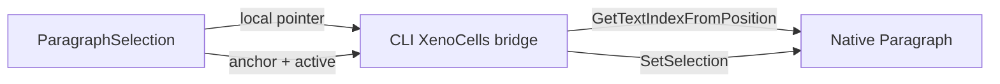
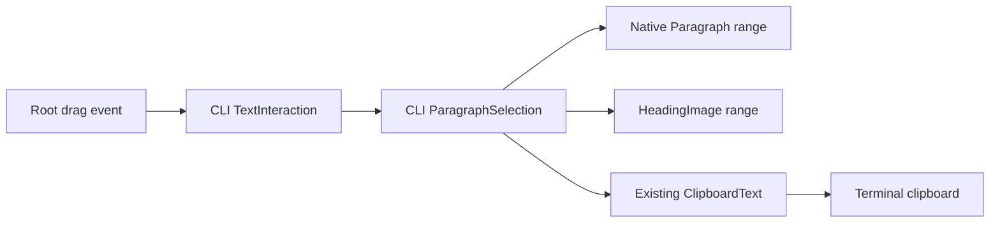

# Phase 70.2 — Rich transcript selection

**Status: implementation and sequential code reviews passed 2026-10-07. The operator-approved one-assistant-card scope now has a reviewed implementation; focused interaction, bridge, rendering and terminal-extension checks pass. Merge, Native AOT artifact verification and operator-installed Ghostty acceptance remain open.**
Depends on the approved [foundation](phase-70.1-text-interaction-foundation.md);
parent [Phase 70](phase-70-tui-text-interaction.md).

The parent's [manual verification exception](phase-70-tui-text-interaction.md#manual-verification-exception)
applies: agent source/controlled verification supports design and implementation; operator
installed Ghostty/Retina checks close live acceptance. This does not resolve the rich-selection
contract or remove the foundation dependency.

## Requirement

Let the user drag through rich chat content and copy its meaningful text while retaining
Kitty-rendered headings and frames, native terminal body/code text, syntax highlighting,
wrapping and streaming. Single-paragraph selection is already available; it does not meet
continuous rich selection. Code snippet Copy remains a distinct convenience.

## Discovery and boundary

| Fact | Implication |
|---|---|
| `Paragraph` owns native selection and is sealed; MarkdownControl/DocumentFlow has no document selection coordinator in pinned 3.10.0. | Public document selection is a real gap, not an `IsSelectable` toggle. |
| Controlled Forge drag from paragraph one into paragraph two copies only paragraph one, in both themes. | Add a regression observation for the cross-paragraph requirement. [Evidence](phase-70.1-text-interaction-foundation_completed.md#controlled-probes). |
| Image headings are Kitty placeholder cells, not ordinary text selection owners. | Retain logical heading text for selection/copy; do not decode screen pixels/placeholders. |
| Source Markdown, rendered text and visual wraps differ. | Lock text semantics and logical-to-visual mapping before choosing an implementation. |

Owner remains Forge CLI TUI. Reusable terminal selection/clipboard glue belongs in the settled
Forge-owned Terminal Extensions package; Forge-specific Markdown and Kitty rendering stays in the
TUI. Do not fork XenoAtom or enlarge `XenoCells` private access as an assumed solution. Library
version upgrades require verified public capabilities and regression evidence, not extrapolation
from CodeAlta.

## Forge-owned extension feasibility

Current [source-boundary observations](phase-70.2-rich-transcript-selection_completed.md#source-boundaries--2026-10-06)
name the native mapping cases and package-family cost. The [verified controlled probe](phase-70.2-rich-transcript-selection_completed.md#bounded-public-geometry-probe--2026-10-06)
found an essential public point/range gap. It does not prove a clean Forge-owned extension seam.

The operator selected unchanged public packages plus Forge-owned extensions. Foundation's 22
public-only behavior cases do not prove continuous rich selection. No fork, upstream write or
layout-reimplementation route is authorized. The R4 Type-2 exception below is limited to two
version-pinned `UnsafeAccessor` calls in the CLI's existing private-access containment; the settled
Terminal Extensions package remains the public clipboard/menu extension.

| Required boundary | Pinned capability / remaining cost |
|---|---|
| Semantic document | Public MarkdownDocumentContent.GetBlock and DocumentFlowBlock.CreateVisual materialize visuals; they expose no canonical source-offset/range map. MarkdownControl is sealed and its builder internal. [Content](https://github.com/XenoAtom/XenoAtom.Terminal.UI/blob/6f4e0cde3890d8ce2510ac0451b861863e4aeeaa/src/XenoAtom.Terminal.UI.Extensions.Markdown/MarkdownDocumentContent.cs), [block](https://github.com/XenoAtom/XenoAtom.Terminal.UI/blob/6f4e0cde3890d8ce2510ac0451b861863e4aeeaa/src/XenoAtom.Terminal.UI/Controls/DocumentFlowBlock.cs). |
| Hit/range mapping | Paragraph's native wrapped-line selection mapping is private. Public Text/Runs and visual bounds alone do not identify offsets for repeated words, graphemes or proportional heading images. A public adapter would need a verified text/layout map; do not assume screen-text search or copied native layout code is adequate. |
| Drawing | Public CellBuffer.OverlayCellStyle can mark terminal cells; Forge already owns heading logical text/font geometry. This is a candidate rendering seam, not a demonstrated heading/rich-range renderer. [Overlay](https://github.com/XenoAtom/XenoAtom.Terminal.UI/blob/6f4e0cde3890d8ce2510ac0451b861863e4aeeaa/src/XenoAtom.Terminal.UI/Rendering/CellBuffer.cs#L268). |
| Package ownership | Reusable native clipboard/menu extensions use the foundation package; Forge Markdown/Kitty semantics stay CLI. A second selection package or a larger extension API is not justified until the required map is proved. |

The probe covered two Paragraphs, repeated words, narrow wrapping, graphemes and an actual
image heading beside code. It recorded local highlighting, exact copied text and reflow
without private access, but found no public point/range boundary for continuous selection.
Every promised content case below still needs a decision; the probe does not narrow range scope.

The [narrow native isolation](phase-70.2-rich-transcript-selection_completed.md#narrow-native-paragraph-isolation--2026-10-06) reproduced leading-space wrap budgeting loss for ASCII and two-cell graphemes while exact Copy succeeded. Native whitespace/wrap correction needs a reviewed design. No patch is approved.

### Feasibility result — 2026-10-07

The bounded investigation returned **NO**. The Forge-owned extension can clear or copy a
Paragraph's already-native range, but cannot create the two endpoints that continuous card
selection needs:

| Required operation | Public result |
|---|---|
| Paragraph-local point → source-text index | Missing. `Paragraph.GetTextIndexFromPosition(string, int, int)` is private. Its wrapped-line cache, indent/prefix budgeting, alignment and grapheme mapping are private too. |
| Apply a native anchor/active range | Missing. `Paragraph.SetSelection(int, int)` is private. |
| Clear/copy an existing native range | Available through public `ISelectionOwner.ClearSelection()` and `Paragraph.TryCopySelection`, but insufficient because no cross-block endpoints can be established. |

The source inspection covered the public Paragraph, selection, TerminalApp, DocumentFlow and
Markdown surfaces, plus the existing Terminal Extensions package. No clean public extension seam
exists on the pinned public contract. Recreating native layout, a package upgrade, upstream write
or fork violate the settled boundary. This is an essential-gap result, not an implementation defect
or default-path acceptance result.

### R4 proposed Type-2 bridge — corrected pending design review

The existing CLI already isolates six AOT-safe `UnsafeAccessor` calls in `XenoCells`, pinned by
contract tests to XenoAtom 3.10.0. Extend that existing private-access containment with exactly
two Paragraph bridges:

| Fact | Locked proposed boundary |
|---|---|
| Scope | Only `Paragraph.GetTextIndexFromPosition(string, int, int)` and `Paragraph.SetSelection(int, int)`; no field access, synthetic input, selection-owner replacement, reflection or unrelated UI private member. |
| Owner | CLI `XenoCells` owns the Type-2 containment beside the existing six private XenoAtom calls. Terminal Extensions retains its public Paragraph Copy menu. The CLI owns card ordering, copy semantics and feedback. |
| Safety | Exact XenoAtom UI 3.10.0 package pin, compile-time `UnsafeAccessor`, no new bridge assembly, and CLI contract tests that execute both bridges against a wrapped Paragraph, pin both member names/signatures, and enforce the exact `XenoCells` allowlist. |
| Removal | Delete the bridge and use public Paragraph APIs when XenoAtom exposes equivalent point mapping and range application; `XenoCells` and the CLI README record this removal condition. |
| Failure | A missing/changed private member fails build/Native AOT verification; no runtime reflection fallback exists. |

This is a Type-2 implementation exception: it is reversible by deleting one adapter once public
APIs exist, touches only local terminal presentation, and has no tier, datastore, identity,
credential, endpoint or clipboard-payload change. It is not a new package, a fork or an upstream
write. The full R4 design remains subject to the required sequential reviews.

## Supervisor design R3 — proposal awaiting Type-1 decisions

**[design:supervisor] began 2026-10-07 16:18:24 UTC.** `TextInteraction` remains the only
cross-source interaction coordinator: it claims the active source, chooses Copy before Stop, and
reports feedback. The existing `ParagraphSelection` wrapper becomes the card-local rich selection
owner: it retains its realized member order/lifetime, translates an active drag into ranges for its
native Paragraphs and Forge-owned HeadingImages, and composes that card's exact plain text.
`TextInteraction` invokes that card owner; it does not acquire card topology or source anchors.
The CLI does not reproduce wrapping, Unicode cell widths, syntax rendering or clipboard behaviour.
The settled public route is the existing Forge-owned Terminal Extensions package on unchanged
pinned XenoAtom packages, with no upstream or fork write. R4 extends the CLI's existing private
containment with its two named, version-pinned `UnsafeAccessor` calls instead of reproducing native
layout; it has no fallback route.

### Proposed interaction contract

| Case | Proposed result |
|---|---|
| Drag within one rendered assistant card | Select every eligible source block between the two endpoints in visual/document order. A regular paragraph, list item, quote and code body reuse their native source range; a Forge image heading uses its retained logical text and Forge-owned geometry. |
| Drag across a card boundary, user message, timestamp, tool/status row, avatar, frame, link control or code-copy button | Clear the in-progress rich range and let the existing control own its action. No cross-card selection is silently implied. |
| Ctrl/Cmd+C or the existing Copy command while a rich range exists | `TextInteraction` asks the active card owner for canonical plain text and sends it through `ClipboardText`; a clipboard failure reports the existing failure state and never cancels the run. Without a rich range, retain the current editor/Paragraph/Stop order. |
| Paragraph context-menu Copy while a rich range exists | The existing Terminal Extensions menu keeps its attachment, popup and stale-source eligibility guard. Its fixed Copy command asks the card owner whether that card still has a current rich range, then invokes its exact text callback; it does not compose Forge content. |
| Reflow or scrolling after the drag ends | Preserve source anchors and repaint the same logical range after layout. A new drag derives fresh points from the live layout. |
| Streaming replacement, detached content, or an open stale menu | Clear the rich range structurally before replacement or action. The user can select the settled content again; no stale text is copied. |
| Double-click, Shift-click, and non-left pointer input | Retain native single-Paragraph behaviour. They do not create a second document-selection mode. |

**Scope decision — operator approved 2026-10-07:** selection spans one rendered assistant reply
card only. It includes paragraphs, lists, quotes, code and eligible headings; it excludes user
cards and transcript chrome. Tables and collapsed content remain deferred.

The proposed plain-text copy order is source order with a newline between list items and code
lines, and one blank line between other block boundaries. It copies link labels, not URLs; heading
logical text, never Kitty placeholder cells; and no decorative prefix, frame, soft wrap or syntax
colour. Tables and collapsed content are deliberately out of the first contract until the operator
chooses their semantics; they remain unselectable rather than partially copied.

### Behaviour → owner

| Behaviour | Owner | Why |
|---|---|---|
| Point/range mapping inside a Paragraph | XenoAtom Terminal UI `Paragraph`, reached only through CLI `XenoCells` | Paragraph owns wrapped layout, grapheme widths, indents and selection rendering; `XenoCells` contains the two pinned private calls. |
| Cross-source claims, Copy-versus-Stop and feedback | `TextInteraction` in `/Users/ameerdeen/progs/forge-mcl/src/ForgeMission.Cli/Tui` | The CLI README assigns `forge chat` presentation and text-source coordination there. |
| Card-member ordering, range projection, anchors and canonical copy text | `ParagraphSelection` in `/Users/ameerdeen/progs/forge-mcl/src/ForgeMission.Cli/Tui` | It already owns the bounded registry and retirement of realized Paragraphs in one rendered card. |
| Heading mapping/overlay | `HeadingImage` in `/Users/ameerdeen/progs/forge-mcl/src/ForgeMission.Cli/Tui/Graphics` | It alone owns logical heading text and its Kitty-image layout. |
| Paragraph context-menu command, stale eligibility and truthful clipboard result | `Katasec.Forge.Terminal.Extensions` | Its README owns fixed native text menus, invocation guards, selection extraction and clipboard-result vocabulary. |
| Theme values | `ForgeTheme` → `ForgeStyles` | Existing semantic `Selection` is the selected range background in both themes. |

### Reuse and boundaries

| Need | Existing implementation checked | Decision |
|---|---|---|
| Drag target while the first Paragraph has pointer capture | `TerminalApp.DispatchMouseEvent` keeps the capture as event target but root `HitTest(UiX, UiY)` still resolves the live point. | Reuse root hit-testing; add no input backend or synthetic event path. |
| Body, list, quote and code selection mapping | `Paragraph` already maps point, wrapping, prefixes, tab stops and graphemes, but both point mapping and range setter are private. | Use only the R4 `XenoCells` bridge's two pinned methods. Do not copy native layout into Forge, write upstream or create a fork. |
| Heading source and geometry | `HeadingImage` retains logical text and `TextImages.WrapHeading` already defines its layout. | Add its range projection beside HeadingImage; do not introduce a second selection renderer or treat Kitty cells as text. |
| Paragraph context-menu Copy | `ParagraphClipboardExtensions` already owns the fixed native menu and stale eligibility closure. | Add its smallest callback overload: availability plus one exact Copy action/report. The CLI supplies only the active card's availability and text; it cannot alter menu lifetime or transport. |
| Clipboard failure/result | `ClipboardText` and `TextInteraction` from Phase 70.1. | Reuse transport/result semantics; card composition passes one exact string to `CopyText`. |

### Security, UI and default path

This is local presentation and an explicit clipboard write: no hosted tier, datastore, identity,
credential, network endpoint or log payload changes apply. The structural failure boundary is the
coordinator clearing its range before content replacement, detached source or stale menu action.
The selected body/code range retains the existing `ForgeTheme.Selection` token through native
Paragraph rendering; HeadingImage overlays use that same token. Dark and light, normal and
narrow Retina Ghostty remain the binding acceptance states, against the Phase 70 reference images
and [TUI graphics](../design/tui-graphics.md). Default-path acceptance remains the installed
Native AOT `forge chat` on Ghostty with no endpoint override, a real rich reply, and exact paste
comparison.

### Principles that changed a decision

| Rule | Decision |
|---|---|
| Designer 3 — No NIH | Retain the settled Forge-owned extension package and native Paragraph layout instead of a new library, a fork or a Forge text-layout implementation. |
| Designer 4 — One owner | Keep rich semantics and HeadingImage mapping in the CLI; expose only native Paragraph mechanics from the UI library. |
| Designer 7 — Minimum needed only | One drag contract and no new setting, global selection mode, source parser or separate package. |
| Designer 10 — Built-in safety | Clear selection at the existing replacement/detachment boundary, preventing stale-copy recovery paths. |
| Designer 11 — Verified means done | Require controlled range/reflow/streaming tests, Native AOT and installed Ghostty copy/paste observations. |

### Rejected alternatives

- A Forge-only adapter that recreates Paragraph wrapping/hit mapping: it duplicates native Unicode,
  prefix, alignment and reflow logic and has already failed the public-boundary probe.
- Broad private access or a new general helper: R4 permits only the two named `Paragraph` methods
  in the existing CLI `XenoCells` containment, with the stated pin, tests and removal path.
- An upstream XenoAtom contribution or Forge-maintained fork: the settled Phase 70 library decision
  is Forge-owned extensions on unchanged package versions, with no upstream/fork writes.
- Terminal-native selection: it conflicts with the TUI's mouse reporting and cannot include
  logical Kitty headings.

### Locked Type-2 exception

1. **Type-2 bridge — locked 2026-10-07 17:15:42 UTC:** two methods in existing CLI `XenoCells`:
   `Paragraph.GetTextIndexFromPosition(string, int, int)` and `Paragraph.SetSelection(int, int)`.
   The ownership review corrected placement from Terminal Extensions. No broader private access may
   be inferred.
2. **Range scope — approved 2026-10-07:** one assistant reply card, excluding user cards and
   transcript chrome; tables and collapsed content are deferred.

### Workflow timestamps

The recorded design-review boundaries are below. A reviewer result without its own emitted end
timestamp is deliberately marked unavailable rather than reconstructed.

| Stage / role / round | Start (UTC) | End (UTC) | Evidence |
|---|---|---|---|
| `[design:supervisor]` | 2026-10-07 16:18:24 | Open — Type-1 decision pending | This R3 proposal |
| `[review-design:simplicity]` | 2026-10-07 16:21:03 | Unavailable | R1 required the single-owner correction. |
| `[review-design:simplicity:r2]` | 2026-10-07 16:24:18 | Unavailable | Full PASS after `TextInteraction` became the sole interaction owner. |
| `[review-design:ownership]` | 2026-10-07 16:25:28 | 2026-10-07 16:28:39 | R1 FAIL: card lifecycle/extraction and native menu ownership corrected. |
| `[review-design:simplicity:r3]` | 2026-10-07 16:30:13 | Unavailable | Full PASS on the corrected owner split. |
| `[review-design:ownership:r2]` | 2026-10-07 16:30:13 | 2026-10-07 16:32:26 | Full PASS. |
| `[design:supervisor:r2]` | 2026-10-07 16:36:30 | 2026-10-07 16:38:43 | Restored the settled Forge-owned extension route and swept stale fallback language. |
| `[review-design:simplicity:r4]` | 2026-10-07 16:36:30 | Unavailable | Required the full active-spoke sweep of stale fallback language. |
| `[review-design:simplicity:r5]` | 2026-10-07 16:38:43 | Unavailable | Full PASS after the sweep. |
| `[review-design:ownership:r3]` | Unavailable | 2026-10-07 16:40:06 | Full PASS after the sweep. |
| `[scope:supervisor:r2]` | 2026-10-07 16:47:35 | 2026-10-07 16:47:35 | Operator approved the one-assistant-card range scope. |
| `[investigate:implementer]` | 2026-10-07 16:47:35 | 2026-10-07 16:51:21 | NO: the pinned public API lacks both required Paragraph operations. |
| `[design:supervisor:r3]` | 2026-10-07 16:58:39 | 2026-10-07 17:10:43 | Proposed the bridge; ownership review required the containment correction. |
| `[review-design:simplicity:r6]` | 2026-10-07 17:04:54 | 2026-10-07 17:07:18 | Required execution coverage for both bridge calls and an extensions-package accessor allowlist. |
| `[review-design:simplicity:r7]` | 2026-10-07 17:07:34 | 2026-10-07 17:08:39 | Full PASS after the execution/allowlist correction. |
| `[review-design:ownership:r4]` | 2026-10-07 17:08:39 | 2026-10-07 17:09:24 | FAIL: corrected private-access ownership from Terminal Extensions to CLI `XenoCells`. |
| `[design:supervisor:r4]` | 2026-10-07 17:10:43 | 2026-10-07 17:15:42 | Applied the ownership correction; R9 simplicity and R5 ownership PASS; design locked. |
| `[review-design:simplicity:r8]` | 2026-10-07 17:11:45 | 2026-10-07 17:13:27 | Required the removal condition move to `XenoCells`. |
| `[review-design:simplicity:r9]` | 2026-10-07 17:13:27 | 2026-10-07 17:14:29 | Full PASS after the removal-condition correction. |
| `[review-design:ownership:r5]` | 2026-10-07 17:14:29 | 2026-10-07 17:15:04 | Full PASS after the ownership correction. |
| `[implementation:implementer]` | 2026-10-07 17:27:58 | Unavailable | Completed the approved implementation, including replacement/detach lifecycle repair and heading source-span correction. |
| `[review-implementation:simplicity]` | Unavailable | Unavailable | First review found wrapped-heading source-offset loss and a stale TextArt test; both corrections were independently re-reviewed PASS. |
| `[review-implementation:ownership]` | Unavailable | 2026-10-07 20:50:03 | PASS: the bridge, range/policy, heading projection and public menu callback remain with their named owners. |
| `[verification:supervisor]` | Unavailable | 2026-10-07 20:59:28 | Debug CLI build: 0 warnings/errors; focused TextArt, interaction, bridge-contract and menu checks: 84/84; terminal extensions: 27/27; Release Native AOT publish completed successfully for `osx-arm64`. The full suite was not recorded: the ambient `MCL_API_KEY` first invalidated its missing-key case and the runner’s foreground window left the retry incomplete. |

## Locked design decisions

| Decision | Locked outcome |
|---|---|
| Range scope | One assistant reply card; paragraphs, lists, quotes, code and eligible headings. User cards, chrome, tables and collapsed content excluded. |
| Copy semantics | Source order; newline between list items/code lines; blank line between other blocks; labels not URLs; logical heading text; no chrome, soft wraps or colour. |
| Stable identity | Preserve source anchors on reflow/scroll; clear structurally before streaming replacement, detach or stale-menu action. |
| Geometry and gestures | `Paragraph` maps live pointer positions through its native layout; `HeadingImage` supplies its retained logical geometry. Double/Shift/non-left retain native single-Paragraph behavior. |
| Ownership and API | CLI `XenoCells` contains exactly two private Paragraph calls; `ParagraphSelection` composes card ranges; `TextInteraction` owns policy; Terminal Extensions owns menu/clipboard behaviour. |
| Visuals and themes | Native Paragraph selection and HeadingImage overlay use existing `ForgeTheme.Selection`/`ForgeStyles` in light/dark normal/narrow Ghostty. |

## Entry points and gates

| Area | Read / prove |
|---|---|
| Product paths | `/Users/ameerdeen/progs/forge-mcl/src/ForgeMission.Cli/Tui/ChatScreen.cs`, `Transcript.cs`, `ForgeMarkdown.cs`, `ForgeCodeBlockRenderer.cs`, `Graphics/HeadingImage.cs`, `ForgeTheme.cs`, `ForgeStyles.cs`; CLI component README. |
| Library paths | Pinned `Controls/Paragraph.cs`, `Controls/DocumentFlow.cs`, `Controls/FlowDocument.cs`, Markdown `Controls/MarkdownControl.cs` and rendering models. Confirm public surfaces before proposing types. |
| Security / philosophy | Local text only; hosted data/identity/tier changes N/A unless scope changes. Clipboard read only on explicit action, no logging of copied payload. Named selection/renderer/clipboard owners and structural failure containment required. |
| UI | Explicitly name [Desktop Interaction Principles](../design/desktop-interaction-principles.md), [UI Design System](../design/ui-design-system.md), [TUI graphics](../design/tui-graphics.md), and foundation references/theme map in all assignments. Operator verifies on laptop Retina only; supervisor records attributed evidence under the parent exception. |
| Default path | Foundation's installed Native AOT, normal project/sign-in/endpoint and Ghostty route apply unchanged; use a real rich reply and compare clipboard text to the locked semantics. In-memory selection tests supplement acceptance. |

## Ordered tasks

| Task | State | Done when |
|---|---|---|
| 1. Lock range and semantic scope | Done — operator scope plus locked two-method `XenoCells` exception. | Recorded above with R9 simplicity and R5 ownership PASS. |
| 2. Design and public contract review | Done — design locked 2026-10-07 17:15:42 UTC. | Actual APIs, lifecycle, visual reference and Type-2 removal path reviewed sequentially. |
| 3. Plan and review | Done — supervisor approved plan 2026-10-07 17:27:58 UTC. | Two `XenoCells` bridges; card-owned range composition; `TextInteraction` policy; HeadingImage overlay; public menu callback; exact contract/integration/menu coverage. No renderer change. |
| 4. Implement and review | Done — implementation, correction loop and sequential reviews complete. | Focused checked evidence is recorded in the workflow table; see Task 5 for merge/default-path work. |
| 5. Merge, install and accept | Next — automated release verification, merge and operator live acceptance. | Native AOT and required checks pass; normal artifact installed; operator proves continuous selection and exact Copy through real mixed content in both themes on Retina, supervisor assesses and records evidence. |

### Approved implementation plan

The approved plan changes only the existing CLI and Terminal Extensions components. `XenoCells`
gains the two locked accessors and its eight-member contract allowlist; `ParagraphSelection`,
`TextInteraction` and `HeadingImage` implement card range, policy and logical heading rendering;
Terminal Extensions adds a guarded menu delegation callback. CLI and extension READMEs document
their respective boundaries. Focused bridge, interaction and menu tests precede full tests,
zero-warning Native AOT publish, package verification and installed default-path acceptance.
`ParagraphSelection` already finds nested code Paragraphs, so `ForgeCodeBlockRenderer` does not
change.

| `[plan:implementer]` | 2026-10-07 17:16:27 | 2026-10-07 17:23:00 | Initial plan returned. |
| `[review-plan:simplicity:r10]` | 2026-10-07 17:23:00 | 2026-10-07 17:24:54 | Required removal of duplicate code-renderer registration. |
| `[plan:implementer:r2]` | 2026-10-07 17:24:54 | 2026-10-07 17:26:20 | Removed renderer change; reused wrapper discovery. |
| `[review-plan:simplicity:r11]` | 2026-10-07 17:26:20 | 2026-10-07 17:27:21 | Full PASS. |
| `[review-plan:ownership:r6]` | 2026-10-07 17:27:21 | 2026-10-07 17:27:58 | Full PASS; plan approved. |

## Done when

The locked continuous range works across all promised rich content, including logical image
heading text; copied text follows the defined semantics and never contains Kitty placeholders,
decorative chrome or soft wraps. Selection survives or is predictably resolved under streaming,
reflow, scrolling and menu focus according to the approved contract. Link and snippet actions
remain usable. Clipboard failure cannot cancel a turn. The operator performs installed
default-path and Retina checks in both themes, the supervisor records attributed evidence,
and every changed repository is merged/clean.
