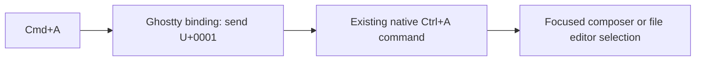

# Phase 70.3 — Mac Select All shortcut

**Status: scoped; terminal scope decision pending. No implementation approved.**
Parent: [Phase 70](phase-70-tui-text-interaction.md). Operator selected this independent
keyboard follow-up; it does not depend on the unfinished rich-selection design.

## Requirement and scope

Make Cmd+A select all text in the focused Forge composer or `/edit` editor on macOS.
Keep the change at the terminal shortcut boundary, reusing native Select All. No clipboard,
editor/range, renderer, package or generic keyboard-framework changes. The icon-label request
and package visibility issue are separate tasks.

## Verified boundary and proposed mapping

The installed Ghostty app's static Info.plist reports **1.3.1 / build15212**. Its shipped
configuration manual documents `text:` with Zig string escapes. The native Terminal2.2.0
decoder maps U+0001 to Ctrl+A; native UI3.10.0 registers `TextEditor.SelectAll` for that
gesture. No new Forge command is needed. Ghostty handles bindings before PTY input.

Candidate configuration line: `keybind = cmd+a=text:\x01`.

The existing config is `/Users/ameerdeen/Library/Application Support/com.mitchellh.ghostty/config.ghostty`;
no explicit Cmd+A binding was found there. Both checked XDG config paths were absent.
These are static file observations, not running-app or physical-key acceptance.

| Scope choice | Effect / design consequence |
|---|---|
| Current Ghostty configuration | One mapping line; normal existing-window `forge chat` launch retained. Other terminal programs receive their own Ctrl+A when Cmd+A is pressed. |
| Dedicated Forge Ghostty window | Mapping contained to a dedicated terminal launch. Requires explicit launch/default-path definition and verified argument/config isolation; not an automatic fix in an already-running window. |

The operator has been asked to choose the scope. Do not modify the shared config, introduce
a launcher or claim a Forge-only binding before that decision and design/plan reviews.
The operator requested to share a screenshot before answering; awaiting that clarification.
Installed Ghostty1.3.1 source tag resolves to `332b2aefc6e72d363aa93ab6ecfc86eeeeb5ed28`;
its [Surface](https://github.com/ghostty-org/ghostty/blob/332b2aefc6e72d363aa93ab6ecfc86eeeeb5ed28/src/Surface.zig)
and the [official binding reference](https://ghostty.org/docs/config/reference#keybind) support
the host ownership. The shipped manual is the syntax authority for this installed version.

## Owners, reuse and gates

| Behaviour / gate | Owner / condition |
|---|---|
| Forward shortcut | Ghostty configuration/terminal integration; not the clipboard extension. Reuse its `text:` binding. |
| Select editor text | Existing native TextEditorBase/TextEditorCore via Ctrl+A; retain Forge's existing editor command decoration and focus routing. [CLI ownership](https://github.com/katasec/forge-mcl/blob/d23387492de4563abe9a57d5a51dfb538745f725/src/ForgeMission.Cli/README.md). |
| Security | Local terminal input only; hosted tiers/stores/identities/secrets N/A. No clipboard read/write, permissions or OS automation change. |
| Philosophy / failure | Type2 reversible host configuration. Preserve existing config bytes; one owner for forwarding, native owner for selection. Invalid configuration must be reported; no silent fallback or automatic broad shortcut installation. Exact reversal and validation depend on chosen scope. |
| UI | Read [Desktop Interaction Principles](../design/desktop-interaction-principles.md), [UI Design System](../design/ui-design-system.md), [TUI graphics](../design/tui-graphics.md). Existing selection appearance/theme tokens remain binding; no visual values or chrome added. |
| Default path | Installed v0.9.4 at `/Users/ameerdeen/.local/bin/forge`, normal saved login/endpoint/project and Ghostty. Record the selected host configuration/launch explicitly before approval. |
| Acceptance | Parent [manual exception](phase-70-tui-text-interaction.md#manual-verification-exception) applies. No agent Ghostty GUI/input/clipboard access. Operator checks physical Cmd+A in both editor surfaces/themes; scoped terminal behaviour must match the selected choice. |

## Next and Done when

Lock the operator's terminal scope, finish the small design and sequential simplicity/ownership
reviews, then plan/review/approve one implementation. Evidence stays in a concise report;
do not create raw artifact directories.

Done when the approved mapping is installed without unrelated configuration changes, its syntax
and delivery are verified, and the operator proves physical Cmd+A selects the focused editor's
complete text without mutation, before/after mouse focus, in composer and `/edit`. Ctrl+A still
works; non-editor/modal focus does not gain a Forge global Select All action. Existing Ctrl+C
Copy remains unchanged. The observed effects outside Forge match the chosen terminal scope.
Record controlled versus manual observations honestly; clean merged task documentation alone
does not prove physical key delivery.

This scope checkpoint changes documentation only; product design/plan/code approvals,
product tests/AOT and runtime/default-path acceptance are N/A to the checkpoint. They remain
required as applicable to the chosen implementation; no implementation or completion is claimed.
