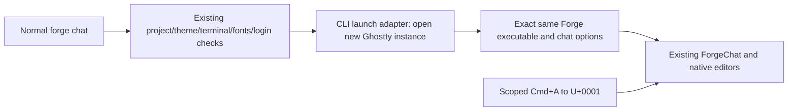
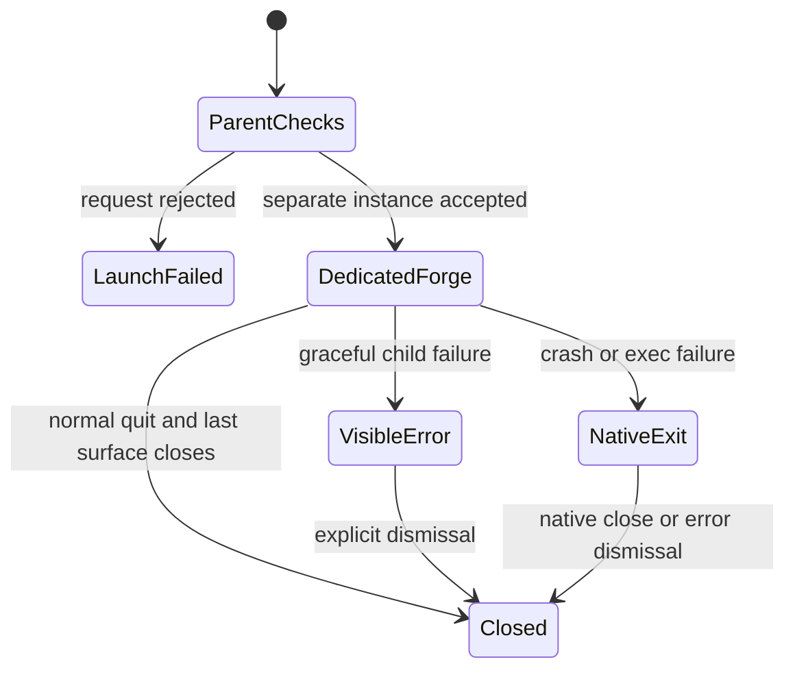

# Phase 70.3 — Mac Select All shortcut

**Status: six-file patch merged in forge-mcl PR63 after full current reviews and canonical zero-warning Native AOT verification. v0.9.5 installed/verified; operator confirmed Cmd+A and later both requested fixes work. Detailed viewport/theme observations were not supplied.**
Parent: [Phase 70](phase-70-tui-text-interaction.md). Independent keyboard follow-up;
rich transcript selection, icon labels and package visibility remain separate.

## Requirement and operator decisions

Cmd+A selects all text in Forge's focused chat input or `/edit` file editor. Ordinary Ghostty
tabs retain their shortcuts. Operator selected Forge-only, then approved: type normal `forge chat`,
a dedicated Forge window opens, and quitting Forge closes it. Original terminal shortcuts remain
normal throughout. Both `--hands` and `--project` retain their current semantics. No change to
piped chat or other operating systems. [Static feasibility](../evidence/phase-70/verification-report.md#forge-only-shortcut-feasibility)
found no supported automatic binding lifetime in an existing Ghostty1.3.1 surface.

## Design R2 — locked

Add one local launch adapter within the existing CLI in `/Users/ameerdeen/progs/forge-mcl`;
mission-control docs live in `/Users/ameerdeen/progs/mission-control-language`. The parent invokes
macOS LaunchServices to create a separate Ghostty instance with process-scoped arguments; the
child enters the same ForgeChat startup/application path. Ghostty forwards Cmd+A as U+0001 to
existing native Ctrl+A Select All. No new editor, range, clipboard, renderer, library, package,
public setting, shell helper file, IPC or background watcher.

### Entry and lifetime contract

| Boundary | Locked R2 contract |
|---|---|
| Parent admission | Existing project-file, theme, terminal/graphics/multiplexer, font and saved-login checks run first. No hosted reconnect, consent or hands attachment before launch. macOS + terminal stdin/stdout + no child marker opens the window; other paths enter existing chat. |
| Child marker / cwd | Process-scoped `FORGE_CHAT_WINDOW=<cwdBase64>:<endpointBase64-or-minus>`. Each Base64 field represents UTF-8 text; `-` means absent endpoint, while an empty second field means present empty endpoint. Exactly two fields; cwd must decode to a nonempty absolute path. The dedicated-child command entry decodes/validates, restores cwd and exact endpoint null/present value before normal resolution. Invalid encoding or inaccessible cwd reports1 and joins the visible held-error boundary; no launch or hosted work follows. Marker is private launch state, not authorization. All dedicated surfaces receive it; it bypasses only re-launch, never checks/consent. Unmarked, non-Mac and piped paths retain existing behaviour. |
| Executable / options | Use exact native `Environment.ProcessPath`; reject absent path or dotnet host with a named error. Serialize `chat`, optional `--hands`, and explicit absolute `--project <resolved home>` for both commands. Original cwd, rather than selected Project, remains `/edit` base. |
| LaunchServices | `/usr/bin/open`, structured `ProcessStartInfo.ArgumentList`, `-n -b com.mitchellh.ghostty --args ...`; no shell for this call. Capture stdout/stderr, wait only for open's request result, return0 on accepted request with `Opened Forge chat in a new window.`. This is launch acceptance, not child chat success. Failure returns1 with a concise launch error. |
| Every surface | Identical `--initial-command=shell:<quoted argv>` and `--command=shell:<quoted argv>`. Thus new windows/tabs/splits in this instance start Forge rather than a normal shell with its mapping. No `-e` first-surface-only alternate implementation. |
| Argument quoting | Single-quote every executable/argument, replacing apostrophes with the standard POSIX quote splice. Ghostty's Darwin command implementation already supplies `exec -l`; do not prepend another exec. No variable/command expansion. Controlled native-shell probe passed4/4 adversarial path/argv cases. |
| Protected profile | Keep normal top-level Ghostty configuration/display values; clear recursive `config-file` includes with `--config-file=` so later included files cannot replace the commands, marker or mapping. The current normal config has only font-size16 and no includes. Dedicated instances intentionally do not apply additional config-file includes; ordinary Ghostty still does. Theme loading replays existing configuration over theme defaults (pinned Config.zig4376–4470), preserving these overrides. No copied config/parser or generated profile file. |
| Scoped overrides | `--keybind=cmd+a=text:\x01`, `--working-directory="<original cwd>"` (literal outer quotes), `--env=FORGE_CHAT_WINDOW=<encoded context>`, `--input=`, `--shell-integration=none`, `--initial-window=true`, `--wait-after-command=false`, `--quit-after-last-window-closed=true`. The single encoded context preserves exact `FORGE_API_ENDPOINT` absence/value despite Ghostty env trimming; child restores it before existing endpoint selection. Never serialize saved keys or credentials in argv/logs. |
| Restoration | Do not pass window-save-state=never or open -F: both alter ordinary persistent state. Any native restored surfaces also use the protected global Forge command; child restores original cwd despite saved cwd. Window count/activation remain AppKit-owned and require operator observation. Do not claim saved-state isolation; no new restoration preference or state deletion. |
| Graceful error | Dedicated child reports nonzero startup/chat results and waits for an explicit key to close, after normal UI cleanup. The command-entry adapter owns this small failure presentation; no second UI loop. Piped/non-Mac/ordinary parent errors retain existing behaviour. Unexpected handled child exceptions report1 visibly. |
| Quit / crash | Normal Ctrl+D completes existing chat cleanup, returns0, and Ghostty closes that surface. Last surface closes the dedicated instance. Native very-early abnormal-exit protection remains enabled; an exec failure may retain its native error surface for user dismissal. A crash never needs to restore another process's shortcuts/configuration. |
| Environment | LaunchServices documents inherited environment. Only the encoded launch context requires an explicit configured env override; use saved platform login and existing profile discovery. No global environment, terminal configuration file or OS permission modification. |

### Owners, reuse and gates

| Behaviour | Owner / reuse |
|---|---|
| Launch, options, result/error presentation | Existing Forge CLI startup owner; [CLI README](https://github.com/katasec/forge-mcl/blob/d23387492de4563abe9a57d5a51dfb538745f725/src/ForgeMission.Cli/README.md#owns). One local process boundary adapter, not a new component. Existing ProcessStartInfo patterns checked; platform-login browser opener does not provide isolated terminal configuration/arguments. |
| Terminal instance, PTY, command execution and host binding | Existing Ghostty and macOS LaunchServices; installed open(1) documents -n/--args/inheritance. Ghostty1.3.1 pin332b2aefc6e72d363aa93ab6ecfc86eeeeb5ed28; command/path/io/Config/Exec and macOS restoration sources govern exact options. |
| Select complete focused editor text | Existing Terminal2.2.0 U+0001 decoder and UI3.10.0 TextEditor SelectAll command, with existing Forge decoration/focus routing. No Forge global Select All or native alias. |
| Project, hosted identity, history and hands | Existing ForgeChat/client flow; no new data/auth contract or hosted calls in the parent. |
| Security Architecture | Hosted tiers/stores/identity changes N/A: local CLI process boundary only. Existing saved login remains credential owner; no keys in arguments, new permissions, OS hooks or clipboard operations. Quote paths as data; injected shell strings must roundtrip literally. |
| Engineering Philosophy | Type2 reversible CLI launch boundary: reverting the release removes automatic launch; shared config bytes untouched. Fixed Mac default, no user knob. Process identity contains mapping through abnormal exit. Explicit request failure and held child error distinguish request acceptance from chat success. |
| UI references and tokens | Read Desktop Interaction Principles, UI Design System, TUI graphics. Operator screenshots identify composer/editor; existing foundation light/dark galleries and ForgeTheme/ForgeStyles/native selection remain binding. Owned change is key delivery/window launch only; no new visual chrome/styles/colors. Laptop Retina normal/narrow windows, light/dark, focus/modal/quit/error states. No agent live Ghostty access; parent manual exception applies. |

### Default path and Done when

The new default for interactive macOS `forge chat` and `forge chat --hands` is the published
Native AOT executable opening a dedicated Ghostty1.3.1 instance, from normal supported Ghostty
(not tmux), saved login, normal Project and theme. No caller child marker or endpoint override
for default acceptance. The dedicated top-level config preserves current font-size16; includes
are intentionally disabled only there. Linux/Windows and redirected input/output retain the
same existing current-terminal/line path. Publish an unused CLI release through the normal
merged-main release workflow and install its complete unchanged ZIP/sidecars before acceptance.

Done when actual current design/plan/code reviews pass; focused tests prove exact context serialization (trailing whitespace/Unicode/quotes), null/present/empty endpoint distinction, malformed context and cwd-restoration errors, quoted host cwd, launch gating,
no recursion, exact project/cwd/options and literal adversarial argv; failed launch and child
startup errors are visible; canonical full tests and Native AOT pass with zero warnings through the existing PR-event Terminal Extensions verification job (no dispatch/publication or workflow changes);
product/docs PRs are merged and the published CLI is installed. Operator then proves ordinary
`forge chat` opens the dedicated window, Cmd+A selects complete focused composer/editor text
without mutation, before/after mouse focus, in light/dark at normal/narrow Retina size. Ctrl+A
and selection-aware Ctrl+C remain; modal/non-editor focus gains no global editor action.
Normal quit closes the dedicated window, extra dedicated tabs also run Forge, graceful errors
remain readable, and ordinary Ghostty tabs/shortcuts and config-file bytes remain unchanged.
Source/controlled checks are not physical/default-path PASS.

### Principles that changed decisions

| Designer rule | Decision |
|---|---|
| 3 No NIH / 4 One owner | Reuse host binding and native SelectAll; keep only launch composition in CLI. |
| 7 Minimum needed | No generic keyboard framework, helper script, copied terminal config/parser or OS hooks. |
| 10 Built-in safety | Dedicated process and protected commands replace global config restoration on exit. |
| 11 Verified means done | Separate LaunchServices request result, child result, controlled probes and operator installed acceptance. |

Rejected: lasting shared mapping; config rewrite/reload cleanup; AppleScript frontmost matching;
unconsumed host SelectAll; direct: quoting (spaces unsupported); extra shell exec prefix
(reproduced exit127); first-surface-only command; copied resolved profile or general launcher framework;
restoration preference overrides. Prior investigations are in the single report.

## Review/next

R2 full simplicity (all11 checks,10:44:08 UTC) and ownership (all23 behaviours/all6 checks,
10:47:21 UTC) reviews PASS. Supervisor locks this complete design on2026-10-06.
R1 corrections and timing are in the single report. No open design questions.
Operator confirmed the requested Mac shortcut works; the icon-only follow-up is tracked in the single report. Unreported matrix cases are not inferred. Current source/code/CI evidence and stage timings are in the [single report](../evidence/phase-70/verification-report.md). Approved contracts remain below.
## Implementation plan R2 — approved

Product baseline: forge-mcl main `d23387492de4563abe9a57d5a51dfb538745f725`.
PLAN APPROVED by supervisor after both complete R2 reviews. Same implementer owns this bounded plan.

| File under forge-mcl | Change |
|---|---|
| `src/ForgeMission.Cli/MacChatWindow.cs` (new) | Internal launch/context/request-result and held child-error adapter. |
| `src/ForgeMission.Cli/ForgeChat.cs` | Wrap command action; parent launch after saved login, before HTTP/client composition. Existing startup/application/cleanup remain. |
| `tests/ForgeMission.Mcl.Tests/Cli/MacChatWindowTests.cs` (new) | Real composed argv and controlled process/restoration/dismissal tests. |
| `tests/ForgeMission.Mcl.Tests/Cli/ForgeChatTests.cs` | Actual redirected-command subprocess regressions; preserve admission/hands/lifetime cases. No dynamic interactive-parent proof promised. |
| `src/ForgeMission.Cli/README.md` | Existing CLI owner inventory and failure boundary. |
| `README.md` | Usual Mac launch/quit/shortcut, recursive-include exclusion, native executable and unchanged piped/non-Mac behaviour. |

All new contracts are internal to the CLI adapter; no component/public API/dependency/TUI/config/workflow change.

| Contract | Signature / complete semantics |
|---|---|
| Admission | `ShouldLaunch(bool isMac, bool interactive, string? marker) → bool`: interactive Mac plus absent marker only. Present-empty is a child requiring validation. |
| Child eligibility | `ChildMarker(bool isMac, bool interactive, string? marker) → string?`: ignore marker on non-Mac/redirected paths. |
| Encoding | `EncodeContext(string workingDirectory, string? apiEndpoint) → string`; `DecodeContext(string marker) → (string WorkingDirectory, string? ApiEndpoint)`: exact two-field strict UTF8 Base64, nonempty absolute cwd, endpoint minus/empty/value distinction per locked design. |
| Command entry | `RunCommandAsync(Func<Task<int>> runChat, string? marker, Action<(string WorkingDirectory, string? ApiEndpoint)> restoreContext, Action dismissError, TextWriter error) → Task<int>`: unmarked calls existing chat directly; marked decode/restore before chat. Restore failure prevents chat. Dedicated nonzero result/handled exception returns1 visibly and dismisses once after existing cleanup; success never waits. |
| Restoration | `RestoreContext((string WorkingDirectory, string? ApiEndpoint) context, Action<string> changeDirectory, Action<string, string?> setEnvironment) → void`: cwd first, exact `FORGE_API_ENDPOINT` second. Real .NET functions in production. |
| Request composition | `BuildOpenStartInfo(string executable, bool hands, string projectHome, string originalCwd, string? apiEndpoint) → ProcessStartInfo`: fixed open executable/structured args, identical quoted Forge commands/all locked overrides. |
| Request outcome | `LaunchAsync(string? executable, bool hands, string projectHome, string originalCwd, string? apiEndpoint, TextWriter output, TextWriter error, Func<ProcessStartInfo, Task<(int ExitCode, string StandardOutput, string StandardError)>>? start = null) → Task<int>`: reject absent/missing executable or dotnet host before process start; accepted result0 prints locked message; nonzero/start failure visibly1. |
| Process boundary | `StartProcessAsync(ProcessStartInfo startInfo) → Task<(int ExitCode, string StandardOutput, string StandardError)>`: start once, concurrently drain both redirected streams, await request-process exit, dispose. Never wait for Ghostty lifetime. |

Production entry uses real restoration and intercepted key reading. Tests use narrow internal
delegates, not runtime settings or alternate chat startup. Marker remains process-scoped so the
same RunAsync admission bypasses only relaunch. Helpers follow entry points.

### Sequence and reuse

After PLAN APPROVED, create `adeen/phase70-mac-select-all` from intended current main.
Update existing owner inventory, implement adapter and minimal command wiring, then focused tests
and user docs; freeze source for current full code reviews. Supervisor owns PR/CI, merge,
unused-version normal release, complete ZIP installation and manual acceptance.

Reuse existing ForgeChat startup/application/cleanup and .NET ProcessStartInfo/ArgumentList/
WaitForExitAsync. Browser opener lacks isolated terminal arguments/result boundary. Use native
SelectAll unchanged; UTF8/Base64/path built-ins, one tuple context and one result tuple; one POSIX
quote function and one composed child command. No interfaces/options/IPC/script/config parser.
Held error boundary is required because normal graceful child failure otherwise disappears.

### Verification observations

| Layer | Required current observation |
|---|---|
| Context/restoration | Exact Unicode/quotes/backslashes/trailing-whitespace cwd and null/present-empty/value endpoint; wrong field count, invalid Base64/UTF8, empty/relative cwd rejected. Inaccessible cwd: no chat or endpoint setter; visible1; one dismissal. Cwd→endpoint→chat ordering. |
| Controlled admission/recursion | Mac/non-Mac, both redirected streams, absent/present/empty marker predicates; eligible child callback runs once and tested marker gate prevents relaunch. These tests do not execute actual OS/Console admission. |
| Source command/preflight wiring | Root and BOTH reviewers inspect exact current BuildCommand and FULL RunAsync: eligible marker wraps exact existing RunAsync(Hands(result), project flag) callback; every project/theme/terminal/graphics/font/login preflight return precedes launch; launch returns directly before ServiceCollection/HTTP/client/reconnect/consent/hands. Existing application/cleanup stay. SOURCE evidence, not executed interactive-parent unit PASS. |
| Actual redirected command | Existing command subprocess with redirected streams: missing project stops before login/network; private marker cannot change normal admission or add held dismissal/launch. This proves the redirected subprocess only. |
| Request | Capture actual ProcessStartInfo/all fixed overrides, explicit project/hands distinct original cwd, identical commands; no credentials, -e, exec prefix, restoration preference or app-lifetime wait. |
| Process/results | Accepted0 exact message; nonzero/start exception visible1; real harmless subprocess success/failure drains concurrent stdout/stderr. Never execute open/Ghostty. |
| Shell | Execute actual composed command in controlled native shell; exact executable/argv containing spaces, both quotes, backslashes, dollar/backticks and Unicode. No implementation-mirroring quote assertions as sole proof. |
| Child/lifetime | Invalid context/restore failure prevent chat; dedicated nonzero/exception dismiss once after cleanup; success no wait; unmarked/non-Mac/piped results unchanged. |
| Existing semantics | Project/home versus /edit cwd; hands/profile/fresh consent/refusal-before-attachment; line mode; original failure after joined cleanup. |
| Managed | Focused MacChatWindowTests/ForgeChatTests, make build, process-scoped MCL_API_KEY-unset make test. Actual counts/skips/logs, zero warnings. |
| Canonical/AOT | Existing PR-event verify job full build/tests/package/current osx-arm64 AOT; inspect all warning output, source/native identity, help/version/digest. No dispatch/publication/workflow changes. Local warnings remain FAIL if run. |
| Delivery/default | Current code reviews and CI source match; product/docs merged, unused normal CLI release all native hosts/assets/checksums, complete ZIP install. Operator manual actions in Done when; controlled evidence cannot close physical acceptance. |

All raw outputs stay in `/tmp`; only the single evidence report is retained here. Security hosted
tier/store/identity changes N/A; saved login owns credentials; private launch context grants no
permission. Desktop Interaction Principles, UI Design System and TUI graphics apply: existing
operator composer/editor screenshots, light/dark galleries and ForgeTheme→ForgeStyles/native
selection remain binding at normal/narrow Retina, focus/modal/error/quit states. No visual styles added.

Implementer principles changing choices:1 native/platform reuse;2 shared startup;3 six bounded
files;4 tuples/narrow delegates;5 return material conflicts;6 separate evidence layers;7 outline
first;8 coherent small steps;9 entry points before helpers;10 visible failure contracts;11 early
returns;12 named side effects;13 current zero-warning checks;14 extract real boundaries;15
classic McCabe≤15, prefer≤10 without artificial splits. Open questions/assumptions: none.
R1 returned10:55:59 UTC; both full reviews required explicit source/controlled/default wiring evidence. R2 returned11:07:13 UTC with the same six files/APIs and that correction. Real OS/Console admission, LaunchServices and visible-window/key lifetime are operator installed-default observations. Both current full reviews PASS: simplicity all11 checks at11:11:30 UTC; ownership all28 behaviours/all6 checks at11:13:34 UTC. Supervisor independently checks compatibility, security, unchanged native dependencies, zero-warning canonical gate and manual default acceptance. PLAN APPROVED on2026-10-06; implement only this complete R2 plan. No open questions.

### Scoped code-style exception — supervisor decision

For this patch only, existing `ForgeChat.RunAsync` has manual classic McCabe complexity16,
versus baseline15. Its one added launch branch returns before client composition. Preserve the
approved minimal insertion: extracting existing startup only to reduce the score would broaden
this patch without clarifying a new boundary. New adapter functions remain at most8. This is a
recorded exception under the code-style review checklist, not a changed project threshold.
Removal: when a separately designed startup refactor meaningfully separates admission from
composition, restore≤15; reverting this launch branch also removes the exception. Supervisor
records this decision before code review; independent reviewers still assess the full method.

Implementation/current full reviews/canonical verification/merge/release/install — verified; see [delivery evidence](../evidence/phase-70/verification-report.md#mac-release-and-installation--verified-manual-acceptance-open). Operator functional acceptance of Cmd+A is recorded in the [single report](../evidence/phase-70/verification-report.md#icon-only-copy-follow-up); detailed matrix observations remain unspecified.

Test-only nesting exception: `MacChatWindowTests.AdmissionCases` uses three nested `foreach`
loops solely to enumerate the12 required OS/interactive/marker fixtures in seven lines. There
are no side effects or application decisions. Supervisor dismisses this observation with that
scope; helpers/LINQ solely to hide loop depth would obscure the data. Remove the exception if
this generator gains decisions or side effects beyond Cartesian fixture enumeration. Production
nesting rules remain unchanged.
