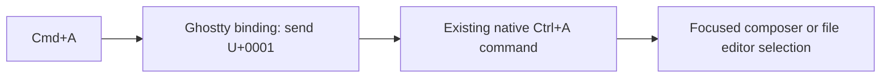

# Phase 70.3 — Mac Select All shortcut

**Status: Forge-only scope locked; no supported automatic current-window route found. Dedicated launch decision pending. No implementation approved.**
Parent: [Phase 70](phase-70-tui-text-interaction.md). Operator selected this independent
keyboard follow-up; it does not depend on the unfinished rich-selection design.

## Requirement and scope

Make Cmd+A select all text in the focused Forge composer or `/edit` editor on macOS.
Operator decision on 2026-10-06: **“yes - need forge specific”**. Other Ghostty tabs retain
normal shortcuts, and quitting Forge restores normal behaviour in the terminal used for Forge.
The operator's two screenshots on 2026-10-06 identify the chat input and file editor in
the existing Ghostty window; the transcript is not the Select All target.
Keep the change at the terminal shortcut boundary, reusing native Select All. No clipboard,
editor/range, renderer, package or generic keyboard-framework changes. The icon-label request
and package visibility issue are separate tasks.

## Verified boundary and rejected shared mapping

The installed Ghostty app's static Info.plist reports **1.3.1 / build15212**. Its shipped
configuration manual documents `text:` with Zig string escapes. The native Terminal2.2.0
decoder maps U+0001 to Ctrl+A; native UI3.10.0 registers `TextEditor.SelectAll` for that
gesture. No new Forge command is needed. Ghostty handles bindings before PTY input.

The forwarding syntax is `keybind = cmd+a=text:\x01`; installing it in the shared
configuration is rejected because it persists after Forge exits.

The existing config is `/Users/ameerdeen/Library/Application Support/com.mitchellh.ghostty/config.ghostty`;
no explicit Cmd+A binding was found there. Both checked XDG config paths were absent.
These are static file observations, not running-app or physical-key acceptance.

| Route | Effect / design consequence |
|---|---|
| Shared Ghostty mapping | Rejected by operator; changes other terminal programs and remains after Forge exits. |
| Current-window temporary binding | Static investigation found no supported automatic application-lifetime mechanism; [findings](../evidence/phase-70/verification-report.md#forge-only-shortcut-feasibility). |
| Dedicated Forge Ghostty process/window | Candidate alternative only. Requires operator agreement to a changed launch flow, explicit default-path definition and verified argument/config isolation. Closing its Forge-only surface would contain the mapping; it does not retrofit the already-running window. |

The operator has been asked whether a dedicated Forge window/new launch shortcut is acceptable.
Do not modify the shared config or introduce a launcher before that route decision and reviews.
Installed Ghostty1.3.1 source tag resolves to `332b2aefc6e72d363aa93ab6ecfc86eeeeb5ed28`;
its [Surface](https://github.com/ghostty-org/ghostty/blob/332b2aefc6e72d363aa93ab6ecfc86eeeeb5ed28/src/Surface.zig)
and the [official binding reference](https://ghostty.org/docs/config/reference#keybind) support
the host ownership. The shipped manual is the syntax authority for this installed version.
Pinned `Surface.zig` handles host bindings before PTY encoding (raw-source lines2646–2652); its
`select_all` action selects the active terminal screen without a Forge or alternate-screen
condition (raw-source lines5785–5793). Adding only a Forge Cmd+A alias therefore cannot bypass the
host binding. No automatic Forge-only forwarding mechanism has been established.
These raw-source lines correct the earlier web tool's page indexing. Configuration conditions
cover OS/theme only. Key tables require explicit activation/pop; AppleScript has no exported
self-surface ID or Forge-crash cleanup. None supplies the required lifetime boundary.

## Owners, reuse and gates

| Behaviour / gate | Owner / condition |
|---|---|
| Forward shortcut | Ghostty configuration/terminal integration; not the clipboard extension. Reuse its `text:` binding. |
| Select editor text | Existing native TextEditorBase/TextEditorCore via Ctrl+A; retain Forge's existing editor command decoration and focus routing. [CLI ownership](https://github.com/katasec/forge-mcl/blob/d23387492de4563abe9a57d5a51dfb538745f725/src/ForgeMission.Cli/README.md). |
| Security | Local terminal input only; hosted tiers/stores/identities/secrets N/A. No clipboard read/write, permissions or OS automation change. |
| Philosophy / failure | Type2 reversible host configuration. Preserve existing config bytes; one owner for forwarding, native owner for selection. Invalid configuration must be reported; no silent fallback or automatic broad shortcut installation. Exact reversal and validation depend on chosen scope. |
| UI | Read [Desktop Interaction Principles](../design/desktop-interaction-principles.md), [UI Design System](../design/ui-design-system.md), [TUI graphics](../design/tui-graphics.md). Existing selection appearance/theme tokens remain binding; no visual values or chrome added. |
| Default path | Installed v0.9.4 at `/Users/ameerdeen/.local/bin/forge`, normal saved login/endpoint/project and Ghostty. Record the selected host configuration/launch explicitly before approval. |
| Acceptance | Parent [manual exception](phase-70-tui-text-interaction.md#manual-verification-exception) applies. No agent Ghostty GUI/input/clipboard access. Operator checks physical Cmd+A in both editor surfaces/themes; scoped terminal behaviour must match the selected choice. |

## Next and Done when

Resolve the proposed dedicated Forge launch flow with the operator. If declined, retain Ctrl+A
and leave Cmd+A unimplemented until a supported host boundary exists. If accepted, prove the
launch/config/exit contracts, then finish design and sequential simplicity/ownership
reviews, followed by plan/review/approval of one implementation. Evidence stays in a concise report;
do not create raw artifact directories.

Done when the approved mapping is installed without unrelated configuration changes, its syntax
and delivery are verified, and the operator proves physical Cmd+A selects the focused editor's
complete text without mutation, before/after mouse focus, in composer and `/edit`. Ctrl+A still
works; non-editor/modal focus does not gain a Forge global Select All action. Existing Ctrl+C
Copy remains unchanged. Other Ghostty tabs retain normal behaviour, and the Forge terminal's
normal behaviour is restored on exit; a proposed crash path must not leave altered shortcuts.
Record controlled versus manual observations honestly; clean merged task documentation alone
does not prove physical key delivery.

This scope checkpoint changes documentation only; product design/plan/code approvals,
product tests/AOT and runtime/default-path acceptance are N/A to the checkpoint. They remain
required as applicable to the chosen implementation; no implementation or completion is claimed.
