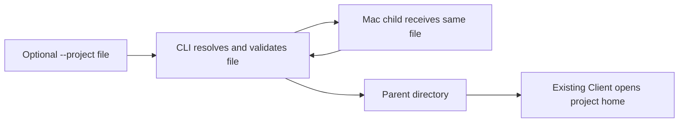

# Phase 71 — Verification and operator acceptance

## Arbitrary filenames — accepted 2026-10-07

The operator launched `forge chat --project ./project1.json` and `forge chat --project ./project2.json` from the same `fproj` folder. Both printed “Opened Forge chat in a new window.” Supplied screenshots show two Ghostty windows with separate conversation histories. The operator confirmed “Change accepted and successful” and authorized commit, merge and post-merge worktree cleanup. This supersedes the earlier no-commit instruction. Separate Project IDs retain independent hosted histories while sharing a workspace.

| Verification | Observation |
|---|---|
| Client managed suite | 286 passed, 0 failed/skipped; repeated before commit on 2026-10-07 |
| Portable declaration coverage | 44 passed; custom and extensionless filenames, conflicting default ignored, replacement/reconnection retain selected path, changed identity refused, no missing-file fallback |
| CLI focused suite | 98 passed, 0 failed/skipped |
| CLI full managed suite | 925 passed, 10 skipped, 0 failed; `/tmp/mcl-chat-any-filename-full.log` |
| Local native installation | `make install` exited 0; `/tmp/mcl-chat-filename-install.log`; installed `~/.local/bin/forge` reads the exact custom filename and rejects directories. Existing linker/macOS dependency warnings recorded; no zero-warning native claim. |
| Operator live check | Same-folder `project1.json` and `project2.json` commands and separate Ghostty histories confirmed by supplied screenshots, then explicitly accepted |

The operator evidence is from the locally installed branch artifact. It proves the requested behavior; it does not by itself establish merged-main artifact provenance under Default-Path Acceptance. Client 0.9.3 publication is a merge dependency for the CLI; delivery links and cleanup observations are recorded in the active spoke.

## Merge delivery observations

- Client [PR 13](https://github.com/katasec/forge-client/pull/13) merged as `7595a72d0ded3baaf2e78f4d39485d587c15b621`; PR CI passed.
- [Client publication run](https://github.com/katasec/forge-client/actions/runs/37642940658) passed 286 tests and package metadata/content validation, then pushed 0.9.3 successfully. Its final API visibility check failed after retries with no API error text; this workflow is not recorded as green.
- Independent authenticated API checks confirmed exactly one 0.9.3 version (ID 1351072817), private visibility and association with katasec/forge-client. `dotnet restore ForgeMission.slnx --no-http-cache` restored the remote package; its nuspec records the merged Client commit above. The stable-package focused CLI suite passed all 98 tests.
- First CLI PR check started before the NuGet publication and failed NU1102. Rerun requested after successful remote restore; no failing check bypassed.
- Worktree inventory covers the README repository map: forge-mcl, forge-runner, forge-conversations, forge-platform, forge-rooms, forge-client, forge-desktop, forge-infra and mission-control-language. All initially had only primary checkouts; no linked worktrees or attached managed worktrees.

## Earlier fixed-filename delivery (superseded)

# Phase 71 — Earlier fixed-filename delivery (superseded)

Historical local evidence only. The arbitrary-filename design and current status are in [the active spoke](phase-71-chat-project-file.md). The initial filename restriction and its review verdicts are superseded by the operator clarification.

# Phase 71 — Chat project file paths

Status: local implementation reviewed, managed verification passed and operator-requested native install completed in `~/.local/bin`; all changes intentionally uncommitted. Published default-path acceptance remains pending.

## Requirement and design

`forge chat --project` accepts a path to a project file with any filename. Omission selects `forge.project.json` in the current directory. A directory or missing file exits 1 before theme, terminal, login or network work. Remove folder support immediately, with no deprecation, migration or fallback. Operator clarified arbitrary filenames and explicitly waived the supervisor/subagent workflow for this correction.

Filename correction design: pass the selected absolute file through the CLI to the existing Projects.OpenChatAsync request, not merely its parent. In `/Users/ameerdeen/progs/forge-client`, this existing chat operation interprets HomePath as a declaration file or the existing Project-home input used by other Client consumers. Projects derives the home from a file path, reads that exact file with existing safe-path and manifest checks, and pins the selected declaration path in the internal session alongside identity/version. Session replacement preserves that path; reconnection and hands revalidation reread it, without default-file substitution. Authoring/creation keep their fixed filenames. No wire DTO, hosted endpoint, store, identity or hands scope changes. Directory support remains absent from the CLI.

Use a local prerelease Client package for the uncommitted cross-repo correction, keep package references (no sibling project reference), and verify with managed tests. No commits, real package publication or AOT test compilation. Default-path published acceptance remains pending.

In `/Users/ameerdeen/progs/forge-mcl`, change the existing startup block to resolve the absolute file path and validate its kind, name and existence, then derive its parent as the shared Client's project home. Keep project parsing and admission in forge-client. Forward the absolute file path to the Mac child; preserve its original cwd and endpoint. Project creation still accepts a folder but prints a file-based chat command. Update CLI help, the two READMEs and focused existing tests.

| Behaviour | Owner / existing boundary |
|---|---|
| Command selection, early errors, creation guidance | forge-mcl CLI; [README](../../../forge-mcl/src/ForgeMission.Cli/README.md) Owns command arguments and output |
| Mac argv and working-directory preservation | Existing CLI MacChatWindow |
| Declaration validation, hands and hosted admission | Existing forge-client Projects and MissionConversations; unchanged |

| Need | Reuse |
|---|---|
| Absolute path, directory/file checks, parent | Existing System.IO Path, Directory and File APIs; no dependency/helper needed |
| Chat startup and admission | Existing ForgeChat.RunAsync and ProjectOpenRequest(HomePath) |
| Child command and quoting | Existing MacChatWindow.BuildOpenStartInfo; substitute the file argument |
| Creation guidance | Existing ForgeProject output and PowerShell quoting |
| Failure/argv evidence | Existing ForgeChatTests, ForgeProjectTests and MacChatWindowTests fixtures |

Principles that changed decisions: fixed convention (only forge.project.json); one owner (CLI interprets its argument, Client keeps domain validation); no legacy paths (reject folders); minimum needed (no new abstraction or filename contract).

Rejected: arbitrary filenames require a shared Client contract change; folder compatibility contradicts the request. Open questions: none.

## Gates and verification

Security: no tier, identity, datastore, credential or cross-context contract changes; those architecture questions are N/A for local argument selection. Existing shared Client admission and fresh hands consent remain authoritative. Type 2: reverse the CLI diff to undo the selection change.

Engineering: the CLI owns selection failures, returns a named error and exit 1 before downstream work, and creates no state. Recovery is supplying the named existing file. No new knobs, abstractions or dependency. Desktop/ForgeUI visual gates N/A: this changes CLI arguments/output only.

Narrow style exception: preserve the operator-approved inline startup block in the existing long `ForgeChat.RunAsync` orchestrator. Manual McCabe accounting including short-circuit operators, null coalescing and catch/filter paths gives 17 (previously 16 under the same count). Scope: this one startup function only; no helper split solely for a metric. Remove the exception when a future scoped startup change separates prerequisites at a meaningful failure/test boundary. Independent code review must validate this count and the stated scope.

Default path applies: the published/installed native CLI, no FORGE_API_ENDPOINT override, saved forge login, cwd forge.project.json and existing hosted Project/mission. Default filename and discovery stay unchanged; only explicit override changes from folder to file. After an eventual merge/publication, acceptance must exercise omitted and explicit file paths, reject a directory and a missing file before login/network, and verify the Mac child receives the file. No current published acceptance is claimed while work is uncommitted.

Done for this requested local delivery when the reviewed diff implements file-only selection, preserves no-argument discovery, updates generated commands/help/docs, and focused/full managed tests plus `dotnet run` startup smoke checks pass. The operator explicitly prohibits AOT compilation for this task because it is slow. These checks are lower-layer evidence, not published default-path acceptance. Leave changes uncommitted as requested; phase closure remains pending publication and default-path observations.

## Work status

Implementer plan: change ForgeChat startup/help, MacChatWindow argument names, ForgeProject guidance, the two forge-mcl READMEs and their three existing CLI test files. Reuse existing subprocess/quoting fixtures, with no production helper. Check focused CLI tests, full managed solution tests and `dotnet run` help/negative startup smoke checks. Positive omitted/relative/absolute file paths stop at an isolated invalid-theme sentinel; this is controlled startup evidence only. Negative cases cover missing file, existing directory (including one named forge.project.json), and wrong filenames. No AOT compilation (operator instruction), install, login, network mutation, commit or publication.

| Task | Status |
|---|---|
| Design reviews | Simplicity and ownership PASS; design locked |
| Implementer plan reviews | Simplicity and ownership PASS; supervisor PLAN APPROVED |
| Local implementation and verification | Done locally: code/style/ownership PASS; 100 focused and 927 full-suite tests passed, see observations below |
| Requested local install | Done: plain `make install` exited 0 at `/Users/ameerdeen/.local/bin`; exact installed binary's version/help/directory rejection checks passed; typo output removed |
| Published default-path acceptance | Pending; outside this uncommitted delivery |

## Local observations — 2026-10-07

| Check | Observed result |
|---|---|
| Focused managed tests | `dotnet test tests/ForgeMission.Mcl.Tests/ForgeMission.Mcl.Tests.csproj --filter "FullyQualifiedName~ForgeChatTests\|FullyQualifiedName~ForgeProjectTests\|FullyQualifiedName~MacChatWindowTests" -warnaserror`: 100 passed, 0 failed, 0 skipped; `/tmp/mcl-chat-file-focused.log` |
| Full managed solution tests | `dotnet test ForgeMission.slnx -warnaserror`: 927 passed, 10 skipped, 0 failed, 937 total, 1m27s; child-process provider test keys removed to skip unrelated live-provider tests; `/tmp/mcl-chat-file-full-current.log` |
| Managed CLI smoke | `dotnet run --project src/ForgeMission.Cli -- chat --help` exits 0 with file-only help. Piped `dotnet run --no-build` omitted-missing, explicit directory, missing file and wrong-name checks each exit 1 with the designed error; `/tmp/mcl-chat-file-smoke.log` |
| Positive path and failure containment | Omitted/relative/absolute existing file selections reach isolated invalid-theme sentinel; invalid selections stop before it. No ancestor discovery or file creation. Mac file argv and original cwd round-trip tests pass. These are controlled observations, not published acceptance. |
| Warnings and diff | Managed logs contain no compiler warnings; `git diff --check` passes. AOT was skipped during testing as requested; the later explicit compile/install request uses the existing native `make install` target. |
| Independent reviews | Simplicity, style and ownership code reviews PASS; reviewer confirms RunAsync complexity 17 versus previous 16 under documented manual accounting. |
| Git state | Both touched repos remain on `adeen/forge-chat-project-file`, intentionally uncommitted; no task commits, push or merge. |
| Subsequent native local install | Operator requested compile/install, then corrected `~/local/.bin` to the Makefile default `~/.local/bin`. Plain `make install` exited 0 and reused the native build. `/Users/ameerdeen/.local/bin/forge --version` reports `1.0.0+f3b49448813947d6863bd1b30b3a0860ec63108b`; chat help names a file, and `chat --project /Users/ameerdeen/progs/fp-sample1` rejects the directory with exit 1. This is an uncommitted branch install, not merged-main default-path acceptance. |
| Native linker observations | Native compilation emitted warnings about ignored `-ld_classic` and Homebrew OpenSSL/Brotli dylibs built for newer macOS versions than the declared target. Final plain install exited 0; the exact binary loaded and passed the named smoke checks. No zero-warning native claim. |
| Typo cleanup | `/Users/ameerdeen/local/.bin` removed; `Test-Path` returned False. Makefile unchanged. |

## Timing

UTC boundaries recorded at assignment/result observations, 2026-10-07. Exact pre-task chat/scope timestamps unavailable; merge and tokens N/A for this local delivery.

| Stage | Start UTC | End UTC | Evidence |
|---|---|---|---|
| Design supervisor | 14:17:28 | Unavailable | Initial design artifact |
| Design simplicity review | Unavailable | 14:18:45 | Full checklist PASS |
| Design ownership review | 14:18:45 | 14:19:57 | Ownership PASS |
| Implementer plan | 14:19:57 | 14:22:01 | Plan recorded above |
| Plan simplicity review | 14:22:01 | 14:22:53 | Full checklist PASS |
| Plan ownership review | 14:22:53 | 14:23:49 | Ownership PASS, PLAN APPROVED |
| Implementation | 14:23:49 | 14:28:01 | Local diff and managed logs |
| Code simplicity/style review | 14:28:01 | 14:29:53 | Both full tables PASS |
| Code ownership review | 14:29:53 | 14:30:42 | Ownership PASS |

Requested install: started 14:33:12 UTC; corrected default install and cleanup verified by 14:40:40 UTC. No package/release publication or product PR.

