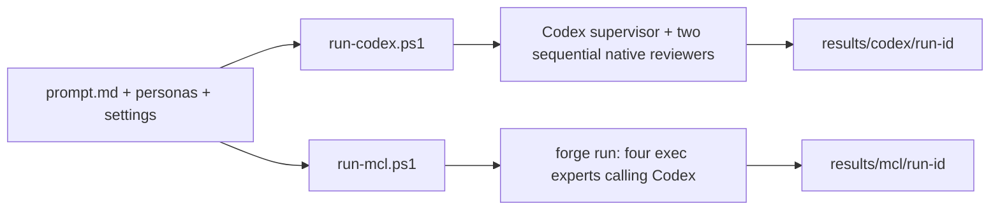

# Phase 72 — Supervisor comparison

## Scope and status

Two independently runnable PowerShell scripts read one build-request file and write separate
Codex/MCL result directories. First slice: design → sequential independent simplicity and ownership
reviews → supervisor revision/decision. No product implementation, deployment or automatic grading.

| Item | State |
|---|---|
| Runner baseline | Verified; see [completion evidence](phase-72-supervisor-comparison_completed.md) |
| Next | Compare the saved final designs and refine the MCL handoffs against a frozen native baseline |

## Locked design

Owner: this repository's `tools/supervisor-test/`, which owns agent mission-control experiments.
No forge-mcl runtime change. `prompt.md` alone owns the build requirements; small shared persona
files own role instructions; `settings.json` pins the same model and reasoning effort for both paths.

The Codex runner gives one supervisor the full simplified workflow and asks it to delegate two
independent reviews sequentially. MCL explicitly schedules four `kind: exec` experts. One small
Python adapter owns subprocess invocation, schema checking, artifact writing and failure reporting.
The supervisor session is resumed for MCL's final revision; reviewers use distinct sessions. Both
reviewers see the original design, not one another's review. Named exec output keys preserve the
design and both reviews; `output` alone would discard those earlier artifacts.

Each immutable run directory contains the exact input, persona/settings snapshots and hashes,
design, two JSON reviews, final JSON/Markdown, stage prompts, JSONL events and execution logs.
Final contract: `design`, `decision` (`approved`/`needs_revision`), `resolved_findings`,
`remaining_issues`. A completed execution may return `needs_revision`; transport/schema failures
exit nonzero and preserve partial artifacts with a failed run record. No retry or grading loop yet.

## Gates and failure boundaries

| Gate | Answer |
|---|---|
| Supervisor workflow | Operator explicitly waived it for this session on 2026-10-07; no implementation subagents/reviews |
| Security | Local experiment only; hosted tiers, stores, ingress and cross-context contracts N/A. Codex alone uses existing CLI authentication; no credentials written into inputs/results. Codex runs read-only in a temporary directory outside every Forge checkout. |
| Engineering | One subprocess seam; Python standard library and existing Codex/forge CLIs. Two paths are required by the comparison. Fixed stages and result conventions; no new framework. |
| Default path | From any cwd, invoke either saved PowerShell script with no arguments; normal installed `codex`/`forge`/`python3`, saved CLI auth and checked-in settings; no API stub or custom URL. Actual runs must be observed. |
| CLI provider initialization | Installed forge initializes a default client for an exec-only mission. Use the normal exported `MCL_API_KEY` in the checked-in manifest; this client makes no model call. All reasoning uses Codex saved authentication. |
| UI / AOT | N/A: no Desktop/ForgeUI/runtime source changes |
| Failure | Adapter owns missing CLI, nonzero exit, timeout and malformed/schema-invalid response. Caller gets nonzero exit plus failed `run.json`; partial logs remain. New run is the recovery path; previous evidence is never overwritten. Timeout/interruption terminates the owned process group on POSIX. |
| Verification | Real default runs for both paths; matching input/settings hashes and complete stage artifacts. Focused negative tests for malformed results, child failure and timeout; forge validate/init for exec contracts. |

## Done when

1. Both no-argument scripts run independently from outside the harness directory.
2. Both read the same prompt/personas/settings and write only their own timestamped result folder.
3. Both preserve all four stage artifacts, logs and measured run metadata.
4. Negative paths report failure honestly; installed forge executes the actual MCL mission.
5. Initial outputs are inspected; similarity is reported as observation, not a claim of full workflow parity.

Future: manually compare frozen cases, then refine MCL handoffs/loops. Implementation stages and
automatic comparison are deliberately outside this first slice.
