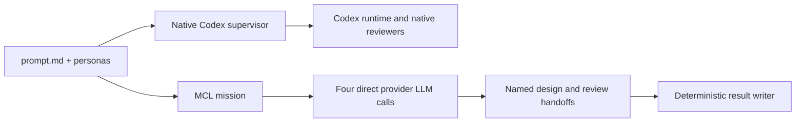

# Phase 72 — Native Codex versus native MCL

## Status

| Item | State |
|---|---|
| Proposal | Native MCL harness approved and independently exercised |
| Approval | Operator approved proceeding on 2026-10-07 |
| Evidence | Both default scripts complete; eight tests and instrumented MCL run pass; see [verification](phase-72-supervisor-comparison_completed.md) |
| Next | Compare measured MCL stage intervals with native supervisor intervals; choose the next prompt/refinement |

## Scope and design

Two scripts read the same `tools/supervisor-test/prompt.md` and shared personas. Codex runs its native
supervisor and sequential reviewers. MCL runs four native `kind: llm` experts through `forge`,
calling the provider directly. MCL never launches Codex. The first slice remains design, two
independent reviews, and one revision/decision. No implementation, retries, search or automatic grading.

Owner: this repository's mission-control tooling. No product source change.

Four `Remember` steps use native `json_extract` to retain `design`, `simplicity_review`,
`ownership_review` and `final`. The final expert wraps its result under `final`, preserving the
original `design`. All four model answers pass through the same JSON extraction boundary (including
the runtime's supported JSON fences) before the writer receives named JSON fields. The writer
preserves its declared incoming artifacts before validation for failure diagnosis.
Each LLM step sets `output: ""` so the runtime's implicit previous-output
message cannot leak a review into the other reviewer. The request, applicable shared persona and
named artifacts are interpolated explicitly. No dialogue loop is declared.

`SaveResults` is an exec step only for schema validation and file writing. It launches no model,
agent or network request. Python owns subprocesses and artifact storage; MCL owns its reasoning
and sequencing. Each new run will preserve input/configuration snapshots, the original design,
two reviews, final JSON/Markdown and process logs in its own results subfolder.

## Per-stage timing

One reusable `Timestamp` exec expert runs before the pipeline and after each reasoning, extraction
and save step. It reads only `resultsDir`, `timingLabel` and the current `output`. Python records
real UTC and monotonic timestamps in `timings.jsonl`, then returns the incoming output unchanged.
Timing uses no model calls. Duplicate Remember invocations receive distinct labels.

Each marker reports cumulative wall time and the interval since the previous marker. Intervals
include adjacent marker process overhead and provider/runtime latency; they are not isolated
model-compute time. Sequential execution needs no shared logger service or concurrency controls.
Partial timing records survive a later stage failure. The run script writes `timings.md` after
successful completion. The four model prompts and review isolation stay the same.

Owner/failure boundary: the existing harness file-writing boundary owns timing records, propagates
file/JSON errors and preserves failed-run logs. Credentials remain outside marker inputs. Hosted
tiers/stores, UI and deployment are N/A. Default acceptance is the existing zero-argument MCL script
from outside the repo; done when the real run has an initial marker, nine post-step markers,
nonnegative intervals, preserved design/review/final JSON and a readable timing report. A focused
test checks timestamp arithmetic and lossless JSON/fence payload handoff. Verified; see
[per-stage timing evidence](phase-72-supervisor-comparison_completed.md#per-stage-timing-verification--2026-10-07).

## Model and capability boundaries

- Codex uses saved CLI authentication; MCL uses `MCL_API_KEY` for direct OpenAI calls.
- Both use the model in `settings.json`. The MCL profile reads `MCL_HARNESS_MODEL`, set only in its
  child process environment from those settings.
- This draft supports medium reasoning only. Codex requests it; MCL currently leaves it at the
  provider default. Record that distinction rather than claiming explicit reasoning-setting parity.
  GPT-6.1 Sol's documented default is medium; the installed provider completed the real mission.
- This MCL draft has no tools/search step. Codex receives the instruction to use supplied text only.
  That is an instruction, not proof that its tools are disabled; this is not a web-capability test.
- MCL's final call receives saved artifacts and the supervisor persona; it has no persistent agent
  session. This differs from the native supervisor's continuous context.

## Gates and verification

| Gate | Answer |
|---|---|
| Supervisor workflow | Operator waived it for this session and approved proceeding with the native MCL rewrite |
| Security | Local tooling; hosted tiers/stores/ingress N/A. Keys stay in process environments, never artifacts. Codex is read-only outside Forge checkouts; the MCL writer owns only run artifacts. |
| Engineering | Fixed four reasoning stages, native JSON extraction and one deterministic file writer; no reasoning adapter/framework |
| Default path | Independently run either saved script without arguments from any cwd, with installed CLIs and normal credentials |
| Failure | Helper owns missing CLI, timeout, nonzero exit and invalid artifact errors; failed run record plus partial logs. Recovery is a fresh run. |
| UI/AOT/deploy | N/A: no product code, UI or deployment changes |
| Verification | Both real scripts, complete artifacts, matching shared-input hashes, native delegation and direct-provider MCL provenance; evidence in the completed record |

## Acceptance

Harness checks 1–4 are verified: separate scripts from an outside cwd, native MCL LLM experts,
independent original-design reviewers and explicit named handoffs, complete artifacts/failure logs.
See the completed record for observations and limits. Operator inspection of the outputs remains
open; one sample does not establish speed/quality equivalence. Both first reviews passed, so a
future comparison should exercise actionable findings before claiming revision-behaviour parity.
