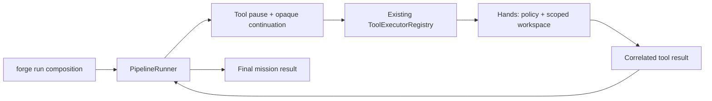
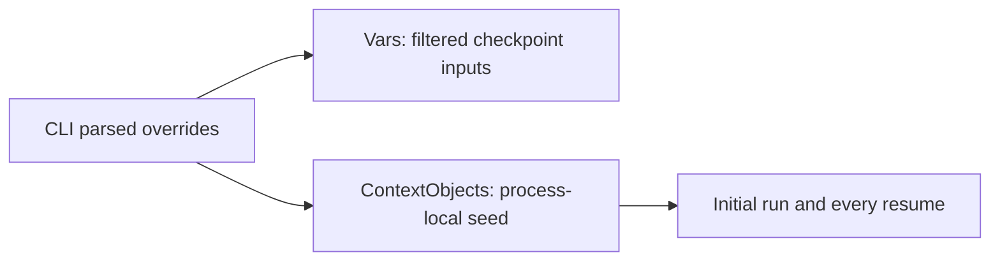

# Phase 73 — completed observations and timing

Product merged and installed-default acceptance PASS. Canonical Native AOT, artifact identity and
complete independent reviews PASS. Documentation closure and cleanup are delivered by the closure PR. This record stores verified observations and resolved
investigations; it does not claim delivery.

## Managed verification

| Observation | Evidence |
|---|---|
| Initial branch focused | 49 PASS, zero skips/failures; /tmp/forge-hands-focused.log |
| Initial branch full | 939 PASS, 10 optional-provider skips, zero failures; /tmp/forge-hands-full-debug.log |
| Corrected branch builds | Debug and Release solutions zero warnings/errors; /tmp/forge-hands-r4-debug-build.log and /tmp/forge-hands-r4-release-build.log |
| Corrected focused | 52 PASS, zero skips/failures; /tmp/forge-hands-r4-focused.log |
| Corrected full | 951 PASS, 10 optional-provider skips, zero failures; 961 total, 1m32s; /tmp/forge-hands-r4-full-debug.log |
| Regression sensitivity | Working three-turn HTTP fixture succeeds; seed-only removal gives two expected failures: default global value and missing global prompt; checkpoint-negative PASS; /tmp/forge-hands-r4-protocol.log and /tmp/forge-hands-r4-before.log |
| Sensitive seed | Unused synthetic apiKey seed absent from opaque checkpoint; actual Core RootInputs filter unchanged |
| Real Bob | Actual Write/Read/Edit bytes and correlated replies; missing/malformed/outside/symlink/I/O errors; unsupported/multiple calls, cancellation and session closure |
| CLI command | Actual subprocess stdout/declared output/steps/failure and non-parameter global overrides across two pauses |
| Source reviews | Corrected complete six-file diff at b27f451: simplicity and ownership PASS; source style PASS; final complete native/style PASS recorded below |

Full Release attempts failed because pre-existing reflection loaders mix hard-coded Debug and active
Release copies of the same forge assembly in one load context. The normal README full Debug suite
was used; optional live-provider credentials were absent only in the full-suite child. No runtime,
test-baseline, loader or test-partition changes. Controlled HTTP requests use synthetic data, not
real provider credentials; localhost fixtures are not default acceptance.

## Resolved branch investigations

| Finding | Resolution / observation |
|---|---|
| Native global --var probe | Failed with file_path required: RootTools filters Vars to root parameters. Formal-parameter diagnostic returned hands-ok; actual file observed. Corrected CLI seeds parsed overrides through existing process-local ContextObjects, preserving Core input filtering. |
| Corrected managed real-provider probe | Root mission without formal parameters, normal config/credentials, external mission file and workspace cwd; returned hands-ok. Existing probe file rewritten at 2026-10-07 22:18:48 UTC, eight bytes. Branch evidence only; installed native acceptance remains open. |
| Streaming compatibility probe | Corrected managed branch, --steps and non-parameter targetPath/content overrides: three agent turns, exit 0, newly created steps-greeting.txt exactly hands-stream-ok (15 bytes), write 22:29:48 UTC; verification 22:29:43–22:29:51 UTC. Installed native acceptance remains separate. |
| OAI fixture unsuitable | Published OaiServer 0.1.7 maps Text only, discards FunctionCallContent: empty final text. /tmp/forge-hands-r2-focused.log. Not regression evidence for tool loop. |
| Anthropic fixture unsuitable | HTTP 200 tool_use reaches SDK, but tryAGI 3.8.3 requires caller omitted by AnthropicServer 0.1.7. Synthetic localhost diagnostic /tmp/forge-hands-r3-diagnostic.log. Not regression evidence. |
| Final wire fixture | Reuses established HttpListener pattern, fixed three responses, 15-second deadline, cancellation stops accepts, all serving tasks observed, subprocess owns cleanup. Both failed alternatives removed; no provider/package source changes. |

## Native observations — canonical compilation passed

Local initial Release osx-arm64 publish produced a usable branch artifact and successful help/version
but six linker warnings: obsolete -ld_classic; OpenSSL ssl/crypto dylibs built for macOS27 versus
executable12; Brotli encoder/decoder/common dylibs built for macOS26 versus executable12.
/tmp/forge-hands-aot.log. This remains FAIL for zero warnings; no suppression, minimum-OS, library,
Homebrew, environment or workflow workaround.

Existing macOS-14 PR job is the canonical warning-free route, per Phase70's governing contract.
[Initial run 37692042931](https://github.com/katasec/forge-mcl/actions/runs/37692042931) was cancelled
when the global-variable correction superseded its tree; verification job 21:49:15–22:04:38 UTC.
[Current run 37695518071](https://github.com/katasec/forge-mcl/actions/runs/37695518071) verifies pushed
b27f4517e5e1f2d55ab9db0789fbebf7ec7b5098; job started22:20:24 UTC, managed/package step passed
22:20:44–22:25:09 UTC; native publish ran22:25:09–22:49:47 UTC and passed with zero compiler/linker warnings; job completed22:50:11 UTC. Full actual job log is /tmp/forge-hands-canonical-job.log. Canonical tests:951 PASS/10 skips; package tests:27 PASS. Final complete simplicity/style review PASS observed22:54:11 UTC. Artifact download/identity and installed acceptance remain open. Package publishing
is skipped on pull requests. Artifact identity/logs and exact source-tree match were independently observed below, beyond the check badge.

## Explicit stage boundaries (UTC)

Missing precise times are unavailable; recorded observation boundaries are not reconstructed
message timestamps. Reused agent lifetime is not stage duration. Tokens N/A (not independently
measured). User-facing live event table uses Dubai UTC+4 and explicitly logs every return to
Design/Plan, unsuccessful fixture attempts, ongoing work and unopened gates.

| Stage / role / round | Start UTC | End UTC | Wall | Evidence |
|---|---|---|---|---|
| [design:supervisor] | 2026-10-07 21:20:41 | 2026-10-07 21:22:46 | 125s | Phase 73 proposed design; scope start first clock observation |
| [investigate:implementer] | Unavailable | 2026-10-07 21:22:46 | Unavailable | Read-only API/package/cancellation investigation; precise assignment start unavailable |
| [review-design:simplicity] | 2026-10-07 21:22:46 | 2026-10-07 21:24:06 | 80s | PASS complete design |
| [review-design:ownership] | 2026-10-07 21:24:06 | 2026-10-07 21:25:25 | 79s | PASS complete design |
| [plan:implementer] | 2026-10-07 21:25:25 | 2026-10-07 21:27:58 | 153s | Implementer plan returned |
| [review-plan:simplicity] | 2026-10-07 21:27:58 | 2026-10-07 21:29:03 | 65s | PASS complete plan |
| [review-plan:ownership] | 2026-10-07 21:29:03 | 2026-10-07 21:30:18 | 75s | PASS complete plan |
| [implement:implementer] | 2026-10-07 21:30:18 | 2026-10-07 21:41:47 | 689s | Implementation complete; 49 focused/939 full+10 skips; AOT process handed to supervisor pending |
| [review-code:simplicity+style] | 2026-10-07 21:41:47 | 2026-10-07 21:46:45 | 298s | Simplicity PASS; style static PASS except AOT local 6 linker warnings, gate open |
| [review-code:ownership] | 2026-10-07 21:46:45 | 2026-10-07 21:48:55 | 130s | Code ownership PASS; six task files; native gate open |
| [investigate:implementer:r2] | 2026-10-07 21:55:24 | 2026-10-07 21:57:19 | 115s | RootInputs regression confirmed; ContextObjects existing seam; no edits |
| [design:supervisor:r2] | Unavailable | 2026-10-07 21:57:19 | Unavailable | Design clock boundary not separately measured; Revision2 saved; duration unavailable |
| [review-design:simplicity:r2] | 2026-10-07 21:57:19 | 2026-10-07 21:58:22 | 63s | Full revised design PASS |
| [review-design:ownership:r2] | 2026-10-07 21:58:22 | 2026-10-07 21:59:58 | 96s | Full revised design PASS; supervisor locks |
| [plan:implementer:r2] | 2026-10-07 21:59:58 | 2026-10-07 22:01:36 | 98s | Revised plan; actual CLI regression tests, existing HTTP fixture |
| [review-plan:simplicity:r2] | 2026-10-07 22:01:36 | 2026-10-07 22:02:25 | 49s | Full revised plan PASS |
| [review-plan:ownership:r2] | 2026-10-07 22:02:25 | 2026-10-07 22:03:14 | 49s | Full revised plan PASS; PLAN APPROVED |
| [implement:implementer:r2] | 2026-10-07 22:03:14 | 2026-10-07 22:07:16 | 242s | Tool-free regression fixed; 51 PASS/1 fixture failure; no scope broadening |
| [plan:implementer:r3] | Unavailable | 2026-10-07 22:06:46 | Unavailable | Existing Anthropic fixture correction proposed; start unavailable |
| [review-plan:simplicity:r3] | 2026-10-07 22:06:46 | 2026-10-07 22:07:33 | 47s | Full current plan PASS |
| [review-plan:ownership:r3] | 2026-10-07 22:07:33 | 2026-10-07 22:08:24 | 51s | Full current plan PASS; PLAN APPROVED |
| [implement:implementer:r3] | 2026-10-07 22:08:24 | 2026-10-07 22:11:38 | 194s | SDK fixture incompatibility confirmed; constructor restored; no productprovider change |
| [plan:implementer:r4] | 2026-10-07 22:12:17 | 2026-10-07 22:13:55 | 98s | Fixed three-turn wire fixture plan |
| [review-plan:simplicity:r4] | 2026-10-07 22:13:55 | 2026-10-07 22:14:44 | 49s | Full current plan PASS |
| [review-plan:ownership:r4] | 2026-10-07 22:14:44 | 2026-10-07 22:15:38 | 54s | Full current plan PASS; PLAN APPROVED |
| [implement:implementer:r4] | 2026-10-07 22:15:38 | 2026-10-07 22:20:36 | 298s | Valid before/after, focused52, full951pass10skip, builds0warnings |
| [review-code:simplicity+style:r2] | 2026-10-07 22:20:36 | 2026-10-07 22:23:02 | 146s | Full current diff simplicity/source-stylePASS; canonical AOTpending |
| [review-code:ownership:r2] | 2026-10-07 22:23:34 | 2026-10-07 22:24:40 | 66s | Full current six-file ownership PASS; no changes |

At the initial review milestone PR68 was draft. Its later actual merge and installed-acceptance timestamps are recorded below.

## Reviewed plans and superseded fixture decisions

The following preserves the reviewed sequence. Revision 4 is the final test-fixture plan; earlier alternatives are superseded and absent from current code. Native and installed-default gates remain open.

## Implementer plan — review artifact

### Files and sequence

| File in forge-mcl | Change |
|---|---|
| `src/ForgeMission.Cli/Program.cs` | Only BuildRunCommand: token-aware action, one Hands composition call, cancellation/nonzero results, terminal-success output; preserve loading/validation/provider construction/options |
| `src/ForgeMission.Cli/ForgeRun.cs` (new) | Fixed session factory plus CLI root pause/execute/resume lifetime; method consumes and disposes supplied Bob |
| `src/ForgeMission.Cli/ForgeMission.Cli.csproj` | Direct published Hands 0.1.0 reference |
| `src/ForgeMission.Cli/README.md`, `README.md` | Single path, cwd authority/scripted grant, cancellation, exec/output boundaries and example |
| `tests/ForgeMission.Mcl.Tests/Cli/ForgeRunTests.cs` (new) | Actual Bob + controlled model integration, disposal, subprocess output behavior |

Sequence: direct package reference; fixed CreateHands + rejecting handler; RunAsync lifetime/loop;
token-aware BuildRunCommand; focused tests; READMEs; focused/full/AOT verification.

Production constructs the session immediately as the consumed argument:
`ForgeRun.RunAsync(ast, experts, runner, options, ForgeRun.CreateHands(Environment.CurrentDirectory, ct), ct)`.
`RunAsync` owns `await using` disposal, supplies declarations, runs Core, executes each pause via
the existing registry, resumes the exact continuation/call ID, returns the terminal result.
JSON arguments are enumerated into cloned JsonElement dictionary values accepted by ToolArguments,
without reflection deserialization. One helper keeps adaptation/dispatch/result mapping together.
Tests pass a real Bob through that same method and observe its closed admission afterwards;
no factory injection, alternate dispatcher or test-only runtime mode.

System.CommandLine's token-aware action returns 130 on cancellation, 1 on failure, with stderr.
After Hands creation no Die/Environment.Exit is used. Final output writing follows disposal.
No separate signal framework, interactive/piped policy, capability flag, retry, or new Core API.

### Plan reuse / fit

| New piece | Equivalent checked / reason |
|---|---|
| ForgeRun composition | Program owns command composition; extract the actual tool/lifetime side-effect seam; hosted ChatHandsAttachment is a different protocol |
| CreateHands | Existing Bob CreateForMission/profile/policy; only fixed local file grant needed |
| Rejecting confirmation | Client PendingConfirmationHandler is internal and Application-interactive; minimal CLI handler fails unexpected confirmation closed |
| Run/dispatch loop | Existing Core RootTools/Run/Resume and ToolExecutorRegistry; old AgenticSession cannot preserve root checkpoints |
| Argument adaptation | Existing ToolArguments accepts JsonElement; clone properties, no DTO/serialization framework |
| Tests | Existing StubExpertRunner, AST/expert and CLI assembly/subprocess conventions; real Bob filesystem and lifecycle |

CLI component fit: command composition and its session lifetime; no interpreter, policy-enforcement,
workspace-guard, hosted-conversation or provider-protocol behavior moves into CLI.

### Verification

| Layer | Planned observation |
|---|---|
| Focused | `dotnet test tests/ForgeMission.Mcl.Tests/ForgeMission.Mcl.Tests.csproj -c Release --filter "FullyQualifiedName~ForgeRunTests\|FullyQualifiedName~AgentToolPipelineTests"` |
| Real Bob / controlled model | Successive Write → Read → Edit, actual bytes/correlated replies; Read/Write/Edit declarations, no Bash |
| Negative | Missing file/malformed args/outside-root/symlink error replies; unchanged outside sentinel; unknown/multiple calls rejected |
| Lifetime | Actual Bob rejects dispatch after success, Core failure, provider exception and cancellation; no later tool dispatch/output after cancellation |
| CLI output | Tool-free subprocess stdout, declared file and --steps preserved; unwritable output nonzero; no mode flag |
| Full | Release build/focused tests plus the README's normal complete Debug solution suite, optional live-provider keys absent only in controlled test child, skips recorded |
| AOT | Release osx-arm64 publish to temporary folder, zero warnings, native help/version |
| Default | Supervisor merged-main make install, normal credentials/provider, disposable cwd, real Write → Read; elsewhere mission keeps cwd root, outside refusal and Ctrl-C |

Implementer principles changing the plan: 1 reuse; 2 one path; 3 defer parallel/terminal/MXC/chat;
4 focused class without framework; 6 real/default observations; 7–9 top-down named flow;
10 explicit errors/disposal; 12/14 real lifetime seam; 13 zero warnings; 15 manual McCabe <=15,
prefer <=10. Open questions/assumptions: none. UI gates N/A.

Verification adjustment approved by supervisor 2026-10-08 01:37 Dubai: existing CLI reflection
tests mix hard-coded Debug and active-configuration assembly paths, so full Release tests collide
on the same `forge` assembly identity in one load context. Use the normal README full Debug test
route, retaining Release build/focused tests and Native AOT checks. No product route, test baseline
or runtime contract changes; no test partitioning. Failed Release attempts remain setup evidence,
not PASS. Code reviewers assess the complete diff and actual verification observations.

### Native verification route

Local AOT completed with the same six pre-existing macOS linker warnings already recorded in
[Phase 70's warning-free contract](phase-70.1-text-interaction-foundation.md#warning-free-aot-and-normal-delivery--r12-locked-contract).
This observation is FAIL for zero warnings, not waived. Reuse the existing pull-request verification
job in forge-mcl `.github/workflows/publish-terminal-extensions-package.yml`: macOS-14, normal
prerequisites, complete managed/package checks, native publish and explicit compiler/linker
warning rejection. No linker, minimum-OS, Homebrew, suppression or workflow changes are proposed.
Create a draft product PR to obtain this read-only verification; merge remains blocked until
current-tree canonical zero-warning evidence and full code reviews pass. Package publication is
skipped on pull requests. Normal merged-main install remains the local-run acceptance route;
record its actual build diagnostics separately from canonical zero-warning evidence.

Product branch rebased without conflicts onto the TUI agent's merged main `b6ecb52`;
task commit `bf169d26d664348e4e4f71be870a9c9ea8298fc3` contains only the six Hands files.
Draft [PR 68](https://github.com/katasec/forge-mcl/pull/68) opened;
[canonical run 37692042931](https://github.com/katasec/forge-mcl/actions/runs/37692042931)
queued 2026-10-07 21:49:07 UTC. No merge or default-path PASS yet.

The first canonical run was cancelled after the global-variable correction superseded its tree;
verification job ended 2026-10-07 22:04:38 UTC. Corrected product commit
`b27f4517e5e1f2d55ab9db0789fbebf7ec7b5098` is pushed and clean.
[Current canonical run 37695518071](https://github.com/katasec/forge-mcl/actions/runs/37695518071)
started its verification job 2026-10-07 22:20:24 UTC. Current managed logs: focused 52 PASS;
full normal Debug 951 PASS / 10 optional-provider skips / 0 failures (961 total), 1m32s;
Debug and Release builds zero warnings. The corrected managed branch also rewrote/read the
real-provider probe file and returned `hands-ok` (file write observed 22:18:48 UTC); this is
branch evidence, not installed-default acceptance. Native gate remains open.

### Revision 2 implementer plan — approved

Sequential complete-plan simplicity and ownership reviews PASS. Supervisor PLAN APPROVED
2026-10-08 02:03 Dubai; same implementer applies only this correction.

| File | Change |
|---|---|
| CLI Program.cs | Supply parsedVars converted to object values as ContextObjects in existing options constructor; retain Vars, no new helper/runtime API |
| CLI ForgeRunTests.cs | Three regression cases: actual command tool-free global override, actual command successive Bob calls with globals, unused sensitive seed absent checkpoint |

Sequence: regression tests first demonstrate failure; one constructor correction; Debug CLI and
Release solution builds; focused and full normal Debug tests; fresh canonical AOT; supervisor
native global-let probe and merged installed-default acceptance.

Reuse: existing exec/subprocess fixture for tool-free override (Python echoes its supplied global
input); existing Integration.AnthropicServerFixture plus scripted IChatClient
for Write/Read/final responses. No custom HTTP server/framework. The actual command uses a root
with no parameters and --var globals; assert rendered overridden path/content before/after pauses,
correlated replies, bytes and stdout. A separate direct PipelineRunner root pause with ContextObjects
holding an unused credential-shaped sentinel asserts opaque serialized continuation excludes it.
This persistence test is distinct from production CLI wiring. Share fixture creation only to remove
real repeated setup, not new production test seams.

No Core, Bob or ForgeRun API changes. No provider endpoint override is acceptance evidence:
the HTTP fixture is controlled component verification only. Optional real-provider keys are absent
only in the full test child; actual acceptance uses normal configured provider credentials.
Existing negative/disposal/output tests remain. Fresh current-tree native check and both complete
code reviews required. Implementer rules changing decisions: 1 reuse; 2 one path; 3/4 minimum;
6 actual subprocess evidence; 10 awaited failures; 12/14 named test side effects; 13 zero warnings;
15 bounded fixture complexity. Open questions none; UI N/A.

### Revision 3 — controlled fixture correction (approved)

The initial two command regressions failed before correction. After the constructor fix, the
tool-free override passed; the successive-call test still returned empty text because published
OaiServer 0.1.7 maps response.Text only and omits FunctionCallContent. This is a test-fixture gap,
not evidence of a CLI tool defect. Reuse the existing AnthropicServerFixture instead: its existing
AnthropicServerToolTests prove tool_use and tool_result wire round trips. Same scripted IChatClient,
same actual CLI/Bob/assertions; only test fixture startup and test TOML provider/endpoint change.
No product-provider changes or custom server. Both full revised-plan reviews PASS; supervisor
PLAN APPROVED 2026-10-08 02:08 Dubai. Demonstrate before/after sensitivity again with the
working tool-capable fixture; the old OAI empty-text failure is fixture evidence only.

### Revision 4 — bounded wire fixture (approved)

Both sequential complete-plan reviews PASS; supervisor PLAN APPROVED 2026-10-08 02:15 Dubai.

Revision 3's server returns HTTP 200 tool_use, but installed tryAGI 3.8.3 requires a `caller` field
absent from AnthropicServer 0.1.7. This protocol failure is not regression evidence. Supersede both
package-fixture plans with one fixed test-local OpenAI wire fixture, following existing
ChatClientsTests HttpListener patterns; their private single-response helpers cannot serve this
three-turn test. Remove failed fixture imports and scripted IChatClient; no provider/server package
changes. Program's approved constructor fix is unchanged.

One orchestration helper owns loopback listener, ephemeral port, deadline and cleanup; one serving
helper captures cloned JSON requests and serves exactly Write, Read and final responses; a small
response builder uses System.Text.Json for correctly escaped strings. No DTO, interface or generic
server/framework. Deadline cancellation stops pending listener admission. Await command/server
tasks and observe server completion in cleanup. Existing subprocess deadline kills only owned child.

First prove valid SDK/tool exchange with the correction, then temporarily remove only the seed
constructor change and rerun: tool-free returns default; successive calls complete but prompt
assertions lack overridden globals. Restore correction and require both PASS. Assert exactly three
chat/completions requests, all three global system prompts, exact correlated tool replies, stdout
and actual bytes. Existing sensitive-checkpoint negative stays. Debug CLI/Release solution zero-
warning builds, focused Release tests, full normal Debug tests; fresh canonical current-tree AOT
and installed normal-provider acceptance remain. Controlled localhost endpoint is not acceptance.

Implementer rules changing decisions: 1 established patterns; 2 remove alternatives; 3/4 fixed
three responses; 6 distinguish protocol validity from regression; 10 awaited failure/cleanup;
12/14 named HTTP side-effect boundaries; 13 native gate; 15 bounded functions. Open questions none.

## Final review boundary

| Stage | Start UTC | End UTC | Wall | Evidence |
|---|---|---|---|---|
| [review-code:simplicity+style:r3] | Unavailable (post-assignment observation22:53:29) | 2026-10-07 22:54:11 | Unavailable | Complete six-file diff and actual canonical native logs PASS; artifact identity owned by supervisor |

## Canonical artifact and merge

- Exact CI source: `65b8eb33c89517d2587fea4e10db1627ae637988`; `git diff --exit-code HEAD FETCH_HEAD` proves its tree matches reviewed `b27f4517e5e1f2d55ab9db0789fbebf7ec7b5098`.
- Downloaded complete `verification/checks.log` (96 lines) and `native-publish.log` (21 lines): zero compiler/linker warnings; full951 PASS/10 skips, package27 PASS. Native help and exact version `1.0.0+65b8eb33c89517d2587fea4e10db1627ae637988` recorded.
- Downloaded native binary145561496 bytes; independently computed SHA-256 `9e3ecf68278743cd6abbb788663fcee1d464a4966eea7aa2d49302e6bc7aa9f1` matches `native-sha256.txt`. Evidence root `/tmp/forge-hands-canonical-evidence/terminal-extensions-verification-65b8eb33c89517d2587fea4e10db1627ae637988/verification`.
- Supervisor artifact inspection22:50:33–22:56:52 UTC; readiness22:56:52–22:57:05 UTC: approved six-file scope, unchanged credential/persistence/authority contracts, all complete reviews and current exact-head checks PASS, clean diff/branch.
- [PR68](https://github.com/katasec/forge-mcl/pull/68) merged22:57:05 UTC as `9b4cbea5cd2f64ab050e84f6a1e6c7b3496e9233`. Product span from first recorded scope/design21:20:41 is5784 seconds (1h36m24s); precise earlier scope unavailable.
- Normal original main checkout fast-forwarded cleanly. `make install` started22:57:11 UTC; `/tmp/forge-hands-main-install.log`, installation and real-provider acceptance subsequently passed; see below. No branch/CI binary swapped into the installed route.

## Preserved earlier comparison artifacts

Before eventual managed-worktree archive, copied the earlier accepted Phase72 ignored results to
`/Users/ameerdeen/.codex/artifacts/forge-run-hands/prior-harness-results`:154 files,185402 bytes.
Every source/destination SHA-256 matched; sibling `prior-harness-results-manifest.json` records
paths/checksums. Completion observed2026-10-07 23:02:46 UTC; precise start unavailable.
This preserves existing accepted results; it adds no comparison run. Other agents' worktrees remain untouched.

## Accepted runtime contract

Design and Done when below are the accepted task contract, retained for traceability. Delivery observations above and below are current; earlier plan artifacts are historical snapshots.

## Requirement and scope

Add Hands (Bob) to `forge run`. Every invocation creates the same scoped Hands session and runs
through the same Core pause/execute/resume loop, including missions that never request a tool.
No `--hands` switch, alternate runner, tool-free fast path, or `yield return` consumer-driven loop.
One outstanding tool call remains the Core contract. Parallel calls, MXC, terminal tools, and
reconciliation of Forge Chat's two modes are deferred; none is implemented by this task.

Affected repositories: product `/Users/ameerdeen/progs/forge-mcl`, in isolated task worktree
`/Users/ameerdeen/.codex/worktrees/forge-run-hands/forge-mcl`; mission control
`/Users/ameerdeen/progs/mission-control-language`, in the already attached worktree
`/Users/ameerdeen/.codex/worktrees/supervisor-test-harness/mission-control-language`.
Both task branches are `adeen/forge-run-hands`. Other checkouts/worktrees are not edited.
`forge-client` supplies the published Hands package; no product source is copied or referenced
through a sibling project. This task restores the supervisor workflow after its earlier waiver.

## Design

The CLI composes one `ClientExecutionSession.CreateForMission` with the fixed `ProjectWorkspace`
profile and the canonical current working directory as its root. Invoking `forge run` grants
Read/Write/Edit within that root, including scripted invocations: `file` is AutoApproved and the
policy default is AutoDenied. There is no separate interactive/piped policy or approval mode.
A required confirmation handler rejects unexpected confirmation requests. Bob owns authority,
path containment, audit, cancellation and disposal; Core receives declarations only.

Supply `hands.ToolDeclarations` through `PipelineRunOptions.RootTools`. Only `role: agent` experts
receive them. Keep one `PipelineRunner` and one Hands session through the whole run. On each
`MissionResult.Pause`, adapt its `PipelineToolCall` (call ID, name, JSON arguments) to the existing
`FunctionCallContent` consumed by `ToolExecutorRegistry.ExecuteAsync`, using AOT-safe JSON
metadata or direct JSON-element values. Execute through Bob and resume with the exact call ID
and opaque continuation. Successful execution maps to `Succeeded`; the current Bob result has
only `Content`/`IsError`, so explicit tool errors map to `Failed` without inventing denial metadata.
Errors remain available to the model as tool results, allowing correction. Unsupported/multiple
calls remain Core failures. No retries or tool-count cap are added.

Cancellation flows from the command into provider execution, tool dispatch, and resume. Ctrl-C
cancels the run and produces a nonzero command result after disposal; it does not call
`Environment.Exit` while Hands is alive. Unexpected failures also unwind disposal. The CLI emits
final stdout or the declared output file only after a terminal successful result, preserving
existing output and `--steps` behavior. Existing `kind: exec` experts and explicit output paths
are outside the model-tool boundary and retain their existing semantics; this is not whole-run
OS sandboxing. WorkspaceGuard's existing symlink containment is reused, not reimplemented.

### Behaviour → owner

| Behaviour | Owner / authority |
|---|---|
| CLI arguments, invocation workspace, cancellation and final output | forge-mcl `src/ForgeMission.Cli/README.md`, Owns/Change admission |
| Tool turn pause, correlation and continuation/replay | forge-mcl `src/ForgeMission.Core/README.md`, Owns/Use these pieces; existing contract unchanged |
| Policy, capability dispatch authority, scoped file providers and disposal | forge-client `src/ForgeMission.ClientRuntime/README.md`, Owns; published `Katasec.Forge.Hands` 0.1.0 |
| Tool-name/argument adaptation into capability requests | Existing Core `ToolExecutorRegistry` and Read/Write/Edit executors |

### Reuse

| Need | Existing implementation checked | Decision |
|---|---|---|
| Scoped execution | Bob `CreateForMission`, ProjectWorkspace profile | Use published Hands; CLI already consumes Client, but declare Hands directly when directly used |
| Pause/resume | Core `RootTools`, `MissionResult.Pause`, `ResumeAsync` | Reuse; no Core contract changes |
| Read/Write/Edit dispatch | Core `ToolExecutorRegistry` / `CapabilityDispatcher` / `WorkspaceGuard` | Reuse; no new file executors/guards |
| Hosted hands attachment | CLI `ChatHandsAttachment` and Client mission-hands services | Different hosted claim/query/submit boundary; do not route local run through HTTP/conversations |
| Generic tool loop | CLI one-shot `RunAsync`; Core `AgenticSession` uses legacy `Tools`/`StartAtAgent` re-entry | AgenticSession cannot preserve root checkpoints; add the missing CLI composition, not a second interpreter |
| Cancellation | System.CommandLine invocation cancellation + existing Core/Bob tokens | Reuse command token with scoped Ctrl-C wiring if needed; no new cancellation framework |

### Principles that changed a decision

| Designer rule | Decision |
|---|---|
| 1 Simple and dumb / 2 One code path | Fixed file profile and cwd root; no Hands option, prompt mode or tool-free runner |
| 3 No NIH / 8 Right-size libraries | Use published Bob and Core registry/continuation instead of handwritten tools |
| 4 One owner | CLI composes; Bob owns authority; Core remains execution-neutral |
| 7 Minimum needed | Defer parallel calls, terminal, MXC and chat debt |
| 9 Prove libraries / 11 Verified means done | Build/AOT plus installed merged-main Write → Read before closure |
| 10 Built-in safety | File-only profile and existing root/symlink guard; no terminal declaration |

Rejected alternatives: `--hands` or separate tool-free runner duplicates execution; adding Bob to
Core moves authority into the interpreter; `yield return` makes progress consumption govern
execution; automatic terminal grant expands scope; a new tool executor duplicates existing code.
Open questions: none in the proposed contract; reviews may reopen specific findings.

## Gates and failure boundaries

Operator development-cycle direction (2026-10-08): iterate with non-AOT Debug/Release builds and
managed CLI/tests; run Native AOT publish after the source is stable, at final delivery. No AOT
publish per correction. Current canonical native run is this final check; merged-main native
installation/default acceptance follows through the already-defined delivery route.

### Revision 2 — preserve CLI variable overrides (locked)

The live native probe failed because Core intentionally restricts `Vars` to formal root parameters
when tools are enabled. CLI `--var` also overrides global let bindings. Preserve that existing CLI
contract by supplying the parsed string overrides through the existing `ContextObjects` seed bag
when BuildRunCommand constructs its options, retaining `Vars` for Core's formal-input contract.
The same options remain in process and are supplied on every resume. No Core, checkpoint, Bob,
provider, flag or authority changes. Strings are valid context objects; CLI has no competing bag.

| Behaviour / need | Existing owner or seam | Decision |
|---|---|---|
| CLI global-let override semantics | CLI README argument/composition ownership | Seed parsedVars at BuildRunCommand; no alternate execution path |
| Formal inputs and credential filtering | Core RootInputs/checkpoint contract | Retain unchanged; do not widen serializable inputs |
| Re-seeding across pauses | Core ContextBuilder.Seed and ResumeAsync observer options | Reuse ContextObjects, not a new continuation field |

Security: ContextObjects is absent from the checkpoint; unchanged seed values are not step writes.
Credential-shaped overrides remain subject to the existing RootInputs filter. An expert explicitly
emitting a supplied value into output/tool arguments remains the existing trusted prompt boundary.
No new credential logging. Nested missions keep existing explicit binding propagation.

Principles changing the correction: designer 2/5 one path; 3 reuse ContextObjects; 4 CLI owns
argument semantics; 7 smallest constructor change; 10 retain checkpoint filtering; 11 rerun the
exact global-let live probe. Reject widening RootInputs (persistence/security contract change),
new Core options (existing seam suffices), and requiring formal parameters (breaks CLI semantics).
Open questions: none. Sequential full-design simplicity and ownership reviews PASS;
supervisor locks this revision at 2026-10-08 01:59 Dubai. Implementer plan revision follows.

Additional verification: tool-free CLI global override; actual Bob successive calls using an
overridden global before and after pauses; unused credential-shaped seed absent from checkpoint;
installed default-path probe keeps `mission FileProbe = ...` without formal parameters.

| Gate | Answer |
|---|---|
| Security tiers / contexts / stores / public ingress | N/A: local CLI composition, no hosted services, stores, routes or identities change |
| Credentials | Existing direct-provider construction owns keys; Bob receives only root, policy, handler and lifetime; no key logging or new credential copies |
| Type / ownership | Existing boundaries retained; local file access/default is explicit operator-requested behavior. Reversible CLI composition (Type 2), removed by reverting product change; no wire/persistence changes |
| Engineering | One path, existing interpreter and dispatcher, fixed file policy, no new generic framework |
| UI / Desktop / browser | N/A: command behavior only, no web-rendered or Desktop surface changes |
| Native AOT | Mandatory: direct published Hands package and argument conversion must pass zero-warning build and Native AOT publish |
| Default path | Installed Native AOT `forge` from merged-main `make install`; normal provider config/keys, absent endpoint/provider test overrides, dedicated disposable cwd |

| Failure | Owner / containment | Visible outcome / recovery | Verification |
|---|---|---|---|
| Outside-root or symlink-escape file request | Bob's existing workspace guard | Failed tool result with reason; model can correct; outside file unchanged | Real Bob negative component test and installed mission probe |
| Missing file, malformed arguments, file I/O error | Existing registry/dispatcher | Failed correlated tool reply; model can correct; completed earlier writes are not rolled back | Focused loop test with actual Bob |
| Unknown or multiple tool calls | Core root-tool scope | Explicit mission failure/nonzero exit; no invented executor fallback | Existing Core checks plus local loop coverage |
| Cancellation while model/tool executes | CLI command token and Bob lifetime/drain | Nonzero cancelled command, no final success output; earlier writes may remain; operator reruns deliberately | Controlled cancellation and installed CLI Ctrl-C observation |
| Provider/run or output-write failure | Existing provider boundary / CLI output owner | Visible nonzero failure, session already disposed; no success artifact claim | Focused failure/disposal checks and existing output tests |

## Done when

1. Every `forge run` uses one Hands session and one Core pause/resume path, with no new mode flag;
   tool-free and successive single-tool missions complete through it.
2. Installed merged-main CLI in a dedicated disposable cwd writes a known file, reads it back,
   and returns the observed contents through a real configured provider. Invoking a mission file
   elsewhere still scopes model tools to cwd. Capture exact artifact/build provenance and file bytes.
3. Outside-root requests (including existing guard's symlink cases) cannot mutate outside files;
   terminal capability is not declared; errors/cancellation remain explicit and disposal runs.
4. Existing output/step behavior remains valid; focused/full tests and Native AOT publish pass
   with zero warnings, and sequential simplicity/style and ownership reviews pass.
5. Product and documentation PRs are merged; default-path facts/evidence, stage timings and next
   work are recorded; isolated task worktrees are cleaned up without touching the TUI agent.

## Installed default-path acceptance

Normal `make install` on clean forge-mcl main `9b4cbea5cd2f64ab050e84f6a1e6c7b3496e9233` completed with exit0, observed23:05:24 UTC; no binary swapping, config injection, linker suppression or build-route changes. Six known local platform linker warnings are retained in `/tmp/forge-hands-main-install.log`, separately from canonical zero-warning evidence.

Installed binary `/Users/ameerdeen/.local/bin/forge`, version `1.0.0+9b4cbea5cd2f64ab050e84f6a1e6c7b3496e9233`, SHA-256 `89f48c9dc64bd4032e46463936dceaeec8dc6b2fc4eb71c83ade2ee05de7cf93`. Normal inherited OpenAI/gpt-4o-mini credentials/config; no endpoint override. Dedicated disposable cwd, mission files outside cwd. Report `/tmp/forge-hands-default-acceptance.json`; fixture `/var/folders/kl/zcltgz9s1hv4c2p8tlh_13d40000gn/T/forge-hands-default-bi58jrbc`.

| Observation | Actual result |
|---|---|
| Fresh Write → Read, --steps, non-parameter globals | Exit0;3 agent turns; stdout/file exactly hands-default-ok,16 bytes |
| Outside root | Correlated ERROR [Failed] returned; outside-sentinel unchanged |
| Workspace symlink to outside | Same explicit refusal; outside-sentinel unchanged |
| Tool-free | Exit0; stdout exactly tool-free-ok |
| Ctrl-C after observed command admission | Exit130; Mission cancelled; empty stdout |

Refused tools are model-visible failures; the model can complete with the error text, so those missions exited0 as designed. They are not whole-mission failures. Report finished23:05:45 UTC; supervisor observation23:05:52 UTC, independent final bytes/sentinel reread23:06:04 UTC. No real credentials recorded. Controlled tests additionally cover Edit, malformed/I/O failures, unsupported/multiple calls and disposal admission.

## Documentation closure

Checkpoint applies to both touched repos; this session created no project-memory files. Product main is clean and installed; documentation-only changes have N/A runtime/UI gates, local-link and whitespace validation. The closure PR carries this record and the managed-first development-cycle rule. Task worktree cleanup follows its merge; preserved ignored results are documented above. Other chat worktrees are excluded.
