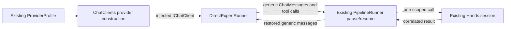
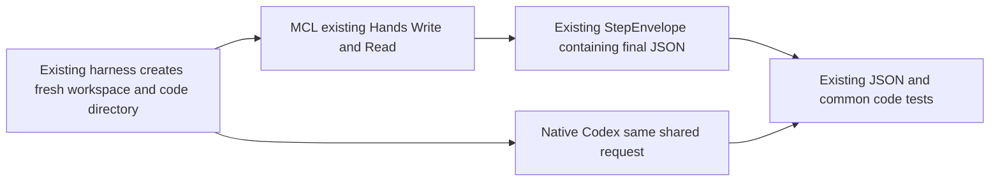

# Phase 74 — Responses provider integration

> Historical design, review, and verification record. Current delivery observations are recorded below in the final delivery section.

Current implementation plan: [complete implementer plan r3](phase-74-responses-provider-plan_completed.md),
approved after full sequential simplicity/ownership reviews and supervisor gate checks.

## Requirement

Enable the existing provider-neutral MCL execution path to perform reasoning-model file-tool calls,
then rerun the shared-prompt MCL versus native Codex code-writing comparison from an isolated
temporary Forge copy. GPT-6.1 Sol rejected the current Chat Completions tool request; the official
model contract requires Responses for tools.

## Operator requirements — mandatory design-review checklist

The simplicity and ownership reviewers must return a verdict against every row, in addition to
their full persona checklists. These are constraints, not optional future improvements.

| Requirement | Required design response |
|---|---|
| “do not invent anything new” / “maximize code reuse” | Search and reuse existing SDK adapters, factories, tests, and contracts before adding anything. |
| “adapt only where variations are fit for purpose” | Keep protocol variation inside its existing provider boundary; justify each variation from an actual provider contract. |
| “componentized pluggable and reusable” | Extend the existing component model and replacement seams; no speculative framework or new library. |
| “not only applied to openai…other models using the same code path” | Keep the common runtime provider-neutral; model/provider details stay behind the same existing chat-client contract. |
| “generic and DI” | Preserve the existing injected `IChatClient` seam; callers do not inspect concrete provider clients. |
| “use SRP and separation of concerns” | Provider translation, mission execution, and capability execution retain separate existing owners. |
| “ensure ownership and simplicity” | Derive placement from the component atlas and READMEs; use the least justified change. |
| “don't re-design the existing code base…fit into its existing model and extend elegantly” | Understand current owners and flows before design; no replacement architecture. |
| “One code path — there's always hands” | Preserve the shared tool pause/resume and Hands execution path; no provider-specific tool executor or duplicate run path. |
| Defer multiple simultaneous tool calls | Keep the existing one-call contract; parallel capability dispatch is outside this task. |
| Use non-AOT for local dev; Native AOT at the end | Managed checks during revisions; final current-source native publish after stabilization. |
| Protect the other agent's work; use temporary Forge for the comparison | Work only in isolated task worktrees and copied comparison runtime; preserve original experiment evidence. |
| Shared prompt; separate MCL and Codex results | Both comparison scripts source the same instruction file and keep independently named results. |
| Genuine MCL versus native Codex comparison | MCL experts call the provider directly through Forge; they never launch or wrap Codex. Keep one independently runnable script per engine. |

## Owners and investigation

| Repository | Task location / responsibility |
|---|---|
| forge-mcl | `/Users/ameerdeen/.codex/worktrees/responses-provider/forge-mcl`: investigate existing `ForgeMission.ChatClients` SDK construction and Core continuation compatibility. Product scope follows the locked design. |
| mission-control-language | `/Users/ameerdeen/.codex/worktrees/responses-provider/mission-control-language`: design, review requirements, evidence and workflow timestamps. |

Existing Microsoft.Extensions.AI.OpenAI 10.7 provides a Responses `IChatClient` adapter. Investigation
established reasoning/tool continuation, streaming, structured output, existing endpoint behavior,
and final Native AOT compatibility before choosing the implementation. No new protocol knob,
model-name routing, silent fallback, SDK wrapper, package or runtime branch is approved.

### Current observations (not an approved implementation)

| Observation | Evidence / consequence |
|---|---|
| GPT-6.1 Sol tools require Responses; `none` is unsupported | [Official model contract](https://developers.openai.com/api/docs/models/gpt-6.1-sol). Disabling reasoning is not a valid fix. |
| An existing SDK adapter implements the current DI seam | Cached Microsoft.Extensions.AI.OpenAI 10.7 XML documents `ResponsesClient.AsIChatClient(defaultModelId)`. No added dependency is needed. |
| Core currently retains calls only | `DirectExpertRunner.cs` extracts `FunctionCallContent`; `PipelineRunner.PauseAsync` builds an assistant checkpoint message from those calls, dropping other response content. Full-message continuation fit is under investigation. |
| The SDK already defines serializable protected reasoning | `TextReasoningContent.ProtectedData` and `AIJsonUtilities` are existing provider-neutral content/serialization facilities; a throwaway SDK probe preserves protected data and call IDs. Native raw item IDs do not survive that serialization. Real replay was subsequently validated; see locked design evidence below. |
| Azure's advertised endpoint is explicitly Chat Completions | `ForgeMission.Cli/Program.cs:1589` emits a deployment Chat Completions URL with an API-version query. A blind protocol switch would violate this existing endpoint contract. |

### Gates for this bounded change

| Gate | Current scope answer |
|---|---|
| Security / tiers / data | Local mission runtime and existing outbound provider boundary only. No hosted ingress, datastore, cross-context access, identity/RBAC or deployment change. Provider keys stay in their current owner/process environment and never enter evidence artifacts. |
| Reversibility | Protocol construction and generic continuation handling are reversible behind existing interfaces; no new public entry point or bounded-context contract is proposed. No architectural security exception requested. |
| Ownership / SRP | ChatClients owns SDK/protocol adaptation; Core owns provider-neutral mission continuation; Hands owns scoped capability execution. No caller executes a tool through a provider adapter. |
| Failure boundary | Existing provider failures propagate to the step/CLI error contract; no silent retry through another protocol/model. Serialization/replay and cancellation failure observations must be named in the locked design. |
| Structural containment | Isolated task worktrees, dedicated disposable comparison cwd/results, and existing scoped Hands workspace authority. No shared installed binary is replaced during investigation. |
| Library / abstractions | Reuse the already referenced SDK and generic content serializer. No new DI interface, framework, model registry, provider-specific executor or policy knob proposed. |
| UI / hosted deployment | N/A: this task changes neither a visual surface nor hosted topology. |

### Investigation evidence layers

Throwaway SDK/local-wire/live-provider probes are controlled component evidence, kept outside
the repositories. They establish adapter fit; they do not close installed default-path acceptance.
The exact request configuration, native metadata requirements and final verification contract
remain design questions until the real serialized reasoning/tool replay probe returns.

## Locked design r3

Use the already referenced Responses SDK adapter for every `openai` profile behind the existing
injected `IChatClient`. Preserve the explicit Azure, Ollama, xAI and Anthropic protocol contracts.
Configure stateless Responses and encrypted reasoning at the existing ChatClients boundary using
the SDK builder/options hook. Core retains complete generic model response messages through its
existing tool handoff and serialized checkpoint, instead of retaining calls alone. Hands continues
to execute exactly one scoped call per pause through the existing run loop. Generic SDK errors
must propagate as step failures, including embedded `ErrorContent`; no empty successful result.

### Behavior and ownership

| Behavior | Existing owner / component-fit evidence |
|---|---|
| Select SDK protocol and stateless Responses options | forge-mcl `ForgeMission.ChatClients/README.md` Purpose / Owns / Change admission: provider construction and protocol adaptation below Core. |
| Preserve generic response content across root tool pauses | forge-mcl `ForgeMission.Core/README.md` Owns / Use these pieces: provider-neutral execution and replay checkpoint. No OpenAI native type in Core. |
| Interpret generic provider failure content | Core `DirectExpertRunner`: provider-neutral expert result interpretation; HTTP SDK errors already propagate. |
| Scoped file authority, dispatch and session lifetime | Existing Hands/CLI composition; unchanged. No provider executes capabilities or changes policy. |
| Comparison scripts and evidence | Existing mission-control harness, copied to its dedicated temporary workspace; shared instruction, separate engine results. |

### Concrete contracts

| Contract | Locked decision |
|---|---|
| Profile / injection | Existing `ProviderProfile` and `DirectExpertRunner(IChatClient)` unchanged. No new profile field, mode, protocol selector or DI interface. |
| Protocol | OpenAI uses Responses for both tool-free and tool calls. Azure retains its advertised Chat Completions deployment endpoint. Ollama/xAI retain their current endpoints; Anthropic adaptation remains owned there. Provider variation is functional, never model-name routing or error-triggered fallback. |
| SDK configuration | Reuse `GetResponsesClient().AsIChatClient(profile.Model)` plus `ChatClientBuilder.ConfigureOptions` / `ChatOptions.RawRepresentationFactory` to set `CreateResponseOptions.StoredOutputEnabled=false` and `IncludedProperties = { "reasoning.encrypted_content" }`. These exact options were exercised in `/tmp/forge-responses-probe/Program.cs:9`. Preserve existing endpoint/key construction. Scope `OPENAI001` opt-in to the experimental SDK API call, never suppress build/trim/linker warnings globally. |
| Tool handoff | Keep existing `tool_calls` contract. Add internal `PipelineToolContinuationInstructions.ResponseMessages`, key `__pipeline_tool_response_messages`, value `IReadOnlyList<ChatMessage>`. Both async/streaming DirectExpertRunner paths assign complete SDK `ChatResponse.Messages` only when the same response's last message contains the calls assigned to `tool_calls`. Thus the last retained message has the same pending call(s), order and IDs; no independent reconstruction or native provider metadata is introduced. PipelineRunner consumes/removes this metadata at the invocation boundary, appending it to the existing turn. A runner supplying only the existing call contract gets its current synthesized assistant message at that boundary. Both normalized forms converge before the one existing checkpoint constructor; `PauseAsync` appends neither a duplicate call nor an extra assistant message. |
| Serialized continuation | Existing `PipelineContinuationCheckpoint.TurnMessages` and MEAI JSON metadata, envelope/inner versions and public resume contract unchanged. Preserve response order, text/reasoning/protected data/call IDs and correlated results. Native `RawRepresentation` is not persisted and is not introduced into Core. |
| Native item IDs | Pinned SDK omits IDs after serialization. Real Sol call replay succeeded without a function item ID; generic protected reasoning serialization is controlled evidence. Azure Foundry project Responses endpoints that require reasoning IDs are not newly supported here. Do not invent an ID adapter or silently claim those endpoints work. |
| Restored tool-result representation | Existing MEAI codec restores generic object results as `JsonElement`; pinned Responses adapter serializes restored string results with JSON quotes, while a newly appended raw string is sent unquoted. Preserve this existing representation, assert exact call/result pairing and wire values; no serializer replacement or new normalization. SDK source `/tmp/OpenAIResponsesChatClient.cs` result switch and existing Core `ResumedTurn` independently inspected. |
| Failure | HTTP/provider errors and cancellation retain their declared propagation. For returned generic `ErrorContent`, DirectExpertRunner throws with its provider message instead of creating a pass; streaming must also throw. Pinned Responses SDK omits generic errors for an empty failed `ResponseResult` and for `StreamingResponseFailedUpdate`. ChatClients therefore uses existing `ChatClientBuilder.Use(responseDelegate,streamingDelegate)` callbacks to normalize those native failures into generic `ErrorContent` when the SDK did not already supply it. No custom `IChatClient` implementation or SDK adapter is added. No automatic protocol/model fallback or retry. |
| Capability contract | Existing one-call/root-scope declarations and Hands workspace policy, cancellation and disposal unchanged. No parallel dispatch or web-tool feature added. |

#### Provider failure normalization — r3 correction

The existing SDK delegate middleware calls its supplied inner `IChatClient` exactly once and
returns its successful response/updates unchanged. A small provider-owned
`OpenAiResponseFailures` helper holds the two callbacks and shared native-error projection;
it implements no interface, contains no tool executor/retry and is not a replacement chat client.
This is a real protocol failure seam, following the existing `AnthropicProviderError` boundary
pattern while reusing the SDK's delegate middleware rather than copying an adapter.

| Input / condition | Required generic output |
|---|---|
| Completion `ChatResponse.RawRepresentation` is `ResponseResult` whose `Error` is present or `Status` is failed, and messages contain no `ErrorContent` | Append one assistant `ChatMessage` with `ErrorContent`, using the native error's `Message`; if absent/empty use fixed `The model provider returned a failed response.`. Never reinterpret a failed status as an empty pass. |
| Stream `ChatResponseUpdate.RawRepresentation` is `StreamingResponseFailedUpdate`, without existing generic error content | Append one `ErrorContent` to that update using `Response.Error.Message` or the same fixed summary, then yield it. DirectExpertRunner rejects it through its one generic failure interpreter. |
| SDK already supplied `ErrorContent` (including `StreamingResponseErrorUpdate`) | Preserve it; no second failure interpreter or duplicate error content. |
| HTTP exception / cancellation | Propagate unchanged; no catch-and-continue, retry or fallback. |

Native SDK types stay entirely in ChatClients. Failed completion and failed SSE fixtures exercise
this provider normalization through the public factory and generic DirectExpertRunner. Core tests
also prove generic error interpretation independently, so another injected provider uses the same
error/continuation/runtime path. This correction adds no new consumer or public/wire/checkpoint type.

### Reuse and decisions

| Need | Existing piece used |
|---|---|
| Responses client | Already referenced Microsoft.Extensions.AI.OpenAI 10.7 / OpenAI 2.11; no added package. |
| Generic provider injection | Existing `IChatClient` constructor and public factory. |
| Stateless native options | Existing SDK builder/options configuration, no custom `IChatClient` wrapper. |
| Missing generic failure content | Existing SDK delegate middleware; existing Anthropic error-translation boundary pattern, with Responses-specific native projection in the same provider owner. |
| Reasoning serialization | Existing `TextReasoningContent.ProtectedData`, `ChatMessage`, `AIJsonUtilities` and checkpoint codec. |
| Tool execution | Existing root pause/resume and Hands; no second tool loop. |
| Controlled provider verification | Existing local HTTP-listener test pattern and scripted Core runner fixtures. |

Designer principles that changed decisions: one code path preserves the existing Core/Hands loop;
no NIH reuses the SDK adapter and serializer; one owner keeps protocol in ChatClients and replay
in Core; minimum needed excludes new switches/parallel tools/endpoint frameworks; no legacy paths
excludes model-name routing and failure fallback; built-in safety keeps isolated worktrees and scoped
Hands authority; verified means done separates component probes from installed acceptance.

Rejected: direct HTTP Responses implementation (SDK exists); provider-specific tool executor
(duplicates Hands); model-name routing / protocol knob / fallback (unrequested second path);
new DI registry/interface (existing injection fits); blind Azure migration (violates advertised URL);
native-ID wrapper (not justified for the supported endpoint); broad architecture redesign (operator
explicitly rejected it).

### Done when and default-path verification

| Condition | Required observation |
|---|---|
| One shared runtime with SDK reuse | Independent design/plan/code reviews pass every operator requirement and full personas; approved diff stays in existing owners. |
| Tool reasoning survives replay | Controlled Responses fixture performs two successive serialized root tool pauses/resumes with protected reasoning, text and exact call/result correlation; original calls-only source fails the reasoning assertion. Generic non-OpenAI call fixtures still pass. Real Sol tool roundtrip passes; whether it emits encrypted reasoning is recorded honestly. |
| Existing modes and failures remain explicit | Focused structured-output, streaming/usage, existing endpoint routing, HTTP failure, embedded error, cancellation and one-call checks pass. Full solution managed tests/build pass with zero warnings. |
| Native artifact | Final current-source Native AOT publish passes existing canonical macOS CI zero-warning gate after managed stabilization; independently inspect source identity, native help/version and artifact logs. |
| Normal local user path | Installed merged-main native Forge from normal `make install` (or complete published platform release payload), real OpenAI endpoint/key and ordinary `forge.toml`; disposable project cwd, `forge init` then `forge run`, no mode/provider stub/endpoint override. A real Sol agent writes and reads files, independently checked bytes and final result; outside sentinel remains unchanged. Protect other agent installations during preparation. |
| Comparison | New isolated copy of the verified Forge runs the existing shared code-writing prompt; native Codex runs its own script with the same prompt/settings snapshots, separate `results/mcl` and `results/codex` runs. Preserve failure evidence; report successful build outcomes and common tests alongside net wall time. No speed conclusion from a failed run. |
| Delivery | Reviewed product PR merged; actual default-path observations and all real stage/rework timestamps recorded; closure docs merged and task worktrees removed without touching other agent work. |

Expected failure owner/recovery: ChatClients/SDK owns provider transport errors; DirectExpertRunner
owns generic error interpretation; PipelineRunner exposes step failure; CLI returns nonzero and keeps
partial files visibly partial. Recovery is a fresh operator run, not hidden replay through another
model. Hands remains the mutation containment boundary. Controlled failure tests and real outside-root
sentinel checks prove the respective boundaries. Local platform linker diagnostics, if observed,
must be recorded separately from canonical zero-warning native evidence rather than suppressed.

Open design questions: none in this supported scope. Real encrypted reasoning emission was
absent in two live Sol probes; that limits the live observation, not the generic serialization
contract. Both independent reviewers checked the complete design, every operator-requirement row,
handoff normalization, owner boundaries and this evidence distinction. Simplicity r2 and ownership
r1 passed the previous revision. Planning then exposed missing generic errors for two native SDK
failure shapes. Both full current reviews pass: simplicity r3 and ownership r2 checked every
operator requirement and their complete personas. Supervisor re-locks this complete r3 design;
a material deviation returns to design or planning.

## Workflow events

Times are Dubai (UTC+04:00), 2026-10-08. Unknown boundaries are not inferred.

| Stage / event | Status | Started | Finished |
|---|---|---|---|
| 0 Scope and isolation | Scope recorded; no product changes | 03:58:20 | 04:06:52 |
| 0.1 Existing SDK and continuation investigation | Complete; controlled/live limitations recorded | Not recorded | 04:06:52 |
| 1 Supervisor design draft | Written; requirements explicit | 04:06:52 | 04:08:08 |
| 1.1 Simplicity design review r1 | REVISE: lock exact internal handoff contract | Not recorded | 04:09:55 |
| 1.2 Supervisor design correction | Exact key/type, call correlation, one checkpoint and encrypted include defined | Not recorded | 04:09:55 |
| 1.3 Simplicity design review r2 | PASS: full checklist and all operator requirements | 04:10:04 | 04:11:13 |
| 1.4 Ownership design review | PASS: independent owners and all operator requirements | 04:11:13 | 04:12:37 |
| 1.5 Supervisor design lock | LOCKED; SDK reuse, generic continuation and existing owner boundaries | 04:12:37 | 04:12:37 |
| 2 Implementer plan r1 | BLOCKED: SDK empty failure / response.failed lacks generic error | 04:12:37 | 04:15:20 |
| 2.1 RETURN TO DESIGN: supervisor failure-boundary correction | Written; provider-native normalization uses existing SDK middleware | 04:15:20 | 04:16:37 |
| 2.2 Simplicity full design review r3 | PASS: full design and every operator requirement | 04:16:48 | 04:18:30 |
| 2.3 Ownership full design review r2 | PASS: full design and every operator requirement | 04:18:30 | 04:19:53 |
| 2.4 Supervisor re-lock of complete design r3 | LOCKED; no remaining design questions | 04:19:53 | 04:19:53 |
| 2.5 Revised implementer plan r2 | Returned; full files/reuse/verification contract | 04:19:53 | 04:23:09 |
| 2.6 Simplicity plan review r1 | REVISE: existing OpenAI CLI fixture migration missing from file scope | 04:23:09 | 04:25:03 |
| 2.7 Implementer plan correction r3 | Returned: migrate existing fixture, stage valid baseline, explicit empty-message fallback | 04:25:03 | 04:27:03 |
| 2.8 Simplicity plan review r2 | PASS: full current plan and every operator requirement | 04:27:03 | 04:28:06 |
| 2.9 Ownership plan review r1 | PASS: full current plan and every operator requirement | 04:28:06 | 04:29:46 |
| 2.10 Supervisor plan approval | APPROVED: full r3 plan and applicable gates checked | 04:29:46 | 04:29:46 |
| 3 Implementation and managed regression checks | Frozen; 976 full tests pass / 8 optional skips; 112 focused pass both; Debug/Release zero warnings | 04:29:46 | 04:44:33 |
| 3.0 Before-fix regression baseline | 3 intended assertion failures after valid Responses exchanges; `/tmp/forge-responses-baseline.log`, observed 04:32:34 | Not recorded | Not recorded |
| 3.0.1 Implementation correction: failed SSE event without status | Verified failed/passed fixture; event type now sufficient; `/tmp/forge-responses-failed-event-before.log`, completion observed 04:41:12 | Not recorded | 04:41:12 |
| 3.0.2 Full-suite test environment correction | Preliminary missing-key failure/live tests from inherited MCL key; owned child tree stopped, clean child rerun 976 pass / 8 skips | Not recorded | 04:44:33 |
| 3.1 Simplicity and code-style full review r1 | REVISE: test helper ordering; manual existing-function complexity is 16; native pending | 04:44:33 | 04:46:24 |
| 3.2 Ownership full code review r1 | PASS: all behaviors and operator requirements; role restore hit capacity, timer temporarily interrupted | Not recorded | 04:48:39 |
| 3.3 Implementer correction r2 | Verified declaration relocation only; Debug/Release builds zero warnings, focused 112 pass each | 04:48:39 | 04:50:01 |
| 3.4 Simplicity and code-style full review r2 | PASS source: helper order fixed, original/current complexity 16 exception independently verified; native pending | 04:50:01 | 04:52:37 |
| 3.5 Ownership full code review r2 | PASS: full artifact, all operator requirements, unchanged component ownership | 04:52:37 | 04:53:30 |
| 4 Ready-to-merge checks | PASS: source, managed and canonical native gates | 04:53:30 | 06:17:56 |
| 4.0 Integration wait | Other agent finished; PR69 merged, remote main `b53df9c`; local verification comes first, rebase follows, CI last | Not recorded | 05:11:17 |
| 5 Product merge | PASS: PR70, merged tree equals reviewed tree | Not recorded | 11:45:59 |
| 6 Installed default-path acceptance | PASS: actual merged-main native, real provider, scoped bytes/errors/tool-free/cancellation | 11:53:11 | 11:54:12 |
| 6.0 Controlled managed-copy comparison: MCL | FAIL: empty final output/no code files, 135.635s; original logs retained | 04:55:17 | 04:57:33 |
| 6.1 Operator stop / local test resume | Work and timer stopped on request; later explicitly authorized local non-AOT tests, no CI prerequisite | Not recorded | Not recorded |
| 6.2 Simple real-provider managed Write/Read | PASS: independently read `LOCAL_HANDS_OK`; `/tmp/forge-local-hands-path.txt`, not whole-task acceptance | Not recorded | Not recorded |
| 6.3 Full MCL rerun | FAIL: same empty-output/no-files result, 133.412s | 05:06:06 | 05:08:19 |
| 6.4 Native comparison cancelled by operator | Interrupted at 61.443s; no comparison reported | 05:08:33 | 05:09:34 |
| 6.5 Existing implementer investigates actual code-writing failure | Complete; actual live missing-parent result and deterministic bare-JSON null text proven; no product edits | 05:11:17 | Not recorded |
| 6.6 RETURN TO DESIGN: harness correction r4 | Reviewed and locked; no Hands/product correction | 05:20:13 | Not recorded |
| 6.7 Simplicity full design review r4 | PASS: all checks and 14 operator requirements | Not recorded | Not recorded |
| 6.8 Ownership full design review r3 | PASS: complete current artifact and all operator requirements | Not recorded | Not recorded |
| 6.9 Implementer bounded harness plan r4 | Returned; two temporary files only, no product correction | Not recorded | Not recorded |
| 6.10 Simplicity full plan review r3 | PASS: complete current plan and all requirements | Not recorded | Not recorded |
| 6.11 Ownership full plan review r2 | PASS: complete current plan and all requirements | Not recorded | Not recorded |
| 6.12 Supervisor harness plan approval | APPROVED; current design/plan and all gates checked | 05:26:11 | 05:26:11 |
| 6.13 Implementer harness correction and real MCL verification | PASS: approved two-file correction, protected inputs unchanged, actual MCL code/tests/JSON verified | 05:26:11 | Not recorded |
| 6.14 Deterministic harness checks | PASS: both parent directories, exact envelope roundtrip, eight existing tests, eight protected input hashes unchanged | Not recorded | Not recorded |
| 6.15 Full corrected nonstreaming MCL run | PASS: run `20261008T012752Z-01853ec2`, copied managed `6772383`, 20 generated/common tests, 135.566s | 05:27:52 | 05:30:08 |
| 6.16 Native Codex comparison after MCL success | PASS: actual code, approved decision, 22 generated/common tests; 211.854s | 05:30:29 | 05:34:01 |
| 4.1 Product rebase onto other agent merged main | PASS: clean rebase to `3019249`; task patch ID unchanged, selection/theme/tests/workflow equal main | Not recorded | Not recorded |
| 4.2 Rebased managed integration | PASS: Release zero warnings, focused112 pass/2optional skips; full Debug988 pass/8optional skips | Not recorded | Not recorded |
| 3.6 Simplicity and style full current code review | PASS source; complete rebased product and harness artifact, all operator requirements; native pending | Not recorded | Not recorded |
| 3.7 Ownership full current code review | PASS: complete rebased product and harness artifact, all operator requirements | Not recorded | Not recorded |
| 4.3 Final canonical macOS native verification | PASS: run37713808889, native identity and zero compiler/linker warnings | 05:37:06 | 06:17:56 |
| 4.4 Canonical product/package checks | PASS: GitHub job advanced to native publish; exact job boundaries recorded | 05:37:26 | 05:42:56 |
| 4.5 Canonical Native AOT publish | PASS: zero compiler/linker warnings | 05:42:56 | 06:17:34 |
| 7 Documentation and closure validation | PASS: harness/common tests, document links, credential scan and source/doc whitespace; merge follows | Not recorded | 11:56:55 |

## Narrow engineering exception — existing invocation complexity

Supervisor independently compared original `origin/main` and current `PipelineRunner.InvokeStepAsync`: both have classic McCabe 16 (1 + five ifs + foreach + ternary + catch + seven short-circuit conditions; null-conditional access excluded). The implementation adds metadata capture/cleanup and a normalized-turn argument, no decisions. Retain this existing function shape for this bounded task to honor the operator no-redesign/minimal-change requirement; new helpers remain at most 5. This exception covers only this existing method, permits no increase, and must be re-evaluated/removed when a future change adds a decision or splits its invocation/replay responsibilities for a real ownership reason. Reversal is reverting this task; no public, persistence, authority or provider contract depends on the exception. Reviewers must verify the baseline and current count, not use the implementer initial count of 15.

## Diagnosed comparison failures and successful rerun

The original two full MCL runs on copied managed commit `6772383` produced empty stdout with CLI exit 0 and no requested files. Their valid design/reviews, failed folders and cancelled native outcome remain preserved. The diagnosed harness failures below are corrected through full independent design/plan reviews and explicit approval. A subsequent ordinary nonstreaming MCL run succeeds; native Codex was launched only after actual MCL files and common tests passed. CI/AOT follows local verification. Product rebased cleanly onto `b53df9c`; task patch ID is identical and the other agent's files remain equal to main.

### Successful comparison — 2026-10-08

| Engine / run | Elapsed | Actual code and tests |
|---|---|---|
| MCL `20261008T012752Z-01853ec2` | 135.566s | Both requested files, unchanged final JSON, 20 generated/common tests PASS. |
| Native Codex `20261008T013029Z-315f8836` | 211.854s | Both requested files, approved final decision, 22 generated/common tests PASS. |

MCL used 76.288s less, 36.0% less elapsed time; native used 1.56 times MCL's time in this one run. Shared prompt/settings/schema/workflow/common-test hashes match. Ten common acceptance tests pass in each; generated test counts differ. This proves successful comparable outcomes, not statistical speed equivalence or identical semantics. Native accepts Decimal/Fraction inputs and returns exact Fraction doubles; MCL restricts input to int/float and returns float/int doubles. Both passed the shared tested int/float cases. No causal attribution of latency is established.

Results remain under the existing dedicated temporary harness `results/mcl` and `results/codex`. Logs and diagnostics copied to `/Users/ameerdeen/.codex/artifacts/responses-provider`. Product rebased SHA `3019249d8420e2818544dea4b35dd50ff5a6f7b0` has the exact pre-rebase patch ID `fc99feedba86d5c2e2d94548c71d80d9e15c33c5`; Release build zero warnings/errors, focused112 PASS/2optional skips, full Debug988 PASS/8optional skips (`forge-responses-rebased-*.log`). Canonical native verification subsequently passed; installed acceptance is recorded in final delivery.

Preserved runnable harness: `/Users/ameerdeen/.codex/artifacts/responses-provider/harness`; `harness.py` SHA256 `75DB2A6DD29661612284FA818ECEF609FC6B5E7E9ECE9046915CD0D84C920801`, identical to the successful temporary source. Both independent scripts still use one shared prompt. Full successful results copied to sibling `comparison/mcl` and `comparison/codex` folders. Product [PR70](https://github.com/katasec/forge-mcl/pull/70) subsequently passed [canonical native verification](https://github.com/katasec/forge-mcl/actions/runs/37713808889) and merged.

### Diagnosis and harness correction design r4 — 05:20:13 Dubai

Two comparison setup/contracts caused the observed failure; no additional product defect is established. Actual live Write returned `ERROR [Failed]: Failed to write code/retry_delay.py: Could not find a part of the path .../code/retry_delay.py`; copied Bob succeeds unchanged when the parent exists (`/tmp/forge-build-live-result.log`, `/tmp/forge-bob-parent-diagnostic.log`). Hands error text is clear and the operator explicitly requires no change. A deterministic DirectExpertRunner probe given bare approved business JSON returns `Text=null, Status=pass` (`/tmp/forge-business-json-diagnostic.log`); this deserialization predates the migration. SaveResults already retains valid compact final JSON. The earlier StepWriter probe selected streaming, so its preserved final text does not prove nonstreaming behavior.

Correct the existing temporary code-writing harness only: create empty `code/` inside each engine's fresh workspace before execution; have BuildCode return the existing step envelope with `text` containing the unchanged final decision JSON, `status: pass`, and `reason: null`. Existing runtime parsing then produces the same bare final JSON the harness validates. Keep shared request/personas/settings and common tests unchanged. Preserve original failed runs and each subsequent run's source snapshots. No Hands, error-message, provider or Core changes are authorized for these harness issues.

| Behavior | Owner / reuse |
|---|---|
| Prepare empty comparison workspace | Existing harness subprocess/file boundary, `tools/supervisor-test/README.md`; reuse pathlib mkdir, no new abstraction. |
| Ask expert for valid step output | Existing BuildCode expert prompt and StepEnvelope contract; no runtime parsing change. |
| File errors and scoped dispatch | Existing Hands unchanged; no mkdir feature, error rewrite or parallel calls. |
| Evidence and shared tests | Existing harness snapshots, unique result folders and common tests unchanged. |

Security: only dedicated disposable workspace directories; credentials remain in process environment. Hosted/UI/data/identity gates N/A. Engineering: fixed setup, existing envelope, no knob/framework/retry or duplicated executor. Default acceptance still requires final installed merged native artifact; managed comparison is pre-merge evidence. Done when the nonstreaming MCL script writes both actual files, preserves final JSON, and passes common plus generated tests; only then run native Codex and compare successful outcomes. Product rebase preserves merged selection work; CI/AOT last. Open questions: none for this bounded correction. Independent design/plan reviews remain required before executable edits.

Rejected: changing Hands to create parents (unrequested behavior); changing Core JSON parsing for this harness prompt (existing envelope suffices); repeating native Codex before MCL passes (no meaningful comparison).

Designer principles changing decisions: minimum needed confines correction to the harness; no NIH uses pathlib and the existing envelope; one owner leaves file policy in Hands and setup in the harness; verified means done requires actual files and tests rather than exit 0.

## Final delivery

Product [PR70](https://github.com/katasec/forge-mcl/pull/70) merged 2026-10-08 11:45:59 Dubai, commit `4976129a15a5961421134079b520f15f3d6a2cd5`. Its tree is identical to reviewed head `3019249` and canonical CI merge candidate `e06c197`. The prior Hands integration is already merged in [PR68](https://github.com/katasec/forge-mcl/pull/68), commit `9b4cbea`. Other agent selection work from PR69 is retained unchanged.

Canonical [CI37713808889](https://github.com/katasec/forge-mcl/actions/runs/37713808889) passed: 982 tests / 10 optional skips, package slice 27 tests, native publish with zero compiler/linker warnings, and native help/version identity. Product checks 05:37:26–05:42:56; AOT 05:42:56–06:17:34; job completed 06:17:56 Dubai. Node action deprecation notices are infrastructure notices, not compiler/linker warnings. Full logs are preserved in `tools/supervisor-code-test/evidence/verification/native-ci-full.log`.

The session harness and complete successful sample are committed under [tools/supervisor-code-test](../../tools/supervisor-code-test/README.md). Executable inputs are unchanged from the reviewed successful temporary harness; `harness.py` SHA256 `75DB2A6DD29661612284FA818ECEF609FC6B5E7E9ECE9046915CD0D84C920801`. Eight existing harness tests pass after relocation. The design-only harness remains separate and unchanged.

## Session inventory

| Work | Committed / merged home |
|---|---|
| Initial independent design comparison | mission-control-language PR359 (`3919db6`), already merged; `tools/supervisor-test` |
| Per-stage MCL timestamps | mission-control-language PR360 (`5ca2576`), already merged |
| Always-on Hands for local run | forge-mcl PR68 (`9b4cbea`), already merged; [Phase 73 evidence](phase-73-forge-run-hands_completed.md) |
| Hands delivery documentation | mission-control-language PR362 (`2a11881`), already merged |
| Responses and generic tool continuation | forge-mcl PR70 (`4976129`), merged; five product code files, four test files, one component README |
| Code-writing harness, successful outputs, tests, diagnostics and workflow closure | This documentation/tooling closure PR; `tools/supervisor-code-test` and Phase 74 records |
| Native executable / sidecars | Generated outputs remain in canonical CI artifact and `/Users/ameerdeen/.codex/artifacts/responses-provider/native-ci`; source, hash, version, help and logs are committed as evidence. Generated binaries are not product source. |

No forge-client source changes were required: the already published Hands package is reused. Original failed code-writing runs remain in the dedicated temporary experiment; their run records and logs are retained below without replacing the successful evidence. The earlier discarded Codex-backed experiment is not restored.

## Installed default-path acceptance

| Fact | Observation |
|---|---|
| Artifact | Normal `make install` on clean merged-main `4976129a15a5961421134079b520f15f3d6a2cd5`, 11:46:22–11:52:52 Dubai, exit 0. Installed `/Users/ameerdeen/.local/bin/forge`, version `1.0.0+4976129a15a5961421134079b520f15f3d6a2cd5`, SHA256 `0064dbd7f87d3dad042bd1c6e4d8048a4de715c4b5bb94a15427aa2c10821197`. |
| Defaults | Ordinary `forge.toml`, `openai/gpt-6.1-sol`, inherited `OPENAI_API_KEY`, normal endpoint; no provider stub, endpoint override or Hands flag. Native sidecars retained. |
| Dependency | Existing published Hands and OpenAI SDK; official Responses route. |
| Starting state | Dedicated empty disposable cwd; missions outside cwd; outside sentinel and escaping symlink. |
| Action | Installed `forge init` then `forge run`; real Write → Read, outside request, symlink escape, tool-free mission, SIGINT after actual step admission. |
| Outcome | Write/Read stdout and independently read bytes exactly `hands-default-ok` (16 bytes), exit 0. Both denied requests return `ERROR [Failed]` and leave `outside-sentinel` unchanged. Tool-free stdout exactly `tool-free-ok`, exit 0. Cancellation exits 130, `Mission cancelled.`, empty stdout. |
| Controlled tests | Managed probes, local wire fixtures and earlier temporary copied runtime are explicitly lower-layer evidence; installed acceptance above uses real defaults. |
| Evidence | [Report](../../tools/supervisor-code-test/evidence/default-acceptance/report.json), [cancellation](../../tools/supervisor-code-test/evidence/default-acceptance/cancellation.json), [install log](../../tools/supervisor-code-test/evidence/verification/main-install.log). |

Refused tools are model-visible failed results; the model returned their errors and completed with exit 0 as designed. Local install retains six known macOS platform linker warnings; canonical CI independently passes the zero-warning compiler/linker gate. No warnings were suppressed. The first cancellation test matched the mission header too early; the corrected test waits for the actual `→ Probe...` step-admission line before SIGINT. Its observed exit 130 is the acceptance evidence.

## Closure

All product changes are merged; default acceptance passed. The checkpoint merges the harness, successful generated outputs and exact snapshots, failed-run records, diagnostic/verification logs, operator requirements, approved plans, reviews and real stage/rework timestamps. No project-memory files were found in the scoped project memory directory. UI/hosted deployment gates are N/A. Source changes were already independently reviewed; preserving unchanged harness inputs and closing docs adds no product behavior. Eight existing harness tests, local document links, credential-pattern scan and whitespace validation pass.

Product end-to-end span: 03:58:20 scope to 11:45:59 last product merge = 7h47m39s; this is wall time including waits/interaction, not active implementation time. Installed acceptance is later, 11:53:11–11:54:12. Closure PR is excluded from the product timing span. After closure merge, task-owned worktrees are removed; other agent's selection worktree is preserved.

Raw subprocess logs are preserved verbatim, including emitted trailing whitespace; source and documentation whitespace checks exclude those frozen evidence captures. Re-exercising the preserved generated suites passed 20 MCL and 22 native tests; no new provider runs were required for unchanged snapshots.
