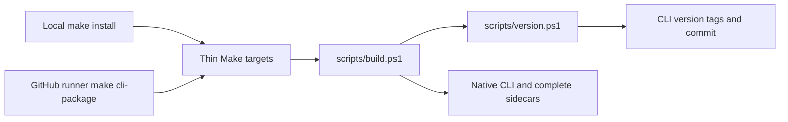
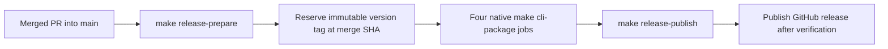

# Phase 75 — Shared CLI builds and releases on merge

**Status:** Simplicity and ownership design reviews PASS; implementation awaits operator approval. The operator requested a
design and sequential simplicity/ownership reviews, then a terse proposal. They explicitly waived
the implementation supervisor workflow for this CI task. The branch
`adeen/cli-merge-release-versioning` was created in both repositories; the forge-mcl branch is
reserved for implementation, with no executable changes made.

## Design

`forge-mcl` owns one portable PowerShell build path, called through Make on laptops and GitHub
runners. Git tags supply version identity. Every merged PR into its `main` starts a release;
the default increment is minor, a bug-fix PR labelled `release:patch` increments patch, and no
automatic path increments major. Local and ordinary CI builds carry a development suffix.
Preserve the existing four native platforms, ZIP sidecars, checksums and macOS prerequisites.

## Locked scope and ownership

| Behaviour | Owner / proposed placement |
|---|---|
| CLI version calculation | forge-mcl `scripts/version.ps1`; [repo README](https://github.com/katasec/forge-mcl#build) owns CLI builds |
| CLI build, native verification, install, archive and checksum | forge-mcl `scripts/build.ps1`; same implementation for local and all native runners |
| CLI tag reservation and GitHub release mutation | forge-mcl `scripts/release.ps1`; uses existing Git/GitHub CLI tooling |
| Trigger, runner matrix, dependency installation, permissions, job dependencies and artifact transfer | forge-mcl `.github/workflows/release.yml` |
| Make entry points | forge-mcl `Makefile`: affected targets contain script invocations and argument forwarding only |
| Existing CLI verification consumer | forge-mcl `.github/workflows/publish-terminal-extensions-package.yml`: replace its inline CLI build/identity blocks with the same Make/script calls |
| Product runtime and package versions | Unchanged: no C# edits, independent NuGet versions/publish triggers unchanged |
| Design, policy and completion evidence | mission-control-language phase spoke and governing default-path document |

Forge repository map supplied to the ownership reviewer:

| Repository | Product responsibility / workflow ownership |
|---|---|
| forge-mcl | Language, CLI, generic execution and its CLI/library build/release workflows |
| forge-runner | Stateless hosted mission execution and runner build workflows |
| forge-conversations | Durable conversation admission/state/dispatch and its builds |
| forge-platform | API, accounts, platform keys, billing, ledger and their builds |
| forge-rooms | Rooms collaboration domain/browser product and their builds |
| forge-client | Katasec.Forge.Client, Client.Contracts and Hands (Bob) packages and their publication |
| forge-desktop | Desktop application/supervision and desktop builds; consumes Client packages |
| forge-infra | Azure deployment configuration/workflows; no CLI release ownership |
| mission-control-language | Agent mission control, plans/rules/missions; no product build ownership |

This list is the scope, from [README](../../README.md#where-the-code-lives). No workflow moves to
mission control, Desktop, Client or infra. No sibling project references or source restoration.

## Version contract

| Build | Identity |
|---|---|
| Official release | Exact reserved `vX.Y.Z` tag at the pinned clean merge commit; binary prints `X.Y.Z+<full-sha>` |
| Local or non-release CI | Nearest reachable CLI release tag plus commit distance: `X.Y.Z-dev.N+<full-sha>`; exact tag locally still has `dev.0` |
| Dirty local tree | Append `.dirty` to build metadata; never accept a dirty official build |

`dev.N` describes development since the base tag; it does not promise the next release number.
Count commits with Git, not per-machine build counters. Tags must match exactly `vX.Y.Z`; exclude
component package tags. Missing tags or shallow history fail with a fetch-history instruction,
never fall back to SDK `1.0.0`. CI checks out full history and fetches tags.

For a new release, use the numerically highest CLI tag in the repository, including reserved tags.
Default `x.y.z -> x.(y+1).0`; `release:patch` gives `x.y.(z+1)`. Read labels from the frozen merge
event, not a shell-interpolated PR title/body or mutable later labels. The first default merge
after current `v0.9.5` reserves `v0.10.0`.

Major increments require the operator's explicit request or approval. This bounded change adds no
automatic major mechanism: `release:major` is an explicit failure explaining that a separately
operator-authorized major release is required. Neither commit text nor a breaking-change inference
can change X. Supporting that deliberate operation is outside this proposal.

`scripts/version.ps1` is the single calculation owner. Release preparation uses it to select the
next tag; release builds use its exact-tag identity; local builds use its development identity.
An explicit release tag supplied by the prepared job selects official identity. `GITHUB_ACTIONS`
alone never makes an untagged CI build official. GitHub outputs/JSON serialization live in scripts,
not shell blocks in YAML or Make.

## Make and script contracts

All scripts require PowerShell 7, Git and the current .NET 10 SDK; remote release operations also
require authenticated `gh`. Existing OS native prerequisites stay documented. No new library.
Resolve repository root from script location. Check every external-command exit code explicitly.

| Make target | Script action / result |
|---|---|
| `build`, `test`, `clean` | `scripts/build.ps1`: existing solution operations; build receives derived version |
| `install` | Same native publish/identity verification, then install complete payload into user-home `.local/bin`; RID detected in script |
| `build-linux` | Same native publish with explicit `linux-x64`; preserve documented target purpose |
| `cli-verify` | Same managed/native verification used by the Terminal.Extensions workflow; preserve its documented live-UI test exclusions and zero-warning gate |
| `cli-package` | Same native publish plus macOS ad-hoc sign, native help/version checks, full ZIP and SHA256 sidecar; RID/output/tag are forwarded arguments |
| `release-prepare` | `scripts/release.ps1`: validate merge context/ancestry, reuse exact existing tag at this SHA or reserve the next immutable tag; emit `tag` and `source_sha` job outputs |
| `release-publish` | Same release script: validate prepared tag/source and exactly four ZIP/checksum pairs, assemble draft and publish |

No parallel local publish recipe or CI-only version implementation. Move existing CLI-only uname/RID
calculations out of Make. Unrelated existing NuGet targets are not refactored in this task; no new
logic is added to them. CLI verification in the package workflow loses its hard-coded `1.0.0` check
and calls the shared script. Package verification/publication behaviour remains owned by its
existing targets/scripts.

## GitHub orchestration and failure boundaries

Replace manual dispatch with `pull_request_target: closed`, filtered to base `main`, and a declarative
`merged == true` job guard. This also supports merged fork/Dependabot PRs without a privileged
unmerged-head build. Check out only `pull_request.merge_commit_sha` in every job; preparation verifies
that SHA is on fetched `origin/main`. Do not execute PR-head scripts, interpolate PR content into
commands, or introduce a PAT. The event supplies merge SHA/labels via file or environment values.

Three job stages: prepare, existing four-platform build matrix, publish. One workflow concurrency
group with `queue: max` and no cancellation serializes tag reservation/publication and retains up
to GitHub's 100 pending runs. Queue order is arrival order, not guaranteed commit order. Preserve
every queued run's pinned SHA; never switch checkout to moving `main`. If a delayed older commit is
released, publish it with `latest=false`; only a descendant of the current latest published source
may become latest. Native signing/archive/checksum/GitHub operations are scripts; YAML contains
only orchestration, env, prerequisites, Make calls and platform artifact actions. Install Make on
Windows explicitly if required; `pwsh` is available on all four hosted runners.

| Failure | Containment / visible result / recovery |
|---|---|
| Tag conflict or invalid context | Prepare fails; no force/move/delete. Only an existing exact CLI tag at the same source SHA is reusable; multiple tags there fail as ambiguous. |
| Managed/native/sign/checksum failure | Build fails, publish is blocked; reserved immutable tag remains. Rerun that workflow at the original SHA, reusing its tag. |
| Partial upload | An unpublished draft is disposable staging. Rerun reuses its exact tag/source and replaces all eight draft assets with the current verified build set, then validates all pairs before publishing. Asset replacement is allowed only while draft; tags and published assets stay immutable. |
| Rerun after success | Validate tag/source and the published complete asset/checksum set, then no-op; never replace a published asset or toggle latest during an idempotent rerun. |
| Queued old run / retry | Must not move latest back to an ancestor. Publish older-source release with `latest=false`; retain source/tag identity. |
| GitHub outage or queue overflow | Visible failed/cancelled run. Operator reruns the affected original workflow; no hidden background queue/retry service. |

Release preparation and publication alone have `contents: write`; builds have `contents: read` and
`packages: read`. No Azure, runtime provider, datastore, conversation, or platform credentials.
Public service entry points/tier/data ownership are N/A: this changes repository distribution only.
This is a reversible Type-2 workflow change; revert scripts/Make/workflow edits to restore manual
dispatch, retaining all already-created tags/releases. No Type-1 product boundary changes.

## Reuse and simplicity decisions

| Need | Existing mechanism / choice |
|---|---|
| Native compilation | Existing `dotnet publish`; extract current recipe, do not add a build framework |
| Version/source identity | Git tags/history and SDK Version/SourceRevisionId properties; one small script |
| Release transport | Existing `gh`, GitHub artifact actions and four-native-host matrix |
| Cross-platform archive | PowerShell/.NET ZIP and hashing; preserve payload, no platform-specific ZIP branches |
| Serialization | GitHub built-in concurrency queue; no custom lock store |
| Independent package publishing | Existing component targets/workflows; only migrate duplicated CLI consumer |

Rejected: inline Make/YAML version arithmetic; CI flag as release authorization; local build
counters; conventional-commit inference; new release framework; all-Forge workflow refactoring;
automatic major bumps; a retained manual CLI dispatch as a second release path.

## Default path and Done when

The design-only delivery records runtime acceptance N/A; implementation must satisfy the following
distribution gate. Default-path acceptance applies to the changed artifact/version/install path,
not Azure or a redesign of hosted chat.

| Required observation | Proof |
|---|---|
| Laptop build | Clean `make install` from the intended checkout, normal sidecars/prerequisites, no manual version override; installed `forge --help` and `--version` match derived dev tag/distance/SHA |
| Dirty/local/tag identities | Focused temporary Git fixture checks for tag filtering, dev.0/distance/dirty, minor/patch reset, major refusal, missing history and tag/source mismatch |
| Shared CI consumer | Existing Terminal.Extensions managed/native verification calls Make and passes with derived development identity; package versions unchanged |
| Real merge release | Merge this implementation PR normally; first automatic release is `v0.10.0`, all four native help/version checks pass and eight assets are published |
| Published default artifact | Download full macOS ZIP, verify published SHA256, extract sidecars and run native help/version; identity equals tag + actual merged SHA |
| Failure containment | Controlled focused checks: reservation reuse/conflict, build failure blocks publishing, partial draft retry, completed rerun no-op, old source cannot become latest; serialized queue config inspected |

No whole-product runtime test matrix or new UI acceptance: the runtime is unchanged. Keep previous
normal native prerequisites. Update forge-mcl README and [Default-Path Acceptance](../design/default-path-acceptance.md)
with the shared Make route, tag/dev identities and actual observed release evidence.

## Review status / next action

| Reviewer | Verdict |
|---|---|
| Simplicity | PASS, 2026-10-08, independent `simplicity_review` agent after the complete-draft-replacement simplification |
| Ownership | PASS, 2026-10-08, independent `ownership_review` agent; received full repo/project map, derived placement from READMEs/atlas, searched the nine mapped repositories |

Design-only validation: both independent reviews PASS and `git diff --check` PASS; runtime/default-path
execution is N/A for this documentation delivery, and every implementation observation above remains
unverified. The reviewed proposal is the next operator decision. No implementation or remote CLI
release mutation before the operator approves it. No unresolved design question is delegated to implementation.
