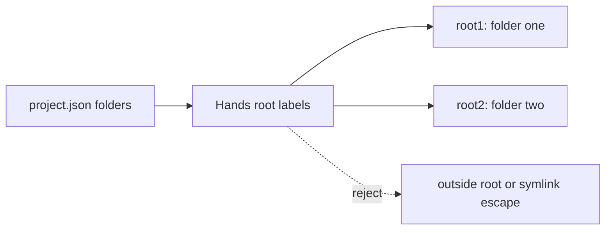

# Phase 76.2 — Unified cloud run: contract design

**Status:** Design locked after sequential simplicity and ownership reviews on 2026-10-09. Parent: [Phase 76](phase-76-unified-cloud-run.md). Implementation planning is next.

## Scope

Deliver `forge run <mission> --input name=value` as one durable cloud execution path for a local
or OCI mission. The command requires `./project.json`, stages named text/file inputs, attaches
the declared multi-folder Hands workspace, prints only the opaque final text to stdout, and keeps
the Project, conversation, run and execution history in the existing durable services.

This replaces `forge exec`, `forge run --var`, and `forge run --mode`. It does not add terminal
tools, an output-artifact download command, a registry capability policy, a local durable stack,
or a Desktop/ForgeUI surface.

## Default path and done when

The normal artifact is the Native AOT `forge` installed from merged `forge-mcl` main. Its saved
`~/.forge/config.json` uses `https://api.forge.katasec.com` and the default OCI base; no endpoint
environment override is present. A disposable `project.json` declares two disjoint folders and a
stable Project ID. A real local package and an OCI package each request Read/Write in both roots;
Hands rejects an outside-root and symlink escape; the final text appears only on stdout; progress
and all IDs appear on stderr; durable authenticated history identifies the same Project and run.

## Design

`forge` resolves every mission source locally to one validated immutable package, then passes that
package and each named file input to the shared Client Application service. That service stages
them through the existing authenticated edge into Conversation Host blob storage and starts one
fresh Project Mission run. The Host owns the staged blobs, immutable
launch record, Project association, command idempotency and continuation; the Runner reads the
admitted package/input bodies only from the Host and resumes through the existing command queue.
The client attaches one scoped Hands session that maps deterministic root labels to the Project's
declared folders. Neither ForgeAPI nor the CLI has durable run state, provider credentials or a
datastore credential.

```mermaid
sequenceDiagram
  participant C as forge CLI
  participant A as ForgeAPI edge
  participant H as Conversation Host
  participant R as Runner
  participant B as Hands
  C->>C: resolve local or OCI source to immutable package
  C->>A: stage package and named artifacts; start Project run
  A->>H: authenticated ingress commands and bodies
  H->>R: private mission-command
  R->>H: read admitted bodies; publish progress
  R-->>H: request a file tool and pause
  H-->>C: durable event stream
  C->>B: execute within labelled declared roots
  B->>H: tool result
  H->>R: continue-after-tool
  R-->>H: terminal final-text event
  H-->>C: replay/live event stream
```

### Locked contracts

| Area | Contract |
|---|---|
| Project declaration | `project.json` is the one CLI Project declaration for `forge run`, `forge chat`, and `forge project create`. It contains `projectId`, `missions`, and `folders`; folders are relative to its directory. The former default filename is rejected with a migration message; there is no dual read, automatic rewrite, or identity regeneration. |
| Mission source | A relative/absolute `.mcl` path selects a local mission. Any other value is an OCI reference: a bare name expands below saved `oci.endpoint`; a qualified reference is used as written. The CLI resolves OCI tags to a manifest digest before admission. `Katasec.OciClient` exposes `PullMissionWithDigestAsync`, matching its existing expert pull API and returning the bundle plus the digest from the same authenticated manifest response. Both paths produce the same canonical durable package bytes and SHA-256; the launch records source display text plus that immutable package identity. OCI credentials stay on the client. |
| Package staging | `forge-mcl` owns package construction/validation. The shared Client Application/Transport service submits the resulting package and named input bodies through ForgeAPI ingress. Conversation Host persists them under the authenticated Project/run admission before dispatch. Runner receives immutable references and reads bytes from Host internal ingress. A retry with the same command ID requires identical package hash and input manifest; any mismatch is rejected. |
| Inputs | Core owns the named-input grammar, identifier/reserved-key validation, and canonical text/artifact binding manifest. The CLI supplies values: a value beginning `@` names a local regular file relative to the invocation directory; otherwise it is UTF-8 literal text. Leading literal `@` is rejected until a separate syntax is designed. Duplicate names, missing files, directories, symlinks escaping their containing declared root, invalid UTF-8 literals, and over-limit content fail before run admission. A named file is staged as opaque bytes and remains bound by that same Core-owned input name; no positional `source_file` convention exists. |
| Input limits | Each staged body is limited to the existing Host internal-hop maximum of 4 MiB. The limit is an edge/Host validation constant shared by contracts, not a CLI setting. No aggregate or input-count limit is introduced until a measured Host/queue boundary requires one. |
| Run admission | The CLI calls the shared Client Application mission service, which ensures the authenticated Project Mission container and starts exactly one fresh child run with a generated command ID. It never reconnects to, retries as a new run, or mutates a prior run after a lost start reply. The Application service reissues the same command ID and immutable manifest to recover an unknown reply. `projectId`, container/conversation ID, run ID and attempt ID return to the CLI for stderr projection. |
| Execution input | Runner materializes a read-only per-run staging directory from Host bodies and consumes the already Core-validated named binding manifest. It removes the current first-uploaded-artifact mapping and never lets a mission resolve a client filesystem path. The final mission result is one UTF-8 text event; existing executable missions must express binary output through requested Hands tools or be rejected by durable-package validation. |
| Hands workspace | The declaration's folders are canonicalized once at attachment. Empty folders grant no access. The session exposes only Read/Write/Edit and sends the Runner a fixed tool schema with required `root` and relative `path`; `root1`, `root2`, … are declaration order labels, never local paths. Client Runtime owns the label/policy mapping and composes Core's `WorkspaceGuard` for existing-ancestor/symlink containment on every operation. It grants no terminal tool and never widens access to a common parent. |
| Output and display | Final text is written byte-for-byte to stdout followed by the platform newline. Progress, IDs, errors, `--steps` expert messages, and `--verbose` source/admission details go to stderr. Display flags do not alter the submitted command, retained event/body record, package, inputs, or Hands authority. |
| Config and login | `ForgeConfig` atomically creates/updates `~/.forge/config.json`, preserving unrelated keys. `api.endpoint` is the sole CLI API base and must be an absolute HTTPS URI; invalid JSON/URL fails before sign-in/network. `oci.endpoint` is the default registry base. `forge registry login <base>` writes host-scoped credentials only after authentication succeeds, preserves previous selection on failure, and selects the successful base. CLI/client composition alone reads the host-scoped registry credential and passes it to Mission Registry/OciClient for one pull; Mission Registry stores and reads no user credential. `FORGE_API_ENDPOINT` is removed from every CLI hosted path. |
| Failure/recovery | Local parse/package/input failures perform no remote mutation. A staging/start failure returns a named stderr error and leaves only Host-owned unreferenced staged blobs for Host cleanup. A lost staging/start reply is retried only by its deterministic ID and byte-identical request. Runner/provider interruption remains terminal `Interrupted`; it is never silently replayed. A lost result/event stream reconnects from the durable cursor. A tool result is committed once by its deterministic continuation command; failed delivery is recovered by existing Host outbox/replay, never by repeating the local tool operation. Cancellation requests Host cancellation, cancels Hands, and exits nonzero after drain. |

### Project Mission admission wire shape

`StartProjectMissionRunRequest` and its ingress counterpart gain one optional additive
`ProjectMissionRunManifest` member; it is the staged-content adjunct to the existing
`DurableMissionLaunch`, not a second launch/provenance model. `Input` becomes nullable so the two
valid shapes are unambiguous: a historic request has a non-blank `Input` and no manifest; a cloud
request has a complete manifest and `Input == null`. Empty input, both members, neither member, or
a partially supplied manifest is invalid before ingress. Historic callers therefore retain their
existing shape only until their migration slice; a cloud request never also creates the legacy
`input` body.

```csharp
ProjectMissionRunManifest(
    string SourceDisplay,
    string PackageHash,
    ConversationBodyReference PackageBody,
    DurableMissionInputManifest Inputs,
    ProjectMissionInputBody[] InputBodies);

ProjectMissionInputBody(
    DurableMissionInputBinding Input,
    ConversationBodyReference Body);
```

`SourceDisplay` is diagnostic provenance only and has no effect on equality or resolution.
`PackageHash` is Core's canonical package hash, while `PackageBody.Sha256` remains the SHA-256 of
the staged bytes. Each `InputBodies` member names one Core binding and exactly one Host body. The
Host requires a name-for-name, byte-count-for-byte-count, and hash-for-hash match between
`Inputs.Bindings` and `InputBodies`; it rejects duplicates, omissions, additions, an invalid Core
manifest, or an invalid body reference. The Runner later deserializes the package body with Core
and verifies its canonical hash equals `PackageHash` before execution.

For a cloud request, ingress creates bodies from the submission `CommandId`: field `missionPackage`
owns package bytes, and field `input:<name>` owns the matching named input. These field names are
constants in `ConversationBodyFields`; byte bodies use the same `ConversationBodies`
reference/chunk path as text bodies. A historic request alone creates the existing `input` body.
Consequently a lost reply reissues identical body IDs, bytes, hashes, manifest and command record.
Host admission compares the complete manifest structurally with the stored command; the source
display is deliberately excluded from the equality decision.

`StartProjectMissionRunResponse.RunId` remains the deterministic child-run identity derived from
the submission `CommandId`; for this one-start/one-run route it is also the execution attempt
identity. No distinct attempt field is added and clients must not invent one. A new command ID is a
new run; a retry reuses the same command ID and returns the same `RunId`.



### Boundary and security record

| Question | Decision and evidence to implement |
|---|---|
| Bounded context/data owner | Conversation Host remains the sole owner of staged package/input blobs, immutable launch, run events and Project-run index. ForgeAPI owns no persisted mission data. |
| Public entry point | ForgeAPI is the authenticated Tier-1 route. It validates syntax/size and sends ingress commands/bodies only; it has no direct Conversation storage access. |
| Tier-2 contracts | ForgeAPI → Conversation Host uses existing ingress/reply queues. Host → Runner uses `private-mission-command`; Runner → Host uses `private-conversation-progress`. Host owns the internal body-read HTTP contract. |
| Tier-3 stores/transports | Conversation Host Blob/Table and Service Bus remain non-public. Host identity alone receives its storage roles; Runner has only its existing private transport and Host internal-call identity. |
| Credentials | CLI holds saved platform/registry credentials. ForgeAPI holds only its identity and edge queue rights. Registry credentials never cross the API boundary; provider credentials stay with Runner. |
| Classification | Extending existing contracts and Blob ownership is Type-2. Retaining ForgeAPI/Host/Runner/Hands owners and their public/private boundaries is the already-locked Type-1 architecture; no new cross-context datastore access is introduced. |
| Enforcement | Contract tests reject raw paths, duplicate/mismatched retries and unauthorised Project reads; IaC verifies queue direction/RBAC; installed acceptance observes the stated default path. |

### Behaviour → owner

| Behaviour | Owner |
|---|---|
| Parse CLI, print streams, resolve source/config | `forge-mcl` CLI — command composition and OCI wiring. |
| Canonical local Project declaration and Project-run submission/recovery | `forge-client` Projects/Missions — local Project identity/declaration and user-intent reconciliation; Client Runtime — capability enforcement. |
| Package validation/build and named-input binding manifest | `forge-mcl` Core/Mission Registry — language and OCI/package ownership. |
| Package/input submission and authenticated edge conversion | `forge-client` Application/Transport submits typed requests; `forge-platform` ForgeAPI routes them with no durable store. |
| Immutable admission, blobs, durable run/event state and recovery | `forge-conversations` Conversation Host — durable admission/state/dispatch owner. |
| Reasoning and staging materialization | `forge-runner` — hosted execution owner. |
| Workspace tools | `forge-client` Client Runtime/Hands — local authority and execution owner. |

### Reuse

| Need | Existing thing | Use |
|---|---|---|
| Durable command/reply | ForgeAPI conversation command bus and Host ingress | Extend its typed messages; no direct Host endpoint from CLI. |
| Durable bytes | Conversation Host body chunks/Blob store | Generalize body metadata for package/artifact bytes; no ForgeAPI artifact store. |
| Immutable launch | `DurableMissionLaunch` / `DurableMissionPackage` | Add source and staged-body identity rather than a second launch model. |
| Tool pause/resume | Existing Mission Hands continuation | Reuse claim/read/result/continuation and outbox semantics. |
| File containment | Core `WorkspaceGuard`, composed by Client Runtime | Keep the primitive in Core; extend Client Runtime's one-root mapping to labelled roots without CLI policy. |
| OCI manifest identity | `Katasec.OciClient.PullExpertWithDigestAsync` | Add the matching `PulledMission`/`PullMissionWithDigestAsync` API in `oci-client-dotnet`; Forge does not duplicate OCI HTTP or bearer authentication. |
| Config persistence | CLI `ForgeConfig` | Extend it with `api` and `oci`; no second config file. |

### Principles that changed a decision

| Rule | Decision |
|---|---|
| Simple and dumb | One immutable package path after local/OCI resolution and one Project declaration filename. |
| One code path | Local and OCI sources converge before package admission; all runs use the durable Host/Runner path. |
| No NIH | Reuses body storage, durable launch, ingress queue, Hands continuation and workspace guard. |
| One owner | The edge never owns artifacts/run state and the CLI never owns capability policy. |
| No legacy paths | Removes old command/flags, endpoint environment route, old declaration default and positional artifact binding. |
| Built-in safety | Immutable request fingerprints, Host-owned blobs and labelled Hands roots contain retries and local authority. |
| Verified means done | Default-path observation is explicit above. |

### Rejected alternatives

- Let Runner pull OCI directly: would require server-side registry credentials and make private registry selection a hidden service concern.
- Compute a mission layer hash in Forge: it is not the OCI manifest digest and could not prove the resolved tag identity.
- Keep `forge.project.json` as a fallback: creates two declarations and ambiguous project authority.
- Pass absolute client paths to Runner: leaks local topology and cannot provide Hands containment.
- Reuse ForgeAPI's one-shot artifact store: it is edge-owned and single-serve, not durable run input state.
- Add a CLI mission allowlist: conflicts with arbitrary local/OCI selection.

### Open questions

None. The implementation plan must prove exact existing types/files and may not change these contracts without returning to design review.
