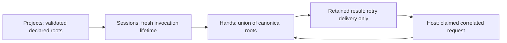

# Phase 76.2 — Unified cloud run: execution contracts

**Status:** Operator permits arbitrary user-vetted executable code; execution permissions are
deferred. Prior technical reviews covered the superseded image-owned-only proposal. Executable
contracts need redesign/full review; Host-owned content remains an unapproved proposal. Cloud design is not locked. The independent OCI prerequisite is merged, published as
Katasec.OciClient 0.5.0 and accepted through a fresh remote-package Native AOT consumer. No cloud implementation plan is approved.
Parent: [unified cloud execution](phase-76-unified-cloud-run.md).
Requirements: [operator decisions](phase-76.1-unified-cloud-run-requirements.md).

## Scope

Operator instruction, verbatim:

> Please check the next item on the plan which should be Phase 76 for unified cloud execution. Please kick of  the documented supervisor workflow in order to complete the tasks in that phase autonomously.

The instruction authorizes the complete workflow, implementation, normal publication/deployment,
and acceptance within the agreed requirements. The earlier requirements-only session is over.
The supervisor owns technical design and plan approval. The governing workflow still sends
unsettled Type-1 decisions to the operator; no repeated approval is needed for reversible details.

Scope: replace local `run` and one-shot `exec` with one durable cloud run; implement named
inputs, immutable local/OCI admission, Project/config migration, multiple-root Hands and opaque
final text. No Desktop/ForgeUI redesign, local cloud-stack bootstrap, terminal grant, CLI mission
allowlist, automatic binary download, new output-format interpretation, or inspection CLI.

Done when: the reviewed contracts cover every row of the requirements' contract-work table;
dependency-ordered implementation plans pass both reviews; required managed/AOT checks pass;
merged/published artifacts perform the stated real cloud and local-tool actions on the default
path; every touched repository ends on clean, current main. Documentation alone cannot close
the phase. Desktop/ForgeUI visual gates are N/A because this scope changes no such surface.

## Executable trust — operator decision recorded 2026-10-10

> 1. We manage permissions later. Right now it can run anything. to ensure safety it's up to the user to ensure clean code is in their oci registry. Today that's what corporates do ...the scan their internal registries and ensure it's clean

**Locked policy:** arbitrary submitted executable mission code is permitted. The user owns vetting
content in their OCI registry. Phase 76 does not introduce an executable allowlist, an image-owned
OCR-only identity check, registry scanning, or fine-grained execution permissions. The same local/OCI
preparation path remains required. Existing authenticated account admission, content integrity and
client Hands folder rules still apply; this decision concerns cloud executable trust.

The previous image-owned-only proposal is [superseded](phase-76.2-unified-cloud-run-contracts_completed.md#superseded-executable-proposal--2026-10-10).
Technical design must now cover generic command/asset execution, runtime dependencies, environment,
named input/output binding and resume behavior under this user-vetted-code model. No process
sandbox or credential isolation is established merely by registry vetting; do not describe it as one.
Execution permissions are deferred by explicit operator decision, not an implementer assumption.
The changed executable design requires sequential full design reviews before any cloud plan approval.
Host-owned content is still a proposal: the operator requested an explanation and has not approved it.

## Contract design — draft for independent review

One shared Missions operation prepares a package and named inputs, creates a fresh Project-linked
conversation, attaches invocation-scoped Hands and submits one turn. Local and OCI differ only in
source retrieval; they enter the same preparation/admission/execution path. Host retains the launch,
inputs, final response, step records and binary artifacts. Existing claims/outboxes/continuations
remain authoritative. No new service or datastore is proposed.

```mermaid
sequenceDiagram
  participant C as CLI / shared Client
  participant A as ForgeAPI
  participant H as Conversation Host
  participant R as Runner
  participant B as Hands
  C->>A: CreateMissionConversation with semantic launch
  A->>H: Claim-check definition/package, then create ingress
  H-->>C: Identity reply; authenticated snapshot hydration
  C->>A: Stage named binary inputs, authenticated
  A->>H: Ingress chunks, await receipts
  C->>A: AttachMissionHands then SubmitMissionTurn
  H->>R: StartMission with content references
  R->>H: Read committed package and named artifacts
  R->>H: Steps, tool request, opaque continuation
  H-->>C: Durable request
  C->>B: Claim/read verified work, enforce declared roots
  B-->>H: Exact correlated result through ForgeAPI
  H->>R: ContinueAfterTool
  R->>H: Final text, artifacts, terminal status
  H-->>C: Replay/live durable outcome
```

### Behaviour → owner and component fit

All repository paths below are absolute. The cited READMEs were read before design; nearest
component ownership controls placement.

| Behaviour | Repository / component owner | README authority |
|---|---|---|
| Parse command, collect source/input spellings, print text/diagnostics, resolve CLI settings | `/Users/ameerdeen/progs/forge-mcl/src/ForgeMission.Cli` | `README.md` → Owns / Does not own |
| Resolve OCI references, retrieve/verify bundles, scoped registry authentication | `/Users/ameerdeen/progs/forge-mcl/src/ForgeMission.MissionRegistry` | `README.md` → Public surface |
| Validate/package MCL and apply generic execution restrictions | `/Users/ameerdeen/progs/forge-mcl/src/ForgeMission.Core` | `README.md` → Owns |
| Read Project identity/declaration, initialize default filename | `/Users/ameerdeen/progs/forge-client/src/ForgeMission.Application/Projects` | `README.md` → Owns / Change admission |
| Coordinate arbitrary mission preparation/admission/reconciliation | `/Users/ameerdeen/progs/forge-client/src/ForgeMission.Application/Missions` | `README.md` → Why this exists |
| Invocation attachment lifetime and joined disposal | `/Users/ameerdeen/progs/forge-client/src/ForgeMission.Application/Sessions` | `README.md` → Owns |
| Multiple-root grant, tool authorization/execution and drain | `/Users/ameerdeen/progs/forge-client/src/ForgeMission.ClientRuntime` | `README.md` → Owns |
| Authenticated HTTP projection and queue forwarding | `/Users/ameerdeen/progs/forge-platform/src/ForgeMission.Api` | `README.md` → Owns / Does not own |
| Immutable content, conversation/run identity, receipts, directory and artifact queries | `/Users/ameerdeen/progs/forge-conversations/src/ForgeMission.ConversationHost` | `README.md` → Owns |
| Public conversation DTOs and shared JSON metadata | `/Users/ameerdeen/progs/forge-conversations/src/ForgeMission.Conversations.Contracts` | Repository `README.md` |
| Runtime validation, scratch staging, provider execution, OCR, progress and settlement | `/Users/ameerdeen/progs/forge-runner/src/ForgeMission.Runner` | Repository `README.md` |
| Pin normal deployed service images/configuration | `/Users/ameerdeen/progs/forge-infra` | `README.md` → Updating Dev Images |

### Project and invocation identity

Shared application actions live in Client.Contracts/Application.Transport; implementation extends
existing `IMissionConversationService`, Projects and Sessions, with all remote wire operations
through `ConversationHostClient`. No second HTTP client or CLI-owned run coordinator.

| Shared action | Request / result |
|---|---|
| `PrepareMissionRunAsync` | `PrepareMissionRunRequest(ProjectFilePath, InvocationDirectory, OciBase, MissionSelector, MissionRunInput[])`, where each input is `(Name, Value, IsFile)`; returns `PreparedMissionRun(SessionId, OperationId, ProjectId, ConversationId, TurnId, RunId, PackageHash, SourceDescription)` or typed `MissionRunError(Code, Message)` |
| `StartMissionRunAsync` | `StartMissionRunRequest(SessionId, OperationId)`; reads the already-frozen preparation, attaches Hands, stages/admit/submits with its original IDs; returns those identities, `Accepted/Rejected/Uncertain` disposition and optional typed error |
| Follow | Existing shared conversation stream/replay, scoped to prepared Session/conversation/run; underlying ConversationHostClient owns HTTP/SSE reconnection; no resubmission on reconnect |
| Cancel / close | Existing shared cancel request for the exact turn/attempt, followed by existing Sessions joined shutdown. Session owns Bob and prepared operation disposal. CLI `finally` always awaits close; failed prepare owns no live remote attachment |

CLI captures its absolute invocation directory once and passes it explicitly with the saved
`oci.endpoint` value as `OciBase`; shared Client never reads CLI config or process cwd. Missions
resolves Project/file paths against that supplied directory and delegates selector/base parsing
to MissionRegistry. After normalization, Missions uses the existing
`Core.Resolution.CredentialStore.GetToken(normalizedHost)` for each selected registry host and
passes that credential explicitly to MissionRegistry retrieval; local OCI expert resolution uses
the same credential owner and exact-host rule. No credential is represented in shared action
records, stored in prepared content, or forwarded to Host. Default API selection stays in CLI's
HTTP-client composition. Other callers supply their own explicit directory/base values through
the same action; no second settings schema or registry-file reader is introduced.

Prepare validates/reads the Project and source before creating one immutable in-memory operation.
Sessions admits its Project identity, declared roots and fixed run profile without a declared
mission allowlist or authored-version approval. Session/operation IDs are unguessable fresh GUIDs;
only their matching in-process attachment can start/follow/close. Prepared data contains source
content, strings, input bytes/hashes and diagnostic resolution metadata; it never reads those
values again after a start becomes uncertain. Preparation fails if input changes during reading.
Application Transport exposes the action values and generated JSON, not Bob/store/credential
handles. No new Desktop HTTP route is needed for these direct shared actions.

Missions constructs the existing semantic launch from this frozen package: `Definition` is exactly
`Package.MissionSource`; `DefinitionHash` is `sha256:` plus lowercase SHA-256 of its UTF-8 bytes.
Generate a fresh nonempty `MissionVersionId` during preparation and retain it with the original
command IDs; `VersionNumber = 1` denotes this invocation's immutable launch revision, not an OCI
tag or locally authored Approved version. It creates no authoring record or approval claim.
`Profile = ProjectWorkspace` when the frozen root list is nonempty, otherwise `NoHands`; the
operator cannot select terminal authority. Empty-root runs create an empty local capability
registry and skip remote Hands attachment. Nonempty-root runs attach the fixed file-only profile
before submit. Host validates definition equality/hash and the package on every admission.
Replace the independent 4 KiB source/definition and 8 KiB expert limits with the 4 MiB serialized
semantic-package budget and 4 MiB per-text-body budget, including JSON/base64 overhead. Each
component rejects over-budget content before its state transition; reference transport does not
remove those content limits. Existing authored/chat versions keep their existing identities and
profiles; this construction is shared Missions' arbitrary-run admission path only.

Default `run` and `chat` read exactly `./project.json`; `forge project create` writes that filename.
Chat retains its existing explicit `--project <file>` selection with any filename. Run has no
additional Project selector in this scope. Missing default file fails before config creation,
login/network or mission retrieval; no ancestor search, implicit creation or identity regeneration.
CLI checks required-file existence before loading/filling config; Projects owns the subsequent
schema/identity/root validation in shared preparation. This precheck grants no filesystem authority.
An old `forge.project.json` is not read automatically: the diagnostic instructs its owner to rename
it to `project.json`, preserving bytes and identity. If both exist, only the selected `project.json`
matters; creation never overwrites either a conflicting declaration or private authoring state.

Projects validates nonempty `projectId` plus present string arrays `missions` and `folders`.
Both arrays may be empty. `missions` may be empty
for run; chat still requires the applicable declared version. Each nonempty folder is a relative
path resolved against the declaration directory; `.` and `..` components are allowed, including
siblings. Roots must exist as directories. Canonical duplicate roots are collapsed, preserving
declaration order. An absolute folder declaration is refused. Empty folders grant zero file tools.
The root set is frozen for the invocation; changing the declaration does not change a live grant.
Run never updates the declaration's mission references or authoring approval state.

Each run invocation gets a fresh create command GUID and fresh conversation/context. The existing
`MissionConversation(createCommandId)` derives its conversation ID; a separate fresh submit command
derives `MissionTurn` and `MissionTurnAttempt` (the run ID). Print Project/conversation/run IDs to
stderr before the corresponding uncertain network boundary. Shared Missions retains those IDs,
the exact prepared content and replies until shutdown. HTTP retries in that invocation reuse them.
Launching the command again starts new work; an uncertainty diagnostic explicitly says a prior run
may exist and gives its IDs. No implicit cross-invocation retry or rerun of side effects.

Host authorization remains `(authenticated MemberId, conversationId)`. Project GUID is an
association, not proof of account ownership. Existing authenticated `ListMissionConversations`
plus conversation/event queries supply Project-linked history after exit. No global GUID lookup.

### Source resolution and immutable package

Local selectors start `./`, `../`, an absolute path, or end `.mcl`; they must name an existing
regular file. No default mission argument. Other selectors are OCI references: a bare repository
name expands beneath saved `oci.endpoint`; only a component **before a slash** containing `.` or
`:`, or equal to `localhost`, selects an explicit registry host. Relative registry repository paths expand beneath the saved
base. Reject URL schemes, empty segments, traversal, query/fragment and an `@handle` prefix.
Standard `name:tag` and `name@sha256:<64 lowercase hex>` are accepted, mutually exclusive;
omitted tag means `latest`. Registry host is case-insensitive, repository paths lowercase and tags
case-sensitive. Thus `ocr:1` is a bare tagged name, `team/ocr:1` uses the saved base, and
`localhost:5000/team/ocr:1` is explicitly qualified. `ocr@sha256:<hash>` uses the saved base;
`ghcr.io/katasec/ocr@sha256:<hash>` is explicit. Docker Hub normalizes `docker.io` to its registry API host; bare names still use
the configured Forge registry base, never implicit Docker Hub.

MissionRegistry retrieves Forge mission media types only; it does not use a hardcoded cloud
catalog or fall back to an image's baked mission. A tag is resolved for each new invocation.
Retrieved layer size/hash is verified, then a bounded tar reader accepts regular package entries
only: no absolute/traversal/duplicate paths, links or device entries. It never extracts a tar
directly into the workspace. Cache is an optimization keyed by verified content identity, not a
mutable tag being assumed immutable. Existing `OciClient` authentication/digest APIs must be
probed before Plan; a required dependency API missing from the published package blocks handoff.

Core owns self-contained package construction from a selected source and resolved experts, using
existing Parser/ExpertLoader/lock hashing. Local preparation may resolve declared OCI experts
without writing a lock or changing the source tree. Only referenced expert markdown and explicit
runtime assets are included. Never tar the mission directory, arbitrary folders, `.forge`,
credentials, private Project state, provider keys or evaluated environment values. A local
`forge.toml` can identify expert sources; provider secrets/endpoints are never transferred.
The selected root is the first declared mission, matching current local run; no new root selector.
Additional scripts/assets are declared as relative paths in `[package] assets = ["experts/Ocr/ocr.py"]`
in `forge.toml`. An OCI bundle must contain the selected source, lock, referenced experts and these
declared assets; other files are never admitted to execution. Publisher must use this same bounded
package file set, replacing its existing whole-directory tar operation. Never package the full
provider-bearing TOML: distribution metadata contains only expert locators and the asset list.

The existing `DurableMissionPackage` remains the semantic package: mission source, selected root,
primary input metadata, resolved experts and added explicit `Assets` entries
`(Path, ContentType, Bytes, Sha256)`. Assets are regular relative paths. Hash canonicalization
extends the existing format-1 ordered content hash with a tagged asset section only when assets
are nonempty: length-prefixed UTF-8 fields `assets`, invariant-decimal asset count, then each
ordinal-path-sorted entry's `Path`, `ContentType`, invariant-decimal byte length and lowercase
`sha256:<hex>` over decoded bytes. Raw bytes are verified against that digest. Preserve the
existing canonical prefix verbatim; old packages with no assets retain their existing hash.
This is an additive format-1 extension; missing Assets means empty, never an unvalidated filesystem
lookup. `RootInputName` remains the first root parameter for chat;
a parameterless root uses an empty value. Run supplies the full named input dictionary, rather
than mapping everything to that one parameter. Multiple mission declarations, nested missions,
loops and parallel steps follow the existing engine. Remove the two-expert and 8 KiB inline
transport restrictions; package serialized content is capped at the existing 4 MiB text-body
boundary, and is carried by reference rather than embedded in state/commands.

Core's common validator is used at Host admission and again by Runner before execution. It
rejects all AST `EnvLetValue`/`EnvBindingValue` occurrences, provider/credential/runtime reserved
bindings, and unsupported expert kinds before evaluating context. `llm`, `rule`, `json_extract`
use existing adapters. Arbitrary executable code is permitted by the operator; concrete exec/ONNX
runtime support must be designed and reviewed, without the former identity allowlist. No remote
credentials, arbitrary HTTP endpoints or cloud process environment are authorable package data.

### Named inputs, binary content and transfer

Split each `--input` at the first `=`. Names are case-sensitive identifiers
`[A-Za-z][A-Za-z0-9_]*`; duplicate names, empty names and missing `=` fail. Empty literal values
are valid. Values are strings without JSON/number coercion. A leading `@` always means file
attachment; empty `@` or a missing/unreadable/non-regular file fails before admission. No `@@`
escape is adopted: a literal leading `@` is unavailable in this first grammar, stated in help.
File paths resolve against invocation cwd, independently of Project folders or mission directory.
Selecting an explicit input file authorizes uploading that file; it does not grant Hands its
directory. No positional file-to-input alias exists.

The named bag permits declared root parameters and explicit expert `inputs`; undeclared names
and reserved runtime/credential names fail. Reserved names include `output`, `feedback`,
`attempt`, `max_loops`, `history`, `conversation`, `apiKey`, `model`, `provider`, `endpoint`,
`__*` and `FORGE_*`. All root parameters must be supplied explicitly; a mission parameter has no
default syntax. Expert inputs are collected from reachable experts only; input-name validation is
against their names plus root parameters, not every unused expert in a lock. Explicit named inputs
override ordinary nonreserved `let` strings, matching ContextBuilder.Seed precedence; omitted
non-parameter values may come from those literal lets. No expert-defaults map is invented. Missing
values otherwise fail runtime validation rather than becoming an invented positional goal.
OCR requires `source_file`; the previous image-owned adapter's mode/output binding is superseded.
Generic declared input/default/output-directory binding remains a design gap to resolve before handoff. Core's pausable
`RootInputs` filter must preserve this validated admitted input-name set, including parameterless
OCR's `source_file`/`mode`. The set is part of the opaque checkpoint and root fingerprint; arbitrary
undeclared Vars still cannot bypass filtering. Runtime, not a user input, supplies OCR `output_dir`.

| DTO / route | Exact proposed value and behavior |
|---|---|
| `MissionContentReference` | `ContentId: Guid`, `ByteLength: long`, `Sha256: string` (64 lowercase hex), `ContentType: string`, `Kind: input/output`; scoped by authenticated member and conversation |
| `StageMissionContentChunkRequest` | `ConversationId: Guid`, `OwnerCommandId: Guid`, `Slot: string`, `Reference: MissionContentReference`, `Index: int`, `Count: int`, `Bytes: byte[]` (base64 JSON); `POST /api/StageMissionContentChunk` |
| Chunk response | Existing `ConversationReply`: 202 after Host durable staging, 409 conflicting bytes/descriptor, 400 invalid bounds, 413 too large; no Blob credential/URL returned |
| `MissionNamedInputs` | `Strings: Dictionary<string,string>`, `Artifacts: Dictionary<string,MissionContentReference>`; names unique across both maps |
| Launch transfer | Existing public create request keeps its semantic launch; API moves definition/package text to existing claim-check bodies. Host immutable launch/state/commands hold references; query hydration supplies existing public package values where needed |
| Turn transfer | Existing submit request gains optional `Inputs: MissionNamedInputs` and `Workspace: MissionWorkspaceDescription`; exactly one of chat `Text` or run `Inputs` is present. Both normalize to the same typed bag before grain admission. Internal commands carry its text-body reference |
| Binary query | `POST /api/GetMissionContent` with `(ConversationId, ContentId)`; authenticated binary response from the Host query, descriptor in response headers; unknown, other member's or staged-only content is 404 |

Binary input staging requires an already-owned conversation and a submit command ID. Slot is
exactly `input/<validated name>`; `ContentId == Body(OwnerCommandId, "mission-content/" + Slot)`.
Host verifies that derivation, descriptor, chunk count/length and byte/hash consistency; an input
chunk cannot masquerade as an output. Existing pre-create text claim-check staging retains its
authenticated tenant plus deterministic create-command/body identity; it cannot publish a launch
without the subsequent owned create transition. Output chunks are accepted only from Runner's private
progress producer, with their owning progress fact and active run checked before commit.
Queue transport uses a fresh broker message/reply-session ID per send; durable chunk receipt
identity is `(member, conversation, contentId, index)`. Exact resends remain valid after lost
replies; changed chunk bytes or descriptor are 409. Staging never alone authorizes execution.

The transport-only `DurableMissionLaunchWire` has the same `MissionVersionId`, `VersionNumber`,
`DefinitionHash` and `Profile` as today's launch, plus `Definition: ConversationBodyReference`
and `Package: ConversationBodyReference`. `CreateMissionConversationIngress(ProjectId, CommandId,
Launch: DurableMissionLaunchWire)` replaces the embedded queue launch. The API accepts the existing
public `CreateMissionConversationRequest(ProjectId, CommandId, Launch: DurableMissionLaunch)`,
extracts both text values via existing claim-check processing and sends their chunks before ingress.
Definition body ID is `Body(CommandId, "mission-definition")`; package is
`Body(CommandId, "mission-package")`. Host validates hashes/content/profile before committing the
pin and stores only wire/reference values in grain state and outbox commands. The hydrated public
launch remains the existing semantic value; old persisted embedded launches are normalized by the
storage reader into that same value, never written again. Their original content hashes are kept.

Create reply becomes `CreateMissionConversationResponse(ConversationId, AcceptedSequence,
LaunchIdentity: MissionLaunchIdentity)`, where identity is `(MissionVersionId, VersionNumber,
DefinitionHash, PackageHash, Profile)`. It contains no body. Shared Client follows with the existing
authenticated conversation snapshot query, hydrates the actual pin and compares every immutable
field before attaching/returning success. All in-scope consumers of the reply must update together;
the dependency/consumer inventory is a required plan item. A minimal consumer dependency update
may be necessary; it does not authorize Desktop UI work or repair the separate deferred Hands issue.

`SubmitMissionTurnIngress` carries `(ConversationId, CommandId, Inputs: ConversationBodyReference,
Workspace: ConversationBodyReference?)`; fields are `"mission-inputs"` and `"mission-workspace"`.
Chat normalizes its Text into the pinned primary input. Run has all validated named entries.
The user-message history projection uses chat's original text or canonical named-input JSON;
file entries contain descriptors, never binary bytes. Host's internal `ConversationCommand` gains
`NamedInputs` and `Workspace` body references, preserved exactly on every continuation. Its
existing `Goal` is used only for chat history projection; Runner executes the normalized bag.
Host rechecks inputs against the committed package before the atomic turn/outbox transition.

Use existing ForgeAPI command bus, raw 192 KiB queue chunks, Host block upload/hash checking,
deterministic content IDs from `(OwnerCommandId, field/input name)` and create-only commit.
Do not base64-wrap binary bytes in the broker message. Packages/named JSON use existing 4 MiB
text bodies; binary inputs/outputs have a separate 100 MiB per-content limit (matching OCR's
existing product limit). At most 32 inputs, 100 MiB combined binary inputs and 32 KiB descriptor
envelope. API and Host enforce limits before mutations/dispatch; the runner enforces applicable
expert media contracts. Transport checks are not a CLI mission allowlist.

Only Host's existing Conversation store seam is extended to handle binary bytes; do not relax
UTF-8 text-body validation or give API/Runner Blob access. Host commits staged content references
only with matching create/turn/progress acceptance. Exact repeats reuse content; changing bytes
under a content ID is a conflict. Unreferenced staged content expires after 24 hours through a
Host-owned sweep; committed content lasts with its conversation. No automatic deletion on client
exit. Partial staging cannot dispatch work. Chunk commands carry authenticated member identity
through the existing ingress queue and await its replies.

Binary storage extends the same Host-owned adapter with `StageContentAsync(address, reference,
index, bytes)`, `CommitContentAsync(address, expectedOwnerId, slot, reference)` and
`ReadContentAsync(address, reference)`; results are Accepted/Incomplete/Conflict, matching text
intake. Store keys are derived from tenant/conversation/content ID, never supplied paths. The
existing internal member-header query convention serves
`GET /conversations/{conversationId}/contents/{contentId}` to API/Runner; requests require the
trusted internal `X-Forge-Member-Id` and return only content referenced by canonical committed
conversation/run state. API overwrites client member headers; Runner uses the command's stamped
MemberId. Response headers: `Content-Type`, `Content-Length`, `ETag: "sha256:<hex>"`,
`X-Forge-Content-Id: <guid D>`, `X-Forge-Content-Sha256: <64 lowercase hex>`.
No Content-Disposition path is used for writes. Public GetMissionContent proxies the same read.
Reads verify exact descriptor/hash; missing/corrupt committed bytes are a visible 503 and never
empty success. Unknown/uncommitted/foreign content remains 404.

The 24-hour sweep operates only on staged, unreferenced identities and serializes with admission
through the conversation owner. Admission adopts verified content before publishing its canonical
reference; adopted content cannot be deleted by a racing sweep. An incomplete upload expires and
must be restaged; no committed content expires while its conversation exists.

### Artifact staging, execution and outputs

Every start/resume segment creates its own scratch directory and fetches/verifies committed
artifacts before crossing the execution boundary. Bind each artifact name to a stable relative
path `inputs/<name>/content.<validated extension>`; do not persist a random scratch absolute path
in Core RootInputs. Runtime maps validated media types to the fixed extensions `png`, `jpg`, `pdf`
or `bin`; uploaded filenames do not select a path. OCR's PDF detection depends on `.pdf`.
The previous image-owned adapter/identity restriction is superseded by the operator decision
above. Generic executable staging, command/asset resolution, runtime dependencies and explicit
process cwd/environment must be redesigned before handoff. Stable per-segment input/output paths
and rehydration remain required; their implementation must work for user-supplied code. Do not
implement the former no-fallback/OCR-only routing. The output transport below is a draft, with
its OCR-specific assumptions requiring revision for generic declared outputs.

Output collection for OCR uses only the fixed file returned by its known mode in the allocated
step output directory; no recursive arbitrary scratch scan. `step-key-hash` is lowercase SHA-256
of the UTF-8 StepKey. Slot is `output/<step-key-hash>/<attempt>/<fixed filename>` and
`ContentId = Body(RunId, "mission-content/" + Slot)`; attempt uses invariant decimal and the fixed
filename is `content.txt` or `content.pdf`, matching the image script's fixed staged-source stem
`content`. Relative path is `outputs/<step-key-hash>/<attempt>/<fixed
filename>`. Runner's private raw chunk envelope adds this RunId/slot/descriptor to the existing
progress publisher's per-conversation session, with deterministic chunk IDs. Host classifies it
as a binary chunk, stages it through the binary store seam, and checks the active producing run;
it is not a new public event kind. The corresponding existing Artifact fact commits/verifies its
content before grain acceptance, then becomes the canonical output reference. Reuse the existing
progress-intake failure recorder: incomplete/invalid content records Error + Failed and rejects
the artifact, pause and Completed; store outages use existing broker redelivery. Runner's send
acknowledgment alone is not a claim that Host committed an artifact.

Each run permits at most 32 produced files and 100 MiB aggregate produced bytes, counting prior
segments. Runner checks the cumulative limits before staging another output; an over-limit run
reports Failed, retains earlier durable artifacts and never emits an oversized pause. Host
independently verifies count/aggregate limits when accepting artifacts. Add
`ProducedFiles: ConversationBodyReference?` to internal pause/continue envelopes; it references
a JSON `MissionProducedFile[]` body, each `(RelativePath, Content: MissionContentReference,
ProducingStepKey, ProducingAttempt)`. The manifest is capped at 32 KiB UTF-8, has at most 32 entries,
and its paths/step keys are capped at 256 UTF-8 bytes each. On pause its body ID is
`Body(pauseEventId, "mission-produced-files")`; the existing text-body publisher stages it before
the pause. Host checks every entry against committed Artifact facts and preserves the same
reference on continue. No inline list enters the 32 KiB command envelope or 960 KiB state.
Resume fetches/verifies that manifest and rehydrates outputs alongside inputs before Core replay.
Clients see artifact refs through events/queries; Core continuation and produced-file manifest
remain server-only. Focused verification exceeds output count/aggregate/manifest limits and drops
a binary chunk; each must produce Failed before a usable pause or successful terminal status.

Provider profiles remain deployment-owned: `default` and configured named profiles. Package
`using` names must be configured, with explicit failure for unknown profiles. Support multiple
profiles through one per-profile usage accumulator; settle each used profile with the existing
`RunSettlement`, segment ID `<commandId:N>:<profile>`, exact model and its actual tokens. Assign
segment wall compute once to the ordinal-first used profile, zero to others; no tokens means one
default compute segment. Billing's existing segment idempotency is reused; no ledger schema or
pricing owner moves to Runner. Required profile/config bindings are named in the implementation
plan and tested against the exact published package before deployment.

OCR text mode returns its produced UTF-8 text as the OCR step output through the runtime-owned
adapter; normal engine composition determines the mission's final output. A mission ending at
that step therefore returns recognized text. PDF mode produces a text summary plus a durable
binary output reference. Runner uploads
bytes through progress chunks; extend existing `ConversationArtifactReference` with its
`MissionContentReference` and stable relative output path, preserving existing artifact ID,
content type and filename fields. Use existing Artifact progress/event kind and RunId association,
not a second artifact event vocabulary. Never return ephemeral `/tmp` filenames as usable artifacts. Output collection follows
the executable expert's declared output directory and refuses links/outside paths. The CLI prints
the final response verbatim and lists artifact identity in diagnostics; it neither parses the text
nor downloads/writes the PDF automatically. Binary storage/query is a Type-1 proposal pending
operator settlement; executable trust is already decided, with its technical redesign open; it preserves Host ownership of run records.

### Hands and local side effects



Extend Bob's existing mission factory with a root-list contract; reuse `LocalDiskWorkspace` and
`WorkspaceGuard`. Absolute tool paths address any declared root; relative paths address root 0.
The runner receives an invocation workspace description (canonical absolute root list) as explicit
model context so it can address roots unambiguously; it receives no capability handle. The stored
description is metadata, never proof of authority. Hands alone grants Read/Write/Edit with file
AutoApproved and default AutoDenied, no terminal and no additional prompt, including piped runs.
Zero roots creates an empty capability registry; no fallback to cwd or Project home.
`MissionWorkspaceDescription(Roots: string[])` is inert DTO data, produced only from Projects'
validated frozen roots by shared Missions. It is the separate workspace body on submit/start and
every continuation, composed by Runner into root expert system context as `Workspace roots: ...`
without overriding user inputs/provider profiles. It is not stored inside the immutable mission
package or echoed as an attachment authority. Narrowly update Contracts README to permit this
explicit metadata while retaining its bans on capability handles/credentials. Replaying a
description never reattaches Hands; Bob always uses its independently validated invocation roots.

Shared Sessions retains the validated root set and Bob until joined shutdown. Reuse the Host's
attach/claim/query/result contracts and `MissionHandsSlot`; CLI never dispatches arbitrary model
text. Match conversation, run, attachment/session, request and provider call IDs before execution.
After performing a local operation, retain its exact result and deterministic result command ID
until acceptance or invocation shutdown. A lost reply retries delivery of that result, never the
operation. Abrupt process death cannot run client cleanup. With no reconnect-to-old-run feature,
Host honestly retains the old active/AwaitingHands/in-flight state; a new invocation starts a new
conversation and must not claim it recovered the old work. The operator can use the existing
authenticated CancelMissionTurn command with printed conversation/turn/run IDs to terminalize
that run. Missions handles clean cancellation during a live invocation; process-death cleanup is
not promised. Existing fresh-attachment RecoverMissionHandsInFlight remains available to a
deliberate future same-conversation recovery client, but its MissionHandsInterrupted fact alone
is not terminal RunStatus Interrupted. No local side effect is inferred safe to repeat.

### Final text, diagnostics and cancellation

Runner's `MissionResult.Text` is the opaque final response, including whitespace and empty text;
it is not reconstructed from a step or parsed as JSON. Preserve the existing final
ParticipantMessage followed by RunStatus and add `IsFinalResponse: bool = false` producer metadata
to progress/events. Exactly one true message for the active run, including zero-byte text, is
required before Completed; step messages are false. Existing chat consumers keep their current
message route; CLI retains the explicitly marked final while replaying/following and writes it
once after Completed. No new RunStatus text payload or chat presentation redesign. The CLI adds
no formatting/newline; stdout is empty on failure.
Every progress/error/identity notice goes to stderr. `--steps` includes each complete step output;
`--verbose` adds source/content resolution and execution identity, never keys or auth headers.

Add trace identity to existing progress/event DTOs: `MissionPath: string[]`, `ExpertName: string`,
`StepKey: string`, `Attempt: int` on step facts; final response has no step key. Extend Core's
trace DTOs to expose its existing internal execution key (including nested call path, mission
attempt, element index and parallel branch index), then forward that identity at the producer;
current trace records do not expose StepKey. Never pair parallel step outputs by arrival order. Persist these facts
regardless of diagnostic flags. Live deltas remain optional display data, never authoritative
final text. On a lost stream reconnect from the durable cursor and query/replay terminal state;
do not submit another turn. A permanent follow failure exits nonzero with the durable IDs and
explicitly states the cloud run may remain active.

Ctrl-C closes local admission, requests existing Host cancellation, drains/disposes Bob, detaches
and exits 130. Cleanup uses a bounded independent cancellation budget (10 seconds), rather than
an already-cancelled request token. Host cancellation marks the run Interrupted and rejects late
facts; it does not promise instantaneous cancellation of a provider request. Failed cancellation
or detach is visible with IDs; local disposal still occurs. Other failures exit 1, completed exit 0.

### Config, authentication and clean cut

CLI `ForgeConfig` owns one schema: existing `theme`, `api.endpoint`, `oci.endpoint`, preserving
unknown existing properties. First applicable use fills only absent defaults using an OS file
lease, reread/merge, unique same-directory temporary file and atomic replacement. Do not hold a
lease across network calls. Invalid JSON/types, null/blank configured values or failed persistence
produce a named error; never overwrite corruption or silently use defaults. Theme stays dark by
default. API URLs must be absolute HTTP(S), without credentials/query/fragment; non-loopback
HTTP is refused for bearer requests. OCI base is a scheme-free validated host/repository prefix.

Remove CLI `FORGE_API_ENDPOINT` selection everywhere, including Mac chat child forwarding;
all API consumers compose the saved endpoint. Platform login/key issuance remains its existing
separate ForgeUI control-plane route; this phase does not extract sign-in or change CIAM. Saved
keys are sent only to the configured API endpoint deliberately selected by the operator, never
to an OCI/auth origin or runner. The credential's existing issuer endpoint remains for existing
key issuance/account display until that control plane migrates; do not conflate it with API route
selection. Endpoint validation failure occurs before reading/sending a key.

Registry login authenticates the requested host/base before writing credentials or default. Reuse
host-scoped `credentials.json`, preserving platform/provider/other registry entries. Authentication
supports anonymous and HTTPS Bearer challenge; Basic challenge support and Docker Hub username
requirements must be established by a tiny existing-library probe before Plan. No compatibility
claim is made until a real registry case passes. Raw credentials never go to the cloud execution
API. Registry selection is committed only after credential save succeeds; failed selection reports
that credentials were saved but the prior default remains. CLI invokes existing
`Core.Resolution.CredentialStore.SaveToken/GetToken`; harden that single persistence seam with OS
lease/reread/atomic replacement, restrictive file permissions and explicit corruption failures,
preserving all existing entries. MissionRegistry receives the credential selected for the exact
normalized registry host by its caller; remove its duplicate credential-file reader. Retire global
`FORGE_REGISTRY_TOKEN` for this host-scoped CLI path, so a token for one host cannot leak to another.
Anonymous fallback occurs only when no saved credential exists, never after a rejected credential.
Each file update is atomic/leased;
do not pretend two files form one transaction. Failed authentication mutates neither file.
Registry requests/auth realms must use HTTPS. Never send credentials or registry bearer tokens
to API/provider origins, cross-origin redirects or an HTTP realm. A registry's authenticated
HTTPS Bearer challenge may delegate to its named HTTPS token realm for that registry/repository
scope; that delegation is the only allowed raw-credential exchange outside the selected host.
The existing OCI dependency now owns and verifies this protocol. Use published
`Katasec.OciClient` **0.5.0** from the normal GitHub Packages feed; exact public API, integrity,
authority/cache/redirect and typed-failure contracts are locked in the
[OCI prerequisite](phase-76.3-oci-integrity-auth.md#locked-technical-design).
[Published-package evidence](phase-76.3-oci-integrity-auth_completed.md#published-default-path-acceptance)
proves its actual APIs, Native AOT, anonymous mission retrieval, credential verification and private
GHCR retrieval. CLI and MissionRegistry still pin 0.2.1: their future approved plans must adopt
0.5.0 through packages, with no sibling project references or Forge-owned duplicate HTTP/auth.
CLI/MissionRegistry use the 32 MiB retrieval cap; Core separately enforces its serialized 4 MiB
semantic-package cap. No authenticated Docker Hub compatibility is claimed. Historical source/
package probes are [completed evidence](phase-76.2-unified-cloud-run-contracts_completed.md).

Delete `forge exec`, run `--var`, exec `--mode`/`--out` and their command-only implementation/tests;
no aliases or legacy execution route. Existing non-CLI HTTP consumers (Rooms) are outside this
replacement and retain their current functional path; do not delete runner `/run` beneath them.
Update affected READMEs/help/fixtures together. No new library is selected; existing-library
probes may return a concrete missing dependency to supervisor before approval.

### Failure boundaries and verification

| Expected failure | Owner / containment | Visible result and recovery | Required observation |
|---|---|---|---|
| Missing/invalid Project or input | Projects / local input preparation, before cloud mutation | Exit 1; fix file, no cloud admission | Missing declaration/file, siblings and empty folders |
| Config corruption / write failure | CLI settings, atomic publication | Error names file; old bytes preserved; operator repairs | Malformed JSON, denied write, competing initializers |
| Registry/auth/archive/hash failure | MissionRegistry, verified immutable preparation | Exit 1 before admission; no fallback/default change on auth refusal | Anonymous pull, bad token, digest mismatch, traversal/link tar |
| Interrupted content upload | Host staging, uncommitted content cannot execute | IDs + error; exact same-invocation retry or expiry | Missing chunk and conflicting bytes produce no dispatch |
| Create/submit reply lost | Missions + Host deterministic receipts | Reconcile exact IDs; never silently start new work | Accepted command with response dropped yields one run |
| Disallowed env/code/profile | Runtime validator before execution | Explicit rejection, no provider/process side effect | Env leakage probes in root and step bindings, altered OCR |
| Local tool result reply lost | Hands claim and retained exact result | Retry result delivery only; abrupt client death leaves the old run pending until explicit cancellation | Write/Edit side effect observed once after dropped reply |
| Restart between segments | Runner scratch / Host immutable inputs | Rehydrate same named relative paths; engine/package mismatch explicit | Artifact consumed after fresh-worker resume |
| Provider/process outcome uncertain | Existing worker session boundary | Interrupted, no blind execution replay; user owns deliberate new run | Crash after execution marker does not duplicate execution |
| Binary output upload fails | Runner progress outbox / Host intake | No successful terminal result with missing artifacts | Dropped/truncated PDF upload cannot report Completed |
| Stream loss / cancellation | Shared follow + Sessions joined disposal | Cursor replay or nonzero with IDs; no stale dispatch | Reconnect final once, cancel/drain, reject late work |

### Security and engineering gates

| Gate question | Proposed answer / proof |
|---|---|
| Data/context ownership | Host alone owns launch/run bodies and binaries in its existing Conversation store; Projects owns only local declaration; Runner owns no durable store |
| Public and internal routes | Authenticated ForgeAPI message routes; mutations via ingress/reply only; queries direct to Host; worker via existing private queues |
| Identity / secrets | API key to edge; edge queue roles only; Host store roles; Runner provider/financial/work roles; registry credential remains local; Hands only local file grant |
| Cross-store access | None. API/Runner receive neither Blob/Table credential nor direct storage URL |
| Type-1 state | Operator permits arbitrary user-vetted code and defers execution permissions; generic execution design/reviews remain open. Durable binary transfer/query ownership awaits operator choice |
| Type-2 details | Fixed bounded transport, scratch and retry conventions; reversible within existing owners, no transitional data-role exception |
| One flow / no speculative framework | Local/OCI sources converge before admission; reuse engine, queue/outbox, claims, workspace guard, profile settlement and existing stores |
| Built-in containment | Immutable hash/ref checks, account-scoped intake, atomic receipts, runtime environment treatment still under redesign, declared-root Hands, no blind side-effect retry |
| UI / Desktop gates | N/A: no Desktop/ForgeUI or TUI layout change; shared application actions remain surface-neutral |
| Default path | Required below; controlled tests cannot close it |

### Default path and implementation order

Normal merged-main `make install` Native AOT forge, normal sidecars and saved platform login;
saved `api.endpoint=https://api.forge.katasec.com`, OCI base `ghcr.io/katasec`, no endpoint env
selection, provider injection or hand-swapped package. Disposable Project with two disjoint
temporary roots and outside sentinel. Normal service images pinned/deployed from merged main
through forge-infra `make` targets after their mandatory what-if; no migration job run is needed.

Acceptance runs the same named-input invocation for local and actual OCI content, with at least
three experts, mixed configured profiles and a nested tool pause. Real cloud Write/Read/Edit
touch both declared roots; inspect bytes independently and deny outside/symlink/terminal requests.
Verify empty folders, OCR text/PDF and named artifacts through fresh-worker continuation; final
stdout exact, diagnostics stderr, and authenticated Project-linked records/artifacts after exit.
Exercise config first-use, failed/successful registry login, filename migration, removed syntax,
lost replies, cancellation and no repeated side effects. Record exact artifacts/deployed versions,
defaults, safe state, actions and observed outcomes in the completed spoke.

The independent [OCI prerequisite](phase-76.3-oci-integrity-auth.md) is complete with full reviews
and published-package acceptance while the changed executable design and content-ownership choice remain open.
It tightens existing retrieval/authentication authority and adds no cloud owner, public service
route, identity or data-plane role. Its approval cannot authorize the remaining cloud changes.

After Type-1 settlement and full independent design review, write the remaining implementation spokes
in dependency order: Core/package transport primitives; Host contracts/storage/admission; Runner
execution/artifacts/settlement; shared Client Projects/Missions/Sessions/Hands; CLI/config/registry
and clean cut; publication/deployment/default acceptance. Each gets implementer Plan, sequential
full plan reviews, supervisor approval, same implementer, sequential full code reviews. Do not
approve implementation from this draft. Cross-repo packages are published/verified before consumer
plans rely on them; no sibling source references.

### Reuse and principles that changed decisions

| Need | Existing thing checked | Choice |
|---|---|---|
| Durable admission and run directory | Host create/submit APIs, deterministic IDs and directory | Extend existing contracts; no second run service |
| Large package/binary transport | Claim-check text bodies, ingress block chunks, Host store seam | Package by reference; binary descriptor/cap separate from UTF-8 |
| Multiple folders | LocalDiskWorkspace / WorkspaceGuard already accept roots | Extend Bob factory and Project validation, no new filesystem broker |
| Lost result | Host claims/receipts, mission Hands slot | Retain and resend result; never redo operation |
| Rehydration | Core checkpoint stores root inputs | Stable relative paths and segment cwd; no scratch absolute paths in checkpoint |
| Multi-profile billing | Existing settlement segment idempotency | One segment per profile, no new financial DTO/store |
| Final output | Core MissionResult.Text and final null-Attempt message | Preserve opaque text, add producer trace identity |
| OCI | Existing MissionRegistry/OciClient | Probe exact auth/digest API before dependency choice; no hand-built registry framework |

Designer rules that changed choices: **one code path** (source adapters converge); **one owner**
(binary storage stays Host, authority stays Hands); **no NIH** (reuse guards/claims/settlement);
**built-in safety** (use immutable references; executable environment treatment requires redesign);
**minimum needed** (no download/inspection command or Desktop changes);
**prove library choices** (probe before approval); **verified means done** (installed default
cloud action, not health checks); **progressive disclosure** (contracts by boundary).

Rejected alternatives: direct Blob upload credentials for CLI/edge (tier violation); tar entire local tree (accidental secrets/data
upload); positional first-file mapping (breaks named inputs); shared absolute scratch paths
(restart/concurrency); match parallel step outputs by order (wrong identity); rerun a tool after
a delivery error (duplicates side effects); interpret JSON/PDF on stdout (breaks opaque response).

Open work: redesign generic executable contracts for the operator-approved user-vetted-code policy;
settle Host-owned content; obtain full current design reviews. Prior reviews are historical after
this policy change. Exact OCI 0.5.0 package/API/AOT verification remains complete.

## Current work

| Item | State |
|---|---|
| Source investigation | Read-only baseline complete; OCI package accepted separately, cloud acceptance pending |
| Contract design | Executable policy decided; generic execution redesign/full review and content-ownership choice open. [Completed investigation/review rounds](phase-76.2-unified-cloud-run-contracts_completed.md) |
| Independent design reviews | Prior round 4 PASS covered the superseded executable policy; no inherited PASS for the changed design |
| Independent OCI prerequisite | [Complete: published 0.5.0 and supervisor acceptance](phase-76.3-oci-integrity-auth_completed.md) |
| Cloud implementation approval | Not granted |
| Cloud default-path acceptance | Required; not performed |

## Timing

[Recorded stage boundaries, product PR and post-merge acceptance](phase-76.3-oci-integrity-auth_completed.md#timing).
