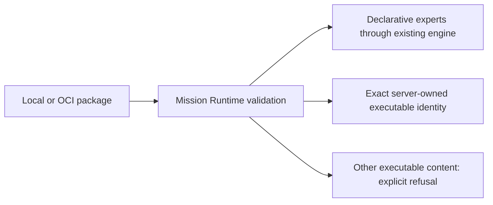

# Phase 76.2 — Completed investigation and review rounds

**This is design-stage evidence, not Phase 76 completion.** Implementation, publication,
deployment and default-path acceptance have not occurred. Current decisions and next work live
in [the active contract spoke](phase-76.2-unified-cloud-run-contracts.md).

## Read-only baseline investigation

On 2026-10-09 the supervisor and fixed implementer inspected owning READMEs and source across
forge-mcl, forge-client, forge-conversations, forge-runner, forge-platform and forge-infra.
`git fetch origin` followed by HEAD/origin-main comparison found each inspected Forge checkout
at the intended main baseline with no divergence; no product files were edited.

| Repository | Observed baseline HEAD |
|---|---|
| mission-control-language | `77b6353952aaceb88fe504cf1f71fe639ccdf9af` |
| forge-mcl | `8d28dc1ff8f127facfd708b1c89369179e98cf18` |
| forge-client | `7595a72d0ded3baaf2e78f4d39485d587c15b621` |
| forge-conversations | `e1c5b5bd661ccebaf05fe316d3e5fd512ef2c278` |
| forge-runner | `95d677cb6b74f34f1911af5d3866c8ff5e484688` |
| forge-platform | `85200f9ff8c35b02b9618cb1e95752ecea4849a4` |
| forge-infra | `7d849c92b035866061418daf779a2be8fde29e96` |

| Finding | Named source observation / effect on design |
|---|---|
| Multiple-root primitive already exists | Core `LocalDiskWorkspace(IEnumerable<string>)` and `WorkspaceGuard` support a union; Bob's mission factory takes one root and Projects rejects siblings. Extend those owners rather than building a second broker. |
| Durable package transport is currently narrow | Core `DurableMissionPackageValidator` limits source/experts/count/bytes/kinds/profile; Host admission has a separate 4 KiB definition limit. Package and definition claim-checks plus explicit common budgets are required. |
| Current exec is not an isolation boundary | Core `ExecExpertRunner` inherits environment and runs package command/args. `ContextBuilder` also evaluates `env(...)` in root lets/step bindings. Server-owned execution plus structural env rejection is proposed; arbitrary code requires a separate security decision. |
| Pausable input filtering loses OCR's inputs | Core `PipelineRunner` retains only root parameters, while current OCR root is parameterless. Preserve the validated named-input set in root fingerprint/checkpoint. |
| Checkpoints retain strings and replay skips completed steps | Stable relative paths and per-segment cwd work with current OCR source; outputs must be persisted before pause and rehydrated. This was source inspection, not an executed acceptance test. |
| Existing final/artifact paths suffice | Runner emits final ParticipantMessage then RunStatus; existing ConversationArtifactReference/Artifact facts can be extended. No second terminal-response or artifact vocabulary. |
| Abrupt client death has no automatic cleanup | Host has explicit attach/recover/cancel, but new run is a fresh conversation and no heartbeat expiry closes old work. Record old pending state honestly; never promise recovery by a new invocation. |
| OCI source checkout and published packages differ | CLI/MissionRegistry csproj pin 0.2.1; PowerShell reflection of its DLL found no PullMissionWithDigestAsync. Exact cached 0.4.0 DLL exposes it and PulledMission(Bundle, ManifestDigest). Its nuspec points to `bfc88d869cabc36fbfcbbd34555f3b57e056bce9`. |
| Upgrading OCI alone is insufficient | `gh api` immutable-source reads of that commit found unchecked realm/redirect behavior and missing manifest/layer byte verification. The active spoke defines required existing-library repair; no AOT/live-registry claim is made. |

## Independent design reviews — rounds 1 and 2

Fixed role threads: `phase76_implementer`, `phase76_simplicity`, `phase76_ownership`.
Only one subagent ran at a time. Reviewers were read-only and did not author the design.
Every new round requires the full current artifact and checklist; old PASS does not carry forward.

### Simplicity

| Full checklist item | Round 1 | Round 2 |
|---|---|---|
| New apps or libraries | PASS | PASS |
| Reuse | REVISE: preserve existing final-message path | REVISE: arbitrary-run launch mapping incomplete |
| Multiple code paths | PASS | PASS |
| Legacy paths | PASS: persisted historical data and functional Rooms route are real consumers | PASS |
| Knobs | PASS | PASS |
| Speculative abstractions | PASS | PASS |
| Library choice | REVISE: exact pinned API/auth probe missing | PASS: exact shortcomings and required repair recorded |
| Copy-paste | PASS | PASS |
| Redundant definitions | REVISE: reuse existing artifact DTO/event | PASS |
| Size versus requirement | REVISE: avoid chat terminal-route redesign | PASS |
| Test volume | PASS | PASS |

Round 1 also required concrete public/internal launch and input contracts, chunk ownership/IDs,
binary reads/output/continuation, explicit assets/root/hash rules, actual input semantics, OCI
grammar and producer StepKey. Supervisor revised the complete artifact before round 2.

Round 2's sole remaining simplicity defect: define arbitrary-run MissionVersionId, VersionNumber,
Definition/DefinitionHash and fixed Hands profile, including zero roots; reconcile the independent
Host definition limit. Source evidence: Host `DurableMissionPackageAdmission.cs:15–23`.

### Ownership

Round 1 failed technical completeness: shared-action contracts, single credential persistence
seam, workspace metadata DTO, trusted OCR source/output authority, binary wire/read/continuation
contracts and an honest old-run recovery outcome. Most placement choices already matched owners.
The supervisor revised those contracts before round 2.

| Behavior | Derived owner / round 2 placement | Round 2 |
|---|---|---|
| Parse inputs, text/diagnostics, clean command cut | CLI | PASS |
| Persist CLI settings | CLI ForgeConfig | PASS |
| Persist credentials | Core.Resolution.CredentialStore | PASS |
| Resolve/cache references and bundles | MissionRegistry | PASS |
| OCI HTTP/authentication/digests | Existing Katasec.OciClient | PASS |
| Package/validate language and trace identity | Core | PASS |
| Project identity/declaration | Application Projects | PASS |
| Prepare/admit/reconcile intent | Application Missions | PASS placement; composition inputs incomplete |
| Shared action vocabulary | Application Transport | PASS |
| Attachment lifetime/disposal | Application Sessions | PASS |
| File-tool authority/execution | Client Runtime and Core workspace primitives | PASS |
| Public authentication/proxy | ForgeAPI | PASS |
| Durable wire/content vocabulary | Conversations.Contracts | PASS placement; output-list contract incomplete |
| Durable state/content/receipts/reads | Conversation Host | PASS |
| Providers/trusted OCR/scratch | Runner | PASS |
| Response/step/artifact facts | Runner produces, Host persists/sequences | PASS |
| Usage/settlement | Runner reports, Billing prices/debits | PASS |
| Cancellation/process-death outcome | Missions coordinates, Host owns state, Sessions drains | PASS |
| Deploy pins/configuration | forge-infra | PASS |

Round 2 overall REVISE. No reviewed owner acquired a second unrelated job. Remaining corrections:
the same launch mapping, explicit invocation directory/registry base/credential composition, and
deterministic output IDs plus bounded produced-file continuation. Host command/state guards are
32 KiB/960 KiB (`ConversationGrain.cs:1368–1381`); relying on their late rejection is insufficient.
The supervisor revised those contracts before round 3.

Both reviewers separately kept the Type-1 operator decision open. A technically passing design
review alone cannot approve executable trust or the new binary/public cross-context boundary.

## Later full design reviews

| Checklist | Simplicity round 3 | Simplicity round 4 |
|---|---|---|
| New apps or libraries | PASS | PASS for both contracts and OCI prerequisite |
| Reuse | PASS | PASS for both |
| Multiple code paths | PASS | PASS for both |
| Legacy paths | PASS | PASS for both |
| Knobs | PASS | PASS for both |
| Speculative abstractions | PASS | PASS for both |
| Library choice | PASS | Main technically PASS with stale source wording correction; OCI prerequisite PASS |
| Copy-paste | PASS | PASS for both |
| Redundant definitions | PASS | PASS for both |
| Size versus requirement | PASS | PASS for both |
| Test volume | PASS | PASS for both |

Ownership round 3 independently rechecked all 19 behavior/owner rows and found placement PASS
with no owner gaining a second job. Technical REVISE was one concrete OCR mismatch: a staged
`content.<ext>` makes the existing script produce `content.txt`/`content.pdf`, while the draft
expected `output.txt`/`output.pdf`. The supervisor changed the fixed output contract to the actual
script names without changing trusted code.

Simplicity round 4 independently reviewed the entire current contract and new bounded OCI
prerequisite. It confirmed the prerequisite is necessary irrespective of executable policy and
can proceed independently through Plan/reviews. Its only source-description correction was that
current OCI main lacks the previously published/reverted mission-digest API; the supervisor
changed the active contract from “extend existing” to “add missing API, reuse retrieval.”

Ownership round 4 independently rechecked the complete revised contract and OCI prerequisite:
technical PASS for both. All prior behavior-owner rows passed, plus these prerequisite behaviors:

| Behavior | Owner / round 4 verdict |
|---|---|
| Verified mission bundle/identity retrieval | Existing OCI client / PASS |
| Bounded manifest/blob reads and descriptor/hash verification | Existing OCI client / PASS |
| Challenge exchange, credential handling and scoped token cache | Existing BearerAuth / PASS |
| Credential verification without persistence | Existing OCI client / PASS |
| HTTPS and redirect authority | Existing OCI HTTP/auth boundary / PASS |
| Normal dependency publication and public Native AOT acceptance | Existing publish workflow, supervisor acceptance / PASS |

No competing implementation/new component or second unrelated owner job was found. The reviewer
explicitly accepted independent OCI Plan while cloud Type-1 decisions remain pending; library
acceptance cannot close the full cloud/CLI task. Supervisor locked only the bounded OCI design
at 2026-10-09 19:52:51 UTC and assigned its read-only implementer Plan.

## OCI prerequisite plan reviews

Implementer Plan r1 was recorded before code. Simplicity independently checked all 11 checklist
items: PASS for each (existing owners/dependency, reuse, one path, no insecure legacy path,
bounded caller parameter, one shared byte reader, source generation, no duplicated exchange,
necessary result, bounded scope and meaningful tests). No correction required.

Ownership independently derived all behaviors: verified mission result, shared manifest identity,
schema/layer validation, bounded reads/cancellation, generated models, challenge/token/cache,
verification without persistence, redirect authority, preserved push/expert operations, tests and
publication. Every placement PASS within existing OCI/models/auth/test/workflow owners; no new
component or second job. No correction required.

At 2026-10-09 19:58:50 UTC the supervisor checked scope, security/credential containment, Native
AOT, normal publication and restored-package default evidence, then explicitly approved only
the bounded OCI Plan and assigned the same implementer. Commit/merge/publication remain gated
on current code reviews and evidence. This approval does not settle either cloud Type-1 choice.

OCI product implementation/publication/acceptance subsequently passed; see the [bounded completion record](phase-76.3-oci-integrity-auth_completed.md). Earlier gates above describe their recorded stage, not current outstanding OCI work. Cloud Type-1 choices remain pending.

## Superseded executable proposal — 2026-10-10

The operator rejected this proposed whitelist and chose user-vetted arbitrary code. This text and
the matching image-owned adapter below are historical, never current implementation instructions.
The replacement policy and open redesign work are in the active contract.

## Executable trust — Type-1 proposal requiring operator decision

**Proposed first implementation:** retain arbitrary local/OCI *selection*, with admission policy
owned by Mission Runtime. Expand declarative execution independently of source. For executable
experts, accept only an exact server-owned immutable implementation, initially the existing OCR
expert and its accompanying script. Runner matches the submitted executable content to a digest
of the reviewed implementation shipped in its image; it runs its own copy, never a submitted
command/script. Unknown or modified executable experts fail explicitly before process creation.
The CLI does not maintain this policy or silently substitute an OCR catalog entry for a package.

This preserves the current service's trusted-code boundary and supplies the required OCR case.
It does **not** promise cloud execution of arbitrary uploaded Python/native code. Supporting
that requires a separate isolated compute boundary with no provider keys, managed identity,
broker/store access or host filesystem authority. Merely starting a child process, removing
environment variables, or putting it in the runner container does not establish that boundary.

| Observation | Source |
|---|---|
| Durable packages currently reject `exec`/`onnx` and accept only `llm`/`rule`/`json_extract` | `forge-mcl/src/ForgeMission.Core/Runtime/DurableMissionPackageValidator.cs` |
| Exec starts the declared command with inherited process environment | `forge-mcl/src/ForgeMission.Core/Adapters/ExecExpertRunner.cs` |
| Hosted OCR executes `python3 ./ocr.py`, takes `source_file`, `output_dir`, `mode`, and can create a PDF | `forge-runner/missions/ocr/experts/Ocr/expert.md`, `forge.toml` |
| Runner holds provider credentials and internal service authority | [deployment ownership](../design/deploy.md#topology) |

The decision concerns a service credential/execution boundary, classified Type 1 by
[Security Architecture](../design/security-architecture.md#type-1-versus-type-2-decisions).
[Supervisor workflow scope](../design/supervisor-workflow.md#required-loop) says
“Type-1 decisions go to the operator.” Selection requirements do not settle this executable trust
policy. Operator choice: approve the proposed server-owned executable policy, or include isolated
arbitrary executable compute in this phase's design. The second choice changes infrastructure
scope; it must be designed before implementation rather than inferred by the implementer.

### Superseded image-owned adapter

The trusted executable adapter uses that segment scratch as explicit process cwd and invokes its
image-owned implementation by a fixed absolute script path. It does not change process-wide cwd.
Resume recreates the same relative layout from immutable content refs before Core replay. Cleanup
only disposes that segment's scratch. The read-only implementer probe confirmed relative paths
work with current OCR and Core replay; it did not execute a product acceptance test. Produced
files needed after a pause must be uploaded before that pause and rehydrated at their stable
relative output path: Core skips completed executable steps during replay. Each executable
invocation has its own output path derived from its stable step key/attempt, preventing overwrite.
Core currently hardcodes `exec` routing; a host-supplied execution adapter seam is required before
any trusted executable can run. There is no fallback to `ExecExpertRunner` for an admitted package.

Trusted OCR identity is the tuple of exact expert markdown hash, every declared executable asset's
relative path/content hash and command/args/timeout. Runner builds the allowed
tuple from its reviewed image files, never a client-provided name/digest allowlist. It selects the
fixed OCR adapter only after equality; changed/extra executable assets fail closed. `source_file`
must be a verified named artifact with supported magic bytes/media type. A literal path, package
let/step binding for `source_file`, or override of `output_dir` is rejected. Before process spawn,
the adapter constructs `FORGE_SOURCE_FILE` and `FORGE_OUTPUT_DIR` solely from its own verified
stage/output allocation; it ignores package context for those authority-bearing values. Mode is
validated `text`/`pdf`. Use an explicit environment with only required fixed process/PATH/locale
entries and those three OCR values, no inherited provider keys or managed-identity variables.
This is least privilege for reviewed code, not a sandbox for untrusted executables.

## Operator policy record — documentation validation

2026-10-10 (Dubai): executable trust is decided by the operator, while content ownership is
still an explanation request. The current contract records the verbatim instruction, archives
the rejected image-owned-only design, and makes generic execution redesign/full reviews explicit.
Earlier technical PASS does not carry over to the changed executable contract.

This bounded update is documentation-only: runtime, Native AOT, default-path and UI acceptance
are N/A; no product changes or unused subagent team. No new security/implementation approval is
claimed. Existing OCI acceptance remains valid. Local validation PASS: eight files, 62 local
links/anchors, two JSON examples, balanced fences, top-level-only hub and diff checks.

| Stage | Start (UTC) | End (UTC) | Wall | Evidence |
|---|---|---|---|---|
| Documentation / supervisor / operator policy | Unavailable; not recorded | 2026-10-09 21:13:36 UTC | Unavailable | Recorded decision, superseded proposal archived, local checks PASS |
