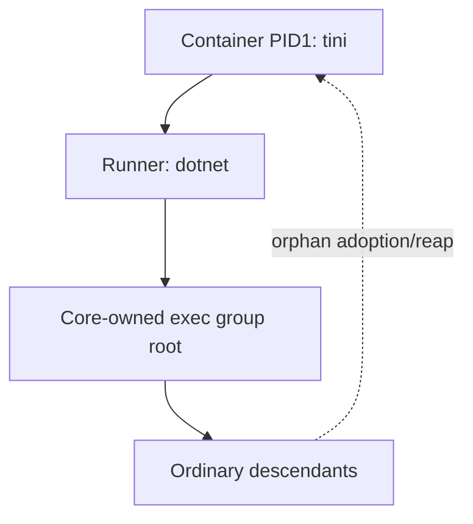

# Phase 76.5 — Runner process hosting prerequisite

**Status: DESIGN LOCKED** 2026-10-10 00:00:19 UTC after fresh full sequential simplicity and
ownership PASS. [Complete six-file plan](phase-76.5-runner-process-hosting-plan.md) approved
2026-10-10 00:06:49 UTC after full current plan reviews. Same implementer owns implementation;
Core verification remains open. No publication/deployment/default PASS yet.
Parent: [Phase 76](phase-76-unified-cloud-run.md). Blocked consumer:
[Core producer](phase-76.4-core-cloud-primitives.md).

## Scope and Done when

Operator requirement, verbatim:

> Please check the next item on the plan which should be Phase 76 for unified cloud execution. Please kick of  the documented supervisor workflow in order to complete the tasks in that phase autonomously.

Deliver the smallest independently reviewable hosting prerequisite for generic exec cleanup:
the Runner container has a standard init owner, and .NET owns only its direct executable
children. Keep persistent Host / ephemeral Runner, arbitrary user-vetted code, all public/wire
contracts, credentials, provider policy and command behavior unchanged. This is an internal
hosting correction within Phase76, not the later Runner package/staging/collection task.

Done when: normal image build proves init is PID1, .NET is its child, direct child exit codes
and SIGTERM forwarding remain correct, and orphaned descendants are reaped. The immutable
merged-main multi-architecture Runner image is published through its existing workflow and
deployed through forge-infra Make/what-if; supervisor observes the normal hosted Chat path
still works and checks deployed process/image provenance. Hosting closes independently at those
observations; it does not wait for downstream Core code or acceptance.

### Downstream Core gate

After hosting closes, the separately revised/reviewed Core plan runs its native public-API probe
under that exact published init-bearing image, observes no surviving descendant/sentinel and
bounded orphan reaping, and retains all four-host/canonical AOT gates. Core remains open until
that observation and all its existing publication/default gates pass. This is a consumer
obligation, not part of this hosting task's Done when.

## Design

Install distribution-packaged `tini` in the existing Runner runtime stage and make its fixed
entrypoint `/usr/bin/tini -- dotnet ForgeMission.Runner.dll`. Tini owns container PID1 signal
forwarding and orphan reaping; Core keeps atomic exec groups, the unreaped direct root, bounded
I/O and cleanup failure reporting. Do not replace .NET signal handlers, add a native supervisor,
add runtime knobs or raise privileges. Core must explicitly refuse Linux PID1 exec before
launch; the supported container path structurally places .NET below init. Remove Core's now
unneeded adopted-child scan in its subsequent reviewed correction. Tini failure fails image
startup; there is no bare-dotnet fallback.

Runner source is `/Users/ameerdeen/progs/forge-runner`; Core remains
`/Users/ameerdeen/progs/forge-mcl`; normal deployment is
`/Users/ameerdeen/progs/forge-infra`. Existing component READMEs and actual Dockerfile/workflows
were inspected before this proposal. No new application project or product package.

## Behavior → owner

| Behavior | Owner / authority |
|---|---|
| Container init, signal forwarding, orphan reaping | Runner image; forge-runner README and Dockerfile.runner |
| Direct executable group lifetime and declared result | Core exec adapter; Core README |
| Image verification/build/publication | Existing forge-runner-image workflow |
| Deployed image selection | forge-infra Make/runbook |
| Durable conversation, inputs and generated files | Existing Host; unchanged |

## Evidence and reuse

| Need | Existing thing checked / decision |
|---|---|
| Explain observed loss of retained root | dc03 native Linux host PASS, actual PID1 FAIL: waitid ECHILD10 after standalone Process.Start; [run38005239137](https://github.com/katasec/forge-mcl/actions/runs/38005239137), job114072387155, raw `/private/tmp/phase76-core-corrections-20261009T231509Z/native-linux-x64-dc03.log` |
| Runtime compatibility fact | CI SDK10.0.401/runtime10.0.12. [.NET10.0.12 pal_signal.c](https://raw.githubusercontent.com/dotnet/runtime/v10.0.12/src/native/libs/System.Native/pal_signal.c) sets reapAll for PID1; ProcessWaitState.CheckChildren performs waitpid(-1), including native-spawned roots. This conflicts with the retained-root design. |
| Standard container owner | [Tini upstream](https://github.com/krallin/tini): PID1 orphan reap, direct-child signal forwarding/exit propagation; distribution apt package supplies `/usr/bin/tini`. First implementation verification must probe these actual image behaviors. |
| Existing packaging | Dockerfile.runner already installs Python/Tesseract/Poppler with apt; reuse that stage/package source. Existing image workflow publishes amd64/arm64 to ACR/public GHCR. |
| Existing duplicates | No init/subreaper/entrypoint wrapper exists in Runner or its deployment configuration. Core must not acquire container-wide reaping or .NET signal ownership. |

The failing base image was aspnet10.0 digest
`sha256:222759b391a1aaf241166672c8f99b2d4ada452e7b5319f3c6e8f265a37b5ad4`.
The test exposed a real incompatibility; no container PASS or init probe is claimed yet.
Supervisor read-only Azure observation: current image is
`crforgeroomsdev.azurecr.io/forge-runner:0.20.5`; `az containerapp exec --name ca-forge-runner-dev
--resource-group rg-forge-dev --command 'cat /proc/1/comm'` succeeded on revision
`ca-forge-runner-dev--0000042`, replica`ca-forge-runner-dev--0000042-845f449d7-2wf6m`, output
`dotnet`. The deployed runtime therefore has the same PID1 topology; this is not inferred from
Dockerfile alone. No environment/secret values were read or changed.

## Failure, security and default gates

| Boundary | Failure/result, recovery and proof |
|---|---|
| Init packaging/start | Missing/failed init stops startup visibly; image build/probe fails before publication. Implementer repairs the image; no fallback. |
| Shutdown | SIGTERM reaches direct .NET child; normal graceful shutdown/exit propagation observed in container and hosted deployment. Init forwards only to its direct child, with no group-wide option. |
| Exec ownership | Core refuses unsupported bare Linux PID1 before child launch. Supported init-bearing path retains group identity until its own root reap, and preserves unrelated .NET child exit ownership. No global handler override or waitpid(-1) in Core. |
| Orphans | Init is the reaping owner. Probe separately observes stopped execution/no late sentinel and process entries disappearing within a fixed bounded verification deadline; it does not claim Core synchronously reaped init's children. |
| Publication/deployment | Existing immutable image routes; fresh unused version selected before publication. Exact manifest/platform digest recorded. Deployment uses only normal forge-infra Make/what-if; failed checks leave prior deployment unaccepted. |

Security: Tier2 Runner process topology only; no public entry point, service contract, datastore,
managed identity, secret scope, capability permission or new privilege. Init shares the existing
container identity and filesystem. Host remains sole durable owner; Runner remains ephemeral.
This is Type2 app placement: reversal is the Dockerfile entrypoint/package change plus image
selection, allowed only after a supported replacement proves equivalent reaping and direct-root
identity preservation. No security invariant is relaxed. UI/visual acceptance N/A.

Default path: normal merged-main Runner image from the existing image workflow, selected in
forge-infra's existing parameter file and deployed by the owning Make layer after what-if.
Supervisor uses a dedicated disposable Project through installed CLI, saved login and normal
ForgeAPI, with endpoint/build overrides absent; actual Chat reply and terminal completion plus
deployed image/process observations are required. Component/container probes are lower-layer
evidence, explicitly separate. No branch image or overridden entrypoint closes the default gate.

## Principles that changed a decision

| Designer rule | Concrete choice |
|---|---|
| 1/2 — fixed convention/one path | Init is the image entrypoint, not an operator flag or test-only launch. |
| 3/8 — reuse/right-size library | Standard distribution tini handles actual container duties; no new Core reaper framework. |
| 4/10 — one owner/structural safety | Container init owns orphan reaping; Core owns its direct exec root and group. |
| 7/11 — minimum needed/proven done | One hosting increment; exact published/deployed image and process observations required. |

## Rejected alternatives

- Swallow ECHILD or continue signalling a stale numeric root: destroys the retained-identity guarantee.
- Override .NET's global SIGCHLD handler/reaper: interferes with unrelated Process owners.
- Skip PID1 checks or pass `docker --init` only in tests: leaves the normal Runner image broken.
- New native helper, process framework or kernel-version-specific signal path: larger, less portable than standard init ownership.

## Open questions

None in the hosting behavior. Full design reviews passed. The implementer's subsequent read-only
plan must name exact existing-file image verification and normal CI commands before approval;
no image/CI/product edit is authorized by this proposal. Core r7's raw-PID1 adopted-reap choice
is superseded by this locked design; source edits still require a full revised Core plan approval.
Preserve all other Core contracts and current verification corrections.

Full current design r9: simplicity11 checks PASS, ownership15 behaviors and gates PASS;
[review tables and stage boundaries](phase-76.5-runner-process-hosting_completed.md#design-reviews).
Supervisor independently checked the complete design, source/runtime failure evidence, ownership,
failure/security/default gates and closure dependency before lock. Implementation remains gated.
