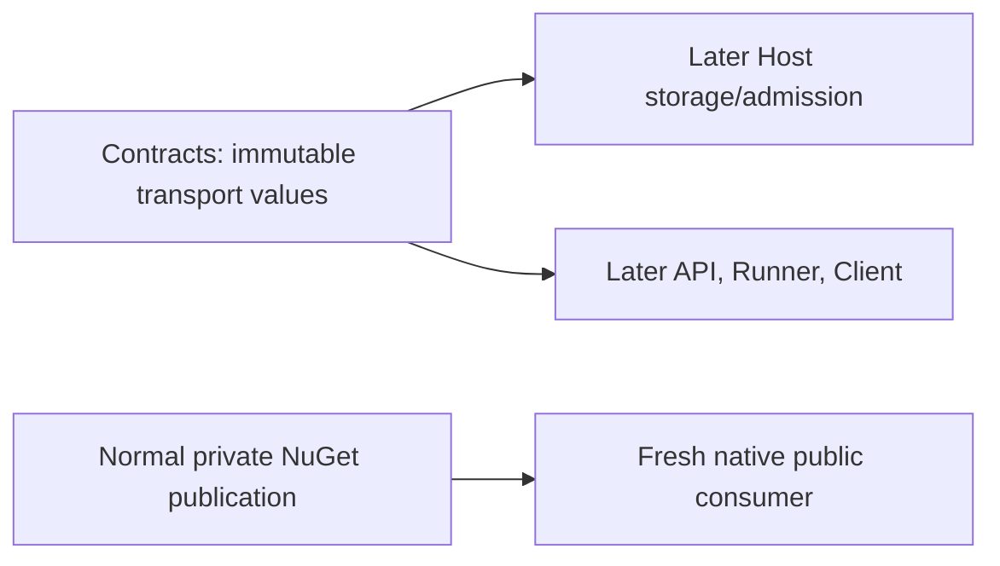

# Phase 76.6 — Mission content contract producer

**Status:** DESIGN LOCKED2026-10-10 05:00:09UTC after both full current independent reviews PASS.
Implementation not approved. Scope/design starts2026-10-10 04:54:53UTC.
Core and OCI producers plus Runner hosting are verified.

## Scope

Operator requirement, verbatim: "Please check the next item on the plan which should be Phase 76
for unified cloud execution. Please kick of  the documented supervisor workflow in order to
complete the tasks in that phase autonomously."

This small dependency increment publishes the transport-neutral binary-content values already
locked in [the parent contract](phase-76.2-unified-cloud-run-contracts.md#named-inputs-binary-content-and-transfer).
Owning product repository: `/Users/ameerdeen/progs/forge-conversations`, component
`src/ForgeMission.Conversations.Contracts`. Documentation: `/Users/ameerdeen/progs/mission-control-language`.
It adds no storage/HTTP/broker implementation, admission behavior, existing request/reply change,
asset/trace migration, client operation, UI, permission policy or deployment. Those require their
own bounded reviewed tasks. Arbitrary user-vetted code and persistent Host/ephemeral Runner stay locked.

## Design

Add the exact content-reference, named-input and chunk/query request vocabulary to the existing
dependency-free Contracts package and its one generated JSON context. Publish Contracts0.9.0
through the existing package workflow, verifying both built packages but publishing only changed
Contracts. Presentation stays0.8.0 and is not republished. Existing APIs/constructors/enum ordinals
and runtime writers remain unchanged. This is a producer dependency, not a second runtime path.

| Type | Exact shape |
|---|---|
| `MissionContentKind` | `Input=0`, `Output=1`; JSON names `input`, `output` |
| `MissionContentReference` | `(ContentId: Guid, ByteLength: long, Sha256: string, ContentType: string, Kind: MissionContentKind)` |
| `MissionNamedInputs` | `(Strings: Dictionary<string,string>, Artifacts: Dictionary<string,MissionContentReference>)` |
| `StageMissionContentChunkRequest` | `(ConversationId: Guid, OwnerCommandId: Guid, Slot: string, Reference: MissionContentReference, Index: int, Count: int, Bytes: byte[])` |
| `GetMissionContentRequest` | `(ConversationId: Guid, ContentId: Guid)` |
| `MissionContentLimits` | Fixed `MaxContentBytes=100*1024*1024`, `MaxInputCount=32`, `MaxInputBytes=100*1024*1024`, `MaxDescriptorBytes=32*1024`; use existing `ConversationBodyLimits.ChunkBytes=192*1024`, not a second chunk constant |

Names/types are case-sensitive as above; generated JSON uses existing camelCase/null omission/string
enum policy. `Bytes` is base64 in HTTP JSON, not a new binary-body implementation. This increment
does not add message names to the active command/query registries or promise a working route.
Descriptors are inert data: an instance does not authorize a read, prove content integrity, or grant
local capability. Host later validates member/conversation ownership, hashes, kinds, cross-map names,
bounds and adoption before dispatch, using the locked parent rules. No competing validation framework
or chunk algorithm is introduced. Deterministic IDs reuse `ConversationDeterministicIds.Body` later.

| Behavior → owner | README evidence |
|---|---|
| Shared values and generated wire metadata | [Contracts Why/Owns](https://github.com/katasec/forge-conversations/blob/main/src/ForgeMission.Conversations.Contracts/README.md): stable vocabulary without HTTP/Orleans/Azure/execution coupling |
| Package verification/publication | Existing forge-conversations workflow and eng verifier; no new publisher |
| Later binary durability/authorization/adoption | [Host Owns](https://github.com/katasec/forge-conversations/blob/main/src/ForgeMission.ConversationHost/README.md); expressly excluded here |

| Need | Existing thing checked / reuse |
|---|---|
| Binary descriptor | ConversationBodyReference is UTF-8-only/int-sized; keep its semantics and add the locked binary value |
| Named values | No MissionNamedInputs/content types found across named Forge repos; add only parent-defined values |
| Serialization | Existing ConversationContractsJsonContext/source generation; no dependency/reflection serializer |
| Chunk size/identity | Existing body limits and Body IDs; no duplicated helper/constant |
| Delivery | Existing publisher/verifier is hard-coded to both0.8.0; narrowly select new Contracts0.9.0 while auditing unchanged Presentation0.8.0 |

## Gates and failure boundaries

| Gate / failure | Decision and verification |
|---|---|
| Security ownership/tiering | Existing Conversation bounded context owns values and later data. Public API/Host/broker/store/identity/roles are unchanged here; no cross-store access or new credentials. Type1 content boundary is already operator-approved and parent-locked. |
| Engineering | One values owner/JSON path; fixed required bounds; no new service, option, helper framework or validation policy. |
| Malformed JSON | Existing System.Text.Json exception contract; round-trip exact bytes/long/enums and reject malformed base64/unknown string kind with no effects. Semantic invalid descriptors remain Host admission's later responsibility. |
| Publication conflict/outage | Existing immutable-version preflight and private/repository verification fail explicitly; supervisor retries only transport failure, never overwrites0.9.0. Recheck package inventory before publishing. |
| UI | N/A: no visual surface change. |
| Default | Normal merged-main private NuGet publication; fresh isolated-cache PackageReference-only consumer/no sibling source/DLL swap, then zero-warning Native AOT executable using all new generated types. No deployed runtime behavior is claimed. |

Package inventory04:54:53UTC: Contracts and Presentation latest0.8.0,0.9.0 absent. Baseline
forge-conversations clean main`e1c5b5bd661ccebaf05fe316d3e5fd512ef2c278`; no local AGENTS.md.
Existing Host Core0.1.1 pin and existing consumers stay unchanged in this additive producer task.
No package consumer can assume new Host routes until later runtime delivery.

Designer principles that changed choices: minimum needed restricts this increment to content values;
one owner keeps transport types in Contracts; no NIH reuses JSON/publisher/body limits; built-in safety
retains immutable publication and denies any authority implication; verified means a normally restored
published Native AOT consumer. No new library: existing AOT-compatible System.Text.Json suffices,
with a real native probe required before acceptance. Rejected alternatives: republish unchanged
Presentation (immutable conflict/unneeded release); relax text-body validation (conflates contracts);
implement routes here (broadens the task); DTO validation framework (duplicates later owner policy).
Open design questions: none. Exact files/release-script details belong in the reviewed implementer plan.

## Done when

1. Exact additive types, fixed limits and generated JSON are implemented in Contracts; focused/full
   checks and final Native AOT verification pass with zero warnings; old public shapes stay intact.
2. Full sequential design, plan and code reviews pass; supervisor independently checks diff/evidence.
3. Product PR is merged and Contracts0.9.0 normally published privately with merged-source provenance;
   a fresh normal-feed PackageReference consumer exercises exact types/bytes/limits in Native AOT.
4. Stage boundaries, product PR times and postmerge acceptance are recorded, docs closure merged,
   touched repos clean on current main. Next is Host content storage/admission, not phase completion.

## Current work

| Stage | State |
|---|---|
| Supervisor design | Locked05:00:09UTC after complete current simplicity/ownership PASS; [evidence](phase-76.6-mission-content-contracts_completed.md#design-reviews) |
| Plan / implementation | Implementer plan next; no product edit authorized |
| Publication / default acceptance | Not started |
