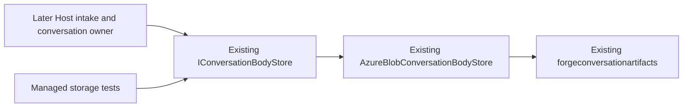
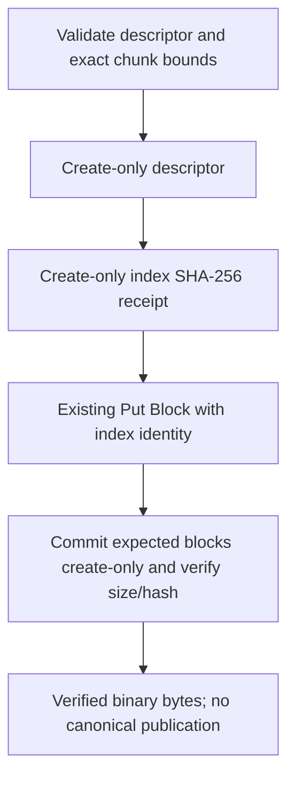

# Phase 76.7 — Host binary content storage primitive

**Status:** Supervisor design, not yet locked or implementation-approved.
Scope start2026-10-10 05:38:26UTC after content producer docs PR381 merged05:38:05UTC as
`fd059b844657d046686d827da8d08743d01c39af`. Product baseline forge-conversations clean main
`d4d013e577e4e57f3eaf3310527094b5d2dfa851`; no product edits authorized yet.

## Scope

Operator requirement: "Please check the next item on the plan which should be Phase 76 for unified cloud execution. Please kick of  the documented supervisor workflow in order to complete the tasks in that phase autonomously."
Clarifications: "Agreed - convo host - persistent. Runner ephermeral", "Don't NIH",
"Orleans supports blob storage", "And we already use it I belive".
Maintenance principle: "Remember always - the less code we write the less to maintain and the better - always reuse, outsource etc".

Deliver the next small Host-owned dependency for persistent files: binary stage/verify/read
operations in the existing Blob adapter. This is an internal producer primitive with no active
runtime caller yet. It does **not** activate HTTP/broker routes, admission, canonical adoption,
artifact facts, expiry scheduling, Runner/Client/CLI behavior or deployment. Those remain explicit
future tasks. No user-visible cloud file feature is claimed from this increment.

Owning repo `/Users/ameerdeen/progs/forge-conversations`, existing ConversationHost persistence
component. Existing Contracts0.9.0 supplies the descriptor/limits/generated JSON. No package
version/publisher change, Core upgrade, new service/interface/store/credential or infrastructure.
The operator's arbitrary user-vetted code/persistent Host/ephemeral Runner decisions remain locked.
Managed builds and tests only; AOT is final phase delivery, not testing. No extra Docker/native
consumer route. Existing normal PR managed verification retains its required Azurite fixture.

## Design

Extend `IConversationBodyStore` and `AzureBlobConversationBodyStore`, the Host's one Blob seam,
with binary operations while preserving text behavior. Immutable descriptor and per-index hash
receipts contain retries; existing block upload/create-only assembly and SHA-256 provide the
payload. No decoding/re-encoding of binary data. Storage verification does not grant authority
or publish a canonical conversation reference.

| Internal API | Exact contract |
|---|---|
| Outcome | Reuse existing Host-local `BodyCommitOutcome` (`Committed`, `Incomplete`, `Conflict`); no new enum or wire type |
| `StageContentAsync` | `Task<BodyCommitOutcome>(ConversationAddress address, MissionContentReference reference, int index, ReadOnlyMemory<byte> bytes, CancellationToken ct)` |
| `CommitContentAsync` | `Task<BodyCommitOutcome>(ConversationAddress address, Guid expectedOwnerId, string slot, MissionContentReference reference, CancellationToken ct)` |
| `ReadContentAsync` | `Task<byte[]>(ConversationAddress address, MissionContentReference reference, CancellationToken ct)`; verified exact bytes or existing `ConversationBodyUnavailableException` |

`Committed` on stage means this chunk is durably staged; on commit it means the complete payload
is verified and stored. These are the parent design's Accepted outcome, never adoption or a
canonical grain transition. Clarify the existing enum documentation for both operations, without
changing existing values or text behavior. A future caller must first establish ownership and
serialize adoption/expiry through the conversation owner. No interface default implementations.

### Keys, identity and retries

Fixed keys under `{escaped-tenant}/{conversationId:N}/contents/{contentId:N}/`:
`descriptor` stores generated descriptor JSON; `receipts/{index:D6}` stores the chunk's lowercase
SHA-256 as ASCII; `payload` is the assembled block blob. No supplied path is accepted.
Descriptor and receipts use Azure `IfNoneMatch=*`; existing identical bytes reuse the receipt,
different descriptor/receipt returns Conflict before changing payload blocks. This includes
concurrent conflicting first writers. Persist receipts before Put Block: a failed block write
can retry the same bytes; a commit while a block is missing remains Incomplete.

Use existing `ConversationBodies.Sha256Hex`, `ConversationBodyLimits.ChunkBytes/ChunkCount/ChunkLength`
and block-index encoding. Bounds use validated `(int)reference.ByteLength` only after checking
0..100MiB. Existing ChunkCount already returns1 for an empty file; empty stage still persists
descriptor/empty-hash receipt and skips Put Block, then commits an empty list into a zero-byte payload.
Empty commit requires that descriptor and index0 empty-hash receipt; otherwise Incomplete.
Do not invent a second chunk algorithm, text limit or UTF-8 binary conversion.

Commit requires nonempty expectedOwnerId/slot and
`ContentId == ConversationDeterministicIds.Body(expectedOwnerId, "mission-content/" + slot)`.
Slot is used only for identity, never a Blob path. Later intake owns the input-name/output-slot
grammar, member/conversation checks, active-run checks and input/output authority. Their absence
here is deliberate scope, not permission for future callers to skip them.

### Validation, assembly and reads

Before I/O, reject malformed references/chunks with `ArgumentException` (including derived argument
exceptions): nonempty content ID, defined Input/Output kind, nonnegative length≤100MiB,64lowercase
hex SHA-256, nonempty parseable media type without CR/LF, generated descriptor≤32KiB; index within
the existing chunk count and exact expected chunk length. The internal contract accepts only
validated values; future intake translates caller errors into its locked HTTP/broker statuses.
Do not make a validator framework or add knobs.

Missing descriptor/required receipts/chunks on commit is Incomplete. An existing payload with
matching descriptor, exact size and hash returns Committed, including repeated empty commits.
A different descriptor or differing existing payload is Conflict and never overwrites/deletes
that existing payload. Assemble through existing block
helpers; then verify exact size and hash. A newly assembled mismatching candidate is removed
conditionally by its own ETag and returns Incomplete; retain descriptor/receipts so changing
already-received bytes remains a conflict. Recovery for a bad first upload uses a new owning
command/identity, not an overwrite. Storage/network/cancellation errors propagate for the owning
caller's retry; no log-and-success.

Binary download must inspect actual content length before allocating, read exactly the bounded
expected bytes and verify hash; no unbounded DownloadContent allocation from a corrupt oversized
blob. Read requires the exact immutable descriptor as well as payload integrity. Missing/corrupt
data throws the existing unavailable exception, never empty success. An actual zero-byte payload
returns an empty array after its SHA-256 check. Fresh adapter instances must see the same receipts,
payload and conflicts; no in-memory receipt cache or process-disk persistence.

Descriptor creation time is retained by the immutable Blob object. Future Host-owned24h sweep
will enumerate these identities and serialize deletion against canonical reference acceptance;
**no expiry worker or deletion of adopted content is implemented in this primitive task**.
Receipts are small durable idempotency metadata, not another copy of file bytes.

## Ownership and reuse

| Behavior | Owner/evidence |
|---|---|
| Binary persistence/integrity and immutable receipts | Existing Host; README Why:15/Owns:19; same adapter/container as text |
| Descriptor/limits/JSON | Existing Contracts0.9.0; README:19; unchanged here |
| Future authority/adoption/expiry and public routes | Host conversation owner + ForgeAPI; parent locked design; excluded here |
| Verification | Existing ConversationHost.Tests/Azurite fixture/normal PR verify workflow |

| Need | Existing thing checked / choice |
|---|---|
| Blob client/store | Existing IConversationBodyStore/AzureBlobConversationBodyStore; extend, no competing seam |
| Orleans Blob provider | Orleans supports Azure Blob grain-state persistence. Actual Host Program.cs44 uses the existing Azure SDK body adapter; Program.cs82 uses CustomStorage journal consistency with the existing Table event store. No AddAzureBlobGrainStorage is configured. Reuse the existing content adapter instead of changing grain persistence or introducing another provider |
| Blocks/commit/hash/empty chunks | Existing methods and Contracts helpers; narrowly share primitives, text semantics unchanged |
| Conflicting retries | Existing text Put Block overwrites uncommitted index bytes; insufficient for new409contract. Add tiny create-only hash receipt before the same block operation |
| Descriptor persistence | Existing generated MissionContentReference JSON; no private JSON schema/context |
| Read failure | Existing ConversationBodyUnavailableException; reuse |
| Operation outcome | Existing BodyCommitOutcome; clarify operation-specific Committed meaning rather than duplicate its three states |
| Test seam | Existing AzuriteFixture.BodyStore/new adapters; update the sole NoBodyStore stub explicitly for added methods |

## Gates and evidence

| Gate/failure | Locked answer |
|---|---|
| Security/tiering | Only existing tier2Host touches its own existing Blob container via existing identity/config; no public entry point, new role/secret, cross-store access or direct API/Runner data access |
| Engineering | One store/adapter/SDK path; fixed current limits; create-only receipt and conditional candidate cleanup contain conflicts; no abstraction/framework/library added |
| Wrong/missing content | Explicit Conflict/Incomplete/unavailable; never canonical publication or wrong-byte success |
| Transient failure | Exception/cancellation propagates; exact retry through durable receipts; no inference of successful adoption |
| Default-path applicability | No active runtime/user/integration/deployment behavior changes: internal producer only. The Default-Path Acceptance evidence-layer rule permits contract tests when the task itself has no runtime/user path. N/A for a new default route; real Azurite managed tests prove only this storage boundary, not deployed file support |
| UI/native/deployment | N/A here; native final-phase-only by operator instruction |

Managed verification must cover empty/non-UTF8 data, multi-chunk data>4MiB, reverse order and exact
retries and matching repeated commit, empty commit without its receipt (Incomplete), fresh adapter,
tenant/conversation isolation, conflicting descriptor/bytes/concurrent first
writers, missing blocks, wrong whole hash/conditional cleanup, corrupt/missing stored reads,
invalid/over-limit references/chunk bounds before mutation and cancellation without false success.
Retain all existing text tests. Local managed Debug/Release builds zero warnings; normal existing
PR workflow unfiltered full Release/Azurite suite required, zero compiler warnings/skips/failures.
No local extra container/native route or new workflow. Tests target meaningful integrity boundaries,
not another copy of DTO wire tests.

Designer principles that changed choices: no NIH/one owner extends the one adapter; built-in safety
adds immutable hash receipts instead of relying on remembered retry discipline; minimum restricts
this task to unused storage primitives; no duplicate paths shares block mechanics; no new library
uses the proven Azure SDK/generated JSON; verified means real managed storage observations with
honest no-runtime/default scope. Rejected: raw chunk sidecar copies (duplicate file storage),
uncommitted-block overwrite alone (cannot reject conflicting first writers), binary UTF-8 conversion
(corrupts bytes), routes/sweep/admission here (broader separate runtime task).
Open design questions: none for this bounded primitive. Later canonical lifecycle integration
remains unimplemented and cannot be called complete from these tests.

## Done when

1. Exact internal stage/commit/read contract and immutable binary storage are implemented in the
   existing seam/adapter; existing text behavior is unchanged and all named positive/negative
   managed storage observations pass with zero warnings.
2. Full sequential design/plan/code reviews pass and supervisor independently checks the diff,
   raw normal PR CI and scope. No AOT testing or new runtime routes/deployment claims.
3. Product PR and evidence/timing documentation close through normal reviewed merges; touched
   repos clean on current main. Next is Host content admission/canonical lifecycle integration.
