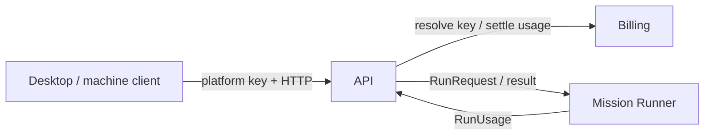

# Forge API

## Purpose

Offer the public platform-key execution door while keeping account authority and mission compute behind separate boundaries.

## Why this exists

External clients need one authenticated request boundary that can validate a platform key, enforce credit policy, proxy mission execution, and settle the resulting usage.

## Owns

- API route composition, platform-key request authentication, mission catalog/execution proxying, and API-side artifact/run projections.
- Translating accepted platform requests into the Runner contract and Billing settlement calls.

## Does not own

- Platform-key and ledger storage rules (Billing owns them) or provider-backed execution (Runner owns it).
- Rooms persistence, durable Conversation state, Desktop/Application stores, or Bob’s local policy and capability execution.

## Change admission

A change belongs here only if it advances this component’s reason for existence.

For account storage/pricing or mission execution behavior, compose with Billing or Runner instead.

## Use these pieces

- [API composition and health entry point](Program.cs)
- [Mission routes](MissionEndpoints.cs), [execution service](MissionExecutionService.cs), and [platform-key filter](PlatformKeyAuth.cs)
- Boundary coverage: [auth filter](../ForgeMission.Rooms.Tests/Api/PlatformKeyAuthFilterTests.cs), [execution](../ForgeMission.Rooms.Tests/Api/MissionExecutionServiceTests.cs), and [tool continuation](../ForgeMission.Rooms.Tests/Api/MissionExecutionToolRoundTripTests.cs)

## Communicates with

## Important flows and constraints

- The API resolves a platform key at the edge; the Runner never receives the key or accesses the ledger.
- A client token makes API-side settlement retry-safe; it is not a general transaction coordinator.
- This project is not the Tier-1 Conversation adapter: it must not access Conversation Table/Blob state directly.

## Related documentation

- [Security architecture](../../docs/design/security-architecture.md)
- [Durable conversations](../../docs/design/durable-conversations.md)
- [Phase 43.23 completed ownership evidence](../../docs/phases/phase-43.23-domain-ownership_completed.md)
