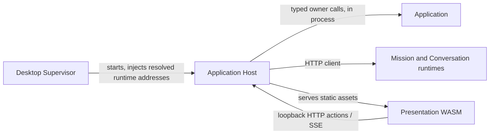

# Application Host

## Purpose

Runs the local Application surface on an OS-assigned loopback address and serves its static presentation assets.

## Why this exists

The browser-facing transport and Application composition need one thin executable boundary. Separating it prevents HTTP, JSON, readiness, and static assets from leaking into domain owners or the Desktop Supervisor.

## Owns

- The [`Program`](Program.cs) composition root, loopback binding, source-generated JSON setup, named runtime clients, static assets, and `/ready`.
- Typed `/transport/*` HTTP routes and `/transport/events` SSE binding in [`ApplicationEndpoints`](Transport/ApplicationEndpoints.cs).
- SSE subscribers in [`ApplicationEventHub`](Transport/ApplicationEventHub.cs).

## Does not own

- Project and conversation rules, capability policy decisions, mission execution, process supervision, native windows, or a generic request dispatcher.

## Change admission

A change belongs here only if it advances local HTTP/SSE hosting or composition. For a product action compose with its typed Application owner; for child startup/cleanup change `ForgeMission.Desktop`.

## Use these pieces

- [`Program.Main`](Program.cs) is the executable entry point and emits the retained `FORGE_CLIENT_RUNTIME_URL=` readiness marker.
- [`MapApplicationTransport`](Transport/ApplicationEndpoints.cs) binds each transport action to its typed owner.
- [`ApplicationHostRouteBoundaryTests`](../ForgeMission.Tests/Architecture/ApplicationHostRouteBoundaryTests.cs) protect the no-generic-dispatcher boundary.

## Communicates with

## Important flows and constraints

- It always binds `http://127.0.0.1:0`; the Supervisor discovers the assigned address from the retained readiness marker.
- Runtime URLs and the platform credential are injected by the Supervisor; they are not user-facing Host ownership.
- Event JSON uses the separate conversation relay context; do not merge it with numeric application DTO serialization.

## Related documentation

- [Default-path facts](../../docs/design/default-path-acceptance.md#current-default-facts)
- [Application Host boundary](../../docs/retrospectives/phase-43-domain-ownership/end-state.md#actors-and-boundaries)
