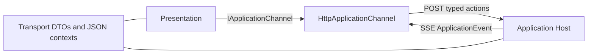

# Application Transport

## Purpose

Defines the stable typed actions, responses, events, serialization contexts, and client channel between Presentation and Application Host.

## Why this exists

The client and host need one explicit vocabulary without exposing Application internals or asking UI code to infer routes and JSON rules.

## Owns

- Request/response and event records in [`ApplicationContracts`](ApplicationContracts.cs) and [`ApplicationEvent`](ApplicationEvent.cs).
- AOT-safe JSON contexts and [`IApplicationChannel`](IApplicationChannel.cs).
- The route-mapping HTTP/SSE implementation, [`HttpApplicationChannel`](HttpApplicationChannel.cs).

## Does not own

- HTTP endpoint binding, Application business rules, Project storage, UI state, remote durability, or process lifecycle.

## Change admission

A change belongs here only if it extends the shared typed action/event contract. For a new action change the matching Application owner and Host endpoint together; do not add a parallel client or untyped envelope.

## Use these pieces

- [`IApplicationChannel`](IApplicationChannel.cs) is the surface-neutral action and event client contract.
- [`HttpApplicationChannel`](HttpApplicationChannel.cs) maps supported requests to existing routes and reads SSE events.
- [`ApplicationJsonContext`](ApplicationJsonContext.cs) and [`ConversationRelayJsonContext`](ConversationRelayJsonContext.cs) are the serialization entry points.
- [`ProjectTransportContractTests`](../ForgeMission.Tests/Application/ProjectTransportContractTests.cs) cover the public transport vocabulary.

## Communicates with

## Important flows and constraints

- Numeric application enum values and route/error behavior are compatibility commitments.
- Conversation relay events use their own JSON context and string-enum settings.
- Browser streaming is enabled by the Presentation host hook so a long-lived SSE response is not buffered.

## Related documentation

- [Shared application actions](../../docs/retrospectives/phase-43-domain-ownership/contracts.md#shared-application-actions)
- [Phase 43.23 completion evidence](../../docs/phases/phase-43.23-domain-ownership_completed.md#task-4--ownership-acceptance-and-documentation-2026-09-06)
