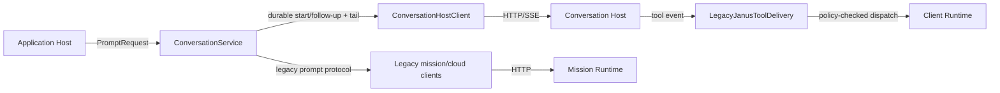

# Application Conversations

## Purpose

Route a live application's prompt to the existing durable or legacy mission protocol while keeping its local conversation/tail lifetime tied to the selected application session.

## Why this exists

Prompt routing needs client-side identity and cleanup, but it must not become a second durable conversation store or a general agent loop. This boundary retains compatible protocol behavior while the remote Conversation Host remains authoritative.

## Owns

- Prompt routing and expected prompt-error publication through [ConversationService](ConversationService.cs).
- One lazily created [ConversationScope](ConversationService.cs) and tail per live durable application session.
- Selection of the existing [legacy mission](../Adapters/Missions/LegacyMissionProtocolClient.cs) or [cloud mission](../Adapters/Missions/LegacyCloudMissionProtocolClient.cs) compatibility client from the configured runtime mode.

## Does not own

- Durable conversation persistence, command admission, or event sequencing — Conversation Host.
- Mission interpretation, expert/model reasoning, and remote execution recovery — Mission Runtime/Worker.
- Capability authorization or execution — Client Runtime, even when a legacy delivery event requests a tool.
- Application session replacement and disposal policy — [Sessions](../Sessions/README.md).

## Change admission

A change belongs here only if it advances the reason this component exists.

For durable conversation state or event storage, compose with or change Conversation Host instead. For mission reasoning or a new run loop, compose with or change Mission Worker instead. For local tool policy, compose with or change Client Runtime instead.

## Use these pieces

- Host-facing prompts enter through [IConversationService](../ApplicationComposition.cs) and [PromptRequest](../../ForgeMission.Application.Transport/ApplicationContracts.cs).
- [ConversationService](ConversationService.cs) uses [ConversationHostClient](../Adapters/Conversations/ConversationHostClient.cs) for durable prompts and the named legacy adapters for mission prompts.
- [Conversation service tests](../../ForgeMission.Tests/Application/ConversationServiceTests.cs), [tail-reader tests](../../ForgeMission.Tests/Application/ConversationTailReaderTests.cs), and [legacy protocol tests](../../ForgeMission.Tests/Application/LegacyMissionProtocolClientTests.cs) verify the retained paths.

## Communicates with

## Important flows and constraints

- A durable scope starts on the first prompt and follows up with the retained conversation ID; session disposal closes its tail.
- Null or `cloud` mode selects the cloud compatibility client; other modes select the retained local client. This is adapter selection, not a new runtime mode.
- HTTP or invalid-operation prompt failures publish the established error event and return an error response. SSE disconnect does not cancel a remote run.

## Related documentation

- [Conversation-management ownership](../../../docs/retrospectives/phase-43-domain-ownership/04-conversation-management.md)
- [Client-conversation orchestration](../../../docs/retrospectives/phase-43-domain-ownership/07-client-conversation-orchestration.md)
- [Compatibility and delivery evidence](../../../docs/phases/phase-43.23-domain-ownership_completed.md#task-3--compatibility-protocol-and-delivery-2026-09-06)
