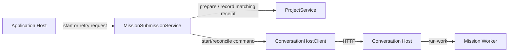

# Application Missions

## Purpose

Turn Project-owned immutable mission versions and user intent into typed durable requests, then reconcile Host acceptance without owning durable state or Project mutation.

## Why this exists

Local user intent must be prepared and recorded independently from remote command admission and Worker reasoning. This boundary makes a lost response recoverable by the same command ID instead of letting a surface invent a second run.

## Owns

- Supported Project Mission names and references in [MissionCatalog](MissionCatalog.cs).
- Start and retry orchestration in [MissionSubmissionService](MissionSubmissionService.cs): prepare local intent, send through the Conversation Host adapter, and record only a matching receipt.
- [MissionConversationService](MissionConversationService.cs)'s Approved-version admission, pinned conversation commands, and Candidate evaluation reconciliation. It resolves immutable Project values and coordinates Host calls; it does not sequence facts or write manifests.

## Does not own

- The Project manifest transaction or selected-mission mutation — [Projects](../Projects/README.md).
- Durable command admission, run state, event sequencing, or model reasoning — Conversation Host and Mission Worker.
- Local capability policy or tool execution — Client Runtime.

## Change admission

A change belongs here only if it advances the reason this component exists.

For Project identity, manifest schema, or journal persistence, compose with or change Projects instead. For durable run scheduling or reasoning, compose with or change the existing remote owner instead. For capability authorization, compose with or change Client Runtime instead.

## Use these pieces

- The Host invokes [IMissionSubmissionService](../ApplicationComposition.cs) with [StartProjectMissionRunRequest](../../ForgeMission.Application.Transport/ApplicationContracts.cs) or [RetryProjectMissionSubmissionRequest](../../ForgeMission.Application.Transport/ApplicationContracts.cs).
- [MissionSubmissionService](MissionSubmissionService.cs) uses [ProjectService](../Projects/ProjectService.cs) and [ConversationHostClient](../Adapters/Conversations/ConversationHostClient.cs), rather than exposing a second remote client.
- [Mission submission tests](../../ForgeMission.Tests/Application/MissionSubmissionServiceTests.cs) cover request identity and recovery behavior.

## Communicates with

## Important flows and constraints

- Start validates and prepares local intent before network work; it does not hold a manifest lease across HTTP.
- A lost acceptance response produces uncertainty; retry reconciles the same command rather than issuing another start.
- A generic durable start requires acknowledgement of the manifest-approved capability profile. Application then re-resolves that exact immutable package, attaches a fresh Bob for that profile, and only then releases the typed start to Host; callers cannot submit a package or tool list.
- A Mission Conversation resolves only the current Approved version before Host admission. Evaluation retains a Candidate's profile as provenance but sends a fixed `NoHands` launch with no Bob attachment, workspace, or terminal declaration.
- MissionCatalog describes supported selection references only. It is not a dynamic catalog, download service, or provider registry.

## Related documentation

- [Mission-selection ownership](../../../docs/retrospectives/phase-43-domain-ownership/02-mission-selection.md)
- [Submission and recovery ownership](../../../docs/retrospectives/phase-43-domain-ownership/03-mission-submission-and-recovery.md)
- [Phase 43.23 contracts](../../../docs/retrospectives/phase-43-domain-ownership/contracts.md#submission-and-durable-ownership)
