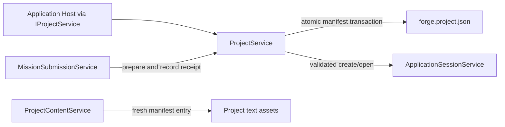

# Application Projects

## Purpose

Keep a Project's local identity and manifest mutations coherent while giving every surface the same typed create, open, select, and content results.

## Why this exists

A Project is durable local domain state, not an execution session or a screen. This owner is separate so one transaction-protected manifest authority can protect identity, selection, and submission receipts without granting a surface or agent arbitrary file access.

## Owns

- Project draft, create, open, validation, authored mission versions/evaluation facts (including the one atomic Pending evaluation intent), and all `forge.project.json` reads and mutations in [ProjectService](ProjectService.cs), [MissionVersionService](MissionVersionService.cs), and the private [ProjectManifestFile](ProjectManifestFile.cs) adapter.
- Built-in mission vocabulary through [MissionCatalog](../Missions/MissionCatalog.cs), and the Project mutation that records a selected mission.
- Immutable submission preparation and acceptance/rejection receipt mutation for MissionSubmissionService.
- Workbench projection and bounded, manifest-identified document access in [ProjectContentService](ProjectContentService.cs).

## Does not own

- Sending or reconciling a mission command — [Missions](../Missions/README.md).
- Running an evaluation or starting a durable mission — the later durable-conversation owner; this component records only frozen package and deterministic result facts.
- Session attachment, local capability authority, or execution — [Sessions](../Sessions/README.md) and Client Runtime.
- Layout, document presentation, or UI choice — Presentation.
- Durable run history and remote event authority — [Runs](../Runs/README.md) and Conversation Host.

## Change admission

A change belongs here only if it advances the reason this component exists.

For mission submission or retry orchestration, compose with or change Missions instead. For a local tool or unrestricted filesystem operation, compose with or change Client Runtime instead. For document rendering, compose with or change Presentation instead.

## Use these pieces

- Host-facing Project actions enter through [IProjectService](../ApplicationComposition.cs) and the corresponding [transport requests](../../ForgeMission.Application.Transport/ApplicationContracts.cs).
- [ProjectService](ProjectService.cs) is the single manifest/write owner; [ProjectContentService](ProjectContentService.cs) resolves a fresh manifest entry before opening content.
- `ProjectService.ResolveApprovedLaunch` answers "may this exact version be granted hands?" across both manifest lanes: the schema-4 `ApprovedMissionLaunches` compatibility array first, then the schema-5 `MissionDefinitions` lifecycle. The authored lifecycle never writes that array, so without the second lane a published version could never be acknowledged. Both lanes require the same exact version id, version number, definition hash, `Approved` state, and active-approved identity.
- `ProjectService.EnsureMissionAssetsAsync` gives a Project the lock file and starter experts a durable package is built from, once. A Project created through the launcher has no assets at all, so without it `MissionPackageBuilder` has nothing to read and promoting a candidate is impossible. It is idempotent and adopts an existing file rather than overwriting it.
- [MissionVersionService](MissionVersionService.cs) additionally answers which versions are startable now (`ListApprovedVersionsAsync`) and what a pinned version is called locally (`ResolveVersionIdentitiesAsync`, matching by version id in any state so a superseded pin still names its mission). `UpdateCaseAsync` corrects a case in place and clears its results, because criteria that changed have not been evaluated yet.
- [Project service tests](../../ForgeMission.Tests/Application/ProjectServiceTests.cs), [content tests](../../ForgeMission.Tests/Application/ProjectContentServiceTests.cs), and [transport contract tests](../../ForgeMission.Tests/Application/ProjectTransportContractTests.cs) prove the boundary.

## Communicates with

## Important flows and constraints

- Draft is pure and reserves nothing. Create/Open are the only authority for final Project homes and session attachment follows successful validation.
- A Project Mission command is immutable once prepared; uncertain receipt persistence retains the same command identity for reconciliation.
- A pending evaluation contains no invented outcome, output, trace, or completion time. Missions reconciles that same Project-owned result only from a terminal Host projection; a pre-admission refusal has an explicit null trace.
- Content access remains limited to manifest-listed entries and retains size, symlink/path, UTF-8, binary, and hash checks. It is not an agent filesystem capability.

## Related documentation

- [Project-management ownership](../../../docs/retrospectives/phase-43-domain-ownership/01-project-management.md)
- [Workbench-content ownership](../../../docs/retrospectives/phase-43-domain-ownership/06-workbench-content.md)
- [Ownership contracts](../../../docs/retrospectives/phase-43-domain-ownership/contracts.md#shared-application-actions)
